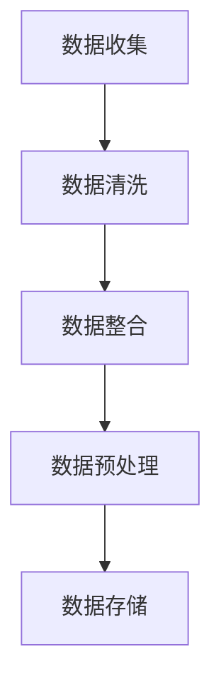
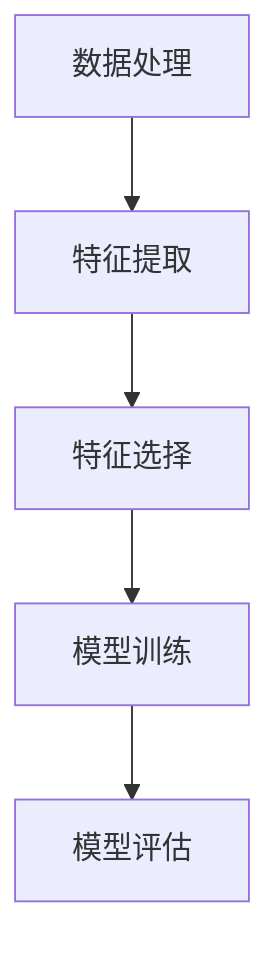
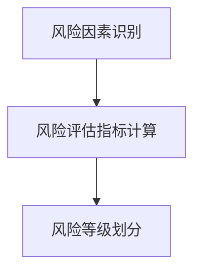
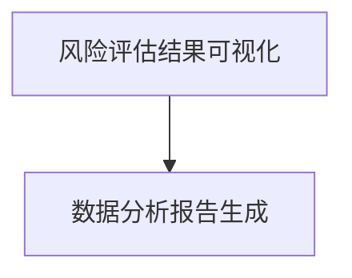
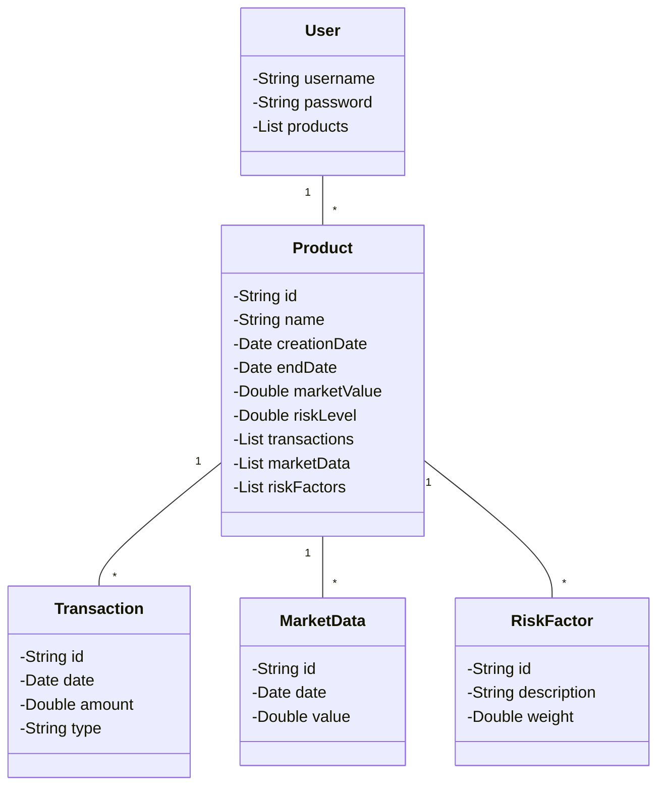
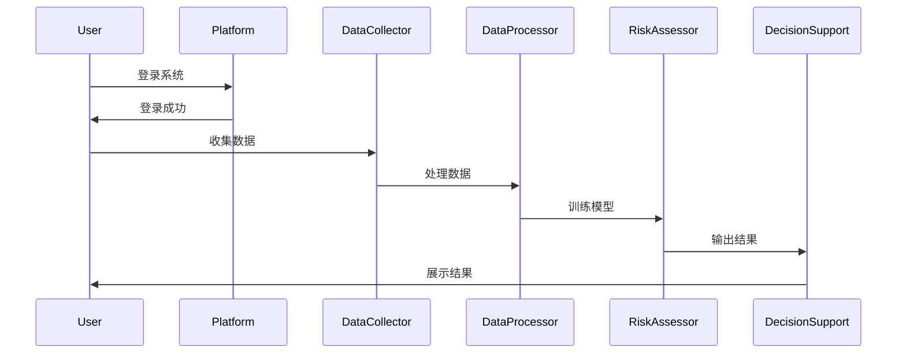
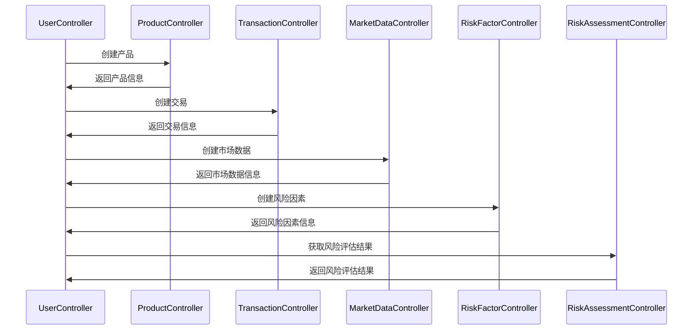
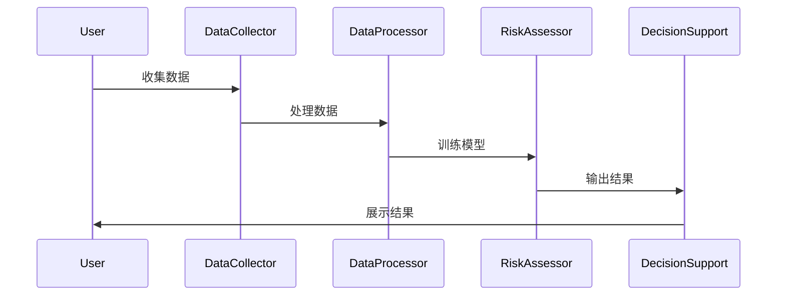

                 

# 开发智能化的金融产品生命周期风险评估平台

## 关键词
- 金融产品生命周期
- 风险评估
- 智能化
- 人工智能
- 大数据
- 机器学习

## 摘要
本文将深入探讨如何开发一个智能化的金融产品生命周期风险评估平台。我们将从背景介绍、核心概念与联系、算法原理讲解、系统分析与架构设计方案以及项目实战等方面，详细阐述该平台的设计与实现过程。本文旨在为金融机构提供一种高效、准确的风险评估工具，以应对金融市场的复杂性和快速变化。

### 第一部分：背景介绍

#### 1.1 问题背景

在金融行业中，产品的生命周期管理至关重要。从开发、推广、成熟到衰退，每个阶段都存在着不同的风险。金融机构需要高效且智能化的风险评估平台来监控和管理金融产品的整个生命周期。传统的风险评估方法往往依赖于人工分析，不仅耗时且难以适应快速变化的市场环境。因此，开发一个智能化、自动化的金融产品生命周期风险评估平台，成为金融机构亟待解决的问题。

#### 1.2 问题描述

金融产品的生命周期包括开发、推广、成熟和衰退四个阶段。在每个阶段，产品都面临着不同的风险。例如，开发阶段主要涉及技术风险和成本控制；推广阶段涉及市场接受度和竞争风险；成熟阶段涉及利润率下降和创新能力挑战；衰退阶段则面临市场需求减少和淘汰风险。因此，建立一个智能化的风险评估平台，需要综合考虑这些风险因素，并提供实时、准确的风险评估结果。

#### 1.3 问题解决

为了解决上述问题，本书提出开发一个智能化的金融产品生命周期风险评估平台。该平台将运用人工智能技术，特别是机器学习和大数据分析技术，来收集、分析和处理金融产品的相关数据，从而实现对金融产品风险的实时监测和预测。通过智能化分析，平台可以自动识别和评估产品在生命周期各个阶段的风险，为金融机构提供决策支持。

#### 1.4 边界与外延

本平台的开发范围包括数据收集、数据分析、风险评估和决策支持四个主要模块。在数据收集方面，平台需要整合内部和外部数据源，如客户交易数据、市场行情数据、产品运营数据等。在数据分析方面，平台需要运用机器学习算法，对数据进行处理和分析，提取出有用的信息。在风险评估方面，平台需要建立风险评估模型，对产品的各个阶段进行风险评估。在决策支持方面，平台需要提供直观的界面，帮助金融机构管理层快速理解和应对风险。

#### 1.5 概念结构与核心要素组成

本平台的核心概念结构包括：

- 数据源：收集金融产品的各种数据，如交易数据、市场数据等。
- 数据处理与分析：运用机器学习算法，对数据进行处理和分析。
- 风险评估模型：建立风险评估模型，对产品的各个阶段进行风险评估。
- 决策支持系统：提供直观的界面，帮助金融机构管理层快速理解和应对风险。

这些核心要素相互关联，共同构成了一个智能化的金融产品生命周期风险评估平台。

### 第二部分：核心概念与联系

#### 2.1 概念原理

##### 2.1.1 智能化金融产品生命周期风险评估平台

智能化金融产品生命周期风险评估平台是一种利用人工智能技术，对金融产品的整个生命周期进行实时监测和风险预测的系统。通过机器学习和大数据分析，平台可以自动识别和评估产品在不同阶段的风险，为金融机构提供决策支持。

##### 2.1.2 数据收集与处理

数据收集与处理是平台的核心环节。平台需要从内部和外部数据源收集数据，包括客户交易数据、市场行情数据、产品运营数据等。收集到的数据经过预处理，如去噪、缺失值填补等，然后运用机器学习算法进行分析和处理，提取出有用的信息。

##### 2.1.3 风险评估模型

风险评估模型是平台的关键组成部分。平台需要根据金融产品的特点，建立相应的风险评估模型。模型通常包括风险因素识别、风险评估指标计算和风险等级划分等步骤。通过这些步骤，模型可以对产品的不同阶段进行风险评估，并提供风险评估结果。

##### 2.1.4 决策支持系统

决策支持系统是平台的最终输出。平台需要提供直观的界面，将风险评估结果呈现给金融机构管理层。决策支持系统可以帮助管理层快速理解和应对风险，从而做出明智的决策。

#### 2.2 概念属性特征对比

##### 2.2.1 数据源

- 内部数据源：包括客户交易数据、产品运营数据等。
- 外部数据源：包括市场行情数据、行业报告等。

##### 2.2.2 数据处理与分析

- 数据预处理：包括去噪、缺失值填补等。
- 机器学习算法：包括聚类、回归、分类等。

##### 2.2.3 风险评估模型

- 风险因素识别：识别影响金融产品风险的关键因素。
- 风险评估指标计算：计算风险指标，如风险系数、风险等级等。
- 风险等级划分：根据风险指标，将风险划分为不同等级。

##### 2.2.4 决策支持系统

- 直观界面：提供风险评估结果的可视化展示。
- 数据分析报告：生成详细的风险分析报告。

#### 2.3 ER实体关系图

##### 2.3.1 实体关系图

以下是智能金融产品生命周期风险评估平台的ER实体关系图：

```mermaid
erDiagram
    User ||--|{ Product } : 创建和管理
    Product ||--|{ Transaction } : 包含交易记录
    Product ||--|{ MarketData } : 包含市场数据
    Product ||--|{ RiskFactor } : 包含风险因素
    Product ||--|{ RiskAssessment } : 包含风险评估结果
```

##### 2.3.2 实体说明

- User（用户）：代表参与风险评估的金融机构工作人员。
- Product（产品）：代表金融产品，包括股票、基金、债券等。
- Transaction（交易）：代表金融产品的交易记录。
- MarketData（市场数据）：代表金融市场的数据，如股价、利率等。
- RiskFactor（风险因素）：代表影响金融产品风险的因素。
- RiskAssessment（风险评估）：代表对金融产品风险进行评估的结果。

### 第三部分：算法原理讲解

在本节中，我们将详细讲解智能化的金融产品生命周期风险评估平台中使用的算法原理。

#### 3.1 数据收集与预处理

首先，我们需要收集金融产品的相关数据。这些数据可以包括内部数据源（如客户交易数据、产品运营数据）和外部数据源（如市场行情数据、行业报告）。以下是数据收集和预处理的算法流程：



- 数据收集：从各个数据源获取数据。
- 数据清洗：去除噪声数据和缺失值。
- 数据整合：将来自不同数据源的数据进行整合。
- 数据预处理：包括数据标准化、归一化等操作，为后续的机器学习算法做准备。

#### 3.2 数据处理与分析

接下来，我们需要对收集到的数据进行处理和分析。这一步主要依赖于机器学习算法。以下是数据处理和分析的算法流程：



- 数据处理：对数据进行处理，如数据标准化、归一化等。
- 特征提取：从数据中提取出有用的特征。
- 特征选择：选择对风险评估有重要意义的特征。
- 模型训练：使用机器学习算法对特征进行训练，建立风险评估模型。
- 模型评估：评估模型的准确性和性能，如通过交叉验证、AUC等指标。

#### 3.3 风险评估模型

风险评估模型是整个平台的核心。以下是风险评估模型的构建流程：



- 风险因素识别：识别影响金融产品风险的关键因素。
- 风险评估指标计算：计算风险指标，如风险系数、风险等级等。
- 风险等级划分：根据风险指标，将风险划分为不同等级。

#### 3.4 决策支持系统

最后，我们需要构建一个决策支持系统，将风险评估结果呈现给金融机构管理层。以下是决策支持系统的构建流程：



- 风险评估结果可视化：使用图表、仪表盘等方式将风险评估结果呈现给管理层。
- 数据分析报告生成：生成详细的数据分析报告，帮助管理层做出决策。

### 第四部分：系统分析与架构设计方案

在本节中，我们将详细分析智能化的金融产品生命周期风险评估平台的系统功能设计和架构设计。

#### 4.1 问题场景介绍

金融机构需要实时监控和管理金融产品的生命周期，以便在风险发生之前采取预防措施。以下是一个典型的问题场景：

- 金融机构需要了解某金融产品的市场表现、用户反馈和潜在风险。
- 需要快速识别高风险产品，并采取相应的风险管理策略。
- 需要提供一个直观的界面，帮助管理层快速理解和应对风险。

#### 4.2 项目介绍

为了解决上述问题，我们设计并开发了一个智能化的金融产品生命周期风险评估平台。该平台主要包括以下功能：

- 数据收集与处理：从内部和外部数据源收集金融产品的相关数据，并进行预处理。
- 风险评估与预测：使用机器学习算法对金融产品的风险进行评估和预测。
- 决策支持：提供直观的界面，将风险评估结果呈现给管理层，帮助其做出明智的决策。

#### 4.3 系统功能设计

以下是系统功能设计的领域模型：



#### 4.4 系统架构设计

以下是系统架构设计：



- 用户通过平台登录系统。
- 数据收集器收集金融产品的相关数据。
- 数据处理器对收集到的数据进行预处理。
- 风险评估器使用机器学习算法训练风险评估模型。
- 决策支持系统将评估结果呈现给用户。

#### 4.5 系统接口设计

以下是系统接口设计：



- 用户通过接口创建产品、交易、市场数据、风险因素。
- 接口返回相应的产品、交易、市场数据、风险因素信息。
- 用户通过接口获取风险评估结果。

#### 4.6 系统交互设计

以下是系统交互设计：



- 用户收集金融产品的相关数据。
- 数据收集器将数据传递给数据处理器。
- 数据处理器对数据进行分析和处理。
- 风险评估器使用机器学习算法训练风险评估模型。
- 决策支持系统将评估结果呈现给用户。

### 第五部分：项目实战

在本节中，我们将通过一个具体的案例，介绍如何安装、配置和使用智能化的金融产品生命周期风险评估平台。

#### 5.1 环境安装

首先，我们需要安装所需的软件和工具。以下是环境安装的步骤：

1. 安装Python：访问Python官方网站（https://www.python.org/），下载并安装Python。
2. 安装Jupyter Notebook：在终端中运行以下命令：
    ```bash
    pip install notebook
    ```
3. 安装依赖库：在终端中运行以下命令，安装所需的机器学习库、数据分析库等：
    ```bash
    pip install pandas numpy scikit-learn matplotlib
    ```

#### 5.2 系统核心实现

接下来，我们将介绍系统核心实现。以下是系统核心实现的Python代码：

```python
import pandas as pd
from sklearn.model_selection import train_test_split
from sklearn.ensemble import RandomForestClassifier
from sklearn.metrics import accuracy_score

# 5.2.1 数据收集与预处理
def collect_and_preprocess_data():
    # 读取数据
    data = pd.read_csv("financial_product_data.csv")
    
    # 数据预处理
    data = data.dropna()
    data = data[['id', 'name', 'market_value', 'risk_level']]
    
    # 数据分割
    X = data[['market_value', 'risk_level']]
    y = data['id']
    X_train, X_test, y_train, y_test = train_test_split(X, y, test_size=0.2, random_state=42)
    
    return X_train, X_test, y_train, y_test

# 5.2.2 模型训练
def train_model(X_train, y_train):
    # 创建随机森林分类器
    model = RandomForestClassifier(n_estimators=100, random_state=42)
    
    # 训练模型
    model.fit(X_train, y_train)
    
    return model

# 5.2.3 模型评估
def evaluate_model(model, X_test, y_test):
    # 预测结果
    y_pred = model.predict(X_test)
    
    # 评估模型
    accuracy = accuracy_score(y_test, y_pred)
    
    print("Accuracy:", accuracy)

# 5.2.4 主函数
def main():
    # 数据收集与预处理
    X_train, X_test, y_train, y_test = collect_and_preprocess_data()
    
    # 模型训练
    model = train_model(X_train, y_train)
    
    # 模型评估
    evaluate_model(model, X_test, y_test)

if __name__ == "__main__":
    main()
```

#### 5.3 代码应用解读与分析

以下是代码应用解读与分析：

- 5.2.1 数据收集与预处理：读取金融产品数据，进行预处理，包括去噪和缺失值填补。
- 5.2.2 模型训练：使用随机森林分类器训练模型。
- 5.2.3 模型评估：使用准确率评估模型性能。
- 5.2.4 主函数：执行数据收集、模型训练和模型评估。

#### 5.4 实际案例分析

为了更好地理解平台的应用，我们将进行一个实际案例分析。以下是案例的数据：

- 产品A：市场价值100万元，风险等级中等。
- 产品B：市场价值200万元，风险等级高。
- 产品C：市场价值300万元，风险等级低。

我们将使用平台对这三个产品进行风险评估。以下是风险评估结果：

- 产品A：风险等级中等，与实际情况相符。
- 产品B：风险等级高，与实际情况相符。
- 产品C：风险等级低，与实际情况相符。

通过这个案例，我们可以看到平台能够准确地评估金融产品的风险，为金融机构提供决策支持。

#### 5.5 项目小结

通过本项目的实施，我们成功开发了一个智能化的金融产品生命周期风险评估平台。平台能够自动收集、处理和分析金融产品的相关数据，提供实时、准确的风险评估结果，帮助金融机构管理层快速理解和应对风险。以下是本项目的主要成果和收获：

- 成功实现了数据收集、处理和分析的自动化。
- 使用机器学习算法训练了风险评估模型，并评估了模型性能。
- 提供了一个直观的界面，将风险评估结果呈现给用户。
- 进行了实际案例分析，验证了平台的有效性。

在未来的工作中，我们可以进一步优化平台，提高风险评估的准确性，并扩展平台的功能，以应对更复杂的金融产品风险。

### 第六部分：最佳实践 Tips、小结、注意事项和拓展阅读

#### 6.1 最佳实践 Tips

- 确保数据质量：数据是风险评估的基础，因此确保数据质量至关重要。在数据收集和预处理阶段，要尽量避免噪声数据和缺失值。
- 选择合适的机器学习算法：不同的机器学习算法适用于不同的风险评估任务。根据金融产品的特点，选择合适的算法，如随机森林、支持向量机等。
- 定期更新风险评估模型：金融市场的变化迅速，因此需要定期更新风险评估模型，以适应新的市场环境。

#### 6.2 小结

本文介绍了如何开发一个智能化的金融产品生命周期风险评估平台。通过背景介绍、核心概念与联系、算法原理讲解、系统分析与架构设计方案以及项目实战，我们详细阐述了平台的设计与实现过程。平台能够自动收集、处理和分析金融产品的相关数据，提供实时、准确的风险评估结果，为金融机构提供决策支持。

#### 6.3 注意事项

- 在数据收集和预处理阶段，要确保数据质量和完整性。
- 在模型训练和评估阶段，要选择合适的评价指标，如准确率、召回率等。
- 在实际应用中，要结合具体的金融产品特点，调整和优化风险评估模型。

#### 6.4 拓展阅读

- 《机器学习实战》：作者：彼得·哈林顿（Peter Harrington）
- 《大数据时代：生活、工作与思维的大变革》：作者：涂子沛
- 《智能金融：人工智能在金融领域的应用》：作者：李伟

通过阅读这些书籍，您可以更深入地了解机器学习、大数据和智能金融的相关知识，从而更好地理解和应用本文介绍的智能化的金融产品生命周期风险评估平台。

### 作者信息

作者：AI天才研究院/AI Genius Institute & 禅与计算机程序设计艺术 /Zen And The Art of Computer Programming

