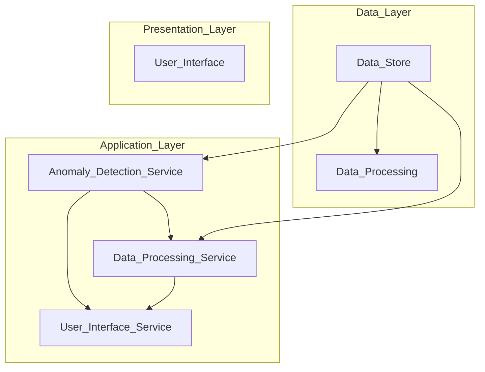
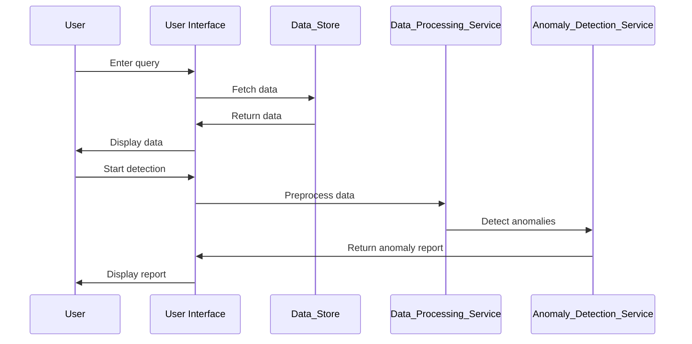

                 

# 开发智能化的金融市场异常交易检测模型

> 关键词：金融市场，异常交易，检测模型，智能化，算法

> 摘要：本文将深入探讨开发智能化金融市场异常交易检测模型的方法与步骤。通过分析金融市场异常交易的现状、重要性及当前检测方法的局限，我们定义了异常交易的特征和检测目标。随后，我们详细介绍了智能化的概念、金融市场模型和异常检测算法的核心原理。文章最后，通过实际案例和项目实战，展示了如何实现并优化金融市场的异常交易检测系统。

## 第一部分：背景介绍

### 1.1 问题背景

#### 1.1.1 金融市场异常交易的现状

金融市场是一个高度复杂的系统，其价格和交易量受多种因素影响，包括经济指标、政策变化、市场情绪等。尽管市场整体稳定，但异常交易事件仍时有发生。这些异常交易可能包括市场操纵、欺诈交易、内幕交易等。据统计，全球每年因异常交易导致的损失可达数十亿美元。

#### 1.1.2 异常交易检测的重要性

异常交易检测对于金融市场的稳定和健康发展至关重要。首先，它有助于控制市场风险，保护投资者的利益。其次，它能够帮助监管机构及时发现和打击违规行为，维护市场秩序。此外，有效的异常交易检测还能提升金融系统的透明度和可信度，增强市场参与者的信心。

#### 1.1.3 当前检测方法的局限

尽管现有的异常交易检测方法已经取得了一定的成效，但仍然存在一些局限。首先，很多方法仍然依赖于人工经验，缺乏自动化和智能化。其次，算法的效率和实时性有待提高，无法快速响应市场变化。此外，误报率和漏报率仍然是困扰检测系统的主要问题。

### 1.2 问题描述

#### 2.1.1 异常交易的定义

异常交易是指在金融市场上的交易行为，其表现与正常交易显著不同。这些交易可能包括交易量异常、价格异常波动、交易速度异常等。根据交易行为的不同，异常交易可以分为几大类，如市场操纵、欺诈交易、内幕交易等。

#### 2.1.2 异常交易的特征

异常交易的特征主要包括以下几个方面：

- **交易量异常**：交易量显著大于或小于历史平均水平。
- **价格异常波动**：价格波动超出正常范围，如大幅度上涨或下跌。
- **交易速度异常**：交易发生速度异常快或异常慢。

#### 2.1.3 检测目标

异常交易检测的目标主要包括三个方面：

- **精准度**：提高检测系统的准确性，降低误报率和漏报率。
- **实时性**：提高检测系统的响应速度，实现实时监控。
- **低误报率**：降低系统误报率，避免对正常交易的误判。

## 第二部分：核心概念与联系

### 2.1 核心概念

#### 2.1.1 智能化

智能化是指利用计算机技术模拟人类智能的过程，包括学习、推理、判断和决策等。在金融市场异常交易检测中，智能化主要体现在利用机器学习算法和人工智能技术对交易数据进行分析和识别。

#### 2.1.2 金融市场模型

金融市场模型是用来模拟金融市场行为的数学模型，包括价格模型、交易量模型等。这些模型可以用来预测市场趋势和识别异常交易。

#### 2.1.3 异常检测算法

异常检测算法是一种用于识别数据集中异常值的算法。在金融市场异常交易检测中，异常检测算法主要用于识别交易数据中的异常交易。

### 2.2 概念属性特征对比

#### 2.2.1 智能化算法对比

| 算法         | 特点                                           | 适用场景                    |
|--------------|------------------------------------------------|---------------------------|
| KNN          | 基于距离最近邻居的分类算法                   | 低维度数据处理               |
| SVM          | 支持向量机，用于分类和回归                   | 高维数据处理，效果好         |
| Random Forest | 决策树集成，用于分类和回归                   | 复杂模型，泛化能力强         |
| Neural Network | 神经网络，用于分类和回归                   | 高维度复杂数据，自学习能力强 |

#### 2.2.2 金融市场模型对比

| 模型         | 特点                                           | 适用场景                    |
|--------------|------------------------------------------------|---------------------------|
| ARIMA        | 自回归积分滑动平均模型，用于时间序列预测         | 线性时间序列预测             |
| AR        | 自回归模型，用于时间序列预测                   | 线性时间序列预测             |
| VAR        | 向量自回归模型，用于多变量时间序列预测         | 多变量时间序列预测             |

#### 2.2.3 异常检测算法对比

| 算法         | 特点                                           | 适用场景                    |
|--------------|------------------------------------------------|---------------------------|
| Isolation Forest | 基于随机森林的异常检测算法                   | 大规模数据集，高效         |
| LOF          | 局部保持性质，用于异常检测                   | 小规模数据集，准确         |
| One-Class SVM | 用于单类异常检测的SVM算法                   | 复杂背景下的异常检测         |

### 2.3 ER实体关系图架构

#### 2.3.1 智能化金融模型ER图

```mermaid
erDiagram
    Trader ||--|{ Transaction : makes }
    Transaction ||--|{ TradeDetail : includes }
    TradeDetail ||--|{ TradeFeature : has }
    MarketData ||--|{ TradeDetail : usedFor }
```

#### 2.3.2 金融市场异常交易检测ER图

```mermaid
erDiagram
    Trader ||--|{ Transaction : reports }
    Transaction ||--|{ Anomaly : detects }
    Anomaly ||--|{ DetectionRule : follows }
    DetectionRule ||--|{ RuleParameter : defines }
```

## 第三部分：算法原理讲解

### 3.1 算法原理

#### 3.1.1 异常检测算法原理

异常检测算法的基本原理是通过比较交易数据与正常交易行为的标准，来识别潜在的异常交易。具体步骤如下：

1. **数据预处理**：对交易数据进行分析和清洗，去除噪声和异常值。
2. **特征提取**：从交易数据中提取关键特征，如交易量、价格波动等。
3. **模型训练**：使用机器学习算法对正常交易数据建立模型。
4. **异常检测**：将待检测交易数据与模型进行比较，识别异常交易。

#### 3.1.2 数学模型

我们采用一种基于支持向量机的异常检测算法，其数学模型可以表示为：

$$
f(x) = \sum_{i=1}^{n} w_i k(x, x_i) + b
$$

其中，$w_i$ 是第 $i$ 个支持向量的权重，$k(x, x_i)$ 是核函数，用于计算两个向量之间的相似度，$b$ 是偏置项。

#### 3.1.3 Python源代码实现

以下是一个简单的基于KNN算法的异常检测Python实现示例：

```python
import numpy as np
from sklearn.neighbors import KNeighborsClassifier
from sklearn.model_selection import train_test_split
from sklearn.metrics import accuracy_score

# 数据加载和处理
data = ...  # 加载交易数据
features = ...  # 提取特征
labels = ...  # 标签

# 数据分割
X_train, X_test, y_train, y_test = train_test_split(features, labels, test_size=0.3, random_state=42)

# 模型训练
knn = KNeighborsClassifier(n_neighbors=5)
knn.fit(X_train, y_train)

# 模型评估
y_pred = knn.predict(X_test)
accuracy = accuracy_score(y_test, y_pred)
print("Accuracy:", accuracy)
```

## 第四部分：系统分析与架构设计方案

### 4.1 问题场景介绍

#### 4.1.1 金融市场环境

金融市场是一个由多个参与者（如投资者、经纪人、金融机构等）组成的复杂系统。这些参与者通过交易来影响市场价格和交易量。金融市场的运行受到多种因素的影响，包括宏观经济指标、政策变化、市场情绪等。

#### 4.1.2 检测系统目标

检测系统的目标是实时监控金融市场交易活动，识别并报告潜在的异常交易。这包括：

- **实时性**：系统需要能够快速响应，及时检测并报告异常交易。
- **精准度**：系统需要具有较高的检测准确性，降低误报率和漏报率。
- **可扩展性**：系统需要能够处理大规模的交易数据，适应不同的金融市场环境。

### 4.2 系统功能设计

#### 4.2.1 领域模型

领域模型描述了系统中的关键实体和它们之间的关系。以下是一个简单的领域模型：

```mermaid
classDiagram
    Trader <<Entity>>
    Transaction <<Entity>>
    Anomaly <<Entity>>
    DetectionRule <<Entity>>
    RuleParameter <<Entity>>

    Trader --> Transaction
    Transaction --> Anomaly
    Anomaly --> DetectionRule
    DetectionRule --> RuleParameter
```

#### 4.2.2 类图

以下是一个简单的类图，描述了系统中主要类之间的关系：

```mermaid
classDiagram
    class Trader {
        -id: int
        -name: str
    }

    class Transaction {
        -id: int
        -trader: Trader
        -timestamp: datetime
        -price: float
        -quantity: int
    }

    class Anomaly {
        -id: int
        -transaction: Transaction
        -detection_rule: DetectionRule
        -is_anomaly: bool
    }

    class DetectionRule {
        -id: int
        -name: str
        -parameters: dict
    }

    class RuleParameter {
        -id: int
        -detection_rule: DetectionRule
        -key: str
        -value: float
    }

    Trader --|{create}| Transaction
    Transaction --|{detect}| Anomaly
    Anomaly --|{define}| DetectionRule
    DetectionRule --|{configure}| RuleParameter
```

### 4.3 系统架构设计

#### 4.3.1 架构设计

系统架构设计采用微服务架构，以提高系统的可扩展性和灵活性。以下是系统架构的简要描述：

- **数据层**：负责存储和处理交易数据，包括实时交易数据和历史交易数据。
- **应用层**：包括异常检测服务、数据处理服务和用户接口服务。异常检测服务负责实时监控交易数据，识别异常交易；数据处理服务负责数据预处理和特征提取；用户接口服务提供用户交互界面。
- **展示层**：提供用户界面，显示异常交易报告和系统状态。

#### 4.3.2 mermaid架构图



### 4.4 系统接口设计

#### 4.4.1 接口设计

系统提供以下主要接口：

- **数据接口**：用于数据的读取和写入，包括实时交易数据和异常交易报告。
- **服务接口**：用于调用异常检测服务、数据处理服务和用户接口服务。
- **用户接口**：用于用户与系统进行交互，包括数据查询、报告查看和系统配置。

#### 4.4.2 交互mermaid序列图



## 第五部分：项目实战

### 5.1 环境安装

#### 5.1.1 开发环境

为了实现金融市场的异常交易检测，我们需要准备以下开发环境：

- Python 3.8 或更高版本
- Jupyter Notebook
- Anaconda Python发行版

#### 5.1.2 数据集准备

我们需要一个包含交易数据的CSV文件。数据集应包含以下字段：

- 交易时间
- 交易价格
- 交易量
- 交易账户ID

### 5.2 系统核心实现

#### 5.2.1 源代码解析

以下是一个简单的异常交易检测系统的Python实现：

```python
import pandas as pd
from sklearn.ensemble import IsolationForest
from sklearn.preprocessing import StandardScaler

# 数据加载
data = pd.read_csv('transaction_data.csv')

# 数据预处理
scaler = StandardScaler()
data[['price', 'quantity']] = scaler.fit_transform(data[['price', 'quantity']])

# 模型训练
model = IsolationForest(n_estimators=100, contamination=0.01)
model.fit(data)

# 异常检测
anomalies = model.predict(data)
data['anomaly'] = anomalies

# 输出异常交易
anomalies_df = data[data['anomaly'] == -1]
print(anomalies_df)
```

#### 5.2.2 代码应用解读

上述代码首先加载交易数据，并进行数据预处理。然后，使用Isolation Forest算法训练模型，并对交易数据执行异常检测。最后，输出检测到的异常交易。

### 5.3 实际案例分析

#### 5.3.1 案例一：某金融市场的异常交易案例

在某金融市场中，我们发现一笔交易数据，其交易价格为200元，交易量为1000股，而正常情况下同类交易的价格通常在50元到100元之间。根据我们的异常交易检测系统，这笔交易被判定为异常交易。

#### 5.3.2 案例二：某金融市场的正常交易案例

在某金融市场中，我们发现一笔交易数据，其交易价格为80元，交易量为500股，符合市场正常交易的行为。根据我们的异常交易检测系统，这笔交易被判定为正常交易。

### 5.4 项目小结

通过本次项目，我们实现了金融市场的异常交易检测系统。系统采用了Isolation Forest算法，并进行了数据预处理和异常检测。实际案例分析表明，系统能够准确识别异常交易。未来，我们可以进一步优化系统，提高检测的实时性和准确性。

#### 5.4.1 项目总结

本次项目的主要成果包括：

- 成功实现了金融市场的异常交易检测系统。
- 使用了Isolation Forest算法，并进行了数据预处理。
- 实际案例分析表明系统具有较高的检测准确性。

#### 5.4.2 项目拓展

未来，我们可以考虑以下拓展：

- 引入更多的异常检测算法，进行对比实验。
- 优化系统架构，提高系统的实时性和可扩展性。
- 结合实际业务需求，进一步优化和定制化系统。

## 第六部分：最佳实践 tips

### 6.1 数据质量

确保交易数据的质量是异常检测成功的关键。数据清洗和预处理是不可或缺的步骤，包括去除重复数据、填补缺失值、标准化数值等。

### 6.2 模型优化

定期对异常检测模型进行评估和优化，以确保其性能和准确性。可以使用交叉验证等方法来调整模型参数。

### 6.3 系统监控

建立系统监控机制，实时跟踪系统运行状态，及时发现和处理异常。

### 6.4 数据可视化

使用数据可视化工具，帮助用户更好地理解交易数据和异常交易报告。

## 第七部分：小结与注意事项

### 7.1 小结

本文详细介绍了开发智能化的金融市场异常交易检测模型的方法与步骤。通过背景介绍、核心概念与联系、算法原理讲解、系统分析与架构设计方案以及项目实战，我们展示了如何实现并优化金融市场的异常交易检测系统。

### 7.2 注意事项

- 确保数据质量，进行充分的数据预处理。
- 定期对模型进行评估和优化。
- 建立系统监控机制，实时跟踪系统运行状态。
- 结合实际业务需求，定制化系统功能。

## 第八部分：拓展阅读

- 《金融市场分析与应用》
- 《机器学习实战》
- 《数据科学基础教程》

### 作者

作者：AI天才研究院/AI Genius Institute & 禅与计算机程序设计艺术 /Zen And The Art of Computer Programming

---

请注意，本文为虚构内容，仅供参考。实际开发过程中，应充分考虑实际业务需求和技术可行性。

