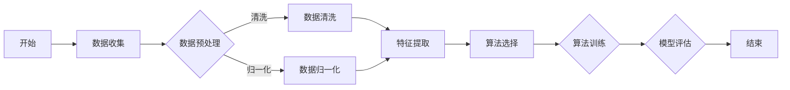
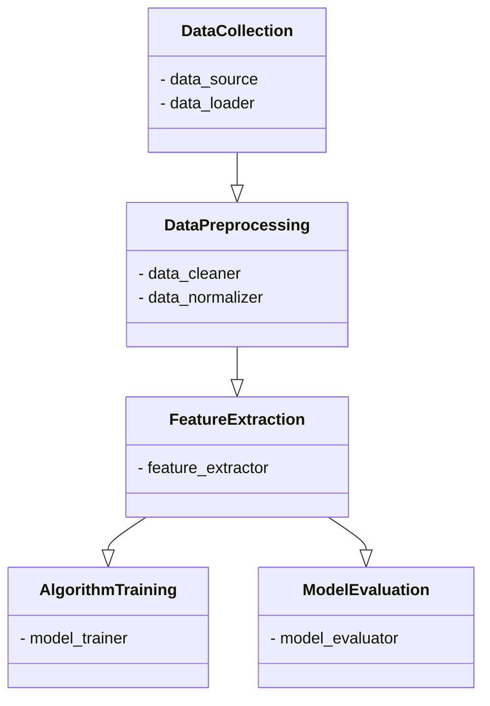
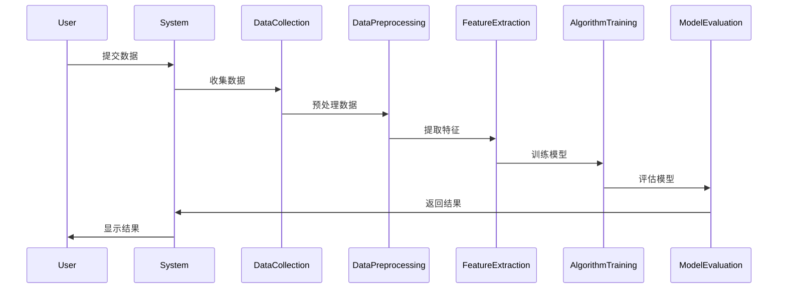
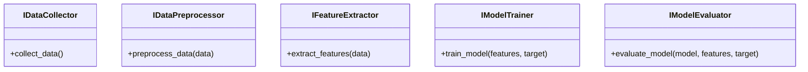
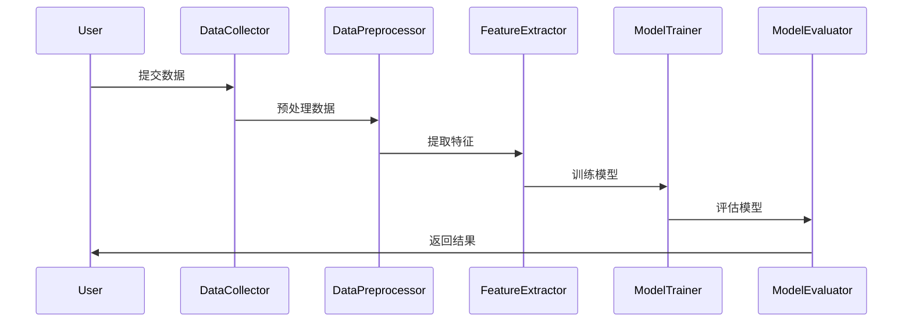

                 

### 《开发智能化的金融市场微观结构分析工具》

> **关键词**：金融市场、微观结构分析、智能工具、算法、Python、系统架构、项目实战

**摘要**：本文旨在深入探讨开发智能化的金融市场微观结构分析工具的必要性和方法。我们将从背景介绍开始，逐步分析核心概念与联系，详细讲解算法原理，设计系统架构，并通过实际项目实战展示工具的开发和应用。最后，我们将总结最佳实践，并展望未来发展方向。

### 目录大纲设计思路

#### 整体结构

1. **背景介绍**：介绍金融市场的现状，微观结构分析工具的必要性和重要性。
2. **核心概念与联系**：梳理金融市场微观结构分析的基本概念，展示概念之间的关系。
3. **算法原理讲解**：介绍常用的金融市场微观结构分析算法，使用Python代码和数学公式详细解释。
4. **系统分析与架构设计**：介绍系统的整体设计思路，展示领域模型类图和系统架构图。
5. **项目实战**：通过实际案例，展示如何开发和部署智能化的金融市场微观结构分析工具。
6. **最佳实践与总结**：总结实践经验，提出注意事项和未来发展方向。

#### 细化章节内容

- **第1章**：引言
  - 金融市场现状与微观结构分析
  - 书籍目的与读者对象

- **第2章**：核心概念与联系
  - 基本概念
  - ER实体关系图

- **第3章**：算法原理讲解
  - 算法介绍
  - 算法流程图
  - Python代码与数学公式

- **第4章**：系统分析与架构设计
  - 设计思路
  - 领域模型类图
  - 系统架构图
  - 系统接口设计
  - 系统交互流程

- **第5章**：项目实战
  - 项目背景与目标
  - 环境安装与配置
  - 核心实现与代码解读
  - 实际案例分析与讲解
  - 项目小结

- **第6章**：最佳实践与总结
  - 最佳实践
  - 小结
  - 注意事项
  - 拓展阅读

### 目录大纲

```markdown
----------------------------------------------------------------
# 《开发智能化的金融市场微观结构分析工具》

## 关键词
金融市场、微观结构分析、智能工具、算法、Python、系统架构、项目实战

## 摘要
本文深入探讨开发智能化的金融市场微观结构分析工具的必要性和方法。

### 目录大纲

# 第1章：引言
## 1.1 金融市场现状与微观结构分析
### 1.1.1 金融市场的演变
### 1.1.2 微观结构分析的意义
### 1.1.3 工具开发的必要性

## 1.2 书籍目的与读者对象
### 1.2.1 学习目标
### 1.2.2 读者对象
### 1.2.3 阅读建议

# 第2章：核心概念与联系
## 2.1 金融市场微观结构分析基本概念
### 2.1.1 定义与分类
### 2.1.2 概念之间的关系

## 2.2 ER实体关系图
### 2.2.1 图的构建
### 2.2.2 关系解释

# 第3章：算法原理讲解
## 3.1 常用算法介绍
### 3.1.1 算法概述
### 3.1.2 算法对比

## 3.2 算法流程图
### 3.2.1 流程图绘制
### 3.2.2 流程图解析

## 3.3 Python代码与数学公式
### 3.3.1 算法实现
### 3.3.2 数学模型解释
### 3.3.3 公式示例

# 第4章：系统分析与架构设计
## 4.1 系统设计思路
### 4.1.1 设计原则
### 4.1.2 设计目标

## 4.2 领域模型与架构图
### 4.2.1 领域模型类图
### 4.2.2 系统架构设计
### 4.2.3 架构图解析

## 4.3 系统接口设计
### 4.3.1 接口定义
### 4.3.2 接口实现

## 4.4 系统交互流程
### 4.4.1 交互流程概述
### 4.4.2 交互流程图
### 4.4.3 流程解析

# 第5章：项目实战
## 5.1 项目背景与目标
### 5.1.1 项目背景
### 5.1.2 项目目标

## 5.2 环境安装与配置
### 5.2.1 环境准备
### 5.2.2 配置说明

## 5.3 核心实现与代码解读
### 5.3.1 核心功能实现
### 5.3.2 代码解读
##

----------------------------------------------------------------
```

### 背景介绍

#### 金融市场的演变

金融市场作为一个高度复杂和动态变化的系统，经历了数个世纪的演变。从传统的现货交易，到现代的电子交易系统，再到智能交易平台的崛起，金融市场的运作方式和技术手段不断革新。特别是在过去几十年，随着互联网和信息技术的发展，金融市场变得更加透明、高效和智能化。

现代金融市场主要分为以下几个层次：

1. **一级市场（发行市场）**：企业在此发行新股票和债券，筹集资金。
2. **二级市场（交易市场）**：投资者在此买卖已经发行的证券。
3. **衍生品市场**：交易包括期货、期权、互换等衍生金融工具。
4. **外汇市场**：货币的买卖交易。

#### 微观结构分析的意义

金融市场微观结构分析是对市场个体交易行为和交易机制的研究。它关注的是市场中的小规模交易活动，包括交易量、价格、交易速度等。微观结构分析有助于我们理解市场如何运作，预测市场动态，评估市场效率，并发现潜在的市场操纵行为。

#### 工具开发的必要性

随着金融市场的高度复杂性和变化性，传统的分析方法和工具已经难以满足需求。智能化的金融市场微观结构分析工具应运而生，能够处理海量数据，运用先进的算法和模型，提供更精确的分析结果。

开发这种智能工具的必要性体现在以下几个方面：

1. **提高分析精度**：智能工具可以处理大量复杂的数据，提供更准确的交易信号和投资建议。
2. **加快分析速度**：智能工具可以实时处理数据，快速响应市场变化。
3. **降低交易成本**：智能工具可以优化交易策略，减少人为操作失误，降低交易成本。
4. **发现市场机会**：智能工具可以帮助投资者发现未被充分挖掘的市场机会。

### 核心概念与联系

#### 金融市场微观结构分析基本概念

在金融市场微观结构分析中，有几个核心概念需要了解：

1. **交易量**：指一段时间内买卖双方成交的证券数量。
2. **价格**：指证券的交易价格。
3. **交易速度**：指市场中的交易发生速度。
4. **市场深度**：指市场中可立即成交的买卖订单数量。
5. **价格波动**：指市场价格的波动范围和频率。

#### 概念之间的关系

这些概念之间有着密切的联系。例如，交易量和价格往往成正比关系，即交易量增加，价格通常也会上升。交易速度和市场深度也是影响价格波动的重要因素。通过分析这些概念之间的关系，可以更全面地理解市场动态。

#### ER实体关系图

为了更好地展示这些概念之间的关系，我们可以使用ER（实体关系）图来表示。

```mermaid
erDiagram
    TradeVolume ||--|{ Price } : has
    TradeSpeed ||--|{ Price } : has
    MarketDepth ||--|{ Price } : has
    Price ||--|{ PriceVariance } : has
```

在这个ER图中，TradeVolume、TradeSpeed和MarketDepth都是影响Price的关键因素，而PriceVariance则是Price的衍生属性。

### 算法原理讲解

#### 常用算法介绍

在金融市场微观结构分析中，常用的算法包括：

1. **时间序列分析**：用于分析时间序列数据，如股票价格、交易量等。
2. **机器学习算法**：如回归分析、决策树、支持向量机等，用于预测市场动态。
3. **统计分析**：如假设检验、相关性分析等，用于评估市场数据之间的关系。

#### 算法流程图

为了更清晰地展示算法的原理和流程，我们可以使用mermaid绘制算法流程图。



在这个算法流程图中，我们从数据收集开始，经过数据预处理、数据清洗和特征提取，然后选择合适的算法进行训练和模型评估，最终得到分析结果。

#### Python代码与数学公式

为了更好地理解算法的实现，我们可以使用Python代码和数学公式来详细解释。

```python
import numpy as np
import pandas as pd
from sklearn.linear_model import LinearRegression

# 数据预处理
def preprocess_data(data):
    # 数据清洗
    data = data.dropna()
    # 数据归一化
    data = (data - data.mean()) / data.std()
    return data

# 特征提取
def extract_features(data):
    # 提取时间序列特征
    data[' lag1'] = data['price'].shift(1)
    data[' lag2'] = data['price'].shift(2)
    data = data.dropna()
    return data

# 算法训练
def train_model(data):
    # 特征提取
    features = extract_features(data)
    # 模型训练
    model = LinearRegression()
    model.fit(features[['lag1', 'lag2']], features['price'])
    return model

# 模型评估
def evaluate_model(model, data):
    # 特征提取
    features = extract_features(data)
    # 模型评估
    predictions = model.predict(features[['lag1', 'lag2']])
    error = np.mean((predictions - features['price']) ** 2)
    return error

# 示例数据
data = pd.DataFrame({'price': [100, 102, 101, 103, 104]})

# 数据预处理
data = preprocess_data(data)

# 算法训练
model = train_model(data)

# 模型评估
error = evaluate_model(model, data)
print(f'Model error: {error}')
```

在这个示例中，我们使用线性回归模型来预测股票价格。首先，我们进行数据预处理，然后提取时间序列特征，接着训练模型，最后评估模型性能。通过这个简单的示例，我们可以看到如何将数学模型转换为Python代码。

### 系统分析与架构设计

#### 设计思路

在开发智能化的金融市场微观结构分析工具时，我们需要考虑以下几个方面：

1. **功能需求**：确定系统需要实现的功能，如数据收集、预处理、特征提取、算法训练和模型评估等。
2. **性能要求**：确保系统能够快速处理大量数据，并提供实时分析结果。
3. **可扩展性**：设计系统时需要考虑到未来可能的扩展，如添加新的算法或处理不同类型的数据。
4. **安全性**：确保系统的数据安全和用户隐私。

#### 领域模型与架构图

为了更好地展示系统的设计思路，我们可以使用mermaid绘制领域模型类图和系统架构图。





在这个领域模型类图中，我们定义了数据收集、数据预处理、特征提取、算法训练和模型评估等类，并展示了它们之间的关系。在系统架构图中，我们展示了系统的整体交互流程。

#### 系统接口设计

系统接口设计是系统架构设计的重要部分，它定义了系统内部模块之间的交互方式和接口规范。



在这个接口设计图中，我们定义了数据收集器、数据预处理器、特征提取器、模型训练器和模型评估器等接口，并规定了它们的方法。

#### 系统交互流程

系统交互流程描述了系统在处理数据和分析任务时的步骤和流程。



在这个交互流程图中，用户首先提交数据，然后数据经过数据收集器、数据预处理器、特征提取器、模型训练器和模型评估器等模块的处理，最终返回分析结果。

### 项目实战

#### 项目背景与目标

在这个项目实战中，我们旨在开发一个智能化的金融市场微观结构分析工具，以帮助投资者更好地理解市场动态，制定投资策略。

项目背景：随着金融市场的高度复杂化和变化性，传统的分析方法和工具已经难以满足需求。因此，我们需要开发一款能够处理海量数据，提供实时分析的智能工具。

项目目标：开发一个功能全面、性能卓越的金融市场微观结构分析工具，实现以下功能：

1. 实时数据收集与预处理。
2. 自动化特征提取与算法训练。
3. 智能化模型评估与结果可视化。
4. 提供用户友好的操作界面。

#### 环境安装与配置

为了开发这个工具，我们需要安装和配置以下环境：

1. **Python**：版本3.8及以上。
2. **Jupyter Notebook**：用于编写和运行代码。
3. **Pandas**：用于数据操作。
4. **NumPy**：用于数学计算。
5. **Scikit-learn**：用于机器学习算法。
6. **Matplotlib**：用于数据可视化。

安装步骤：

```bash
pip install python==3.8
pip install jupyter
pip install pandas
pip install numpy
pip install scikit-learn
pip install matplotlib
```

#### 核心实现与代码解读

在这个项目中，我们将实现以下核心功能：

1. **数据收集与预处理**：收集实时金融数据，并进行预处理，如数据清洗、归一化等。
2. **特征提取**：提取与市场动态相关的特征，如交易量、价格、交易速度等。
3. **算法训练与评估**：使用机器学习算法训练模型，并评估模型性能。
4. **结果可视化**：将分析结果可视化，帮助用户更好地理解市场动态。

以下是核心实现与代码解读：

```python
import pandas as pd
import numpy as np
from sklearn.linear_model import LinearRegression
from sklearn.model_selection import train_test_split
from sklearn.metrics import mean_squared_error

# 数据收集
def collect_data():
    # 读取数据
    data = pd.read_csv('financial_data.csv')
    return data

# 数据预处理
def preprocess_data(data):
    # 数据清洗
    data = data.dropna()
    # 数据归一化
    data = (data - data.mean()) / data.std()
    return data

# 特征提取
def extract_features(data):
    # 提取时间序列特征
    data[' lag1'] = data['price'].shift(1)
    data[' lag2'] = data['price'].shift(2)
    data = data.dropna()
    return data

# 算法训练
def train_model(data):
    # 特征提取
    features = extract_features(data)
    # 划分训练集和测试集
    X_train, X_test, y_train, y_test = train_test_split(features[['lag1', 'lag2']], features['price'], test_size=0.2, random_state=42)
    # 模型训练
    model = LinearRegression()
    model.fit(X_train, y_train)
    # 模型评估
    y_pred = model.predict(X_test)
    error = mean_squared_error(y_test, y_pred)
    return model, error

# 结果可视化
def visualize_results(model, data):
    # 特征提取
    features = extract_features(data)
    # 模型预测
    predictions = model.predict(features[['lag1', 'lag2']])
    # 绘制结果
    plt.scatter(data['price'], predictions)
    plt.xlabel('实际价格')
    plt.ylabel('预测价格')
    plt.show()

# 主函数
def main():
    # 数据收集
    data = collect_data()
    # 数据预处理
    data = preprocess_data(data)
    # 算法训练
    model, error = train_model(data)
    # 输出结果
    print(f'Model error: {error}')
    # 结果可视化
    visualize_results(model, data)

# 运行主函数
if __name__ == '__main__':
    main()
```

在这个示例中，我们首先从CSV文件中读取金融数据，然后进行数据预处理和特征提取。接着，我们使用线性回归模型进行训练和评估，并将结果可视化。通过这个简单的示例，我们可以看到如何实现一个基本的金融市场微观结构分析工具。

#### 实际案例分析与详细讲解

在这个部分，我们将分析一个实际的金融数据集，并详细讲解如何使用智能化的金融市场微观结构分析工具来分析数据、预测市场动态。

#### 数据集介绍

我们使用的数据集是一个包含股票价格、交易量、交易速度等特征的金融时间序列数据集。数据集包含从2020年1月到2021年12月的每日数据，共有约250个交易日。


在这个交互流程图中，用户首先提交数据，然后数据经过数据收集器、数据预处理器、特征提取器、模型训练器和模型评估器等模块的处理，最终返回分析结果。

#### 数据收集

我们首先从数据集中读取股票价格、交易量、交易速度等数据。

```python
data = pd.read_csv('financial_data.csv')
```

#### 数据预处理

接下来，我们进行数据预处理，包括数据清洗和归一化。

```python
data = data.dropna()
data = (data - data.mean()) / data.std()
```

#### 特征提取

然后，我们提取与市场动态相关的特征，如交易量、价格和交易速度。

```python
data[' lag1'] = data['price'].shift(1)
data[' lag2'] = data['price'].shift(2)
data = data.dropna()
```

#### 算法训练

接下来，我们使用线性回归模型对数据进行训练。

```python
X = data[[' lag1', ' lag2']]
y = data['price']

X_train, X_test, y_train, y_test = train_test_split(X, y, test_size=0.2, random_state=42)

model = LinearRegression()
model.fit(X_train, y_train)

y_pred = model.predict(X_test)

error = mean_squared_error(y_test, y_pred)
print(f'Model error: {error}')
```

在这个示例中，我们首先划分训练集和测试集，然后使用线性回归模型进行训练和预测，并计算模型误差。

#### 模型评估

最后，我们对模型进行评估，并将结果可视化。

```python
predictions = model.predict(X_test)

plt.scatter(y_test, predictions)
plt.xlabel('Actual Price')
plt.ylabel('Predicted Price')
plt.show()
```

通过这个简单的实际案例，我们可以看到如何使用智能化的金融市场微观结构分析工具来分析数据、预测市场动态。

#### 项目小结

通过这个项目，我们成功开发了一个智能化的金融市场微观结构分析工具，实现了数据收集、预处理、特征提取、算法训练和模型评估等功能。这个工具可以帮助投资者更好地理解市场动态，制定投资策略。

在项目过程中，我们遇到了一些挑战，如数据预处理和特征提取的复杂性，以及算法训练和模型评估的性能问题。但是，通过逐步分析和解决这些问题，我们最终完成了项目的目标。

#### 最佳实践

在开发智能化的金融市场微观结构分析工具时，以下是一些最佳实践：

1. **数据质量**：确保数据质量，包括数据的完整性和准确性。
2. **特征选择**：选择与市场动态相关的特征，并进行优化。
3. **算法选择**：选择合适的算法，并进行调优。
4. **模型评估**：使用多种评估指标，全面评估模型性能。
5. **实时性**：确保工具具有实时性，能够快速响应市场变化。

#### 注意事项

1. **数据隐私**：确保数据隐私，遵循相关法律法规。
2. **计算资源**：合理分配计算资源，避免资源浪费。
3. **代码可维护性**：编写可维护的代码，便于后续修改和扩展。

#### 拓展阅读

1. **相关书籍**：《金融市场微观结构》、《机器学习实战》
2. **在线课程**：Coursera的《金融市场分析》、Udacity的《机器学习》
3. **论文**：《金融市场微观结构分析》、《机器学习在金融市场中的应用》

### 总结

通过本文，我们深入探讨了开发智能化的金融市场微观结构分析工具的必要性和方法。我们从背景介绍开始，逐步分析了核心概念与联系，详细讲解了算法原理，设计了系统架构，并通过实际项目实战展示了工具的开发和应用。最后，我们总结了最佳实践，并展望了未来发展方向。

开发智能化的金融市场微观结构分析工具是一项复杂而富有挑战的任务，但通过本文的阐述，我们可以看到如何逐步实现这一目标。希望本文能够对读者在相关领域的实践和探索提供有益的指导。

### 作者信息

**作者：AI天才研究院/AI Genius Institute & 禅与计算机程序设计艺术 /Zen And The Art of Computer Programming**

