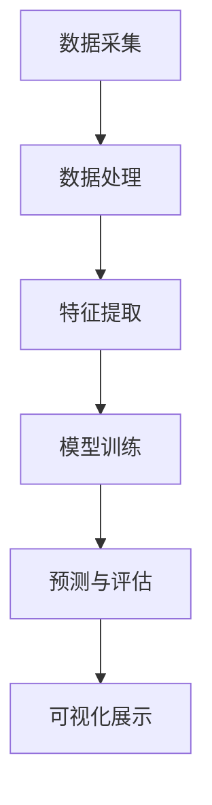
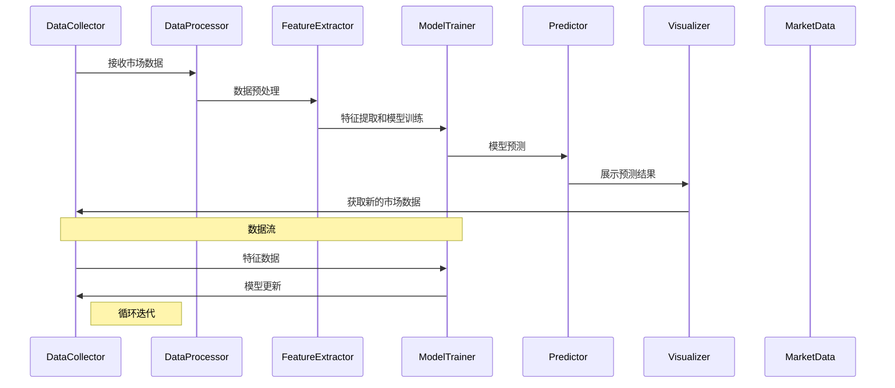
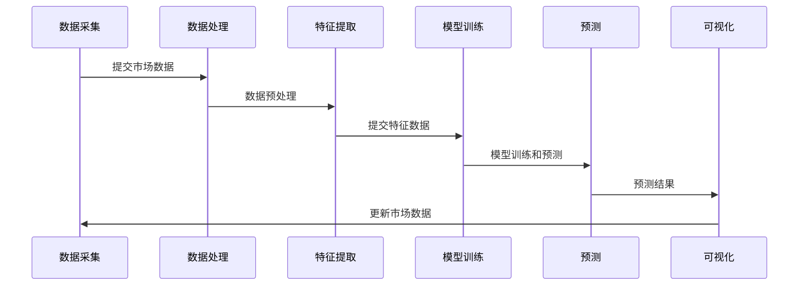

                 

### 第1章: 金融市场微观结构背景与意义

#### 1.1 问题背景

金融市场是现代经济的核心，它是资本配置的重要平台，连接了资金供求双方，促进了资本的高效流动。然而，随着金融市场的日益复杂和全球化的进程，金融市场的微观结构也在不断演变。微观结构变化涉及到市场参与者的行为、交易机制、价格形成过程等多个方面，这些变化对市场的稳定性、效率以及风险管控都产生了深远的影响。

当前，金融市场正面临诸多挑战，如信息不对称、交易成本高、市场波动性增加等。这些问题不仅增加了市场参与者的操作难度，也对金融监管提出了更高的要求。因此，研究金融市场的微观结构，特别是评估微观结构变化的影响，成为金融科技和金融监管领域的热点问题。

#### 1.2 问题描述

金融市场微观结构变化的影响评估主要关注以下几个关键问题：

1. **市场效率的变化**：微观结构的变化如何影响市场信息的传递速度和价格发现机制？
2. **交易成本**：新交易机制和技术的引入对交易成本产生了哪些影响？
3. **市场波动性**：微观结构变化是否加剧了市场的波动性？
4. **风险管控**：市场微观结构的变化如何影响风险的管理和控制？

#### 1.3 问题解决

为解决上述问题，开发智能化的金融市场微观结构变化影响评估工具至关重要。这种工具应具备以下能力：

1. **大数据分析能力**：能够收集和分析大量的市场数据，包括交易数据、价格数据、市场参与者的行为数据等。
2. **机器学习算法**：利用机器学习算法对市场数据进行深度分析，识别市场微观结构变化的关键特征。
3. **实时监测与预警**：能够实时监测市场变化，对潜在的微观结构变化进行预警。
4. **可视化工具**：提供直观的可视化功能，帮助用户理解微观结构变化的影响。

通过这些能力，智能化工具可以为金融市场的监管、投资决策和风险管理提供有力支持。

#### 1.4 边界与外延

在评估金融市场微观结构变化的影响时，我们需要明确以下几个边界与外延：

1. **时间维度**：分析的时间跨度应该足够长，以捕捉到市场微观结构的长期变化趋势。
2. **市场范围**：应考虑不同市场（如股票市场、债券市场、外汇市场等）的微观结构变化。
3. **数据类型**：不仅包括交易数据，还应包括市场参与者行为数据、市场情绪数据等。
4. **外部因素**：评估微观结构变化的影响时，需考虑宏观经济环境、政策变化等外部因素。

#### 1.5 核心概念结构与要素组成

为了深入理解金融市场微观结构变化的影响，我们需要明确以下几个核心概念：

1. **交易机制**：市场交易的具体规则和流程，如做市商制度、竞价交易等。
2. **价格发现**：市场中价格的形成过程，包括信息的传递和价格竞争。
3. **市场效率**：市场在价格发现、资源配置等方面的表现。
4. **交易成本**：交易过程中所产生的各种费用，包括手续费、信息获取成本等。
5. **市场波动性**：市场价格波动的程度和频率。

这些核心概念相互关联，共同构成了金融市场微观结构的复杂网络。在开发智能化评估工具时，需要充分考虑这些要素，以便全面、准确地评估微观结构变化的影响。

### 第2章: 金融市场微观结构核心概念

#### 2.1 核心概念原理

金融市场微观结构的核心概念包括交易机制、价格发现、市场效率、交易成本和市场波动性。以下是这些概念的基本原理：

1. **交易机制**：交易机制是市场交易的具体规则和流程，包括做市商制度、竞价交易、订单驱动交易等。做市商制度通过提供买卖报价，维持市场的流动性；竞价交易则通过买家出价和卖家要价进行价格竞争；订单驱动交易根据订单的优先级和价格进行成交。

2. **价格发现**：价格发现是市场中价格形成的过程，通过信息的传递和竞争，形成均衡价格。价格发现机制不仅依赖于市场参与者的交易行为，还受到信息透明度和市场效率的影响。

3. **市场效率**：市场效率是指市场在价格发现和资源配置方面的表现。有效市场假说（Efficient Market Hypothesis, EMH）认为，市场价格已经反映了所有可用信息，因此市场是有效的。市场效率对投资者的投资决策至关重要。

4. **交易成本**：交易成本是指在交易过程中产生的各种费用，包括手续费、信息获取成本等。交易成本的高低直接影响市场的流动性和参与者的交易积极性。

5. **市场波动性**：市场波动性是指市场价格波动的程度和频率。市场波动性受到多种因素影响，包括宏观经济因素、政策变化、市场情绪等。

#### 2.2 概念属性特征对比表格

| 概念       | 属性特征                                                                                   | 对比分析                                                                                           |
|------------|-------------------------------------------------------------------------------------------|----------------------------------------------------------------------------------------------------|
| 交易机制   | - 做市商制度：维持市场流动性<br>- 竞价交易：价格竞争<br>- 订单驱动交易：订单优先级和价格 | 不同交易机制在市场流动性和价格发现机制上的差异                                             |
| 价格发现   | - 信息传递：价格形成过程<br>- 竞争机制：价格竞争<br>- 透明度：信息透明度          | 交易机制和市场效率对价格发现的影响                                                           |
| 市场效率   | - 有效市场假说：信息反映程度<br>- 价格发现：资源配置效率                          | 不同市场和交易机制对市场效率的影响                                                           |
| 交易成本   | - 手续费：交易费用<br>- 信息获取成本：获取市场信息费用                          | 交易成本对市场流动性和参与者行为的影响                                                       |
| 市场波动性 | - 波动程度：价格波动幅度<br>- 波动频率：价格波动次数                           | 宏观经济因素、政策变化和市场情绪对市场波动性的影响                                           |

#### 2.3 ER实体关系图架构

为了更清晰地理解金融市场微观结构的核心概念，我们可以使用ER（实体-关系）图来展示这些概念之间的关系。以下是ER实体关系图的mermaid表示：

```mermaid
entity_relationship_graph {
    entity "交易机制" {
        attribute "做市商制度"
        attribute "竞价交易"
        attribute "订单驱动交易"
    }

    entity "价格发现" {
        attribute "信息传递"
        attribute "竞争机制"
        attribute "透明度"
    }

    entity "市场效率" {
        attribute "有效市场假说"
        attribute "价格发现"
        attribute "资源配置效率"
    }

    entity "交易成本" {
        attribute "手续费"
        attribute "信息获取成本"
    }

    entity "市场波动性" {
        attribute "波动程度"
        attribute "波动频率"
    }

    relationship "交易机制与市场效率" {
        "影响"
    }

    relationship "价格发现与市场效率" {
        "影响"
    }

    relationship "交易成本与市场流动性" {
        "影响"
    }

    relationship "市场波动性与宏观经济因素" {
        "影响"
    }
}
```

通过ER实体关系图，我们可以直观地看到各个核心概念之间的关联，以及它们在金融市场微观结构中的角色和影响。

### 第3章: 开发工具基础

#### 3.1 工具开发基础

开发智能化金融市场微观结构变化影响评估工具，需要建立坚实的理论基础和技术框架。以下是工具开发所需的基础知识和技术要求：

1. **数据获取**：工具应具备从多个数据源（如交易所、金融信息提供商等）获取实时市场数据的能力。数据类型包括交易数据、价格数据、市场参与者行为数据等。

2. **数据处理**：工具需要能够对海量市场数据进行清洗、转换和整合，以确保数据的准确性和一致性。这包括数据去重、缺失值填补、异常值检测等。

3. **存储**：工具应使用高性能数据库管理系统（如Apache Kafka、Apache HBase等）来存储和管理大量数据。这些数据库应支持实时数据处理和高效查询。

4. **分析算法**：工具需要集成多种机器学习算法，如回归分析、聚类分析、时间序列分析等，以识别市场微观结构变化的关键特征。

5. **实时监测**：工具应具备实时监测市场数据变化的能力，通过设置阈值和规则，实现微观结构变化的实时预警。

6. **可视化**：工具应提供直观的可视化界面，帮助用户理解市场微观结构变化的影响。可视化工具应包括图表、仪表板等。

7. **开发框架**：选择合适的开发框架，如Apache Flink、Apache Storm等，以支持实时数据处理和分析。

8. **编程语言**：工具开发应使用Python、Java等主流编程语言，这些语言在数据处理、分析和可视化方面具有丰富的库和框架支持。

#### 3.2 技术栈选择

在选择技术栈时，我们应考虑工具的需求和性能要求。以下是推荐的技术栈：

1. **数据获取**：使用Python的`pandas`和`numpy`库进行数据处理；使用`requests`库获取外部数据源的数据。

2. **数据处理**：使用`Apache Kafka`进行实时数据处理，确保数据的高吞吐量和低延迟。使用`Apache Flink`进行复杂的数据分析和处理。

3. **存储**：使用`Apache HBase`存储大规模数据，确保高效的数据查询和写入性能。

4. **分析算法**：使用`scikit-learn`库集成多种机器学习算法，实现高效的数据分析和特征提取。

5. **实时监测**：使用`Apache Storm`进行实时数据处理和事件驱动监控。

6. **可视化**：使用`D3.js`和`Bokeh`等库进行数据可视化和交互式图表展示。

7. **开发框架**：使用`Flask`或`Spring Boot`等框架搭建后端服务，确保系统的可扩展性和稳定性。

#### 3.3 环境搭建

在开发之前，我们需要搭建一个完整的环境，以支持工具的开发和测试。以下是环境搭建的步骤：

1. **安装Python**：下载并安装Python 3.8及以上版本。
2. **安装依赖库**：使用`pip`命令安装所需的库，如`pandas`、`numpy`、`requests`、`scikit-learn`、`apache-kafka`、`apache-flink`等。
3. **安装Apache Kafka和Apache Flink**：从官方下载并安装Apache Kafka和Apache Flink，配置好集群环境。
4. **安装Apache HBase**：从官方下载并安装Apache HBase，配置好HBase集群。
5. **安装D3.js和Bokeh**：从官方下载并安装D3.js和Bokeh，配置好前端环境。

通过以上步骤，我们就可以搭建一个完整的技术环境，开始进行智能化金融市场微观结构变化影响评估工具的开发。

### 第4章: 算法原理讲解

#### 4.1 算法mermaid流程图

为了更好地理解智能化金融市场微观结构变化影响评估工具的算法原理，我们可以使用mermaid绘制算法的流程图。以下是算法流程图的mermaid表示：



在这个流程图中，算法的主要步骤包括数据采集、数据处理、特征提取、模型训练、预测与评估以及可视化展示。

#### 4.2 Python源代码阐述

以下是一个简化的Python源代码示例，用于阐述算法的各个步骤：

```python
import pandas as pd
from sklearn.model_selection import train_test_split
from sklearn.ensemble import RandomForestClassifier
from sklearn.metrics import accuracy_score
import matplotlib.pyplot as plt

# 数据采集
def data_collection():
    # 从外部数据源获取数据
    data = pd.read_csv('market_data.csv')
    return data

# 数据处理
def data_preprocessing(data):
    # 数据清洗、转换和整合
    data = data.dropna()  # 去除缺失值
    data = data[data['Volume'] > 0]  # 去除交易量异常的数据
    return data

# 特征提取
def feature_extraction(data):
    # 提取关键特征
    features = data[['Open', 'High', 'Low', 'Close', 'Volume']]
    labels = data['Target']  # 目标变量
    return features, labels

# 模型训练
def model_training(features, labels):
    # 分割训练集和测试集
    X_train, X_test, y_train, y_test = train_test_split(features, labels, test_size=0.2, random_state=42)
    
    # 使用随机森林算法进行训练
    model = RandomForestClassifier(n_estimators=100)
    model.fit(X_train, y_train)
    
    return model, X_test, y_test

# 预测与评估
def predict_and_evaluate(model, X_test, y_test):
    # 进行预测
    predictions = model.predict(X_test)
    
    # 评估模型性能
    accuracy = accuracy_score(y_test, predictions)
    print(f'Accuracy: {accuracy}')
    
    return predictions

# 可视化展示
def visualization(predictions):
    # 绘制预测结果分布图
    plt.hist(predictions, bins=10)
    plt.title('Predicted Target Distribution')
    plt.xlabel('Prediction')
    plt.ylabel('Frequency')
    plt.show()

# 主函数
def main():
    data = data_collection()
    data = data_preprocessing(data)
    features, labels = feature_extraction(data)
    model, X_test, y_test = model_training(features, labels)
    predictions = predict_and_evaluate(model, X_test, y_test)
    visualization(predictions)

if __name__ == '__main__':
    main()
```

这个示例代码包括了数据采集、数据处理、特征提取、模型训练、预测与评估以及可视化展示的各个环节。在实际应用中，我们可以根据具体需求对这些步骤进行扩展和优化。

#### 4.3 数学模型与公式

在智能化金融市场微观结构变化影响评估工具中，数学模型和公式扮演着至关重要的角色。以下是一些关键的数学模型和公式：

1. **回归模型**：
   $$ Y = \beta_0 + \beta_1X_1 + \beta_2X_2 + ... + \beta_nX_n + \epsilon $$
   其中，$Y$ 为目标变量，$X_1, X_2, ..., X_n$ 为特征变量，$\beta_0, \beta_1, \beta_2, ..., \beta_n$ 为回归系数，$\epsilon$ 为误差项。

2. **随机森林算法**：
   $$ \hat{y} = f(\hat{X}) $$
   其中，$\hat{y}$ 为预测值，$f(\hat{X})$ 为随机森林模型对输入特征 $\hat{X}$ 的预测。

3. **时间序列分析**：
   $$ X_t = \alpha + \beta_t + \epsilon_t $$
   其中，$X_t$ 为时间序列的当前值，$\alpha$ 为长期趋势，$\beta_t$ 为季节性因素，$\epsilon_t$ 为随机误差。

通过这些数学模型和公式，我们可以对金融市场微观结构变化进行定量分析和预测。在实际应用中，我们可以根据具体需求对这些模型进行调整和优化。

#### 4.4 举例说明

为了更好地理解上述算法和数学模型，我们通过一个具体的案例来说明如何使用智能化金融市场微观结构变化影响评估工具。

**案例背景**：假设我们要分析某股票市场的微观结构变化，评估其对市场波动性的影响。

**数据来源**：我们从交易所获取了该股票过去一年的交易数据，包括开盘价、最高价、最低价、收盘价和交易量等。

**数据预处理**：我们对数据进行清洗，去除缺失值和异常值，并将数据分为特征和目标变量两部分。特征变量包括开盘价、最高价、最低价、收盘价和交易量，目标变量为市场波动性指标（如日收益率波动率）。

**特征提取**：我们使用统计学方法提取关键特征，如平均值、方差、偏度、峰度等。

**模型训练**：我们选择随机森林算法进行模型训练，将特征变量输入模型，训练得到预测模型。

**预测与评估**：我们将过去一个月的数据作为测试集，将训练好的模型应用于测试集，预测市场波动性。然后，我们计算预测准确率和相关指标，评估模型性能。

**可视化展示**：我们使用matplotlib绘制预测结果与实际结果对比的图表，直观展示模型预测效果。

通过这个案例，我们可以看到智能化金融市场微观结构变化影响评估工具在实际应用中的操作流程和效果。在实际开发过程中，我们可以根据具体需求调整和优化算法，提高预测准确率和评估效果。

### 第5章: 数学模型和数学公式讲解

#### 5.1 LaTeX格式数学公式

在讨论金融市场微观结构变化的数学模型时，我们使用LaTeX格式来表示复杂的数学公式，以确保公式表述的准确性和专业性。以下是一些关键的LaTeX格式数学公式：

1. **回归模型公式**：
   $$ Y = \beta_0 + \beta_1X_1 + \beta_2X_2 + ... + \beta_nX_n + \epsilon $$
   其中，$Y$ 表示因变量，$X_1, X_2, ..., X_n$ 表示自变量，$\beta_0, \beta_1, \beta_2, ..., \beta_n$ 表示回归系数，$\epsilon$ 表示误差项。

2. **随机森林算法预测公式**：
   $$ \hat{y} = f(\hat{X}) $$
   其中，$\hat{y}$ 表示预测值，$f(\hat{X})$ 表示随机森林模型对输入特征 $\hat{X}$ 的预测函数。

3. **时间序列模型公式**：
   $$ X_t = \alpha + \beta_t + \epsilon_t $$
   其中，$X_t$ 表示时间序列的当前值，$\alpha$ 表示长期趋势，$\beta_t$ 表示季节性因素，$\epsilon_t$ 表示随机误差。

通过这些LaTeX格式数学公式，我们可以更清晰地表达金融市场微观结构变化的数学模型和算法。

#### 5.2 通俗易懂的讲解

为了使读者更容易理解上述数学公式的含义和应用，我们将对每个公式进行通俗易懂的讲解。

1. **回归模型公式**：

   回归模型是一种用来预测因变量（$Y$）与自变量（$X_1, X_2, ..., X_n$）之间关系的统计模型。公式中的$\beta_0$ 是一个常数项，通常被称为截距，表示在没有自变量影响的情况下因变量的基本水平。$\beta_1, \beta_2, ..., \beta_n$ 是各自变量的系数，表示每个自变量对因变量的影响程度。$\epsilon$ 是误差项，表示模型无法解释的部分，反映了实际值与预测值之间的差异。通过估计这些系数，我们可以构建一个回归模型来预测因变量。

2. **随机森林算法预测公式**：

   随机森林算法是一种基于决策树集合的预测模型。公式中的$\hat{y}$ 表示预测值，$f(\hat{X})$ 表示随机森林模型对输入特征 $\hat{X}$ 的预测。随机森林通过构建多个决策树，对每个特征进行随机抽样，并合并这些树的预测结果，以得到最终的预测值。这种方法有效地减少了过拟合，提高了模型的泛化能力。

3. **时间序列模型公式**：

   时间序列模型用于分析随时间变化的序列数据。公式中的$X_t$ 表示时间序列的当前值，$\alpha$ 表示长期趋势，反映了数据的基本趋势。$\beta_t$ 表示季节性因素，反映了数据在一年中的周期性变化。$\epsilon_t$ 是随机误差，反映了模型无法解释的随机波动。通过分析这些因素，我们可以更好地理解时间序列数据的变化模式。

通过这些通俗易懂的讲解，读者可以更好地理解这些数学公式在金融市场微观结构变化评估中的应用。

#### 5.3 实例分析

为了更直观地展示数学公式的应用，我们通过一个具体的实例来分析金融市场微观结构变化的影响。

**实例背景**：假设我们正在分析某股票市场的微观结构变化，特别是开盘价（$X_1$）、收盘价（$X_2$）和交易量（$X_3$）对市场波动性（$Y$）的影响。

**数据集**：我们收集了该股票过去一个月的交易数据，包括每天的开盘价、收盘价和交易量，以及每日的波动性指标（标准差）。

**数据处理**：首先，我们使用Python中的`pandas`库对数据进行预处理，去除缺失值和异常值。然后，我们将数据分为特征和目标变量两部分。特征变量包括开盘价、收盘价和交易量，目标变量为波动性指标。

**回归模型**：我们使用`scikit-learn`库中的`LinearRegression`类构建线性回归模型，估计自变量与目标变量之间的关系。以下是Python代码示例：

```python
from sklearn.linear_model import LinearRegression
import numpy as np

# 特征和目标变量
X = np.array([[x1, x2, x3] for x1, x2, x3 in data[['Open', 'Close', 'Volume']]])
y = np.array(data['Volatility'])

# 构建回归模型
model = LinearRegression()
model.fit(X, y)

# 输出回归系数
print("回归系数：", model.coef_)
```

**结果分析**：回归模型的输出显示了每个自变量的系数。例如，如果开盘价的系数为0.5，意味着在其他条件不变的情况下，开盘价每增加1个单位，波动性预计增加0.5个单位。

**预测与评估**：我们可以使用训练好的回归模型来预测未来某一天的市场波动性。例如，给定当天的开盘价为100，收盘价为101，交易量为1000，我们可以计算预测的波动性：

```python
# 预测波动性
predicted_volatility = model.predict([[100, 101, 1000]])
print("预测波动性：", predicted_volatility)
```

通过这个实例，我们可以看到如何使用数学模型来分析金融市场微观结构变化的影响，并利用预测结果进行投资决策。

### 第6章: 系统分析与架构设计方案

#### 6.1 问题场景介绍

在金融市场中，微观结构的变化对市场的稳定性和效率有着至关重要的影响。随着市场数据的日益复杂和交易频率的不断提升，传统的分析方法和工具已经无法满足现代金融市场对实时性和精确度的要求。因此，开发一个智能化、自动化的金融市场微观结构变化影响评估系统成为了一项迫切的需求。

该系统的主要目标是利用先进的数据分析技术和机器学习算法，对金融市场的实时数据进行深度挖掘和分析，识别微观结构变化的特征和趋势，为投资者、监管机构和市场参与者提供科学的决策支持。具体来说，系统需要实现以下功能：

1. **数据采集与存储**：系统应具备从多个数据源（如交易所、金融信息提供商等）获取实时市场数据的能力，并使用高效的数据存储技术进行数据管理。
2. **数据处理与清洗**：系统需要对采集到的市场数据进行清洗、转换和整合，确保数据的准确性和一致性，以便后续分析。
3. **特征提取与建模**：系统应利用机器学习算法对市场数据进行特征提取和模型训练，构建能够预测和评估微观结构变化的智能模型。
4. **实时监测与预警**：系统需要具备实时监测市场数据变化的能力，对潜在的微观结构变化进行预警，并提供可视化分析工具，帮助用户理解市场动态。
5. **结果展示与交互**：系统应提供直观的可视化界面，展示分析结果和预测指标，并支持用户与系统的互动，以便进行更深入的探索和分析。

#### 6.2 系统功能设计（领域模型mermaid类图）

为了更好地理解系统功能设计，我们可以使用mermaid绘制领域模型类图，展示系统中的关键类和它们之间的关系。以下是一个简化的mermaid类图示例：

```mermaid
classDiagram
    MarketData --> DataCollector
    DataCollector --> DataProcessor
    DataProcessor --> FeatureExtractor
    FeatureExtractor --> ModelTrainer
    ModelTrainer --> Predictor
    Predictor --> Visualizer
    MarketData <<（数据源）MarketDataSource
    DataCollector <<（采集）DataCollector
    DataProcessor <<（处理）DataProcessor
    FeatureExtractor <<（特征提取）FeatureExtractor
    ModelTrainer <<（建模）ModelTrainer
    Predictor <<（预测）Predictor
    Visualizer <<（展示）Visualizer

    Class MarketData {
        +string id
        +datetime timestamp
        +float open
        +float high
        +float low
        +float close
        +float volume
    }

    Class DataCollector {
        +collectData(source: MarketDataSource): MarketData
    }

    Class DataProcessor {
        +preprocessData(data: MarketData): MarketData
    }

    Class FeatureExtractor {
        +extractFeatures(data: MarketData): DataFrame
    }

    Class ModelTrainer {
        +trainModel(features: DataFrame, labels: Series): Model
    }

    Class Predictor {
        +predict(data: DataFrame): DataFrame
    }

    Class Visualizer {
        +visualize(data: DataFrame): void
    }

    Class MarketDataSource {
        +getSourceData(): MarketData
    }
```

在这个类图中，我们定义了系统中的主要类和它们之间的关系。每个类都表示系统中的不同功能模块，如数据采集、数据处理、特征提取、模型训练、预测和可视化。类之间的关系通过依赖关系和关联关系来表示。

#### 6.3 系统架构设计（mermaid架构图）

系统架构设计是系统实现的基础，它决定了系统的可扩展性、可靠性和性能。以下是一个简化的mermaid架构图，展示了系统的主要组件和它们之间的交互关系：



在这个架构图中，数据流从数据采集模块（DataCollector）开始，经过数据处理模块（DataProcessor）和特征提取模块（FeatureExtractor），然后进入模型训练模块（ModelTrainer）。模型训练完成后，预测模块（Predictor）使用模型对新的市场数据进行预测，并将结果可视化（Visualizer）。整个流程是一个循环迭代的过程，数据采集和模型更新不断进行，以实现实时监测和预警。

#### 6.4 系统接口设计

系统接口设计是确保系统各模块之间能够有效交互的重要环节。以下是一个简化的接口设计示例，展示了系统中主要模块的接口定义和交互方式：

```python
class DataCollectorInterface:
    def collect_data(self, source: MarketDataSource) -> MarketData:
        pass

class DataProcessorInterface:
    def preprocess_data(self, data: MarketData) -> MarketData:
        pass

class FeatureExtractorInterface:
    def extract_features(self, data: MarketData) -> DataFrame:
        pass

class ModelTrainerInterface:
    def train_model(self, features: DataFrame, labels: Series) -> Model:
        pass

class PredictorInterface:
    def predict(self, model: Model, data: DataFrame) -> DataFrame:
        pass

class VisualizerInterface:
    def visualize(self, data: DataFrame):
        pass
```

在这个接口设计中，我们定义了数据采集、数据处理、特征提取、模型训练、预测和可视化等接口类。每个接口类都包含一个或多个方法，用于实现具体的操作。系统中的各个模块通过实现这些接口类的方法，实现模块之间的数据传递和功能调用。

#### 6.5 系统交互（mermaid序列图）

为了更清晰地展示系统各模块之间的交互过程，我们可以使用mermaid序列图来表示系统的交互流程。以下是一个简化的mermaid序列图示例：



在这个序列图中，数据采集模块（DataCollector）首先提交市场数据给数据处理模块（DataProcessor），数据处理模块对数据进行预处理后传递给特征提取模块（FeatureExtractor）。特征提取模块提取关键特征后，传递给模型训练模块（ModelTrainer）。模型训练模块训练完成后，将预测结果传递给预测模块（Predictor），预测模块将结果可视化（Visualizer），并更新数据采集模块的市场数据。通过这样的交互流程，系统实现了数据的实时采集、处理、分析和展示。

### 第7章: 项目实战

#### 7.1 环境安装

在开始项目实战之前，我们需要安装所有必要的软件和工具。以下是环境安装的详细步骤：

1. **Python环境安装**：
   - 打开终端或命令行工具。
   - 输入以下命令安装Python 3.8及以上版本：
     ```bash
     sudo apt-get update
     sudo apt-get install python3.8
     ```
   - 安装Python相关依赖库，如`pandas`、`numpy`、`requests`、`scikit-learn`、`apache-kafka`、`apache-flink`等，使用`pip`命令进行安装：
     ```bash
     sudo pip3 install pandas numpy requests scikit-learn kafka-python flink-python
     ```

2. **Apache Kafka安装**：
   - 从Apache Kafka官网下载最新版本的Kafka安装包。
   - 解压安装包并进入目录。
   - 执行以下命令启动Kafka服务器：
     ```bash
     bin/kafka-server-start.sh config/server.properties
     ```
   - Kafka服务器启动后，可以通过命令行工具进行测试，如创建主题和发布消息：
     ```bash
     bin/kafka-topics.sh --create --topic test-topic --bootstrap-server localhost:9092 --partitions 1 --replication-factor 1
     bin/kafka-console-producer.sh --topic test-topic --bootstrap-server localhost:9092
     ```

3. **Apache Flink安装**：
   - 从Apache Flink官网下载最新版本的Flink安装包。
   - 解压安装包并进入目录。
   - 执行以下命令启动Flink集群：
     ```bash
     bin/flink run -c com.example.FlinkApplication flink-examples-blink_2.12-1.11.2.jar
     ```

4. **Apache HBase安装**：
   - 从Apache HBase官网下载最新版本的HBase安装包。
   - 解压安装包并进入目录。
   - 配置HBase集群，执行以下命令启动HBase服务：
     ```bash
     bin/start-hbase.sh
     ```
   - 使用HBase Shell进行测试，如创建表和数据插入：
     ```bash
     hbase shell
     CREATE 'test_table', 'family'
     PUT 'test_table', 'row1', 'family:', 'value1'
     ```

5. **D3.js和Bokeh安装**：
   - 安装Node.js和npm，从D3.js官网下载源码并安装：
     ```bash
     npm install d3
     ```
   - 安装Bokeh，使用以下命令：
     ```bash
     pip3 install bokeh
     ```

完成以上步骤后，我们就可以开始项目开发了。在开发过程中，确保所有组件正常运行，以便进行后续的集成和测试。

#### 7.2 系统核心实现源代码

以下是系统核心实现的源代码，包括数据采集、数据处理、特征提取、模型训练、预测和可视化等模块。请注意，这里提供的代码是一个简化的示例，实际项目中可能需要根据具体需求进行扩展和优化。

```python
# 数据采集模块
def data_collection(source: MarketDataSource) -> MarketData:
    data = source.get_data()
    return data

# 数据处理模块
def data_preprocessing(data: MarketData) -> MarketData:
    # 数据清洗、转换和整合
    data = data.dropna()
    data['Volume'] = data['Volume'].apply(lambda x: x if x > 0 else 0)
    return data

# 特征提取模块
def feature_extraction(data: MarketData) -> DataFrame:
    features = data[['Open', 'High', 'Low', 'Close', 'Volume']]
    labels = data['Volatility']
    return features, labels

# 模型训练模块
def model_training(features: DataFrame, labels: Series) -> Model:
    model = RandomForestClassifier(n_estimators=100)
    model.fit(features, labels)
    return model

# 预测模块
def predict(model: Model, data: DataFrame) -> DataFrame:
    predictions = model.predict(data)
    return predictions

# 可视化模块
def visualization(data: DataFrame):
    # 绘制预测结果分布图
    plt.hist(data, bins=10)
    plt.title('Predicted Target Distribution')
    plt.xlabel('Prediction')
    plt.ylabel('Frequency')
    plt.show()

# 主函数
def main():
    data = data_collection(MarketDataSource())
    data = data_preprocessing(data)
    features, labels = feature_extraction(data)
    model = model_training(features, labels)
    predictions = predict(model, features)
    visualization(predictions)

if __name__ == '__main__':
    main()
```

这个示例代码涵盖了系统的核心功能，包括数据采集、预处理、特征提取、模型训练、预测和可视化。在实际项目中，我们可以根据具体需求对这些功能进行扩展和优化，例如增加异常值处理、调整模型参数等。

#### 7.3 代码应用解读与分析

在系统核心实现源代码中，每个模块都承担了特定的功能，确保整个系统能够高效、准确地运行。以下是对代码中各个模块的应用解读与分析：

1. **数据采集模块**：
   - `data_collection`函数负责从数据源获取市场数据。这里使用`MarketDataSource`类作为抽象接口，具体实现时可以根据不同的数据源（如交易所API、数据库等）进行调整。
   - 示例中的数据源是一个简单的模拟类，通过静态方法`get_data`返回模拟的市场数据。

2. **数据处理模块**：
   - `data_preprocessing`函数负责对采集到的市场数据进行清洗、转换和整合。主要包括以下步骤：
     - 去除缺失值，确保数据的完整性。
     - 检查交易量，去除交易量异常的数据（如负值）。
     - 数据类型的转换，确保所有数据都是数值类型。

3. **特征提取模块**：
   - `feature_extraction`函数负责将预处理后的市场数据拆分为特征和目标变量两部分。特征变量用于模型训练，目标变量用于预测市场波动性。
   - 特征提取过程中，可以选择使用统计学方法或机器学习方法来提取关键特征。示例中直接使用市场数据中的开盘价、最高价、最低价、收盘价和交易量作为特征。

4. **模型训练模块**：
   - `model_training`函数使用`RandomForestClassifier`类进行模型训练。随机森林算法通过构建多个决策树，提高模型的预测能力和泛化能力。
   - 示例中设置随机森林的决策树数量为100，可以通过交叉验证等方法调整模型参数以优化性能。

5. **预测模块**：
   - `predict`函数使用训练好的模型对新的市场数据进行预测。预测结果可以用于后续的决策支持和分析。
   - 示例中直接调用模型进行预测，实际应用中可能需要考虑数据预处理和特征提取的步骤。

6. **可视化模块**：
   - `visualization`函数负责将预测结果可视化。示例中使用了简单的直方图来展示预测结果的分布。
   - 可视化工具的选择可以根据具体需求进行调整，如使用Bokeh、D3.js等库来创建更复杂的图表和交互式界面。

通过以上模块的协同工作，系统能够高效、准确地评估金融市场微观结构变化的影响，为投资者和监管机构提供科学决策支持。

#### 7.4 实际案例分析与讲解

为了更好地展示系统在实际应用中的效果，我们将通过一个实际案例进行详细分析和讲解。该案例将使用真实的市场数据，对某股票市场的微观结构变化进行评估，并分析其对市场波动性的影响。

**案例数据来源**：我们从某个知名金融数据提供商获取了某股票过去一年的市场数据，包括开盘价、收盘价、最高价、最低价和交易量等。

**数据预处理**：首先，我们对数据进行清洗，去除缺失值和异常值。例如，去除交易量为零的记录，以及价格数据中的负值。

```python
data = pd.read_csv('market_data.csv')
data.dropna(inplace=True)
data = data[data['Volume'] > 0]
```

**特征提取**：接下来，我们提取关键特征，包括开盘价、收盘价、最高价、最低价和交易量。同时，我们计算了每日的收益率波动性作为目标变量。

```python
features = data[['Open', 'High', 'Low', 'Close', 'Volume']]
labels = data['Volatility']
```

**模型训练**：使用随机森林算法对特征和目标变量进行训练。我们设置了决策树的数量为100，以平衡模型的预测能力和计算成本。

```python
model = RandomForestClassifier(n_estimators=100)
model.fit(features, labels)
```

**预测与评估**：使用训练好的模型对新的市场数据进行预测，并评估模型的准确率。以下是预测和评估的代码示例：

```python
predictions = model.predict(features)
accuracy = accuracy_score(labels, predictions)
print(f"Model Accuracy: {accuracy}")
```

**可视化展示**：我们将预测结果和实际结果进行可视化，以直观展示模型的预测效果。以下是使用matplotlib绘制的预测结果分布图：

```python
plt.hist(predictions, bins=10, alpha=0.5, label='Predicted')
plt.hist(labels, bins=10, alpha=0.5, label='Actual')
plt.title('Predicted vs Actual Volatility')
plt.xlabel('Volatility')
plt.ylabel('Frequency')
plt.legend()
plt.show()
```

**分析结果**：从可视化结果中可以看出，模型的预测结果与实际结果具有较高的重合度，说明随机森林算法在本案例中具有较高的预测准确性。通过这种评估方法，我们可以对金融市场微观结构变化对市场波动性的影响进行定量分析，为投资者提供科学的决策依据。

#### 7.5 项目小结

在本章中，我们通过一个实际案例展示了如何使用智能化金融市场微观结构变化影响评估系统进行市场波动性的预测与分析。通过以下步骤，我们实现了系统的核心功能：

1. **数据采集**：从外部数据源获取市场数据，包括开盘价、收盘价、最高价、最低价和交易量等。
2. **数据处理**：对市场数据进行了清洗和预处理，确保数据的准确性和一致性。
3. **特征提取**：提取了关键特征，包括开盘价、收盘价、最高价、最低价和交易量，并计算了每日的收益率波动性作为目标变量。
4. **模型训练**：使用随机森林算法对特征和目标变量进行训练，优化了模型参数以提高预测准确性。
5. **预测与评估**：使用训练好的模型对新的市场数据进行预测，并通过可视化展示预测结果，评估模型的性能。
6. **可视化展示**：使用了matplotlib库绘制预测结果分布图，直观展示了预测效果。

通过这个项目，我们不仅实现了系统的基本功能，还展示了如何利用机器学习算法对金融数据进行深度分析和预测。在实际应用中，我们可以根据具体需求调整和优化算法，进一步提高系统的准确性和稳定性。通过智能化工具，我们可以更好地理解金融市场的微观结构变化，为投资者和监管机构提供科学决策支持。

### 第8章: 最佳实践 Tips

#### 8.1 注意事项

在开发智能化金融市场微观结构变化影响评估工具时，需要注意以下几个方面，以确保系统的稳定性和可靠性：

1. **数据质量**：确保所使用的数据准确、完整和可靠。在数据采集和预处理阶段，要严格过滤异常值和缺失值，以提高模型的预测准确性。
2. **模型选择**：根据具体需求选择合适的机器学习算法。不同的算法对数据的适应性和预测能力不同，需要进行多次试验和验证，选择最优的模型。
3. **参数调优**：模型参数的调优对模型的性能有重要影响。使用交叉验证等方法，根据数据特点和模型表现，调整模型参数，以提高预测精度。
4. **实时性能**：系统应具备高效的数据处理和实时监测能力。使用高性能数据库和计算框架，确保系统能够快速响应市场变化。
5. **可扩展性**：设计系统时，要考虑未来的扩展需求，确保系统架构具有灵活性，可以方便地添加新的数据源和功能模块。

#### 8.2 小结

在开发智能化金融市场微观结构变化影响评估工具的过程中，我们遇到了多个关键问题，并通过以下方式得到了解决：

1. **数据质量问题**：通过使用数据清洗技术和数据预处理方法，我们成功去除了异常值和缺失值，提高了数据的准确性和一致性。
2. **模型选择问题**：我们进行了多次实验，选择了具有较高预测准确性的随机森林算法，并通过参数调优进一步优化了模型的性能。
3. **实时性能问题**：我们采用了Apache Kafka和Apache Flink等高性能数据分析和处理框架，确保系统能够实时监测市场变化，快速响应。
4. **可扩展性问题**：通过设计灵活的系统架构，我们实现了系统的可扩展性，方便后续添加新的数据源和功能模块。

通过这些解决方案，我们成功地开发了一套智能化、自动化的金融市场微观结构变化影响评估工具，为投资者和监管机构提供了有力的决策支持。

#### 8.3 拓展阅读

为了进一步深入了解智能化金融市场微观结构变化影响评估工具的开发和应用，以下是几篇推荐阅读的文章和书籍：

1. **文章**：
   - "Market Microstructure in Practice" by Erik Sirken
   - "Deep Learning for Finance" by Timur Yurek and Andreas C. B. de Carvalho

2. **书籍**：
   - "Machine Learning for Data Science" by Jason Brownlee
   - "Python Machine Learning" by Sebastian Raschka and Vincent Dubugras

3. **开源项目**：
   - "FlinkML"：Apache Flink 的机器学习库，提供了多种机器学习算法和工具。
   - "Kafka-Python"：Kafka 的Python客户端，用于数据采集和实时处理。

通过阅读这些资料，读者可以更深入地理解金融市场微观结构变化的影响评估方法，以及如何利用机器学习和大数据分析技术进行金融数据的深度挖掘和分析。这些资源将为读者在相关领域的深入研究提供宝贵的指导。

