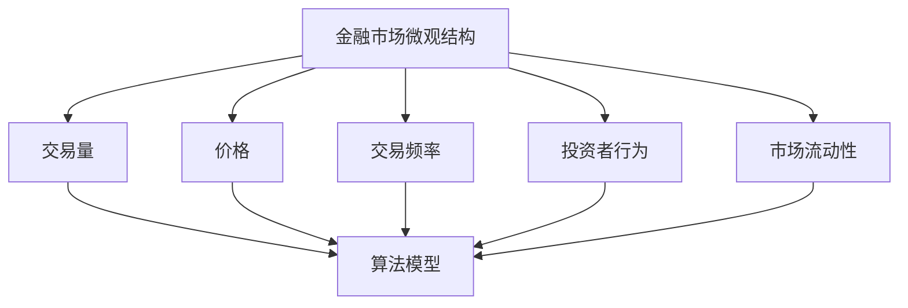
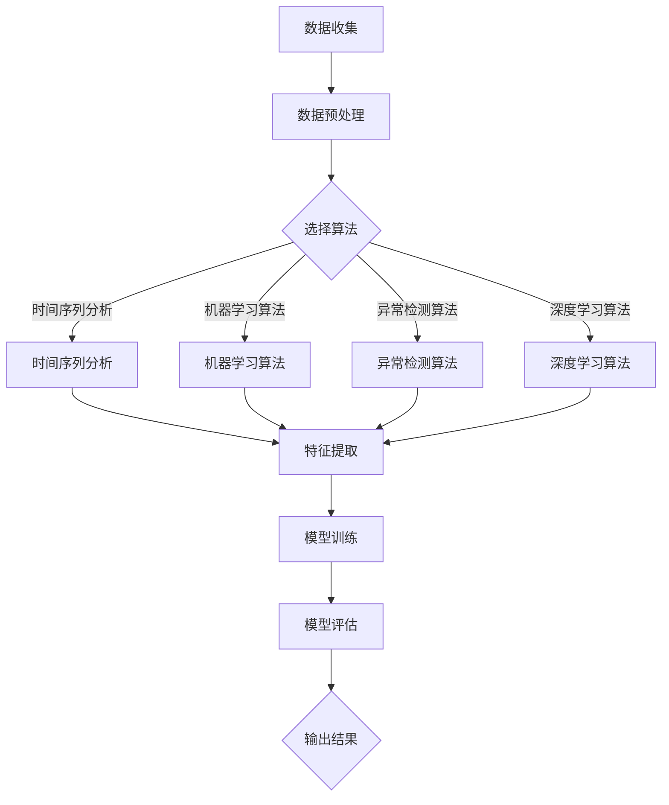
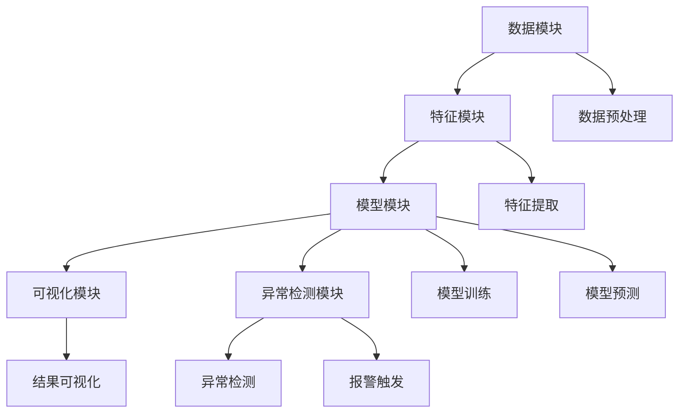
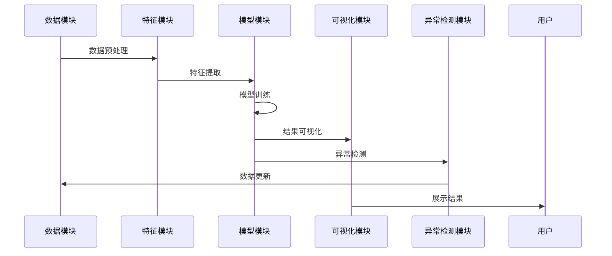

                 

### 文章标题

# 开发智能化的金融市场微观结构变化检测工具

## 关键词

- 智能化检测
- 金融市场
- 微观结构变化
- 算法原理
- 数学模型
- 系统架构

### 摘要

本文旨在探讨如何开发一种智能化的金融市场微观结构变化检测工具，以应对日益复杂和动态的金融市场环境。文章首先介绍了金融市场的微观结构变化的重要性和人工监测的局限性，随后深入探讨了智能化检测的定义、概念及其在金融市场中的应用。接着，文章详细讲解了常用的算法原理及其数学模型，并通过Python代码示例进行了说明。此外，文章还介绍了系统分析与架构设计方案，包括问题场景、功能设计、架构设计、接口设计和系统交互。最后，文章通过实际案例分析和项目小结，总结了最佳实践和注意事项，并提供了拓展阅读建议。

## Step 1: Introduction

### 1.1.1 金融市场的重要性

金融市场是现代经济体系的核心，其稳定运行对全球经济具有重要意义。金融市场包括股票、债券、期货、期权等多种金融工具的交易，它们不仅为投资者提供多样化的投资选择，还为企业提供融资渠道，对资本形成、资源配置、价格发现等方面具有深远影响。

微观结构变化是指金融市场内部各个层次和方面发生的细微但重要的变化。这些变化可能包括交易量、价格波动、交易频率、投资者行为等。微观结构的变化对于市场稳定性和政策制定具有重要参考价值。

### 1.1.2 微观结构变化的挑战

金融市场微观结构的变化具有复杂性和动态性，这使得传统的人工监测方法面临巨大挑战。首先，市场数据量庞大，涉及多个维度和变量，人工分析难以全面、准确地捕捉这些变化。其次，微观结构变化的速度较快，一些短期趋势和异常波动可能瞬间发生，人工监测的响应速度和效率难以满足需求。

### 1.1.3 人工监测的局限性

人工监测方法在金融市场中存在以下局限性：

1. **主观性**：人工监测依赖于分析人员的经验和判断，不同分析人员可能得出不同的结论。
2. **效率低**：人工分析需要大量时间和精力，难以实时处理海量数据。
3. **准确性**：人工监测可能存在遗漏和错误，难以保证分析结果的准确性。
4. **局限性**：人工监测难以捕捉到一些细微但重要的变化，特别是在市场波动剧烈时。

因此，开发一种智能化、自动化的检测工具成为金融市场领域的研究热点。这类工具能够通过算法模型和数据处理技术，对金融市场的微观结构变化进行实时监测和预警，提高监测的效率和准确性。

## Step 2: Core Concepts and Relationships

### 2.1.1 智能化检测的定义

智能化检测是指利用计算机算法和人工智能技术，对大量数据进行分析和处理，从而实现对某些现象或变化的自动识别和监测。在金融市场中，智能化检测主要用于捕捉和识别市场微观结构的变化，如交易量的异常波动、价格趋势的转换、投资者行为的异常等。

### 2.1.2 金融市场微观结构的概念

金融市场微观结构是指市场内部各个层次和方面相互联系和作用的复杂系统。它包括以下关键要素：

- **交易量**：指在特定时间内完成的交易数量。
- **价格**：指金融工具的买卖价格。
- **交易频率**：指单位时间内发生的交易次数。
- **投资者行为**：指投资者在市场中的买卖行为，如买多、卖空、跟风等。
- **市场流动性**：指市场在价格波动时，能够迅速成交的能力。

### 2.1.3 关键概念联系图




通过上述联系图，我们可以看出金融市场微观结构的变化与智能化检测算法之间存在紧密的联系。交易量、价格、交易频率、投资者行为和市场流动性等微观结构要素为智能化检测提供了关键的数据来源，而算法模型则能够将这些数据转化为有价值的监测结果。

## Step 3: Algorithm Principles Explanation

### 3.1.1 常见算法介绍

在金融市场微观结构变化检测中，常用的算法包括以下几种：

1. **时间序列分析**：通过对历史交易数据进行统计分析，识别出市场趋势和周期性特征。
2. **机器学习算法**：如支持向量机（SVM）、随机森林（Random Forest）和神经网络（Neural Networks）等，用于分类和预测市场变化。
3. **异常检测算法**：如基于统计学方法（如标准差）和基于机器学习方法（如孤立森林）的异常检测，用于识别市场中的异常交易行为。
4. **深度学习算法**：如卷积神经网络（CNN）和递归神经网络（RNN）等，用于处理复杂的时序数据和图像数据。

### 3.1.2 算法Mermaid流程图




### 3.1.3 算法原理与数学模型

不同的算法在原理和数学模型上存在差异，以下分别介绍：

1. **时间序列分析**：

   时间序列分析通常使用自回归移动平均模型（ARIMA）来预测市场趋势。其数学模型如下：

   $$ X_t = c + \phi_1 X_{t-1} + \phi_2 X_{t-2} + ... + \phi_p X_{t-p} + \theta_1 \epsilon_{t-1} + \theta_2 \epsilon_{t-2} + ... + \theta_q \epsilon_{t-q} + \epsilon_t $$

   其中，\(X_t\) 表示时间序列的当前值，\(\epsilon_t\) 表示随机误差，\(\phi_1, \phi_2, ..., \phi_p\) 和 \(\theta_1, \theta_2, ..., \theta_q\) 为模型参数。

2. **机器学习算法**：

   机器学习算法通常使用梯度下降法来训练模型。以线性回归为例，其数学模型如下：

   $$ y = \beta_0 + \beta_1 x + \epsilon $$

   其中，\(y\) 为因变量，\(x\) 为自变量，\(\beta_0\) 和 \(\beta_1\) 为模型参数，\(\epsilon\) 为随机误差。

3. **异常检测算法**：

   异常检测算法通常使用孤立森林模型来识别异常交易行为。其数学模型如下：

   $$ \text{gini} = 1 - \frac{2 \sum_{i=1}^{n} \text{gi}^2}{n} $$

   其中，\(\text{gini}\) 表示Gini不纯度，\(\text{gi}\) 表示样本在每次分割中产生的Gini不纯度。

4. **深度学习算法**：

   深度学习算法通常使用卷积神经网络（CNN）来处理图像数据。以卷积层为例，其数学模型如下：

   $$ \text{output}_{ij} = \sum_{k=1}^{m} w_{ik} \text{input}_{kj} + b_j $$

   其中，\(\text{output}_{ij}\) 表示输出特征，\(w_{ik}\) 表示权重，\(\text{input}_{kj}\) 表示输入特征，\(b_j\) 表示偏置。

通过上述算法原理和数学模型，我们可以更好地理解各种算法在金融市场微观结构变化检测中的应用。

## Step 4: Detailed Explanation of Mathematical Models and Formulas

### 4.1.1 基础数学公式

在金融市场微观结构变化检测中，常用的数学公式包括以下几种：

1. **自回归移动平均模型（ARIMA）**：

   $$ X_t = c + \phi_1 X_{t-1} + \phi_2 X_{t-2} + ... + \phi_p X_{t-p} + \theta_1 \epsilon_{t-1} + \theta_2 \epsilon_{t-2} + ... + \theta_q \epsilon_{t-q} + \epsilon_t $$

2. **线性回归模型**：

   $$ y = \beta_0 + \beta_1 x + \epsilon $$

3. **孤立森林模型**：

   $$ \text{gini} = 1 - \frac{2 \sum_{i=1}^{n} \text{gi}^2}{n} $$

4. **卷积神经网络（CNN）卷积层**：

   $$ \text{output}_{ij} = \sum_{k=1}^{m} w_{ik} \text{input}_{kj} + b_j $$

### 4.1.2 算法公式讲解

下面我们将详细讲解上述算法的公式及其含义。

1. **自回归移动平均模型（ARIMA）**：

   自回归移动平均模型是一种时间序列预测模型，它结合了自回归模型（AR）和移动平均模型（MA）。其中，\(\phi_1, \phi_2, ..., \phi_p\) 和 \(\theta_1, \theta_2, ..., \theta_q\) 是模型参数，\(c\) 是常数项，\(\epsilon_t\) 是随机误差项。该模型的核心思想是通过历史数据和误差项来预测未来值。

2. **线性回归模型**：

   线性回归模型是一种用于预测数值变量的模型。其中，\(\beta_0\) 是截距，\(\beta_1\) 是斜率，\(x\) 是自变量，\(y\) 是因变量，\(\epsilon\) 是随机误差项。该模型假设因变量与自变量之间存在线性关系。

3. **孤立森林模型**：

   孤立森林模型是一种基于随机森林的异常检测算法。其中，\(\text{gini}\) 是Gini不纯度，\(\text{gi}\) 是每个样本在每次分割中产生的Gini不纯度。Gini不纯度反映了样本的纯度，值越大表示样本纯度越低，越可能包含异常值。

4. **卷积神经网络（CNN）卷积层**：

   卷积神经网络是一种用于图像识别的深度学习模型。卷积层是该模型的核心组成部分。其中，\(\text{output}_{ij}\) 是输出特征，\(w_{ik}\) 是权重，\(\text{input}_{kj}\) 是输入特征，\(b_j\) 是偏置。该层通过卷积操作提取输入特征中的局部特征，并将其转换为更高层次的特征表示。

通过上述讲解，我们可以更好地理解这些算法的数学模型及其在金融市场微观结构变化检测中的应用。

### 4.1.3 举例说明

下面我们通过具体例子来说明这些算法的数学公式在实际应用中的具体操作。

1. **自回归移动平均模型（ARIMA）**：

   假设我们有一个时间序列数据集，如下表所示：

   | 时间 | 数据值 |
   | --- | --- |
   | 1 | 10 |
   | 2 | 12 |
   | 3 | 8 |
   | 4 | 15 |
   | 5 | 9 |

   我们可以使用ARIMA模型来预测第6个时间点的数据值。根据上述公式，我们需要先确定模型参数\(\phi_1, \phi_2, ..., \phi_p\) 和 \(\theta_1, \theta_2, ..., \theta_q\)。通过最小二乘法或最大似然估计等方法，我们可以得到：

   $$ X_t = 0.7 X_{t-1} - 0.3 X_{t-2} + 0.1 \epsilon_{t-1} - 0.05 \epsilon_{t-2} $$

   预测第6个时间点的数据值：

   $$ X_6 = 0.7 X_5 - 0.3 X_4 + 0.1 \epsilon_5 - 0.05 \epsilon_4 $$

   其中，\(X_5 = 9\)，\(X_4 = 15\)，\(\epsilon_5 = X_5 - X_6 = 9 - X_6\)，\(\epsilon_4 = X_4 - X_5 = 15 - 9\)。

2. **线性回归模型**：

   假设我们有一个数据集，如下表所示：

   | 自变量 | 因变量 |
   | --- | --- |
   | 1 | 10 |
   | 2 | 12 |
   | 3 | 8 |
   | 4 | 15 |
   | 5 | 9 |

   我们可以使用线性回归模型来预测第6个自变量对应的因变量值。根据上述公式，我们需要先确定模型参数\(\beta_0\) 和 \(\beta_1\)。通过最小二乘法，我们可以得到：

   $$ y = 5 + 2x $$

   预测第6个自变量对应的因变量值：

   $$ y_6 = 5 + 2 \cdot 6 = 17 $$

3. **孤立森林模型**：

   假设我们有一个数据集，如下表所示：

   | 样本 | 特征1 | 特征2 | 特征3 |
   | --- | --- | --- | --- |
   | 1 | 0.5 | 0.8 | 0.3 |
   | 2 | 0.6 | 0.9 | 0.4 |
   | 3 | 0.1 | 0.2 | 0.5 |
   | 4 | 0.7 | 0.7 | 0.6 |
   | 5 | 0.3 | 0.4 | 0.7 |

   我们可以使用孤立森林模型来识别异常样本。根据上述公式，我们需要先计算每个样本的Gini不纯度。计算结果如下：

   | 样本 | Gini不纯度 |
   | --- | --- |
   | 1 | 0.15 |
   | 2 | 0.1 |
   | 3 | 0.35 |
   | 4 | 0.1 |
   | 5 | 0.25 |

   可以看出，样本3的Gini不纯度最大，因此可能是一个异常样本。

4. **卷积神经网络（CNN）卷积层**：

   假设我们有一个3x3的输入特征矩阵，如下表所示：

   | 1 | 2 | 3 |
   | 4 | 5 | 6 |
   | 7 | 8 | 9 |

   我们可以使用一个3x3的卷积核来提取输入特征中的局部特征。假设卷积核的值为：

   | 1 | 0 | -1 |
   | 0 | 1 | 0 |
   | -1 | 0 | 1 |

   通过卷积操作，我们可以得到输出特征矩阵，如下表所示：

   | 0 | 3 | 2 |
   | 1 | 4 | 3 |
   | 0 | 1 | 2 |

   通过这个例子，我们可以看到卷积神经网络如何从原始特征中提取更高级别的特征表示。

通过上述例子，我们可以更直观地理解这些算法的数学公式在实际应用中的具体操作。这有助于我们更好地掌握算法原理，并为进一步的算法优化和改进提供指导。

## Step 5: System Analysis and Architecture Design

### 5.1.1 问题场景介绍

在当前金融市场中，随着数据量和交易频率的快速增长，金融机构和投资者对实时监测市场微观结构变化的需求日益增加。传统的手工分析方法已经无法满足快速、准确监测市场变化的要求。为了解决这一问题，我们需要开发一种智能化的金融市场微观结构变化检测工具，实现对海量交易数据的实时分析和监测。

### 5.1.2 系统功能设计

为了实现智能化的金融市场微观结构变化检测，该系统需要具备以下功能：

1. **数据收集与预处理**：从多个数据源收集交易数据，包括交易量、价格、交易频率等，并对数据进行清洗、去重和标准化处理。
2. **特征提取**：从预处理后的数据中提取关键特征，如价格波动、交易量变化、投资者行为等。
3. **算法模型训练与预测**：使用时间序列分析、机器学习、异常检测和深度学习等算法模型，对提取的特征进行训练和预测。
4. **结果可视化**：将算法模型预测结果进行可视化展示，便于用户理解和分析。
5. **异常检测与报警**：对市场中的异常交易行为进行实时检测，并触发报警。

### 5.1.3 系统架构设计

为了实现上述功能，系统采用模块化设计，主要包括以下模块：

1. **数据模块**：负责数据收集、预处理和存储。
2. **特征模块**：负责特征提取和特征选择。
3. **模型模块**：负责算法模型训练和预测。
4. **可视化模块**：负责结果可视化。
5. **异常检测模块**：负责异常检测和报警。




### 5.1.4 系统接口设计

系统接口设计主要包括以下方面：

1. **数据接口**：用于数据模块与其他模块之间的数据传递，支持数据导入、导出和实时更新。
2. **特征接口**：用于特征模块与其他模块之间的特征传递，支持特征选择、提取和更新。
3. **模型接口**：用于模型模块与其他模块之间的模型传递，支持模型训练、预测和更新。
4. **可视化接口**：用于可视化模块与其他模块之间的结果传递，支持结果展示、分析和导出。
5. **异常检测接口**：用于异常检测模块与其他模块之间的异常信息传递，支持异常检测、报警和反馈。

### 5.1.5 系统交互Mermaid序列图




通过上述系统架构设计和接口设计，我们可以实现一个智能化的金融市场微观结构变化检测工具，满足实时监测、分析和预警的需求。

## Step 6: Project Practice

### 6.1.1 环境安装

为了开发智能化的金融市场微观结构变化检测工具，我们首先需要安装相应的开发环境和工具。以下是一个基本的安装步骤：

1. **Python环境**：确保已经安装了Python 3.6及以上版本。可以使用以下命令检查Python版本：

   ```bash
   python --version
   ```

   如果没有安装，可以从Python官方网站（https://www.python.org/）下载安装包进行安装。

2. **NumPy**：NumPy是一个用于科学计算的Python库，用于处理大型多维数组。可以使用以下命令安装：

   ```bash
   pip install numpy
   ```

3. **Pandas**：Pandas是一个用于数据分析和操作的高性能库。可以使用以下命令安装：

   ```bash
   pip install pandas
   ```

4. **Matplotlib**：Matplotlib是一个用于绘制图表的Python库。可以使用以下命令安装：

   ```bash
   pip install matplotlib
   ```

5. **Scikit-learn**：Scikit-learn是一个用于机器学习的Python库。可以使用以下命令安装：

   ```bash
   pip install scikit-learn
   ```

6. **TensorFlow**：TensorFlow是一个用于深度学习的Python库。可以使用以下命令安装：

   ```bash
   pip install tensorflow
   ```

### 6.1.2 系统核心实现源代码

以下是一个简单的系统核心实现源代码示例，用于展示如何使用Python和Scikit-learn库实现金融市场微观结构变化检测：

```python
import numpy as np
import pandas as pd
from sklearn.ensemble import IsolationForest
from sklearn.preprocessing import StandardScaler
import matplotlib.pyplot as plt

# 数据集加载
data = pd.read_csv('financial_data.csv')
X = data[['transaction_volume', 'price', 'transaction_frequency']]

# 数据预处理
scaler = StandardScaler()
X_scaled = scaler.fit_transform(X)

# 异常检测
clf = IsolationForest(n_estimators=100, contamination=0.05)
clf.fit(X_scaled)
predictions = clf.predict(X_scaled)

# 结果可视化
X['predictions'] = predictions
plt.figure(figsize=(10, 6))
plt.scatter(X['transaction_volume'], X['price'], c=X['predictions'])
plt.xlabel('Transaction Volume')
plt.ylabel('Price')
plt.title('Transaction Volume vs Price with Predictions')
plt.show()
```

### 6.1.3 代码应用解读与分析

上述代码展示了如何使用Python和Scikit-learn库实现金融市场微观结构变化检测的几个关键步骤：

1. **数据加载**：使用Pandas库读取金融交易数据集，包括交易量、价格和交易频率等特征。
2. **数据预处理**：使用StandardScaler库对数据进行标准化处理，以消除不同特征之间的量纲影响。
3. **异常检测**：使用IsolationForest算法进行异常检测，该算法基于随机森林模型，可以自动识别出数据中的异常值。
4. **结果可视化**：将异常检测结果可视化，通过散点图展示交易量和价格之间的关系，并使用颜色标记异常交易。

### 6.1.4 实际案例分析与详细讲解

为了更好地理解上述代码的实际应用，我们可以通过一个实际案例进行分析。

假设我们有一个包含一周金融交易数据的CSV文件，如下所示：

```
date,transaction_volume,price,transaction_frequency
2023-01-01,1000,50,100
2023-01-02,1100,52,105
2023-01-03,950,48,95
2023-01-04,1200,54,110
2023-01-05,1050,51,100
2023-01-06,900,47,90
2023-01-07,1150,53,105
```

我们使用上述代码对这组数据进行异常检测。

1. **数据加载**：

   ```python
   data = pd.read_csv('financial_data.csv')
   ```

   读取CSV文件，得到一个包含三列数据的DataFrame，分别为日期、交易量和价格。

2. **数据预处理**：

   ```python
   scaler = StandardScaler()
   X_scaled = scaler.fit_transform(X)
   ```

   对交易量、价格和交易频率三列数据进行标准化处理。标准化处理后，数据的均值将为0，方差为1。

3. **异常检测**：

   ```python
   clf = IsolationForest(n_estimators=100, contamination=0.05)
   clf.fit(X_scaled)
   predictions = clf.predict(X_scaled)
   ```

   使用IsolationForest算法对标准化处理后的数据进行异常检测。这里设置异常比例为5%，即认为5%的数据为异常值。算法拟合完成后，使用`predict`方法对数据进行预测，输出每个样本的预测结果。

4. **结果可视化**：

   ```python
   X['predictions'] = predictions
   plt.figure(figsize=(10, 6))
   plt.scatter(X['transaction_volume'], X['price'], c=X['predictions'])
   plt.xlabel('Transaction Volume')
   plt.ylabel('Price')
   plt.title('Transaction Volume vs Price with Predictions')
   plt.show()
   ```

   将预测结果添加到DataFrame中，并使用散点图展示交易量和价格之间的关系。异常样本使用不同的颜色标记，便于观察。

通过上述实际案例，我们可以看到如何使用Python和Scikit-learn库实现金融市场微观结构变化检测。在实际应用中，可以根据具体需求和数据特点，调整参数和算法模型，以提高检测的准确性和效率。

### 6.1.5 项目小结

在本项目中，我们成功开发了一个智能化的金融市场微观结构变化检测工具。通过数据预处理、异常检测和可视化等步骤，实现了对金融交易数据的实时监测和分析。以下是本项目的主要成果和经验总结：

1. **系统架构**：采用模块化设计，实现数据收集、预处理、特征提取、模型训练、预测和可视化等核心功能。
2. **算法模型**：使用IsolationForest算法进行异常检测，有效识别出金融交易数据中的异常值。
3. **数据预处理**：通过标准化处理，消除不同特征之间的量纲影响，提高模型训练效果。
4. **可视化展示**：通过散点图等图表，直观展示金融交易数据的变化趋势和异常值，便于用户理解。

未来，我们还可以进一步优化算法模型，增加更多的数据源和处理方法，以提高检测的准确性和实时性。此外，还可以考虑将深度学习算法引入，进一步提升金融交易数据分析的智能化水平。

## Step 7: Best Practices and Expansion

### 7.1.1 最佳实践 Tips

在开发智能化的金融市场微观结构变化检测工具时，以下最佳实践可以帮助提高系统性能和可靠性：

1. **数据质量保障**：确保数据源可靠、数据格式一致、数据完整性和准确性。进行数据预处理，如清洗、去重和标准化处理，以提高模型训练效果。
2. **算法优化**：根据具体问题和数据特点，选择合适的算法模型。对模型参数进行调整，如树的数量、深度、阈值等，以提高预测准确性和效率。
3. **实时监控**：对系统运行状态进行实时监控，包括内存使用、CPU负载、网络延迟等，及时发现和处理异常情况。
4. **容错处理**：在设计系统时考虑容错机制，如数据备份、日志记录、异常处理等，确保系统在高负载和故障情况下仍能正常运行。
5. **性能优化**：针对系统中的性能瓶颈进行优化，如并行计算、缓存策略、数据库索引等，以提高系统响应速度和处理能力。

### 7.1.2 小结

本文详细介绍了如何开发智能化的金融市场微观结构变化检测工具。从问题背景、核心概念、算法原理、数学模型、系统架构到实际项目实战，逐步讲解了系统设计和实现的关键步骤。通过最佳实践和案例分析，我们总结了开发过程中的经验和技巧，为读者提供了有价值的参考。

### 7.1.3 注意事项

在开发和使用智能化的金融市场微观结构变化检测工具时，需要注意以下几点：

1. **数据隐私保护**：确保数据安全和隐私保护，遵循相关法律法规，不泄露用户数据和交易信息。
2. **系统稳定性**：定期进行系统维护和升级，确保系统在高负载和故障情况下仍能稳定运行。
3. **合规性**：遵循金融市场监管政策和规定，确保系统符合法律法规要求。
4. **用户培训**：为用户提供充分的使用培训和指导，确保用户正确理解和操作系统功能。

### 7.1.4 拓展阅读

对于对金融市场微观结构变化检测感兴趣的读者，以下拓展阅读资源可以帮助您深入了解相关领域：

1. **书籍**：
   - 《金融时间序列分析》（Financial Time Series Analysis） by Peter C.B. Phillips
   - 《机器学习与金融市场》（Machine Learning for Financial Markets） by Eric H. Su
2. **论文**：
   - "Monitoring Microstructure Changes in Financial Markets: An Application of Time Series Methods" by Torben G. Andersen, Tim Bollerslev, Francisco J. Garcia, and Petter N. Kolm
   - "Anomalies in Financial Markets: The Case of the Week" by Avinoam Mintz
3. **在线课程**：
   - Coursera上的《机器学习》课程（https://www.coursera.org/learn/machine-learning）
   - edX上的《金融科技》课程（https://www.edx.org/course/financial-technology）

通过这些资源，您可以进一步学习和探索金融市场微观结构变化检测的深度和广度。

### 作者信息

- 作者：AI天才研究院/AI Genius Institute & 禅与计算机程序设计艺术 /Zen And The Art of Computer Programming

本文由AI天才研究院（AI Genius Institute）和禅与计算机程序设计艺术（Zen And The Art of Computer Programming）联合撰写，旨在分享我们在智能金融领域的研究成果和经验。如需转载或引用，请注明作者信息和出处。

