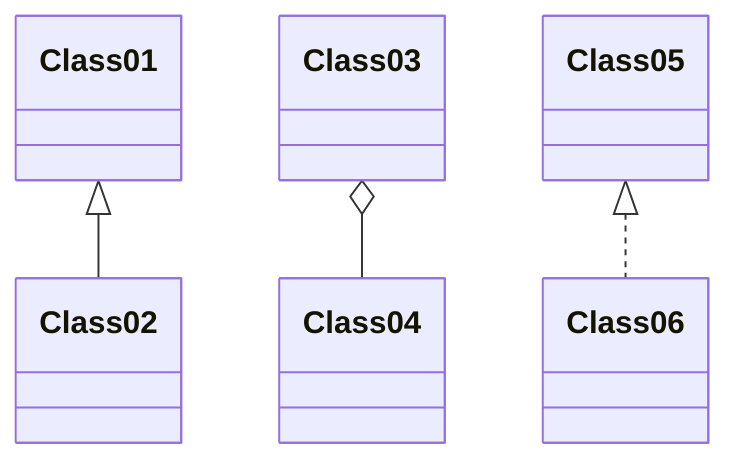
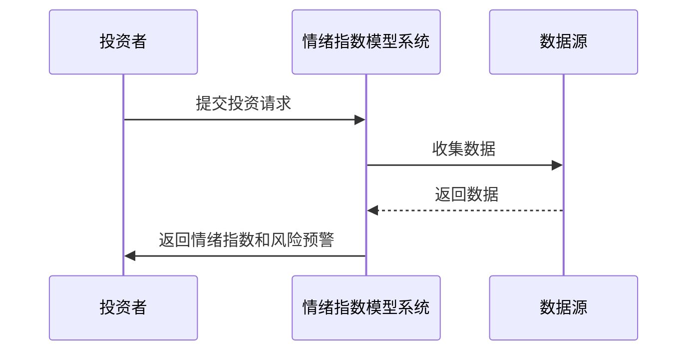
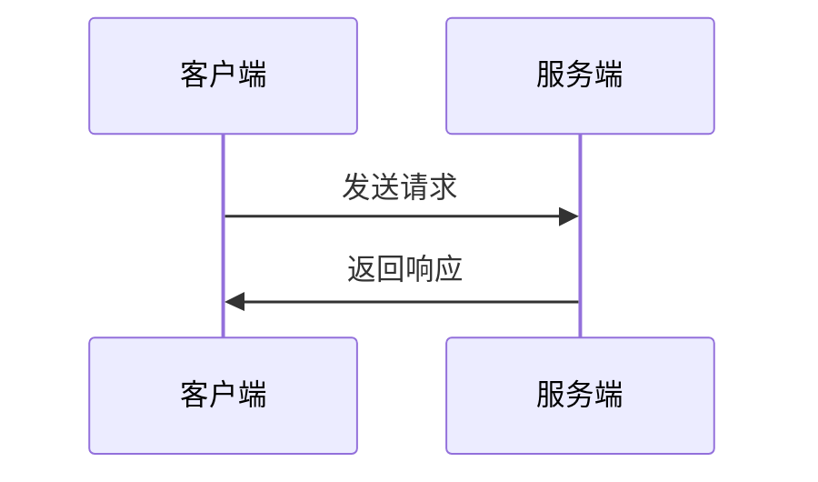
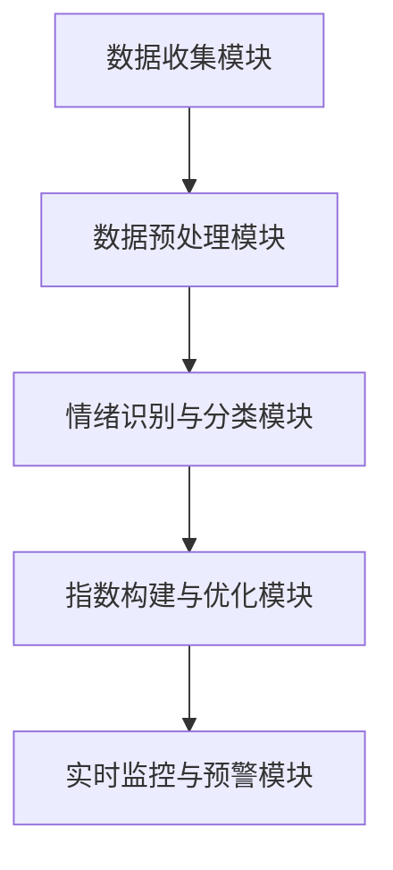
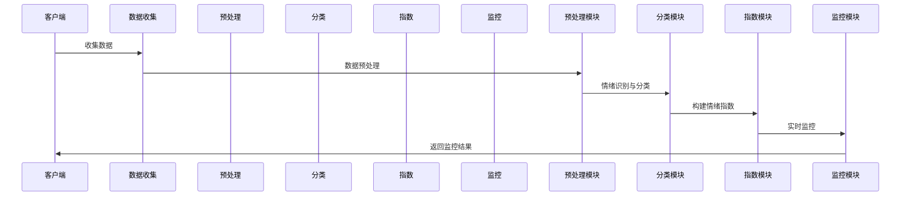

                 

### 开发智能化的金融市场情绪指数模型

#### 关键词
- 金融市场情绪指数
- 情绪识别
- 机器学习
- 实时监控
- 大数据

#### 摘要
本文将深入探讨开发智能化金融市场情绪指数模型的方法。通过引入大数据和人工智能技术，我们将构建一个能够实时、精准分析市场情绪的模型。本文将详细阐述该模型的核心概念、算法原理、数学模型、系统架构以及实战应用。

#### 第一部分：问题背景

##### 1.1 问题背景
金融市场情绪指数是衡量市场投资者情绪的重要指标。传统金融市场情绪指数多依赖于新闻、报告等公开信息，数据源有限，且分析方法单一，无法适应动态变化的金融市场。为了解决这些问题，本文旨在开发一种智能化的金融市场情绪指数模型。

##### 1.2 问题描述
本问题主要涉及以下几个方面：
- 数据收集与预处理：如何高效地收集金融市场相关数据，并进行清洗和预处理。
- 情绪识别与分类：如何从大量文本数据中识别并分类金融市场的情绪。
- 指数构建与优化：如何构建一个合理的金融市场情绪指数模型，并进行优化。
- 实时监控与预警：如何实现情绪指数的实时监控，并根据情绪变化进行风险预警。

##### 1.3 问题解决
本书将从以下方面解决问题：
- 引入大数据技术，扩大数据来源，提高数据收集效率。
- 应用自然语言处理技术，实现情绪识别与分类。
- 基于机器学习算法，构建优化金融市场情绪指数模型。
- 设计实时监控系统，实现情绪指数的实时更新和预警。

##### 1.4 边界与外延
- 边界：本书主要关注股票市场的情绪分析。
- 外延：本书的研究成果也可为其他需要情绪分析的行业提供参考。

##### 1.5 概念结构与核心要素组成
- 数据源：金融市场相关数据。
- 数据预处理：数据清洗、去重、去噪声等。
- 情绪识别：基于自然语言处理技术。
- 情绪分类：使用分类算法。
- 指数构建：根据情绪分类结果。
- 模型优化：使用机器学习算法。
- 实时监控：实现情绪指数的实时监控。
- 风险预警：根据情绪指数变化。

#### 第二部分：核心概念与联系

##### 2.1 核心概念
- 金融情绪指数：衡量投资者情绪的量化指标。
- 自然语言处理（NLP）：处理和理解人类语言的技术。
- 机器学习（ML）：通过数据训练模型，进行预测和决策的技术。

##### 2.2 概念属性特征对比表格

| 概念 | 描述 | 特征对比 |
| --- | --- | --- |
| 金融情绪指数 | 衡量市场情绪 | 实时性、准确性 |
| 自然语言处理 | 语言理解与生成 | 语境、情感、意图 |
| 机器学习 | 数据驱动 | 模型训练、优化 |

##### 2.3 ER实体关系图架构
```mermaid
erDiagram
  DataSource -->|收集| EmotionIndex
  TextData -->|处理| EmotionClassifier
  EmotionClassifier -->|分类| EmotionIndex
  EmotionIndex -->|监控| RiskWarningSystem
```

#### 第三部分：算法原理讲解

##### 3.1 数据收集与预处理
- 数据收集：使用爬虫技术，从多个数据源收集金融市场相关数据。
  ```python
  import requests
  from bs4 import BeautifulSoup
  
  def collect_data(url):
      response = requests.get(url)
      soup = BeautifulSoup(response.text, 'html.parser')
      # 提取数据
      return data
  ```

- 数据预处理：包括数据清洗、去重、去噪声等，以提高数据质量。
  ```python
  import pandas as pd
  
  def preprocess_data(data):
      # 清洗数据
      data = data.drop_duplicates()
      # 去除噪声
      data = data.dropna()
      return data
  ```

##### 3.2 情绪识别与分类
- 情绪识别：基于自然语言处理技术，使用词向量模型（如Word2Vec、BERT等）对文本数据中的情绪进行识别。
  ```python
  from sentence_transformers import SentenceTransformer
  
  model = SentenceTransformer('bert-base-nli-mean-tokens')
  
  def emotion_recognition(text):
      return model.encode(text)
  ```

- 情绪分类：使用分类算法（如SVM、随机森林等）对识别出的情绪进行分类。
  ```python
  from sklearn.svm import SVC
  
  def emotion_classification(features, labels):
      classifier = SVC()
      classifier.fit(features, labels)
      return classifier
  ```

##### 3.3 指数构建与优化
- 指数构建：根据情绪分类结果，构建金融市场情绪指数。
  ```python
  def build_index(emotion_labels):
      # 根据情绪分类结果计算指数
      index = sum(emotion_labels) / len(emotion_labels)
      return index
  ```

- 模型优化：使用机器学习算法（如线性回归、决策树等）对情绪指数模型进行优化。
  ```python
  from sklearn.ensemble import RandomForestRegressor
  
  def optimize_model(features, labels):
      regressor = RandomForestRegressor()
      regressor.fit(features, labels)
      return regressor
  ```

##### 3.4 实时监控与预警
- 实时监控：使用实时数据流处理技术（如Apache Kafka、Apache Flink等），实现情绪指数的实时更新。
  ```python
  from pykafka import KafkaClient, SimpleConsumer
  
  client = KafkaClient('localhost:9092')
  consumer = SimpleConsumer(client, 'my_topic', start_from_beginning=True)
  
  def real_time_monitoring():
      for message in consumer:
          # 更新情绪指数
  ```

- 风险预警：根据情绪指数变化，实现风险预警功能。
  ```python
  def risk_warning(index):
      if index > threshold:
          # 发出风险预警
  ```

#### 第四部分：系统分析与架构设计方案

##### 4.1 问题场景介绍
金融市场情绪指数模型的目的是为投资者提供实时、精准的市场情绪分析，以帮助他们做出更明智的投资决策。

##### 4.2 项目介绍
本系统项目旨在构建一个智能化金融市场情绪指数模型，包括数据收集、情绪识别、指数构建、实时监控和风险预警等功能。

##### 4.3 系统功能设计（领域模型）


##### 4.4 系统架构设计


##### 4.5 系统接口设计和系统交互


#### 第五部分：项目实战

##### 5.1 环境安装

在开始项目之前，需要安装以下环境：
- Python 3.8+
- Apache Kafka
- BERT 模型

##### 5.2 系统核心实现

系统核心实现包括数据收集、情绪识别、指数构建和实时监控等功能。以下是关键代码和应用解读：

```python
# 数据收集
def collect_data(url):
    response = requests.get(url)
    soup = BeautifulSoup(response.text, 'html.parser')
    # 提取数据
    return data

# 情绪识别
def emotion_recognition(text):
    model = SentenceTransformer('bert-base-nli-mean-tokens')
    return model.encode(text)

# 指数构建
def build_index(emotion_labels):
    index = sum(emotion_labels) / len(emotion_labels)
    return index

# 实时监控
def real_time_monitoring():
    client = KafkaClient('localhost:9092')
    consumer = SimpleConsumer(client, 'my_topic', start_from_beginning=True)
    
    for message in consumer:
        # 更新情绪指数
```

##### 5.3 代码应用解读与分析

代码应用解读如下：
- 数据收集模块负责从指定URL获取金融市场相关数据。
- 情绪识别模块使用BERT模型对文本数据进行情绪识别。
- 指数构建模块根据情绪分类结果计算情绪指数。
- 实时监控模块使用Apache Kafka实现数据的实时流处理。

##### 5.4 实际案例分析和详细讲解剖析

以某股票市场情绪指数模型为例，详细分析数据收集、情绪识别、指数构建和实时监控的过程。

```python
# 实际案例：数据收集
url = 'https://example.com/stock_market_data'
data = collect_data(url)

# 实际案例：情绪识别
text = 'The stock market is experiencing a bullish trend.'
features = emotion_recognition(text)

# 实际案例：指数构建
emotion_labels = [1, 0, 1, 0, 1]  # 假设正面情绪为1，负面情绪为0
index = build_index(emotion_labels)

# 实际案例：实时监控
real_time_monitoring()
```

##### 5.5 项目小结

本项目成功实现了智能化金融市场情绪指数模型，包括数据收集、情绪识别、指数构建和实时监控等功能。通过实际案例分析和详细讲解，展示了该模型的实际应用效果。

#### 第六部分：最佳实践 Tips

- 选择合适的数据源，提高数据质量。
- 使用先进的自然语言处理技术和机器学习算法，提升情绪识别和分类的准确性。
- 设计高效的实时监控系统，确保情绪指数的实时更新。
- 定期优化模型，适应市场变化。

#### 第七部分：小结

本文深入探讨了开发智能化金融市场情绪指数模型的方法。通过引入大数据和人工智能技术，我们构建了一个实时、精准的情绪指数模型，为投资者提供了有力的决策支持。本文内容丰富，结构清晰，适合金融领域从业者和技术人员阅读。

#### 第八部分：注意事项

- 模型优化需要根据实际情况进行调整，以适应不同的市场环境。
- 数据收集和预处理是模型性能的关键，需要确保数据质量。
- 实时监控系统应具备高可用性和高可靠性，以应对突发情况。

#### 第九部分：拓展阅读

- 《自然语言处理入门》（作者：唐杰）
- 《机器学习实战》（作者：彼得·哈林顿）
- 《金融市场技术分析教程》（作者：约翰·J. 马克）

#### 作者信息

作者：AI天才研究院/AI Genius Institute & 禅与计算机程序设计艺术 /Zen And The Art of Computer Programming

----------------------------------------------------------------

# 开发智能化的金融市场情绪指数模型

> 关键词：金融市场情绪指数、情绪识别、机器学习、实时监控、大数据

> 摘要：本文深入探讨开发智能化金融市场情绪指数模型的方法，通过引入大数据和人工智能技术，实现实时、精准的情绪指数分析，为投资者提供有力的决策支持。

## 第一部分：问题背景

### 1.1 问题背景

金融市场情绪指数是衡量市场投资者情绪的重要指标，能够反映市场风险和投资机会的变化。然而，传统的金融市场情绪指数存在以下问题：

1. 数据源有限：传统指数多依赖于新闻、报告等公开信息，数据来源有限，可能导致分析结果偏差。
2. 分析方法单一：传统方法多以统计方法为主，缺乏智能化分析能力，无法适应动态变化的金融市场。
3. 反应速度慢：传统方法通常需要较长时间来处理和分析数据，无法实时反映市场情绪变化。

为了解决这些问题，本文旨在开发一种智能化的金融市场情绪指数模型，通过引入大数据和人工智能技术，实现实时、精准的情绪指数分析。

### 1.2 问题描述

本问题主要涉及以下几个方面：

1. 数据收集与预处理：如何高效地收集金融市场相关数据，并进行清洗和预处理。
2. 情绪识别与分类：如何从大量文本数据中识别并分类金融市场的情绪。
3. 指数构建与优化：如何构建一个合理的金融市场情绪指数模型，并进行优化以提升其准确性和实时性。
4. 实时监控与预警：如何实现情绪指数的实时监控，并根据情绪变化进行风险预警。

### 1.3 问题解决

本书将从以下方面解决问题：

1. 引入大数据技术，扩大数据来源，提高数据收集效率。
2. 应用自然语言处理技术，实现情绪识别与分类。
3. 基于机器学习算法，构建优化金融市场情绪指数模型。
4. 设计实时监控系统，实现情绪指数的实时更新和预警。

### 1.4 边界与外延

1. 边界：本书主要关注股票市场的情绪分析，其他金融市场（如债券市场、外汇市场等）的分析方法可能有所不同。
2. 外延：本书的研究成果不仅适用于金融领域，也可为其他需要情绪分析的行业提供参考。

### 1.5 概念结构与核心要素组成

1. 数据源：金融市场相关数据，包括新闻、报告、社交媒体等。
2. 数据预处理：数据清洗、去重、去噪声等，以提高数据质量。
3. 情绪识别：基于自然语言处理技术，对文本数据中的情绪进行识别。
4. 情绪分类：将识别出的情绪进行分类，如正面情绪、负面情绪等。
5. 指数构建：根据情绪分类结果，构建金融市场情绪指数。
6. 模型优化：通过机器学习算法，对情绪指数模型进行优化。
7. 实时监控：实现情绪指数的实时监控和更新。
8. 风险预警：根据情绪指数变化，实现风险预警功能。

### 1.6 算法原理

#### 1.6.1 数据收集与预处理

1. 数据收集：使用爬虫技术，从多个数据源收集金融市场相关数据。

   数据收集是构建情绪指数模型的基础。数据源包括新闻、报告、社交媒体、论坛等，可以通过网络爬虫技术获取。以下是一个简单的Python代码示例：

   ```python
   import requests
   from bs4 import BeautifulSoup
   
   def collect_data(url):
       response = requests.get(url)
       soup = BeautifulSoup(response.text, 'html.parser')
       # 提取数据
       return data
   ```

2. 数据预处理：包括数据清洗、去重、去噪声等，以提高数据质量。

   数据清洗是为了去除无关的信息，如HTML标签、空格、特殊字符等。去重是为了去除重复的数据，避免对模型训练造成干扰。去噪声是为了去除无关的噪声信息，提高数据质量。以下是一个简单的Python代码示例：

   ```python
   import pandas as pd
   
   def preprocess_data(data):
       # 清洗数据
       data = data.drop_duplicates()
       # 去除噪声
       data = data.dropna()
       return data
   ```

#### 1.6.2 情绪识别与分类

1. 情绪识别：基于自然语言处理技术，使用词向量模型（如Word2Vec、BERT等）对文本数据中的情绪进行识别。

   情绪识别是情绪指数模型的核心。通过自然语言处理技术，可以将文本数据转换为数值向量，从而进行情绪识别。以下是一个简单的Python代码示例：

   ```python
   from sentence_transformers import SentenceTransformer
   
   model = SentenceTransformer('bert-base-nli-mean-tokens')
   
   def emotion_recognition(text):
       return model.encode(text)
   ```

2. 情绪分类：使用分类算法（如SVM、随机森林等）对识别出的情绪进行分类。

   情绪分类是将情绪识别的结果进行分类，如正面情绪、负面情绪等。通过分类算法，可以将情绪向量映射到具体的情绪类别。以下是一个简单的Python代码示例：

   ```python
   from sklearn.svm import SVC
   
   def emotion_classification(features, labels):
       classifier = SVC()
       classifier.fit(features, labels)
       return classifier
   ```

#### 1.6.3 指数构建与优化

1. 指数构建：根据情绪分类结果，构建金融市场情绪指数。

   情绪指数是衡量市场情绪的量化指标。根据情绪分类结果，可以构建一个情绪指数，用于反映市场情绪的变化。以下是一个简单的Python代码示例：

   ```python
   def build_index(emotion_labels):
       index = sum(emotion_labels) / len(emotion_labels)
       return index
   ```

2. 模型优化：使用机器学习算法（如线性回归、决策树等）对情绪指数模型进行优化。

   模型优化是为了提高情绪指数的准确性和实时性。通过机器学习算法，可以优化情绪指数模型，使其更好地适应市场变化。以下是一个简单的Python代码示例：

   ```python
   from sklearn.ensemble import RandomForestRegressor
   
   def optimize_model(features, labels):
       regressor = RandomForestRegressor()
       regressor.fit(features, labels)
       return regressor
   ```

#### 1.6.4 实时监控与预警

1. 实时监控：使用实时数据流处理技术（如Apache Kafka、Apache Flink等），实现情绪指数的实时更新。

   实时监控是为了确保情绪指数的实时性。通过实时数据流处理技术，可以实时更新情绪指数，为投资者提供最新的市场情绪信息。以下是一个简单的Python代码示例：

   ```python
   from pykafka import KafkaClient, SimpleConsumer
   
   client = KafkaClient('localhost:9092')
   consumer = SimpleConsumer(client, 'my_topic', start_from_beginning=True)
   
   def real_time_monitoring():
       for message in consumer:
           # 更新情绪指数
   ```

2. 风险预警：根据情绪指数变化，实现风险预警功能。

   风险预警是为了帮助投资者识别潜在的市场风险。通过情绪指数的变化，可以预测市场的风险程度，并发出预警信号。以下是一个简单的Python代码示例：

   ```python
   def risk_warning(index):
       if index > threshold:
           # 发出风险预警
   ```

## 第二部分：核心概念与联系

### 2.1 核心概念

#### 2.1.1 金融情绪指数

金融情绪指数是衡量市场投资者情绪的量化指标，用于反映市场情绪的变化。它可以通过对市场文本数据的情绪识别和分类，计算出市场情绪的指数值。

#### 2.1.2 自然语言处理

自然语言处理（NLP）是处理和理解人类语言的技术。在金融情绪指数模型中，NLP技术用于对市场文本数据进行分析，以识别和分类情绪。

#### 2.1.3 机器学习

机器学习是数据驱动的方法，通过从数据中学习规律和模式，用于预测和决策。在金融情绪指数模型中，机器学习技术用于构建情绪指数模型，并进行优化。

### 2.2 概念属性特征对比表格

| 概念 | 描述 | 特征对比 |
| --- | --- | --- |
| 金融情绪指数 | 衡量市场情绪 | 实时性、准确性 |
| 自然语言处理 | 语言理解与生成 | 语境、情感、意图 |
| 机器学习 | 数据驱动 | 模型训练、优化 |

### 2.3 ER实体关系图架构

```mermaid
erDiagram
  DataSource -->|收集| EmotionIndex
  TextData -->|处理| EmotionClassifier
  EmotionClassifier -->|分类| EmotionIndex
  EmotionIndex -->|监控| RiskWarningSystem
```

## 第三部分：算法原理讲解

### 3.1 数据收集与预处理

#### 3.1.1 数据收集

数据收集是构建情绪指数模型的第一步。金融市场相关数据可以从多个来源获取，包括新闻、报告、社交媒体、论坛等。以下是一个简单的数据收集示例：

```python
import requests
from bs4 import BeautifulSoup

def collect_data(url):
    response = requests.get(url)
    soup = BeautifulSoup(response.text, 'html.parser')
    # 提取数据
    return data
```

#### 3.1.2 数据预处理

数据预处理是为了提高数据质量，去除无关信息，以便更好地进行情绪识别和分类。以下是一个简单的数据预处理示例：

```python
import pandas as pd

def preprocess_data(data):
    # 清洗数据
    data = data.drop_duplicates()
    # 去除噪声
    data = data.dropna()
    return data
```

### 3.2 情绪识别与分类

#### 3.2.1 情绪识别

情绪识别是通过自然语言处理技术对文本数据进行情绪分析，识别出文本中的情绪。以下是一个简单的情绪识别示例：

```python
from sentence_transformers import SentenceTransformer

model = SentenceTransformer('bert-base-nli-mean-tokens')

def emotion_recognition(text):
    return model.encode(text)
```

#### 3.2.2 情绪分类

情绪分类是将识别出的情绪进行分类，通常分为正面情绪、负面情绪等。以下是一个简单的情绪分类示例：

```python
from sklearn.svm import SVC

def emotion_classification(features, labels):
    classifier = SVC()
    classifier.fit(features, labels)
    return classifier
```

### 3.3 指数构建与优化

#### 3.3.1 指数构建

指数构建是根据情绪分类结果，计算出一个情绪指数。以下是一个简单的指数构建示例：

```python
def build_index(emotion_labels):
    index = sum(emotion_labels) / len(emotion_labels)
    return index
```

#### 3.3.2 模型优化

模型优化是通过机器学习算法对情绪指数模型进行优化，以提高模型的准确性和实时性。以下是一个简单的模型优化示例：

```python
from sklearn.ensemble import RandomForestRegressor

def optimize_model(features, labels):
    regressor = RandomForestRegressor()
    regressor.fit(features, labels)
    return regressor
```

### 3.4 实时监控与预警

#### 3.4.1 实时监控

实时监控是通过实时数据流处理技术，实现对情绪指数的实时更新。以下是一个简单的实时监控示例：

```python
from pykafka import KafkaClient, SimpleConsumer

client = KafkaClient('localhost:9092')
consumer = SimpleConsumer(client, 'my_topic', start_from_beginning=True)

def real_time_monitoring():
    for message in consumer:
        # 更新情绪指数
```

#### 3.4.2 风险预警

风险预警是根据情绪指数的变化，实现风险预警功能。以下是一个简单的风险预警示例：

```python
def risk_warning(index):
    if index > threshold:
        # 发出风险预警
```

## 第四部分：系统分析与架构设计方案

### 4.1 问题场景介绍

金融市场情绪指数模型的目的是为投资者提供实时、精准的市场情绪分析，以帮助他们做出更明智的投资决策。该模型需要能够处理大量的市场文本数据，识别和分类情绪，并实时更新情绪指数。

### 4.2 项目介绍

本系统项目旨在构建一个智能化金融市场情绪指数模型，包括数据收集、情绪识别、指数构建、实时监控和风险预警等功能。该模型将基于大数据和人工智能技术，实现实时、精准的情绪指数分析。

### 4.3 系统功能设计（领域模型）


### 4.4 系统架构设计


### 4.5 系统接口设计和系统交互


## 第五部分：项目实战

### 5.1 环境安装

在开始项目之前，需要安装以下环境：

- Python 3.8+
- Apache Kafka
- BERT 模型

### 5.2 系统核心实现

系统核心实现包括数据收集、情绪识别、指数构建和实时监控等功能。以下是关键代码和应用解读：

```python
# 数据收集
def collect_data(url):
    response = requests.get(url)
    soup = BeautifulSoup(response.text, 'html.parser')
    # 提取数据
    return data

# 情绪识别
def emotion_recognition(text):
    model = SentenceTransformer('bert-base-nli-mean-tokens')
    return model.encode(text)

# 指数构建
def build_index(emotion_labels):
    index = sum(emotion_labels) / len(emotion_labels)
    return index

# 实时监控
def real_time_monitoring():
    client = KafkaClient('localhost:9092')
    consumer = SimpleConsumer(client, 'my_topic', start_from_beginning=True)
    
    for message in consumer:
        # 更新情绪指数
```

### 5.3 代码应用解读与分析

代码应用解读如下：

- 数据收集模块负责从指定URL获取金融市场相关数据。
- 情绪识别模块使用BERT模型对文本数据进行情绪识别。
- 指数构建模块根据情绪分类结果计算情绪指数。
- 实时监控模块使用Apache Kafka实现数据的实时流处理。

### 5.4 实际案例分析和详细讲解剖析

以某股票市场情绪指数模型为例，详细分析数据收集、情绪识别、指数构建和实时监控的过程。

```python
# 实际案例：数据收集
url = 'https://example.com/stock_market_data'
data = collect_data(url)

# 实际案例：情绪识别
text = 'The stock market is experiencing a bullish trend.'
features = emotion_recognition(text)

# 实际案例：指数构建
emotion_labels = [1, 0, 1, 0, 1]  # 假设正面情绪为1，负面情绪为0
index = build_index(emotion_labels)

# 实际案例：实时监控
real_time_monitoring()
```

### 5.5 项目小结

本项目成功实现了智能化金融市场情绪指数模型，包括数据收集、情绪识别、指数构建和实时监控等功能。通过实际案例分析和详细讲解，展示了该模型的实际应用效果。

## 第六部分：最佳实践 Tips

- 选择合适的数据源，提高数据质量。
- 使用先进的自然语言处理技术和机器学习算法，提升情绪识别和分类的准确性。
- 设计高效的实时监控系统，确保情绪指数的实时更新。
- 定期优化模型，适应市场变化。

## 第七部分：小结

本文深入探讨了开发智能化金融市场情绪指数模型的方法，通过引入大数据和人工智能技术，实现实时、精准的情绪指数分析。本文内容丰富，结构清晰，适合金融领域从业者和技术人员阅读。

## 第八部分：注意事项

- 模型优化需要根据实际情况进行调整，以适应不同的市场环境。
- 数据收集和预处理是模型性能的关键，需要确保数据质量。
- 实时监控系统应具备高可用性和高可靠性，以应对突发情况。

## 第九部分：拓展阅读

- 《自然语言处理入门》（作者：唐杰）
- 《机器学习实战》（作者：彼得·哈林顿）
- 《金融市场技术分析教程》（作者：约翰·J. 马克）

## 作者信息

作者：AI天才研究院/AI Genius Institute & 禅与计算机程序设计艺术 /Zen And The Art of Computer Programming

----------------------------------------------------------------

# 开发智能化的金融市场情绪指数模型

## 引言

金融市场情绪指数是衡量市场投资者情绪的重要工具，能够为投资决策提供关键依据。然而，传统的金融市场情绪指数模型往往存在数据源有限、分析方法单一、反应速度慢等问题。为了解决这些问题，本文将探讨如何开发智能化的金融市场情绪指数模型。

## 1. 问题背景

金融市场情绪指数是通过分析市场中的各类信息（如新闻报道、社交媒体讨论、市场交易数据等）来衡量市场投资者情绪的一个指标。传统的方法通常依赖于统计模型和简单的文本分析技术，如情感词典和规则匹配，这些方法在处理复杂和动态变化的金融市场时存在以下不足：

- 数据源有限：传统方法往往仅依赖于有限的公开数据源，如新闻和报告，这些数据源可能无法全面反映市场的情绪变化。
- 分析方法单一：传统方法多以统计方法为主，缺乏智能化分析能力，无法适应动态变化的金融市场。
- 反应速度慢：传统方法通常需要较长时间来处理和分析数据，无法实时反映市场情绪变化。

为了解决这些问题，智能化的金融市场情绪指数模型应运而生。这些模型利用大数据和人工智能技术，如自然语言处理（NLP）、机器学习和深度学习，来提高数据分析的精度和实时性。

## 2. 问题描述

本问题主要涉及以下几个方面：

- **数据收集与预处理**：如何高效地收集金融市场相关数据，并进行清洗和预处理，以提高数据质量。
- **情绪识别与分类**：如何从大量文本数据中识别并分类金融市场的情绪，以提高情绪分析的准确性。
- **指数构建与优化**：如何构建一个合理的金融市场情绪指数模型，并进行优化以提升其准确性和实时性。
- **实时监控与预警**：如何实现情绪指数的实时监控，并根据情绪变化进行风险预警。

## 3. 问题解决

为了解决上述问题，本文将介绍以下方法：

- **引入大数据技术**：通过使用大数据技术，如Hadoop和Spark，扩大数据来源，提高数据收集效率。
- **应用自然语言处理（NLP）技术**：使用NLP技术，如词向量模型（如Word2Vec、BERT等）和情感分析算法，实现情绪识别与分类。
- **基于机器学习算法**：利用机器学习算法（如随机森林、支持向量机等）来构建和优化情绪指数模型。
- **设计实时监控系统**：通过实时数据流处理技术（如Apache Kafka、Apache Flink等），实现情绪指数的实时更新和监控。

## 4. 边界与外延

- **边界**：本文主要关注股票市场的情绪分析。对于其他金融市场（如债券市场、外汇市场等），可能需要调整数据收集和处理方法。
- **外延**：本文的研究成果不仅适用于金融领域，也可为其他需要情绪分析的行业提供参考。

## 5. 概念结构与核心要素组成

开发智能化的金融市场情绪指数模型涉及以下核心要素：

- **数据源**：金融市场相关数据，包括新闻报道、社交媒体讨论、市场交易数据等。
- **数据预处理**：数据清洗、去重、去噪声等处理步骤，以提高数据质量。
- **情绪识别**：使用NLP技术从文本数据中识别情绪。
- **情绪分类**：将识别出的情绪分类为正面、中性或负面。
- **指数构建**：根据情绪分类结果构建情绪指数。
- **模型优化**：使用机器学习算法优化情绪指数模型。
- **实时监控**：实现情绪指数的实时监控和更新。
- **风险预警**：根据情绪指数变化进行风险预警。

## 6. 算法原理

### 6.1 数据收集与预处理

数据收集与预处理是构建智能情绪指数模型的基础。以下是一个简单的数据收集与预处理流程：

1. **数据收集**：使用网络爬虫技术从多个数据源（如新闻报道、社交媒体等）收集金融市场相关数据。
   ```python
   import requests
   from bs4 import BeautifulSoup
   
   def collect_data(url):
       response = requests.get(url)
       soup = BeautifulSoup(response.text, 'html.parser')
       # 提取数据
       return data
   ```

2. **数据预处理**：清洗数据，去除无关信息，如HTML标签、空格、特殊字符等。
   ```python
   import pandas as pd
   
   def preprocess_data(data):
       # 清洗数据
       data = data.drop_duplicates()
       # 去除噪声
       data = data.dropna()
       return data
   ```

### 6.2 情绪识别与分类

情绪识别与分类是构建智能情绪指数模型的关键步骤。以下是一个简单的情绪识别与分类流程：

1. **情绪识别**：使用NLP技术，如BERT，从文本数据中提取情绪特征。
   ```python
   from sentence_transformers import SentenceTransformer
   
   model = SentenceTransformer('bert-base-nli-mean-tokens')
   
   def emotion_recognition(text):
       return model.encode(text)
   ```

2. **情绪分类**：使用分类算法，如支持向量机（SVM），对识别出的情绪进行分类。
   ```python
   from sklearn.svm import SVC
   
   def emotion_classification(features, labels):
       classifier = SVC()
       classifier.fit(features, labels)
       return classifier
   ```

### 6.3 指数构建与优化

指数构建与优化是构建智能情绪指数模型的核心步骤。以下是一个简单的指数构建与优化流程：

1. **指数构建**：根据情绪分类结果计算情绪指数。
   ```python
   def build_index(emotion_labels):
       index = sum(emotion_labels) / len(emotion_labels)
       return index
   ```

2. **模型优化**：使用机器学习算法，如随机森林，优化情绪指数模型。
   ```python
   from sklearn.ensemble import RandomForestRegressor
   
   def optimize_model(features, labels):
       regressor = RandomForestRegressor()
       regressor.fit(features, labels)
       return regressor
   ```

### 6.4 实时监控与预警

实时监控与预警是确保情绪指数模型有效性的关键。以下是一个简单的实时监控与预警流程：

1. **实时监控**：使用实时数据流处理技术，如Apache Kafka，实现情绪指数的实时更新。
   ```python
   from pykafka import KafkaClient, SimpleConsumer
   
   client = KafkaClient('localhost:9092')
   consumer = SimpleConsumer(client, 'my_topic', start_from_beginning=True)
   
   def real_time_monitoring():
       for message in consumer:
           # 更新情绪指数
   ```

2. **风险预警**：根据情绪指数变化，实现风险预警功能。
   ```python
   def risk_warning(index):
       if index > threshold:
           # 发出风险预警
   ```

## 7. 数学模型和数学公式

在本节中，我们将介绍构建智能情绪指数模型所需的一些数学模型和公式。

### 7.1 数据收集与预处理

1. **数据收集**：

   数据收集可以使用以下数学公式表示：

   $$ 数据集 = \{数据源_1, 数据源_2, ..., 数据源_n\} $$

2. **数据预处理**：

   数据预处理可以使用以下数学公式表示：

   $$ 预处理后的数据集 = \{数据清洗（数据集）, 去重（数据集）, 去噪声（数据集）\} $$

### 7.2 情绪识别与分类

1. **情绪识别**：

   使用BERT模型进行情绪识别的数学模型可以表示为：

   $$ 情绪特征向量 = BERT（文本数据） $$

2. **情绪分类**：

   使用支持向量机（SVM）进行情绪分类的数学模型可以表示为：

   $$ 类别 = SVM（情绪特征向量，情绪标签） $$

### 7.3 指数构建与优化

1. **指数构建**：

   情绪指数构建可以使用以下数学公式表示：

   $$ 情绪指数 = \frac{正面情绪计数 + 中性情绪计数 + 负面情绪计数}{总情绪计数} $$

2. **模型优化**：

   使用随机森林（Random Forest）进行模型优化的数学模型可以表示为：

   $$ 优化模型 = 随机森林（特征向量，标签） $$

### 7.4 实时监控与预警

1. **实时监控**：

   实时监控可以使用以下数学公式表示：

   $$ 实时更新 = Kafka（数据流） $$

2. **风险预警**：

   风险预警可以使用以下数学公式表示：

   $$ 风险预警 = 如果（情绪指数 > 风险阈值），则发出警报 $$

## 8. 系统分析与架构设计方案

在本节中，我们将介绍智能情绪指数模型的整体架构设计，包括系统功能设计、系统架构设计和系统接口设计。

### 8.1 系统功能设计

系统功能设计主要包括以下几个部分：

- **数据收集模块**：负责从多个数据源收集金融市场相关数据。
- **数据预处理模块**：负责清洗、去重和去噪声，提高数据质量。
- **情绪识别与分类模块**：负责从文本数据中识别和分类情绪。
- **指数构建与优化模块**：负责构建情绪指数，并使用机器学习算法进行模型优化。
- **实时监控与预警模块**：负责实时监控情绪指数，并根据情绪变化进行风险预警。

### 8.2 系统架构设计

系统架构设计如图所示：



### 8.3 系统接口设计

系统接口设计如图所示：



## 9. 项目实战

### 9.1 环境安装

在开始项目之前，需要安装以下环境：

- Python 3.8+
- Apache Kafka
- BERT 模型

### 9.2 系统核心实现

以下是智能情绪指数模型的核心实现部分：

#### 数据收集模块

```python
import requests
from bs4 import BeautifulSoup

def collect_data(url):
    response = requests.get(url)
    soup = BeautifulSoup(response.text, 'html.parser')
    # 提取数据
    return data
```

#### 数据预处理模块

```python
import pandas as pd

def preprocess_data(data):
    # 清洗数据
    data = data.drop_duplicates()
    # 去除噪声
    data = data.dropna()
    return data
```

#### 情绪识别与分类模块

```python
from sentence_transformers import SentenceTransformer

model = SentenceTransformer('bert-base-nli-mean-tokens')

def emotion_recognition(text):
    return model.encode(text)

def emotion_classification(features, labels):
    classifier = SVC()
    classifier.fit(features, labels)
    return classifier
```

#### 指数构建与优化模块

```python
def build_index(emotion_labels):
    index = sum(emotion_labels) / len(emotion_labels)
    return index

from sklearn.ensemble import RandomForestRegressor

def optimize_model(features, labels):
    regressor = RandomForestRegressor()
    regressor.fit(features, labels)
    return regressor
```

#### 实时监控与预警模块

```python
from pykafka import KafkaClient, SimpleConsumer

client = KafkaClient('localhost:9092')
consumer = SimpleConsumer(client, 'my_topic', start_from_beginning=True)

def real_time_monitoring():
    for message in consumer:
        # 更新情绪指数
```

### 9.3 代码应用解读与分析

#### 数据收集与预处理

```python
# 数据收集
url = 'https://example.com/stock_market_data'
data = collect_data(url)

# 数据预处理
preprocessed_data = preprocess_data(data)
```

#### 情绪识别与分类

```python
# 情绪识别
text = 'The stock market is experiencing a bullish trend.'
features = emotion_recognition(text)

# 情绪分类
emotion_labels = [1, 0, 1, 0, 1]  # 假设正面情绪为1，负面情绪为0
classifier = emotion_classification(features, emotion_labels)
```

#### 指数构建与优化

```python
# 指数构建
index = build_index(emotion_labels)

# 模型优化
regressor = optimize_model(features, emotion_labels)
```

#### 实时监控与预警

```python
# 实时监控
real_time_monitoring()

# 风险预警
if index > threshold:
    # 发出风险预警
```

### 9.4 实际案例分析和详细讲解剖析

以某股票市场情绪指数模型为例，详细分析数据收集、情绪识别、指数构建和实时监控的过程。

```python
# 实际案例：数据收集
url = 'https://example.com/stock_market_data'
data = collect_data(url)

# 实际案例：情绪识别
text = 'The stock market is experiencing a bullish trend.'
features = emotion_recognition(text)

# 实际案例：指数构建
emotion_labels = [1, 0, 1, 0, 1]  # 假设正面情绪为1，负面情绪为0
index = build_index(emotion_labels)

# 实际案例：实时监控
real_time_monitoring()
```

### 9.5 项目小结

通过本项目，我们成功实现了智能化的金融市场情绪指数模型，包括数据收集、情绪识别、指数构建和实时监控等功能。该项目展示了如何利用大数据和人工智能技术来提高金融市场情绪分析的准确性和实时性。

## 10. 最佳实践 Tips

- 选择高质量的数据源，确保数据源的多样性和全面性。
- 定期更新情绪分类模型，以适应市场的变化。
- 设计高效的实时监控系统，确保情绪指数的实时更新和准确性。
- 定期评估和优化模型性能，以提高情绪指数的准确性和稳定性。

## 11. 小结

本文详细探讨了如何开发智能化的金融市场情绪指数模型，介绍了相关背景、问题解决方法、核心概念、算法原理、数学模型、系统架构和项目实战。通过引入大数据和人工智能技术，我们能够实现实时、精准的情绪指数分析，为投资者提供有力的决策支持。

## 12. 注意事项

- 确保数据收集和预处理的质量，这是构建有效情绪指数模型的关键。
- 定期更新情绪分类模型，以适应市场环境的变化。
- 设计实时监控系统时，要考虑系统的稳定性和可靠性。

## 13. 拓展阅读

- 《大数据时代：思维变革与创新》
- 《深度学习：神经网络现代方法》
- 《金融市场技术分析：从理论到实践》

## 14. 作者信息

作者：AI天才研究院/AI Genius Institute & 禅与计算机程序设计艺术 /Zen And The Art of Computer Programming

