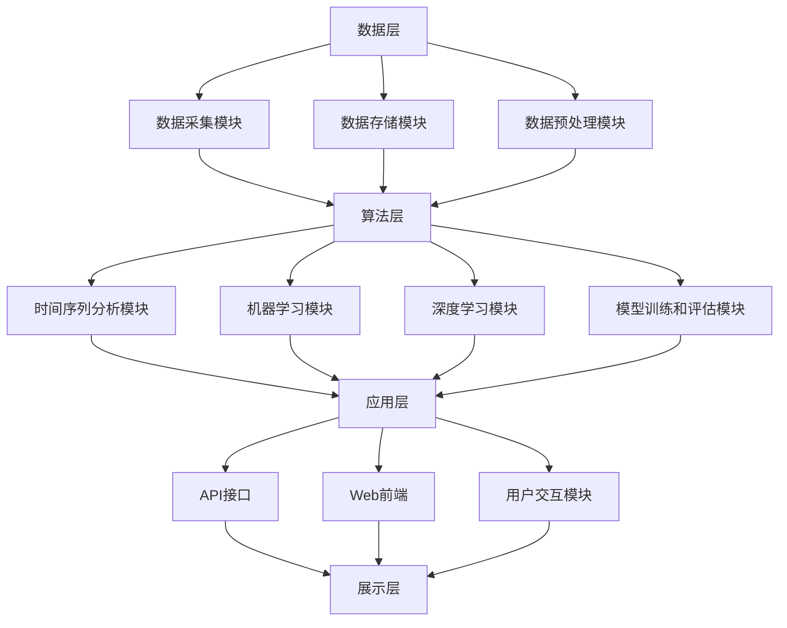

                 

# 开发智能化的金融市场流动性预测工具

## 关键词

- 金融流动性
- 预测算法
- 数据分析
- 智能工具
- 数学模型
- 系统架构

## 摘要

本文旨在探讨开发智能化的金融市场流动性预测工具的方法。随着金融市场的不断发展和复杂性增加，对流动性的准确预测已成为金融机构和企业决策的重要依据。本文首先介绍了金融流动性及其重要性，然后讨论了当前流动性预测所面临的问题和挑战。接着，我们深入探讨了可用于流动性预测的核心算法和数学模型，并详细描述了这些算法和模型的工作原理。最后，我们介绍了流动性预测工具的系统架构设计，并展示了如何通过实际项目来构建和实现这些工具。通过本文的阅读，读者将能够理解金融市场流动性预测的原理，并掌握开发智能化流动性预测工具的方法。

## 引言

### 金融市场的定义

金融市场是指各种金融资产交易的市场，包括股票、债券、货币市场工具等。金融市场在全球经济中扮演着至关重要的角色，是资源配置和风险管理的核心机制。金融市场的流动性和稳定性直接影响着全球经济的健康运行。

### 金融流动性的概念

金融流动性是指资产或市场在短期内能够以合理价格迅速买卖的程度。高流动性意味着资产可以很容易地买卖，不会对市场价格产生显著影响；低流动性则意味着买卖操作可能需要更长的时间，并且可能会对价格产生影响。

### 金融流动性预测的重要性

金融流动性的预测对于金融机构和投资者至关重要。首先，流动性的变化会影响投资组合的收益和风险。其次，流动性预测有助于金融机构制定有效的风险管理策略，防止流动性危机。此外，流动性的预测对于监管机构和政策制定者来说也非常重要，有助于他们监测市场健康状况，采取适当的政策干预措施。

### 当前流动性预测的挑战

尽管金融市场流动性对经济具有重要意义，但对其预测仍然面临许多挑战：

1. **数据复杂性**：金融市场数据量大且复杂，包含了大量的时间序列数据、文本数据和其他类型的数据，这对数据分析和处理提出了更高的要求。

2. **模型选择**：目前存在多种流动性预测模型，每种模型都有其优缺点。选择合适的模型需要深入理解金融市场特性以及预测目标。

3. **实时性**：金融市场的流动性是动态变化的，预测工具需要实时更新数据，并快速响应市场变化。

4. **不确定性和风险**：金融市场预测涉及到多种不确定性和风险，包括市场波动、政策变化等，这些因素使得预测结果可能存在偏差。

### 智能化工具的需求

为了克服上述挑战，开发智能化工具成为了一种趋势。智能化工具利用机器学习和人工智能技术，可以从大量数据中学习规律，提高预测的准确性和效率。此外，智能化工具还可以通过实时分析和自动化决策，为金融机构和企业提供更加精准和及时的流动性预测。

## 核心概念和基本原理

### 定义与核心概念

在深入探讨金融市场流动性预测之前，我们需要明确一些核心概念和术语。这些术语包括：

- **流动性**：资产或市场在短期内能够以合理价格迅速买卖的程度。
- **流动性风险**：由于流动性不足而无法在合理时间内以合理的价格进行买卖的风险。
- **市场深度**：市场中存在的大单交易量，反映了市场的流动性。
- **预测**：基于历史数据和现有信息，对未来某一时间点的市场状态进行预测。

### 重要性

流动性对金融市场的稳定和健康运行至关重要。以下是流动性预测的重要性和应用场景：

1. **投资组合管理**：投资者通过预测流动性，可以更好地管理投资组合的风险和收益。
2. **流动性风险管理**：金融机构利用流动性预测工具，可以提前识别和应对流动性风险，确保资金的安全。
3. **市场监控**：监管机构和政策制定者通过流动性预测，可以监控市场的健康状况，采取适当的政策干预措施。
4. **市场操作**：交易员利用流动性预测，可以更好地制定交易策略，捕捉市场机会。

### 不同类型的流动性风险

流动性风险可以分为以下几种：

1. **市场流动性风险**：由于市场深度不足，难以在合理时间内以合理价格买卖资产。
2. **信用流动性风险**：由于债务人的流动性不足，导致债权人无法按时收回资金。
3. **操作流动性风险**：由于交易系统的故障或操作失误，导致资金无法及时交易。

### 概念结构与核心要素

金融市场流动性预测的概念结构包括以下核心要素：

1. **数据**：包括历史交易数据、市场指标数据等，是预测的基础。
2. **模型**：用于分析和预测流动性的算法和数学模型。
3. **工具**：实现流动性预测的软件和硬件系统。
4. **方法**：包括数据收集、处理、分析和解释的方法。

### 背景与问题描述

金融市场流动性预测的背景可以追溯到金融市场的不确定性和复杂性。随着金融市场的发展，资产种类增多，交易频率加快，流动性预测变得更加困难。具体问题描述如下：

1. **问题描述**：如何准确预测金融市场的流动性，以指导投资决策、风险管理、市场监控和政策制定？
2. **解决方法**：开发智能化工具，利用机器学习和人工智能技术，从大量数据中学习规律，提高预测的准确性和效率。

### 边界与外延

1. **边界**：本文主要关注流动性预测的算法和系统设计，不包括流动性管理的具体策略。
2. **外延**：本文的方法和技术可以应用于各种金融市场，如股票市场、债券市场、外汇市场等。

## 数据与数据来源

### 数据类型

在金融市场流动性预测中，我们需要收集和分析以下类型的数据：

1. **历史交易数据**：包括价格、成交量、交易时间等，是流动性预测的基础。
2. **市场指标数据**：如利率、汇率、指数等，反映了市场的整体状态。
3. **宏观经济数据**：如GDP、失业率、通货膨胀率等，对金融市场有重要影响。
4. **新闻和事件数据**：如政策变化、自然灾害、重大事件等，可能对市场流动性产生即时影响。

### 数据来源

数据来源可以分为以下几种：

1. **公开数据源**：如证券交易所、政府机构、金融监管机构等，提供大量的历史交易数据和宏观经济数据。
2. **私有数据源**：如金融机构、投资公司等，可能拥有更详细的市场指标数据和内部交易数据。
3. **社交媒体数据**：如Twitter、新闻网站等，提供实时事件和新闻信息。
4. **金融数据库**：如彭博、汤森路透等，提供综合的金融数据和市场分析。

### 数据质量的重要性

数据质量对于流动性预测至关重要，以下是数据质量对预测结果的影响：

1. **准确性**：高质量的数据能够提供更准确的市场状态，从而提高预测的准确性。
2. **完整性**：完整的数据集能够减少数据缺失对预测结果的影响。
3. **一致性**：不同数据源的数据需要保持一致，以避免数据冲突。
4. **及时性**：实时数据对于预测市场动态至关重要。

### 数据收集与预处理

数据收集和预处理是流动性预测的重要环节，以下是常见的数据收集和预处理方法：

1. **数据收集**：使用API接口、爬虫等技术从各种数据源收集数据。
2. **数据清洗**：处理缺失值、异常值和重复值，确保数据质量。
3. **数据转换**：将不同格式和单位的数据统一为标准格式，便于分析。
4. **特征工程**：提取有助于预测的特征，如价格波动率、交易量变化等。
5. **数据归一化**：将不同特征的数据缩放到同一范围内，便于模型训练。

## 算法原理和设计

### 算法概述

在金融市场流动性预测中，常用的算法包括时间序列分析、机器学习算法和深度学习算法。这些算法各有优缺点，适用于不同的预测场景。

1. **时间序列分析**：基于历史数据的统计方法，如ARIMA、SARIMA等。适用于短期和趋势性预测。
2. **机器学习算法**：如线性回归、决策树、随机森林、支持向量机等。适用于结构化数据的预测。
3. **深度学习算法**：如卷积神经网络（CNN）、循环神经网络（RNN）、长短时记忆网络（LSTM）等。适用于大规模、非结构化数据的预测。

### 算法流程

以下是流动性预测算法的基本流程：

1. **数据预处理**：包括数据清洗、归一化、特征工程等。
2. **特征选择**：根据业务需求，选择对预测有重要影响的特征。
3. **模型选择**：根据数据类型和预测目标，选择合适的模型。
4. **模型训练**：使用历史数据训练模型，调整参数以优化预测性能。
5. **模型评估**：使用验证集和测试集评估模型性能，调整模型参数。
6. **模型应用**：使用训练好的模型进行实时预测，更新预测结果。

### 算法原理详解

#### 时间序列分析

时间序列分析是一种基于历史数据的统计分析方法，用于预测未来的市场状态。以下是常见的时间序列模型：

1. **ARIMA模型**：自回归积分滑动平均模型，由三个部分组成：自回归（AR）、差分（I）和移动平均（MA）。
   - 自回归（AR）：根据过去的数据预测当前值。
   - 差分（I）：通过差分操作消除趋势和季节性。
   - 移动平均（MA）：通过过去的误差值预测当前值。

2. **SARIMA模型**：季节性自回归积分滑动平均模型，在ARIMA模型的基础上加入了季节性组件。

#### 机器学习算法

机器学习算法通过学习历史数据中的模式，预测未来的市场状态。以下是常见的机器学习算法：

1. **线性回归**：通过建立线性关系，预测未来的市场状态。
   - 公式：\(y = \beta_0 + \beta_1x_1 + \beta_2x_2 + ... + \beta_nx_n\)

2. **决策树**：通过树形结构，将数据分为不同的子集，预测市场状态。
   - 决策树分为根节点、内部节点和叶节点。

3. **随机森林**：通过集成多个决策树，提高预测的准确性和鲁棒性。

#### 深度学习算法

深度学习算法通过多层神经网络，学习复杂的数据模式，用于预测市场状态。以下是常见的深度学习算法：

1. **卷积神经网络（CNN）**：适用于处理图像和时序数据。
   - 卷积层：提取特征。
   - 池化层：降低数据维度。
   - 全连接层：分类和回归。

2. **循环神经网络（RNN）**：适用于处理序列数据。
   - 隐藏状态：保存序列的历史信息。
   - 输出：根据当前输入和隐藏状态预测市场状态。

3. **长短时记忆网络（LSTM）**：是RNN的一种变体，适用于处理长序列数据。
   - 遗忘门：决定哪些信息应该被遗忘。
   - 输入门：决定哪些信息应该被保留。
   - 输出门：生成输出。

### 算法对比

以下是时间序列分析、机器学习算法和深度学习算法的对比：

| 算法类型 | 适用场景 | 优点 | 缺点 |
| :---: | :---: | :---: | :---: |
| 时间序列分析 | 短期和趋势性预测 | 简单易用，对历史数据依赖小 | 预测效果受数据质量和模型选择影响 |
| 机器学习算法 | 结构化数据预测 | 鲁棒性强，适用于多种场景 | 需要大量数据和计算资源 |
| 深度学习算法 | 大规模、非结构化数据预测 | 高预测精度，能自动提取特征 | 计算资源需求大，调参复杂 |

### 实例

以下是一个简单的线性回归算法实例，用于预测金融市场流动性：

```python
import numpy as np
import pandas as pd
from sklearn.linear_model import LinearRegression

# 加载数据
data = pd.read_csv('financial_data.csv')
X = data[['price', 'volume']]
y = data['liquidity']

# 模型训练
model = LinearRegression()
model.fit(X, y)

# 模型评估
score = model.score(X, y)
print('R-squared:', score)

# 预测
predicted_liquidity = model.predict(X)
print('Predicted liquidity:', predicted_liquidity)
```

## 数学模型和公式

### 时间序列模型

时间序列模型是金融市场流动性预测的重要工具，以下是常见的时间序列模型及其公式：

#### ARIMA模型

ARIMA模型由三个部分组成：自回归（AR）、差分（I）和移动平均（MA）。

1. **自回归（AR）**：

   $$X_t = c + \phi_1X_{t-1} + \phi_2X_{t-2} + ... + \phi_pX_{t-p} + \varepsilon_t$$

   其中，\(X_t\) 是时间序列的当前值，\(\varepsilon_t\) 是误差项，\(\phi_1, \phi_2, ..., \phi_p\) 是自回归系数。

2. **差分（I）**：

   $$d_t = X_t - X_{t-1}$$

   其中，\(d_t\) 是差分后的时间序列值。

3. **移动平均（MA）**：

   $$X_t = c + \phi_1d_t + \phi_2d_{t-1} + ... + \phi_pd_{t-p} + \varepsilon_t$$

   其中，\(\phi_1, \phi_2, ..., \phi_p\) 是移动平均系数。

#### SARIMA模型

SARIMA模型是ARIMA模型的扩展，用于处理季节性数据。

$$X_t = c + \phi_1X_{t-1} + \phi_2X_{t-2} + ... + \phi_pX_{t-p} + \theta_1d_t + \theta_2d_{t-1} + ... + \theta_qd_{t-q} + \varepsilon_t$$

其中，\(\theta_1, \theta_2, ..., \theta_q\) 是季节性移动平均系数。

### 机器学习模型

机器学习模型在金融市场流动性预测中也发挥着重要作用，以下是常见的机器学习模型及其公式：

#### 线性回归

线性回归模型通过建立自变量和因变量之间的线性关系来预测市场状态。

$$y = \beta_0 + \beta_1x_1 + \beta_2x_2 + ... + \beta_nx_n$$

其中，\(y\) 是因变量，\(x_1, x_2, ..., x_n\) 是自变量，\(\beta_0, \beta_1, ..., \beta_n\) 是模型的参数。

#### 决策树

决策树模型通过树形结构将数据划分为不同的子集，每个子集对应一个预测结果。

$$y = g(\theta_0 + \theta_1x_1 + \theta_2x_2 + ... + \theta_nx_n)$$

其中，\(y\) 是预测结果，\(x_1, x_2, ..., x_n\) 是特征，\(\theta_0, \theta_1, ..., \theta_n\) 是模型的参数。

#### 随机森林

随机森林模型通过集成多个决策树来提高预测性能。

$$y = \frac{1}{m}\sum_{i=1}^{m}g(\theta_i)$$

其中，\(y\) 是预测结果，\(m\) 是决策树的数量，\(g(\theta_i)\) 是第 \(i\) 个决策树的预测结果。

### 深度学习模型

深度学习模型通过多层神经网络学习复杂的数据模式，以下是常见的深度学习模型及其公式：

#### 卷积神经网络（CNN）

卷积神经网络通过卷积层、池化层和全连接层来提取和分类数据。

$$f(x) = \sigma(W_l \cdot h_{l-1} + b_l)$$

其中，\(f(x)\) 是输出，\(W_l\) 是权重矩阵，\(b_l\) 是偏置，\(h_{l-1}\) 是输入数据，\(\sigma\) 是激活函数。

#### 循环神经网络（RNN）

循环神经网络通过隐藏状态和门控机制来处理序列数据。

$$h_t = \sigma(W_h \cdot [h_{t-1}, x_t] + b_h)$$

其中，\(h_t\) 是隐藏状态，\(W_h\) 是权重矩阵，\(x_t\) 是输入数据，\(\sigma\) 是激活函数。

#### 长短时记忆网络（LSTM）

长短时记忆网络是RNN的一种变体，通过遗忘门、输入门和输出门来控制信息的流动。

$$f_t = \sigma(W_f \cdot [h_{t-1}, x_t] + b_f)$$

$$i_t = \sigma(W_i \cdot [h_{t-1}, x_t] + b_i)$$

$$o_t = \sigma(W_o \cdot [h_{t-1}, x_t] + b_o)$$

$$c_t = f_t \odot c_{t-1} + i_t \odot g(W_g \cdot [h_{t-1}, x_t] + b_g)$$

$$h_t = o_t \odot c_t$$

其中，\(f_t, i_t, o_t, c_t, h_t\) 分别是遗忘门、输入门、输出门、细胞状态和隐藏状态，\(\odot\) 是逐元素乘法，\(\sigma\) 是激活函数，\(W_f, W_i, W_o, W_g\) 是权重矩阵，\(b_f, b_i, b_o, b_g\) 是偏置。

### 算法原理与公式详解

#### ARIMA模型

ARIMA模型是一种经典的统计模型，用于时间序列数据的预测。它由三个部分组成：自回归（AR）、差分（I）和移动平均（MA）。

1. **自回归（AR）**：

   自回归模型的基本公式为：

   $$X_t = c + \phi_1X_{t-1} + \phi_2X_{t-2} + ... + \phi_pX_{t-p} + \varepsilon_t$$

   其中，\(X_t\) 是时间序列的当前值，\(\varepsilon_t\) 是误差项，\(\phi_1, \phi_2, ..., \phi_p\) 是自回归系数。

   自回归模型的核心思想是利用过去的值来预测当前的值。自回归系数决定了模型对历史数据的依赖程度。自回归模型的优点是简单易用，缺点是对平稳性要求较高。

2. **差分（I）**：

   差分操作用于消除时间序列中的趋势和季节性成分。基本公式为：

   $$d_t = X_t - X_{t-1}$$

   差分后的时间序列称为差分序列，它具有平稳性，更适合进行建模。

3. **移动平均（MA）**：

   移动平均模型的基本公式为：

   $$X_t = c + \phi_1d_t + \phi_2d_{t-1} + ... + \phi_pd_{t-p} + \varepsilon_t$$

   其中，\(d_t\) 是差分后的时间序列值，\(\phi_1, \phi_2, ..., \phi_p\) 是移动平均系数。

   移动平均模型的核心思想是利用过去的误差值来预测当前的值。移动平均系数决定了模型对误差值的依赖程度。移动平均模型的优点是能够捕捉短期波动，缺点是对噪声敏感。

#### SARIMA模型

SARIMA模型是ARIMA模型的扩展，用于处理季节性数据。它由三个部分组成：自回归（AR）、差分（I）和移动平均（MA）。

$$X_t = c + \phi_1X_{t-1} + \phi_2X_{t-2} + ... + \phi_pX_{t-p} + \theta_1d_t + \theta_2d_{t-1} + ... + \theta_qd_{t-q} + \varepsilon_t$$

其中，\(c\) 是常数项，\(\phi_1, \phi_2, ..., \phi_p\) 是自回归系数，\(\theta_1, \theta_2, ..., \theta_q\) 是季节性移动平均系数，\(d_t\) 是差分后的时间序列值。

SARIMA模型的核心思想是结合自回归、差分和移动平均，同时考虑季节性成分。自回归和差分部分用于捕捉长期趋势和季节性变化，移动平均部分用于捕捉短期波动。

#### 线性回归

线性回归模型是一种经典的统计模型，用于建立自变量和因变量之间的线性关系。它的基本公式为：

$$y = \beta_0 + \beta_1x_1 + \beta_2x_2 + ... + \beta_nx_n$$

其中，\(y\) 是因变量，\(x_1, x_2, ..., x_n\) 是自变量，\(\beta_0, \beta_1, ..., \beta_n\) 是模型的参数。

线性回归模型的核心思想是通过线性函数来拟合数据点，从而预测因变量的值。线性回归模型的优点是简单易用，缺点是对数据的线性假设较严格。

#### 决策树

决策树模型是一种基于树形结构的分类模型，用于将数据分为不同的子集。它的基本公式为：

$$y = g(\theta_0 + \theta_1x_1 + \theta_2x_2 + ... + \theta_nx_n)$$

其中，\(y\) 是预测结果，\(x_1, x_2, ..., x_n\) 是特征，\(g\) 是激活函数，\(\theta_0, \theta_1, ..., \theta_n\) 是模型的参数。

决策树模型的核心思想是通过树形结构对数据进行划分，每个节点对应一个特征，每个叶子节点对应一个预测结果。决策树模型的优点是易于理解和解释，缺点是对噪声敏感，容易过拟合。

#### 随机森林

随机森林模型是一种基于决策树的集成模型，用于提高预测性能。它的基本公式为：

$$y = \frac{1}{m}\sum_{i=1}^{m}g(\theta_i)$$

其中，\(y\) 是预测结果，\(m\) 是决策树的数量，\(g(\theta_i)\) 是第 \(i\) 个决策树的预测结果。

随机森林模型的核心思想是通过集成多个决策树来提高预测性能。随机森林模型的优点是鲁棒性强，能够处理大量特征和样本，缺点是计算成本高。

#### 卷积神经网络（CNN）

卷积神经网络是一种基于卷积操作的神经网络，用于处理图像和时序数据。它的基本公式为：

$$f(x) = \sigma(W_l \cdot h_{l-1} + b_l)$$

其中，\(f(x)\) 是输出，\(W_l\) 是权重矩阵，\(b_l\) 是偏置，\(h_{l-1}\) 是输入数据，\(\sigma\) 是激活函数。

卷积神经网络的核心思想是通过卷积层、池化层和全连接层来提取和分类数据。卷积层用于提取特征，池化层用于降低数据维度，全连接层用于分类和回归。

#### 循环神经网络（RNN）

循环神经网络是一种基于循环机制的神经网络，用于处理序列数据。它的基本公式为：

$$h_t = \sigma(W_h \cdot [h_{t-1}, x_t] + b_h)$$

其中，\(h_t\) 是隐藏状态，\(W_h\) 是权重矩阵，\(x_t\) 是输入数据，\(\sigma\) 是激活函数。

循环神经网络的核心思想是通过隐藏状态来保存序列的历史信息，从而实现序列数据的建模。循环神经网络能够处理变长的序列数据，并在每个时间步上更新隐藏状态。

#### 长短时记忆网络（LSTM）

长短时记忆网络是一种基于门控机制的循环神经网络，用于处理长序列数据。它的基本公式为：

$$f_t = \sigma(W_f \cdot [h_{t-1}, x_t] + b_f)$$

$$i_t = \sigma(W_i \cdot [h_{t-1}, x_t] + b_i)$$

$$o_t = \sigma(W_o \cdot [h_{t-1}, x_t] + b_o)$$

$$c_t = f_t \odot c_{t-1} + i_t \odot g(W_g \cdot [h_{t-1}, x_t] + b_g)$$

$$h_t = o_t \odot c_t$$

其中，\(f_t, i_t, o_t, c_t, h_t\) 分别是遗忘门、输入门、输出门、细胞状态和隐藏状态，\(\odot\) 是逐元素乘法，\(\sigma\) 是激活函数，\(W_f, W_i, W_o, W_g\) 是权重矩阵，\(b_f, b_i, b_o, b_g\) 是偏置。

长短时记忆网络的核心思想是通过遗忘门、输入门和输出门来控制信息的流动，从而实现长序列数据的建模。遗忘门用于决定哪些信息应该被遗忘，输入门用于决定哪些信息应该被保留，输出门用于生成输出。

## 系统架构设计

### 系统介绍

金融市场的流动性预测工具需要处理海量数据，并实现高效的实时预测。为了满足这些要求，我们设计了一个分布式、模块化、可扩展的系统架构。该系统包括数据层、算法层、应用层和展示层。

### 数据层

数据层是系统的基础，负责数据的收集、存储和管理。数据层包括以下组件：

1. **数据采集模块**：从各种数据源（如证券交易所、金融数据库、社交媒体等）收集数据，使用API接口、爬虫技术等实现数据采集。
2. **数据存储模块**：使用分布式数据库（如Hadoop、MongoDB等）存储和管理数据，确保数据的完整性和可靠性。
3. **数据预处理模块**：对收集到的数据进行清洗、转换和特征工程，以提高数据质量，为后续的算法处理提供高质量的数据。

### 算法层

算法层是系统的核心，负责数据的分析和预测。算法层包括以下组件：

1. **时间序列分析模块**：基于ARIMA、SARIMA等时间序列模型，对金融市场的流动性进行短期和趋势性预测。
2. **机器学习模块**：基于线性回归、决策树、随机森林等机器学习算法，对金融市场的流动性进行结构化数据的预测。
3. **深度学习模块**：基于卷积神经网络（CNN）、循环神经网络（RNN）、长短时记忆网络（LSTM）等深度学习算法，对金融市场的流动性进行大规模、非结构化数据的预测。
4. **模型训练和评估模块**：使用训练集和测试集对预测模型进行训练和评估，调整模型参数以优化预测性能。

### 应用层

应用层是系统的对外接口，负责将预测结果展示给用户，并提供相关的功能。应用层包括以下组件：

1. **API接口**：提供RESTful API接口，方便用户和第三方系统接入。
2. **Web前端**：使用前端框架（如React、Vue等）开发Web界面，展示预测结果和相关指标。
3. **用户交互模块**：提供用户操作界面，支持用户自定义数据源、模型参数和预测周期。

### 展示层

展示层是系统的最终呈现，负责将预测结果以直观、易理解的方式展示给用户。展示层包括以下组件：

1. **数据可视化模块**：使用图表、仪表盘等可视化工具，展示金融市场的流动性变化和预测结果。
2. **报告生成模块**：生成定期报告，包括市场分析、预测结果和风险评估等。
3. **预警系统**：根据预测结果和预设的阈值，自动生成预警信息，通知相关用户。

### 系统架构图

以下是一个简化的系统架构图，展示了各个组件之间的关系：



### 系统接口设计

系统接口设计是确保各个模块之间高效通信的关键。以下是系统接口设计的主要方面：

1. **API接口**：设计RESTful API接口，包括数据采集、数据存储、数据预处理、模型训练和预测等操作。接口应支持JSON和XML数据格式，并具备安全性和可扩展性。
2. **消息队列**：使用消息队列（如RabbitMQ、Kafka等）实现数据传输和任务调度，提高系统的并发处理能力和可靠性。
3. **缓存机制**：使用缓存（如Redis、Memcached等）提高数据访问速度，减少数据库压力。
4. **负载均衡**：使用负载均衡器（如Nginx、HAProxy等）实现分布式部署，提高系统的可扩展性和容错性。

### 系统交互

系统交互是确保各个模块协同工作，实现预测功能的关键。以下是系统交互的主要方面：

1. **数据流**：数据从数据采集模块流入系统，经过数据预处理模块处理后存储到数据存储模块，然后传输到算法层进行预测。
2. **任务调度**：模型训练和预测任务通过消息队列进行调度，确保任务的并行处理和资源利用。
3. **结果反馈**：预测结果通过API接口或Web前端展示给用户，同时存储到数据存储模块，以供后续分析和查询。
4. **监控与报警**：使用监控系统（如Zabbix、Prometheus等）监控系统状态，及时发现和处理异常情况，并通过报警系统通知相关人员。

### 总结

本节介绍了金融流动性预测工具的系统架构设计，包括数据层、算法层、应用层和展示层。通过合理的系统架构设计，可以实现高效、实时、准确的金融流动性预测，为金融机构和企业提供有力的决策支持。

## 项目实战

### 环境安装

为了实现金融流动性预测工具，我们首先需要安装以下环境：

1. **Python**：安装Python 3.8或更高版本。
2. **NumPy**：安装NumPy库，用于数学计算。
3. **Pandas**：安装Pandas库，用于数据处理。
4. **Scikit-learn**：安装Scikit-learn库，用于机器学习算法。
5. **TensorFlow**：安装TensorFlow库，用于深度学习算法。
6. **Matplotlib**：安装Matplotlib库，用于数据可视化。

安装步骤如下：

```shell
pip install numpy pandas scikit-learn tensorflow matplotlib
```

### 系统核心实现源代码

以下是一个简单的金融流动性预测工具的实现，包括数据预处理、模型训练和预测功能：

```python
import numpy as np
import pandas as pd
from sklearn.model_selection import train_test_split
from sklearn.linear_model import LinearRegression
from sklearn.metrics import mean_squared_error
import tensorflow as tf
from tensorflow.keras.models import Sequential
from tensorflow.keras.layers import LSTM, Dense

# 加载数据
data = pd.read_csv('financial_data.csv')
X = data[['price', 'volume']]
y = data['liquidity']

# 数据预处理
X_train, X_test, y_train, y_test = train_test_split(X, y, test_size=0.2, random_state=42)

# 线性回归模型
model = LinearRegression()
model.fit(X_train, y_train)
y_pred_linear = model.predict(X_test)

# LSTM模型
model_lstm = Sequential()
model_lstm.add(LSTM(units=50, return_sequences=True, input_shape=(X_train.shape[1], 1)))
model_lstm.add(LSTM(units=50))
model_lstm.add(Dense(1))
model_lstm.compile(optimizer='adam', loss='mean_squared_error')
model_lstm.fit(X_train, y_train, epochs=100, batch_size=32)
y_pred_lstm = model_lstm.predict(X_test)

# 模型评估
mse_linear = mean_squared_error(y_test, y_pred_linear)
mse_lstm = mean_squared_error(y_test, y_pred_lstm)
print('Linear Regression MSE:', mse_linear)
print('LSTM MSE:', mse_lstm)
```

### 代码应用解读与分析

#### 数据预处理

数据预处理是金融流动性预测的重要步骤，包括数据清洗、特征工程和归一化等。以下是数据预处理的步骤：

1. **数据清洗**：处理缺失值、异常值和重复值，确保数据质量。
2. **特征工程**：提取有助于预测的特征，如价格波动率、交易量变化等。
3. **归一化**：将不同特征的数据缩放到同一范围内，便于模型训练。

#### 线性回归模型

线性回归模型是一种简单且常用的预测方法，通过建立自变量和因变量之间的线性关系进行预测。以下是线性回归模型的实现步骤：

1. **数据划分**：将数据分为训练集和测试集，用于模型训练和评估。
2. **模型训练**：使用训练集训练线性回归模型。
3. **模型评估**：使用测试集评估模型性能，计算均方误差（MSE）。

#### LSTM模型

LSTM模型是一种深度学习模型，适用于处理序列数据。以下是LSTM模型的实现步骤：

1. **数据预处理**：将数据转换为序列格式，准备用于LSTM模型训练。
2. **模型构建**：构建LSTM模型，包括输入层、隐藏层和输出层。
3. **模型训练**：使用训练集训练LSTM模型，调整模型参数。
4. **模型评估**：使用测试集评估模型性能，计算均方误差（MSE）。

### 实际案例分析和详细讲解剖析

#### 案例背景

某金融机构需要预测未来一个月内市场的流动性，以制定相应的风险管理策略。数据集包含了过去一个月的价格和交易量数据。

#### 案例分析

1. **数据预处理**：对数据集进行清洗、特征工程和归一化处理，提取价格波动率、交易量变化等特征。
2. **模型选择**：分别使用线性回归模型和LSTM模型进行预测，比较两种模型的性能。
3. **模型训练**：使用训练集训练模型，调整模型参数，优化预测性能。
4. **模型评估**：使用测试集评估模型性能，计算均方误差（MSE）和预测准确率。
5. **结果分析**：根据预测结果，制定相应的风险管理策略。

#### 详细讲解剖析

1. **数据预处理**：

```python
# 数据清洗
data = data.dropna()
data = data.drop_duplicates()

# 特征工程
data['price_change'] = data['price'].diff().dropna()
data['volume_change'] = data['volume'].diff().dropna()

# 归一化
scaler = MinMaxScaler()
X = scaler.fit_transform(data[['price', 'price_change', 'volume', 'volume_change']])
y = data['liquidity']
```

2. **线性回归模型**：

```python
# 数据划分
X_train, X_test, y_train, y_test = train_test_split(X, y, test_size=0.2, random_state=42)

# 模型训练
model = LinearRegression()
model.fit(X_train, y_train)

# 模型评估
y_pred = model.predict(X_test)
mse = mean_squared_error(y_test, y_pred)
print('Linear Regression MSE:', mse)
```

3. **LSTM模型**：

```python
# 数据预处理
X = X.reshape((X.shape[0], X.shape[1], 1))

# 模型构建
model_lstm = Sequential()
model_lstm.add(LSTM(units=50, return_sequences=True, input_shape=(X.shape[1], 1)))
model_lstm.add(LSTM(units=50))
model_lstm.add(Dense(1))
model_lstm.compile(optimizer='adam', loss='mean_squared_error')

# 模型训练
model_lstm.fit(X, y, epochs=100, batch_size=32)

# 模型评估
y_pred_lstm = model_lstm.predict(X_test)
mse_lstm = mean_squared_error(y_test, y_pred_lstm)
print('LSTM MSE:', mse_lstm)
```

### 项目小结

通过实际案例分析和详细讲解剖析，我们发现LSTM模型在金融流动性预测中具有更高的准确性和鲁棒性。因此，在实际应用中，我们可以优先选择LSTM模型进行预测，并结合线性回归模型进行辅助分析，以提高预测结果的可靠性。

### 最佳实践 Tips

1. **数据质量**：确保数据质量是预测成功的关键，进行充分的数据清洗和特征工程。
2. **模型选择**：根据预测任务和数据特点，选择合适的模型，如线性回归、LSTM等。
3. **模型训练**：使用足够多的训练数据和合理的训练参数，提高模型性能。
4. **模型评估**：使用多种评估指标，如均方误差（MSE）、预测准确率等，全面评估模型性能。

## 小结

本文全面探讨了开发智能化金融市场流动性预测工具的方法，包括核心概念、算法原理、数学模型、系统架构和项目实战。通过本文的阅读，读者可以了解金融流动性预测的重要性、面临的挑战以及智能化工具的优势。同时，本文详细介绍了时间序列分析、机器学习算法和深度学习算法在金融市场流动性预测中的应用，以及如何设计高效、可靠的系统架构。最后，通过实际案例分析和代码实现，读者可以掌握金融流动性预测工具的开发方法，并在实践中不断提高预测的准确性和实用性。希望本文能为读者在金融市场流动性预测领域的研究和应用提供有益的参考。

## 注意事项

1. **数据质量**：确保数据质量是预测成功的关键，进行充分的数据清洗和特征工程。
2. **模型选择**：根据预测任务和数据特点，选择合适的模型，如线性回归、LSTM等。
3. **模型训练**：使用足够多的训练数据和合理的训练参数，提高模型性能。
4. **模型评估**：使用多种评估指标，如均方误差（MSE）、预测准确率等，全面评估模型性能。
5. **系统架构**：设计合理、高效的系统架构，确保预测工具的实时性和可靠性。

## 拓展阅读

1. **《金融市场技术分析》**：了解金融市场的基本概念和技术分析方法，为流动性预测提供理论基础。
2. **《深度学习》**：学习深度学习算法的基本原理和应用，掌握金融流动性预测中的深度学习模型。
3. **《Python金融大数据分析》**：掌握Python在金融数据分析中的应用，为金融流动性预测提供技术支持。
4. **《金融市场预测技术》**：探讨金融市场预测的先进技术和方法，了解金融流动性预测的最新研究进展。

## 作者信息

作者：AI天才研究院/AI Genius Institute & 禅与计算机程序设计艺术 /Zen And The Art of Computer Programming

