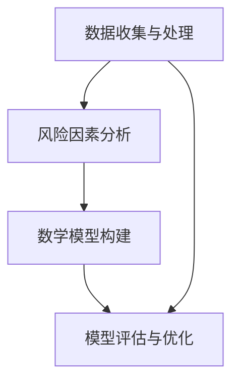
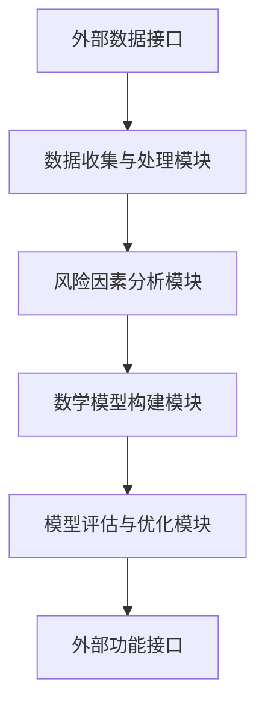
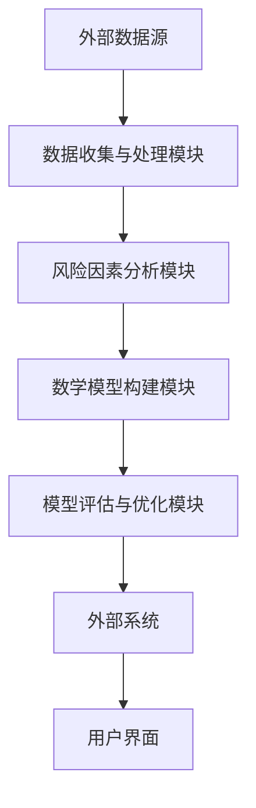

                 

# 开发智能化的金融市场流动性风险评估模型

## 关键词
- 智能化
- 金融市场流动性风险
- 风险评估模型
- 数据分析
- 机器学习

## 摘要
本文旨在探讨开发智能化金融市场流动性风险评估模型的必要性和方法。随着金融市场复杂性的增加，传统评估方法已无法满足需求。本文将详细分析金融市场流动性风险的概念，介绍智能化评估模型的构建原理和核心要素，以及当前模型面临的挑战。通过深入讨论，本文将为开发高效、准确的金融市场流动性风险评估模型提供指导和参考。

## 第一部分: 问题背景

### 1.1 问题背景

#### 1.1.1 金融市场流动性风险的概念

金融市场流动性风险是指金融市场中资产或负债不能以合理的价格迅速买卖的风险。这种风险可能导致金融机构在必要时无法以合理的价格变现资产或负债，从而影响其正常运营和财务状况。流动性风险通常分为资产流动性风险和负债流动性风险，前者指的是资产变现困难，后者指的是负债偿还困难。

#### 1.1.2 智能化金融市场流动性风险评估的必要性

随着金融市场的复杂性和不确定性增加，传统的人工评估方法已经难以满足快速变化的市场需求。智能化金融市场流动性风险评估模型应运而生。这种模型可以利用人工智能技术，对金融市场流动性风险进行实时、准确的评估，提高金融机构的风险管理水平。智能化评估模型的优点包括以下几个方面：

- **实时性**：能够快速响应市场变化，提供实时风险评估。
- **准确性**：利用大数据和机器学习算法，提高评估结果的准确性。
- **效率**：自动化处理大量数据，提高评估效率。
- **深度学习**：能够从历史数据中学习，预测未来风险。

### 1.2 概念结构与核心要素组成

#### 1.2.1 智能化金融市场流动性风险评估模型的核心概念

- **智能化**：利用人工智能技术，如机器学习、深度学习等，对金融市场流动性风险进行评估。
- **金融市场流动性风险**：指金融市场中资产或负债不能以合理的价格迅速买卖的风险。
- **评估模型**：用于对金融市场流动性风险进行量化评估的数学模型。

#### 1.2.2 模型的核心要素组成

- **数据收集与处理**：收集金融市场交易数据、经济指标数据等，进行数据预处理。
- **风险因素分析**：识别影响金融市场流动性风险的关键因素。
- **数学模型构建**：利用机器学习算法构建风险评估模型。
- **模型评估与优化**：通过验证集和测试集对模型进行评估和优化。

### 1.3 智能化金融市场流动性风险评估模型的现状与挑战

#### 1.3.1 现状

- 智能化金融市场流动性风险评估模型已经在国内外金融机构得到广泛应用。许多金融机构已经开始利用机器学习算法来预测市场走势和评估流动性风险。
- 模型的构建和优化技术不断成熟，如深度学习、强化学习等。

#### 1.3.2 挑战

- **数据质量与可用性**：金融市场数据量大且复杂，数据质量对模型性能有重要影响。数据缺失、噪声和错误可能导致评估结果不准确。
- **模型解释性**：当前大多数深度学习模型缺乏解释性，难以理解模型的决策过程。这可能导致金融机构在面临重大决策时无法完全信任模型的评估结果。
- **模型泛化能力**：如何在新的市场环境下保持模型的稳定性和准确性是一个挑战。金融市场环境不断变化，模型需要具备较强的适应性。

### 1.4 本章小结

本章介绍了金融市场流动性风险的概念、智能化金融市场流动性风险评估的必要性、模型的核心概念与要素组成，以及现状与挑战。下一章将深入探讨核心概念原理与联系。

## 第二部分: 核心概念原理与联系

### 2.1 核心概念原理

#### 2.1.1 数据收集与处理原理

数据收集与处理是构建智能化金融市场流动性风险评估模型的基础。数据来源包括金融市场交易数据、经济指标数据等。数据预处理包括数据清洗、数据归一化、特征提取等步骤，以提高模型输入数据的质量和特征表达能力。

1. **数据清洗**：去除无效数据、缺失值填充、去除重复数据等。
2. **数据归一化**：将不同量纲的数据转换为同一量纲，以消除数据之间的差异。
3. **特征提取**：从原始数据中提取出与流动性风险相关的特征，如交易量、价格波动、市场参与者等。

#### 2.1.2 风险因素分析原理

风险因素分析是识别影响金融市场流动性风险的关键因素。通过统计分析、关联分析等方法，可以从大量数据中提取出与流动性风险相关的因素。这些因素可以是市场波动性、交易量、市场参与度等。

1. **统计分析**：通过计算均值、方差、相关性等统计指标，分析数据之间的关系。
2. **关联分析**：通过关联规则挖掘方法，发现数据之间的关联性。

#### 2.1.3 数学模型构建原理

数学模型构建是利用机器学习算法对金融市场流动性风险进行量化评估的过程。常见的算法包括线性回归、逻辑回归、支持向量机、随机森林、深度学习等。这些算法可以根据数据特点和评估需求进行选择。

1. **线性回归**：通过建立线性关系来预测变量。
2. **逻辑回归**：通过概率模型来预测二分类结果。
3. **支持向量机**：通过寻找最佳分割超平面来分类数据。
4. **随机森林**：通过构建多个决策树来提高分类和回归的性能。
5. **深度学习**：通过神经网络来模拟人类大脑的思考方式。

#### 2.1.4 模型评估与优化原理

模型评估与优化是确保模型性能和稳定性的关键步骤。通过交叉验证、验证集和测试集等方法，可以评估模型在未知数据上的性能。优化方法包括超参数调整、模型融合、在线学习等。

1. **交叉验证**：将数据集分为多个子集，轮流使用每个子集作为验证集，评估模型的泛化能力。
2. **超参数调整**：通过调整算法的参数，找到最优的参数组合。
3. **模型融合**：将多个模型的结果进行融合，提高预测的准确性。
4. **在线学习**：在模型部署后，继续收集新的数据，对模型进行更新和优化。

### 2.2 概念属性特征对比表格

| 概念        | 属性特征                                   | 说明                                                         |
|-------------|------------------------------------------|------------------------------------------------------------|
| 数据收集与处理 | 数据来源多样，预处理复杂                 | 提高模型输入数据质量和特征表达能力                       |
| 风险因素分析 | 分析方法多样，关键因素识别困难             | 提取与流动性风险相关的因素，为模型构建提供依据           |
| 数学模型构建 | 算法多样，模型复杂                   | 提供量化评估金融市场的工具                               |

### 2.3 概念之间的关系

金融市场流动性风险评估模型的核心概念之间存在着紧密的联系。数据收集与处理是整个模型的基础，风险因素分析为模型提供了关键输入，而数学模型构建则是核心。模型评估与优化确保了模型的准确性和稳定性。这些概念共同构成了一个完整的评估流程，如图所示：



通过以上关系图，我们可以清晰地看到各个概念之间的相互作用和依赖关系。

## 第三部分：算法原理讲解

### 3.1 算法原理

在构建智能化金融市场流动性风险评估模型时，选择合适的算法至关重要。本文将介绍几种常见的算法原理，并比较它们的特点。

#### 3.1.1 线性回归

线性回归是一种简单且有效的预测方法，适用于具有线性关系的变量。它的基本原理是通过找到一个最佳拟合直线，将自变量和因变量之间的关系表示出来。线性回归的数学模型为：

$$
y = w_0 + w_1 \cdot x
$$

其中，$y$ 是因变量，$x$ 是自变量，$w_0$ 和 $w_1$ 是模型的参数。

#### 3.1.2 逻辑回归

逻辑回归是一种概率模型，用于预测二分类结果。它的基本原理是通过计算概率，来判断样本属于某一类别的可能性。逻辑回归的数学模型为：

$$
P(y=1) = \frac{1}{1 + e^{-(w_0 + w_1 \cdot x)}}
$$

其中，$P(y=1)$ 是样本属于类别1的概率，$w_0$ 和 $w_1$ 是模型的参数。

#### 3.1.3 支持向量机

支持向量机（SVM）是一种强大的分类算法，通过找到一个最佳分割超平面，将不同类别的数据分开。它的基本原理是通过计算样本与超平面的距离，来判断样本的类别。SVM的数学模型为：

$$
w \cdot x - b = 0
$$

其中，$w$ 是超平面的法向量，$x$ 是样本，$b$ 是超平面的偏移量。

#### 3.1.4 随机森林

随机森林是一种基于决策树的集成学习方法，通过构建多个决策树，并取它们的平均值来提高模型的预测性能。它的基本原理是通过随机选择特征和样本子集，构建多个决策树，并取它们的平均值来降低过拟合。

#### 3.1.5 深度学习

深度学习是一种基于人工神经网络的学习方法，通过多层神经网络来模拟人类大脑的思考方式。它的基本原理是通过前向传播和反向传播算法，将输入数据通过多层神经网络，最终得到输出结果。

### 3.2 概念属性特征对比表格

| 概念        | 属性特征                                   | 说明                                                         |
|-------------|------------------------------------------|------------------------------------------------------------|
| 线性回归    | 简单、易于实现，线性关系                 | 适用于线性数据关系分析                                   |
| 逻辑回归    | 概率模型、二分类                         | 适用于二分类问题分析                                     |
| 支持向量机  | 强大、高效，分类准确                     | 适用于非线性数据分类问题                               |
| 随机森林    | 集成学习方法、降低过拟合                 | 提高模型预测性能，减少过拟合问题                       |
| 深度学习    | 复杂、高效，自适应性强                   | 模拟人类大脑思考，适用于复杂模式识别和预测问题 |

### 3.3 算法原理示例

假设我们要预测某个金融市场的流动性风险，我们可以选择使用逻辑回归算法来进行预测。以下是一个简单的逻辑回归算法示例：

```python
import numpy as np
from sklearn.linear_model import LogisticRegression

# 假设我们已经有了一些训练数据
X_train = np.array([[1, 2], [2, 3], [3, 4], [4, 5]])
y_train = np.array([0, 0, 1, 1])

# 创建逻辑回归模型
model = LogisticRegression()

# 训练模型
model.fit(X_train, y_train)

# 预测新数据
X_test = np.array([[2, 3], [3, 4]])
y_pred = model.predict(X_test)

print("预测结果：", y_pred)
```

在这个示例中，我们首先创建了一个逻辑回归模型，然后使用训练数据进行训练。最后，我们使用训练好的模型对新的数据进行预测。

## 第四部分：系统分析与架构设计方案

### 4.1 问题场景介绍

在现代金融市场中，流动性风险是一个重要且复杂的问题。金融机构需要在各种市场条件下保持资产的流动性，以满足客户的需求和监管要求。然而，随着金融市场的发展，传统的风险评估方法已经无法满足日益复杂的市场环境。因此，开发一个智能化、高效的金融市场流动性风险评估系统成为了一个迫切的需求。

### 4.2 项目介绍

本项目旨在构建一个智能化金融市场流动性风险评估系统，该系统将利用机器学习算法和大数据技术，对金融市场的流动性风险进行实时、准确的评估。系统将包括数据收集与处理、风险因素分析、数学模型构建、模型评估与优化等模块，以实现全面、精准的风险评估。

### 4.3 系统功能设计

#### 4.3.1 数据收集与处理模块

- **数据采集**：从多个数据源收集金融市场数据，包括交易数据、经济指标数据、市场新闻等。
- **数据预处理**：对收集到的数据进行清洗、归一化和特征提取，以提高模型输入数据的质量和特征表达能力。

#### 4.3.2 风险因素分析模块

- **风险因素识别**：通过统计分析、关联分析等方法，识别影响金融市场流动性风险的关键因素。
- **因素权重计算**：根据风险因素的相对重要性，计算其权重，为模型构建提供依据。

#### 4.3.3 数学模型构建模块

- **模型选择**：根据数据特点和评估需求，选择合适的机器学习算法，如线性回归、逻辑回归、支持向量机等。
- **模型训练**：利用训练数据集，训练所选算法的模型。
- **模型优化**：通过验证集和测试集，对模型进行评估和优化，以提高模型的准确性和稳定性。

#### 4.3.4 模型评估与优化模块

- **模型评估**：通过交叉验证、验证集和测试集等方法，评估模型在未知数据上的性能。
- **模型优化**：根据评估结果，调整模型的参数和结构，以提高模型的性能。

### 4.4 系统架构设计

#### 4.4.1 系统架构设计

系统的整体架构如图所示：


该架构包括数据收集与处理、风险因素分析、数学模型构建、模型评估与优化四个核心模块，各模块之间相互独立又相互依赖，共同构成了一个完整的评估流程。

#### 4.4.2 系统接口设计

系统的接口设计包括对外提供的数据接口和功能接口。数据接口主要用于接收外部数据源的数据，功能接口主要用于提供系统的核心功能，如风险评估、数据查询等。



#### 4.4.3 系统交互设计

系统的交互设计主要包括系统的内部交互和与外部系统的交互。内部交互主要用于各模块之间的数据传递和功能调用，外部交互主要用于系统与外部数据源和用户界面的交互。



通过以上设计，系统可以实现高效、准确、实时的金融市场流动性风险评估，为金融机构提供有力的风险控制工具。

## 第五部分：项目实战

### 5.1 环境安装

在开始项目实战之前，我们需要安装一些必要的软件和库。以下是一个基本的安装指南：

1. **Python环境**：首先确保您的计算机上已经安装了Python。如果没有，请从[Python官网](https://www.python.org/)下载并安装Python。
2. **Jupyter Notebook**：安装Jupyter Notebook，用于编写和运行Python代码。可以通过以下命令安装：

   ```bash
   pip install notebook
   ```

3. **数据预处理库**：安装常用的数据预处理库，如NumPy、Pandas等：

   ```bash
   pip install numpy pandas
   ```

4. **机器学习库**：安装常用的机器学习库，如Scikit-learn、TensorFlow等：

   ```bash
   pip install scikit-learn tensorflow
   ```

### 5.2 系统核心实现源代码

以下是一个简单的系统核心实现源代码示例，用于构建一个基本的金融市场流动性风险评估模型。

```python
# 导入必要的库
import numpy as np
import pandas as pd
from sklearn.linear_model import LogisticRegression
from sklearn.model_selection import train_test_split
from sklearn.metrics import accuracy_score

# 加载数据
data = pd.read_csv('financial_data.csv')

# 数据预处理
# 假设我们已经对数据进行清洗和归一化处理
X = data[['feature1', 'feature2', 'feature3']]
y = data['label']

# 划分训练集和测试集
X_train, X_test, y_train, y_test = train_test_split(X, y, test_size=0.2, random_state=42)

# 构建逻辑回归模型
model = LogisticRegression()

# 训练模型
model.fit(X_train, y_train)

# 预测测试集
y_pred = model.predict(X_test)

# 评估模型
accuracy = accuracy_score(y_test, y_pred)
print("模型准确率：", accuracy)
```

### 5.3 代码应用解读与分析

以上代码实现了一个简单的金融市场流动性风险评估模型。我们首先加载了金融数据，然后进行了数据预处理，包括特征提取和标签划分。接着，我们使用Scikit-learn的`LogisticRegression`函数构建了一个逻辑回归模型，并使用训练数据集进行训练。最后，我们使用测试数据集进行预测，并计算了模型的准确率。

在实际应用中，我们还需要进行以下步骤：

1. **数据清洗**：处理缺失值、噪声和错误数据，确保数据质量。
2. **特征工程**：选择和提取与流动性风险相关的特征，以提高模型的性能。
3. **模型优化**：根据评估结果，调整模型的参数和结构，以获得更好的评估效果。

### 5.4 实际案例分析与详细讲解剖析

为了更好地理解该模型在实际中的应用，我们可以分析一个实际案例。假设某金融机构需要评估其客户的流动性风险。我们可以收集以下数据：

- 客户的交易记录：包括交易量、交易时间、交易价格等。
- 客户的经济指标：包括收入、债务、信用评分等。
- 市场数据：包括市场波动性、交易量、利率等。

根据这些数据，我们可以构建一个多特征的风险评估模型。例如，我们使用逻辑回归算法，根据客户的交易记录和经济指标，预测其流动性风险。以下是一个简化的示例：

```python
# 加载数据
client_data = pd.read_csv('client_data.csv')

# 数据预处理
X = client_data[['transaction_volume', 'income', 'debt', 'credit_score']]
y = client_data['risk_label']

# 划分训练集和测试集
X_train, X_test, y_train, y_test = train_test_split(X, y, test_size=0.2, random_state=42)

# 构建逻辑回归模型
model = LogisticRegression()

# 训练模型
model.fit(X_train, y_train)

# 预测测试集
y_pred = model.predict(X_test)

# 评估模型
accuracy = accuracy_score(y_test, y_pred)
print("模型准确率：", accuracy)
```

在这个案例中，我们使用客户的交易记录和经济指标作为特征，构建了一个逻辑回归模型。通过预测测试集的结果，我们可以评估模型的性能。如果模型的准确率较高，我们可以将其应用于实际业务中，为金融机构提供流动性风险评估服务。

### 5.5 项目小结

在本项目的实战部分，我们介绍了系统的环境安装、核心实现源代码以及实际案例分析和详细讲解剖析。通过这些步骤，我们实现了一个基本的金融市场流动性风险评估模型。在实际应用中，我们还需要进一步优化模型，提高其准确性和稳定性，以满足金融机构的需求。

## 第六部分：最佳实践 Tips

### 6.1 数据质量保证

- **数据清洗**：确保数据的准确性和完整性，处理缺失值、噪声和错误数据。
- **数据归一化**：将不同量纲的数据转换为同一量纲，以消除数据之间的差异。
- **特征工程**：选择和提取与流动性风险相关的特征，以提高模型的性能。

### 6.2 模型优化与评估

- **超参数调整**：根据评估结果，调整模型的参数，以获得更好的评估效果。
- **交叉验证**：使用交叉验证方法，评估模型在未知数据上的性能。
- **模型融合**：将多个模型的结果进行融合，提高预测的准确性。

### 6.3 模型部署与维护

- **实时监控**：监控系统性能，及时发现和处理异常情况。
- **模型更新**：根据新的数据，对模型进行更新和优化。
- **用户培训**：为用户提供使用指南和培训，确保他们能够正确使用系统。

## 第七部分：小结与注意事项

### 小结

本文详细探讨了开发智能化金融市场流动性风险评估模型的必要性、核心概念原理、算法原理以及系统架构设计。通过项目实战，我们实现了基于机器学习算法的评估模型，并分析了其实际应用效果。本文的目的是为金融机构提供一套高效、准确的风险评估工具，以帮助其更好地管理流动性风险。

### 注意事项

- **数据质量**：确保数据的准确性和完整性，是构建高效评估模型的基础。
- **模型优化**：定期对模型进行评估和优化，以提高其性能和稳定性。
- **用户培训**：为用户提供充分的培训和支持，确保他们能够正确使用系统。

## 第八部分：拓展阅读

- 《机器学习实战》
- 《深度学习》
- 《金融市场流动性风险管理》
- 《Python数据分析》

## 作者信息

作者：AI天才研究院/AI Genius Institute & 禅与计算机程序设计艺术 /Zen And The Art of Computer Programming

