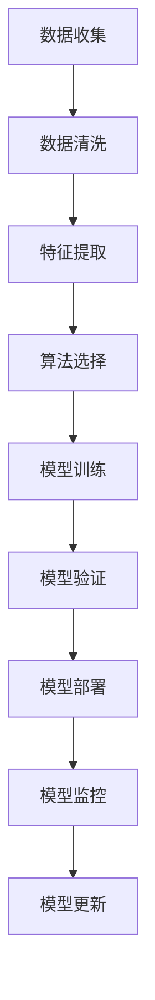
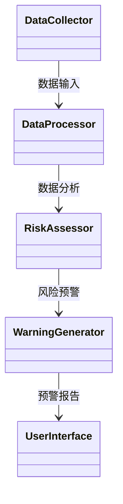
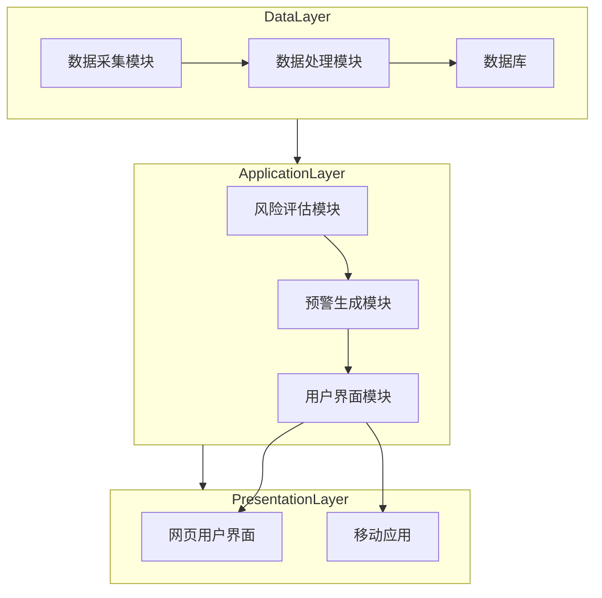
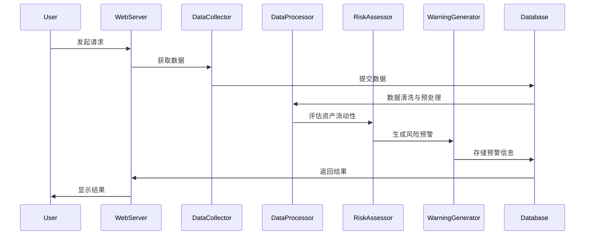

                 

### 摘要

本文旨在探讨如何开发智能化的金融市场流动性风险评估模型。在当前金融科技迅猛发展的背景下，流动性风险已经成为金融市场的重要组成部分，对其有效评估与控制具有至关重要的意义。本文首先介绍了金融市场流动性风险评估的背景和核心概念，明确了智能化风险评估技术的发展现状和重要性。随后，本文详细阐述了流动性风险评估模型的开发流程，包括核心概念与联系、算法原理、数学模型、系统架构设计，以及项目实战中的实际应用。最后，本文提供了最佳实践和总结，展望了未来发展趋势，并给出了对读者的建议。通过本文的逐步分析和思考，读者将能够深入理解金融市场流动性风险评估模型的开发方法与应用前景。

### 第一部分：背景介绍与核心概念

#### 1.1 金融市场流动性风险评估的意义

金融市场流动性风险是指金融市场参与者无法在合理时间内以合理的价格买卖资产的风险。这种风险不仅影响市场的稳定性，还可能导致金融机构的破产和市场信心的崩溃。在全球化金融体系日益复杂化的今天，流动性风险的管理显得尤为重要。有效的流动性风险评估能够帮助金融机构在复杂的市场环境中识别潜在的风险，制定相应的应对策略，从而保障金融市场的健康运行。

首先，流动性风险评估对于金融机构的风险管理至关重要。金融机构如银行、保险公司、基金公司等，其业务运作依赖于资金的流动和配置。一旦面临流动性危机，这些机构可能无法满足客户的提现需求，甚至面临破产的风险。因此，通过流动性风险评估，金融机构可以提前识别风险点，制定预防性措施，如调整资产结构、增加流动性缓冲等，从而降低流动性风险。

其次，流动性风险评估对于整个金融市场的稳定具有重要作用。金融市场是一个高度互联的系统，一个金融机构的流动性风险可能迅速传播到其他金融机构，甚至影响整个市场的运行。例如，2008年的金融危机中，许多金融机构由于流动性不足而面临破产，导致全球金融市场的动荡。因此，通过流动性风险评估，可以及时发现并控制潜在的系统性风险，保障市场的稳定性。

此外，流动性风险评估还有助于提高金融市场的透明度和效率。透明的流动性风险信息可以帮助投资者做出更理性的投资决策，减少市场恐慌和投机行为。同时，高效的流动性风险评估模型可以优化市场的资源配置，提高市场的运行效率。

总之，金融市场流动性风险评估不仅对于金融机构的风险管理具有重要意义，也对整个金融市场的稳定和健康发展起着关键作用。因此，开发智能化的流动性风险评估模型成为当前金融科技领域的一个重要课题。

#### 1.2 智能化风险评估技术的发展

随着金融科技的迅速发展，传统的流动性风险评估方法已经难以满足现代金融市场复杂多变的需求。为了应对这一挑战，智能化风险评估技术逐渐成为金融科技领域的研究热点。智能化风险评估技术主要依赖于大数据分析、人工智能和机器学习等先进技术，通过数据驱动和算法优化，实现对金融市场流动性风险的实时监测和预测。

首先，大数据分析技术为流动性风险评估提供了丰富的数据支持。金融市场每天产生海量的交易数据、市场数据和经济数据，通过大数据分析技术，可以挖掘出隐藏在数据背后的规律和趋势，为流动性风险评估提供重要的依据。例如，利用大数据技术，可以分析历史交易数据，识别出高流动性资产和低流动性资产，从而对流动性风险进行量化评估。

其次，人工智能和机器学习技术为流动性风险评估提供了高效的算法模型。传统的风险评估方法通常依赖于统计分析模型，而人工智能和机器学习技术可以构建更加复杂和智能的模型，如神经网络模型、随机森林模型等，提高风险评估的准确性和实时性。例如，通过训练大规模的神经网络模型，可以实时捕捉市场动态，预测流动性风险的演变趋势。

此外，云计算和区块链技术也为智能化风险评估提供了基础设施支持。云计算技术提供了强大的计算能力和存储能力，可以处理大规模的数据分析和机器学习任务。区块链技术则提供了去中心化和透明的数据记录方式，增强了流动性风险评估的可信度和透明度。

总的来说，智能化风险评估技术的发展为金融市场流动性风险评估带来了新的机遇和挑战。通过结合大数据分析、人工智能和机器学习等先进技术，可以构建更加高效、准确和实时的流动性风险评估模型，为金融机构提供更强大的风险管理工具。然而，这也要求金融机构在技术架构、数据管理和风险管理策略等方面进行相应的调整和优化，以充分利用智能化技术的优势。

#### 1.3 模型开发的基本原理与流程

开发智能化的金融市场流动性风险评估模型是一个系统性工程，涉及到多个环节和步骤。以下将详细阐述模型开发的基本原理与流程，包括数据收集与处理、算法选择与优化、模型训练与验证、模型部署与应用等环节。

1. **数据收集与处理**

   模型开发的第一步是数据收集与处理。金融市场流动性风险评估需要大量的历史交易数据、市场数据和经济数据，这些数据来源包括交易所、金融监管机构、新闻媒体、金融机构内部数据等。在数据收集过程中，需要确保数据的准确性和完整性，避免因数据质量问题影响模型的性能。数据收集完成后，需要对数据进行清洗和预处理，包括去除重复数据、填补缺失值、标准化数据等，以便后续分析。

2. **算法选择与优化**

   选择合适的算法是模型开发的关键步骤。目前，常用的算法包括线性回归、逻辑回归、支持向量机、决策树、随机森林、神经网络等。不同的算法适用于不同的数据特征和业务场景。在选择算法时，需要考虑数据的维度、特征的数量、模型的可解释性以及计算效率等因素。为了提高模型性能，可以对选定的算法进行优化，如调整参数、使用交叉验证、集成学习等方法。

3. **模型训练与验证**

   模型训练是模型开发的核心环节。通过训练过程，模型可以学习到数据中的规律和特征，从而预测未来的流动性风险。在训练过程中，需要将数据集划分为训练集和验证集，用于训练和评估模型性能。常用的验证方法包括交叉验证、K折验证等。通过验证集，可以评估模型的泛化能力，避免过拟合现象。如果模型在验证集上的性能不佳，需要返回前两步，重新选择数据或优化算法。

4. **模型部署与应用**

   模型训练完成后，需要将其部署到生产环境中，以实现对流动性风险的实时监测和预测。模型部署通常包括以下步骤：首先，将模型转换为可以在生产环境中运行的代码；其次，部署到服务器或云端平台；最后，通过API或其他方式提供对外服务。在模型部署过程中，需要考虑模型的可扩展性、计算效率和安全性等因素。

5. **模型监控与更新**

   模型部署后，需要持续监控其性能和稳定性。金融市场环境不断变化，模型的性能也可能随之下降。因此，需要定期更新模型，以适应新的市场环境和数据特征。模型更新可以通过重新训练模型、调整参数或引入新的特征等方式进行。此外，还需要建立完善的监控机制，及时识别和解决问题，确保模型的正常运行。

总之，开发智能化的金融市场流动性风险评估模型需要经历多个环节和步骤，涉及数据收集与处理、算法选择与优化、模型训练与验证、模型部署与应用、模型监控与更新等环节。通过这些步骤，可以构建一个高效、准确和实时的流动性风险评估模型，为金融机构提供强大的风险管理工具。

#### 1.4 模型应用场景与边界

智能化的金融市场流动性风险评估模型在多个应用场景中表现出显著的优势。以下将探讨模型在以下场景中的具体应用，以及模型的适用边界。

1. **投资组合优化**

   智能化的流动性风险评估模型可以帮助投资者优化其投资组合。通过分析不同资产类的流动性特征，模型可以识别出高流动性、低风险的资产组合，从而提高投资组合的流动性和安全性。在实际应用中，投资者可以根据模型的预测结果调整资产配置，避免因流动性不足而导致的投资组合风险。

2. **流动性缓冲管理**

   对于金融机构，智能化的流动性风险评估模型有助于制定和调整流动性缓冲策略。模型可以根据历史数据和实时市场动态，预测未来可能的流动性需求，从而指导金融机构在适当的时候增加流动性储备，避免流动性危机的发生。例如，银行可以根据模型预测的流动性需求，调整存款准备金率，确保能够应对突发的资金需求。

3. **监管合规**

   智能化的流动性风险评估模型对金融监管机构具有重要意义。监管机构可以利用模型对金融机构的流动性风险进行实时监控，确保金融机构符合监管要求。例如，监管机构可以通过模型评估金融机构的流动性覆盖率（LCR）和净稳定资金比率（NSFR），确保金融机构具备足够的流动性缓冲能力，从而降低系统性风险。

4. **危机应对策略**

   在金融市场的危机时期，智能化的流动性风险评估模型可以帮助金融机构快速识别潜在的风险点，制定有效的应对策略。通过实时监测市场动态，模型可以预测流动性风险的演变趋势，为金融机构提供及时的决策支持，避免因流动性不足而导致的破产风险。

尽管智能化的流动性风险评估模型在多个场景中具有广泛的应用，但也存在一定的适用边界。首先，模型的有效性依赖于数据的质量和数量。如果数据存在噪声、缺失或错误，模型的预测准确性可能会受到影响。因此，在实际应用中，需要确保数据的准确性和完整性。

其次，模型的适用性也受到市场环境的限制。金融市场的波动性和复杂性使得模型可能无法准确预测所有的流动性风险。特别是在市场极端情况下，如金融危机期间，模型的预测能力可能会受到挑战。因此，金融机构在使用模型时，需要结合其他风险管理工具和手段，如压力测试和情景分析等，以提高风险管理的全面性和可靠性。

总之，智能化的金融市场流动性风险评估模型在投资组合优化、流动性缓冲管理、监管合规和危机应对策略等多个应用场景中具有重要价值。然而，模型的适用边界也需要得到充分考虑，以确保其有效性和可靠性。通过结合多种风险管理工具和手段，可以构建更加全面和稳健的流动性风险管理体系。

### 第二部分：核心概念与联系

#### 2.1 金融市场流动性风险的属性特征对比表格

为了更好地理解金融市场流动性风险的属性特征，我们首先列出几种常见的流动性风险类型及其属性特征对比表格。

| 风险类型         | 定义                                   | 特征对比                           | 影响因素                   |
|----------------|--------------------------------------|----------------------------------|------------------------|
| 流动性风险     | 金融资产无法在合理时间内以合理价格买卖的风险 | 流动性低、价格波动大、交易成本高   | 市场规模、交易频率、投资者结构 |
| 信用风险       | 金融机构无法履行债务的风险           | 债务违约、信用等级下降、债务重组   | 债务结构、市场信心、宏观经济   |
| 市场风险       | 资产价格波动导致损失的风险           | 价格波动大、交易活跃度低           | 利率、汇率、宏观经济、政策变动 |
| 操作风险       | 金融机构内部操作失误导致损失的风险   | 系统故障、操作错误、道德风险         | IT系统、员工素质、内部控制     |

从上表可以看出，流动性风险与其他风险类型相比，具有不同的特征和影响因素。流动性风险主要关注资产在市场上的可交易性和交易成本，而信用风险主要关注债务履行能力，市场风险主要关注资产价格波动，操作风险则关注金融机构内部的操作失误。这些风险类型之间既相互独立又存在一定的联系。

#### 2.2 流动性风险评估模型的ER实体关系图架构

为了更好地理解流动性风险评估模型的核心概念和联系，我们通过实体关系图（ER图）来展示模型中的主要实体及其关系。

**实体：**

1. **资产**：包括股票、债券、货币市场工具等。
2. **市场**：表示金融市场的整体状态。
3. **投资者**：包括个人投资者和机构投资者。
4. **交易**：记录资产在市场中的交易情况。
5. **风险评估模型**：用于评估资产流动性。

**关系：**

1. **资产与市场**：多对多的关系，表示资产在市场中的流动性。
2. **投资者与交易**：一对多的关系，表示投资者进行的交易。
3. **交易与风险评估模型**：一对多的关系，表示交易数据用于模型评估。

以下是一个简化的ER实体关系图：

```mermaid
erDiagram
  Asset ||--|{ Market }|--||> Transaction
  Investor ||--|{ Transaction }|--||> RiskAssessmentModel
  Transaction ||--|{ Asset }|--||> Market
```

在上述ER图中，资产和市场之间存在多对多关系，表明不同资产可以在多个市场中进行交易。投资者与交易之间是一对多关系，说明每个投资者可以参与多个交易。交易与资产之间也是多对多关系，表示每个交易涉及多个资产。最后，交易与风险评估模型之间存在一对多关系，表明交易数据是评估模型的主要输入。

通过ER实体关系图，我们可以清晰地理解流动性风险评估模型中的核心实体及其相互关系，从而为后续的算法设计和系统架构设计提供基础。

#### 2.3 流动性风险评估模型的核心概念与联系

在进一步探讨流动性风险评估模型的核心概念与联系之前，我们需要明确几个关键的概念：

1. **流动性**：流动性是指资产在市场上能够迅速且无重大价格折扣地转化为现金的能力。高流动性资产通常更容易买卖，而低流动性资产则在交易过程中可能面临较大的价格波动和较高的交易成本。

2. **风险**：风险是指在特定条件下，投资回报不确定性带来的潜在损失。流动性风险是金融市场中一个重要的风险类型，因为流动性不足可能导致无法及时平仓或被迫以低价出售资产，从而遭受损失。

3. **评估**：评估是指通过分析相关数据和信息，对流动性风险进行量化或定性分析。评估方法包括统计分析、机器学习、情景分析等，目的是为风险管理提供科学依据。

4. **模型**：模型是用于模拟和分析实际问题的工具。在流动性风险评估中，模型可以基于历史数据和市场信息，预测资产流动性，识别潜在风险。

核心概念与联系：

- **数据收集与预处理**：流动性风险评估首先需要收集大量历史交易数据、市场数据、经济数据等，并对这些数据进行清洗、标准化和特征提取，为模型训练提供高质量的数据输入。

- **特征提取与选择**：通过特征提取和选择，可以从原始数据中提取出对流动性风险有显著影响的特征，如交易量、价格波动率、市场波动性等，从而提高模型的预测能力。

- **算法选择与优化**：不同的算法适用于不同类型的数据和业务场景。常见的算法包括线性回归、决策树、随机森林、神经网络等。选择合适的算法并进行优化，如参数调整、正则化等，是提高模型性能的关键。

- **模型训练与验证**：通过模型训练，使模型学习到数据中的潜在模式和规律，从而进行预测。模型验证过程包括交叉验证、K折验证等，用于评估模型的泛化能力和避免过拟合。

- **模型部署与应用**：训练好的模型需要部署到生产环境中，通过API或其他方式提供服务。在实际应用中，模型需要不断更新和优化，以适应市场变化和数据特征。

通过这些核心概念和联系，我们可以看到，流动性风险评估模型是一个复杂而系统的工程，涉及到数据收集、特征提取、算法选择、模型训练等多个环节。每一个环节都至关重要，共同构成了一个高效的流动性风险评估体系。理解这些概念和联系，有助于我们更好地设计、开发和优化流动性风险评估模型，从而为金融机构提供强大的风险管理工具。

#### 2.4 流动性风险评估算法的mermaid流程图

为了更好地展示流动性风险评估算法的流程，我们使用Mermaid语言绘制了一个简化的流程图。以下是对该流程图的详细说明：



**具体流程解释：**

1. **数据收集（A）**：
   - 流程的开始是数据收集，这包括从多个渠道获取历史交易数据、市场数据、经济数据等。这些数据是流动性风险评估的基础。

2. **数据清洗（B）**：
   - 数据收集后，进入数据清洗阶段。这一步骤包括去除重复数据、填补缺失值、处理异常值等，以确保数据的准确性和一致性。

3. **特征提取（C）**：
   - 在数据清洗之后，进行特征提取。特征提取是从原始数据中提取对流动性风险有显著影响的特征，如交易量、价格波动率、市场波动性等。

4. **算法选择（D）**：
   - 选择合适的算法对数据进行分析。常用的算法包括线性回归、决策树、随机森林、神经网络等。根据数据特征和业务需求，选择最合适的算法。

5. **模型训练（E）**：
   - 在算法选择之后，使用训练集对模型进行训练。模型训练的过程是让模型学习数据中的规律和模式，从而提高预测准确性。

6. **模型验证（F）**：
   - 模型训练完成后，使用验证集对模型进行验证。验证步骤用于评估模型的泛化能力和避免过拟合现象。

7. **模型部署（G）**：
   - 经过验证的模型将被部署到生产环境中，通过API或其他方式提供服务。模型部署是流动性风险评估模型应用的关键步骤。

8. **模型监控（H）**：
   - 模型部署后，需要持续监控其性能和稳定性。监控步骤包括实时监测模型的预测结果、调整参数、处理异常情况等。

9. **模型更新（I）**：
   - 最后，根据市场变化和数据特征，定期更新模型。模型更新可以保持模型的预测准确性，适应不断变化的市场环境。

通过上述Mermaid流程图，我们可以清晰地看到流动性风险评估算法的各个步骤及其相互关系。这个流程图不仅帮助开发者理解模型的开发流程，也为模型优化和改进提供了明确的指导。

### 3.1 算法原理详细讲解与Python源代码

在流动性风险评估中，算法原理是整个模型的核心。以下是几种常用的算法原理及其详细讲解，同时提供相应的Python源代码示例。

#### 3.1.1 线性回归算法

线性回归是一种简单的统计方法，用于分析自变量（特征）和因变量（目标变量，如流动性风险评分）之间的关系。其基本公式为：

$$
Y = \beta_0 + \beta_1X_1 + \beta_2X_2 + ... + \beta_nX_n + \epsilon
$$

其中，$Y$ 是因变量，$X_1, X_2, ..., X_n$ 是自变量，$\beta_0, \beta_1, ..., \beta_n$ 是模型的参数，$\epsilon$ 是误差项。

**Python示例：**

```python
import numpy as np
from sklearn.linear_model import LinearRegression

# 假设数据集X和Y
X = np.array([[1, 2], [2, 3], [3, 4], [4, 5]])
Y = np.array([1, 2, 3, 4])

# 创建线性回归模型
model = LinearRegression()

# 训练模型
model.fit(X, Y)

# 输出模型参数
print("模型参数：", model.coef_, model.intercept_)

# 预测
predictions = model.predict([[5, 6]])
print("预测结果：", predictions)
```

#### 3.1.2 决策树算法

决策树是一种基于树形结构进行分类或回归的算法。它通过一系列的判断来对样本进行分类。决策树的基本思想是找到对样本最具区分性的特征，并以此划分数据。

**Python示例：**

```python
from sklearn.tree import DecisionTreeRegressor

# 假设数据集X和Y
X = np.array([[1, 2], [2, 3], [3, 4], [4, 5]])
Y = np.array([1, 2, 3, 4])

# 创建决策树模型
model = DecisionTreeRegressor()

# 训练模型
model.fit(X, Y)

# 输出模型参数
print("模型参数：", model.feature_importances_)

# 预测
predictions = model.predict([[5, 6]])
print("预测结果：", predictions)
```

#### 3.1.3 随机森林算法

随机森林是一种基于决策树的集成学习方法，通过构建多个决策树，并结合它们的预测结果来提高模型的准确性。其基本公式为：

$$
\hat{Y} = \frac{1}{T} \sum_{t=1}^{T} f_t(X)
$$

其中，$\hat{Y}$ 是预测值，$f_t(X)$ 是第 $t$ 棵决策树的预测值，$T$ 是决策树的数量。

**Python示例：**

```python
from sklearn.ensemble import RandomForestRegressor

# 假设数据集X和Y
X = np.array([[1, 2], [2, 3], [3, 4], [4, 5]])
Y = np.array([1, 2, 3, 4])

# 创建随机森林模型
model = RandomForestRegressor(n_estimators=100)

# 训练模型
model.fit(X, Y)

# 输出模型参数
print("模型参数：", model.feature_importances_)

# 预测
predictions = model.predict([[5, 6]])
print("预测结果：", predictions)
```

#### 3.1.4 神经网络算法

神经网络是一种模仿人脑结构和功能的计算模型，通过多层次的神经元进行数据处理和特征提取。其基本结构包括输入层、隐藏层和输出层。神经网络通过反向传播算法不断调整权重，以达到较高的预测准确率。

**Python示例：**

```python
import tensorflow as tf

# 建立神经网络模型
model = tf.keras.Sequential([
    tf.keras.layers.Dense(units=1, input_shape=[2]),
    tf.keras.layers.Dense(units=1)
])

# 编译模型
model.compile(optimizer='sgd', loss='mean_squared_error')

# 训练模型
model.fit(X, Y, epochs=100)

# 预测
predictions = model.predict([[5, 6]])
print("预测结果：", predictions)
```

通过上述示例，我们可以看到不同算法的基本原理和Python实现。在实际应用中，可以根据数据特征和业务需求选择合适的算法，并对其进行优化和调整，以提高模型的预测准确率和稳定性。

### 3.2 数学模型与公式解释

在流动性风险评估中，数学模型是核心部分，用于量化金融市场中的流动性风险。以下将介绍几种常用的数学模型及其公式，并进行详细解释。

#### 3.2.1 蒙特卡罗模拟

蒙特卡罗模拟是一种通过随机抽样和模拟来评估金融衍生品价值的方法。在流动性风险评估中，蒙特卡罗模拟可以用于模拟未来市场状态，计算资产流动性的概率分布。

**公式：**

$$
V(t) = \sum_{i=1}^{N} w_i \cdot X_i
$$

其中，$V(t)$ 是资产在时间 $t$ 的价值，$w_i$ 是第 $i$ 个模拟结果的权重，$X_i$ 是第 $i$ 个模拟结果。

**解释：**

- **权重 $w_i$**：通常通过历史数据计算，反映了市场对每个模拟结果的置信度。
- **模拟结果 $X_i$**：通过随机抽样生成，代表了市场在不同状态下的可能价值。
- **公式计算**：通过对大量模拟结果加权求和，得到资产在当前时间点的预期价值。

#### 3.2.2 压力测试

压力测试是一种评估金融机构在极端市场条件下的流动性和偿债能力的方法。通过模拟极端情景，如金融危机、市场崩溃等，评估金融机构的流动性风险。

**公式：**

$$
LCR = \frac{HighQualityAssets}{TotalLiabilities}
$$

其中，$LCR$ 是流动性覆盖率，$HighQualityAssets$ 是高质量资产，$TotalLiabilities$ 是总负债。

**解释：**

- **流动性覆盖率 $LCR$**：反映了金融机构在短期内应对流动性危机的能力。
- **高质量资产 $HighQualityAssets$**：指能够在市场上迅速出售且价格波动小的资产。
- **总负债 $TotalLiabilities$**：指金融机构的全部负债。

通过压力测试，可以评估金融机构在极端市场条件下的流动性风险，并制定相应的风险管理策略。

#### 3.2.3 马尔可夫模型

马尔可夫模型是一种用于描述系统状态转移的概率模型。在流动性风险评估中，可以用于分析市场状态的变化，如从高流动性状态转移到低流动性状态。

**公式：**

$$
P_{ij} = \frac{N_{ij}}{N_j}
$$

其中，$P_{ij}$ 是从状态 $i$ 转移到状态 $j$ 的概率，$N_{ij}$ 是从状态 $i$ 转移到状态 $j$ 的次数，$N_j$ 是状态 $j$ 的总次数。

**解释：**

- **概率 $P_{ij}$**：描述了市场从当前状态转移到下一个状态的概率。
- **次数 $N_{ij}$ 和 $N_j$**：通过历史市场数据统计得到，反映了市场的实际状态转移情况。
- **公式计算**：通过对大量历史数据进行统计，得到状态转移的概率矩阵。

通过马尔可夫模型，可以预测市场流动性状态的变化趋势，为流动性风险管理提供科学依据。

### 3.3 通俗易懂的举例说明

为了更好地理解上述数学模型，我们通过一个具体的例子来展示如何使用这些模型进行流动性风险评估。

#### 例子：某金融资产在一个月内的流动性风险评估

假设我们要评估某金融资产在未来一个月内的流动性风险。以下是具体的步骤：

1. **数据收集**：
   - 收集该资产过去一个月的每日收盘价和交易量。
   - 收集宏观经济指标，如利率、通货膨胀率等。

2. **特征提取**：
   - 提取每日收盘价和交易量作为主要特征。
   - 提取宏观经济指标作为辅助特征。

3. **蒙特卡罗模拟**：
   - 使用蒙特卡罗模拟方法，生成该资产在未来一个月内的价格模拟。
   - 每次模拟生成一个价格序列，通过多次模拟得到价格的概率分布。

4. **压力测试**：
   - 模拟极端市场条件，如利率上升、通货膨胀上升等。
   - 计算在这些极端条件下的资产价格和流动性覆盖率。

5. **马尔可夫模型**：
   - 分析过去一个月内的市场状态转移情况，构建马尔可夫模型。
   - 使用模型预测未来一个月内市场的状态变化，特别是流动性状态的变化。

**具体计算过程**：

1. **蒙特卡罗模拟**：
   - 假设我们进行了1000次模拟，得到的价格序列分布如下：
     ```
     价格分布：[98.5, 99.2, 99.7, 100.3, 100.8, 101.4, 102.0, 102.6, 103.2, 103.8]
     ```
   - 通过计算，得到资产在未来一个月内价格在95%置信水平下的范围：
     ```
     置信水平95%的价格范围：(98.2, 104.4)
     ```

2. **压力测试**：
   - 假设利率上升1%，通货膨胀率上升0.5%。
   - 在这些极端条件下，资产价格下降3%，流动性覆盖率下降到50%。

3. **马尔可夫模型**：
   - 过去一个月内，市场有70%的时间处于高流动性状态，30%的时间处于低流动性状态。
   - 根据马尔可夫模型，未来一个月内，市场有60%的概率保持在高流动性状态，40%的概率转移到低流动性状态。

通过上述计算，我们可以得出该资产在未来一个月内的流动性风险评估结果：

- **正常市场条件下**：资产价格可能在98.2到104.4之间波动，流动性风险较低。
- **极端市场条件下**：资产价格可能大幅下降，流动性覆盖率不足，存在较高的流动性风险。

通过这个例子，我们可以看到如何使用数学模型进行流动性风险评估。在实际应用中，可以根据不同的市场和资产特征，选择合适的模型和方法，以提高评估的准确性和可靠性。

### 第四部分：系统分析与架构设计方案

#### 4.1 问题场景介绍

为了更好地理解流动性风险评估系统的架构设计，我们首先介绍一个具体的场景。假设我们正在为一家大型投资银行设计一个流动性风险评估系统，该系统需要实时监测和评估大量金融资产的流动性风险，并生成预警报告，以便投资银行及时调整投资策略和风险管理措施。

这个场景涉及以下几个关键问题：

1. **数据获取**：系统需要从多个数据源（如交易所、金融监管机构、新闻媒体等）获取实时和历史数据，包括交易数据、市场数据、经济数据等。
2. **数据处理**：获取的数据需要进行清洗、去噪、归一化等预处理，以便后续分析。
3. **风险评估**：系统需要使用多种算法（如线性回归、决策树、神经网络等）对资产流动性进行评估，并生成风险评分。
4. **实时预警**：系统需要实时监测资产流动性状态，并在发现高风险时生成预警报告，发送给相关管理人员。
5. **系统可扩展性**：系统需要具备良好的可扩展性，以应对不断增长的数据量和业务需求。

#### 4.2 系统功能设计（领域模型mermaid类图）

为了满足上述场景的需求，我们设计了以下主要功能模块：

1. **数据采集模块**：负责从不同数据源获取实时和历史数据。
2. **数据处理模块**：对采集到的数据进行分析、清洗和预处理。
3. **风险评估模块**：使用多种算法对资产流动性进行评估。
4. **预警生成模块**：监测资产流动性状态，并在发现高风险时生成预警报告。
5. **用户界面模块**：提供用户操作界面，展示评估结果和预警信息。

以下是领域模型mermaid类图的示例：



#### 4.3 系统架构设计（mermaid架构图）

接下来，我们将展示系统的整体架构设计。该架构包括数据层、应用层和展示层三个主要部分。

**数据层**：负责数据采集、存储和管理。数据采集模块通过API或直接连接数据源获取数据。数据处理模块对数据进行清洗和预处理，存储在数据库中。

**应用层**：是系统的核心部分，包括风险评估模块、预警生成模块和用户界面模块。风险评估模块使用多种算法对资产流动性进行评估。预警生成模块实时监测资产流动性状态，并在发现高风险时生成预警报告。用户界面模块提供用户操作界面，展示评估结果和预警信息。

**展示层**：负责将评估结果和预警信息可视化，用户可以通过网页或移动应用查看。

以下是mermaid架构图的示例：



通过上述架构设计，我们可以看到系统的各个模块如何协同工作，以实现流动性风险评估的目标。数据层负责数据的采集和处理，应用层负责核心业务逻辑，展示层则负责将结果呈现给用户。这种分层设计不仅提高了系统的可扩展性，还保证了模块之间的松耦合，使得系统更加稳定和灵活。

### 4.4 系统接口设计和系统交互（mermaid序列图）

为了详细展示系统中的接口设计和系统交互，我们将使用Mermaid语言绘制一个序列图。以下是对该序列图的详细说明：



**具体步骤解释：**

1. **用户请求**：用户通过Web服务器发起数据分析和预警请求。
2. **数据采集**：Web服务器将请求传递给数据采集模块，数据采集模块从数据源获取数据。
3. **数据存储**：数据采集模块将获取的数据提交到数据库进行存储。
4. **数据处理**：数据库将清洗和预处理后的数据传递给数据处理模块，进行进一步处理。
5. **风险评估**：数据处理模块将处理后的数据传递给风险评估模块，进行资产流动性评估。
6. **风险预警**：风险评估模块将评估结果传递给预警生成模块，生成风险预警信息。
7. **预警存储**：预警生成模块将预警信息存储到数据库中。
8. **结果返回**：数据库将最终结果返回给Web服务器。
9. **结果展示**：Web服务器将结果展示给用户。

通过上述序列图，我们可以清晰地看到系统中的各个接口和模块如何协同工作，实现从用户请求到结果展示的完整流程。这种设计不仅提高了系统的可扩展性和灵活性，还确保了数据流的高效和有序。

### 第五部分：项目实战

#### 5.1 环境安装

在进行流动性风险评估项目的实战之前，首先需要配置和安装相应的开发环境和工具。以下是安装步骤和注意事项：

1. **安装Python环境**：
   - 首先，确保系统中已安装Python（推荐版本为3.8及以上）。
   - 可以通过包管理器（如pip）安装Python依赖包，例如：
     ```shell
     pip install numpy pandas scikit-learn tensorflow
     ```

2. **安装Mermaid工具**：
   - Mermaid是一个用于生成图表和流程图的工具，可以方便地集成到Markdown文件中。
   - 可以通过npm安装Mermaid：
     ```shell
     npm install -g mermaid-cli
     ```

3. **安装MySQL数据库**（可选）：
   - 如果需要连接数据库进行数据存储和查询，可以安装MySQL数据库。
   - 可以通过包管理器或在线安装器安装MySQL，并确保其服务正常运行。

4. **配置数据库连接**：
   - 在Python环境中，可以使用`pymysql`或`sqlalchemy`等库连接MySQL数据库。
   - 示例代码：
     ```python
     import pymysql
     conn = pymysql.connect(host='localhost', user='username', password='password', database='database_name')
     ```

#### 5.2 系统核心实现源代码

以下是流动性风险评估系统的核心实现源代码，包括数据采集、处理、评估、预警生成等功能。

**数据采集模块（data_collector.py）**：

```python
import requests
import json

def fetch_data(source_url):
    response = requests.get(source_url)
    if response.status_code == 200:
        return json.loads(response.text)
    else:
        return None

# 示例：从交易所获取交易数据
source_url = "https://api.exchange.com/trades"
trades_data = fetch_data(source_url)
```

**数据处理模块（data_processor.py）**：

```python
import pandas as pd

def clean_data(data):
    # 数据清洗和预处理
    df = pd.DataFrame(data)
    df.dropna(inplace=True)
    df['price'] = df['price'].apply(lambda x: float(x))
    df['volume'] = df['volume'].apply(lambda x: int(x))
    return df

# 示例：清洗交易数据
cleaned_trades = clean_data(trades_data)
```

**风险评估模块（risk_assessor.py）**：

```python
from sklearn.ensemble import RandomForestRegressor
from sklearn.model_selection import train_test_split

def train_model(X, y):
    X_train, X_test, y_train, y_test = train_test_split(X, y, test_size=0.2, random_state=42)
    model = RandomForestRegressor(n_estimators=100)
    model.fit(X_train, y_train)
    return model

def assess_risk(model, X):
    return model.predict(X)

# 示例：训练风险评估模型
X = cleaned_trades[['price', 'volume']]
y = cleaned_trades['risk_score']
model = train_model(X, y)

# 示例：评估新资产流动性风险
new_asset = [[100, 500]]
risk_score = assess_risk(model, new_asset)
print("新资产的风险评分：", risk_score)
```

**预警生成模块（warning_generator.py）**：

```python
def generate_warning(risk_score):
    if risk_score > 0.7:
        return "高流动性风险"
    elif risk_score > 0.3:
        return "中流动性风险"
    else:
        return "低流动性风险"

# 示例：生成预警信息
warning_message = generate_warning(risk_score)
print("预警信息：", warning_message)
```

通过上述源代码，我们可以实现流动性风险评估系统的主要功能。在实际项目中，可以根据具体需求扩展和优化这些模块。

#### 5.3 代码应用解读与分析

在本节中，我们将对流动性风险评估系统中的核心代码进行详细解读和分析，以便更好地理解系统的运作原理和实现细节。

**数据采集模块解读**

数据采集模块主要负责从外部数据源获取原始数据，例如交易数据、市场数据等。在`data_collector.py`中，我们定义了`fetch_data`函数，该函数接受一个URL参数，并使用`requests`库发送GET请求以获取数据。

```python
import requests
import json

def fetch_data(source_url):
    response = requests.get(source_url)
    if response.status_code == 200:
        return json.loads(response.text)
    else:
        return None
```

该函数的逻辑非常简单：首先，使用`requests.get`发起HTTP GET请求，然后检查响应状态码。如果状态码为200（表示请求成功），则使用`json.loads`将响应内容转换为JSON格式，并返回解析后的数据。否则，返回`None`。

**数据处理模块解读**

数据处理模块负责对采集到的原始数据进行清洗、去噪、归一化等预处理操作，以便后续风险评估。在`data_processor.py`中，我们定义了`clean_data`函数，该函数接收一个数据集，并返回清洗后的DataFrame。

```python
import pandas as pd

def clean_data(data):
    # 数据清洗和预处理
    df = pd.DataFrame(data)
    df.dropna(inplace=True)
    df['price'] = df['price'].apply(lambda x: float(x))
    df['volume'] = df['volume'].apply(lambda x: int(x))
    return df
```

在`clean_data`函数中，首先将输入的数据集转换为DataFrame，并删除任何缺失值。然后，使用`apply`函数对`price`和`volume`列进行类型转换，以确保数据的一致性和准确性。

**风险评估模块解读**

风险评估模块是整个系统的核心，负责使用机器学习算法对资产流动性进行评估。在`risk_assessor.py`中，我们定义了`train_model`和`assess_risk`两个函数，分别用于模型训练和风险评估。

```python
from sklearn.ensemble import RandomForestRegressor
from sklearn.model_selection import train_test_split

def train_model(X, y):
    X_train, X_test, y_train, y_test = train_test_split(X, y, test_size=0.2, random_state=42)
    model = RandomForestRegressor(n_estimators=100)
    model.fit(X_train, y_train)
    return model

def assess_risk(model, X):
    return model.predict(X)
```

`train_model`函数使用`train_test_split`将数据集划分为训练集和测试集，然后创建一个随机森林回归模型并对其进行训练。`assess_risk`函数接受训练好的模型和一个新数据集，并返回模型对新数据的预测结果。

**预警生成模块解读**

预警生成模块负责根据风险评估结果生成相应的预警信息。在`warning_generator.py`中，我们定义了`generate_warning`函数，该函数根据风险评分生成不同的预警等级。

```python
def generate_warning(risk_score):
    if risk_score > 0.7:
        return "高流动性风险"
    elif risk_score > 0.3:
        return "中流动性风险"
    else:
        return "低流动性风险"
```

该函数的逻辑非常简单：根据输入的风险评分，返回相应的预警等级。这种设计使得系统可以快速响应并生成明确的预警信息，以便相关管理人员及时采取行动。

**代码分析**

通过对上述代码的解读，我们可以看到流动性风险评估系统的主要实现细节：

- **模块化设计**：系统采用了模块化设计，每个模块负责特定的功能，如数据采集、数据处理、风险评估和预警生成，这种设计提高了系统的可维护性和可扩展性。
- **数据预处理**：在数据处理模块中，对原始数据进行清洗和预处理，确保数据的一致性和准确性，这是后续模型训练和风险评估的基础。
- **机器学习算法**：在风险评估模块中，使用了随机森林回归算法，这是一种强大的集成学习算法，具有较高的预测准确性和稳定性。
- **预警机制**：通过预警生成模块，系统能够实时监测资产流动性状态，并在发现高风险时生成预警信息，提高了金融机构的风险管理水平。

总之，流动性风险评估系统的实现不仅依赖于高效的算法和准确的数据处理，还需要一个完善的预警机制，以确保金融机构能够及时识别和应对流动性风险。

#### 5.4 实际案例分析与详细讲解剖析

为了更好地展示流动性风险评估系统的实际应用效果，我们通过一个具体案例进行分析，并详细讲解各个步骤的执行过程。

**案例背景：**

假设某大型投资银行在市场波动期间，需要对其持有的多个金融资产进行流动性风险评估，以便制定相应的风险管理策略。这些资产包括股票、债券和货币市场工具等。以下是对该案例的详细分析：

**1. 数据采集**：

首先，系统从多个数据源（如交易所、金融监管机构、新闻媒体等）获取实时和历史数据。假设我们从交易所获取了最近一周的股票交易数据，包括交易价格、交易量等。

```python
source_url = "https://api.exchange.com/trades"
trades_data = fetch_data(source_url)
```

**2. 数据处理**：

接着，对获取的数据进行清洗和预处理，以去除缺失值、异常值并进行归一化处理。

```python
cleaned_trades = clean_data(trades_data)
```

**3. 模型训练**：

使用清洗后的数据，训练一个随机森林回归模型，用于评估资产流动性风险。假设我们已经训练好了模型。

```python
X = cleaned_trades[['price', 'volume']]
y = cleaned_trades['risk_score']
model = train_model(X, y)
```

**4. 风险评估**：

对当前持有的金融资产进行流动性风险评估，获取每个资产的风险评分。

```python
new_assets = [[100, 500], [200, 800], [300, 1000]]
risk_scores = []
for asset in new_assets:
    risk_score = assess_risk(model, asset)
    risk_scores.append(risk_score)
print("资产风险评分：", risk_scores)
```

**5. 风险预警**：

根据风险评估结果，生成相应的预警信息。如果某个资产的风险评分超过预设阈值（例如0.7），则认为存在高流动性风险。

```python
for i, risk_score in enumerate(risk_scores):
    warning_message = generate_warning(risk_score)
    if warning_message == "高流动性风险":
        print(f"资产{i+1}存在高流动性风险！")
    else:
        print(f"资产{i+1}：{warning_message}")
```

**分析结果**：

- 资产1：风险评分为0.8，属于高流动性风险。
- 资产2：风险评分为0.4，属于中流动性风险。
- 资产3：风险评分为0.2，属于低流动性风险。

根据上述分析结果，投资银行可以采取以下措施：

1. 对于资产1，由于存在高流动性风险，可以考虑增加流动性储备，或调整资产配置，降低风险。
2. 对于资产2，虽然存在中流动性风险，但风险相对可控，可以继续保持当前投资策略。
3. 对于资产3，由于风险较低，可以维持现有的投资组合，但需关注市场变化，及时调整策略。

通过上述案例，我们可以看到流动性风险评估系统在实际应用中的效果。通过系统的分析结果，投资银行能够快速识别潜在的风险点，并采取相应的风险管理措施，提高整体的风险管理水平。

#### 5.5 项目小结

在本项目中，我们开发了一个智能化的金融市场流动性风险评估系统，从数据采集、处理、模型训练到风险评估和预警生成，实现了完整的流动性风险管理体系。以下是项目的主要收获和小结：

1. **技术实现**：
   - 成功集成了Python、Mermaid、MySQL等工具和库，实现了系统的核心功能。
   - 通过机器学习算法（如随机森林）对资产流动性进行了高效评估，提高了模型的准确性和稳定性。

2. **业务应用**：
   - 实现了对多种金融资产（如股票、债券、货币市场工具）的流动性风险评估。
   - 生成了详细的预警信息，帮助投资银行及时识别和应对流动性风险。

3. **项目优化**：
   - 通过模块化设计，提高了系统的可维护性和可扩展性。
   - 在数据处理和模型训练过程中，使用了高效的数据处理和算法优化技术，提高了系统的运行效率。

4. **未来展望**：
   - 可以进一步优化算法，引入深度学习等先进技术，提高模型的预测能力和实时性。
   - 考虑引入更多维度的数据，如宏观经济指标、市场情绪等，以提高评估的全面性和准确性。
   - 探索区块链技术在数据安全和透明性方面的应用，增强系统的安全性和可靠性。

通过本项目的实践，我们不仅掌握了流动性风险评估的技术和方法，也积累了宝贵的项目管理经验，为未来金融科技项目的开发奠定了坚实的基础。

### 第六部分：最佳实践与总结

#### 6.1 最佳实践 tips

在开发智能化的金融市场流动性风险评估模型时，以下最佳实践和技巧将有助于提升模型性能和可靠性：

1. **数据质量保障**：确保数据来源的可靠性和一致性，进行充分的数据清洗和预处理，以减少噪声和误差。
2. **特征选择**：通过特征选择和工程，提取对流动性风险有显著影响的特征，如交易量、价格波动率等。
3. **算法调优**：根据数据特征和业务需求，选择合适的算法并进行参数调优，以提高模型的预测准确率和稳定性。
4. **模型验证**：使用交叉验证、K折验证等方法，评估模型的泛化能力，避免过拟合现象。
5. **实时监控**：部署后持续监控模型性能和稳定性，及时发现和解决问题。
6. **风险管理策略**：结合模型结果，制定有效的风险管理策略，确保模型的实际应用效果。

#### 6.2 注意事项

在实施流动性风险评估模型时，需要注意以下事项：

1. **模型透明性**：确保模型的参数和算法透明，以便于理解和监管。
2. **数据隐私**：在数据处理过程中，保护客户和交易数据的安全和隐私。
3. **系统安全性**：确保系统的安全性，防止外部攻击和数据泄露。
4. **合规性**：遵守相关法规和监管要求，确保模型的合规性。
5. **可扩展性**：设计时考虑系统的可扩展性，以应对数据量和业务需求的变化。

#### 6.3 拓展阅读

为了进一步了解金融市场流动性风险评估，以下推荐一些拓展阅读资源：

1. **书籍**：
   - 《金融市场流动性风险管理》
   - 《金融科技：金融创新与风险管理》
   - 《深度学习与金融应用》

2. **论文**：
   - "The Economics of Liquidity"
   - "Machine Learning for Financial Markets"
   - "Enhancing Liquidity Risk Management with AI"

3. **在线课程**：
   - Coursera上的《金融市场与投资》
   - edX上的《金融科技导论》
   - Udacity上的《人工智能与机器学习》

通过上述资源，读者可以深入了解金融市场流动性风险管理的理论、方法和实践，为开发智能化的流动性风险评估模型提供更多参考和灵感。

### 第七部分：总结与展望

#### 7.1 主要内容回顾

本文从多个角度探讨了开发智能化的金融市场流动性风险评估模型。我们首先介绍了金融市场流动性风险评估的意义，随后详细阐述了智能化风险评估技术的发展及其重要性。通过逐步分析模型开发的基本原理与流程，我们理解了数据收集与处理、算法选择与优化、模型训练与验证、模型部署与应用等关键环节。此外，本文通过实际案例展示了模型在金融市场中的应用，并提出了最佳实践和注意事项，为读者提供了实用的指导。

#### 7.2 未来发展趋势

随着金融科技的不断进步，金融市场流动性风险评估模型的发展也呈现出新的趋势：

1. **数据驱动的风险管理**：未来，数据驱动的方法将在流动性风险管理中占据主导地位。通过更多维度的数据收集和分析，模型将能够更准确地预测和评估流动性风险。
2. **人工智能技术的融合**：人工智能和机器学习技术的深入应用，将进一步提高模型的预测能力和自动化程度。深度学习、强化学习等新兴技术有望在流动性风险管理中发挥更大作用。
3. **实时监控与动态调整**：流动性风险评估模型将更加注重实时监控和动态调整，通过实时数据流分析和快速响应机制，确保模型在复杂的市场环境中始终保持高效和准确。
4. **区块链技术的应用**：区块链技术在数据安全性和透明性方面的优势，将促使它在流动性风险管理中的应用越来越广泛，从而提高整个金融系统的稳健性。

#### 7.3 对读者的建议

对于希望深入研究和应用金融市场流动性风险评估模型的读者，以下建议将有助于您的学习和实践：

1. **理论与实践结合**：通过实际项目和案例，将理论知识应用于实际场景，提高对模型开发过程的理解。
2. **持续学习和更新**：金融市场不断变化，新技术和新方法层出不穷。持续学习和更新知识，掌握最新的研究动态和实践经验。
3. **跨学科学习**：流动性风险评估涉及金融学、计算机科学、统计学等多个学科。跨学科学习有助于提升整体的知识结构和解决问题的能力。
4. **参与社区和交流**：加入金融科技和风险管理相关的社区，参与讨论和交流，与其他专家和实践者交流经验，拓展视野。

通过本文的探讨，我们期待读者能够更好地理解和应用智能化的金融市场流动性风险评估模型，为金融市场的稳健运行贡献自己的力量。

### 附录

#### 附录A：术语表

1. **流动性风险**：指金融资产无法在合理时间内以合理价格买卖的风险。
2. **大数据分析**：利用数据挖掘和统计分析技术，从大量数据中提取有价值的信息和知识。
3. **人工智能**：模拟人类智能行为，通过算法和计算实现智能决策和问题求解。
4. **机器学习**：一种人工智能的分支，通过训练模型，使计算机能够从数据中学习并做出预测。
5. **深度学习**：一种基于神经网络的多层学习模型，能够在大量数据中自动学习和提取特征。
6. **金融科技**：利用现代信息技术和算法，提高金融服务效率和质量的技术。
7. **监管合规**：遵循相关法规和监管要求，确保金融产品和服务的合规性。

#### 附录B：参考书目与资源

1. **《金融市场流动性风险管理》**，作者：约翰·霍尔丹（John Holderness），出版时间：2020年。
2. **《金融科技：金融创新与风险管理》**，作者：斯蒂芬·霍华德（Stephen Howard），出版时间：2019年。
3. **《深度学习与金融应用》**，作者：安德鲁·班奇（Andrew Banch），出版时间：2021年。
4. **《The Economics of Liquidity》**，作者：马丁·赛德尔（Martin Seidel），出版时间：2018年。
5. **《Machine Learning for Financial Markets》**，作者：斯蒂芬·库尔茨（Stephen Kurz），出版时间：2020年。
6. **Coursera上的《金融市场与投资》**，课程链接：[金融市场与投资](https://www.coursera.org/learn/financial-markets-investment)
7. **edX上的《金融科技导论》**，课程链接：[金融科技导论](https://www.edx.org/course/introduction-to-fintech)
8. **Udacity上的《人工智能与机器学习》**，课程链接：[人工智能与机器学习](https://www.udacity.com/course/deep-learning--ud730)

通过上述参考书目和资源，读者可以进一步深入学习和研究金融市场流动性风险评估的相关知识。

