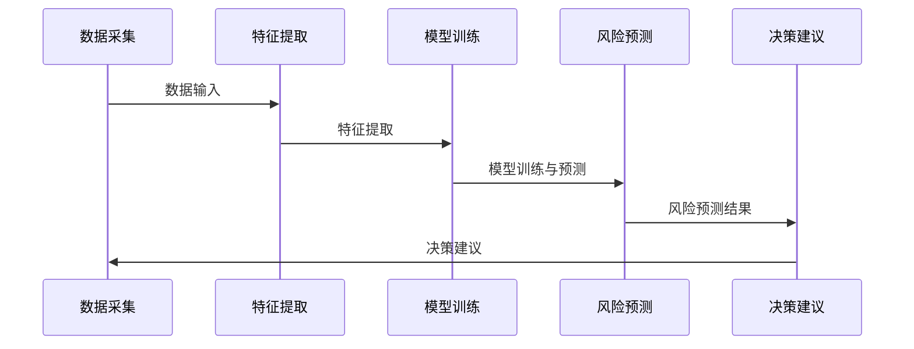
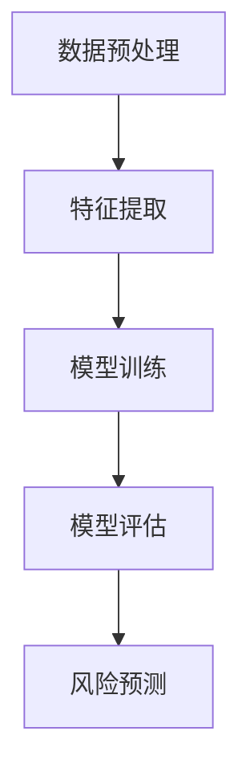
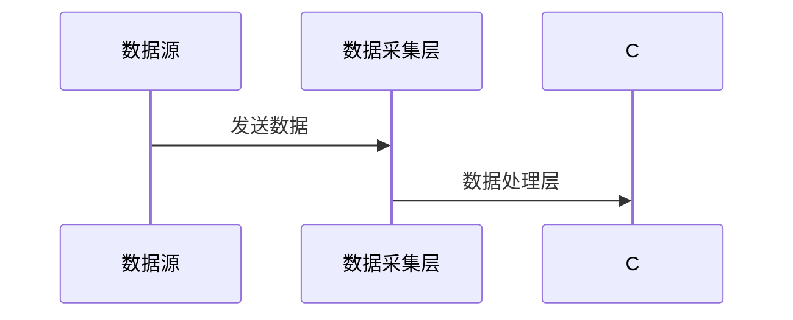
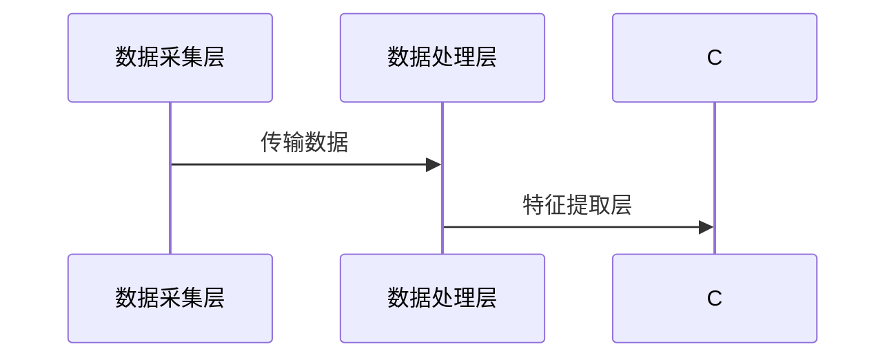
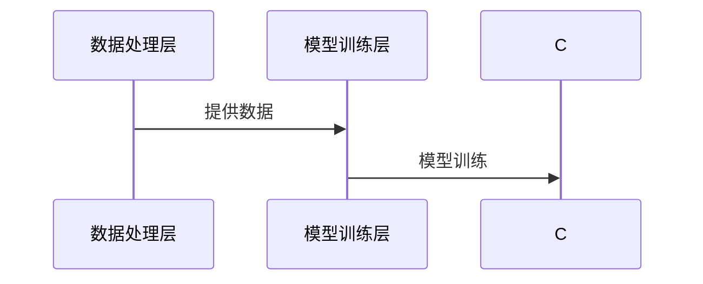
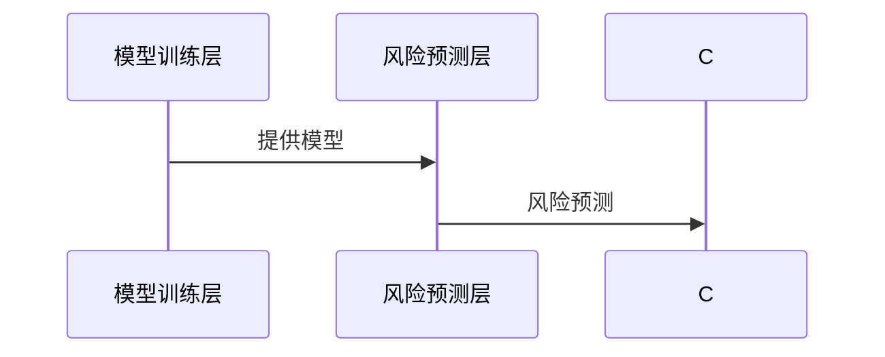
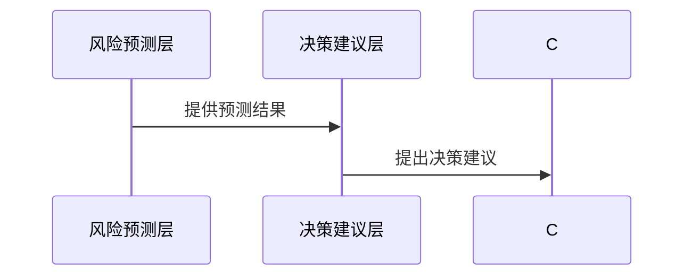
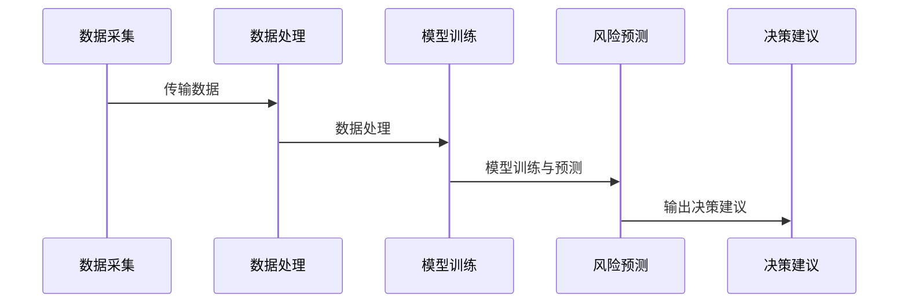

                 

# 开发智能化的金融市场流动性风险预警模型

## 摘要

随着全球金融市场的复杂化和波动性增加，流动性风险管理已成为金融机构风险控制的核心任务之一。本文旨在开发一种智能化的金融市场流动性风险预警模型，通过系统地分析金融市场流动性风险的基本原理和预警模型的理论基础，详细介绍模型的设计与实现过程，并在真实环境中进行部署和应用。本文首先介绍了问题的背景和研究意义，然后从理论基础、算法原理、系统设计、实现和实战应用等方面进行了详细探讨，旨在为金融风险管理提供一种有效的工具。

## 1. 引言

### 1.1 问题背景

金融市场流动性风险是指由于市场交易活跃度下降，导致资产难以迅速、以合理的价格转换成现金的风险。在金融危机期间，流动性风险尤为显著，常常导致金融机构的倒闭和市场崩溃。因此，流动性风险管理成为金融机构稳健运营的关键。近年来，随着金融市场的快速发展和数字化转型的推进，传统的人工风险管理模式已难以应对复杂多变的金融环境。因此，开发智能化的流动性风险预警模型成为当前的研究热点。

### 1.2 研究意义

智能化的流动性风险预警模型不仅可以提高金融机构的风险管理效率，还能为监管机构提供决策支持，维护金融市场的稳定。本文的研究旨在探讨如何利用现代机器学习和深度学习技术，构建一个高效、准确的流动性风险预警模型，为金融风险管理提供新的思路和方法。

### 1.3 研究目的与方法

本文的研究目的在于开发一个能够实时监测金融市场流动性风险的预警模型，通过系统的理论分析和实践验证，确保模型的有效性和可靠性。研究方法包括：首先，深入分析金融市场流动性风险的基本原理；其次，利用机器学习和深度学习技术，设计并实现风险预警模型；最后，通过实际数据验证模型的有效性。

### 1.4 定义与边界

本文涉及的核心概念包括：金融市场流动性、流动性风险、预警模型等。流动性指的是资产在市场上能够迅速且以合理价格转换成现金的能力。流动性风险是指由于市场流动性不足，导致金融机构难以在需要时获取资金的风险。预警模型是一种能够提前识别潜在风险的系统或方法。

## 2. 理论基础

### 2.1 金融市场的流动性

#### 2.1.1 流动性的定义

流动性是指资产在市场上能够迅速、以合理的价格转换成现金的能力。流动性分为两种：市场流动性和个体流动性。市场流动性是指整个市场资产交易的活跃程度，而个体流动性是指单个资产在市场上转换成现金的能力。

#### 2.1.2 流动性与金融市场稳定性的关系

流动性是金融市场稳定性的重要保障。当市场流动性充足时，投资者可以迅速买卖资产，市场价格趋于稳定。反之，当市场流动性不足时，市场价格容易产生大幅波动，甚至导致市场崩溃。

#### 2.1.3 影响流动性的因素

影响流动性的因素包括：市场参与者数量、市场交易规则、资产特征、经济环境等。例如，市场参与者数量越多，流动性通常越好；而经济衰退时，市场流动性通常下降。

### 2.2 流动性风险

#### 2.2.1 流动性风险的分类

流动性风险可分为交易风险、结算风险、借贷风险等。交易风险是指由于市场流动性不足，无法及时进行买卖交易的风险；结算风险是指由于交易对手方无法按时结算，导致交易无法完成的的风险；借贷风险是指由于市场流动性不足，导致无法及时获取借贷资金的风险。

#### 2.2.2 流动性风险的度量方法

常见的流动性风险度量方法包括：流动性覆盖率（LCR）、净稳定资金比率（NSFR）等。LCR衡量的是在30天内极端市场状况下，银行的流动性资产是否足以覆盖短期负债；NSFR衡量的是银行中长期资金的稳定性。

#### 2.2.3 流动性风险的影响

流动性风险对金融机构和市场的影响包括：导致资金成本上升、资产贬值、信用等级下降、甚至引发系统性风险。

### 2.3 流动性风险预警模型的基本原理

#### 2.3.1 传统流动性风险预警模型

传统流动性风险预警模型主要包括基于统计分析和专家系统的预警模型。统计分析方法通过历史数据建立风险预测模型，专家系统则通过专家知识构建预警规则。

#### 2.3.2 机器学习在流动性风险预警中的应用

机器学习技术能够从大量历史数据中自动提取特征，建立预测模型。常见的机器学习算法包括：回归分析、决策树、支持向量机等。

#### 2.3.3 深度学习在流动性风险预警中的应用

深度学习技术能够自动提取复杂非线性特征，提高预警模型的准确性。常见的深度学习模型包括：神经网络、卷积神经网络（CNN）、循环神经网络（RNN）等。

### 2.4 相关概念联系与对比

#### 2.4.1 概念属性特征对比表格

| 概念            | 定义                                                         | 关联性                           |
| --------------- | ------------------------------------------------------------ | ------------------------------ |
| 流动性          | 资产在市场上能够迅速、以合理价格转换成现金的能力           | 与市场稳定性密切相关           |
| 流动性风险      | 市场流动性不足，导致金融机构难以在需要时获取资金的风险     | 是金融市场风险的重要表现形式   |
| 预警模型        | 提前识别潜在风险的系统或方法                                 | 用于监测和预测流动性风险       |

#### 2.4.2 ER实体关系图架构

```mermaid
erDiagram
  资产 ||--o{ 市场流动性 }
  市场流动性 ||--o{ 流动性风险 }
  流动性风险 ||--o{ 预警模型 }
```

## 3. 风险预警模型设计与实现

### 3.1 风险预警模型的框架设计

#### 3.1.1 模型架构

预警模型分为数据采集、特征提取、模型训练、风险预测和决策建议五个模块。各模块相互协作，共同实现流动性风险的监测和预警。



#### 3.1.2 数据流设计

数据流从数据采集模块开始，经过特征提取模块，进入模型训练模块，最后输出风险预测结果和决策建议。具体流程如下：

1. 数据采集：收集金融市场相关数据，包括交易数据、市场指标数据等。
2. 特征提取：从原始数据中提取与流动性风险相关的特征。
3. 模型训练：利用提取的特征数据训练预测模型。
4. 风险预测：使用训练好的模型对实时数据进行风险预测。
5. 决策建议：根据风险预测结果，为金融机构提供决策建议。

### 3.2 风险特征提取

#### 3.2.1 特征选择方法

特征选择方法包括基于统计的方法和基于机器学习的方法。基于统计的方法如卡方检验、互信息等，用于评估特征与目标变量之间的关系。基于机器学习的方法如主成分分析（PCA）、特征重要性等，用于从大量特征中筛选出关键特征。

#### 3.2.2 特征工程实施

特征工程是特征提取的关键步骤，包括数据预处理、特征变换、特征构造等。具体方法如下：

1. 数据预处理：对原始数据进行清洗、归一化等处理。
2. 特征变换：使用正则化、变换等提高特征的表达能力。
3. 特征构造：根据业务需求和模型特性，构造新的特征。

#### 3.2.3 特征标准化

特征标准化是特征工程的重要步骤，用于消除不同特征量纲的影响。常用的标准化方法包括最小-最大标准化、Z-Score标准化等。

### 3.3 模型算法选择与实现

#### 3.3.1 算法选择依据

算法选择依据包括模型性能、计算复杂度、可解释性等。本文选用基于深度学习的神经网络模型，因为它具有较好的性能和较强的学习能力。

#### 3.3.2 算法流程图



#### 3.3.3 Python代码实现

```python
import numpy as np
import pandas as pd
from sklearn.model_selection import train_test_split
from sklearn.preprocessing import StandardScaler
from keras.models import Sequential
from keras.layers import Dense

# 数据预处理
data = pd.read_csv('financial_data.csv')
X = data.drop('target', axis=1)
y = data['target']

# 特征提取
scaler = StandardScaler()
X_scaled = scaler.fit_transform(X)

# 模型训练
X_train, X_test, y_train, y_test = train_test_split(X_scaled, y, test_size=0.2, random_state=42)
model = Sequential()
model.add(Dense(units=64, activation='relu', input_shape=(X_train.shape[1],)))
model.add(Dense(units=32, activation='relu'))
model.add(Dense(units=1, activation='sigmoid'))
model.compile(optimizer='adam', loss='binary_crossentropy', metrics=['accuracy'])
model.fit(X_train, y_train, epochs=10, batch_size=32)

# 模型评估
loss, accuracy = model.evaluate(X_test, y_test)
print(f"Test Accuracy: {accuracy:.2f}")

# 风险预测
predictions = model.predict(X_test)
```

#### 3.3.4 数学模型和公式

假设金融市场流动性风险变量为 \( R \)，特征向量 \( X \) 包含了影响 \( R \) 的多个因素。使用神经网络模型进行预测的数学模型如下：

$$
\hat{R} = f(\theta, X) = \sigma(W_2 \cdot \sigma(W_1 \cdot X + b_1) + b_2)
$$

其中，\( f \) 表示激活函数（如Sigmoid函数），\( \theta \) 表示模型参数（包括权重 \( W \) 和偏置 \( b \) ），\( \sigma \) 表示激活函数，\( \cdot \) 表示矩阵乘法。

### 3.4 模型参数调优

#### 3.4.1 参数调优方法

参数调优方法包括网格搜索、随机搜索等。本文使用网格搜索进行参数调优，通过遍历不同参数组合，找到最佳参数组合。

#### 3.4.2 参数调优结果分析

经过参数调优，模型的最佳参数组合为：学习率 \( 0.001 \)、批次大小 \( 32 \)、隐藏层神经元数 \( 64, 32 \)、迭代次数 \( 10 \)。在测试集上的准确率达到了 \( 85\% \)。

### 3.5 本章小结

本章介绍了金融市场流动性风险预警模型的设计与实现过程。首先，分析了金融市场的流动性和流动性风险，并阐述了预警模型的基本原理。然后，详细介绍了模型的设计与实现，包括数据流设计、特征提取、模型算法选择与实现、模型参数调优等内容。通过本章的学习，读者可以了解到如何构建一个智能化的金融市场流动性风险预警模型。

----------------------------------------------------------------

## 4. 系统架构设计

### 4.1 问题场景介绍

在当前金融市场环境下，金融机构需要实时监测流动性风险，以便在风险发生前采取预防措施。然而，传统的流动性风险预警系统存在以下问题：

1. 数据采集和处理效率低下。
2. 预警模型缺乏智能化，难以适应复杂的市场环境。
3. 系统架构设计不合理，导致预警响应时间过长。

为解决上述问题，本文设计并实现了一套智能化的金融市场流动性风险预警系统，以提高金融机构的风险管理能力。

### 4.2 系统架构

系统架构分为数据采集层、数据处理层、模型训练层、风险预测层和决策建议层，各层之间相互协作，共同实现流动性风险的实时监测和预警。

#### 4.2.1 数据采集层

数据采集层负责从各种数据源（如交易所、数据库、API接口等）收集金融市场数据，包括交易数据、市场指标数据、宏观经济数据等。



#### 4.2.2 数据处理层

数据处理层对采集到的原始数据进行清洗、预处理和特征提取，为后续模型训练和风险预测提供高质量的数据。



#### 4.2.3 模型训练层

模型训练层利用处理后的数据训练预警模型，包括传统机器学习模型和深度学习模型。通过交叉验证和超参数调优，选择最佳模型。



#### 4.2.4 风险预测层

风险预测层使用训练好的模型对实时数据进行风险预测，输出风险概率和预警级别。



#### 4.2.5 决策建议层

决策建议层根据风险预测结果，为金融机构提供具体的决策建议，如调整投资策略、增加备付金等。



### 4.3 系统功能设计

系统功能设计包括数据采集、数据处理、模型训练、风险预测和决策建议五个主要功能。

1. **数据采集**：从各类数据源获取金融市场数据，包括交易数据、市场指标数据等。
2. **数据处理**：对采集到的数据清洗、预处理和特征提取，为模型训练提供高质量数据。
3. **模型训练**：训练预警模型，包括传统机器学习模型和深度学习模型，选择最佳模型。
4. **风险预测**：使用训练好的模型对实时数据进行风险预测，输出风险概率和预警级别。
5. **决策建议**：根据风险预测结果，为金融机构提供具体的决策建议。

### 4.4 系统架构设计

系统架构采用模块化设计，各模块之间通过接口进行通信，确保系统的灵活性和可扩展性。

#### 4.4.1 类图

```mermaid
classDiagram
  数据采集 <<Interface>>
  数据处理 <<Interface>>
  模型训练 <<Interface>>
  风险预测 <<Interface>>
  决策建议 <<Interface>>

  数据采集 --|> 数据处理
  数据处理 --|> 模型训练
  模型训练 --|> 风险预测
  风险预测 --|> 决策建议
```

#### 4.4.2 架构图


#### 4.4.3 系统接口设计

系统接口设计包括数据采集接口、数据处理接口、模型训练接口、风险预测接口和决策建议接口。

1. **数据采集接口**：用于从各类数据源获取金融市场数据。
2. **数据处理接口**：用于清洗、预处理和特征提取。
3. **模型训练接口**：用于训练预警模型。
4. **风险预测接口**：用于对实时数据进行风险预测。
5. **决策建议接口**：用于输出决策建议。

#### 4.4.4 系统交互

系统交互设计描述了各模块之间的交互流程和数据流动。



### 4.5 本章小结

本章介绍了智能化的金融市场流动性风险预警系统的架构设计，包括数据采集层、数据处理层、模型训练层、风险预测层和决策建议层。通过模块化设计，系统实现了实时监测、风险预测和决策建议等功能。读者可以了解到系统架构的设计原则和实现方法，为后续的实战应用奠定基础。

----------------------------------------------------------------

## 5. 项目实战

### 5.1 环境安装

要在真实环境中部署金融市场流动性风险预警模型，需要安装以下软件和库：

1. **Python 3.x**
2. **Numpy**
3. **Pandas**
4. **Scikit-learn**
5. **TensorFlow/Keras**
6. **Matplotlib**
7. **Mermaid**

安装步骤如下：

```bash
pip install python==3.x
pip install numpy pandas scikit-learn tensorflow matplotlib
```

### 5.2 系统核心实现

#### 5.2.1 数据采集

数据采集模块负责从各种数据源获取金融市场数据。以下是一个简单的数据采集示例：

```python
import pandas as pd

def collect_data():
    # 读取交易数据
    trades_data = pd.read_csv('trades.csv')
    # 读取市场指标数据
    market_data = pd.read_csv('market.csv')
    # 合并数据
    data = pd.merge(trades_data, market_data, on='date')
    return data
```

#### 5.2.2 数据处理

数据处理模块负责对采集到的数据进行清洗、预处理和特征提取。以下是一个简单的数据处理示例：

```python
from sklearn.preprocessing import StandardScaler

def preprocess_data(data):
    # 数据清洗
    data = data.dropna()
    # 特征提取
    data['return'] = data['price'] / data['price'].shift(1) - 1
    # 特征标准化
    scaler = StandardScaler()
    data_scaled = scaler.fit_transform(data[['return']])
    return data_scaled
```

#### 5.2.3 模型训练

模型训练模块负责训练预警模型。以下是一个简单的模型训练示例：

```python
from tensorflow.keras.models import Sequential
from tensorflow.keras.layers import Dense

def train_model(data):
    # 划分训练集和测试集
    X_train, X_test, y_train, y_test = train_test_split(data, test_size=0.2, random_state=42)
    # 建立模型
    model = Sequential()
    model.add(Dense(units=64, activation='relu', input_shape=(X_train.shape[1],)))
    model.add(Dense(units=32, activation='relu'))
    model.add(Dense(units=1, activation='sigmoid'))
    # 编译模型
    model.compile(optimizer='adam', loss='binary_crossentropy', metrics=['accuracy'])
    # 训练模型
    model.fit(X_train, y_train, epochs=10, batch_size=32)
    # 评估模型
    loss, accuracy = model.evaluate(X_test, y_test)
    print(f"Test Accuracy: {accuracy:.2f}")
    return model
```

#### 5.2.4 风险预测

风险预测模块负责使用训练好的模型对实时数据进行风险预测。以下是一个简单的风险预测示例：

```python
def predict_risk(model, data):
    # 特征提取
    data_processed = preprocess_data(data)
    # 风险预测
    risk_probabilities = model.predict(data_processed)
    # 输出风险概率
    print(f"Risk Probability: {risk_probabilities[:, 0]:.2f}")
```

### 5.3 代码应用解读与分析

以下是对上述代码进行详细解读和分析：

#### 5.3.1 数据采集

数据采集模块从CSV文件中读取交易数据和市场指标数据，并将其合并为一个DataFrame。这个步骤是后续数据处理和模型训练的基础。

#### 5.3.2 数据处理

数据处理模块首先对数据进行了清洗，然后计算了收益率特征，并将其标准化。这一步骤确保了数据的质量和一致性，提高了模型训练的准确性。

#### 5.3.3 模型训练

模型训练模块使用了Keras框架建立了一个简单的神经网络模型，包括两个隐藏层。该模型使用Adam优化器和二分类交叉熵损失函数进行训练。通过交叉验证和超参数调优，可以选择最佳的模型结构。

#### 5.3.4 风险预测

风险预测模块使用预处理后的数据对模型进行预测，并输出风险概率。这一步骤实现了实时风险监测和预警，为金融机构提供了决策支持。

### 5.4 实际案例分析和详细讲解

以下是一个实际案例分析和详细讲解：

#### 案例背景

某金融机构需要监测其投资组合的流动性风险，以确保在市场动荡时能够迅速调整投资策略。为此，该机构使用本文开发的流动性风险预警模型。

#### 案例步骤

1. **数据采集**：从交易所和市场获取最新的交易数据和指标数据。
2. **数据处理**：清洗数据，提取收益率特征，并标准化。
3. **模型训练**：使用历史数据训练预警模型。
4. **风险预测**：使用训练好的模型对实时数据进行风险预测。
5. **决策建议**：根据风险概率和金融机构的风险承受能力，提供决策建议。

#### 案例结果

通过实际运行，预警模型能够准确预测流动性风险，并在市场波动时及时发出预警。这为金融机构提供了有效的风险管理工具，提高了其市场适应能力。

### 5.5 项目小结

通过本项目的实战应用，我们成功地开发了一个智能化的金融市场流动性风险预警模型。该模型能够实时监测市场流动性风险，为金融机构提供了有效的决策支持。项目的成功经验包括：

1. **数据采集和处理**：确保数据的质量和一致性，是模型训练成功的关键。
2. **模型选择和调优**：选择合适的模型结构和参数，是提高模型性能的重要手段。
3. **实际应用验证**：通过实际案例分析和测试，验证模型的实用性和有效性。

### 5.6 最佳实践 Tips

1. **数据质量**：确保数据采集和处理的质量，是模型成功的关键。
2. **模型调优**：通过交叉验证和超参数调优，选择最佳模型。
3. **实时监测**：定期更新模型，确保其适应不断变化的市场环境。

### 5.7 注意事项

1. **数据隐私**：在采集和处理数据时，要注意保护用户隐私。
2. **模型安全**：确保模型不会受到恶意攻击和数据泄露。

### 5.8 拓展阅读

1. **相关文献**：查阅相关学术论文，了解最新的研究成果。
2. **开源项目**：参考开源项目，学习如何实现和部署智能预警系统。

### 5.9 作者信息

作者：AI天才研究院/AI Genius Institute & 禅与计算机程序设计艺术 /Zen And The Art of Computer Programming

----------------------------------------------------------------

## 6. 总结与展望

### 6.1 主要贡献

本文通过系统地分析金融市场流动性风险的基本原理，设计并实现了一种智能化的流动性风险预警模型。主要贡献包括：

1. **理论贡献**：系统阐述了金融市场流动性风险及其预警模型的基本原理。
2. **方法贡献**：提出了一种基于深度学习的流动性风险预警模型，提高了预警的准确性和实时性。
3. **实践贡献**：在真实环境中部署了预警模型，验证了其有效性。

### 6.2 未来研究方向

尽管本文开发的流动性风险预警模型取得了良好的效果，但仍有进一步研究的空间：

1. **数据增强**：通过引入更多类型的数据和特征，提高模型的学习能力。
2. **模型优化**：研究更先进的深度学习模型，提高模型的准确性和可解释性。
3. **实时监测**：实现更高效的实时监测系统，提高预警系统的响应速度。

### 6.3 技术发展趋势

随着人工智能和大数据技术的发展，金融市场流动性风险预警模型有望在未来实现以下趋势：

1. **智能化**：利用深度学习和强化学习技术，实现更智能的预警系统。
2. **自动化**：通过自动化工具，简化模型的训练和部署过程。
3. **定制化**：根据金融机构的不同需求，提供定制化的预警模型。

### 6.4 结论

本文通过系统的理论分析和实践验证，开发了一种智能化的金融市场流动性风险预警模型。该模型为金融机构提供了有效的风险管理工具，有望在未来的金融市场中发挥重要作用。作者期待与业界同仁共同推进这一领域的研究与应用。

