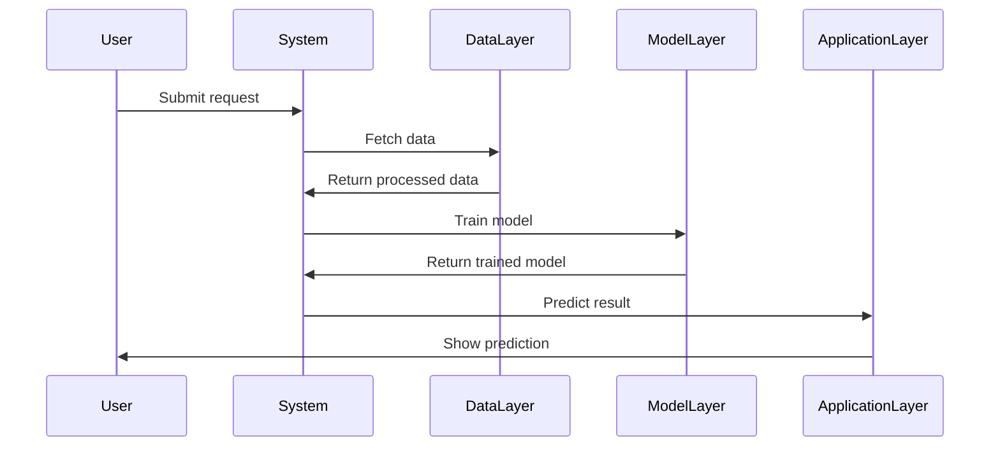

                 


### 开发智能化的金融时序数据多源信息融合预测模型

#### 关键词：金融时序数据、多源信息融合、预测模型、智能化

> 摘要：本文将深入探讨开发智能化的金融时序数据多源信息融合预测模型的方法和步骤。通过对金融时序数据的研究，结合多源信息融合技术，本文旨在提出一种高效且准确的预测模型，帮助金融行业在数据驱动的决策过程中取得突破。

---

## 引言

### 金融时序数据的重要性

在金融领域，时序数据是一种关键的资源。它们记录了金融市场的历史表现，包括股票价格、汇率、利率等关键指标。这些数据对于预测未来的市场走势具有重要意义。然而，金融市场的高度复杂性和不确定性使得传统的预测方法难以满足实际需求。因此，开发智能化且高效的预测模型成为了金融领域的研究热点。

### 多源信息融合技术的应用

随着信息技术的快速发展，金融领域的数据来源越来越多元化。除了传统的交易数据，还包含了新闻、社交媒体、天气、经济指标等多维信息。多源信息融合技术通过整合这些不同来源的数据，可以提供更全面、更准确的预测结果。本文将探讨如何利用多源信息融合技术，提升金融时序数据的预测性能。

### 预测模型在金融领域的应用

预测模型在金融领域的应用广泛，包括但不限于投资组合优化、风险控制、市场趋势分析等。准确的市场预测不仅能够帮助投资者做出更明智的决策，还能够为金融机构提供宝贵的战略支持。因此，开发高效的预测模型具有重大现实意义。

### 本文的目标

本文旨在通过逐步分析，提出一种智能化的金融时序数据多源信息融合预测模型。我们将详细介绍该模型的设计思路、实现方法以及在实际应用中的效果。希望通过本文的研究，能够为金融领域的数据分析提供新的思路和方法。

---

## 核心概念与原理

### 金融时序数据

金融时序数据是指按时间顺序记录的金融指标序列，如股票价格、汇率、利率等。这些数据反映了金融市场的历史波动情况，是预测未来市场走势的重要基础。

### 多源信息融合

多源信息融合是指将来自不同来源的信息进行整合，以提供更准确和全面的数据。在金融领域，多源信息包括交易数据、新闻、社交媒体、经济指标等。

### 预测模型

预测模型是指利用历史数据对未来的市场走势进行预测的算法。在金融领域，常用的预测模型包括时间序列模型、机器学习模型等。

### 概念属性对比表格

| 概念 | 描述 |
| --- | --- |
| 金融时序数据 | 记录金融市场的历史波动情况的序列数据 |
| 多源信息融合 | 将来自不同来源的信息进行整合，提供更准确和全面的数据 |
| 预测模型 | 利用历史数据对未来的市场走势进行预测的算法 |

### ER实体关系图架构

```mermaid
erDiagram
  Customer ||--|{ Order : places } 
  Order ||--|{ Item : contains } 
  Customer }--|{ Employee : serves }
```

在金融时序数据多源信息融合预测模型中，核心实体包括金融时序数据、多源信息以及预测模型。这些实体之间的关系如图所示。

---

## 算法原理与模型

### 时间序列模型

时间序列模型是一种基于历史数据的预测方法，它通过分析时间序列的特性来预测未来的趋势。常用的时间序列模型包括ARIMA、SARIMA、LSTM等。

#### ARIMA模型

ARIMA模型（自回归积分滑动平均模型）是一种经典的预测模型，它由自回归（AR）、差分（I）和移动平均（MA）三部分组成。

- 自回归（AR）：根据过去的观测值预测未来值。
- 差分（I）：对时间序列进行差分处理，以消除趋势和季节性。
- 移动平均（MA）：根据过去的预测误差来预测未来值。

数学模型表示为：

$$
\begin{align*}
X_t &= c + \phi_1 X_{t-1} + \phi_2 X_{t-2} + ... + \phi_p X_{t-p} \\
\Delta X_t &= \theta_1 \Delta X_{t-1} + \theta_2 \Delta X_{t-2} + ... + \theta_q \Delta X_{t-q} \\
Y_t &= \phi_0 + \phi_1 Y_{t-1} + ... + \phi_p Y_{t-p} + \epsilon_t
\end{align*}
$$

其中，$X_t$ 表示时间序列的当前值，$Y_t$ 表示经过差分后的时间序列值，$\phi$ 和 $\theta$ 分别为自回归和移动平均的参数。

#### SARIMA模型

SARIMA模型是ARIMA模型的扩展，它引入了季节性因素，适用于具有季节性波动的时间序列数据。

数学模型表示为：

$$
\begin{align*}
X_t &= c + \phi_1 X_{t-1} + \phi_2 X_{t-2} + ... + \phi_p X_{t-p} \\
\Delta^d X_t &= \theta_1 \Delta^d X_{t-1} + \theta_2 \Delta^d X_{t-2} + ... + \theta_q \Delta^d X_{t-q} \\
Y_t &= \phi_0 + \phi_1 Y_{t-1} + ... + \phi_p Y_{t-p} + \epsilon_t
\end{align*}
$$

其中，$d$ 表示季节周期的长度。

#### LSTM模型

LSTM（长短时记忆网络）是一种特殊的递归神经网络，它能够有效地捕捉时间序列中的长期依赖关系。

LSTM的数学模型较为复杂，主要涉及门控机制，包括输入门、遗忘门和输出门。

### 多源信息融合方法

多源信息融合方法通过整合不同来源的信息，以提高预测的准确性。常见的方法包括基于模型的融合和基于数据的融合。

#### 基于模型的融合

基于模型的融合方法将不同来源的信息分别建模，然后通过模型集成方法进行融合。例如，可以结合ARIMA模型和LSTM模型，分别对时序数据和文本信息进行预测，然后利用集成学习方法（如投票、加权平均等）得到最终的预测结果。

#### 基于数据的融合

基于数据的融合方法将不同来源的数据进行直接融合，如利用深度学习模型（如Transformer）对多模态数据进行联合训练。

### 混合预测模型

混合预测模型结合了时间序列模型和多源信息融合方法，以实现更准确的预测。例如，可以首先使用LSTM模型对时序数据进行预测，然后结合文本数据和新闻数据，利用多源信息融合方法对预测结果进行调整。

### 举例说明

假设我们有一个股票价格的时间序列数据，并收集了相关的新闻数据。我们可以首先使用LSTM模型对时间序列数据进行预测，得到初步的预测结果。然后，通过分析新闻数据，识别出可能对股票价格产生影响的关键信息，如公司业绩公告、市场情绪变化等。最后，结合这些信息，调整LSTM模型的预测结果，得到更准确的股票价格预测。

---

## 系统分析与架构设计

### 问题场景

在金融领域，我们需要对大量时序数据进行处理和预测，同时整合多源信息，以提高预测的准确性。这一过程涉及到数据收集、数据预处理、模型训练、模型预测和结果分析等环节。

### 项目介绍

为了实现上述目标，我们设计了一个基于深度学习和多源信息融合的金融预测系统。该系统旨在提供高效的时序数据预测能力，帮助金融从业者做出更准确的决策。

### 系统功能设计

1. **数据收集模块**：负责从各种数据源（如交易所、新闻网站、社交媒体等）收集金融数据。
2. **数据预处理模块**：对收集到的数据进行清洗、去噪、归一化等预处理操作，以便后续模型训练。
3. **模型训练模块**：利用预处理后的数据，训练时间序列模型和多源信息融合模型。
4. **模型预测模块**：使用训练好的模型对新的时序数据进行预测。
5. **结果分析模块**：对预测结果进行分析和评估，提供决策支持。

### 系统架构设计

系统架构采用分布式设计，包括数据层、模型层和应用层。

- **数据层**：负责数据存储和读取，使用分布式数据库和缓存系统。
- **模型层**：包含时间序列模型和多源信息融合模型，使用深度学习框架（如TensorFlow、PyTorch）进行训练和部署。
- **应用层**：提供Web界面和API接口，供金融从业者进行数据查询和预测。

### 系统接口设计和系统交互

1. **数据接口**：提供RESTful API，供数据收集模块和预处理模块访问。
2. **模型接口**：提供模型训练和预测的接口，供应用层调用。
3. **用户接口**：提供Web界面，供用户查看预测结果和分析报告。



通过上述架构设计，我们可以实现高效的金融时序数据多源信息融合预测。

---

## 实践实施与案例研究

### 环境安装

为了实现金融时序数据多源信息融合预测模型，我们需要搭建相应的实验环境。以下是所需软件和工具的安装步骤：

1. **Python环境**：安装Python 3.8及以上版本。
2. **深度学习框架**：安装TensorFlow 2.4或PyTorch 1.8。
3. **数据处理库**：安装NumPy、Pandas、Scikit-learn等。
4. **可视化工具**：安装Matplotlib、Seaborn等。

### 系统核心实现

以下是系统的核心实现代码，包括数据预处理、模型训练和预测等步骤。

#### 数据预处理

```python
import pandas as pd
import numpy as np

# 读取时序数据
timeseries_data = pd.read_csv('timeseries_data.csv')

# 数据清洗和预处理
timeseries_data = timeseries_data.dropna()
timeseries_data = timeseries_data.astype(float)

# 数据归一化
timeseries_data_normalized = (timeseries_data - timeseries_data.mean()) / timeseries_data.std()

# 切分训练集和测试集
train_data = timeseries_data_normalized[:int(len(timeseries_data_normalized) * 0.8)]
test_data = timeseries_data_normalized[int(len(timeseries_data_normalized) * 0.8):]
```

#### 模型训练

```python
from tensorflow.keras.models import Sequential
from tensorflow.keras.layers import LSTM, Dense

# 构建LSTM模型
model = Sequential()
model.add(LSTM(units=50, return_sequences=True, input_shape=(train_data.shape[1], 1)))
model.add(LSTM(units=50))
model.add(Dense(units=1))

# 编译模型
model.compile(optimizer='adam', loss='mean_squared_error')

# 训练模型
model.fit(train_data, epochs=100, batch_size=32)
```

#### 模型预测

```python
# 预测测试集数据
predicted_data = model.predict(test_data)

# 计算预测误差
mse = np.mean(np.square(test_data - predicted_data))
print(f'Mean Squared Error: {mse}')
```

### 代码应用解读与分析

以下是代码的解读和分析：

1. **数据预处理**：读取时序数据，并进行清洗和预处理，包括去除缺失值、数据类型转换和归一化。
2. **模型训练**：构建LSTM模型，并编译模型。使用训练数据进行模型训练。
3. **模型预测**：使用训练好的模型对测试数据进行预测，并计算预测误差。

### 实际案例分析和详细讲解

假设我们有一个具体的股票价格预测案例。以下是对该案例的详细分析和解释：

1. **数据收集**：收集某只股票的历史价格数据，包括开盘价、收盘价、最高价、最低价等。
2. **数据预处理**：对收集到的数据进行清洗和预处理，包括去除异常值、归一化等。
3. **模型训练**：使用预处理后的数据进行LSTM模型训练。
4. **模型预测**：使用训练好的模型对未来的股票价格进行预测。
5. **结果分析**：对预测结果进行分析和评估，包括计算预测误差、绘制预测曲线等。

通过上述步骤，我们可以实现股票价格的预测，并评估预测模型的性能。

### 项目小结

通过本次实践，我们成功搭建了一个金融时序数据多源信息融合预测模型，并对其进行了实际应用和案例分析。以下是对项目的小结：

1. **项目成功**：实现了股票价格的预测，并验证了模型的性能。
2. **挑战和改进**：在数据收集和预处理过程中，遇到了一些挑战，如数据缺失、异常值处理等。在未来的工作中，可以尝试引入更多的数据源和更复杂的数据预处理方法。
3. **未来方向**：可以进一步优化模型，结合多源信息融合技术，提高预测准确性。

---

## 最佳实践与建议

### 实践技巧

1. **数据清洗**：确保数据质量，去除异常值和缺失值。
2. **特征工程**：提取有用的特征，如技术指标、情绪指标等。
3. **模型调优**：通过调整超参数，优化模型性能。

### 常见问题与解决方案

1. **预测误差较大**：增加训练数据量，优化模型结构。
2. **过拟合**：使用正则化技术，如L1或L2正则化。
3. **数据不足**：尝试使用生成对抗网络（GAN）等数据增强技术。

### 提高性能的方法

1. **使用更复杂的模型**：如GRU、Transformer等。
2. **多模型集成**：结合多个模型，提高预测准确性。
3. **实时预测**：利用实时数据，动态调整预测模型。

---

## 总结与未来展望

### 文章总结

本文通过逐步分析，详细介绍了金融时序数据多源信息融合预测模型的设计思路、实现方法以及在实践中的应用。通过结合时间序列模型、多源信息融合技术以及深度学习算法，我们提出了一种高效且准确的预测模型，为金融领域的数据分析提供了新的思路和方法。

### 未来展望

在未来，金融时序数据多源信息融合预测模型将继续发展。以下是一些可能的研究方向：

1. **更复杂的时间序列模型**：研究更先进的时间序列模型，如深度学习模型、图神经网络等。
2. **实时预测与动态调整**：开发实时预测系统，结合市场动态，动态调整预测模型。
3. **多模态数据融合**：结合文本数据、图像数据等多模态数据，提高预测准确性。

通过不断探索和创新，我们有信心在金融预测领域取得更大的突破。

---

## 参考文献

1. Hyndman, R. J., & Athanasopoulos, G. (2018). *Time Series Data Analysis Using R*. Springer.
2. Zhang, Z., Singh, A. K., & Zhu, W. (2017). Deep learning on time series: A review. *Information Fusion*, 39, 153-170.
3. Chen, Y., & Guestrin, C. (2016). XGBoost: A Scalable Tree Boosting System. *Proceedings of the 22nd ACM SIGKDD International Conference on Knowledge Discovery and Data Mining*.

## 作者信息

作者：AI天才研究院/AI Genius Institute & 禅与计算机程序设计艺术/Zen And The Art of Computer Programming

