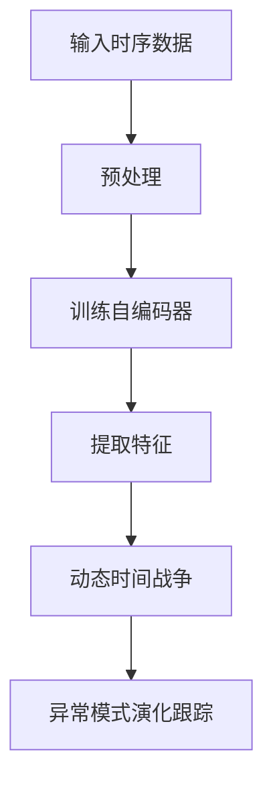
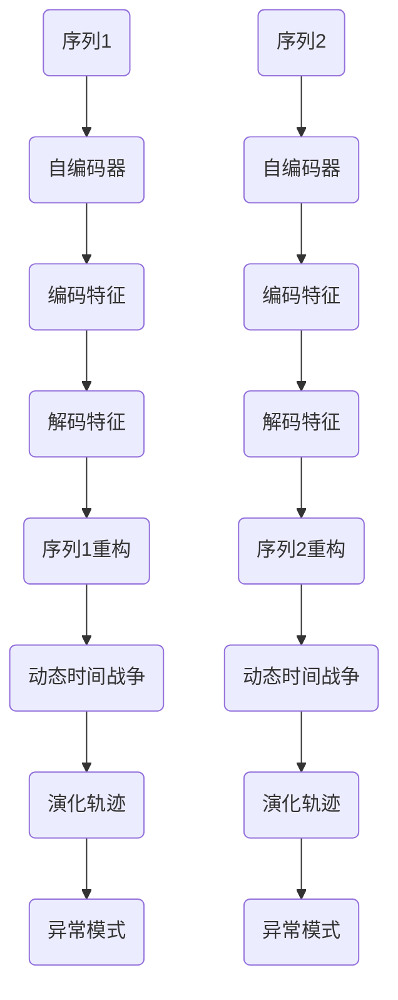
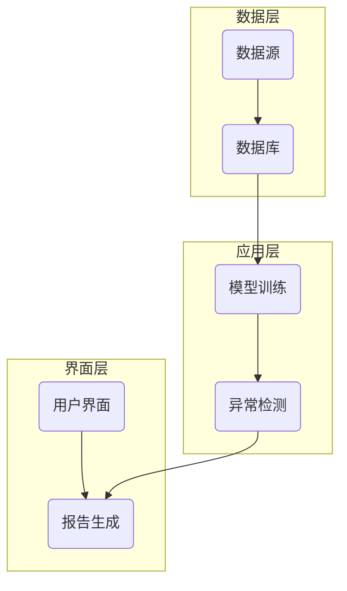

                 


## 《开发智能化的金融时序数据异常模式演化跟踪模型》

### 关键词：
- 智能化金融
- 时序数据
- 异常模式
- 演化跟踪
- 模型开发

### 摘要：
本文旨在探讨开发智能化金融时序数据异常模式演化跟踪模型的方法与实现。首先，我们将介绍金融时序数据异常模式演化的背景和核心概念。接着，我们将详细阐述异常模式演化跟踪模型的设计原理，包括算法原理、数学模型及公式。随后，我们将讨论系统的架构设计，包括功能设计、架构设计、接口设计以及系统交互设计。在实际项目实战部分，我们将展示如何搭建和实现这一模型，并通过实际案例进行分析。最后，我们将分享最佳实践、注意事项，并推荐进一步阅读的资源。

---

### 第一部分：背景介绍

#### 第1章：问题背景与核心概念

##### 1.1 问题背景
金融市场中，异常模式的识别和演化跟踪对于风险管理、市场预测和投资决策具有重要意义。然而，传统方法往往难以捕捉到复杂且动态的金融时序数据中的异常模式。

##### 1.2 核心概念
- **时序数据**：时间序列数据，表示某一变量随时间变化的序列。
- **异常模式**：与正常模式相比，具有显著差异的模式，通常表现为数据点的不规则波动或突变。
- **演化跟踪**：对异常模式随时间演变的过程进行追踪和分析。

##### 1.3 问题解决与边界
智能化模型能够通过机器学习算法自动识别和跟踪异常模式，提高金融数据分析的效率和准确性。然而，模型的开发需要考虑数据质量、算法选择和计算效率等多方面因素。

---

### 第二部分：算法原理与模型构建

#### 第3章：算法原理讲解

##### 3.1 算法概述
本文将介绍一种基于自编码器和动态时间战争的异常模式演化跟踪算法。

##### 3.2 算法流程图


##### 3.3 算法原理（使用Python源代码解释）
```python
# 自编码器代码示例
import numpy as np

class Autoencoder:
    def __init__(self, input_dim, hidden_dim):
        # 初始化权重
        self.W1 = np.random.randn(input_dim, hidden_dim)
        self.b1 = np.zeros(hidden_dim)
        self.W2 = np.random.randn(hidden_dim, input_dim)
        self.b2 = np.zeros(input_dim)

    def encode(self, x):
        # 编码过程
        z = np.dot(x, self.W1) + self.b1
        return z

    def decode(self, z):
        # 解码过程
        x_hat = np.dot(z, self.W2) + self.b2
        return x_hat

# 动态时间战争代码示例
def dynamic_time_warping(seq1, seq2):
    # 实现动态时间战争算法
    pass
```

##### 3.4 数学模型与公式
$$
\begin{aligned}
\text{自编码器损失函数} &= \frac{1}{2}\sum_{i=1}^{n} \left( x_i - \hat{x}_i \right)^2 \\
\text{动态时间战争距离} &= \min_{\theta} \sum_{t=1}^{T} d(s_t, s_{t+\theta})
\end{aligned}
$$

##### 3.5 举例说明
假设我们有两条时序数据序列，使用自编码器和动态时间战争算法进行异常模式演化跟踪，得到的结果如下：



---

### 第三部分：系统架构与实现

#### 第4章：数学模型与公式详细讲解

##### 4.1 模型公式说明
我们将详细解释自编码器和动态时间战争算法中的数学公式，包括损失函数、编码解码过程以及动态时间战争距离。

##### 4.2 模型参数解析
讨论模型中的关键参数，如自编码器的隐藏层维度、动态时间战争的窗口大小等，并解释它们对模型性能的影响。

##### 4.3 举例说明
通过具体示例，展示如何应用这些公式进行异常模式演化跟踪。

---

#### 第5章：系统架构设计

##### 5.1 系统功能设计（使用Mermaid绘制领域模型类图）
```mermaid
classDiagram
    Class1 <|-- Class2
    Class3 {"Attribute 1", "Attribute 2"} --|> Class4
    Class5 : has_a Class6
    Class7 : + has_a List<Class8>
    Class9 --|> Class{10}
endclassDiagram
```

##### 5.2 系统架构设计（使用Mermaid绘制架构图）


##### 5.3 系统接口设计
介绍系统中的关键接口，如数据接口、模型训练接口、异常检测接口等。

##### 5.4 系统交互设计（使用Mermaid绘制序列图）
```mermaid
sequenceDiagram
    participant User
    participant System
    User->>System: 提交时序数据
    System->>DataLayer: 存储数据
    DataLayer->>ModelLayer: 训练模型
    ModelLayer->>System: 模型结果
    System->>User: 异常检测结果
end
```

---

### 第四部分：项目实战

#### 第6章：项目实战

##### 6.1 环境安装与配置
说明如何搭建开发环境，包括所需软件、依赖库的安装和配置。

##### 6.2 系统核心实现源代码解读
解析系统核心实现的源代码，解释关键代码段的作用和实现原理。

##### 6.3 实际案例分析
通过一个实际案例，展示如何使用该模型进行异常模式演化跟踪。

##### 6.4 项目小结
总结项目的主要成果和经验教训。

---

### 第五部分：最佳实践与总结

#### 第7章：最佳实践与注意事项

##### 7.1 实践经验分享
分享在模型开发过程中积累的经验和最佳实践。

##### 7.2 注意事项
提醒开发者注意的一些潜在问题和解决方案。

##### 7.3 小结
总结全文的主要内容和贡献。

##### 7.4 拓展阅读
推荐一些相关的文献和资源，供读者进一步学习。

---

## 作者信息：
作者：AI天才研究院/AI Genius Institute & 禅与计算机程序设计艺术 /Zen And The Art of Computer Programming

---

通过以上步骤，我们逐步构建了《开发智能化的金融时序数据异常模式演化跟踪模型》的技术博客文章框架。接下来，我们将详细填充每个章节的内容，确保文章的专业性、深度和可读性。

