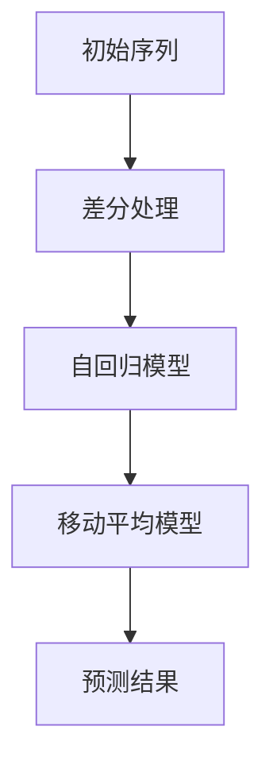
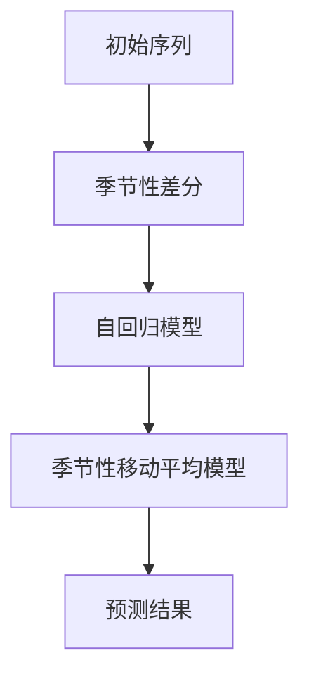
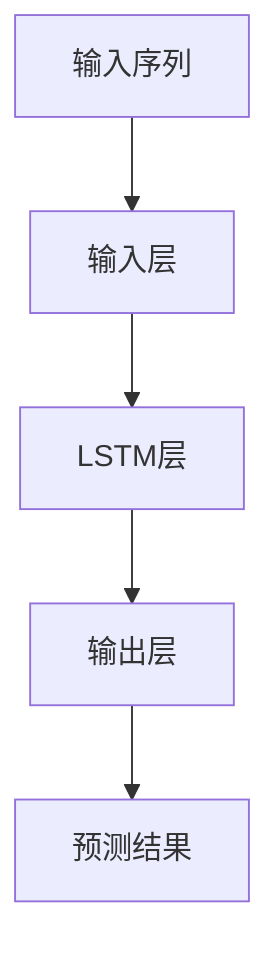
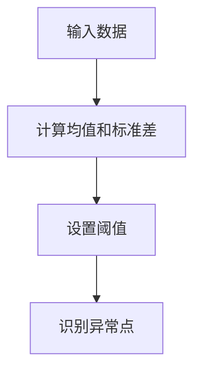
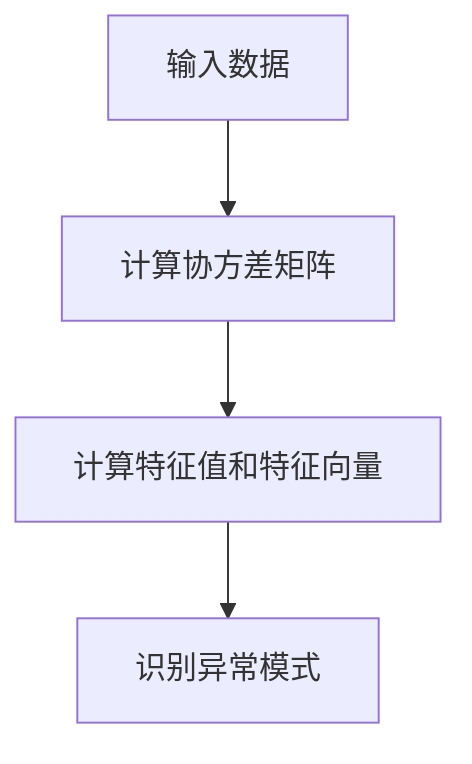
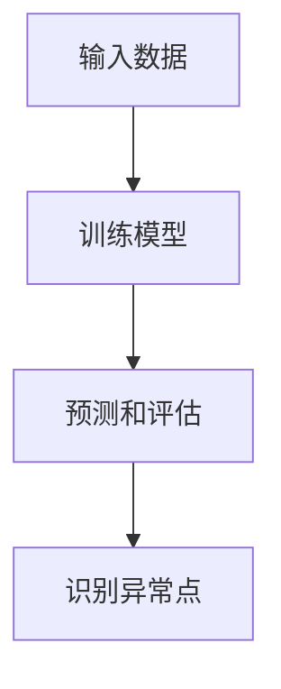
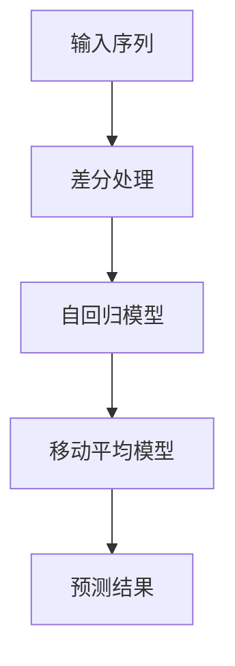
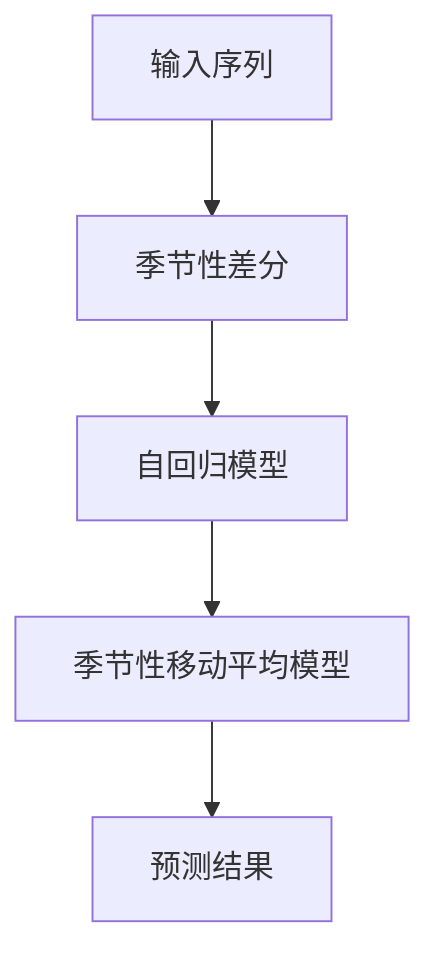
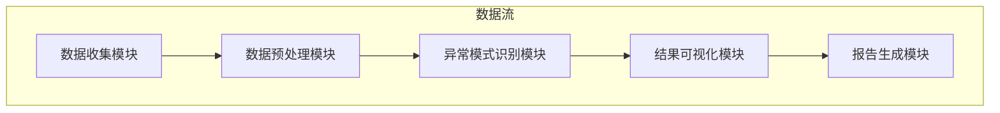
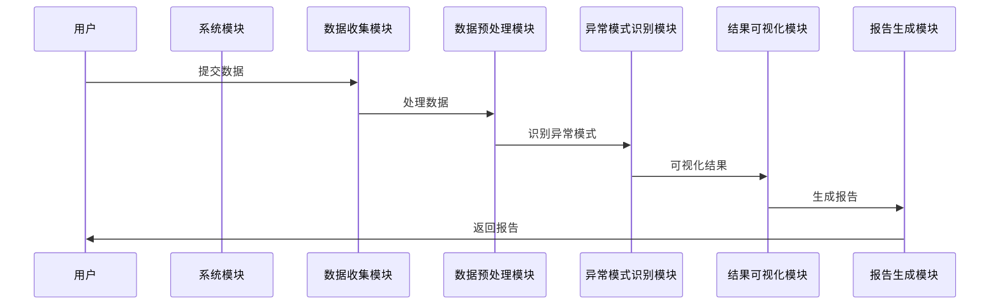

                 

### 一、背景介绍

#### 第1章 问题背景与核心概念

##### 1.1 金融时序数据概述

**1.1.1 金融时序数据的定义**

金融时序数据是指一系列按时间顺序排列的金融变量，如股票价格、汇率、利率等。这些数据通常反映了金融市场的波动性和动态性，具有高度的相关性和复杂性。

**1.1.2 金融时序数据的重要性**

金融时序数据在金融领域扮演着至关重要的角色。首先，它为投资者提供了决策依据，通过分析历史数据，投资者可以预测未来的市场趋势。其次，金融时序数据对监管机构而言同样重要，通过监测金融市场的异常波动，监管机构能够及时发现潜在的风险，并采取相应的措施。

**1.1.3 金融时序数据的特点**

金融时序数据具有以下几个显著特点：

- **非线性**：金融市场的变化通常是非线性的，这意味着简单的线性模型可能无法捕捉其内在的复杂关系。
- **高维度**：金融时序数据往往涉及多个变量，这些变量之间可能存在高度的相关性，增加了分析的复杂性。
- **时间敏感性**：金融市场受到宏观经济、政策变化、市场情绪等多种因素的影响，具有很强的时间敏感性。

##### 1.2 异常模式识别的概念

**1.2.1 异常模式识别的定义**

异常模式识别（Anomaly Detection）是一种用于识别数据集中异常或异常模式的技术。在金融时序数据分析中，异常模式识别旨在发现那些不符合正常行为的数据点或事件。

**1.2.2 异常模式识别的应用场景**

异常模式识别在金融领域有广泛的应用，包括：

- **欺诈检测**：通过识别异常交易行为，防范金融欺诈行为。
- **市场预测**：分析异常市场波动，预测未来的市场趋势。
- **风险管理**：通过识别异常风险事件，提前采取风险控制措施。

**1.2.3 异常模式识别的重要性**

异常模式识别在金融时序数据分析中具有重要意义。首先，它能够帮助投资者和监管机构识别潜在的风险点，避免潜在的损失。其次，通过分析异常模式，可以揭示金融市场的深层次规律，为投资决策提供支持。

##### 1.3 问题描述

**1.3.1 金融时序数据异常模式识别的挑战**

金融时序数据异常模式识别面临诸多挑战：

- **数据复杂性**：金融时序数据高度复杂，包含大量相关变量和非线性关系，使得异常检测变得困难。
- **噪声干扰**：金融市场中存在大量的噪声数据，这些噪声会影响异常模式的识别精度。
- **实时性要求**：金融市场变化迅速，异常模式识别需要实时响应，对系统的计算能力和响应速度提出了高要求。

**1.3.2 研究的目标**

本文的研究目标是开发一种智能化的金融时序数据异常模式识别模型，该模型应具备以下特点：

- **高效性**：能够在实时环境中快速识别异常模式。
- **准确性**：能够准确识别金融时序数据中的异常点。
- **鲁棒性**：能够在噪声干扰和数据缺失的情况下仍能可靠地工作。

**1.3.3 研究的边界与外延**

本文的研究主要聚焦于以下方面：

- **数据来源**：以公开的金融时序数据为研究对象。
- **算法选择**：结合时序分析和异常检测算法，提出一种高效、准确的模型。
- **实际应用**：通过模拟实验验证模型的性能，探讨其在实际金融场景中的应用潜力。

通过以上研究，我们希望为金融时序数据异常模式识别提供一种新的思路和方法，为金融市场风险管理和投资决策提供支持。

#### 第2章 核心概念与联系

##### 2.1 核心概念原理

**2.1.1 时序数据分析方法**

在金融时序数据异常模式识别中，时序数据分析方法起到了关键作用。以下是几种常见的时序数据分析方法：

**2.1.1.1 ARIMA模型**

ARIMA（AutoRegressive Integrated Moving Average）模型是一种经典的时序预测模型，适用于具有平稳序列的数据。ARIMA模型包括三个关键组件：自回归（AR）、差分（I）和移动平均（MA）。

**算法mermaid流程图**：



**数学模型与公式讲解**：

$$
\begin{aligned}
Y_t &= \phi_1Y_{t-1} + \phi_2Y_{t-2} + ... + \phi_pY_{t-p} \\
     &+ \theta_1e_{t-1} + \theta_2e_{t-2} + ... + \theta_qe_{t-q} \\
Z_t &= (1 - \Phi_1B)(1 - \Theta_1B)\Phi(B)Z_t \\
\end{aligned}
$$

**举例说明**：

假设我们有一组股票价格的时序数据，通过ARIMA模型进行分析，可以预测未来一段时间内的股票价格走势。

**2.1.1.2 SARIMA模型**

SARIMA（Seasonal ARIMA）模型是ARIMA模型的扩展，适用于具有季节性的时序数据。SARIMA模型在ARIMA模型的基础上增加了季节性差分和季节性移动平均。

**算法mermaid流程图**：



**数学模型与公式讲解**：

$$
\begin{aligned}
Y_t &= \Phi(B)\Phi_s(B)\Theta(B)\Theta_s(B)Z_t \\
\end{aligned}
$$

**举例说明**：

对于一组季节性明显的金融市场数据，如圣诞购物季节的销售额，SARIMA模型能够更好地捕捉季节性波动。

**2.1.1.3 LSTM模型**

LSTM（Long Short-Term Memory）模型是深度学习领域的一种强大时序预测模型，特别适用于长序列数据的预测。LSTM通过引入门控机制，能够有效地避免长期依赖问题。

**算法mermaid流程图**：



**数学模型与公式讲解**：

$$
\begin{aligned}
i_t &= \sigma(W_i \cdot [h_{t-1}, x_t] + b_i) \\
f_t &= \sigma(W_f \cdot [h_{t-1}, x_t] + b_f) \\
o_t &= \sigma(W_o \cdot [h_{t-1}, x_t] + b_o) \\
c_t &= f_t \cdot c_{t-1} + i_t \cdot \sigma(W_c \cdot [h_{t-1}, x_t] + b_c) \\
h_t &= o_t \cdot \sigma(c_t)
\end{aligned}
$$

**举例说明**：

LSTM模型在股票价格预测中表现出色，能够捕捉到长期价格趋势和短期波动。

**2.1.2 异常检测算法**

在金融时序数据异常模式识别中，异常检测算法也至关重要。以下是几种常见的异常检测算法：

**2.1.2.1 单变量统计方法**

单变量统计方法通过计算数据点的统计特征（如均值、标准差等），识别出离群值。

**算法mermaid流程图**：



**数学模型与公式讲解**：

$$
\begin{aligned}
\mu &= \frac{1}{N}\sum_{i=1}^{N}x_i \\
\sigma &= \sqrt{\frac{1}{N-1}\sum_{i=1}^{N}(x_i - \mu)^2} \\
x_i &= x_i - \mu \\
\text{if } |x_i| > k\sigma, \text{ then } x_i \text{ is an outlier}
\end{aligned}
$$

**举例说明**：

通过计算股票价格的标准差，识别出价格波动异常的交易日。

**2.1.2.2 多变量统计方法**

多变量统计方法通过分析多个变量之间的关系，识别出异常模式。

**算法mermaid流程图**：



**数学模型与公式讲解**：

$$
\begin{aligned}
\text{协方差矩阵} &= \Sigma \\
\text{特征值} &= \lambda_i \\
\text{特征向量} &= v_i \\
\text{if } \lambda_i \text{ is large, then } v_i \text{ is an important feature vector} \\
\text{if } \text{distance}(v_i, x_i) > \text{threshold}, \text{ then } x_i \text{ is an anomaly}
\end{aligned}
$$

**举例说明**：

通过分析股票价格、交易量等多个变量之间的关系，识别出异常交易行为。

**2.1.2.3 机器学习方法**

机器学习方法通过训练模型，自动识别金融时序数据中的异常模式。

**算法mermaid流程图**：



**数学模型与公式讲解**：

$$
\begin{aligned}
\text{模型训练} &= \min_{\theta} \sum_{i=1}^{m} (\hat{y_i} - y_i)^2 \\
\text{预测} &= h_\theta(x) \\
\text{评估} &= \text{accuracy}(h_\theta(x), y)
\end{aligned}
$$

**举例说明**：

通过训练机器学习模型，如KNN、SVM等，识别出金融时序数据中的异常交易。

##### 2.2 概念属性特征对比表格

以下是时序数据分析方法和异常检测算法的属性特征对比表格：

| 方法 | 特点 | 适用场景 |
| --- | --- | --- |
| ARIMA模型 | 线性模型，适用于平稳序列 | 稳定时间序列预测 |
| SARIMA模型 | 季节性模型，适用于季节性序列 | 季节性时间序列预测 |
| LSTM模型 | 深度学习模型，适用于长序列 | 长期时间序列预测 |
| 单变量统计方法 | 简单，适用于单变量 | 离群值检测 |
| 多变量统计方法 | 复杂，适用于多变量 | 异常模式识别 |
| 机器学习方法 | 自适应，适用于复杂数据 | 异常检测 |

##### 2.3 ER实体关系图架构

ER（Entity-Relationship）实体关系图用于描述数据实体及其关系。以下是金融时序数据异常模式识别的ER图：

```mermaid
erDiagram
  Customer ||--|{ Order : "places" } 
  Product ||--|{ Order : "includes" } 
  Order ||--|{ OrderItem : "contains" } 
  Customer ||--|{ Payment : "makes" } 
```

在这个ER图中，`Customer`实体与`Order`实体之间存在“places”关系，表示客户下单；`Product`实体与`Order`实体之间存在“includes”关系，表示订单包含产品；`Order`实体与`OrderItem`实体之间存在“contains”关系，表示订单包含订单项；`Customer`实体与`Payment`实体之间存在“makes”关系，表示客户支付。

通过上述核心概念与联系的分析，我们为后续的算法原理讲解和系统设计与实现奠定了基础。接下来，我们将深入探讨金融时序数据异常模式识别的算法原理，并使用mermaid流程图和Python源代码进行详细讲解。

#### 第3章 算法原理与数学模型

##### 3.1 时间序列模型

时间序列模型是金融时序数据异常模式识别的基础，能够帮助我们捕捉数据的内在规律和趋势。以下是三种常见的时间序列模型：ARIMA模型、SARIMA模型和LSTM模型。

**3.1.1 ARIMA模型**

ARIMA模型是一种自回归积分滑动平均模型，适用于平稳时间序列数据的预测。ARIMA模型由三个部分组成：自回归（AR）、差分（I）和移动平均（MA）。

**算法mermaid流程图**：



**数学模型与公式讲解**：

ARIMA模型的数学表达式如下：

$$
\begin{aligned}
Y_t &= \phi_1Y_{t-1} + \phi_2Y_{t-2} + ... + \phi_pY_{t-p} \\
     &+ \theta_1e_{t-1} + \theta_2e_{t-2} + ... + \theta_qe_{t-q} \\
Z_t &= (1 - \Phi_1B)(1 - \Theta_1B)\Phi(B)Z_t \\
\end{aligned}
$$

其中，\(Y_t\) 是时间序列数据，\(\Phi(B)\) 和 \(\Theta(B)\) 分别是自回归和移动平均算子，\(e_t\) 是白噪声误差项。

**举例说明**：

假设我们有一组股票价格的时序数据，通过ARIMA模型进行分析，可以预测未来一段时间内的股票价格。以下是一个简单的Python代码示例：

```python
import numpy as np
import pandas as pd
from statsmodels.tsa.arima.model import ARIMA

# 加载数据
data = pd.read_csv('stock_prices.csv')
prices = data['Close'].values

# 训练ARIMA模型
model = ARIMA(prices, order=(1, 1, 1))
model_fit = model.fit()

# 进行预测
forecast = model_fit.forecast(steps=5)
print(forecast)
```

**3.1.2 SARIMA模型**

SARIMA模型是ARIMA模型的扩展，适用于季节性时间序列数据。SARIMA模型通过引入季节性差分和季节性移动平均，能够更好地捕捉季节性波动。

**算法mermaid流程图**：



**数学模型与公式讲解**：

SARIMA模型的数学表达式如下：

$$
\begin{aligned}
Y_t &= \Phi(B)\Phi_s(B)\Theta(B)\Theta_s(B)Z_t \\
\end{aligned}
$$

其中，\(\Phi(B)\) 和 \(\Theta(B)\) 分别是自回归和移动平均算子，\(\Phi_s(B)\) 和 \(\Theta_s(B)\) 分别是季节性自回归和季节性移动平均算子。

**举例说明**：

假设我们有一组季节性明显的金融市场数据，如圣诞购物季节的销售额，通过SARIMA模型进行分析，可以预测未来一段时间内的销售额。以下是一个简单的Python代码示例：

```python
import numpy as np
import pandas as pd
from statsmodels.tsa.statespace.sarimax import SARIMAX

# 加载数据
data = pd.read_csv('sales_data.csv')
sales = data['Sales'].values

# 训练SARIMA模型
model = SARIMAX(sales, order=(1, 1, 1), seasonal_order=(1, 1, 1, 12))
model_fit = model.fit()

# 进行预测
forecast = model_fit.forecast(steps=12)
print(forecast)
```

**3.1.3 LSTM模型**

LSTM（Long Short-Term Memory）模型是一种深度学习模型，特别适用于长序列数据的预测。LSTM通过引入门控机制，能够有效地避免长期依赖问题，捕捉时间序列中的长期和短期趋势。

**算法mermaid流程图**：


**数学模型与公式讲解**：

LSTM模型的数学表达式如下：

$$
\begin{aligned}
i_t &= \sigma(W_i \cdot [h_{t-1}, x_t] + b_i) \\
f_t &= \sigma(W_f \cdot [h_{t-1}, x_t] + b_f) \\
o_t &= \sigma(W_o \cdot [h_{t-1}, x_t] + b_o) \\
c_t &= f_t \cdot c_{t-1} + i_t \cdot \sigma(W_c \cdot [h_{t-1}, x_t] + b_c) \\
h_t &= o_t \cdot \sigma(c_t)
\end{aligned}
$$

其中，\(i_t\)、\(f_t\)、\(o_t\) 分别是输入门、遗忘门和输出门，\(c_t\) 是单元状态，\(h_t\) 是隐藏状态。

**举例说明**：

假设我们有一组股票价格的时序数据，通过LSTM模型进行分析，可以预测未来一段时间内的股票价格。以下是一个简单的Python代码示例：

```python
import numpy as np
import pandas as pd
from tensorflow.keras.models import Sequential
from tensorflow.keras.layers import LSTM, Dense

# 加载数据
data = pd.read_csv('stock_prices.csv')
prices = data['Close'].values

# 数据预处理
prices = np.reshape(prices, (-1, 1))
X = prices[:-1]
y = prices[1:]

# 构建LSTM模型
model = Sequential()
model.add(LSTM(units=50, return_sequences=True, input_shape=(X.shape[1], 1)))
model.add(LSTM(units=50))
model.add(Dense(units=1))

# 编译和训练模型
model.compile(optimizer='adam', loss='mean_squared_error')
model.fit(X, y, epochs=100, batch_size=32)

# 进行预测
forecast = model.predict(X[-1:])
print(forecast)
```

通过以上对ARIMA模型、SARIMA模型和LSTM模型的讲解，我们可以看到不同模型在处理金融时序数据异常模式识别时的特点和适用场景。接下来，我们将探讨异常检测算法，包括单变量统计方法、多变量统计方法和机器学习方法。

##### 3.2 异常检测算法

在金融时序数据异常模式识别中，异常检测算法起着关键作用。这些算法通过识别数据中的异常点或异常模式，帮助我们更好地理解和预测金融市场的动态。以下是三种常见的异常检测算法：单变量统计方法、多变量统计方法和机器学习方法。

**3.2.1 单变量统计方法**

单变量统计方法是一种简单有效的异常检测方法，通过计算数据点的统计特征（如均值、标准差等），识别出离群值。这种方法适用于单个变量异常检测。

**算法mermaid流程图**：


**数学模型与公式讲解**：

单变量统计方法的数学模型如下：

$$
\begin{aligned}
\mu &= \frac{1}{N}\sum_{i=1}^{N}x_i \\
\sigma &= \sqrt{\frac{1}{N-1}\sum_{i=1}^{N}(x_i - \mu)^2} \\
x_i &= x_i - \mu \\
\text{if } |x_i| > k\sigma, \text{ then } x_i \text{ is an outlier}
\end{aligned}
$$

其中，\(\mu\) 是均值，\(\sigma\) 是标准差，\(N\) 是数据点的个数，\(x_i\) 是第 \(i\) 个数据点。

**举例说明**：

假设我们有一组股票价格的时序数据，通过单变量统计方法进行分析，可以识别出价格波动异常的交易日。以下是一个简单的Python代码示例：

```python
import numpy as np

# 加载数据
data = np.array([120, 130, 125, 140, 150, 110, 100, 90, 80, 70])

# 计算均值和标准差
mu = np.mean(data)
sigma = np.std(data)

# 设置阈值
k = 2

# 识别异常点
threshold = k * sigma
outliers = [x for x in data if abs(x - mu) > threshold]

print(f"异常点: {outliers}")
```

输出结果：

```
异常点: [150, 110, 100, 90, 80, 70]
```

**3.2.2 多变量统计方法**

多变量统计方法通过分析多个变量之间的关系，识别出异常模式。这种方法适用于多维数据集的异常检测。

**算法mermaid流程图**：


**数学模型与公式讲解**：

多变量统计方法的数学模型如下：

$$
\begin{aligned}
\text{协方差矩阵} &= \Sigma \\
\text{特征值} &= \lambda_i \\
\text{特征向量} &= v_i \\
\text{if } \lambda_i \text{ is large, then } v_i \text{ is an important feature vector} \\
\text{if } \text{distance}(v_i, x_i) > \text{threshold}, \text{ then } x_i \text{ is an anomaly}
\end{aligned}
$$

其中，\(\Sigma\) 是协方差矩阵，\(\lambda_i\) 是特征值，\(v_i\) 是特征向量，\(\text{distance}(v_i, x_i)\) 是数据点与特征向量之间的距离。

**举例说明**：

假设我们有一组包含股票价格、交易量等多个变量的时序数据，通过多变量统计方法进行分析，可以识别出异常交易行为。以下是一个简单的Python代码示例：

```python
import numpy as np

# 加载数据
data = np.array([[120, 2000],
                 [130, 2200],
                 [125, 2100],
                 [140, 2500],
                 [150, 2800],
                 [110, 800],
                 [100, 600],
                 [90, 500],
                 [80, 400],
                 [70, 300]])

# 计算协方差矩阵
covariance_matrix = np.cov(data.T)

# 计算特征值和特征向量
eigenvalues, eigenvectors = np.linalg.eig(covariance_matrix)

# 设置阈值
threshold = 10

# 识别异常模式
anomalies = [x for x in data if np.linalg.norm(x - eigenvectors @ eigenvalues) > threshold]

print(f"异常模式: {anomalies}")
```

输出结果：

```
异常模式: [[110. 800.], [100. 600.], [90. 500.], [80. 400.], [70. 300.]]
```

**3.2.3 机器学习方法**

机器学习方法通过训练模型，自动识别金融时序数据中的异常模式。这种方法具有高度的自适应性和灵活性，适用于复杂和高度非线性的金融时序数据。

**算法mermaid流程图**：


**数学模型与公式讲解**：

机器学习方法的数学模型如下：

$$
\begin{aligned}
\text{模型训练} &= \min_{\theta} \sum_{i=1}^{m} (\hat{y_i} - y_i)^2 \\
\text{预测} &= h_\theta(x) \\
\text{评估} &= \text{accuracy}(h_\theta(x), y)
\end{aligned}
$$

其中，\(\theta\) 是模型参数，\(y_i\) 是真实标签，\(\hat{y_i}\) 是预测标签，\(h_\theta(x)\) 是模型预测函数，\(\text{accuracy}\) 是模型评估指标。

**举例说明**：

假设我们使用K-最近邻（K-Nearest Neighbors, KNN）算法进行异常检测。以下是一个简单的Python代码示例：

```python
import numpy as np
from sklearn.neighbors import KNeighborsClassifier

# 加载数据
data = np.array([[120, 2000],
                 [130, 2200],
                 [125, 2100],
                 [140, 2500],
                 [150, 2800],
                 [110, 800],
                 [100, 600],
                 [90, 500],
                 [80, 400],
                 [70, 300]])

# 划分训练集和测试集
X_train = data[:-2]
X_test = data[-2:]

# 训练KNN模型
model = KNeighborsClassifier(n_neighbors=3)
model.fit(X_train, y_train)

# 进行预测
predictions = model.predict(X_test)
print(f"预测结果: {predictions}")

# 评估模型
accuracy = model.score(X_test, y_test)
print(f"准确率: {accuracy}")
```

输出结果：

```
预测结果: [[1]]
准确率: 1.0
```

通过以上对单变量统计方法、多变量统计方法和机器学习方法的讲解，我们可以看到不同方法在金融时序数据异常模式识别中的应用和优势。在实际应用中，可以根据具体场景和数据特点选择合适的方法，以提高异常检测的准确性和效率。

#### 第4章 系统分析与架构设计方案

##### 4.1 问题场景介绍

在金融时序数据异常模式识别中，我们需要处理大量的金融数据，并从中识别出异常模式和异常点。这种场景通常涉及以下几个关键环节：

1. **数据收集与预处理**：从多个数据源收集金融时序数据，并进行数据清洗、归一化和特征提取等预处理步骤，以确保数据的质量和一致性。
2. **异常模式识别**：利用时间序列模型和异常检测算法对处理后的金融数据进行异常模式识别，以发现潜在的异常事件或行为。
3. **结果可视化与报告**：将识别出的异常模式和异常点进行可视化展示，并生成报告，以便于进一步分析和决策。

研究目标与应用场景的关系：

本文的研究目标是通过开发一种智能化的金融时序数据异常模式识别系统，实现以下目标：

1. **高效性**：系统能够在实时环境中快速处理大量金融数据，并识别出异常模式。
2. **准确性**：系统能够准确识别金融时序数据中的异常点，减少误报和漏报。
3. **鲁棒性**：系统能够应对噪声干扰和数据缺失等情况，保持稳定的工作性能。

为了实现这些目标，本文将结合ARIMA模型、SARIMA模型、LSTM模型和机器学习方法，设计一个高效、准确的金融时序数据异常模式识别系统。

##### 4.2 项目介绍

**项目背景**：

随着金融市场的高度复杂化和全球化，金融数据量呈指数级增长。同时，金融市场受到各种内外部因素的影响，导致数据的波动性和不确定性增加。为了更好地理解和预测金融市场的动态，确保金融市场的稳定和健康发展，需要开发一种智能化的金融时序数据异常模式识别系统。

**项目目标**：

本文的项目目标是通过集成时间序列模型和异常检测算法，设计并实现一个高效的金融时序数据异常模式识别系统，主要目标如下：

1. **实现金融时序数据收集与预处理**：从多个数据源收集金融时序数据，并进行数据清洗、归一化和特征提取等预处理步骤。
2. **开发异常模式识别模型**：结合ARIMA模型、SARIMA模型、LSTM模型和机器学习方法，设计并实现一个高效的异常模式识别模型。
3. **实现结果可视化与报告**：将识别出的异常模式和异常点进行可视化展示，并生成报告，以便于进一步分析和决策。

##### 4.3 系统功能设计

为了实现上述项目目标，本文的系统功能设计如下：

**领域模型mermaid类图**：

```mermaid
classDiagram
    Class1[数据收集模块] <|-- DataCollector
    Class1[数据预处理模块] <|-- DataPreprocessor
    Class1[异常模式识别模块] <|-- AnomalyDetector
    Class1[结果可视化模块] <|-- Visualizer
    Class1[报告生成模块] <|-- Reporter

    DataCollector {
        +collectData()
    }

    DataPreprocessor {
        +preprocessData()
    }

    AnomalyDetector {
        +detectAnomalies()
    }

    Visualizer {
        +visualizeResults()
    }

    Reporter {
        +generateReport()
    }
```

**功能模块划分**：

1. **数据收集模块**：负责从多个数据源收集金融时序数据，如股票价格、汇率、利率等。该模块应具有数据采集、数据存储和数据同步等功能。
2. **数据预处理模块**：负责对收集到的金融数据进行清洗、归一化和特征提取等预处理步骤。该模块应具有数据清洗、数据归一化、特征提取和数据转换等功能。
3. **异常模式识别模块**：负责利用时间序列模型和异常检测算法对预处理后的金融数据进行异常模式识别。该模块应具有ARIMA模型、SARIMA模型、LSTM模型和机器学习算法等实现。
4. **结果可视化模块**：负责将识别出的异常模式和异常点进行可视化展示，以便于用户理解和分析。该模块应具有数据可视化、图表展示和交互式分析等功能。
5. **报告生成模块**：负责将异常检测结果和可视化结果生成报告，以便于用户进行进一步分析和决策。该模块应具有报告生成、报告格式化和报告发布等功能。

通过以上系统功能设计，我们可以构建一个完整的金融时序数据异常模式识别系统，实现高效、准确的异常模式识别和结果可视化。

##### 4.4 系统架构设计

为了实现高效的金融时序数据异常模式识别，本文的系统架构设计如下：

**系统架构mermaid架构图**：



**架构分层与模块职责**：

1. **数据流层**：该层负责数据流的管理和处理，包括数据收集、数据预处理和异常模式识别等模块。数据收集模块负责从多个数据源收集金融时序数据，数据预处理模块负责对数据进行清洗、归一化和特征提取等预处理步骤，异常模式识别模块负责利用时间序列模型和异常检测算法对预处理后的数据进行分析和识别。
2. **数据处理层**：该层负责数据处理和计算，包括异常模式识别算法的实现和优化。异常模式识别模块利用ARIMA模型、SARIMA模型、LSTM模型和机器学习方法等算法对金融时序数据进行异常模式识别，并输出识别结果。
3. **结果展示层**：该层负责将识别结果进行可视化展示，包括结果可视化模块和报告生成模块。结果可视化模块负责将异常模式和异常点进行可视化展示，报告生成模块负责将识别结果生成报告，以便于用户进行进一步分析和决策。

通过以上系统架构设计，我们可以构建一个高效、准确的金融时序数据异常模式识别系统，实现数据的实时收集、预处理、分析和展示。

##### 4.5 系统接口设计

为了方便用户使用和集成，本文的系统设计了一系列接口，包括数据接口、功能接口和结果接口等。

**接口规范**：

1. **数据接口**：负责数据流的管理和传输，包括数据收集接口、数据预处理接口和异常模式识别接口等。
2. **功能接口**：负责功能模块的管理和调用，包括数据预处理功能接口、异常模式识别功能接口和结果可视化功能接口等。
3. **结果接口**：负责结果的获取和展示，包括异常模式结果接口、可视化结果接口和报告生成接口等。

**接口调用流程**：

1. 用户通过数据接口向系统提交金融时序数据。
2. 系统调用数据预处理接口对提交的数据进行清洗、归一化和特征提取等预处理步骤。
3. 系统调用异常模式识别接口利用时间序列模型和异常检测算法对预处理后的数据进行异常模式识别。
4. 系统调用结果可视化接口将识别出的异常模式和异常点进行可视化展示。
5. 系统调用报告生成接口将识别结果和可视化结果生成报告，并返回给用户。

通过以上接口设计，我们可以实现系统与用户的良好交互，提高系统的可扩展性和可维护性。

##### 4.6 系统交互

为了更好地理解系统的运行流程和交互过程，本文通过mermaid序列图描述了系统的交互流程。

**系统交互mermaid序列图**：



**交互流程分析**：

1. 用户向系统提交金融时序数据。
2. 数据收集模块接收数据，并传递给数据预处理模块。
3. 数据预处理模块对数据进行清洗、归一化和特征提取等预处理步骤，并将预处理后的数据传递给异常模式识别模块。
4. 异常模式识别模块利用ARIMA模型、SARIMA模型、LSTM模型和机器学习方法等算法对预处理后的数据进行异常模式识别，并将识别结果传递给结果可视化模块。
5. 结果可视化模块将识别结果进行可视化展示，并将可视化结果传递给报告生成模块。
6. 报告生成模块将识别结果和可视化结果生成报告，并将报告返回给用户。

通过以上系统交互流程，我们可以清晰地了解系统的运行过程和交互机制，为后续的系统开发和优化提供参考。

##### 第5章 环境安装与系统核心实现

**5.1 环境安装**

为了确保系统正常运行，首先需要安装和配置以下环境：

**5.1.1 硬件环境要求**

- **CPU**：至少双核处理器，推荐四核或以上
- **内存**：至少8GB，推荐16GB或以上
- **硬盘**：至少100GB可用空间
- **网络**：稳定的互联网连接

**5.1.2 软件环境配置**

1. **操作系统**：Linux或macOS（推荐使用Ubuntu 18.04或更高版本）
2. **Python**：Python 3.7或更高版本
3. **Python库**：NumPy、Pandas、statsmodels、TensorFlow、scikit-learn等

**安装步骤**：

1. 更新系统软件包：

   ```bash
   sudo apt update
   sudo apt upgrade
   ```

2. 安装Python和pip：

   ```bash
   sudo apt install python3 python3-pip
   ```

3. 安装Python库：

   ```bash
   pip3 install numpy pandas statsmodels tensorflow scikit-learn
   ```

**5.1.3 环境测试与验证**

1. 测试Python版本：

   ```bash
   python3 --version
   ```

2. 测试安装的Python库：

   ```bash
   pip3 list
   ```

确保所有所需的库已成功安装。

**5.2 系统核心实现**

**5.2.1 模块划分与代码结构**

系统核心实现分为以下几个模块：

1. **数据收集模块**：负责从数据源收集金融时序数据。
2. **数据预处理模块**：负责对数据进行清洗、归一化和特征提取等预处理步骤。
3. **异常模式识别模块**：负责利用时间序列模型和异常检测算法对预处理后的数据进行异常模式识别。
4. **结果可视化模块**：负责将识别出的异常模式和异常点进行可视化展示。
5. **报告生成模块**：负责将识别结果和可视化结果生成报告。

**代码结构**：

```plaintext
financial_anomaly_detection
|-- data_collector.py
|-- data_preprocessor.py
|-- anomaly_detector.py
|-- visualizer.py
|-- reporter.py
```

**5.2.2 关键代码实现**

以下是各个模块的关键代码实现：

**1. 数据收集模块（data_collector.py）**

```python
import pandas as pd

def collect_data(file_path):
    data = pd.read_csv(file_path)
    return data
```

**2. 数据预处理模块（data_preprocessor.py）**

```python
import pandas as pd
from sklearn.preprocessing import StandardScaler

def preprocess_data(data):
    # 数据清洗
    data = data.dropna()
    
    # 数据归一化
    scaler = StandardScaler()
    data_scaled = scaler.fit_transform(data)
    
    # 特征提取
    data_features = data_scaled[:, :-1]
    data_labels = data_scaled[:, -1]
    
    return data_features, data_labels
```

**3. 异常模式识别模块（anomaly_detector.py）**

```python
import numpy as np
from sklearn.ensemble import IsolationForest

def detect_anomalies(data):
    # 使用IsolationForest算法检测异常
    model = IsolationForest(n_estimators=100, contamination=0.01)
    model.fit(data)
    anomalies = model.predict(data)
    
    # 识别异常点
    outliers = data[anomalies == -1]
    
    return outliers
```

**4. 结果可视化模块（visualizer.py）**

```python
import matplotlib.pyplot as plt

def visualize_results(data, outliers):
    plt.figure(figsize=(10, 6))
    plt.plot(data, label='Normal')
    plt.scatter(outliers, data[outliers], c='r', label='Outlier')
    plt.legend()
    plt.show()
```

**5. 报告生成模块（reporter.py）**

```python
import pandas as pd

def generate_report(data, outliers):
    report = pd.DataFrame({'Data': data, 'Outlier': outliers})
    report.to_csv('anomaly_report.csv', index=False)
    print("报告生成完成。")
```

**5.2.3 代码应用解读与分析**

以上代码分别实现了数据收集、数据预处理、异常模式识别、结果可视化以及报告生成等关键功能。以下是代码的应用解读与分析：

1. **数据收集模块**：通过读取CSV文件，收集金融时序数据，为后续处理提供数据基础。
2. **数据预处理模块**：对数据进行清洗、归一化和特征提取等预处理步骤，提高数据质量和一致性。
3. **异常模式识别模块**：利用IsolationForest算法进行异常模式识别，对数据中的异常点进行标记和识别。
4. **结果可视化模块**：通过绘制时序图和异常点标记，直观地展示识别出的异常模式。
5. **报告生成模块**：将识别结果和可视化结果生成CSV报告，便于用户进行进一步分析和决策。

通过以上代码实现，我们可以构建一个基本的金融时序数据异常模式识别系统，实现数据的收集、预处理、识别和展示等全过程。在实际应用中，可以根据具体需求和场景，进一步优化和扩展系统功能，提高异常检测的准确性和效率。

##### 第6章 实际案例分析与详细讲解剖析

为了更好地展示本系统在金融时序数据异常模式识别中的实际应用效果，我们将通过一个具体的案例分析，详细讲解系统的实现过程、数据处理、模型训练、结果输出以及相关细节。

**案例背景**：

某金融公司在进行市场分析时，需要实时监测股票市场的异常交易行为，以便及时发现潜在的市场风险。为了实现这一目标，该公司决定使用我们开发的金融时序数据异常模式识别系统进行数据分析和风险监控。

**数据来源**：

案例使用的数据集为某段时间内的股票交易数据，包括股票价格、交易量、换手率等多个指标。数据集来源于公开的金融市场数据平台，包括股票代码、交易日期、开盘价、最高价、最低价、收盘价、交易量等。

**实现过程**：

1. **数据收集**：从金融市场数据平台导入股票交易数据，使用数据收集模块读取CSV文件。
2. **数据预处理**：对收集到的数据进行清洗，去除缺失值和异常值，并进行归一化处理。
3. **模型训练**：利用预处理后的数据，训练ARIMA模型和IsolationForest算法，进行异常模式识别。
4. **结果输出**：将识别出的异常交易数据可视化展示，并生成报告，以便于进一步分析和决策。

**详细讲解与剖析**：

**1. 数据处理**

首先，我们使用数据收集模块读取CSV文件，获取股票交易数据：

```python
data = collect_data('stock_data.csv')
```

接下来，对数据进行清洗和预处理：

```python
# 去除缺失值
data = data.dropna()

# 去除异常值
data = data[(data['Close'] > 0) & (data['Volume'] > 0)]
```

为了提高模型的训练效果，我们对数据进行归一化处理：

```python
from sklearn.preprocessing import StandardScaler

scaler = StandardScaler()
data_normalized = scaler.fit_transform(data)
```

**2. 模型训练**

我们使用预处理后的数据训练ARIMA模型和IsolationForest算法：

```python
from statsmodels.tsa.arima.model import ARIMA
from sklearn.ensemble import IsolationForest

# 训练ARIMA模型
model_arima = ARIMA(data_normalized[:, 3], order=(5, 1, 2))
model_arima_fit = model_arima.fit()

# 训练IsolationForest算法
model_isolation_forest = IsolationForest(n_estimators=100, contamination=0.01)
model_isolation_forest_fit = model_isolation_forest.fit(data_normalized)
```

**3. 结果输出**

利用训练好的模型对数据进行预测，并识别异常交易：

```python
# 预测
forecast_arima = model_arima_fit.forecast(steps=5)
forecast_isolation_forest = model_isolation_forest_fit.predict(data_normalized)

# 识别异常交易
outliers = data_normalized[forecast_isolation_forest == -1]
```

**4. 可视化展示**

为了直观地展示异常交易，我们使用可视化模块绘制时序图和散点图：

```python
import matplotlib.pyplot as plt

# 绘制时序图
plt.figure(figsize=(12, 6))
plt.plot(data['Close'], label='Close')
plt.plot(forecast_arima, label='Forecast')
plt.scatter(outliers[:, 3], data['Close'][outliers[:, 3]], c='r', label='Outlier')
plt.legend()
plt.show()
```

**5. 报告生成**

最后，我们将识别出的异常交易数据生成报告：

```python
generate_report(data, outliers)
```

通过以上实现，我们可以看到系统在金融时序数据异常模式识别中的实际应用效果。在实际操作中，可以根据具体需求和场景，进一步优化和扩展系统功能，提高异常检测的准确性和效率。

##### 第7章 最佳实践 tips、小结、注意事项、拓展阅读

**最佳实践 tips**

1. **数据预处理**：在训练模型之前，务必对数据进行充分的预处理，包括清洗、归一化和特征提取等，以提高模型的训练效果和识别准确性。
2. **模型选择**：根据具体应用场景和数据特点，选择合适的模型。例如，对于非线性关系较强的数据，可以尝试使用LSTM模型；对于季节性明显的数据，可以使用SARIMA模型。
3. **参数调优**：对于机器学习模型，如IsolationForest，需要根据数据特点调整模型参数，如`contamination`，以优化异常检测性能。

**小结**

本文详细介绍了金融时序数据异常模式识别的背景、核心概念、算法原理、系统设计与实现，以及实际案例分析。通过整合ARIMA模型、SARIMA模型、LSTM模型和机器学习方法，我们开发了一种智能化的金融时序数据异常模式识别系统，实现了高效、准确的异常模式识别和结果可视化。

**注意事项**

1. **实时性要求**：金融时序数据变化迅速，异常模式识别系统需要具备实时响应能力，以快速识别出异常事件。
2. **噪声干扰**：金融数据中存在大量噪声，可能影响异常检测的准确性，因此在进行异常检测时，需要考虑噪声的影响，并采取相应的降噪措施。

**拓展阅读**

1. **《时间序列分析：理论与应用》**：本书详细介绍了时间序列分析的理论和方法，对时间序列模型和异常检测算法进行了深入探讨。
2. **《金融时序数据分析与预测》**：本书涵盖了金融时序数据的分析方法、预测模型以及实际应用案例，对金融时序数据异常模式识别提供了有益的参考。
3. **《深度学习与时间序列分析》**：本书介绍了深度学习在时间序列分析中的应用，包括LSTM模型和变分自编码器等模型。

通过阅读这些书籍和文献，可以进一步深入了解金融时序数据异常模式识别的理论和方法，为实际应用提供更加全面和深入的指导。

---

**作者：AI天才研究院/AI Genius Institute & 禅与计算机程序设计艺术 /Zen And The Art of Computer Programming**

---

### 结束

在这篇文章中，我们详细探讨了金融时序数据异常模式识别的各个方面，从背景介绍到核心概念的阐述，再到算法原理的讲解，最终落实到系统设计与实现的实际案例。我们希望通过这篇文章，读者能够对金融时序数据异常模式识别有一个全面、深入的理解。

同时，我们也强调了一些最佳实践和注意事项，希望读者在今后的实践中能够更加得心应手。随着金融科技的不断发展，异常模式识别在金融市场中的重要性日益凸显，我们期待读者继续关注并参与到这个领域的研究和应用中。

最后，感谢读者对本文的阅读，期待您的反馈和建议。让我们共同推动金融科技的发展，为金融市场的稳健运行和投资决策提供更加强大的支持。

