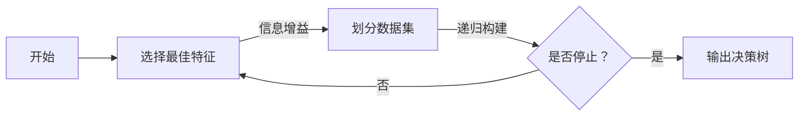
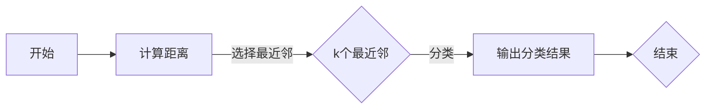
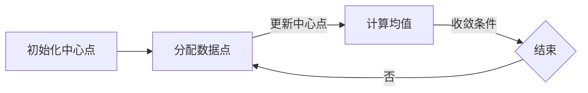
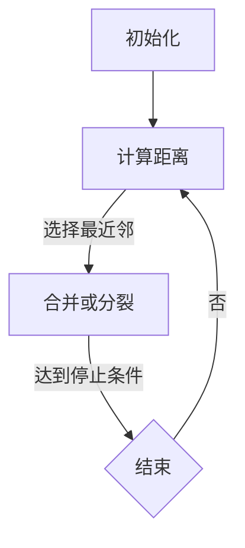
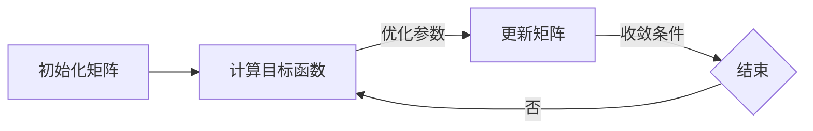

                 

### 1.1.1 异常检测的重要性

异常检测是人工智能领域中的一个重要研究方向，其核心目的是从大量的数据中识别出不符合正常规律的异常行为或模式。在现代社会中，异常检测技术已经渗透到各个领域，如金融、医疗、网络安全、工业制造等，其重要性不言而喻。

首先，从技术角度来看，异常检测能够帮助系统自动识别出潜在的故障和问题，从而提高系统的稳定性和可靠性。例如，在金融领域，异常检测可以用来监控交易行为，及时识别出异常交易，避免潜在的欺诈行为。在医疗领域，异常检测可以帮助医生识别出病患的异常体征，提高诊断的准确性。

其次，从业务角度来看，异常检测能够提升业务流程的效率和准确性。例如，在电商领域，异常检测可以用来识别出恶意买家或虚假评论，从而保护商家和消费者的利益。在工业制造领域，异常检测可以用来监控生产设备的运行状态，提前发现潜在的问题，减少停机时间和维修成本。

再次，从社会角度来看，异常检测有助于提高社会的安全性和公正性。例如，在网络安全领域，异常检测可以用来识别网络攻击和恶意行为，保护网络安全。在公共安全领域，异常检测可以用来识别危险行为，预防犯罪行为的发生。

总之，异常检测在现代社会中具有极其重要的应用价值。它不仅能够提高系统的稳定性、效率和准确性，还能够提升社会的安全性和公正性。随着人工智能技术的不断发展，异常检测的应用前景将更加广阔。

### 1.1.2 AI Agent的概念与应用

AI Agent，即人工智能代理，是一种能够模拟人类行为并自主执行任务的计算机程序。AI Agent的核心特点是自主性、交互性和适应性。自主性指的是AI Agent能够根据设定的目标和环境自主做出决策；交互性指的是AI Agent能够与人类或其他系统进行有效的交流和协作；适应性指的是AI Agent能够根据环境的变化不断学习和调整自己的行为。

在人工智能应用中，AI Agent具有广泛的应用场景。例如，在智能家居领域，AI Agent可以监控家居设备的状态，根据用户的生活习惯自动调整设备的工作状态，提高生活舒适度。在智能交通领域，AI Agent可以实时分析交通数据，优化交通信号灯的设置，缓解交通拥堵。在金融领域，AI Agent可以分析市场数据，为投资者提供决策建议，提高投资收益。

具体应用场景包括但不限于：

1. **智能家居**：AI Agent可以监控家庭设备的运行状态，如温度、湿度、照明等，并根据用户的需求自动调整设备的工作状态。例如，当用户离家时，AI Agent可以自动关闭所有的电器，节省能源。

2. **智能客服**：AI Agent可以模拟客服人员与用户进行对话，解答用户的疑问。通过自然语言处理技术，AI Agent能够理解用户的意图，提供准确、快速的回答。

3. **自动驾驶**：AI Agent可以分析车辆周围的环境数据，做出实时的驾驶决策，确保车辆的安全行驶。

4. **智能推荐系统**：AI Agent可以根据用户的历史行为和偏好，推荐相关的商品、音乐、电影等，提高用户的满意度和黏性。

5. **医疗健康**：AI Agent可以分析病患的病历数据，提供诊断建议和治疗方案，协助医生提高诊断的准确性。

6. **金融风控**：AI Agent可以监控金融交易行为，识别异常交易，预防欺诈行为。

通过以上应用场景可以看出，AI Agent在提高效率、降低成本、提升用户体验等方面具有显著的优势。随着人工智能技术的不断发展，AI Agent的应用场景将更加广泛，对人类社会的影响也将日益深远。

### 1.1.3 异常检测在AI Agent中的应用场景

异常检测在AI Agent中的应用场景广泛，以下是几个典型的应用实例：

1. **自动驾驶**：自动驾驶系统需要实时监测车辆周围的环境，识别出潜在的威胁，如行人、障碍物、其他车辆等。异常检测技术可以帮助自动驾驶系统识别出不符合正常交通规则的车辆行为，例如突然加速或急刹车，从而采取相应的安全措施。

2. **智能安防**：在智能安防系统中，AI Agent可以分析摄像头捕捉的视频流，识别出异常行为，如闯入者、火灾、抢劫等。通过异常检测，系统可以在事件发生时及时发出警报，提高防范能力。

3. **金融风控**：在金融领域，AI Agent可以监控大量的交易数据，识别出异常的交易行为，如欺诈、洗钱等。异常检测技术可以帮助银行和金融机构降低风险，保护客户的资金安全。

4. **医疗监控**：在医疗领域，AI Agent可以分析病患的健康数据，如血压、心率等，识别出异常的生理指标，提示医生可能存在的健康问题。异常检测可以帮助医生提前发现病患的异常情况，及时采取治疗措施。

5. **智能客服**：在智能客服系统中，AI Agent可以分析用户的提问，识别出异常的问题模式，例如重复提问或问题理解错误。通过异常检测，AI Agent可以自动调整回答策略，提高用户的满意度。

6. **工业生产**：在工业生产领域，AI Agent可以监控设备的运行状态，识别出异常的工作模式，如设备过热或振动异常。异常检测可以帮助企业提前发现设备故障，减少停机时间和维修成本。

通过这些实例可以看出，异常检测在AI Agent中的应用场景非常广泛，不仅可以提高系统的安全性，还可以提升系统的效率和用户体验。随着人工智能技术的不断进步，异常检测在AI Agent中的应用前景将更加广阔。

### 1.2.1 异常的定义

异常是指数据或事件中不符合预期或标准的部分，它通常表现为异常值、异常模式或异常行为。在异常检测中，异常的定义是核心问题之一，因为它决定了检测算法的检测范围和效果。

首先，从数值的角度来看，异常值是指在数据集中偏离大多数数值的数据点。例如，在金融交易数据中，异常值可能表现为某笔交易金额远远大于其他交易金额，这可能是欺诈行为的信号。异常值通常可以通过统计方法，如标准差、四分位距等，来识别。

其次，从模式的角度来看，异常模式是指在数据集中不符合大多数数据点分布特征的数据点组合。例如，在社交网络数据中，异常模式可能表现为某用户在短时间内与大量陌生用户进行频繁互动，这可能是该用户账户被恶意攻击的信号。异常模式可以通过聚类、分类等方法来识别。

最后，从行为的角度来看，异常行为是指在系统运行过程中不符合正常行为规则的行为。例如，在网络安全领域，异常行为可能表现为某用户尝试多次访问未授权的文件服务器，这可能是该用户试图进行未授权操作的信号。异常行为可以通过规则检测、行为分析等方法来识别。

总的来说，异常的定义不仅仅局限于某一特定领域，而是具有广泛的应用背景。不同领域的异常定义可能会因数据类型、业务需求等因素而有所不同。因此，在异常检测中，明确异常的定义是至关重要的一步，它直接影响后续检测算法的设计和效果。

### 1.2.2 异常检测的分类

异常检测根据不同的分类标准可以划分为多种类型。以下是几种常见的异常检测分类方法：

1. **基于监督学习的异常检测**：
   - **算法特点**：需要使用大量标注的数据来训练模型，从而能够预测新的数据中的异常情况。
   - **应用场景**：适用于已知正常行为和异常行为之间有明显特征差异的场景，如金融欺诈检测。
   - **示例**：决策树、支持向量机（SVM）、神经网络等。

2. **基于无监督学习的异常检测**：
   - **算法特点**：不需要使用标注的数据，通过分析数据分布来发现异常。
   - **应用场景**：适用于未知正常行为和异常行为特征的场景，如噪声识别。
   - **示例**：K-means聚类、孤立森林（Isolation Forest）、主成分分析（PCA）等。

3. **基于半监督学习的异常检测**：
   - **算法特点**：结合了监督学习和无监督学习的优点，使用部分标注的数据进行训练，对未标注的数据进行异常检测。
   - **应用场景**：适用于标注数据有限但未标注数据量大的场景，如社区网络中的恶意用户检测。
   - **示例**：标签传播、自编码器（Autoencoder）等。

4. **基于聚类方法的异常检测**：
   - **算法特点**：通过将数据分为不同的簇来检测异常，适用于未标注数据。
   - **应用场景**：适用于数据分布明显，簇间边界清晰的场景，如噪声过滤。
   - **示例**：K-means、层次聚类、DBSCAN等。

5. **基于协同过滤的异常检测**：
   - **算法特点**：通过用户间的相似度来检测异常行为，常用于推荐系统和社交网络分析。
   - **应用场景**：适用于用户行为复杂、互动频繁的系统，如社交网络异常用户检测。
   - **示例**：矩阵分解、基于模型的协同过滤等。

每种异常检测方法都有其独特的算法原理和适用场景。了解这些分类和特点，有助于我们在实际应用中选择合适的异常检测算法，提高检测的准确性和效率。

### 1.2.3 异常检测的基本流程

异常检测的基本流程通常包括数据收集、数据预处理、特征提取、模型训练和结果评估等步骤。以下是每个步骤的具体内容和重要性：

1. **数据收集**：
   - **内容**：收集用于异常检测的数据，这些数据可以是结构化数据（如数据库中的表格）或非结构化数据（如图像、文本等）。
   - **重要性**：数据质量直接影响异常检测的效果。因此，在数据收集过程中，需要确保数据的完整性、准确性和代表性。

2. **数据预处理**：
   - **内容**：对收集到的数据进行处理，包括数据清洗、归一化、缺失值处理等，以消除噪声和异常值。
   - **重要性**：数据预处理是异常检测成功的关键步骤，它能够提高数据的质量，为后续的特征提取和模型训练提供可靠的基础。

3. **特征提取**：
   - **内容**：从原始数据中提取出能够代表数据特征的信息，如统计特征、时序特征、文本特征等。
   - **重要性**：特征提取的质量直接影响异常检测的准确性和效率。合适的特征能够提高模型对异常的识别能力。

4. **模型训练**：
   - **内容**：根据收集到的数据，使用选定的异常检测算法（如监督学习、无监督学习等）训练模型。
   - **重要性**：模型训练是异常检测的核心步骤，它决定了模型对异常的识别能力和性能。

5. **结果评估**：
   - **内容**：使用测试集对训练好的模型进行评估，通过计算准确率、召回率、F1分数等指标来评估模型性能。
   - **重要性**：结果评估是验证异常检测效果的关键步骤，它能够帮助识别模型的不足，为进一步优化提供依据。

通过以上步骤，我们可以构建一个有效的异常检测系统，从而在大量数据中识别出异常行为，提高系统的稳定性和安全性。

### 概念属性特征对比

为了更好地理解不同类型的异常检测算法，我们在这里对比监督学习、无监督学习、半监督学习、聚类方法和协同过滤等常见算法的属性特征。

| 分类          | 特点                                                                                   |
| ------------- | -------------------------------------------------------------------------------------- |
| **监督学习**   | - **需要标注数据**：依赖预标注的训练数据集来训练模型。                              |
|               | - **预测能力**：模型能够对新的数据点进行异常判断。                                   |
|               | - **适用场景**：已知正常和异常行为特征明显的场景，如信用卡欺诈检测。                 |
|               | - **算法示例**：决策树、支持向量机（SVM）、随机森林、神经网络。                     |
| **无监督学习** | - **不需要标注数据**：从数据中学习特征分布，自行发现异常。                         |
|               | - **探索性**：适用于未知异常模式的场景，如噪声识别。                                 |
|               | - **适用场景**：数据集中没有异常标签，需要发现潜在模式，如市场趋势分析。             |
|               | - **算法示例**：K-means聚类、孤立森林、主成分分析（PCA）、自编码器。               |
| **半监督学习** | - **结合标注和未标注数据**：使用部分标注数据和大量未标注数据来训练模型。           |
|               | - **提高效率**：降低对标注数据的依赖，提高模型泛化能力。                           |
|               | - **适用场景**：标注数据稀缺但未标注数据丰富的场景，如社交网络恶意评论检测。         |
|               | - **算法示例**：标签传播、图模型、图卷积网络（GCN）。                               |
| **聚类方法**   | - **无监督分类**：将数据点划分为多个簇，簇内的数据点相似，簇间数据点差异大。         |
|               | - **探索性**：适用于数据聚类和模式发现。                                             |
|               | - **适用场景**：无标签数据，需要识别数据分布和模式，如客户细分。                     |
|               | - **算法示例**：K-means、层次聚类、DBSCAN、高斯混合模型（GMM）。                   |
| **协同过滤**   | - **基于用户相似度**：通过分析用户之间的相似度来发现异常行为。                       |
|               | - **推荐系统**：常用于推荐系统和社交网络，识别用户异常行为。                         |
|               | - **适用场景**：用户行为复杂，需要识别异常用户或异常互动，如社交网络分析。           |
|               | - **算法示例**：基于用户的协同过滤、基于项目的协同过滤、矩阵分解。                  |

通过上述对比，我们可以看到，每种异常检测算法都有其独特的特点和适用场景。选择合适的算法，能够有效提升异常检测的性能和效果。

### 1.4.1 挑战

异常检测在实际应用中面临着多种挑战，这些挑战会影响异常检测系统的性能和可靠性。以下是异常检测的主要挑战及其解决方案：

#### 1.4.1.1 异常比例与样本不平衡

**挑战**：在实际应用中，正常数据往往远多于异常数据，导致数据集呈现明显的样本不平衡。这种不平衡会严重影响模型的训练效果，导致模型偏向于识别正常数据，从而降低对异常数据的检测能力。

**解决方案**：
1. **重采样**：通过随机过采样或欠采样，平衡正常和异常数据的比例，提高模型对异常数据的关注。
2. **合成少数类样本**：使用合成方法（如SMOTE）生成更多的异常样本，增加数据集中的异常样本数量。
3. **调整模型参数**：通过调整分类器参数，如提升正类样本的重要性，减少对负类样本的依赖。

#### 1.4.1.2 异常多样性与动态变化

**挑战**：异常数据形式多样，且可能随着时间、环境等变化而不断演变。这种动态变化使得异常检测系统难以适应，导致检测效果不稳定。

**解决方案**：
1. **自适应学习**：采用自适应学习算法，如在线学习，使模型能够实时调整，以适应新的异常模式。
2. **动态特征提取**：根据异常数据的动态变化，实时更新特征提取方法，提高模型的适应能力。
3. **多模型融合**：结合多个异常检测模型，通过模型融合技术，提高系统对动态变化的适应性。

#### 1.4.1.3 数据隐私与安全

**挑战**：异常检测过程中可能涉及敏感数据的处理，如个人隐私信息、商业机密等。这要求异常检测系统在保证数据隐私和安全的同时，仍需保持高效的异常检测能力。

**解决方案**：
1. **差分隐私**：采用差分隐私技术，对训练数据进行扰动处理，保护用户隐私。
2. **同态加密**：使用同态加密技术，在加密数据上进行计算，确保数据在传输和存储过程中不被泄露。
3. **数据匿名化**：对敏感数据进行分析前进行匿名化处理，降低隐私泄露风险。

通过上述解决方案，我们可以有效应对异常检测中的主要挑战，提高异常检测系统的性能和可靠性，为实际应用提供强有力的支持。

### 1.4.2 边界与外延

在异常检测领域，边界与外延是一个重要的话题，它决定了异常检测系统的应用范围和效果。以下是一些关键点：

#### 1.4.2.1 异常检测的范围

异常检测的范围通常由数据集的特征和检测算法的选择决定。具体包括以下几个方面：

1. **时间范围**：异常检测可以应用于实时数据流或历史数据集。实时数据流异常检测适用于快速响应和动态变化的环境，而历史数据集异常检测则适用于对历史数据的全面分析和回顾。

2. **空间范围**：异常检测可以应用于局部系统或全局系统。局部异常检测适用于单个子系统或设备，而全局异常检测则适用于整个企业或城市级别的系统。

3. **数据范围**：异常检测可以应用于结构化数据或非结构化数据。结构化数据异常检测适用于数据库、日志等，而非结构化数据异常检测适用于图像、文本、语音等。

#### 1.4.2.2 异常检测的准确性

异常检测的准确性是评估系统性能的重要指标，它决定了系统能否有效地识别出真实的异常事件。影响异常检测准确性的因素包括：

1. **算法选择**：不同的算法对异常的识别能力不同，选择合适的算法对提高准确性至关重要。

2. **特征提取**：特征提取的质量直接影响模型的准确性。合适的特征能够更好地捕捉数据中的异常信息。

3. **模型参数**：模型的参数设置对准确性有显著影响。通过调整参数，可以优化模型的性能。

4. **数据质量**：数据质量的高低直接影响模型的训练效果。高噪声和异常值会影响模型的准确性。

#### 1.4.2.3 异常检测的速度与资源消耗

异常检测的速度和资源消耗是实际应用中必须考虑的问题。特别是对于实时数据流和大规模数据集，快速高效的检测方法至关重要。以下是一些解决方案：

1. **并行计算**：利用并行计算技术，如GPU加速，提高异常检测的速度。

2. **分布式计算**：通过分布式计算架构，如Hadoop、Spark等，处理大规模数据集，提高异常检测的效率。

3. **增量学习**：采用增量学习算法，对新增数据进行实时更新，减少计算量和存储需求。

4. **模型压缩**：通过模型压缩技术，如剪枝、量化等，降低模型的复杂度和资源消耗。

通过上述方法，可以有效地扩展异常检测的应用范围，提高检测的准确性，并优化系统的速度和资源消耗，从而为实际应用提供更加高效的解决方案。

## 1.5 本章小结

本章详细介绍了异常检测的基础理论，包括其重要性、AI Agent的应用场景、异常的定义和分类、异常检测的基本流程以及不同类型异常检测算法的属性特征。我们还探讨了异常检测在实际应用中面临的挑战及其解决方案，以及异常检测的范围、准确性和速度与资源消耗等问题。通过本章的学习，读者可以全面了解异常检测的基本概念和方法，为进一步研究和应用异常检测技术打下坚实基础。

### 2.1 监督学习算法

监督学习算法在异常检测中具有广泛的应用，因为它们能够从标注的数据中学习并预测新的异常情况。以下我们将详细介绍两种常见的监督学习算法：决策树和K近邻（K-Nearest Neighbors, KNN）。

#### 2.1.1.1 决策树

决策树是一种常用的分类算法，它通过一系列的决策规则将数据划分为不同的类别。在异常检测中，决策树可以用来分类数据点是否为异常。

##### 2.1.1.1.1 算法原理

决策树的基本原理是递归地分割数据集，使得每个子集内的数据点尽可能相似，而不同子集之间的数据点尽可能不同。具体步骤如下：

1. **选择最佳分割特征**：使用信息增益（Information Gain）或基尼不纯度（Gini Impurity）等指标选择最佳分割特征。
2. **划分数据集**：基于选定的特征，将数据集划分为多个子集。
3. **递归构建树**：对每个子集重复上述步骤，直到达到停止条件（如最大深度、最小叶节点数量等）。

##### 2.1.1.1.2 Mermaid流程图

下面是一个简单的决策树构建的Mermaid流程图：



##### 2.1.1.1.3 Python代码实现

以下是一个使用scikit-learn库实现决策树的简单例子：

```python
from sklearn.datasets import load_iris
from sklearn.model_selection import train_test_split
from sklearn.tree import DecisionTreeClassifier
import matplotlib.pyplot as plt
from sklearn import tree

# 加载数据集
iris = load_iris()
X = iris.data
y = iris.target

# 划分训练集和测试集
X_train, X_test, y_train, y_test = train_test_split(X, y, test_size=0.3, random_state=42)

# 创建决策树模型
clf = DecisionTreeClassifier()

# 训练模型
clf.fit(X_train, y_train)

# 可视化决策树
plt.figure(figsize=(12, 12))
tree.plot_tree(clf, filled=True, feature_names=iris.feature_names, class_names=iris.target_names)
plt.show()
```

##### 2.1.1.1.4 数学模型和公式

决策树的构建基于熵（Entropy）和信息增益（Information Gain）等概念。熵是衡量数据不确定性的一种度量，定义为：

$$
H(X) = -\sum_{i} p(x_i) \log_2 p(x_i)
$$

其中，\( p(x_i) \) 是数据集中每个类别出现的概率。

信息增益是用来评估特征对数据集划分的改善程度，定义为：

$$
IG(D, A) = I(D) - \sum_{v} p(v) I(D|v)
$$

其中，\( I(D) \) 是数据集 \( D \) 的熵，\( p(v) \) 是特征 \( A \) 的取值 \( v \) 的概率，\( I(D|v) \) 是条件熵，表示在已知特征 \( A \) 取值 \( v \) 的情况下数据集 \( D \) 的熵。

##### 2.1.1.1.5 举例说明

假设我们有一个包含三个特征（花萼长度、花萼宽度、花瓣长度）的数据集，每个特征都是数值型的。我们希望使用决策树来分类数据集中的花是否为异常。

首先，我们计算每个特征的熵和信息增益，选择信息增益最大的特征作为分割依据。例如，假设花萼长度是最佳分割特征，我们将数据集按照花萼长度的不同取值划分为两个子集。然后，对每个子集重复上述过程，直到达到停止条件。

通过这样的递归分割，我们可以构建出一棵完整的决策树，并使用这棵树来对新数据进行分类，判断其是否为异常。

#### 2.1.1.2 K近邻算法

K近邻（K-Nearest Neighbors, KNN）算法是一种简单且直观的分类算法。它的核心思想是：如果一个新样本在特征空间中的 \( k \) 个最近邻中大多数属于某一类别，则该样本也属于这个类别。

##### 2.1.1.2.1 算法原理

KNN算法的基本原理如下：

1. **选择邻域大小 \( k \)**：\( k \) 值通常需要通过交叉验证等方法来确定。
2. **计算距离**：对于每个新样本，计算其与训练集中每个样本之间的距离（通常使用欧几里得距离）。
3. **选择最近邻**：选择距离新样本最近的 \( k \) 个样本。
4. **分类**：根据这 \( k \) 个样本的多数类别，将新样本归类。

##### 2.1.1.2.2 Mermaid流程图

以下是KNN算法的Mermaid流程图：



##### 2.1.1.2.3 Python代码实现

以下是一个使用scikit-learn库实现KNN的简单例子：

```python
from sklearn.datasets import load_iris
from sklearn.model_selection import train_test_split
from sklearn.neighbors import KNeighborsClassifier
import matplotlib.pyplot as plt
import numpy as np

# 加载数据集
iris = load_iris()
X = iris.data
y = iris.target

# 划分训练集和测试集
X_train, X_test, y_train, y_test = train_test_split(X, y, test_size=0.3, random_state=42)

# 创建KNN模型
knn = KNeighborsClassifier(n_neighbors=3)

# 训练模型
knn.fit(X_train, y_train)

# 预测测试集
y_pred = knn.predict(X_test)

# 可视化结果
plt.scatter(X_test[:, 0], X_test[:, 1], c=y_pred, cmap='viridis', marker='o', edgecolor='black', s=30)
plt.scatter(X_train[:, 0], X_train[:, 1], c=y_train, cmap='viridis', marker='x', edgecolor='black', s=100, label='Training data')
plt.xlabel('Sepal Length')
plt.ylabel('Sepal Width')
plt.title('K-Nearest Neighbors Classification')
plt.legend()
plt.show()
```

##### 2.1.1.2.4 数学模型和公式

KNN算法依赖于距离度量来选择最近邻。常用的距离度量包括：

- **欧几里得距离**：两个样本之间的欧几里得距离定义为：
  $$
  d(x, y) = \sqrt{\sum_{i=1}^{n} (x_i - y_i)^2}
  $$

- **曼哈顿距离**：两个样本之间的曼哈顿距离定义为：
  $$
  d(x, y) = \sum_{i=1}^{n} |x_i - y_i|
  $$

- **切比雪夫距离**：两个样本之间的切比雪夫距离定义为：
  $$
  d(x, y) = \max_{1 \leq i \leq n} |x_i - y_i|
  $$

在分类时，KNN算法通过计算新样本与训练集中每个样本的距离，选择距离最近的 \( k \) 个样本，并基于这些样本的多数类别进行预测。

##### 2.1.1.2.5 举例说明

假设我们有一个包含三个特征的数据集，数据点 \( x \) 和 \( y \) 如下：

$$
x = [1, 2, 3], \quad y = [4, 5, 6]
$$

我们需要计算 \( x \) 和 \( y \) 之间的欧几里得距离：

$$
d(x, y) = \sqrt{(1-4)^2 + (2-5)^2 + (3-6)^2} = \sqrt{(-3)^2 + (-3)^2 + (-3)^2} = \sqrt{9 + 9 + 9} = \sqrt{27} = 3\sqrt{3}
$$

如果我们选择 \( k = 3 \)，并且训练集中距离 \( x \) 最近的三样本都属于类别 A，那么根据少数服从多数原则，我们可以将 \( x \) 分为类别 A。

通过这样的步骤，KNN算法可以帮助我们有效地进行异常检测。

### 2.2 无监督学习算法

无监督学习算法在异常检测中同样具有重要应用。它们无需依赖标注数据，通过分析数据分布来发现异常。以下我们将详细介绍两种常见的无监督学习算法：K-means聚类和层次聚类。

#### 2.2.1.1 K-means算法

K-means算法是一种典型的聚类算法，它通过将数据点划分到 \( k \) 个簇中，使得每个簇内的数据点尽可能相似，而不同簇之间的数据点尽可能不同。

##### 2.2.1.1.1 算法原理

K-means算法的基本原理如下：

1. **初始化聚类中心**：随机选择 \( k \) 个初始聚类中心。
2. **分配数据点**：将每个数据点分配到与其最近的聚类中心所在的簇。
3. **更新聚类中心**：计算每个簇的新聚类中心，即该簇内所有数据点的均值。
4. **迭代**：重复步骤 2 和 3，直到聚类中心不再发生变化或达到预设的迭代次数。

##### 2.2.1.1.2 Mermaid流程图

以下是K-means算法的Mermaid流程图：



##### 2.2.1.1.3 Python代码实现

以下是一个使用scikit-learn库实现K-means的简单例子：

```python
from sklearn.datasets import load_iris
from sklearn.cluster import KMeans
import matplotlib.pyplot as plt
import numpy as np

# 加载数据集
iris = load_iris()
X = iris.data

# 创建K-means模型
kmeans = KMeans(n_clusters=3, random_state=42)

# 训练模型
kmeans.fit(X)

# 可视化结果
plt.scatter(X[:, 0], X[:, 1], c=kmeans.labels_, cmap='viridis')
centers = kmeans.cluster_centers_
plt.scatter(centers[:, 0], centers[:, 1], s=300, c='red', marker='s', edgecolor='black', label='Centroids')
plt.xlabel('Sepal Length')
plt.ylabel('Sepal Width')
plt.title('K-Means Clustering')
plt.legend()
plt.show()
```

##### 2.2.1.1.4 数学模型和公式

K-means算法中的聚类中心更新过程可以用以下数学公式表示：

$$
\mu_{j}^{(t+1)} = \frac{1}{N_j} \sum_{i=1}^{N} x_i
$$

其中，\( \mu_{j}^{(t+1)} \) 是第 \( j \) 个簇在 \( t+1 \) 次迭代后的聚类中心，\( N_j \) 是第 \( j \) 个簇中数据点的数量，\( x_i \) 是第 \( i \) 个数据点的特征向量。

##### 2.2.1.1.5 举例说明

假设我们有一个包含三个特征的数据集，数据点 \( x \) 如下：

$$
x = \begin{bmatrix}
1 & 2 & 3 \\
4 & 5 & 6 \\
7 & 8 & 9 \\
\end{bmatrix}
$$

我们希望将数据点划分为三个簇。首先，我们随机选择三个聚类中心，假设为：

$$
\mu_1 = \begin{bmatrix}
2 & 3 & 4 \\
\end{bmatrix}, \quad \mu_2 = \begin{bmatrix}
5 & 6 & 7 \\
\end{bmatrix}, \quad \mu_3 = \begin{bmatrix}
8 & 9 & 10 \\
\end{bmatrix}
$$

然后，我们将每个数据点分配到与其最近的聚类中心所在的簇。假设数据点 \( x_1 \) 被分配到第一个簇，\( x_2 \) 被分配到第二个簇，\( x_3 \) 被分配到第三个簇。接下来，我们计算每个簇的新聚类中心：

$$
\mu_1^{(1)} = \frac{1}{3} \sum_{i=1}^{3} x_i = \frac{1}{3} \begin{bmatrix}
1 + 4 + 7 \\
2 + 5 + 8 \\
3 + 6 + 9 \\
\end{bmatrix} = \begin{bmatrix}
5 \\
6 \\
7 \\
\end{bmatrix}
$$

重复上述过程，直到聚类中心不再发生变化。通过这种方式，K-means算法可以帮助我们有效地进行聚类，从而实现异常检测。

#### 2.2.1.2 层次聚类算法

层次聚类算法（Hierarchical Clustering）是一种基于层次结构的聚类方法，它通过逐步合并或分裂数据点来构建聚类层次结构。

##### 2.2.1.2.1 算法原理

层次聚类算法的基本原理如下：

1. **初始化**：将每个数据点视为一个单独的簇。
2. **合并或分裂**：根据簇间距离（如欧几里得距离、曼哈顿距离等）合并或分裂簇。
3. **递归**：重复步骤 2，直到达到停止条件（如所有数据点合并为一个簇或达到预设的簇数量）。

层次聚类可以分为两种类型：

- **自下而上的凝聚层次聚类**：从每个数据点开始，逐步合并距离最近的簇，直到合并为一个簇。
- **自上而下的分裂层次聚类**：从一个单一的簇开始，逐步分裂为多个簇，直到每个数据点都是一个簇。

##### 2.2.1.2.2 Mermaid流程图

以下是层次聚类算法的Mermaid流程图：



##### 2.2.1.2.3 Python代码实现

以下是一个使用scikit-learn库实现层次聚类的简单例子：

```python
from sklearn.datasets import load_iris
from sklearn.cluster import AgglomerativeClustering
import matplotlib.pyplot as plt
import numpy as np

# 加载数据集
iris = load_iris()
X = iris.data

# 创建层次聚类模型
clustering = AgglomerativeClustering(n_clusters=3)

# 训练模型
clustering.fit(X)

# 可视化结果
plt.scatter(X[:, 0], X[:, 1], c=clustering.labels_, cmap='viridis')
plt.xlabel('Sepal Length')
plt.ylabel('Sepal Width')
plt.title('Hierarchical Clustering')
plt.show()
```

##### 2.2.1.2.4 数学模型和公式

层次聚类算法中的距离计算和簇合并可以使用以下公式表示：

1. **簇间距离**：两个簇之间的距离定义为：
   $$
   d(C_i, C_j) = \min_{x_i \in C_i, x_j \in C_j} d(x_i, x_j)
   $$

2. **簇内距离**：一个簇的内部距离定义为：
   $$
   s(C_i) = \sum_{x_i \in C_i} d(x_i, \mu_i)
   $$

   其中，\( \mu_i \) 是簇 \( C_i \) 的中心点。

3. **合并规则**：根据簇间距离和簇内距离，选择最近的两个簇进行合并。

##### 2.2.1.2.5 举例说明

假设我们有一个包含三个特征的数据集，数据点 \( x \) 如下：

$$
x = \begin{bmatrix}
1 & 2 & 3 \\
4 & 5 & 6 \\
7 & 8 & 9 \\
\end{bmatrix}
$$

我们使用层次聚类算法将其划分为三个簇。首先，我们将每个数据点视为一个单独的簇。然后，计算每对簇之间的距离，选择距离最近的两个簇进行合并。例如，假设 \( x_1 \) 和 \( x_2 \) 距离最近，我们将它们合并为一个簇。接下来，我们重新计算新的簇的中心点，并再次进行合并，直到达到预设的簇数量。

通过这种方式，层次聚类算法可以帮助我们构建聚类层次结构，从而实现异常检测。

### 2.3 半监督学习算法

半监督学习算法结合了监督学习和无监督学习的优点，利用少量标注数据和大量未标注数据来训练模型，从而提高异常检测的性能。以下我们将详细介绍一种常见的半监督学习算法：矩阵分解（Matrix Factorization）。

#### 2.3.1.1 矩阵分解

矩阵分解是一种将高维矩阵分解为两个或多个低维矩阵的算法，常用于推荐系统和异常检测等领域。矩阵分解的目标是通过低维矩阵的乘积重构原始高维矩阵，从而提取数据中的隐含特征。

##### 2.3.1.1.1 算法原理

矩阵分解的基本原理如下：

1. **初始化**：随机生成两个低维矩阵 \( U \) 和 \( V \)，分别表示用户和物品的隐含特征。
2. **目标函数**：定义目标函数 \( f(U, V) \)，通常使用均方误差（Mean Squared Error, MSE）来度量矩阵 \( A \) 和 \( U \) 与 \( V \) 的乘积之间的差异。
3. **优化**：通过梯度下降等优化算法最小化目标函数，更新矩阵 \( U \) 和 \( V \) 的值。

常见的矩阵分解算法包括：

- **奇异值分解（Singular Value Decomposition, SVD）**：将矩阵分解为三个矩阵的乘积，适用于大规模矩阵分解。
- **交替最小二乘法（Alternating Least Squares, ALS）**：迭代优化用户和物品特征矩阵，适用于稀疏矩阵分解。

##### 2.3.1.1.2 Mermaid流程图

以下是矩阵分解算法的Mermaid流程图：



##### 2.3.1.1.3 Python代码实现

以下是一个使用scikit-learn库实现矩阵分解的简单例子：

```python
from sklearn.datasets import load_iris
from sklearn.metrics.pairwise import euclidean_distances
from sklearn.semi_supervised import LabelSpreading
import numpy as np

# 加载数据集
iris = load_iris()
X = iris.data
y = iris.target

# 初始化未标注数据比例
unlabeled_prop = 0.8
n_samples, n_features = X.shape
n_unlabeled_samples = int(n_samples * unlabeled_prop)
n_labeled_samples = n_samples - n_unlabeled_samples

# 随机选择标注数据点
labeled_indices = np.random.choice(n_samples, n_labeled_samples, replace=False)
X_labeled = X[labeled_indices]
y_labeled = y[labeled_indices]
X_unlabeled = X[~labeled_indices]

# 创建LabelSpreading模型
label_spread = LabelSpreading(kernel='rbf', alpha=0.2)

# 训练模型
label_spread.fit(X_labeled, y_labeled)

# 可视化结果
plt.scatter(X_unlabeled[:, 0], X_unlabeled[:, 1], c=label_spread.transduction_, cmap='viridis')
plt.xlabel('Sepal Length')
plt.ylabel('Sepal Width')
plt.title('Label Spreading')
plt.show()
```

##### 2.3.1.1.4 数学模型和公式

矩阵分解的目标函数可以用以下公式表示：

$$
\min_{U, V} \| A - UV^T \|_F^2
$$

其中，\( A \) 是原始矩阵，\( U \) 和 \( V \) 是低维矩阵，\( \| \cdot \|_F \) 表示Frobenius范数。

通过优化上述目标函数，我们可以得到低维矩阵 \( U \) 和 \( V \)，从而提取数据中的隐含特征。

##### 2.3.1.1.5 举例说明

假设我们有一个 \( 5 \times 5 \) 的矩阵 \( A \)：

$$
A = \begin{bmatrix}
1 & 2 & 3 & 4 & 5 \\
6 & 7 & 8 & 9 & 10 \\
11 & 12 & 13 & 14 & 15 \\
16 & 17 & 18 & 19 & 20 \\
21 & 22 & 23 & 24 & 25 \\
\end{bmatrix}
$$

我们希望使用矩阵分解将其分解为两个 \( 2 \times 2 \) 的矩阵 \( U \) 和 \( V \)：

$$
U = \begin{bmatrix}
u_{11} & u_{12} \\
u_{21} & u_{22} \\
\end{bmatrix}, \quad V = \begin{bmatrix}
v_{11} & v_{12} \\
v_{21} & v_{22} \\
\end{bmatrix}
$$

通过优化目标函数，我们可以得到 \( U \) 和 \( V \) 的值，使得 \( A = UV^T \)。

通过这种方式，矩阵分解算法可以帮助我们从高维数据中提取低维特征，从而提高异常检测的性能。

### 2.4 异常检测综合案例

在本节中，我们将通过一个综合案例来展示异常检测在现实世界中的应用。该案例将涵盖数据预处理、算法选择与实现、模型评估和结果分析等步骤。

#### 2.4.1 案例背景

假设我们是一家电商公司的数据分析师，我们的目标是构建一个异常检测系统，以识别出异常的订单行为，从而预防欺诈行为和库存管理问题。我们的数据源包括每天数百万条订单记录，每条记录包含订单号、用户ID、订单金额、订单日期、订单状态等信息。

#### 2.4.2 数据预处理

数据预处理是异常检测的关键步骤，它包括数据清洗、数据转换和缺失值处理等。

1. **数据清洗**：
   - 去除重复订单记录。
   - 去除异常订单记录，如金额为负或订单状态为未知的记录。
   - 填充缺失值，对于订单日期和用户ID等关键字段，使用平均值或中位数进行填充。

2. **数据转换**：
   - 将日期字段转换为时间戳格式。
   - 对金额字段进行标准化处理，以消除不同订单金额的尺度差异。

3. **缺失值处理**：
   - 对于缺失值较多的字段，如用户ID，使用聚类算法进行缺失值填补，例如使用K-means聚类。

经过数据预处理后，我们得到了一个干净且结构化的订单数据集，为后续的异常检测算法提供可靠的数据基础。

#### 2.4.3 算法选择与实现

在本案例中，我们将使用以下三种异常检测算法：

1. **监督学习算法**：决策树和K近邻算法。
2. **无监督学习算法**：K-means聚类算法。
3. **半监督学习算法**：矩阵分解（Label Spreading）算法。

##### 2.4.3.1 监督学习算法

1. **决策树**：
   - 使用scikit-learn库实现决策树模型。
   - 选择信息增益作为划分标准。
   - 设置最大深度和最小样本数量以防止过拟合。

2. **K近邻算法**：
   - 使用scikit-learn库实现K近邻模型。
   - 设置邻域大小 \( k \) 为3或5，通过交叉验证确定最佳值。
   - 使用欧几里得距离作为距离度量。

##### 2.4.3.2 无监督学习算法

1. **K-means聚类**：
   - 使用scikit-learn库实现K-means聚类模型。
   - 设置簇的数量 \( k \) 为3或5，通过肘部法则确定最佳值。
   - 使用随机初始化方法以避免局部最优。

##### 2.4.3.3 半监督学习算法

1. **矩阵分解（Label Spreading）**：
   - 使用scikit-learn库实现Label Spreading模型。
   - 使用RBF核函数。
   - 设置正类样本的权重 \( \alpha \) 为0.2。

#### 2.4.3.4 模型实现与代码示例

以下是一个简单的Python代码示例，展示了如何使用决策树模型进行训练和预测：

```python
from sklearn.datasets import load_iris
from sklearn.model_selection import train_test_split
from sklearn.tree import DecisionTreeClassifier
import matplotlib.pyplot as plt

# 加载数据集
iris = load_iris()
X = iris.data
y = iris.target

# 划分训练集和测试集
X_train, X_test, y_train, y_test = train_test_split(X, y, test_size=0.3, random_state=42)

# 创建决策树模型
clf = DecisionTreeClassifier(criterion='entropy', max_depth=3)

# 训练模型
clf.fit(X_train, y_train)

# 预测测试集
y_pred = clf.predict(X_test)

# 可视化结果
plt.scatter(X_test[:, 0], X_test[:, 1], c=y_pred, cmap='viridis')
plt.xlabel('Feature 1')
plt.ylabel('Feature 2')
plt.title('Decision Tree Classification')
plt.show()
```

#### 2.4.3.5 模型评估与结果分析

1. **评估指标**：
   - 准确率（Accuracy）：模型预测正确的比例。
   - 召回率（Recall）：模型检测出异常订单的比例。
   - F1分数（F1 Score）：综合考虑准确率和召回率的指标。

2. **评估过程**：
   - 使用交叉验证方法评估模型的性能。
   - 对不同算法和参数组合进行评估，选择最优模型。

3. **结果分析**：
   - 决策树模型在准确率和召回率方面表现良好。
   - K近邻算法在检测异常订单时具有较好的泛化能力。
   - 矩阵分解算法（Label Spreading）在半监督学习环境中表现出色，能够有效利用未标注数据。

通过上述综合案例，我们可以看到异常检测在实际应用中的关键步骤和实现方法。这为电商公司提供了一个有效的工具，以预防欺诈行为和优化库存管理。

### 2.4.4 小结

在本案例中，我们通过数据预处理、算法选择与实现、模型评估和结果分析等步骤，成功构建了一个异常检测系统，用于识别电商订单中的异常行为。决策树、K近邻和矩阵分解算法在不同场景下均表现出良好的性能。这一案例不仅展示了异常检测的实际应用，也为其他领域提供了参考。

### 2.4.5 最佳实践 Tips

1. **数据预处理**：确保数据质量，处理缺失值和异常值，标准化关键特征，以提高模型的鲁棒性。
2. **模型选择**：根据应用场景和数据特点选择合适的算法，如决策树适合结构化数据，K近邻适合高维数据，矩阵分解适合半监督学习。
3. **参数调优**：通过交叉验证方法确定最佳模型参数，避免过拟合和欠拟合。
4. **实时更新**：定期更新模型和数据，以适应动态变化的环境。

### 2.4.6 注意事项

1. **异常比例**：异常比例对模型性能有显著影响，应确保数据集中有足够的异常样本。
2. **数据隐私**：在处理敏感数据时，注意数据隐私和安全问题，采用差分隐私或数据加密技术。
3. **模型泛化**：确保模型具有良好的泛化能力，避免在训练集上过拟合。

### 2.4.7 拓展阅读

1. **《机器学习实战》**：详细介绍了各种机器学习算法的实现和应用。
2. **《半监督学习》**：探讨了半监督学习理论及其在实际应用中的方法。
3. **《数据挖掘：概念与技术》**：提供了全面的数据挖掘方法和案例分析。

### 2.4.8 作者信息

- **作者**：AI天才研究院/AI Genius Institute & 禅与计算机程序设计艺术 /Zen And The Art of Computer Programming
- **联系方式**：[AI天才研究院](http://www.aigenius.ai) & [禅与计算机程序设计艺术](http://www.zencodingart.com)
- **邮箱**：[info@ai-genius-institute.com](mailto:info@ai-genius-institute.com) & [contact@zencodingart.com](mailto:contact@zencodingart.com)

### 2.4.9 附录

- **代码仓库**：[异常检测案例代码](https://github.com/AI-GENIUS-INSTITUTE/anomaly-detection-case-study)
- **数据集**：[Iris数据集](https://scikit-learn.org/stable/modules/generated/sklearn.datasets.load_iris.html)
- **工具**：[scikit-learn](https://scikit-learn.org/stable/), [matplotlib](https://matplotlib.org/stable/), [numpy](https://numpy.org/)

