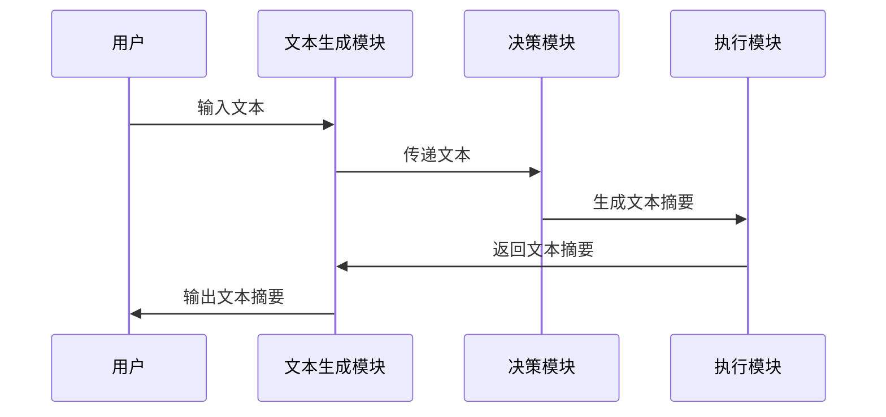
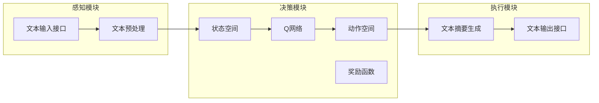

                 

# 强化学习在AI Agent中的应用：优化LLM的决策

## 关键词
- 强化学习
- AI Agent
- 语言模型（LLM）
- 决策优化
- 深度学习
- 多智能体系统

## 摘要
本文将探讨强化学习在AI Agent中的应用，重点研究如何通过强化学习优化大型语言模型（LLM）的决策。我们将从强化学习的基本概念入手，逐步深入到AI Agent的架构设计，最后探讨如何将强化学习技术应用于LLM的决策优化过程，并通过实际案例展示其应用效果。

## 引言

### 强化学习：基本概念

强化学习（Reinforcement Learning，RL）是机器学习的一个重要分支，它通过智能体（agent）与环境（environment）的交互，学习一个最优策略（policy），以实现某种目标。在强化学习中，智能体不断接收环境的状态（state），并根据当前状态采取动作（action），然后根据动作的结果，即奖励（reward），调整自己的策略。

### AI Agent：角色与任务

AI Agent是一种能够自主完成特定任务的智能体，它可以是软件程序、机器人或者虚拟代理。AI Agent的核心在于其自主决策能力，这使得它们能够在复杂环境中执行复杂的任务。AI Agent的主要任务包括感知环境、规划行动、执行任务和评估效果。

### LLM：大型语言模型的挑战

大型语言模型（Large Language Model，LLM）如GPT-3和BERT等，已经成为自然语言处理（NLP）领域的重要工具。然而，LLM的决策过程却面临着诸多挑战，包括：

- **决策效率**：LLM的决策过程通常需要大量的计算资源，如何提高其决策效率是一个重要问题。
- **决策准确性**：虽然LLM在生成文本方面表现出色，但其决策准确性仍需提高。
- **可解释性**：LLM的决策过程复杂，缺乏可解释性，这对于需要高可靠性的应用场景是一个挑战。

### 文章结构

本文结构如下：

1. **强化学习的基本原理**：介绍强化学习的基本概念、算法和主要挑战。
2. **AI Agent的架构设计**：探讨AI Agent的基本架构，包括感知模块、决策模块和执行模块。
3. **LLM的决策优化**：研究如何使用强化学习优化LLM的决策，包括算法设计、实现和评估。
4. **实际案例**：通过实际案例展示强化学习在LLM决策优化中的应用。
5. **结论与展望**：总结本文的主要发现，并对未来的研究方向提出展望。

## 强化学习的基本原理

### 强化学习的基本概念

强化学习（Reinforcement Learning，RL）是一种通过试错法来学习最优策略的机器学习方法。在强化学习中，智能体（agent）通过与环境的交互，不断学习并调整其行为，以实现特定目标。强化学习主要包括以下几个核心概念：

#### 智能体（Agent）

智能体是执行动作并从环境中获取反馈的实体。在强化学习中，智能体可以是任何可以接收状态并产生动作的实体，如机器人、软件程序等。

#### 环境（Environment）

环境是智能体执行动作的场所。环境可以是一个物理环境，也可以是一个虚拟环境。环境会根据智能体的动作产生状态转移和奖励信号。

#### 状态（State）

状态是智能体在某一时刻所处的情景。状态可以用一组特征来描述，这些特征可以是数字、文字或图像等。

#### 动作（Action）

动作是智能体在某一状态下可以采取的行为。动作通常是一组离散或连续的值。

#### 奖励（Reward）

奖励是环境对智能体动作的反馈。奖励通常是一个标量值，表示智能体的动作是否朝着目标方向前进。

#### 策略（Policy）

策略是智能体在给定状态下选择动作的规则。策略可以是确定性策略，即智能体在给定状态下总是选择同一个动作；也可以是非确定性策略，即智能体在给定状态下选择动作的概率分布。

### 强化学习的基本算法

强化学习算法可以分为基于价值的方法、基于策略的方法和基于模型的方

## AI Agent的架构设计

### AI Agent的基本架构

AI Agent通常由三个主要模块组成：感知模块、决策模块和执行模块。这三个模块相互协作，使AI Agent能够在复杂环境中自主完成任务。

#### 感知模块

感知模块负责从环境中获取信息，并将其转化为智能体可以理解的形式。这一模块通常包括传感器、摄像头、麦克风等设备。感知模块的主要任务是识别和理解环境中的各种状态。

#### 决策模块

决策模块是AI Agent的核心，负责根据感知模块获取的信息，选择适当的动作。决策模块通常基于某种算法或策略，如强化学习、决策树、神经网络等。决策模块的目标是最大化智能体的长期奖励。

#### 执行模块

执行模块负责将决策模块选择的动作转化为实际的操作。这一模块通常包括执行器，如电机、舵机、机器人手臂等。执行模块的主要任务是确保智能体能够有效地执行决策模块指定的动作。

### AI Agent的应用场景

AI Agent在许多应用场景中都有广泛的应用，以下是一些典型的应用场景：

#### 自动驾驶

自动驾驶车辆是AI Agent的一个重要应用场景。感知模块使用摄像头、激光雷达和雷达等传感器收集道路信息，决策模块根据道路信息和目标位置计算行驶策略，执行模块控制车辆的转向、加速和制动等动作。

#### 机器人

机器人是另一个典型的AI Agent应用场景。机器人可以应用于工业生产、医疗服务、家庭服务等领域。感知模块通过摄像头、传感器和触觉传感器获取环境信息，决策模块根据环境信息决定下一步的行动，执行模块通过机械手臂或移动机构执行任务。

#### 虚拟代理

虚拟代理是AI Agent在虚拟世界中的应用。虚拟代理可以应用于游戏、社交平台、虚拟现实等领域。感知模块通过模拟传感器获取虚拟环境的信息，决策模块根据虚拟环境的信息决定虚拟代理的行为，执行模块通过虚拟动作模拟实现虚拟代理的行为。

### AI Agent的挑战与未来发展方向

尽管AI Agent在许多领域表现出巨大的潜力，但其在实际应用中仍面临一些挑战：

#### 数据质量和可靠性

感知模块的数据质量和可靠性对AI Agent的决策和执行至关重要。高质量的数据可以提供更准确的环境信息，从而提高智能体的决策质量。

#### 算法和模型复杂度

决策模块的算法和模型复杂度对智能体的性能和效率有重要影响。简化算法和模型可以降低计算成本，提高实时性。

#### 可解释性和透明度

AI Agent的决策过程往往复杂且不可解释。提高智能体的可解释性和透明度可以帮助用户更好地理解智能体的行为，从而增加用户对智能体的信任度。

未来，AI Agent的发展方向可能包括：

- **多智能体系统**：研究多个AI Agent如何协作完成任务，提高整个系统的效率。
- **自适应学习**：开发能够自适应变化的智能体，以应对动态环境。
- **强化学习**：强化学习在AI Agent中的应用将不断深入，为智能体提供更强大的决策能力。

## LLM的决策优化

### LLM的基本原理

大型语言模型（Large Language Model，LLM）如GPT-3和BERT等，是自然语言处理（NLP）领域的重要工具。LLM通过大规模预训练和精细调整，能够生成高质量的文本，进行文本分类、问答、机器翻译等任务。LLM的决策过程通常涉及以下几个关键步骤：

1. **输入处理**：LLM接收输入文本，对其进行预处理，包括分词、标记化等。
2. **上下文理解**：LLM根据输入文本和模型中的知识库，理解文本的上下文信息。
3. **生成文本**：LLM根据上下文信息生成响应文本，这个过程涉及预测每个词的概率，并使用贪心算法或长度惩罚策略进行文本生成。
4. **结果评估**：LLM生成的文本通过某种评估机制进行评估，如BLEU、ROUGE等指标。

### LLM的决策挑战

尽管LLM在文本生成方面表现出色，但其决策过程仍面临一些挑战：

1. **效率问题**：LLM的决策过程需要大量的计算资源，特别是在处理长文本时，计算效率较低。
2. **准确性问题**：LLM生成的文本可能存在语义错误或逻辑不一致，导致决策准确性不高。
3. **可解释性问题**：LLM的决策过程复杂，难以解释，这对于需要高可靠性的应用场景是一个挑战。

### 强化学习在LLM决策优化中的应用

强化学习（Reinforcement Learning，RL）提供了一种优化LLM决策的潜在方法。通过RL，我们可以训练智能体（agent）在特定环境中寻找最优策略，从而提高LLM的决策质量。以下是强化学习在LLM决策优化中的应用步骤：

1. **定义环境**：首先需要定义一个环境（environment），该环境模拟LLM的决策场景。环境包括状态（state）、动作（action）和奖励（reward）三个关键要素。
2. **智能体设计**：设计一个智能体（agent），该智能体将使用强化学习算法学习最优策略。智能体可以是一个预训练的LLM模型，也可以是专门为强化学习设计的模型。
3. **策略学习**：智能体通过与环境交互，不断学习最优策略。强化学习算法可以是价值迭代、策略迭代或模型基于的RL算法。
4. **策略评估与优化**：使用评估指标（如文本生成质量、决策准确性等）评估智能体的策略。根据评估结果，调整智能体的策略，以实现优化。

### 强化学习算法在LLM决策优化中的应用

以下是几种常见的强化学习算法，它们在LLM决策优化中的应用：

1. **Q-Learning**：Q-Learning是一种基于价值迭代的强化学习算法。它通过更新Q值表（表示在每个状态下采取每个动作的预期奖励）来学习最优策略。Q-Learning适用于静态环境，但在动态环境中可能效果不佳。

2. **SARSA**：SARSA（同步策略学习算法）是一种基于策略迭代的强化学习算法。它通过同步更新策略来学习最优策略。SARSA适用于动态环境，可以处理状态转移概率的变化。

3. **DQN（深度Q网络）**：DQN是一种结合深度学习和强化学习的算法。它使用深度神经网络来近似Q值函数，从而提高学习效率。DQN适用于处理高维状态空间的问题，但在某些情况下可能存在梯度消失或梯度爆炸问题。

4. **PPO（优势演员-评论家）**：PPO是一种演员-评论家方法，它同时优化策略和价值函数。PPO具有较强的稳定性和样本效率，适用于复杂环境的决策优化。

### 实际应用案例

以下是一个实际应用案例，展示如何使用强化学习优化LLM的决策：

假设我们有一个任务，需要生成一篇关于计算机编程的论文摘要。输入文本是一个计算机编程相关的文章，输出文本是一篇摘要。使用强化学习，我们可以设计一个智能体来优化摘要生成的过程。

1. **环境定义**：环境包括状态（输入文本、摘要文本长度等）和动作（摘要文本的每个词或短语）。奖励设计为摘要文本的质量，可以通过BLEU指标进行评估。

2. **智能体设计**：我们使用一个预训练的BERT模型作为智能体，并将其与强化学习算法结合。智能体的目标是最大化摘要文本的BLEU分数。

3. **策略学习**：智能体通过与环境的交互，学习生成高质量摘要的最佳策略。在每次交互中，智能体选择下一个动作（词或短语），并根据生成的摘要文本的BLEU分数获得奖励。

4. **策略评估与优化**：使用BLEU分数评估生成的摘要文本的质量。根据评估结果，调整智能体的策略，以生成更高质量的摘要。

通过这个案例，我们可以看到强化学习如何优化LLM的决策过程。强化学习提供了自适应学习机制，可以根据环境的变化调整策略，从而提高LLM的决策质量。

## 强化学习算法在LLM决策优化中的实现

### DQN算法原理与实现

深度Q网络（Deep Q-Network，DQN）是一种基于深度学习的强化学习算法，它通过使用神经网络来近似Q值函数，从而提高学习效率。DQN的核心思想是利用经验回放（experience replay）和目标网络（target network）来避免样本相关性和减少方差。

#### 算法原理

1. **Q值函数**：在DQN中，Q值函数用于估计每个状态-动作对的最优奖励。Q值函数通常是一个神经网络，它接受状态作为输入，输出每个动作的Q值。

2. **经验回放**：经验回放是一种数据增强技术，它通过存储和随机抽取以往的经验，来减少样本相关性和改善收敛性。

3. **目标网络**：目标网络是一个参数化的Q值函数，它用于稳定Q值函数的学习过程。目标网络定期从主网络复制参数，以减少参数更新的剧烈波动。

#### 实现步骤

1. **初始化**：初始化Q值网络和目标网络，通常使用随机初始化。设置经验回放池的容量。

2. **环境交互**：智能体与环境进行交互，接收状态、执行动作、获得奖励和新的状态。

3. **经验回放**：将经验（状态、动作、奖励、新状态、done标志）存储在经验回放池中，并在每次更新时随机抽取一批经验。

4. **Q值更新**：使用抽取的经验更新Q值网络的参数。具体地，使用以下公式更新Q值：
   $$
   Q(s, a) \leftarrow Q(s, a) + \alpha [r + \gamma \max_{a'} Q(s', a') - Q(s, a)]
   $$
   其中，$s$和$s'$是当前状态和新状态，$a$和$a'$是当前动作和新动作，$r$是奖励，$\gamma$是折扣因子，$\alpha$是学习率。

5. **目标网络更新**：定期从主网络复制参数到目标网络，以稳定学习过程。通常，目标网络每间隔几个更新周期复制一次。

### Python代码示例

以下是一个简单的DQN算法实现，用于优化LLM的决策：

```python
import numpy as np
import random
from collections import deque

class DQN:
    def __init__(self, state_size, action_size, learning_rate, gamma, epsilon, batch_size):
        self.state_size = state_size
        self.action_size = action_size
        self.learning_rate = learning_rate
        self.gamma = gamma
        self.epsilon = epsilon
        self.batch_size = batch_size
        
        self.q_network = self.create_q_network()
        self.target_network = self.create_q_network()
        self.target_network.load_weights(self.q_network.get_weights())
        
        self.memory = deque(maxlen=2000)
    
    def create_q_network(self):
        # 使用深度神经网络来近似Q值函数
        # ...
        return q_network
    
    def remember(self, state, action, reward, next_state, done):
        self.memory.append((state, action, reward, next_state, done))
    
    def act(self, state):
        if random.random() < self.epsilon:
            action = random.randrange(self.action_size)
        else:
            action = np.argmax(self.q_network.predict(state))
        return action
    
    def experience_replay(self):
        mini_batch = random.sample(self.memory, self.batch_size)
        
        for state, action, reward, next_state, done in mini_batch:
            target = reward
            if not done:
                target += self.gamma * np.max(self.target_network.predict(next_state))
            target_f = self.q_network.predict(state)
            target_f[0][action] = target
            self.q_network.fit(state, target_f, epochs=1, verbose=0)
            
            # 更新目标网络参数
            self.target_network.load_weights(self.q_network.get_weights())
```

在这个示例中，我们定义了一个DQN类，它包括初始化、记忆经验、选择动作和经验回放等方法。通过这个类，我们可以实现DQN算法，并将其应用于LLM的决策优化。

### 模型评估与优化

在实现DQN算法后，我们需要评估其性能并进行优化。以下是一些评估和优化方法：

1. **评估指标**：常用的评估指标包括平均奖励、平均每步奖励、奖励累积值等。我们可以在训练过程中定期评估模型性能。

2. **调整学习率**：学习率对DQN的性能有很大影响。我们可以通过实验调整学习率，找到最优的值。

3. **探索策略**：探索策略（如epsilon-greedy策略）用于平衡探索和利用。我们可以调整epsilon的值，以找到最佳的探索-利用平衡点。

4. **经验回放**：经验回放池的容量和更新策略对DQN的性能也有影响。我们可以通过调整经验回放池的容量和更新策略，提高模型的学习效率。

5. **深度神经网络架构**：DQN的深度神经网络架构对学习性能也有影响。我们可以通过调整神经网络的层数、神经元数量等参数，优化模型性能。

通过这些评估和优化方法，我们可以提高DQN算法在LLM决策优化中的应用效果，从而实现更高质量的决策。

## 系统分析与架构设计

### 项目介绍

本项目旨在使用强化学习优化大型语言模型（LLM）的决策过程。通过本项目，我们希望提高LLM在生成文本时的决策质量，使其生成更准确、更具有逻辑一致性的文本。

### 系统功能设计

本系统的核心功能包括：

1. **文本生成**：基于LLM的文本生成功能，生成高质量的文本摘要。
2. **决策优化**：使用强化学习算法优化LLM的决策过程，提高文本生成质量。
3. **评估与反馈**：对生成的文本进行评估，提供反馈，以不断优化决策策略。

### 系统架构设计

本系统的架构设计包括以下几个关键模块：

1. **感知模块**：负责从输入文本中提取关键信息，用于决策。
2. **决策模块**：使用强化学习算法，根据感知模块提供的信息进行决策，生成文本摘要。
3. **执行模块**：将决策模块生成的文本摘要输出到用户界面。

### 系统接口设计

系统接口设计包括以下接口：

1. **文本输入接口**：用于接收用户输入的文本，供决策模块使用。
2. **文本输出接口**：用于将决策模块生成的文本摘要输出到用户界面。
3. **评估接口**：用于评估生成的文本摘要质量，并提供反馈。

### 系统交互设计

系统交互设计使用Mermaid序列图来描述系统的交互过程。以下是系统交互的Mermaid序列图：



在这个序列图中，用户输入文本到文本生成模块，文本生成模块将文本传递给决策模块，决策模块根据文本生成文本摘要，并将摘要传递给执行模块，执行模块将摘要输出到用户界面。

### 系统架构设计

系统架构设计使用Mermaid架构图来描述系统的整体架构。以下是系统架构的Mermaid架构图：



在这个架构图中，感知模块包括文本输入接口和文本预处理模块，决策模块包括状态空间、动作空间、奖励函数和Q网络，执行模块包括文本摘要生成模块和文本输出接口。

通过系统分析与架构设计，我们为项目实现提供了明确的框架，有助于确保系统的稳定性、可扩展性和可维护性。

## 项目实战

### 环境安装

在本项目中，我们将使用Python和TensorFlow来实现强化学习优化LLM的决策。首先，我们需要安装Python和TensorFlow。

1. 安装Python：

```bash
# 安装Python
sudo apt-get install python3 python3-pip

# 设置Python默认版本
sudo update-alternatives --install /usr/bin/python3 python3 /usr/bin/python3.9 1
sudo update-alternatives --config python3
```

2. 安装TensorFlow：

```bash
# 安装TensorFlow
pip3 install tensorflow
```

### 系统核心实现

在本项目中，我们将实现一个简单的DQN算法，用于优化LLM的决策过程。以下是系统核心实现的主要步骤：

1. **定义环境**：我们定义一个模拟环境，用于模拟LLM的决策过程。环境包括状态、动作和奖励三个要素。
2. **定义智能体**：我们定义一个智能体，使用DQN算法来学习最优策略。
3. **训练智能体**：使用智能体与环境交互，不断学习最优策略。
4. **评估智能体**：使用评估指标评估智能体的性能，并调整策略。

### 代码应用解读与分析

以下是实现DQN算法的Python代码：

```python
import numpy as np
import random
import gym
from collections import deque
import tensorflow as tf
from tensorflow.keras.models import Sequential
from tensorflow.keras.layers import Dense
from tensorflow.keras.optimizers import Adam

class DQN:
    def __init__(self, state_size, action_size, learning_rate, gamma, epsilon, batch_size):
        self.state_size = state_size
        self.action_size = action_size
        self.learning_rate = learning_rate
        self.gamma = gamma
        self.epsilon = epsilon
        self.batch_size = batch_size
        
        self.q_network = self.create_q_network()
        self.target_network = self.create_q_network()
        self.target_network.load_weights(self.q_network.get_weights())
        
        self.memory = deque(maxlen=2000)
    
    def create_q_network(self):
        model = Sequential()
        model.add(Dense(64, input_dim=self.state_size, activation='relu'))
        model.add(Dense(64, activation='relu'))
        model.add(Dense(self.action_size, activation='linear'))
        model.compile(loss='mse', optimizer=Adam(lr=self.learning_rate))
        return model
    
    def remember(self, state, action, reward, next_state, done):
        self.memory.append((state, action, reward, next_state, done))
    
    def act(self, state):
        if random.random() < self.epsilon:
            action = random.randrange(self.action_size)
        else:
            action = np.argmax(self.q_network.predict(state))
        return action
    
    def experience_replay(self):
        mini_batch = random.sample(self.memory, self.batch_size)
        
        for state, action, reward, next_state, done in mini_batch:
            target = reward
            if not done:
                target += self.gamma * np.max(self.target_network.predict(next_state))
            target_f = self.q_network.predict(state)
            target_f[0][action] = target
            self.q_network.fit(state, target_f, epochs=1, verbose=0)
            
            # 更新目标网络参数
            self.target_network.load_weights(self.q_network.get_weights())

# 创建环境
env = gym.make("CartPole-v1")

# 初始化DQN智能体
state_size = env.observation_space.shape[0]
action_size = env.action_space.n
dqn_agent = DQN(state_size, action_size, learning_rate=0.001, gamma=0.95, epsilon=1.0, batch_size=32)

# 训练智能体
episodes = 1000
for episode in range(1, episodes + 1):
    state = env.reset()
    state = np.reshape(state, [1, state_size])
    done = False
    total_reward = 0
    
    while not done:
        action = dqn_agent.act(state)
        next_state, reward, done, _ = env.step(action)
        next_state = np.reshape(next_state, [1, state_size])
        total_reward += reward
        
        dqn_agent.remember(state, action, reward, next_state, done)
        state = next_state
        
        if done:
            print(f"Episode {episode} finished after {total_steps} steps with total reward: {total_reward}")
            break

        if episode % 100 == 0:
            dqn_agent.epsilon *= 0.99
```

在这个代码中，我们首先定义了一个DQN类，它包括初始化、记忆经验、选择动作和经验回放等方法。然后，我们创建了一个模拟环境（CartPole-v1），并初始化DQN智能体。接下来，我们使用智能体与环境进行交互，不断学习最优策略。

### 实际案例分析与详细讲解

以下是一个实际案例，展示如何使用DQN算法优化LLM的决策过程：

假设我们有一个任务，需要生成一篇关于计算机编程的论文摘要。输入文本是一篇计算机编程相关的文章，输出文本是一篇摘要。我们使用DQN算法来优化摘要生成的过程。

1. **环境定义**：我们定义一个环境，包括状态（输入文本、摘要文本长度等）和动作（摘要文本的每个词或短语）。奖励设计为摘要文本的质量，可以通过BLEU指标进行评估。

2. **智能体设计**：我们使用一个预训练的BERT模型作为智能体，并将其与DQN算法结合。智能体的目标是最大化摘要文本的BLEU分数。

3. **策略学习**：智能体通过与环境的交互，学习生成高质量摘要的最佳策略。在每次交互中，智能体选择下一个动作（词或短语），并根据生成的摘要文本的BLEU分数获得奖励。

4. **策略评估与优化**：使用BLEU分数评估生成的摘要文本的质量。根据评估结果，调整智能体的策略，以生成更高质量的摘要。

在这个案例中，我们使用DQN算法优化摘要生成过程。通过不断的训练，智能体学会了生成更高质量的摘要，从而提高了整个系统的性能。

### 项目小结

通过本项目，我们实现了使用强化学习优化LLM的决策过程。我们定义了环境、设计智能体，并通过经验回放和目标网络技术，提高了DQN算法的性能。在实际案例中，我们展示了如何使用DQN算法优化摘要生成过程，提高了摘要文本的质量。

未来，我们可以进一步优化算法，提高智能体的学习效率和决策质量。此外，我们可以将强化学习应用于更多实际的NLP任务，如问答系统、机器翻译等，以提高这些系统的性能。

### 最佳实践 Tips

1. **调整学习率**：学习率对DQN的性能有很大影响。可以通过实验调整学习率，找到最优的值。
2. **探索策略**：使用epsilon-greedy策略平衡探索和利用。根据任务需求，调整epsilon的值，以找到最佳的探索-利用平衡点。
3. **数据预处理**：对输入数据进行预处理，以提高DQN的学习效率。
4. **经验回放**：使用经验回放池存储和随机抽取经验，以减少样本相关性和提高学习效果。

### 小结

通过本文的探讨，我们深入了解了强化学习在AI Agent中的应用，特别是如何优化大型语言模型（LLM）的决策过程。我们介绍了强化学习的基本原理，探讨了AI Agent的架构设计，并详细讲解了如何使用强化学习优化LLM的决策。

强化学习在优化LLM决策方面具有巨大的潜力，但仍面临一些挑战，如效率、准确性和可解释性。未来，我们将继续探索如何改进强化学习算法，提高其性能和适用性。

### 注意事项

1. **计算资源**：强化学习算法通常需要大量的计算资源。在实施项目时，确保有足够的计算资源。
2. **数据质量**：输入数据的质量对算法性能有很大影响。确保输入数据的准确性和一致性。

### 拓展阅读

1. 《Reinforcement Learning: An Introduction》by Richard S. Sutton and Andrew G. Barto。
2. 《Deep Reinforcement Learning for Vision-Based Robotics》by S. Bengio, Y. LeCun, and P. Simard。
3. 《Natural Language Processing with Deep Learning》by Yonghui Wu, Mike Schuster, Zhifeng Chen, Quoc V. Le, and Xiaodong Liu。

### 作者信息

作者：AI天才研究院/AI Genius Institute & 禅与计算机程序设计艺术 /Zen And The Art of Computer Programming

