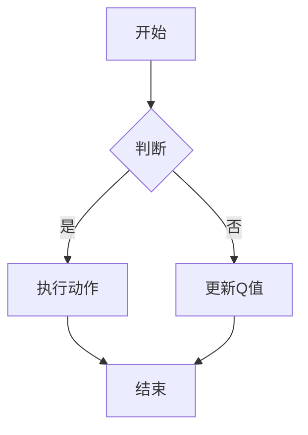
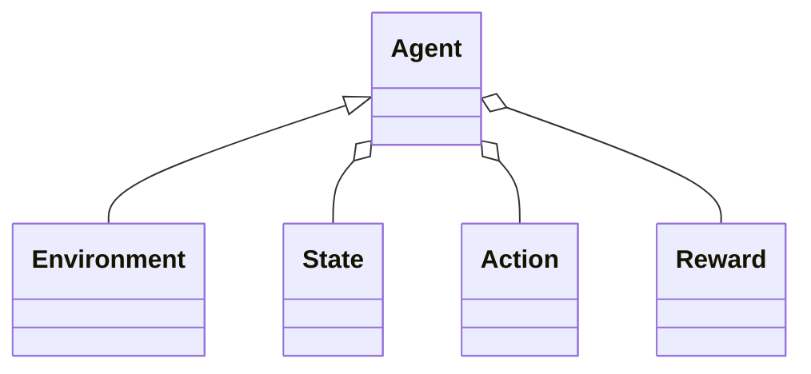
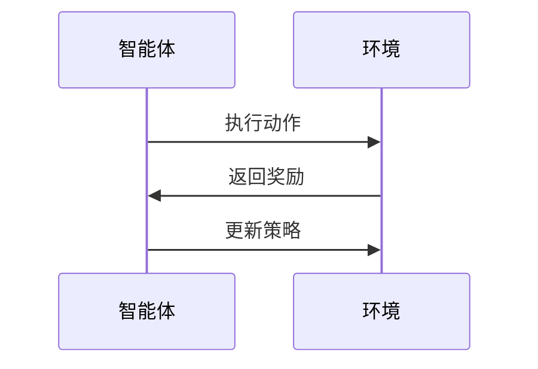

                 

# 强化学习在AI Agent交互策略中的应用

> 关键词：强化学习、AI Agent、交互策略、Q-Learning、DQN、A3C

> 摘要：本文旨在探讨强化学习在AI Agent交互策略中的应用，从基本概念出发，深入分析强化学习在AI Agent中的核心作用，并结合实际案例，展示强化学习算法在不同场景下的应用效果。

## 引言

随着人工智能技术的不断发展，AI Agent在许多领域都展现出了强大的应用潜力。AI Agent是指具备自主决策能力和执行能力的人工智能实体，能够在复杂的动态环境中与外界进行交互，实现特定的任务目标。强化学习（Reinforcement Learning，RL）作为一种重要的机器学习算法，因其能够通过试错和反馈调整策略，从而实现优化决策，成为AI Agent交互策略设计的重要方法。

本文将围绕强化学习在AI Agent交互策略中的应用展开，从基本概念、算法原理、案例分析和实践应用等方面进行深入探讨。

## 1. 强化学习的基本概念

### 1.1 强化学习的定义与特点

强化学习是一种通过试错和反馈来学习决策策略的机器学习算法。其核心思想是：通过环境（Environment）与智能体（Agent）之间的交互，智能体根据当前的感知状态（State）选择行动（Action），并从环境中获得奖励（Reward），通过不断试错和反馈，逐渐调整策略，以达到最大化累计奖励的目标。

强化学习具有以下几个特点：

1. **交互性**：强化学习强调智能体与环境的互动，通过反馈进行学习。
2. **自主性**：智能体能够自主地根据环境和奖励进行决策。
3. **复杂性**：强化学习问题通常具有高度的不确定性和动态性。
4. **优化目标**：强化学习的目标是寻找一种最优策略，以最大化累计奖励。

### 1.2 强化学习的核心组件

强化学习系统主要由以下几个核心组件构成：

1. **智能体（Agent）**：执行决策并采取行动的主体。
2. **环境（Environment）**：智能体所处的环境，包括状态（State）和动作（Action）空间。
3. **状态（State）**：智能体在某个时刻所处的情境。
4. **动作（Action）**：智能体可以采取的某种行为。
5. **奖励（Reward）**：环境对智能体动作的反馈，用于指导智能体的行为。

### 1.3 强化学习的问题模型

强化学习的问题模型可以表示为一个四元组 \( (S, A, R, P) \)，其中：

- \( S \)：状态空间，表示智能体可能处于的所有状态。
- \( A \)：动作空间，表示智能体可以采取的所有动作。
- \( R \)：奖励函数，用于评估智能体的动作效果。
- \( P \)：状态转移概率函数，描述智能体在某个状态采取某个动作后，转移到另一个状态的概率。

## 2. 强化学习算法原理

### 2.1 Q-Learning算法

Q-Learning是一种基于值函数的强化学习算法，其核心思想是通过学习值函数来优化智能体的策略。值函数表示智能体在某个状态下采取某个动作的期望回报。

#### 2.1.1 算法原理

Q-Learning算法通过以下步骤进行迭代学习：

1. 初始化Q值表 \( Q(s, a) \)。
2. 在某个状态 \( s \) 下，随机选择动作 \( a \)。
3. 执行动作 \( a \)，进入下一个状态 \( s' \)，并获得奖励 \( r \)。
4. 根据新状态和当前策略，更新Q值表： \( Q(s, a) = Q(s, a) + \alpha [r + \gamma \max_{a'} Q(s', a') - Q(s, a)] \)，其中 \( \alpha \) 为学习率，\( \gamma \) 为折扣因子。

#### 2.1.2 算法流程

- **初始化**：初始化Q值表。
- **选择动作**：在当前状态下，选择使Q值最大的动作。
- **执行动作**：执行选定的动作，进入新状态。
- **更新Q值**：根据新状态和奖励，更新Q值表。

#### 2.1.3 算法示例

假设一个简单的环境，状态空间为 \( S = \{0, 1, 2\} \)，动作空间为 \( A = \{up, down\} \)，奖励函数为 \( R(s, a) = 1 \)（成功）或 \( R(s, a) = -1 \)（失败）。初始Q值表为 \( Q(s, a) = 0 \)。

- **初始状态**：状态0，选择动作up，进入状态1，获得奖励1，更新Q值表：\( Q(0, up) = 0.6 \)，\( Q(0, down) = 0 \)。
- **状态1**：选择动作down，进入状态2，获得奖励-1，更新Q值表：\( Q(1, up) = 0 \)，\( Q(1, down) = 0.4 \)。
- **状态2**：选择动作up，回到状态0，获得奖励1，更新Q值表：\( Q(2, up) = 0.2 \)，\( Q(2, down) = 0 \)。

### 2.2 Deep Q-Network（DQN）算法

DQN是一种基于深度学习的强化学习算法，其核心思想是使用深度神经网络（DNN）来近似值函数。

#### 2.2.1 算法原理

DQN算法通过以下步骤进行迭代学习：

1. 初始化经验回放记忆池。
2. 从初始状态开始，随机选择动作。
3. 执行动作，进入新状态，获得奖励。
4. 将当前状态、动作、奖励和新状态存入经验回放记忆池。
5. 从经验回放记忆池中随机抽取一批经验样本。
6. 使用DNN预测当前状态的Q值。
7. 计算目标Q值 \( Q'(s', a') = r + \gamma \max_{a''} Q'(s'', a'') \)。
8. 更新DNN的参数：使用梯度下降法最小化损失函数。

#### 2.2.2 算法流程

- **初始化**：初始化DNN和经验回放记忆池。
- **选择动作**：在当前状态下，使用DNN预测Q值，选择使Q值最大的动作。
- **执行动作**：执行选定的动作，进入新状态。
- **更新DNN**：根据新状态和奖励，更新DNN的参数。

#### 2.2.3 算法示例

假设一个简单的环境，状态空间为 \( S = \{0, 1, 2\} \)，动作空间为 \( A = \{up, down\} \)，奖励函数为 \( R(s, a) = 1 \)（成功）或 \( R(s, a) = -1 \)（失败）。初始DNN权重为随机值。

- **初始状态**：状态0，选择动作up，进入状态1，获得奖励1，DNN更新参数。
- **状态1**：选择动作down，进入状态2，获得奖励-1，DNN更新参数。
- **状态2**：选择动作up，回到状态0，获得奖励1，DNN更新参数。

### 2.3 Asynchronous Advantage Actor-Critic（A3C）算法

A3C是一种基于异步策略梯度的强化学习算法，其核心思想是同时更新策略和价值网络，并通过异步训练提高学习效率。

#### 2.3.1 算法原理

A3C算法通过以下步骤进行迭代学习：

1. 初始化多个工人智能体。
2. 每个工人智能体独立地从初始状态开始执行动作。
3. 每个工人智能体都包含策略网络和价值网络。
4. 每个工人智能体执行动作，进入新状态，获得奖励。
5. 每个工人智能体将自己的经验存入共享的存储池。
6. 主智能体从共享存储池中抽取一批经验样本。
7. 主智能体更新策略网络和价值网络的参数。

#### 2.3.2 算法流程

- **初始化**：初始化多个工人智能体和共享存储池。
- **执行动作**：每个工人智能体独立执行动作。
- **更新网络**：主智能体从共享存储池中抽取经验样本，更新策略网络和价值网络的参数。

#### 2.3.3 算法示例

假设一个简单的环境，状态空间为 \( S = \{0, 1, 2\} \)，动作空间为 \( A = \{up, down\} \)，奖励函数为 \( R(s, a) = 1 \)（成功）或 \( R(s, a) = -1 \)（失败）。

- **初始状态**：3个工人智能体从初始状态0开始执行动作，分别选择动作up、down、up。
- **执行动作**：每个工人智能体进入新状态，获得奖励，更新自己的策略网络和价值网络。
- **更新网络**：主智能体从共享存储池中抽取经验样本，更新共享的策略网络和价值网络的参数。

## 3. 强化学习在AI Agent交互策略中的应用

### 3.1 机器人导航

机器人导航是一个典型的强化学习应用场景。机器人需要在未知环境中自主导航，到达目标位置。通过强化学习，机器人可以学习到最优的导航策略。

#### 3.1.1 应用场景

- **环境**：机器人所在的2D空间，包含障碍物。
- **状态**：机器人的位置、方向和周围环境。
- **动作**：前进、后退、左转、右转。
- **奖励**：成功到达目标位置获得奖励，否则获得负奖励。

#### 3.1.2 应用案例

使用Q-Learning算法训练机器人导航。机器人从初始位置开始，不断尝试不同的动作，通过更新Q值表，逐渐学习到最优导航策略。最终，机器人能够成功到达目标位置。

### 3.2 自动驾驶

自动驾驶是另一个典型的强化学习应用场景。自动驾驶汽车需要在复杂的交通环境中自主导航，确保安全行驶。

#### 3.2.1 应用场景

- **环境**：道路、车辆、行人等。
- **状态**：汽车的位置、速度、周围车辆和行人。
- **动作**：加速、减速、转向。
- **奖励**：安全行驶获得奖励，否则获得负奖励。

#### 3.2.2 应用案例

使用DQN算法训练自动驾驶汽车。汽车从初始位置开始，通过感知周围环境，选择最优的动作，逐渐学习到安全的驾驶策略。通过不断更新DNN的参数，自动驾驶汽车能够提高行驶的安全性。

### 3.3 游戏智能

强化学习在游戏智能领域也有广泛应用。通过强化学习，游戏AI可以学会玩各种游戏，如围棋、象棋、电子竞技游戏等。

#### 3.3.1 应用场景

- **环境**：游戏场景，包括游戏规则和对手的决策。
- **状态**：游戏当前的状态，如棋盘、角色位置等。
- **动作**：可执行的操作，如落子、攻击等。
- **奖励**：赢得游戏获得奖励，否则获得负奖励。

#### 3.3.2 应用案例

使用A3C算法训练围棋AI。围棋AI从初始状态开始，通过与对手的对弈，不断学习到最优的落子策略。通过多个工人智能体的异步训练，围棋AI能够提高自己的棋艺水平。

## 4. 强化学习在AI Agent交互策略中的应用挑战与展望

### 4.1 挑战

强化学习在AI Agent交互策略中的应用面临着以下挑战：

- **样本效率**：强化学习通常需要大量的样本数据进行训练，以提高模型的泛化能力。
- **探索与利用**：在强化学习过程中，如何平衡探索新策略和利用已有策略之间的矛盾。
- **连续动作**：对于连续动作空间，如何设计有效的强化学习算法。
- **安全性与稳定性**：确保强化学习算法在实际应用中能够稳定运行，并避免产生危险行为。

### 4.2 展望

未来，强化学习在AI Agent交互策略中的应用将会有以下发展趋势：

- **算法创新**：不断有新的强化学习算法涌现，如基于深度学习、强化学习与生成对抗网络的融合算法。
- **应用拓展**：强化学习将在更多的领域得到应用，如智能交通、智能家居、医疗保健等。
- **多智能体系统**：研究多智能体强化学习算法，实现多个AI Agent之间的协作与交互。
- **伦理与法规**：加强对强化学习算法的伦理和法规研究，确保其在实际应用中的安全性和公正性。

## 总结

本文从强化学习的基本概念、算法原理和实际应用等方面，探讨了强化学习在AI Agent交互策略中的应用。强化学习以其强大的自适应能力和自主决策能力，成为AI Agent交互策略设计的重要方法。未来，随着强化学习算法的不断发展和应用领域的拓展，其在AI Agent交互策略中的应用前景将更加广阔。

## 作者信息

作者：AI天才研究院/AI Genius Institute & 禅与计算机程序设计艺术 /Zen And The Art of Computer Programming

## 附录

本文中使用的Mermaid流程图、类图、序列图等图表，均采用Markdown格式编写，具体代码如下：

这些图表可以直观地展示强化学习算法的流程和结构，帮助读者更好地理解和应用强化学习。希望本文能够对您在强化学习领域的研究和实践有所帮助。

