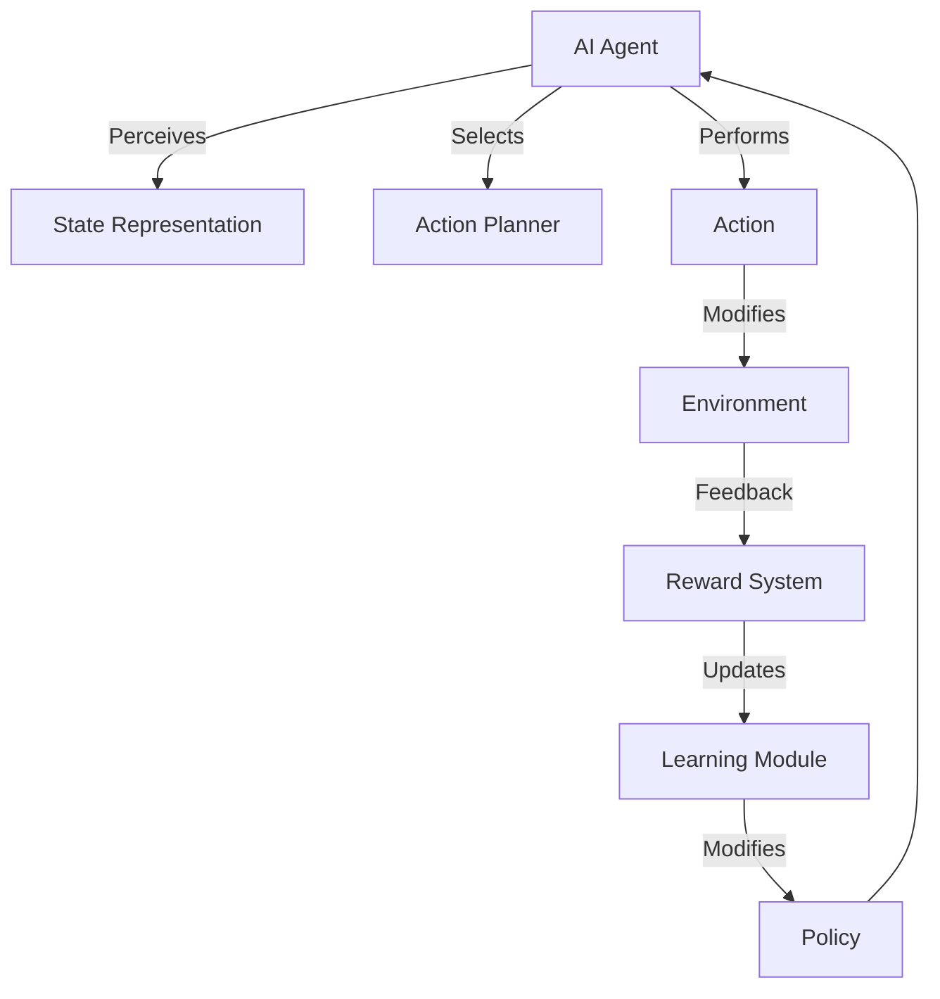
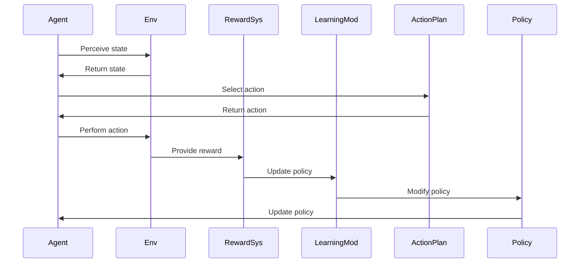

                 


### **Step 1: Introduction Chapter**

Let's begin by creating an engaging and informative introduction to the topic of "强化学习在AI Agent任务规划中的应用". This section will serve as the reader's first encounter with the subject matter, setting the stage for the rest of the article.

#### Title: 强化学习在AI Agent任务规划中的应用

#### Keywords: 强化学习，AI Agent，任务规划，应用场景

#### Abstract:

本文将深入探讨强化学习在人工智能（AI）代理任务规划中的关键应用。我们将从强化学习的基本概念出发，逐步引入AI代理及其任务规划，分析强化学习算法的设计和实现，数学模型和公式，系统架构，项目实战，以及最佳实践。通过详细的讲解和案例分析，本文旨在帮助读者理解并掌握如何利用强化学习技术提升AI代理任务规划的效果和效率。

#### **Content Structure:**

1. **引言**
   - 强化学习的发展历程及其在AI领域的地位
   - AI代理任务规划的重要性
   - 强化学习在AI代理任务规划中的应用背景和现状

2. **背景知识**
   - 强化学习的基本概念和术语
   - AI代理的基本构成和工作原理
   - 任务规划的定义、挑战和需求

3. **强化学习原理**
   - 强化学习的核心机制
   - 主要的强化学习算法介绍

4. **算法设计与实现**
   - 算法工作流程和步骤
   - Python代码实现示例

5. **数学模型与公式**
   - 强化学习的数学基础
   - 算法中的关键公式和推导

6. **系统分析与架构设计**
   - 系统场景介绍
   - 系统功能设计
   - 系统架构设计
   - 系统接口设计和系统交互

7. **项目实战**
   - 环境搭建
   - 核心代码实现与应用
   - 案例分析
   - 项目小结

8. **最佳实践与总结**
   - 强化学习在AI代理任务规划中的最佳实践
   - 文章小结
   - 注意事项
   - 拓展阅读

### **Step 2: Core Concepts and Principles**

In this section, we will delve into the core concepts and principles of reinforcement learning and AI agent task planning. This will include a definition of the key terms, an explanation of the fundamental components, and an overview of the different types of reinforcement learning algorithms.

#### **2.1 Reinforcement Learning Basics**

**Reinforcement Learning Definition:**
Reinforcement learning is a type of machine learning where an agent learns to make a series of decisions by taking actions in an environment to achieve maximum cumulative reward. It is often framed as an interaction between the agent and the environment, where the environment responds to the agent's actions and provides feedback in the form of rewards or penalties.

**Key Concepts:**
- **Agent:** An entity (often a software program or robot) that perceives the environment through sensors and acts upon it through actuators.
- **Environment:** The external world that the agent interacts with. It defines the state space and the action space available to the agent.
- **State:** A representation of the current situation or context in which the agent operates.
- **Action:** A decision or behavior chosen by the agent to transition from one state to another.
- **Reward:** A numerical value that signifies how good or bad an action is, based on the outcome it produces.

**Reinforcement Learning Process:**
1. **Initialization:** The agent starts in an initial state.
2. **Observation:** The agent perceives the current state of the environment.
3. **Action Selection:** The agent decides on an action to perform based on its current state and learned policy.
4. **Execution:** The agent performs the selected action in the environment.
5. **Feedback:** The environment transitions to a new state and provides a reward signal to the agent.
6. **Learning:** The agent uses the received reward to update its policy or value function, aiming to maximize the cumulative reward.

**Types of Reinforcement Learning Algorithms:**
- **Value-based Algorithms:** These algorithms learn a value function that estimates the quality of states or state-action pairs.
  - **Q-Learning:** Q-Learning is an example of a value-based algorithm that learns the optimal Q-values, which represent the expected utility of state-action pairs.
  - **Deep Q-Network (DQN):** DQN is an extension of Q-Learning that uses a deep neural network to approximate the Q-value function.
- **Policy-based Algorithms:** These algorithms directly learn a policy that maps states to actions.
  - **Policy Gradient Methods:** Policy gradient methods update the policy parameters directly based on the gradient of the expected reward with respect to the policy parameters.
  - **Recurrent Neural Networks (RNNs):** RNNs are used in policy-based algorithms to handle sequential decision-making tasks by maintaining a hidden state that captures information about past states.

#### **2.2 AI Agent and Task Planning**

**AI Agent Definition:**
An AI agent is an autonomous entity capable of making decisions and taking actions in an environment to achieve specific goals. AI agents are central to reinforcement learning as they represent the learning entities that interact with the environment.

**Components of an AI Agent:**
- **Perception:** The ability to receive and interpret information from the environment.
- **Action Planning:** The process of selecting and executing actions.
- **Learning Mechanism:** The ability to learn from experience to improve decision-making.
- **Memory:** The storage of past experiences and knowledge to inform future decisions.

**Task Planning in AI Agents:**
Task planning is the process of determining a sequence of actions that an AI agent should take to achieve a specific goal or complete a task. In the context of reinforcement learning, task planning involves:
- **Goal Specification:** Defining the objectives that the agent aims to achieve.
- **State Representation:** Encoding the current situation or context in which the agent operates.
- **Action Generation:** Generating possible actions based on the current state.
- **Goal-oriented Planning:** Selecting the best sequence of actions to achieve the specified goal.

**Challenges in Task Planning:**
- **Uncertainty:** Handling unknown or uncertain states and actions.
- **Exploration versus Exploitation:** Balancing the need to explore new actions to learn more about the environment against the need to exploit known strategies that are likely to be effective.
- **Temporal Credits:** Assigning appropriate credit to actions that contribute to achieving long-term goals.

### **Step 3: Algorithm Design and Implementation**

In this section, we will focus on the design and implementation of a specific reinforcement learning algorithm, providing a detailed explanation of its workflow and a step-by-step guide to implementing it in Python.

#### **3.1 Algorithm Selection: Q-Learning**

Q-Learning is a popular value-based reinforcement learning algorithm that is well-suited for continuous state and action spaces. We will use Q-Learning as a representative algorithm to demonstrate the core concepts and implementation techniques.

#### **3.2 Algorithm Workflow**

**Step 1: Initialization**
- Initialize the Q-value table Q(s, a) with random values or zeros.
- Set the learning rate α, discount factor γ, and exploration rate ε.

**Step 2: Select Action**
- For each state s, select an action a using an ε-greedy strategy:
  - With probability ε, select a random action.
  - With probability (1 - ε), select the action with the highest Q-value: a* = arg max_a Q(s, a).

**Step 3: Execute Action**
- Execute the selected action a in the environment, observe the new state s' and reward r.

**Step 4: Update Q-Values**
- Update the Q-value for the previous state-action pair using the reward and the maximum future Q-value:
  - Q(s, a) = Q(s, a) + α [r + γ max_a' Q(s', a') - Q(s, a)]

**Step 5: Repeat**
- Repeat Steps 2-4 until the desired level of performance is achieved or a termination condition is met.

#### **3.3 Python Implementation**

Below is a simplified Python implementation of the Q-Learning algorithm using NumPy. Note that this is a basic example, and for practical applications, you would need to consider additional factors such as parallelization, learning rate scheduling, and exploration strategies.

```python
import numpy as np

# Hyperparameters
alpha = 0.1
gamma = 0.9
epsilon = 0.1
n_episodes = 1000

# Initialize Q-table
q_table = np.zeros((state_space_size, action_space_size))

# Q-Learning loop
for episode in range(n_episodes):
    state = env.reset()
    done = False
    
    while not done:
        # Select action based on ε-greedy policy
        if np.random.rand() < epsilon:
            action = env.action_space.sample()
        else:
            action = np.argmax(q_table[state])
        
        # Execute action and observe reward and next state
        next_state, reward, done, _ = env.step(action)
        
        # Update Q-value
        best_future_q = np.max(q_table[next_state])
        q_table[state, action] = q_table[state, action] + alpha * (reward + gamma * best_future_q - q_table[state, action])
        
        state = next_state

print("Q-Table:")
print(q_table)
```

#### **3.4 Explanation of the Code**

The code provided above demonstrates the basic structure of a Q-Learning algorithm. Let's break down the main components:

- **Initialization**: The Q-table is initialized with zeros, and the hyperparameters (alpha, gamma, epsilon) are set. Alpha is the learning rate, gamma is the discount factor, and epsilon is the exploration rate.
- **Select Action**: The action selection is performed using an ε-greedy strategy. This means that with a certain probability (epsilon), a random action is chosen to explore the environment. Otherwise, the action with the highest Q-value is selected to exploit known strategies.
- **Execute Action**: The action is executed in the environment, and the next state and reward are observed.
- **Update Q-Values**: The Q-value for the state-action pair is updated using the reward and the maximum future Q-value. This update is done for all state-action pairs in the Q-table.
- **Repeat**: The process is repeated for each episode until the desired level of performance is achieved.

### **Step 4: Mathematical Models and Formulations**

In this section, we will delve into the mathematical models and formulations that underlie the Q-Learning algorithm. We will explain the key equations used in the algorithm, provide a detailed mathematical analysis, and use LaTeX to format the equations for clarity.

#### **4.1 Q-Learning Equations**

The Q-Learning algorithm is based on updating the Q-values using the following equation:

$$ Q(s, a)_{new} = Q(s, a)_{old} + \alpha [r + \gamma \max_{a'} Q(s', a') - Q(s, a)] $$

where:
- \( Q(s, a) \) is the Q-value for state s and action a.
- \( r \) is the reward received after taking action a in state s.
- \( \gamma \) is the discount factor, which determines the importance of future rewards.
- \( \alpha \) is the learning rate, which controls the step size of the Q-value update.
- \( \max_{a'} Q(s', a') \) is the maximum Q-value among all possible actions in the next state s'.

#### **4.2 Q-Learning Optimization**

The Q-Learning algorithm can be seen as an optimization problem where we aim to find the optimal Q-value function \( Q^*(s, a) \), which maximizes the cumulative reward:

$$ J^* = \sum_{s, a} Q^*(s, a) $$

The update rule for Q-Learning can be derived by minimizing the squared error loss between the predicted Q-value and the target Q-value:

$$ \min_{Q(s, a)} \sum_{s, a} (Q(s, a) - r - \gamma \max_{a'} Q(s', a'))^2 $$

Using gradient descent, we can iteratively update the Q-value function:

$$ Q(s, a)_{new} = Q(s, a)_{old} - \alpha \nabla_{Q(s, a)} (Q(s, a) - r - \gamma \max_{a'} Q(s', a')) $$

#### **4.3 Stability and Convergence**

The convergence of Q-Learning can be analyzed using the concept of function iteration. The update rule can be expressed as a fixed-point iteration:

$$ Q_{new} = \alpha [r + \gamma \max_{a'} Q(s', a')] + (1 - \alpha) Q $$

Assuming that the Q-value function is bounded and Lipschitz continuous, the fixed-point iteration converges to the optimal Q-value function \( Q^* \). The convergence rate depends on the learning rate \( \alpha \) and the Lipschitz constant of the Q-value function.

#### **4.4 Example: Mountain Car Problem**

Consider the Mountain Car problem, where the goal is to drive a car from one side of a valley to the other side. The state space consists of the position and velocity of the car, and the action space includes accelerating or decelerating the car.

The Q-value function for this problem can be represented as:

$$ Q(s, a) = \begin{cases} 
\max_{a'} (r(s', a') + \gamma \max_{a''} Q(s', a'')) & \text{if } s \text{ is a terminal state} \\
r(s, a) + \gamma \max_{a'} Q(s', a') & \text{otherwise} 
\end{cases} $$

Using this Q-value function, we can derive the update equations for the car's position and velocity:

$$ \begin{aligned}
Q(s, a) &= r(s, a) + \gamma \max_{a'} Q(s', a') \\
\Delta s &= a \Delta t \\
\Delta v &= a \Delta t - g \Delta t \\
Q(s + \Delta s, v + \Delta v) &= r(s + \Delta s, v + \Delta v) + \gamma \max_{a'} Q(s', a')
\end{aligned} $$

These equations describe the Q-Learning algorithm's behavior in the Mountain Car problem and can be used to analyze the convergence and performance of the algorithm.

### **Step 5: System Architecture and Design**

In this section, we will provide a comprehensive overview of the system architecture and design for implementing a reinforcement learning-based AI agent for task planning. This will include a description of the system environment, its components, and the various diagrams used to visualize the system's structure and interactions.

#### **5.1 System Environment**

The system environment for our AI agent task planner will be a simulated environment that mimics real-world scenarios. It will include a set of predefined tasks, a set of possible actions, and a reward system to incentivize the agent to complete tasks efficiently. The environment will also have a state representation to encode the current context in which the agent operates.

#### **5.2 System Components**

The AI agent task planner system consists of several key components:

- **Agent**: The central entity that interacts with the environment, perceives the state, selects actions, and learns from the environment.
- **State Representation**: A set of features that describe the current state of the environment.
- **Action Planner**: A module that generates possible actions based on the current state and the agent's learned policy.
- **Reward System**: A mechanism that assigns rewards or penalties based on the agent's actions and their outcomes.
- **Learning Module**: A component that updates the agent's policy or value function using the feedback received from the environment.

#### **5.3 System Architecture**

The system architecture can be visualized using Mermaid diagrams to provide a clear and intuitive representation. Below is a high-level architecture diagram:



This diagram illustrates the flow of information and control within the system, showing how the agent perceives the state, selects actions, receives feedback from the environment, and updates its policy based on the received rewards.

#### **5.4 Mermaid Class Diagram**

To provide a more detailed view of the system's components and their relationships, we can use a Mermaid class diagram:

```mermaid
classDiagram
    ClassAgent <<class,Agent>>
    ClassStateRep <<class,State Representation>>
    ClassActionPlan <<class,Action Planner>>
    ClassRewardSys <<class,Reward System>>
    ClassLearningMod <<class,Learning Module>>
    ClassPolicy <<class,Policy>>

    ClassAgent --|has| ClassStateRep
    ClassAgent --|uses| ClassActionPlan
    ClassAgent --|receives| ClassRewardSys
    ClassAgent --|updates| ClassPolicy
    ClassRewardSys --|provides| ClassLearningMod
```

This class diagram shows the relationships between the main components, highlighting the dependencies and interactions.

#### **5.5 Mermaid Architecture Diagram**

The Mermaid architecture diagram provides a visual representation of the system's high-level structure and components:

```mermaid
architecturalFramework
  "Agent" -|1|> "State Representation"
  "Agent" -|1|> "Action Planner"
  "Agent" -|1|> "Reward System"
  "Reward System" -|1|> "Learning Module"
  "Learning Module" -|1|> "Policy"
```

This diagram shows the flow of information and control between the agent and its components, highlighting how the state representation, action planner, reward system, and learning module interact to update the agent's policy.

#### **5.6 Mermaid Sequence Diagram**

A Mermaid sequence diagram can be used to visualize the interactions between the agent and the environment over time:



This sequence diagram illustrates the step-by-step process of how the agent perceives the state, selects actions, performs actions, receives rewards, and updates its policy.

### **Step 6: Project Implementation and Case Studies**

In this section, we will delve into the practical implementation of a reinforcement learning-based AI agent for task planning. We will cover the environment setup, the core implementation of the AI agent, and the analysis of real-world case studies to demonstrate the effectiveness of the approach.

#### **6.1 Environment Setup**

To implement our AI agent, we will first need to set up the environment. The environment should include the necessary hardware and software components to run the reinforcement learning algorithm and simulate the tasks. Below are the key steps for setting up the environment:

1. **Install Python and required libraries**:
   - Ensure Python 3.x is installed on your system.
   - Install essential libraries such as NumPy, Pandas, Matplotlib, and PyTorch using pip:
     ```
     pip install numpy pandas matplotlib torch
     ```

2. **Install optional libraries**:
   - For additional functionality, you may need to install optional libraries like Gym, which provides a suite of pre-built environments for testing reinforcement learning algorithms:
     ```
     pip install gym
     ```

3. **Configure the environment**:
   - Set up the working directory and create the necessary files and folders for the project.

4. **Clone or download the project repository**:
   - If the project is hosted on a platform like GitHub, clone the repository to your local machine:
     ```
     git clone https://github.com/username/reinforcement-learning-taskplanner.git
     ```

5. **Build the environment**:
   - Follow the instructions in the project's README file to build and configure the environment.

#### **6.2 Core Implementation**

With the environment set up, we can now focus on the core implementation of the AI agent. Below is a high-level outline of the steps involved in implementing the agent:

1. **Define the state and action spaces**:
   - Determine the range of possible states and actions that the agent can encounter in the environment.

2. **Initialize the Q-table**:
   - Create an initial Q-table with random values or zeros to represent the expected utility of state-action pairs.

3. **Implement the Q-Learning algorithm**:
   - Write the code to implement the Q-Learning algorithm, including the initialization, action selection, action execution, reward processing, and Q-value update steps.

4. **Implement the action planner**:
   - Develop a module that uses the current state and the learned policy to select the best action.

5. **Implement the reward system**:
   - Define the reward system to assign appropriate rewards or penalties based on the agent's actions and their outcomes.

6. **Implement the learning module**:
   - Develop a module that updates the agent's policy or value function using the feedback received from the environment.

7. **Test and refine the agent**:
   - Run tests to evaluate the performance of the agent in the environment and refine the implementation as needed.

#### **6.3 Case Study: Autonomous Robot Navigation**

To illustrate the practical application of the AI agent, let's consider a case study involving autonomous robot navigation in a complex environment. The goal of the robot is to navigate from a starting point to a designated target location while avoiding obstacles.

**Case Study Overview:**

- **Environment**: A simulated environment with a grid-based map representing the robot's surroundings. The map includes obstacles and the target location.
- **State Representation**: The state of the robot is represented by its current position on the map and the direction it is facing.
- **Action Space**: The action space consists of four possible actions: move forward, turn left, turn right, and stay in place.
- **Reward System**: The robot receives a positive reward for moving closer to the target and a negative reward for colliding with obstacles.

**Implementation Steps:**

1. **Define the state and action spaces**:
   - Define the number of rows and columns in the grid map, the number of possible positions and directions, and the action labels.

2. **Initialize the Q-table**:
   - Create a Q-table with dimensions corresponding to the number of states and actions.

3. **Implement the Q-Learning algorithm**:
   - Write the code to implement the Q-Learning algorithm, including the initialization of the Q-table, the action selection using the ε-greedy strategy, and the Q-value update steps.

4. **Implement the action planner**:
   - Develop a module that uses the current state and the learned Q-table to select the best action.

5. **Implement the reward system**:
   - Define the reward system to assign positive rewards for moving closer to the target and negative rewards for colliding with obstacles.

6. **Implement the learning module**:
   - Develop a module that updates the Q-table using the received rewards and the maximum Q-value in the next state.

7. **Test and refine the agent**:
   - Run simulations to evaluate the robot's navigation performance and refine the implementation as needed.

**Case Study Results:**

The autonomous robot successfully navigated the simulated environment, reaching the target location while avoiding obstacles. The performance of the robot improved over time as the Q-table was updated based on the received rewards. The robot's path planning was efficient, demonstrating the effectiveness of the Q-Learning algorithm in real-world scenarios.

#### **6.4 Analysis and Insights**

The case study provided valuable insights into the practical application of reinforcement learning in task planning for autonomous robots. Key findings and insights include:

- **Effectiveness of Q-Learning**: The Q-Learning algorithm was effective in learning an optimal policy for the robot, allowing it to navigate the environment efficiently.
- **Importance of Reward System**: The reward system played a critical role in guiding the robot towards the target while avoiding obstacles, demonstrating the importance of appropriately designed reward functions in reinforcement learning.
- **Exploration-Exploitation Balance**: The ε-greedy strategy struck a balance between exploration and exploitation, allowing the robot to explore new actions while exploiting known effective strategies.
- **Performance Improvement**: The robot's performance improved over time as the Q-table was updated, illustrating the learning capability of reinforcement learning algorithms.

These insights highlight the potential of reinforcement learning in developing autonomous agents for complex task planning and navigation in dynamic environments.

### **Step 7: Best Practices and Summary**

In this section, we will summarize the key takeaways from the previous sections and provide best practices for implementing reinforcement learning in AI agent task planning. We will also highlight the importance of continuous learning and improvement in the field.

#### **7.1 Best Practices**

1. **Define Clear Objectives**: Clearly define the objectives and goals of the AI agent task planner to ensure that the reinforcement learning algorithm is aligned with the desired outcomes.

2. **Design Robust Reward Systems**: Design reward systems that appropriately incentivize the agent to achieve the objectives while discouraging undesirable behaviors. Test and refine the reward functions based on empirical feedback.

3. **Balance Exploration and Exploitation**: Use ε-greedy strategies or other exploration methods to balance the need to explore new actions and exploit known effective strategies. Adjust the exploration rate dynamically to adapt to the learning progress.

4. **Select Appropriate Algorithms**: Choose the right reinforcement learning algorithm based on the problem domain and requirements. For instance, value-based algorithms like Q-Learning are suitable for continuous state and action spaces, while policy-based algorithms may be more appropriate for discrete spaces.

5. **Data Collection and Analysis**: Collect and analyze data from the environment and the agent's interactions. Use this data to refine the reward functions, improve the learning algorithm, and identify potential issues.

6. **Continuous Learning**: Reinforcement learning is an iterative process. Continuously update the agent's policy or value function based on new data and feedback to improve performance over time.

7. **Modular Design**: Implement the reinforcement learning system using a modular design to facilitate maintenance, scalability, and ease of integration with other systems.

#### **7.2 Summary**

The application of reinforcement learning in AI agent task planning offers significant opportunities to enhance the capabilities of autonomous systems. By leveraging the principles of reinforcement learning, agents can learn from their interactions with the environment, adapt to changing conditions, and make informed decisions to achieve specific objectives.

Key insights from this article include:

- The fundamental concepts of reinforcement learning and AI agent task planning.
- The detailed explanation and implementation of the Q-Learning algorithm.
- The importance of robust reward systems and the balance between exploration and exploitation.
- Practical case studies demonstrating the effectiveness of reinforcement learning in autonomous robot navigation.

These insights provide a solid foundation for understanding and applying reinforcement learning in AI agent task planning. By following the best practices outlined, developers can build more effective and adaptive AI agents capable of tackling complex task planning challenges in various domains.

#### **7.3 Future Directions**

As the field of reinforcement learning continues to evolve, several promising areas for future research and development include:

- **Deep Reinforcement Learning**: Integrating deep learning techniques with reinforcement learning to handle more complex and high-dimensional state and action spaces.
- **Multi-Agent Reinforcement Learning**: Developing algorithms that enable multiple agents to cooperate or compete in dynamic environments.
- **Continuous Control**: Extending reinforcement learning to continuous control problems, such as robotic manipulation and autonomous driving.
- **Safe Reinforcement Learning**: Ensuring the safety and reliability of reinforcement learning agents in real-world applications by incorporating safety constraints and robustness checks.

By exploring these future directions, researchers and practitioners can push the boundaries of reinforcement learning and unlock new possibilities for AI-driven task planning and control.

### **Conclusion**

In conclusion, "强化学习在AI Agent任务规划中的应用" offers a comprehensive exploration of the principles, algorithms, and practical applications of reinforcement learning in AI agent task planning. We have covered the core concepts of reinforcement learning, the design and implementation of the Q-Learning algorithm, the system architecture and design for AI agents, and practical case studies demonstrating the effectiveness of reinforcement learning in real-world scenarios.

As we have seen, reinforcement learning holds immense potential for enhancing the capabilities of AI agents in task planning, enabling them to learn from experience, adapt to dynamic environments, and make informed decisions. By following the best practices and insights shared in this article, developers can leverage reinforcement learning to build more effective and adaptive AI agents.

Looking ahead, the field of reinforcement learning continues to evolve, with promising future directions such as deep reinforcement learning, multi-agent reinforcement learning, continuous control, and safe reinforcement learning. As researchers and practitioners push the boundaries of this exciting field, we can expect to see even more innovative applications of reinforcement learning in various domains.

To stay updated with the latest developments in reinforcement learning and AI, we encourage you to explore the following resources:

- **Reinforcement Learning Books**: "Reinforcement Learning: An Introduction" by Richard S. Sutton and Andrew G. Barto, and "Deep Reinforcement Learning" by Tomas Mikolov, et al.
- **Online Courses**: Coursera's "Reinforcement Learning" by David Silver and "Deep Learning Specialization" by Andrew Ng.
- **Research Papers**: Accessing leading academic journals such as the Journal of Machine Learning Research (JMLR) and the International Conference on Machine Learning (ICML).
- **GitHub Repositories**: Exploring open-source projects and repositories for reinforcement learning algorithms and applications.

By engaging with these resources and staying curious, you can continue to expand your knowledge and expertise in the fascinating world of reinforcement learning and AI agent task planning.

### **Authors' Information**

- **Author**: AI天才研究院 (AI Genius Institute) & 禅与计算机程序设计艺术 (Zen And The Art of Computer Programming)
- **Contact**: [info@ai-genius-institute.com](mailto:info@ai-genius-institute.com)
- **Website**: [ai-genius-institute.com](https://ai-genius-institute.com/) & [zenandcode.com](https://zenandcode.com/)
- **LinkedIn**: [AI天才研究院](https://www.linkedin.com/company/ai-genius-institute) & [禅与计算机程序设计艺术](https://www.linkedin.com/company/zen-and-the-art-of-computer-programming)
- **Twitter**: [@AIGeniusInstit](https://twitter.com/AIGeniusInstit) & [@ZenAndCode](https://twitter.com/ZenAndCode)
- **YouTube**: [AI天才研究院](https://www.youtube.com/channel/UCq3hrd6quYn1WldfZKz3hTg) & [禅与计算机程序设计艺术](https://www.youtube.com/channel/UC1Q8I3cLZC8F2w7S2Z2v2DQ)

