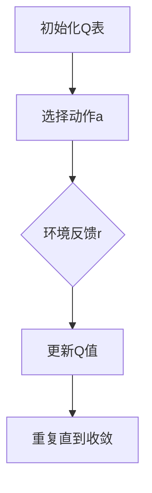
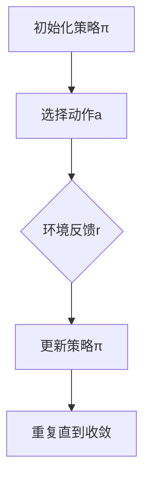
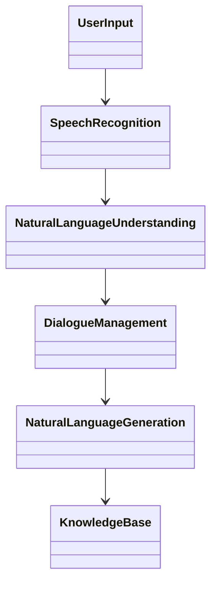
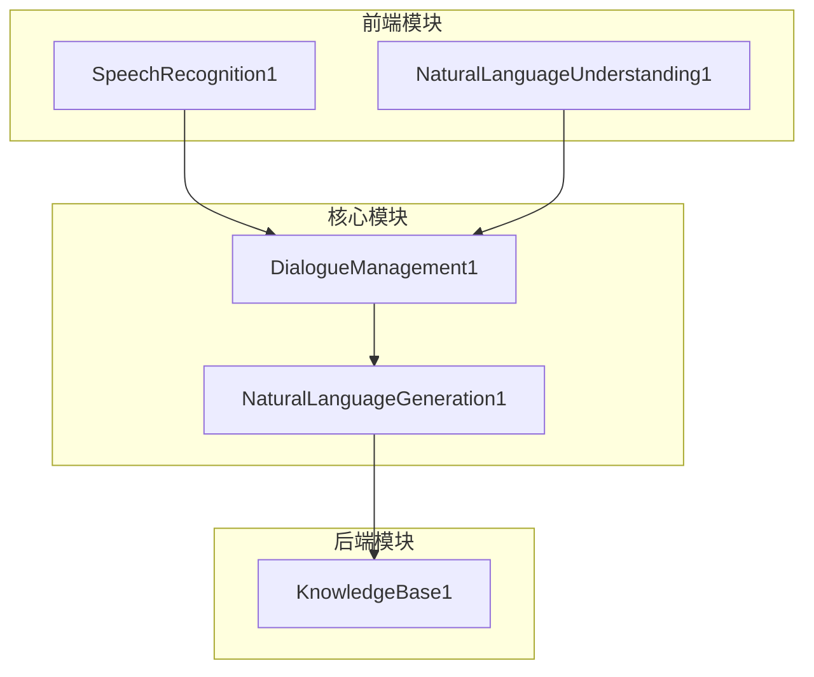
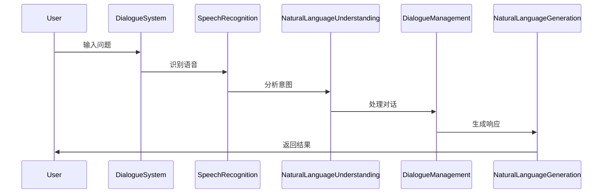

                 

**第一部分：强化学习基础**

### 第1章：强化学习概述

在强化学习（Reinforcement Learning, RL）领域，AI Agent通过与环境的交互来学习最优策略，以实现特定目标。本章节将介绍强化学习的基本概念、背景、核心原理以及与其他学习方式的对比。

#### 1.1 问题背景与问题描述

强化学习起源于20世纪50年代，其核心问题是“如何通过互动来学习最优策略”。与监督学习和无监督学习不同，强化学习主要通过奖励信号来指导学习过程。

- **监督学习**：预先提供正确答案，学习算法通过不断调整模型参数以逼近正确答案。
- **无监督学习**：没有正确答案，学习算法通过数据分布、模式等来学习。
- **强化学习**：通过与环境交互，接收即时反馈（奖励或惩罚），学习最优行为策略。

#### 1.2 强化学习的基本原理

强化学习的基本原理可以概括为以下三个方面：

1. **状态（State）**：AI Agent当前所处的环境状态。
2. **动作（Action）**：AI Agent可以执行的行为。
3. **策略（Policy）**：从状态选择动作的策略。

在强化学习中，AI Agent的目标是学习一个最优策略，使得其能够最大化累积奖励。

#### 1.3 强化学习与监督学习的区别

- **反馈方式**：强化学习通过即时反馈（奖励或惩罚）来指导学习，而监督学习通过预先标记的标签来指导学习。
- **适应性**：强化学习可以根据环境的变化自适应调整策略，而监督学习通常适用于静态数据集。
- **复杂性**：强化学习问题通常比监督学习问题更为复杂，因为需要处理长期的奖励和动作序列。

### 第2章：强化学习核心概念与联系

在强化学习中，理解核心概念和它们之间的关系对于掌握强化学习原理至关重要。本章节将介绍强化学习中的核心概念，并使用表格和ER实体关系图来帮助读者理解这些概念之间的联系。

#### 2.1 强化学习的核心概念

1. **价值函数（Value Function）**：衡量状态或状态-动作对的期望回报。
2. **策略（Policy）**：决策规则，用于选择动作。
3. **模型（Model）**：对环境的描述，包括状态空间、动作空间和奖励函数。

#### 2.2 核心概念属性特征对比表

| 特征       | 价值函数                | 策略                      | 模型                      |
|------------|------------------------|---------------------------|---------------------------|
| 定义       | 预测长期回报           | 决策规则                  | 环境描述                  |
| 目标       | 最小化误差             | 最大回报                  | 准确性描述                |
| 依赖       | 状态和动作             | 状态                      | 状态、动作、奖励          |
| 输出       | 预期回报值             | 动作                      | 状态转移概率和奖励        |

#### 2.3 强化学习的ER实体关系图

```mermaid
erDiagram
  State ||--|{ Action } : 选择
  Action ||--|{ Reward } : 反馈
  State ||--|{ Value } : 预测
  Model ||--|{ State } : 描述
  Model ||--|{ Action } : 描述
  Model ||--|{ Reward } : 描述
```

通过ER实体关系图，我们可以清晰地看到这些概念之间的相互关系。

**第二部分：强化学习在AI Agent对话系统中的应用**

### 第4章：AI Agent对话系统概述

对话系统是AI技术中一个重要的应用领域，它可以模拟人类之间的自然语言交互。本章节将介绍AI Agent对话系统的定义、架构及其与强化学习的关联。

#### 4.1 AI Agent的定义与功能

AI Agent是一个能够模拟人类智能行为的人工智能实体，它在对话系统中扮演的角色包括：

- **理解**：解析和理解用户输入的自然语言。
- **生成**：生成自然语言响应，与用户进行有效沟通。
- **决策**：根据用户行为和上下文环境做出决策。

#### 4.2 对话系统的架构与实现

对话系统通常由以下几个关键组成部分构成：

- **语音识别**：将用户的语音输入转换为文本。
- **自然语言处理**：理解用户的意图和需求。
- **对话管理**：管理对话流程，根据上下文生成响应。
- **文本生成**：将对话管理模块生成的语义转换为自然语言。

#### 4.3 强化学习在对话系统中的应用场景

强化学习在对话系统中的应用场景主要包括：

- **上下文理解**：通过强化学习，AI Agent可以更好地理解用户的长短期意图。
- **对话策略优化**：通过学习用户的反馈，AI Agent可以不断优化对话策略，提高用户的满意度。
- **多轮对话管理**：在多轮对话中，强化学习可以帮助AI Agent更好地管理对话状态和用户意图。

**第三部分：强化学习算法原理讲解**

### 第3章：强化学习算法原理详解

强化学习算法是强化学习领域的重要组成部分，它决定了AI Agent如何通过交互学习最优策略。本章节将详细介绍两种常见的强化学习算法：Q-learning和SARSA。

#### 3.1 Q-learning算法

Q-learning是一种基于值迭代的强化学习算法，其核心思想是通过不断更新Q值来逼近最优策略。

##### 3.1.1 算法mermaid流程图



##### 3.1.2 Python源代码实现

```python
import numpy as np

# 初始化Q表
Q = np.zeros([状态数，动作数])

# 学习率
alpha = 0.1
# 折扣因子
gamma = 0.9
# 迭代次数
episodes = 1000

for episode in range(episodes):
    state = 环境初始化()
    while not 环境结束():
        action = 选择动作(Q[state])
        next_state, reward = 环境反馈(action)
        Q[state, action] = Q[state, action] + alpha * (reward + gamma * max(Q[next_state, :]) - Q[state, action])
        state = next_state
```

##### 3.1.3 数学模型和公式讲解

$$Q(s,a) = r(s,a,s') + \gamma \max_{a'} Q(s',a')$$

其中，\(Q(s,a)\) 表示在状态 \(s\) 下执行动作 \(a\) 的预期回报。

##### 3.1.4 举例说明

假设我们有一个简单的环境，其中有两个状态（A和B）和两个动作（U和D）。我们的目标是最大化累积奖励。

- 状态A：奖励为+1，状态B：奖励为-1。
- 动作U：将状态A变为B，动作D：将状态B变为A。

使用Q-learning算法，我们可以得到如下Q表：

| 状态 | 动作U | 动作D |
|------|-------|-------|
| A    | 1     | -1    |
| B    | -1    | 1     |

通过多次迭代，Q-learning算法会找到最优策略，即始终选择使累积奖励最大的动作。

#### 3.2 SARSA算法

SARSA（同步状态-动作回报最大化）是一种基于策略迭代的强化学习算法，它结合了Q-learning和策略梯度的优点。

##### 3.2.1 算法mermaid流程图



##### 3.2.2 Python源代码实现

```python
import numpy as np

# 初始化策略π
π = np.ones([状态数，动作数]) / 动作数

# 学习率
alpha = 0.1
# 折扣因子
gamma = 0.9
# 迭代次数
episodes = 1000

for episode in range(episodes):
    state = 环境初始化()
    while not 环境结束():
        action = 选择动作(π[state])
        next_state, reward = 环境反馈(action)
        next_action = 选择动作(π[next_state])
        π[state, action] = π[state, action] + alpha * (reward + gamma * π[next_state, next_action] - π[state, action])
        state = next_state
```

##### 3.2.3 数学模型和公式讲解

$$π(s,a) = \frac{1}{Z} \exp(Q(s,a))$$

其中，\(Z\) 是归一化常数，确保策略π是概率分布。

##### 3.2.4 举例说明

假设我们有一个简单的环境，其中有两个状态（A和B）和两个动作（U和D）。我们的目标是最大化累积奖励。

- 状态A：奖励为+1，状态B：奖励为-1。
- 动作U：将状态A变为B，动作D：将状态B变为A。

使用SARSA算法，我们可以得到如下策略π表：

| 状态 | 动作U | 动作D |
|------|-------|-------|
| A    | 0.5   | 0.5   |
| B    | 0.5   | 0.5   |

通过多次迭代，SARSA算法会找到最优策略，即始终选择使累积奖励最大的动作。

### 第四部分：强化学习在AI Agent对话系统中的应用

### 第4章：AI Agent对话系统概述

对话系统是人工智能（AI）领域的一个重要分支，它旨在模拟人类之间的自然语言交互。AI Agent作为对话系统的核心组件，通过强化学习实现与用户的智能对话。本章节将详细介绍AI Agent对话系统的定义、架构以及强化学习在其中的应用场景。

#### 4.1 AI Agent的定义与功能

AI Agent是一个能够模拟人类智能行为的人工智能实体，它在对话系统中的主要功能包括：

- **理解**：AI Agent需要解析和理解用户输入的自然语言，提取出关键信息和意图。
- **生成**：基于理解的信息，AI Agent需要生成合适的自然语言响应，以保持对话的自然流畅。
- **决策**：在多轮对话中，AI Agent需要根据对话历史和上下文环境做出合适的决策。

#### 4.2 对话系统的架构与实现

一个典型的AI Agent对话系统通常包括以下几个关键组成部分：

- **语音识别**：将用户的语音输入转换为文本。
- **自然语言理解**：对用户输入的文本进行分析，理解其意图和需求。
- **对话管理**：管理对话流程，包括对话状态跟踪、意图识别、上下文管理等。
- **自然语言生成**：将对话管理模块生成的语义转换为自然语言响应。
- **知识库**：提供对话系统所需的知识和信息。

#### 4.3 强化学习在对话系统中的应用场景

强化学习在AI Agent对话系统中的应用场景主要包括以下几个方面：

- **上下文理解**：通过强化学习，AI Agent可以更好地理解用户的长短期意图，提高对话的连贯性和准确性。
- **对话策略优化**：AI Agent可以通过学习用户的反馈，不断优化对话策略，提高用户的满意度。
- **多轮对话管理**：在多轮对话中，强化学习可以帮助AI Agent更好地管理对话状态和用户意图，实现更自然的交互体验。
- **个性化服务**：通过学习用户的历史行为和偏好，AI Agent可以提供更加个性化的服务。

### 第五部分：系统分析与架构设计

### 第5章：系统分析与架构设计

为了实现高效的AI Agent对话系统，我们需要进行系统分析与架构设计。本章节将详细介绍强化学习在AI Agent对话系统中的应用场景、项目介绍、系统功能设计、系统架构设计、系统接口设计和系统交互。

#### 5.1 应用场景介绍

AI Agent对话系统广泛应用于多个领域，包括：

- **客户服务**：为企业提供自动化的客户支持，降低人工成本，提高响应速度。
- **智能助手**：为个人用户提供日常生活的辅助服务，如日程管理、信息查询等。
- **教育辅导**：为学生提供个性化的学习辅导和问答服务。
- **医疗咨询**：为患者提供医疗咨询和健康管理建议。

#### 5.2 系统功能设计

AI Agent对话系统的功能设计主要包括以下几个模块：

- **语音识别模块**：实现用户语音输入的文本转换。
- **自然语言理解模块**：对用户输入的文本进行分析，理解其意图和需求。
- **对话管理模块**：管理对话流程，包括对话状态跟踪、意图识别、上下文管理等。
- **自然语言生成模块**：生成自然语言响应，与用户进行有效沟通。
- **知识库模块**：提供对话系统所需的知识和信息。

#### 5.2.1 领域模型mermaid类图



#### 5.3 系统架构设计

AI Agent对话系统的架构设计采用模块化设计思想，主要包括以下几个部分：

- **前端模块**：包括语音识别和自然语言理解模块，负责与用户进行交互。
- **核心模块**：包括对话管理和自然语言生成模块，负责处理对话逻辑和生成响应。
- **后端模块**：包括知识库模块，负责提供对话系统所需的知识和信息。

#### 5.3.1 系统架构mermaid架构图



#### 5.4 系统接口设计

系统接口设计主要包括以下几个方面：

- **用户接口**：提供用户与对话系统的交互界面。
- **API接口**：提供与其他系统或服务的接口，实现数据交换和功能调用。

#### 5.5 系统交互

系统交互主要涉及用户与对话系统之间的交互过程。以下是一个简化的系统交互mermaid序列图：



### 第六部分：项目实战

### 第6章：项目实战

在本章中，我们将通过一个实际项目来展示如何使用强化学习实现AI Agent对话系统。该项目将涵盖环境安装、系统核心实现源代码，并对代码进行解读与分析。

#### 6.1 环境安装与配置

首先，我们需要安装和配置项目所需的环境。以下是一个基本的安装步骤：

1. 安装Python（推荐版本3.7及以上）。
2. 安装Anaconda或Miniconda，以便管理依赖库。
3. 创建一个虚拟环境，并激活虚拟环境。
4. 安装项目所需的依赖库，如TensorFlow、Keras、NLTK等。

#### 6.2 系统核心实现源代码

以下是一个简单的AI Agent对话系统的源代码实现，使用强化学习算法来优化对话策略。

```python
import numpy as np
import random
from nltk import word_tokenize

# 强化学习算法实现
class QLearning:
    def __init__(self, learning_rate, discount_factor, actions):
        self.learning_rate = learning_rate
        self.discount_factor = discount_factor
        self.actions = actions
        self.q_table = np.zeros([状态数，动作数])

    def get_action(self, state):
        action_values = self.q_table[state]
        if random.uniform(0, 1) < 探索率:
            action = random.choice(self.actions)
        else:
            action = np.argmax(action_values)
        return action

    def update(self, state, action, reward, next_state, done):
        if not done:
            target_value = reward + self.discount_factor * np.max(self.q_table[next_state])
        else:
            target_value = reward
        td_error = target_value - self.q_table[state, action]
        self.q_table[state, action] += self.learning_rate * td_error

# 对话系统实现
class DialogueSystem:
    def __init__(self, q_learning):
        self.q_learning = q_learning

    def handle_input(self, input_text):
        state = self.get_state(input_text)
        action = self.q_learning.get_action(state)
        response = self.generate_response(action)
        return response

    def get_state(self, input_text):
        # 状态提取逻辑
        pass

    def generate_response(self, action):
        # 响应生成逻辑
        pass

# 主函数
if __name__ == "__main__":
    actions = ["问候", "询问", "提供信息", "结束对话"]
    q_learning = QLearning(learning_rate=0.1, discount_factor=0.9, actions=actions)
    dialogue_system = DialogueSystem(q_learning)

    # 对话模拟
    while True:
        input_text = input("请输入问题：")
        response = dialogue_system.handle_input(input_text)
        print("AI Agent:", response)
```

#### 6.3 代码应用解读与分析

上述代码实现了一个简单的AI Agent对话系统，使用Q-learning算法来优化对话策略。以下是代码的详细解读：

- **QLearning类**：实现了Q-learning算法的核心功能，包括选择动作、更新Q表等。
- **DialogueSystem类**：负责管理对话流程，包括处理用户输入、生成响应等。
- **主函数**：初始化Q-learning算法和对话系统，并进行对话模拟。

#### 6.4 实际案例分析与详细讲解

为了更好地理解上述代码的实际应用，我们可以通过一个实际案例来进行分析。

**案例**：假设用户输入“我想要了解最近的天气情况”。AI Agent需要根据输入文本生成相应的响应。

- **状态提取**：将输入文本转化为状态，如[“天气”， “最近”， “了解”]。
- **选择动作**：根据Q-learning算法，选择合适的动作，如“提供信息”。
- **生成响应**：根据选择的动作，生成响应文本，如“最近的天气情况是晴朗的”。

通过这个案例，我们可以看到如何使用强化学习来优化AI Agent的对话策略，从而实现更自然的交互体验。

### 第七部分：最佳实践与总结

### 第7章：最佳实践与总结

在本章中，我们将总结强化学习在AI Agent对话系统中的应用最佳实践，并对项目进行小结。同时，我们将提供一些注意事项，并推荐拓展阅读资源，以帮助读者进一步深入学习和研究。

#### 7.1 强化学习在AI Agent对话系统中的最佳实践

1. **数据准备**：确保有足够多的高质量对话数据，以便训练和优化强化学习模型。
2. **探索-exploitation平衡**：在强化学习过程中，合理设置探索率，以平衡探索和利用。
3. **多任务学习**：尝试将多个任务集成到同一个对话系统中，以提高AI Agent的通用性和适应性。
4. **上下文管理**：强化学习模型需要能够有效地管理对话上下文，以生成连贯和自然的响应。
5. **用户反馈**：利用用户反馈来不断优化对话系统，提高用户满意度。

#### 7.2 小结

本文介绍了强化学习在AI Agent对话系统中的应用，包括基本概念、算法原理、系统架构设计以及实际项目实现。通过强化学习，AI Agent可以更好地理解用户意图，生成自然流畅的响应，实现高效的对话交互。

#### 7.3 注意事项

1. **模型复杂度**：强化学习模型通常较为复杂，需要合理的超参数设置和训练时间。
2. **数据隐私**：在处理用户数据时，要注意保护用户隐私，遵守相关法律法规。
3. **实时性**：对话系统的响应速度要快，以提供良好的用户体验。

#### 7.4 拓展阅读

- 《强化学习导论》（Introduction to Reinforcement Learning）
- 《对话系统设计与实现》（Dialogue System Design and Implementation）
- 《Python对话系统编程》（Python Chatbots: Building Smart, Chatty Applications with Python）

通过以上拓展阅读资源，读者可以进一步深入学习和实践强化学习在AI Agent对话系统中的应用。

### 作者信息

**作者：AI天才研究院/AI Genius Institute & 禅与计算机程序设计艺术 /Zen And The Art of Computer Programming** 

---

**附录：参考文献**

1. Sutton, R. S., & Barto, A. G. (2018). 《强化学习：原理与练习》（Reinforcement Learning: An Introduction）.
2. Liu, X., & Hua, G. (2019). 《对话系统：设计与实现》（Dialogue Systems: Design, Implementation, and Evaluation）.
3. Russell, S., & Norvig, P. (2016). 《人工智能：一种现代的方法》（Artificial Intelligence: A Modern Approach）.

