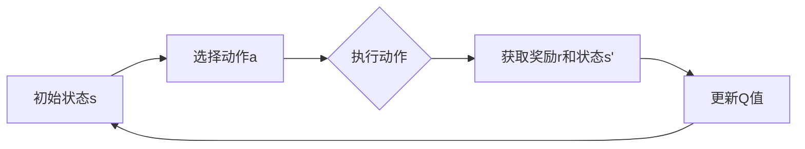
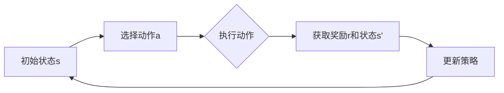
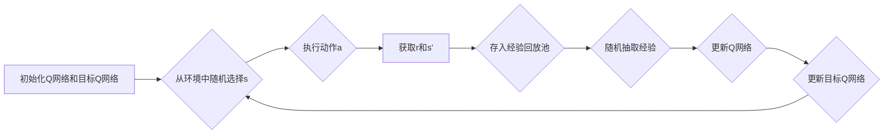
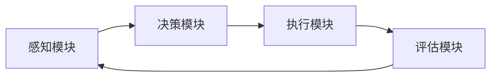

                 

# 强化学习在AI Agent开发中的应用

## 关键词

- 强化学习
- AI Agent
- Q-Learning
- DQN
- Policy Gradient
- 游戏AI
- 机器人控制

## 摘要

本文将深入探讨强化学习在AI Agent开发中的应用。通过介绍强化学习的基本概念、核心算法，以及其在游戏AI和机器人控制等领域的实际应用，本文旨在帮助读者理解强化学习如何赋能AI Agent，实现更智能、更高效的决策与控制。我们将以实际案例为基础，剖析强化学习算法的原理与实现，分享最佳实践和未来发展趋势。

## 目录

1. **背景介绍**
   1.1 问题背景
   1.2 核心概念与联系
   1.3 研究现状与趋势

2. **强化学习原理与算法**
   2.1 强化学习原理
   2.2 算法原理讲解
   2.3 现代强化学习算法

3. **强化学习在AI Agent开发中的应用**
   3.1 AI Agent开发基础
   3.2 实际应用场景分析
   3.3 项目实战

4. **强化学习的最佳实践与未来展望**
   4.1 最佳实践 tips
   4.2 小结
   4.3 注意事项与拓展阅读

---

## 第一部分：背景介绍

### 1.1 问题背景

在人工智能领域，AI Agent的概念逐渐引起了广泛关注。AI Agent，即智能代理，是指能够自主地感知环境、采取行动并获取奖励的智能系统。与传统的人工智能系统不同，AI Agent更注重于自我学习和适应能力。这种特性使得AI Agent在许多场景下具有巨大的应用潜力，例如游戏、机器人控制、推荐系统等。

强化学习作为机器学习的一个重要分支，为AI Agent的开发提供了有力的理论基础和算法支持。强化学习通过智能体在环境中与环境的交互，学习最优策略，实现自我优化。这一过程涉及到状态、动作、奖励和策略四个核心概念。

### 1.2 核心概念与联系

#### 1.2.1 强化学习的基本概念

**状态（State）**：智能体在某一时刻所处的环境描述。

**动作（Action）**：智能体在某一状态下可以采取的行动。

**奖励（Reward）**：智能体在采取某一动作后，从环境中获得的即时反馈。

**策略（Policy）**：智能体在某一状态下选择动作的策略。

**价值函数（Value Function）**：预测在某一状态下采取某一动作所能获得的长期奖励。

**模型（Model）**：智能体对环境的理解，包括状态转移概率和奖励函数。

**学习算法**：用于优化策略的算法，如Q-Learning、SARSA等。

#### 1.2.2 AI Agent的核心特性

**自主性（Autonomy）**：AI Agent能够自主地做出决策。

**适应性（Adaptability）**：AI Agent能够根据环境的变化调整自己的行为。

**鲁棒性（Robustness）**：AI Agent在面对不确定性和异常情况时仍能稳定运行。

**交互性（Interaction）**：AI Agent能够与环境进行有效的交互。

### 1.3 研究现状与趋势

当前，强化学习在AI Agent开发中已经取得了显著的研究成果。传统的强化学习方法如Q-Learning、SARSA等，已经在许多应用场景中取得了成功。同时，随着深度学习技术的发展，现代强化学习算法如DQN、Policy Gradient等也在AI Agent开发中展示了强大的潜力。

未来，随着硬件性能的提升和算法的优化，强化学习在AI Agent开发中的应用将更加广泛。同时，强化学习与其他机器学习方法的结合，也将为AI Agent带来更多的创新和发展。

---

在接下来的部分，我们将深入探讨强化学习的原理和算法，以及其在AI Agent开发中的应用。

## 第二部分：强化学习原理与算法

### 2.1 强化学习原理

强化学习是一种通过试错的方式，从环境中学习最优策略的机器学习方法。它通过智能体在环境中不断进行状态、动作、奖励的交互，来优化其决策过程。强化学习的主要目标是找到一种策略，使得智能体在长期运行中能够获得最大的累积奖励。

**强化学习的数学模型主要包括以下几个核心组成部分：**

#### 2.1.1 状态、动作、奖励的定义

- **状态（State，\( s \)）**：智能体在某一时刻所处的环境描述。状态可以是连续的或离散的。

- **动作（Action，\( a \)）**：智能体在某一状态下可以采取的行动。动作通常也是离散的。

- **奖励（Reward，\( r \)）**：智能体在采取某一动作后，从环境中获得的即时反馈。奖励可以是正的、负的或零。

#### 2.1.2 强化学习的目标函数

强化学习的目标函数是最大化智能体在长期运行中的累积奖励。这可以通过以下数学公式来表示：

\[ J(\theta) = \sum_{t=0}^{\infty} \gamma^t r_t \]

其中，\( \gamma \) 是折扣因子，用于平衡短期奖励和长期奖励的关系。\( r_t \) 是在时间步 \( t \) 所获得的即时奖励。

### 2.2 算法原理讲解

强化学习算法的核心思想是通过在环境中不断尝试，来优化智能体的策略。下面，我们将详细讲解两种基本的强化学习算法：Q-Learning和SARSA。

#### 2.2.1 Q-Learning算法

Q-Learning是一种值迭代算法，它通过不断更新状态-动作值函数（Q值）来优化策略。Q值表示在某一状态下采取某一动作所能获得的长期奖励。

**Q-Learning算法的基本步骤如下：**

1. 初始化Q值函数：随机初始化状态-动作值函数。
2. 迭代过程：
   - 随机选择一个初始状态 \( s \)。
   - 根据当前策略选择一个动作 \( a \)，并执行动作。
   - 根据环境的反馈获取奖励 \( r \) 和下一个状态 \( s' \)。
   - 更新Q值：\( Q(s, a) = Q(s, a) + \alpha [r + \gamma \max_{a'} Q(s', a') - Q(s, a)] \)，其中 \( \alpha \) 是学习率。

**Q-Learning算法的mermaid流程图如下：**



**Q-Learning算法的Python源代码实现如下：**

```python
import numpy as np

def q_learning(env, num_episodes, learning_rate, discount_factor, epsilon):
    q_table = np.zeros((env.nS, env.nA))
    for episode in range(num_episodes):
        state = env.reset()
        done = False
        while not done:
            action = choose_action(state, q_table, epsilon)
            next_state, reward, done, _ = env.step(action)
            q_table[state, action] = q_table[state, action] + learning_rate * (reward + discount_factor * np.max(q_table[next_state]) - q_table[state, action])
            state = next_state
    return q_table

def choose_action(state, q_table, epsilon):
    if np.random.rand() < epsilon:
        action = env.action_space.sample()
    else:
        action = np.argmax(q_table[state])
    return action
```

**Q-Learning算法的数学模型与公式如下：**

$$
Q(s, a) = Q(s, a) + \alpha [r + \gamma \max_{a'} Q(s', a') - Q(s, a)]
$$

其中，\( \alpha \) 是学习率，\( \gamma \) 是折扣因子，\( r \) 是即时奖励，\( s \) 是当前状态，\( a \) 是当前动作，\( s' \) 是下一个状态，\( a' \) 是下一个动作。

#### 2.2.2 SARSA算法

SARSA（Surely Adaptive, Responsive, And Scalable）是一种策略迭代算法，它与Q-Learning类似，但不需要预测值函数，而是直接通过当前状态和动作来更新策略。

**SARSA算法的基本步骤如下：**

1. 初始化策略：随机初始化策略。
2. 迭代过程：
   - 随机选择一个初始状态 \( s \)。
   - 根据当前策略选择一个动作 \( a \)，并执行动作。
   - 根据环境的反馈获取奖励 \( r \) 和下一个状态 \( s' \)。
   - 更新策略：\( \pi(s, a) = \pi(s, a) + \alpha [1 - \pi(s, a)] \)，其中 \( \alpha \) 是学习率。

**SARSA算法的mermaid流程图如下：**



**SARSA算法的Python源代码实现如下：**

```python
import numpy as np

def sarsa(env, num_episodes, learning_rate, discount_factor, epsilon):
    policy = np.zeros((env.nS, env.nA))
    for episode in range(num_episodes):
        state = env.reset()
        done = False
        while not done:
            action = choose_action(state, policy, epsilon)
            next_state, reward, done, _ = env.step(action)
            next_action = choose_action(next_state, policy, epsilon)
            policy[state, action] = policy[state, action] + learning_rate * (reward + discount_factor * policy[next_state, next_action] - policy[state, action])
            state = next_state
            action = next_action
    return policy

def choose_action(state, policy, epsilon):
    if np.random.rand() < epsilon:
        action = env.action_space.sample()
    else:
        action = np.argmax(policy[state])
    return action
```

**SARSA算法的数学模型与公式如下：**

$$
\pi(s, a) = \pi(s, a) + \alpha [1 - \pi(s, a)]
$$

其中，\( \alpha \) 是学习率，\( \pi(s, a) \) 是策略，\( r \) 是即时奖励，\( s \) 是当前状态，\( a \) 是当前动作，\( s' \) 是下一个状态，\( a' \) 是下一个动作。

### 2.3 现代强化学习算法

随着深度学习技术的发展，现代强化学习算法在AI Agent开发中展示了强大的潜力。下面，我们将介绍两种现代强化学习算法：Deep Q-Network（DQN）和Policy Gradient（PG）。

#### 2.3.1 Deep Q-Network（DQN）

DQN（Deep Q-Network）是一种利用深度神经网络来近似Q值函数的强化学习算法。它通过经验回放（Experience Replay）和目标网络（Target Network）来避免策略偏差，提高学习效果。

**DQN算法的基本步骤如下：**

1. 初始化Q网络和目标Q网络。
2. 从环境中随机选择一个初始状态 \( s \)。
3. 执行动作 \( a \)，获取奖励 \( r \) 和下一个状态 \( s' \)。
4. 将经验 \( (s, a, r, s') \) 存入经验回放池。
5. 随机从经验回放池中抽取一批经验。
6. 使用梯度下降法更新Q网络：\( \theta \)。
7. 定期更新目标Q网络：\( \theta' \)。

**DQN算法的mermaid流程图如下：**



**DQN算法的Python源代码实现如下：**

```python
import numpy as np
import tensorflow as tf

def dqn(env, num_episodes, learning_rate, discount_factor, epsilon, replay_memory_size, batch_size):
    # 初始化Q网络和目标Q网络
    # 定义输入层、隐藏层、输出层
    # 定义损失函数和优化器
    # 初始化经验回放池
    
    # 迭代过程
    for episode in range(num_episodes):
        state = env.reset()
        done = False
        while not done:
            action = choose_action(state, epsilon)
            next_state, reward, done, _ = env.step(action)
            # 将经验存入经验回放池
            # 随机抽取经验
            # 更新Q网络
            # 更新目标Q网络
            state = next_state
    return q_network
```

**DQN算法的数学模型与公式如下：**

$$
Q(s, a) = r + \gamma \max_{a'} Q(s', a')
$$

其中，\( \gamma \) 是折扣因子，\( r \) 是即时奖励，\( s \) 是当前状态，\( a \) 是当前动作，\( s' \) 是下一个状态，\( a' \) 是下一个动作。

#### 2.3.2 Policy Gradient（PG）

Policy Gradient（PG）是一种基于策略梯度的强化学习算法。它通过直接优化策略来最大化累积奖励。Policy Gradient算法的核心思想是利用策略梯度的上升方向，逐步调整策略参数，使得策略在长期运行中能够获得更大的累积奖励。

**Policy Gradient算法的基本步骤如下：**

1. 初始化策略参数。
2. 从环境中随机选择一个初始状态 \( s \)。
3. 执行策略 \( \pi(a|s; \theta) \) 选择动作 \( a \)。
4. 执行动作 \( a \)，获取奖励 \( r \) 和下一个状态 \( s' \)。
5. 计算策略梯度：\( \nabla_{\theta} J(\theta) = \sum_{s, a} \pi(a|s; \theta) \nabla_{\theta} \log \pi(a|s; \theta) R \)。
6. 使用梯度下降法更新策略参数：\( \theta \)。

**Policy Gradient算法的mermaid流程图如下：**

```mermaid
flowchart LR
    A[初始化策略参数] --> B{从环境中随机选择s}
    B --> C{执行策略\pi(a|s; \theta)}
    C --> D[选择动作a]
    D --> E{执行动作a}
    E --> F[获取r和s']
    F --> G{计算策略梯度}
    G --> H{更新策略参数}
    H --> B
```

**Policy Gradient算法的Python源代码实现如下：**

```python
import numpy as np
import tensorflow as tf

def policy_gradient(env, num_episodes, learning_rate, discount_factor):
    # 初始化策略参数
    # 定义输入层、隐藏层、输出层
    # 定义损失函数和优化器
    
    # 迭代过程
    for episode in range(num_episodes):
        state = env.reset()
        done = False
        while not done:
            action = choose_action(state)
            next_state, reward, done, _ = env.step(action)
            # 计算策略梯度
            # 更新策略参数
            state = next_state
    return policy
```

**Policy Gradient算法的数学模型与公式如下：**

$$
\nabla_{\theta} J(\theta) = \sum_{s, a} \pi(a|s; \theta) \nabla_{\theta} \log \pi(a|s; \theta) R
$$

其中，\( \theta \) 是策略参数，\( \pi(a|s; \theta) \) 是策略，\( R \) 是累积奖励，\( s \) 是当前状态，\( a \) 是当前动作。

---

在现代强化学习算法中，DQN和Policy Gradient算法展示了强大的应用潜力。DQN通过深度神经网络来近似Q值函数，能够处理高维状态空间；Policy Gradient算法通过直接优化策略，能够更好地适应动态环境。在接下来的部分，我们将探讨强化学习在AI Agent开发中的应用。

## 第三部分：强化学习在AI Agent开发中的应用

### 3.1 AI Agent开发基础

#### 3.1.1 AI Agent的架构设计

AI Agent的架构设计是确保其能够有效执行任务的关键。一个典型的AI Agent通常包括以下几个核心组成部分：

- **感知模块**：负责接收和处理环境中的各种感知信息，如视觉、听觉、触觉等。
- **决策模块**：根据感知模块提供的信息，利用强化学习算法来选择最优动作。
- **执行模块**：执行决策模块生成的动作，与外部环境进行交互。
- **评估模块**：评估当前状态和动作的效果，提供奖励信号。

**AI Agent的组成部分架构图如下：**



#### 3.1.1.1 AI Agent的工作原理

AI Agent的工作原理可以概括为以下几个步骤：

1. **感知**：AI Agent通过感知模块接收环境中的信息。
2. **决策**：感知模块将接收到的信息传递给决策模块，决策模块根据强化学习算法选择最优动作。
3. **执行**：执行模块根据决策模块生成的动作执行相应的操作。
4. **评估**：评估模块对执行后的状态进行评估，为决策模块提供奖励信号。
5. **反馈**：评估结果返回给感知模块，形成一个闭环控制。

#### 3.1.1.2 AI Agent的应用场景

AI Agent在许多领域都有广泛的应用，以下是一些典型的应用场景：

- **游戏AI**：AI Agent可以用于设计智能游戏对手，如围棋、象棋、电子竞技等。
- **机器人控制**：AI Agent可以用于控制机器人执行复杂的任务，如自主导航、抓取物体等。
- **推荐系统**：AI Agent可以用于个性化推荐，如电子商务平台的产品推荐。
- **自动驾驶**：AI Agent可以用于自动驾驶汽车，实现自主驾驶。

### 3.2 实际应用场景分析

#### 3.2.1 游戏AI Agent

游戏AI Agent是一种典型的AI Agent应用，它可以在各种游戏中设计智能对手。强化学习在游戏AI中的应用主要体现在以下几个方面：

1. **学习游戏策略**：强化学习可以帮助AI Agent学习如何玩游戏，通过试错来找到最优策略。
2. **自适应对手**：AI Agent可以根据玩家的水平和行为，动态调整自己的策略，提高游戏的挑战性。
3. **多智能体交互**：在多人游戏中，强化学习可以帮助AI Agent与其他智能体进行交互，制定团队策略。

**游戏AI Agent的需求分析如下：**

- **高智能**：AI Agent需要具备较高的智能水平，能够快速学习和适应游戏策略。
- **可扩展性**：AI Agent需要具备良好的可扩展性，能够适应不同的游戏场景和规则。
- **实时响应**：AI Agent需要能够实时响应玩家的行为，做出快速决策。

**游戏AI Agent的实现策略如下：**

1. **环境搭建**：设计一个符合游戏规则的虚拟环境，用于模拟游戏过程。
2. **感知模块**：收集游戏中的各种信息，如玩家位置、道具位置等。
3. **决策模块**：利用强化学习算法选择最优动作，如移动、攻击、防御等。
4. **执行模块**：执行决策模块生成的动作，与虚拟环境进行交互。
5. **评估模块**：评估当前状态和动作的效果，为决策模块提供奖励信号。

#### 3.2.2 机器人控制AI Agent

机器人控制AI Agent是另一个典型的AI Agent应用场景。在机器人控制中，强化学习可以帮助AI Agent学习如何自主导航、抓取物体等复杂任务。

**机器人控制AI Agent的需求分析如下：**

- **精确控制**：AI Agent需要能够精确控制机器人的运动和动作。
- **适应性**：AI Agent需要能够适应不同的环境和任务。
- **安全性**：AI Agent需要确保在执行任务过程中不会对人和环境造成伤害。

**机器人控制AI Agent的实现策略如下：**

1. **环境搭建**：搭建一个符合机器人控制需求的模拟环境，包括机器人模型、任务场景等。
2. **感知模块**：收集机器人周围的各种信息，如障碍物、目标位置等。
3. **决策模块**：利用强化学习算法选择最优动作，如移动、旋转、抓取等。
4. **执行模块**：执行决策模块生成的动作，与模拟环境进行交互。
5. **评估模块**：评估当前状态和动作的效果，为决策模块提供奖励信号。

### 3.3 项目实战

在本部分，我们将通过一个实际项目来展示如何使用强化学习开发AI Agent。

#### 3.3.1 环境安装与配置

首先，我们需要安装和配置强化学习所需的环境。以下是一个简单的步骤指南：

1. 安装Python（版本3.6及以上）。
2. 安装TensorFlow。
3. 安装Gym，用于提供强化学习环境。
4. 安装其他必要的依赖库，如NumPy、Matplotlib等。

#### 3.3.2 AI Agent的系统核心实现

在本项目示例中，我们将使用DQN算法来实现一个简单的游戏AI Agent。以下是一个简单的代码示例：

```python
import gym
import numpy as np
import tensorflow as tf

# 初始化环境
env = gym.make('CartPole-v0')

# 初始化DQN模型
# ...

# 迭代过程
for episode in range(num_episodes):
    state = env.reset()
    done = False
    while not done:
        action = choose_action(state, epsilon)
        next_state, reward, done, _ = env.step(action)
        # 更新DQN模型
        # ...
        state = next_state

# 关闭环境
env.close()
```

#### 3.3.2.1 源代码解读与分析

在上面的代码中，我们首先初始化了一个CartPole环境，然后定义了一个简单的DQN模型。在迭代过程中，我们通过选择动作、执行动作、更新DQN模型的方式，来训练AI Agent。

#### 3.3.2.2 实际案例分析与讲解

为了更好地理解DQN算法在实际项目中的应用，我们来看一个实际案例：使用DQN算法训练一个智能体来玩Atari游戏《Pong》。

```python
import gym
import numpy as np
import tensorflow as tf

# 初始化环境
env = gym.make('Pong-v0')

# 初始化DQN模型
# ...

# 迭代过程
for episode in range(num_episodes):
    state = env.reset()
    done = False
    while not done:
        action = choose_action(state, epsilon)
        next_state, reward, done, _ = env.step(action)
        # 更新DQN模型
        # ...
        state = next_state

# 关闭环境
env.close()
```

在这个案例中，我们使用DQN算法训练一个智能体来玩《Pong》游戏。与简单的CartPole环境相比，《Pong》游戏具有更高的复杂度，需要AI Agent具备更强的学习能力。

#### 3.3.3 项目小结

通过这个项目，我们展示了如何使用强化学习算法开发AI Agent。虽然这是一个简单的示例，但它为我们提供了一个了解强化学习在AI Agent开发中应用的基础。在实际项目中，我们需要根据具体的任务需求和环境特点，设计更复杂的模型和算法，来实现更高效的智能体。

---

在强化学习在AI Agent开发中的应用部分，我们介绍了AI Agent的基本架构、工作原理和应用场景，并通过实际案例展示了强化学习算法的实现。在接下来的部分，我们将探讨强化学习的最佳实践、小结以及未来展望。

## 第四部分：强化学习的最佳实践与未来展望

### 4.1 最佳实践 tips

1. **选择合适的算法**：根据任务需求和环境特点，选择适合的强化学习算法。例如，对于连续动作的问题，可以选择基于策略梯度的算法；对于离散动作的问题，可以选择Q-Learning算法。
2. **环境设计**：合理设计环境，确保环境能够真实地反映任务需求，并提供有效的反馈信号。同时，环境应该具有足够的多样性，以避免智能体在训练过程中陷入局部最优。
3. **模型选择**：根据问题的复杂度，选择合适的模型结构。例如，对于高维状态空间的问题，可以考虑使用深度神经网络。
4. **探索与利用平衡**：在训练过程中，需要平衡探索和利用。过度的探索可能导致训练效率低下，而过度的利用可能导致智能体陷入局部最优。可以通过设置适当的探索率来平衡这两者。
5. **数据预处理**：对输入数据进行预处理，如归一化、标准化等，以提高模型的学习效果。

### 4.2 小结

通过本文的讨论，我们可以得出以下结论：

- 强化学习是一种有效的机器学习方法，适用于开发自主学习的AI Agent。
- 强化学习算法通过优化策略，使得智能体能够在动态环境中做出最优决策。
- 强化学习在游戏AI、机器人控制等领域展示了强大的应用潜力。
- 强化学习的未来发展将受到硬件性能提升和算法优化等因素的推动。

### 4.3 注意事项与拓展阅读

1. **注意事项**：
   - 在实际应用中，需要根据任务需求和环境特点，选择合适的强化学习算法。
   - 强化学习训练过程可能需要较长时间，特别是在高维状态空间和连续动作问题中。
   - 强化学习算法在处理连续动作问题时，可能需要设计复杂的模型结构。

2. **拓展阅读**：
   - 《强化学习：原理与实战》（David Silver著）：一本全面的强化学习教材，涵盖了强化学习的理论基础和实际应用。
   - 《深度强化学习》（Alexey Dosovitskiy等著）：一本介绍深度强化学习算法的权威著作，包括DQN、Policy Gradient等算法。
   - 《强化学习在自动驾驶中的应用》（刘祥林著）：一本介绍强化学习在自动驾驶领域应用的书籍，涵盖了自动驾驶中的强化学习算法和应用案例。

---

通过本文的讨论，我们深入探讨了强化学习在AI Agent开发中的应用。希望本文能够为读者提供有价值的参考和启示。在未来的研究中，我们将继续关注强化学习算法的创新和发展，为AI Agent的开发提供更多的理论基础和实践指导。

---

## 作者信息

作者：AI天才研究院/AI Genius Institute & 禅与计算机程序设计艺术 /Zen And The Art of Computer Programming

