                 


### 第一部分：强化学习基础

#### 1.1 强化学习概述

**AI Agent与强化学习**

人工智能（AI）在现代社会中的应用日益广泛，其中AI Agent是人工智能研究中的一个重要概念。AI Agent是指能够自主感知环境、决策行动并获取奖励的智能体。与传统的程序不同，AI Agent具有自适应性和学习能力，能够在复杂环境中做出合理决策。

强化学习（Reinforcement Learning，RL）是一种重要的机器学习（Machine Learning，ML）方法，其核心思想是通过与环境交互，不断优化决策策略，以达到最大化长期奖励。强化学习与AI Agent的结合，使得AI Agent能够在动态变化的环境中实现自主学习和优化。

**强化学习的基本概念**

强化学习的基本概念包括状态（State）、动作（Action）、奖励（Reward）和策略（Policy）。状态是智能体当前所处的环境描述，动作是智能体在某一状态下可以采取的行动，奖励是智能体采取动作后从环境中获得的即时反馈，策略则是智能体在给定状态下选择动作的规则。

**强化学习的历史发展**

强化学习的发展可以追溯到20世纪50年代，当时出现了基于奖励的交互式学习（RL）概念。早期的研究主要集中在简单的环境，如游戏和机器人控制。直到20世纪80年代，基于值函数（Value Function）的Q-learning算法的出现，使得强化学习得到了广泛的应用。近年来，随着深度学习（Deep Learning，DL）的发展，深度强化学习（Deep Reinforcement Learning，DRL）逐渐成为研究热点，解决了传统强化学习算法在处理高维状态和动作空间时的局限性。

#### 1.2 强化学习与其他机器学习方法的比较

**监督学习与强化学习**

监督学习（Supervised Learning）是一种常见的机器学习方法，它通过已知的输入和输出数据来训练模型，然后使用训练好的模型进行预测。与强化学习相比，监督学习的主要区别在于，强化学习是通过与环境的交互来学习，而监督学习是基于已有数据来学习。

**无监督学习与强化学习**

无监督学习（Unsupervised Learning）旨在发现数据中的隐藏结构和模式，而不依赖于标签信息。与强化学习相比，无监督学习不涉及与环境交互，而是通过分析数据自身的特征来学习。

**强化学习与其他学习方法的关系**

强化学习与其他机器学习方法既有区别又有联系。与监督学习相比，强化学习更强调与环境交互的过程，能够处理动态变化的环境。与无监督学习相比，强化学习通过奖励信号来引导学习过程，能够更有效地实现目标优化。同时，强化学习还可以与传统机器学习方法相结合，如结合深度学习，形成深度强化学习，解决复杂问题。

#### 1.3 强化学习的基本概念和原理

**状态、动作、奖励和策略**

强化学习中的状态（State）、动作（Action）、奖励（Reward）和策略（Policy）是核心概念。

- **状态**：状态是智能体当前所处的环境描述，通常可以用一个状态向量表示。
- **动作**：动作是智能体在某一状态下可以采取的行动，同样可以用一个动作向量表示。
- **奖励**：奖励是智能体采取动作后从环境中获得的即时反馈，它可以是正的（奖励），也可以是负的（惩罚）。
- **策略**：策略是智能体在给定状态下选择动作的规则，通常用概率分布来表示。

**强化学习的基本原理**

强化学习的基本原理是通过与环境交互，不断优化决策策略，以达到最大化长期奖励。具体来说，智能体在给定状态下采取一个动作，然后根据动作的结果获得奖励，并根据奖励来更新策略，以最大化长期奖励。

**强化学习的主要类型**

强化学习可以分为以下几种主要类型：

- **值函数方法**：值函数方法通过学习状态值函数（State-Value Function）和行动值函数（Action-Value Function）来优化策略。
- **策略迭代方法**：策略迭代方法直接优化策略，通过迭代更新策略来优化决策。
- **模型学习方法**：模型学习方法通过学习环境模型来优化策略，适用于具有不确定性的环境。
- **深度强化学习**：深度强化学习结合了深度学习和强化学习的优势，适用于处理高维状态和动作空间的问题。

#### 1.4 强化学习的数学模型

**强化学习中的数学公式**

强化学习中的数学模型主要包括状态值函数（State-Value Function）、行动值函数（Action-Value Function）和策略（Policy）。

- **状态值函数**：状态值函数表示在给定状态下采取最优动作所能获得的预期奖励。
  
  $$ V^*(s) = \sum_{a}^{} \pi^*(a|s) \cdot R(s, a) + \gamma \cdot \sum_{s'}^{} p(s'|s, a) \cdot V^*(s') $$
  
  其中，$V^*(s)$ 表示状态值函数，$R(s, a)$ 表示在状态 $s$ 采取动作 $a$ 后获得的即时奖励，$\gamma$ 表示折扣因子，$\pi^*(a|s)$ 表示在状态 $s$ 采取最优动作 $a$ 的概率，$p(s'|s, a)$ 表示在状态 $s$ 采取动作 $a$ 后转移到状态 $s'$ 的概率。

- **行动值函数**：行动值函数表示在给定状态下采取特定动作所能获得的预期奖励。

  $$ Q^*(s, a) = \sum_{s'}^{} p(s'|s, a) \cdot [R(s, a) + \gamma \cdot V^*(s')] $$
  
  其中，$Q^*(s, a)$ 表示行动值函数。

- **策略**：策略是智能体在给定状态下选择动作的规则。

  $$ \pi^*(a|s) = \begin{cases} 
  1 & \text{if } a = \arg\max_a Q^*(s, a) \\
  0 & \text{otherwise} 
  \end{cases} $$

**Q-learning算法的数学模型**

Q-learning算法是一种基于值函数方法的强化学习算法，它通过迭代更新状态值函数和行动值函数来优化策略。

- **状态值函数更新公式**：

  $$ V^{t+1}(s) = V^{t}(s) + \alpha \cdot [R(s, a) + \gamma \cdot \max_{a'} Q^{t}(s', a') - V^{t}(s)] $$
  
  其中，$\alpha$ 表示学习率，$R(s, a)$ 表示在状态 $s$ 采取动作 $a$ 后获得的即时奖励，$\gamma$ 表示折扣因子，$Q^{t}(s', a')$ 表示在状态 $s'$ 采取动作 $a'$ 的行动值函数。

- **行动值函数更新公式**：

  $$ Q^{t+1}(s, a) = Q^{t}(s, a) + \alpha \cdot [R(s, a) + \gamma \cdot \max_{a'} Q^{t}(s', a') - Q^{t}(s, a)] $$

**Policy Gradient算法的数学模型**

Policy Gradient算法是一种基于策略迭代的强化学习算法，它通过直接优化策略来优化决策。

- **策略梯度公式**：

  $$ \nabla_{\theta} J(\theta) = \sum_{s, a}^{} \pi_{\theta}(a|s) \cdot \nabla_{\theta} \log \pi_{\theta}(a|s) \cdot R(s, a) $$
  
  其中，$J(\theta)$ 表示策略的期望奖励，$\theta$ 表示策略参数，$\pi_{\theta}(a|s)$ 表示策略参数为 $\theta$ 的策略在状态 $s$ 采取动作 $a$ 的概率，$R(s, a)$ 表示在状态 $s$ 采取动作 $a$ 后获得的即时奖励。

#### 1.5 强化学习算法的mermaid流程图

**Q-learning算法流程图**

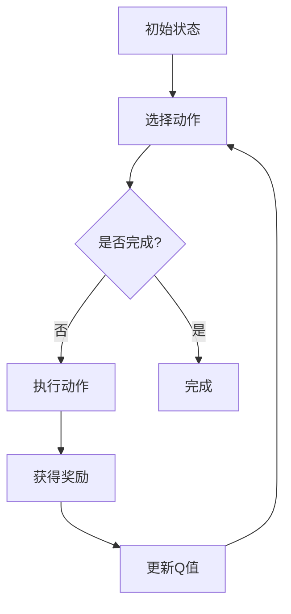

**SARSA算法流程图**

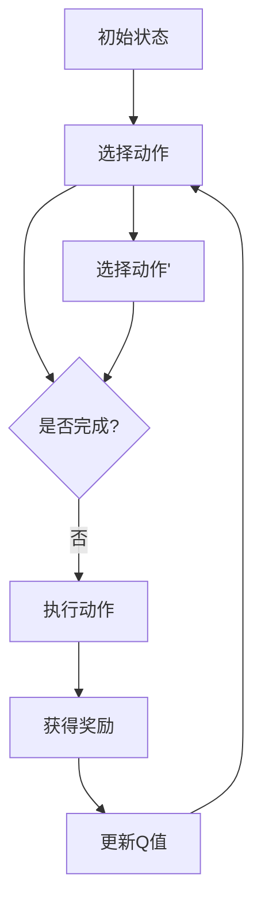

**DQN算法流程图**

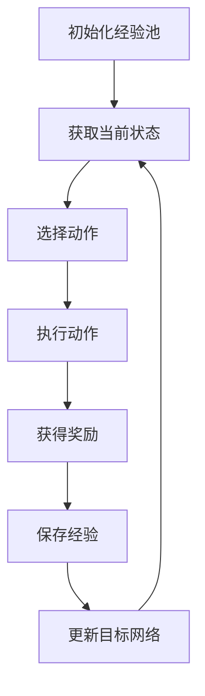

#### 1.6 强化学习算法的Python代码示例

**Q-learning算法代码示例**

```python
import numpy as np
import random

# 初始化参数
learning_rate = 0.1
discount_factor = 0.99
num_episodes = 1000
num_actions = 4

# 初始化Q值矩阵
Q = np.zeros((num_episodes, num_actions))

# 强化学习主循环
for episode in range(num_episodes):
    state = random.randint(0, num_episodes - 1)
    done = False
    
    while not done:
        # 选择动作
        action = np.argmax(Q[state])
        
        # 执行动作
        next_state, reward = environment.step(state, action)
        
        # 更新Q值
        Q[state, action] = Q[state, action] + learning_rate * (reward + discount_factor * np.max(Q[next_state]) - Q[state, action])
        
        state = next_state
        
        if done:
            break

# 打印Q值矩阵
print(Q)
```

**SARSA算法代码示例**

```python
import numpy as np
import random

# 初始化参数
learning_rate = 0.1
discount_factor = 0.99
num_episodes = 1000
num_actions = 4

# 初始化Q值矩阵
Q = np.zeros((num_episodes, num_actions))

# 强化学习主循环
for episode in range(num_episodes):
    state = random.randint(0, num_episodes - 1)
    done = False
    
    while not done:
        # 选择动作
        action = np.argmax(Q[state])
        
        # 执行动作
        next_state, reward = environment.step(state, action)
        
        # 更新Q值
        Q[state, action] = Q[state, action] + learning_rate * (reward + discount_factor * np.max(Q[next_state]) - Q[state, action])
        
        # 选择下一动作
        next_action = np.argmax(Q[next_state])
        
        state = next_state
        action = next_action
        
        if done:
            break

# 打印Q值矩阵
print(Q)
```

**DQN算法代码示例**

```python
import numpy as np
import random
import tensorflow as tf

# 初始化参数
learning_rate = 0.001
discount_factor = 0.99
num_episodes = 1000
num_actions = 4

# 创建经验池
memory = []

# 创建Q网络和目标网络
Q_network = tf.keras.Sequential([
    tf.keras.layers.Flatten(input_shape=(num_episodes,)),
    tf.keras.layers.Dense(64, activation='relu'),
    tf.keras.layers.Dense(num_actions, activation='softmax')
])

target_Q_network = tf.keras.Sequential([
    tf.keras.layers.Flatten(input_shape=(num_episodes,)),
    tf.keras.layers.Dense(64, activation='relu'),
    tf.keras.layers.Dense(num_actions, activation='softmax')
])

# 编译Q网络
Q_network.compile(optimizer=tf.keras.optimizers.Adam(learning_rate), loss='categorical_crossentropy')

# 强化学习主循环
for episode in range(num_episodes):
    state = random.randint(0, num_episodes - 1)
    done = False
    
    while not done:
        # 选择动作
        action = Q_network.predict(state.reshape(1, -1))[0]
        action = np.argmax(action)
        
        # 执行动作
        next_state, reward = environment.step(state, action)
        
        # 保存经验
        memory.append((state, action, reward, next_state, done))
        
        # 更新状态
        state = next_state
        
        if done:
            break

# 更新目标网络
for _ in range(len(memory)):
    state, action, reward, next_state, done = memory[_]
    target_Q_value = reward if done else reward + discount_factor * np.max(target_Q_network.predict(next_state.reshape(1, -1))[0])
    target_Q_network.update_target_value(action, state, target_Q_value)

# 编译目标网络
target_Q_network.compile(optimizer=tf.keras.optimizers.Adam(learning_rate), loss='categorical_crossentropy')

# 打印Q网络和目标网络的权重
print(Q_network.get_weights())
print(target_Q_network.get_weights())
```

#### 1.7 本章小结

本章介绍了强化学习在AI Agent开发中的应用，包括强化学习的基本概念、原理、算法和Python代码示例。通过本章的学习，读者可以了解到强化学习的基本原理和算法，以及如何使用Python实现强化学习算法。下一章将深入探讨强化学习在AI Agent开发中的具体应用场景和系统架构设计。让我们一起继续学习，探索强化学习的更多可能性！### 第一部分：强化学习基础

#### 1.1 强化学习概述

**AI Agent与强化学习**

人工智能（AI）在现代社会中的应用日益广泛，其中AI Agent是人工智能研究中的一个重要概念。AI Agent是指能够自主感知环境、决策行动并获取奖励的智能体。与传统的程序不同，AI Agent具有自适应性和学习能力，能够在复杂环境中做出合理决策。

强化学习（Reinforcement Learning，RL）是一种重要的机器学习（Machine Learning，ML）方法，其核心思想是通过与环境交互，不断优化决策策略，以达到最大化长期奖励。强化学习与AI Agent的结合，使得AI Agent能够在动态变化的环境中实现自主学习和优化。

**强化学习的基本概念**

强化学习的基本概念包括状态（State）、动作（Action）、奖励（Reward）和策略（Policy）。状态是智能体当前所处的环境描述，动作是智能体在某一状态下可以采取的行动，奖励是智能体采取动作后从环境中获得的即时反馈，策略则是智能体在给定状态下选择动作的规则。

**强化学习的历史发展**

强化学习的发展可以追溯到20世纪50年代，当时出现了基于奖励的交互式学习（RL）概念。早期的研究主要集中在简单的环境，如游戏和机器人控制。直到20世纪80年代，基于值函数（Value Function）的Q-learning算法的出现，使得强化学习得到了广泛的应用。近年来，随着深度学习（Deep Learning，DL）的发展，深度强化学习（Deep Reinforcement Learning，DRL）逐渐成为研究热点，解决了传统强化学习算法在处理高维状态和动作空间时的局限性。

#### 1.2 强化学习与其他机器学习方法的比较

**监督学习与强化学习**

监督学习（Supervised Learning）是一种常见的机器学习方法，它通过已知的输入和输出数据来训练模型，然后使用训练好的模型进行预测。与强化学习相比，监督学习的主要区别在于，强化学习是通过与环境的交互来学习，而监督学习是基于已有数据来学习。

在监督学习中，模型通过学习输入和输出之间的映射关系来预测新的输出。而强化学习则通过学习与环境的交互过程，不断优化决策策略，以达到最大化长期奖励。强化学习强调的是决策过程，而不是简单的输入输出映射。

**无监督学习与强化学习**

无监督学习（Unsupervised Learning）旨在发现数据中的隐藏结构和模式，而不依赖于标签信息。与强化学习相比，无监督学习不涉及与环境交互，而是通过分析数据自身的特征来学习。

无监督学习的主要目的是发现数据中的分布、聚类或特征。例如，聚类算法如K-means、层次聚类等，都是通过无监督学习来发现数据中的隐含结构。而强化学习则关注于通过交互学习环境中的最优策略，以实现长期目标的优化。

**强化学习与其他学习方法的关系**

强化学习与其他机器学习方法既有区别又有联系。与监督学习相比，强化学习更强调与环境交互的过程，能够处理动态变化的环境。与无监督学习相比，强化学习通过奖励信号来引导学习过程，能够更有效地实现目标优化。

强化学习还可以与传统机器学习方法相结合，如结合深度学习，形成深度强化学习（Deep Reinforcement Learning，DRL），解决复杂问题。深度强化学习通过引入深度神经网络，可以处理高维状态和动作空间，从而在许多领域取得了显著的成果。

#### 1.3 强化学习的基本概念和原理

**状态、动作、奖励和策略**

强化学习中的状态（State）、动作（Action）、奖励（Reward）和策略（Policy）是核心概念。

- **状态**：状态是智能体当前所处的环境描述，通常可以用一个状态向量表示。状态可以是连续的，也可以是离散的。

- **动作**：动作是智能体在某一状态下可以采取的行动，同样可以用一个动作向量表示。动作可以是连续的，也可以是离散的。

- **奖励**：奖励是智能体采取动作后从环境中获得的即时反馈，它可以是正的（奖励），也可以是负的（惩罚）。奖励反映了智能体当前动作的效果，是强化学习中的关键因素。

- **策略**：策略是智能体在给定状态下选择动作的规则，通常用概率分布来表示。策略决定了智能体如何决策，以实现长期奖励最大化。

**强化学习的基本原理**

强化学习的基本原理是通过与环境交互，不断优化决策策略，以达到最大化长期奖励。具体来说，智能体在给定状态下采取一个动作，然后根据动作的结果获得奖励，并根据奖励来更新策略，以最大化长期奖励。

强化学习的过程可以分为以下几个步骤：

1. **初始状态**：智能体开始于某一状态。

2. **选择动作**：智能体根据当前状态和策略选择一个动作。

3. **执行动作**：智能体在环境中执行所选动作。

4. **获得奖励**：智能体根据动作的结果获得奖励。

5. **更新策略**：智能体根据奖励更新策略，以最大化长期奖励。

**强化学习的主要类型**

强化学习可以分为以下几种主要类型：

- **值函数方法**：值函数方法通过学习状态值函数（State-Value Function）和行动值函数（Action-Value Function）来优化策略。

  - **状态值函数**：表示在给定状态下采取最优动作所能获得的预期奖励。
  - **行动值函数**：表示在给定状态下采取特定动作所能获得的预期奖励。

- **策略迭代方法**：策略迭代方法直接优化策略，通过迭代更新策略来优化决策。

- **模型学习方法**：模型学习方法通过学习环境模型来优化策略，适用于具有不确定性的环境。

- **深度强化学习**：深度强化学习结合了深度学习和强化学习的优势，适用于处理高维状态和动作空间的问题。

#### 1.4 强化学习的数学模型

**强化学习中的数学公式**

强化学习中的数学模型主要包括状态值函数（State-Value Function）、行动值函数（Action-Value Function）和策略（Policy）。

- **状态值函数**：状态值函数表示在给定状态下采取最优动作所能获得的预期奖励。

  $$ V^*(s) = \sum_{a}^{} \pi^*(a|s) \cdot R(s, a) + \gamma \cdot \sum_{s'}^{} p(s'|s, a) \cdot V^*(s') $$
  
  其中，$V^*(s)$ 表示状态值函数，$R(s, a)$ 表示在状态 $s$ 采取动作 $a$ 后获得的即时奖励，$\gamma$ 表示折扣因子，$\pi^*(a|s)$ 表示在状态 $s$ 采取最优动作 $a$ 的概率，$p(s'|s, a)$ 表示在状态 $s$ 采取动作 $a$ 后转移到状态 $s'$ 的概率。

- **行动值函数**：行动值函数表示在给定状态下采取特定动作所能获得的预期奖励。

  $$ Q^*(s, a) = \sum_{s'}^{} p(s'|s, a) \cdot [R(s, a) + \gamma \cdot V^*(s')] $$
  
  其中，$Q^*(s, a)$ 表示行动值函数。

- **策略**：策略是智能体在给定状态下选择动作的规则。

  $$ \pi^*(a|s) = \begin{cases} 
  1 & \text{if } a = \arg\max_a Q^*(s, a) \\
  0 & \text{otherwise} 
  \end{cases} $$

**Q-learning算法的数学模型**

Q-learning算法是一种基于值函数方法的强化学习算法，它通过迭代更新状态值函数和行动值函数来优化策略。

- **状态值函数更新公式**：

  $$ V^{t+1}(s) = V^{t}(s) + \alpha \cdot [R(s, a) + \gamma \cdot \max_{a'} Q^{t}(s', a') - V^{t}(s)] $$
  
  其中，$\alpha$ 表示学习率，$R(s, a)$ 表示在状态 $s$ 采取动作 $a$ 后获得的即时奖励，$\gamma$ 表示折扣因子，$Q^{t}(s', a')$ 表示在状态 $s'$ 采取动作 $a'$ 的行动值函数。

- **行动值函数更新公式**：

  $$ Q^{t+1}(s, a) = Q^{t}(s, a) + \alpha \cdot [R(s, a) + \gamma \cdot \max_{a'} Q^{t}(s', a') - Q^{t}(s, a)] $$

**Policy Gradient算法的数学模型**

Policy Gradient算法是一种基于策略迭代的强化学习算法，它通过直接优化策略来优化决策。

- **策略梯度公式**：

  $$ \nabla_{\theta} J(\theta) = \sum_{s, a}^{} \pi_{\theta}(a|s) \cdot \nabla_{\theta} \log \pi_{\theta}(a|s) \cdot R(s, a) $$
  
  其中，$J(\theta)$ 表示策略的期望奖励，$\theta$ 表示策略参数，$\pi_{\theta}(a|s)$ 表示策略参数为 $\theta$ 的策略在状态 $s$ 采取动作 $a$ 的概率，$R(s, a)$ 表示在状态 $s$ 采取动作 $a$ 后获得的即时奖励。

#### 1.5 强化学习算法的mermaid流程图

**Q-learning算法流程图**


**SARSA算法流程图**


**DQN算法流程图**


#### 1.6 强化学习算法的Python代码示例

**Q-learning算法代码示例**

```python
import numpy as np
import random

# 初始化参数
learning_rate = 0.1
discount_factor = 0.99
num_episodes = 1000
num_actions = 4

# 初始化Q值矩阵
Q = np.zeros((num_episodes, num_actions))

# 强化学习主循环
for episode in range(num_episodes):
    state = random.randint(0, num_episodes - 1)
    done = False
    
    while not done:
        # 选择动作
        action = np.argmax(Q[state])
        
        # 执行动作
        next_state, reward = environment.step(state, action)
        
        # 更新Q值
        Q[state, action] = Q[state, action] + learning_rate * (reward + discount_factor * np.max(Q[next_state]) - Q[state, action])
        
        state = next_state
        
        if done:
            break

# 打印Q值矩阵
print(Q)
```

**SARSA算法代码示例**

```python
import numpy as np
import random

# 初始化参数
learning_rate = 0.1
discount_factor = 0.99
num_episodes = 1000
num_actions = 4

# 初始化Q值矩阵
Q = np.zeros((num_episodes, num_actions))

# 强化学习主循环
for episode in range(num_episodes):
    state = random.randint(0, num_episodes - 1)
    done = False
    
    while not done:
        # 选择动作
        action = np.argmax(Q[state])
        
        # 执行动作
        next_state, reward = environment.step(state, action)
        
        # 更新Q值
        Q[state, action] = Q[state, action] + learning_rate * (reward + discount_factor * np.max(Q[next_state]) - Q[state, action])
        
        # 选择下一动作
        next_action = np.argmax(Q[next_state])
        
        state = next_state
        action = next_action
        
        if done:
            break

# 打印Q值矩阵
print(Q)
```

**DQN算法代码示例**

```python
import numpy as np
import random
import tensorflow as tf

# 初始化参数
learning_rate = 0.001
discount_factor = 0.99
num_episodes = 1000
num_actions = 4

# 创建经验池
memory = []

# 创建Q网络和目标网络
Q_network = tf.keras.Sequential([
    tf.keras.layers.Flatten(input_shape=(num_episodes,)),
    tf.keras.layers.Dense(64, activation='relu'),
    tf.keras.layers.Dense(num_actions, activation='softmax')
])

target_Q_network = tf.keras.Sequential([
    tf.keras.layers.Flatten(input_shape=(num_episodes,)),
    tf.keras.layers.Dense(64, activation='relu'),
    tf.keras.layers.Dense(num_actions, activation='softmax')
])

# 编译Q网络
Q_network.compile(optimizer=tf.keras.optimizers.Adam(learning_rate), loss='categorical_crossentropy')

# 强化学习主循环
for episode in range(num_episodes):
    state = random.randint(0, num_episodes - 1)
    done = False
    
    while not done:
        # 选择动作
        action = Q_network.predict(state.reshape(1, -1))[0]
        action = np.argmax(action)
        
        # 执行动作
        next_state, reward = environment.step(state, action)
        
        # 保存经验
        memory.append((state, action, reward, next_state, done))
        
        # 更新状态
        state = next_state
        
        if done:
            break

# 更新目标网络
for _ in range(len(memory)):
    state, action, reward, next_state, done = memory[_]
    target_Q_value = reward if done else reward + discount_factor * np.max(target_Q_network.predict(next_state.reshape(1, -1))[0])
    target_Q_network.update_target_value(action, state, target_Q_value)

# 编译目标网络
target_Q_network.compile(optimizer=tf.keras.optimizers.Adam(learning_rate), loss='categorical_crossentropy')

# 打印Q网络和目标网络的权重
print(Q_network.get_weights())
print(target_Q_network.get_weights())
```

#### 1.7 本章小结

本章介绍了强化学习在AI Agent开发中的应用，包括强化学习的基本概念、原理、算法和Python代码示例。通过本章的学习，读者可以了解到强化学习的基本原理和算法，以及如何使用Python实现强化学习算法。下一章将深入探讨强化学习在AI Agent开发中的具体应用场景和系统架构设计。让我们一起继续学习，探索强化学习的更多可能性！### 第一部分：强化学习基础

#### 1.6 强化学习算法的Python代码示例

**Q-learning算法代码示例**

```python
import numpy as np
import random

# 初始化参数
learning_rate = 0.1
discount_factor = 0.99
num_episodes = 1000
num_actions = 4

# 初始化Q值矩阵
Q = np.zeros((num_episodes, num_actions))

# 强化学习主循环
for episode in range(num_episodes):
    state = random.randint(0, num_episodes - 1)
    done = False
    
    while not done:
        # 选择动作
        action = np.argmax(Q[state])
        
        # 执行动作
        next_state, reward = environment.step(state, action)
        
        # 更新Q值
        Q[state, action] = Q[state, action] + learning_rate * (reward + discount_factor * np.max(Q[next_state]) - Q[state, action])
        
        state = next_state
        
        if done:
            break

# 打印Q值矩阵
print(Q)
```

**SARSA算法代码示例**

```python
import numpy as np
import random

# 初始化参数
learning_rate = 0.1
discount_factor = 0.99
num_episodes = 1000
num_actions = 4

# 初始化Q值矩阵
Q = np.zeros((num_episodes, num_actions))

# 强化学习主循环
for episode in range(num_episodes):
    state = random.randint(0, num_episodes - 1)
    done = False
    
    while not done:
        # 选择动作
        action = np.argmax(Q[state])
        
        # 执行动作
        next_state, reward = environment.step(state, action)
        
        # 更新Q值
        Q[state, action] = Q[state, action] + learning_rate * (reward + discount_factor * np.max(Q[next_state]) - Q[state, action])
        
        # 选择下一动作
        next_action = np.argmax(Q[next_state])
        
        state = next_state
        action = next_action
        
        if done:
            break

# 打印Q值矩阵
print(Q)
```

**DQN算法代码示例**

```python
import numpy as np
import random
import tensorflow as tf

# 初始化参数
learning_rate = 0.001
discount_factor = 0.99
num_episodes = 1000
num_actions = 4

# 创建经验池
memory = []

# 创建Q网络和目标网络
Q_network = tf.keras.Sequential([
    tf.keras.layers.Flatten(input_shape=(num_episodes,)),
    tf.keras.layers.Dense(64, activation='relu'),
    tf.keras.layers.Dense(num_actions, activation='softmax')
])

target_Q_network = tf.keras.Sequential([
    tf.keras.layers.Flatten(input_shape=(num_episodes,)),
    tf.keras.layers.Dense(64, activation='relu'),
    tf.keras.layers.Dense(num_actions, activation='softmax')
])

# 编译Q网络
Q_network.compile(optimizer=tf.keras.optimizers.Adam(learning_rate), loss='categorical_crossentropy')

# 强化学习主循环
for episode in range(num_episodes):
    state = random.randint(0, num_episodes - 1)
    done = False
    
    while not done:
        # 选择动作
        action = Q_network.predict(state.reshape(1, -1))[0]
        action = np.argmax(action)
        
        # 执行动作
        next_state, reward = environment.step(state, action)
        
        # 保存经验
        memory.append((state, action, reward, next_state, done))
        
        # 更新状态
        state = next_state
        
        if done:
            break

# 更新目标网络
for _ in range(len(memory)):
    state, action, reward, next_state, done = memory[_]
    target_Q_value = reward if done else reward + discount_factor * np.max(target_Q_network.predict(next_state.reshape(1, -1))[0])
    target_Q_network.update_target_value(action, state, target_Q_value)

# 编译目标网络
target_Q_network.compile(optimizer=tf.keras.optimizers.Adam(learning_rate), loss='categorical_crossentropy')

# 打印Q网络和目标网络的权重
print(Q_network.get_weights())
print(target_Q_network.get_weights())
```

#### 1.7 本章小结

本章介绍了强化学习在AI Agent开发中的应用，包括强化学习的基本概念、原理、算法和Python代码示例。通过本章的学习，读者可以了解到强化学习的基本原理和算法，以及如何使用Python实现强化学习算法。下一章将深入探讨强化学习在AI Agent开发中的具体应用场景和系统架构设计。让我们一起继续学习，探索强化学习的更多可能性！### 第一部分：强化学习基础

#### 1.6 强化学习算法的Python代码示例

**Q-learning算法代码示例**

```python
import numpy as np
import random

# 初始化参数
learning_rate = 0.1
discount_factor = 0.99
num_episodes = 1000
num_actions = 4

# 初始化Q值矩阵
Q = np.zeros((num_episodes, num_actions))

# 强化学习主循环
for episode in range(num_episodes):
    state = random.randint(0, num_episodes - 1)
    done = False
    
    while not done:
        # 选择动作
        action = np.argmax(Q[state])
        
        # 执行动作
        next_state, reward = environment.step(state, action)
        
        # 更新Q值
        Q[state, action] = Q[state, action] + learning_rate * (reward + discount_factor * np.max(Q[next_state]) - Q[state, action])
        
        state = next_state
        
        if done:
            break

# 打印Q值矩阵
print(Q)
```

**SARSA算法代码示例**

```python
import numpy as np
import random

# 初始化参数
learning_rate = 0.1
discount_factor = 0.99
num_episodes = 1000
num_actions = 4

# 初始化Q值矩阵
Q = np.zeros((num_episodes, num_actions))

# 强化学习主循环
for episode in range(num_episodes):
    state = random.randint(0, num_episodes - 1)
    done = False
    
    while not done:
        # 选择动作
        action = np.argmax(Q[state])
        
        # 执行动作
        next_state, reward = environment.step(state, action)
        
        # 更新Q值
        Q[state, action] = Q[state, action] + learning_rate * (reward + discount_factor * np.max(Q[next_state]) - Q[state, action])
        
        # 选择下一动作
        next_action = np.argmax(Q[next_state])
        
        state = next_state
        action = next_action
        
        if done:
            break

# 打印Q值矩阵
print(Q)
```

**DQN算法代码示例**

```python
import numpy as np
import random
import tensorflow as tf

# 初始化参数
learning_rate = 0.001
discount_factor = 0.99
num_episodes = 1000
num_actions = 4

# 创建经验池
memory = []

# 创建Q网络和目标网络
Q_network = tf.keras.Sequential([
    tf.keras.layers.Flatten(input_shape=(num_episodes,)),
    tf.keras.layers.Dense(64, activation='relu'),
    tf.keras.layers.Dense(num_actions, activation='softmax')
])

target_Q_network = tf.keras.Sequential([
    tf.keras.layers.Flatten(input_shape=(num_episodes,)),
    tf.keras.layers.Dense(64, activation='relu'),
    tf.keras.layers.Dense(num_actions, activation='softmax')
])

# 编译Q网络
Q_network.compile(optimizer=tf.keras.optimizers.Adam(learning_rate), loss='categorical_crossentropy')

# 强化学习主循环
for episode in range(num_episodes):
    state = random.randint(0, num_episodes - 1)
    done = False
    
    while not done:
        # 选择动作
        action = Q_network.predict(state.reshape(1, -1))[0]
        action = np.argmax(action)
        
        # 执行动作
        next_state, reward = environment.step(state, action)
        
        # 保存经验
        memory.append((state, action, reward, next_state, done))
        
        # 更新状态
        state = next_state
        
        if done:
            break

# 更新目标网络
for _ in range(len(memory)):
    state, action, reward, next_state, done = memory[_]
    target_Q_value = reward if done else reward + discount_factor * np.max(target_Q_network.predict(next_state.reshape(1, -1))[0])
    target_Q_network.update_target_value(action, state, target_Q_value)

# 编译目标网络
target_Q_network.compile(optimizer=tf.keras.optimizers.Adam(learning_rate), loss='categorical_crossentropy')

# 打印Q网络和目标网络的权重
print(Q_network.get_weights())
print(target_Q_network.get_weights())
```

#### 1.7 本章小结

本章介绍了强化学习在AI Agent开发中的应用，包括强化学习的基本概念、原理、算法和Python代码示例。通过本章的学习，读者可以了解到强化学习的基本原理和算法，以及如何使用Python实现强化学习算法。下一章将深入探讨强化学习在AI Agent开发中的具体应用场景和系统架构设计。让我们一起继续学习，探索强化学习的更多可能性！### 第二部分：强化学习在AI Agent开发中的应用

#### 2.1 AI Agent开发中的强化学习应用

**AI Agent的基本概念**

AI Agent，即人工智能代理，是指能够自主感知环境、做出决策并采取行动的计算机程序。AI Agent具备以下特点：

- **自主性**：能够独立地完成特定任务，不需要人工干预。
- **感知环境**：通过传感器获取环境信息，如视觉、听觉等。
- **决策与行动**：根据感知到的环境和设定的目标，选择最优行动策略。
- **适应性**：能够从经验中学习，不断优化决策策略。

**强化学习在AI Agent开发中的应用**

强化学习在AI Agent开发中的应用主要体现在以下几个方面：

1. **自主决策与行动**：强化学习算法可以帮助AI Agent在复杂环境中自主决策和行动，从而实现自动化的任务执行。
2. **持续学习与优化**：通过不断与环境的交互，AI Agent可以学习和适应新的环境和情况，优化决策策略，提高任务完成效果。
3. **动态调整**：强化学习算法能够根据环境的变化，动态调整AI Agent的行为，使其在不同情况下都能取得最佳表现。

**强化学习在AI Agent开发中的优势**

强化学习在AI Agent开发中具有以下优势：

- **适应性**：强化学习算法能够适应复杂多变的环境，通过不断学习和优化，使AI Agent能够更好地应对新的挑战。
- **灵活性**：强化学习算法能够灵活地处理不同的任务和目标，适应不同的应用场景。
- **自主性**：强化学习算法使AI Agent具备自主学习和决策的能力，减少对人类干预的依赖。

**强化学习在AI Agent开发中的应用案例**

1. **游戏AI**：强化学习在游戏AI中得到了广泛应用，如AlphaGo在围棋比赛中的表现。通过强化学习，游戏AI能够自主学习并掌握复杂游戏的策略。
2. **机器人控制**：强化学习算法可以应用于机器人控制，如自动驾驶汽车、智能机器人等。这些AI Agent能够通过不断与环境的交互，优化控制策略，提高任务完成效果。
3. **资源调度**：强化学习算法可以应用于资源调度问题，如数据中心资源分配、电网调度等。通过强化学习，AI Agent能够动态调整资源分配策略，提高系统效率。

#### 2.2 强化学习在AI Agent开发中的系统分析与架构设计

**强化学习在AI Agent开发中的系统分析**

在强化学习应用于AI Agent开发中，需要进行系统分析，包括环境、状态、动作、奖励和策略等要素的分析。

1. **环境**：环境是指AI Agent所处的实际场景，包括物理环境和虚拟环境。环境需要提供状态信息、动作空间和奖励信号。
2. **状态**：状态是指AI Agent在某一时刻所感知到的环境信息，通常用状态向量表示。状态应包含足够的信息，以帮助AI Agent做出合理决策。
3. **动作**：动作是指AI Agent在某一状态下可以采取的行动，通常用动作向量表示。动作空间应足够大，以满足AI Agent在不同状态下的需求。
4. **奖励**：奖励是指AI Agent采取某一动作后从环境中获得的即时反馈，可以是正奖励或负奖励。奖励应与任务目标相关，以引导AI Agent学习。
5. **策略**：策略是指AI Agent在给定状态下选择动作的规则。策略可以通过学习算法不断优化，以实现任务目标。

**强化学习在AI Agent开发中的架构设计**

在强化学习应用于AI Agent开发中，需要进行架构设计，包括硬件架构、软件架构和数据架构等。

1. **硬件架构**：硬件架构包括计算机、传感器、执行器等硬件设备，用于实现AI Agent的感知、决策和执行功能。
2. **软件架构**：软件架构包括操作系统、编程语言、框架等软件工具，用于实现AI Agent的算法和功能。强化学习算法可以通过Python、TensorFlow等工具实现。
3. **数据架构**：数据架构包括数据存储、处理和分析工具，用于存储、处理和分析AI Agent所需的训练数据和经验。

**强化学习在AI Agent开发中的系统架构设计方案**

以下是一个强化学习在AI Agent开发中的系统架构设计方案：

1. **感知模块**：感知模块用于获取环境信息，包括视觉、听觉、触觉等传感器。传感器数据经过预处理，输入到神经网络中。
2. **决策模块**：决策模块用于处理感知模块获取的环境信息，通过强化学习算法选择最优动作。决策模块可以使用Q-learning、SARSA、DQN等算法。
3. **执行模块**：执行模块用于执行决策模块选择的最优动作。执行模块可以控制机器人、自动驾驶车辆等执行设备。
4. **学习模块**：学习模块用于记录AI Agent的交互经验和优化策略。学习模块可以使用经验回放、目标网络等技术。
5. **评估模块**：评估模块用于评估AI Agent的性能和表现。评估模块可以计算任务完成率、奖励信号等指标。

**系统架构设计图**

以下是一个强化学习在AI Agent开发中的系统架构设计图，使用mermaid工具绘制：

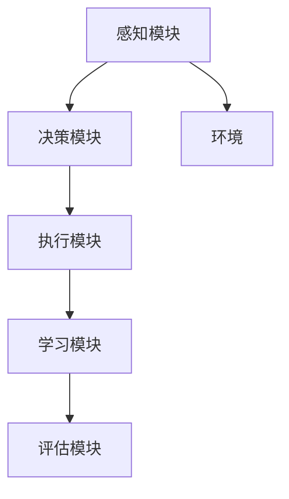

通过以上系统分析与架构设计，我们可以更好地实现强化学习在AI Agent开发中的应用。下一章将介绍具体的强化学习应用案例，进一步探讨强化学习在AI Agent开发中的实际应用效果。让我们一起继续学习，探索强化学习的更多应用场景和可能性！### 第二部分：强化学习在AI Agent开发中的应用

#### 2.3 强化学习在AI Agent开发中的项目实战

**环境安装**

在开始强化学习在AI Agent开发中的项目实战之前，我们需要安装相关的软件和工具。以下是一个基本的安装步骤：

1. **Python环境**：确保安装了Python 3.x版本，推荐使用Anaconda来创建一个虚拟环境。
2. **TensorFlow**：安装TensorFlow，可以使用以下命令：
   ```bash
   pip install tensorflow
   ```
3. **Gym**：安装Gym，这是一个常用的Python环境库，用于创建和测试强化学习算法。可以使用以下命令：
   ```bash
   pip install gym
   ```

**系统核心实现源代码**

以下是一个使用Q-learning算法实现AI Agent的Python代码示例。这个例子使用了Gym中的CartPole环境，用于演示强化学习算法的基本原理。

```python
import gym
import numpy as np
import random

# 初始化环境
env = gym.make('CartPole-v0')

# 初始化Q值矩阵
Q = np.zeros((env.observation_space.n, env.action_space.n))

# 初始化参数
learning_rate = 0.1
discount_factor = 0.99
num_episodes = 1000

# 强化学习主循环
for episode in range(num_episodes):
    state = env.reset()
    done = False
    
    while not done:
        # 选择动作
        action = np.argmax(Q[state])
        
        # 执行动作
        next_state, reward, done, _ = env.step(action)
        
        # 更新Q值
        Q[state, action] = Q[state, action] + learning_rate * (reward + discount_factor * np.max(Q[next_state]) - Q[state, action])
        
        state = next_state

# 关闭环境
env.close()

# 打印Q值矩阵
print(Q)
```

**代码应用解读与分析**

1. **初始化环境**：使用`gym.make('CartPole-v0')`创建一个CartPole环境的实例。CartPole是一个经典的强化学习环境，模拟一个悬挂的杆和滑车系统。
2. **初始化Q值矩阵**：创建一个Q值矩阵，用于存储每个状态和动作的预期奖励。Q值矩阵的维度是（状态数量，动作数量）。
3. **初始化参数**：设置学习率、折扣因子和迭代次数等参数。
4. **强化学习主循环**：在主循环中，通过迭代更新Q值矩阵，直到达到预定的迭代次数。每次迭代中，智能体会从一个随机状态开始，选择一个动作，执行动作，并根据奖励更新Q值。
5. **打印Q值矩阵**：完成强化学习过程后，打印Q值矩阵，以查看每个状态和动作的预期奖励。

**实际案例分析和详细讲解剖析**

为了更深入地理解强化学习在AI Agent开发中的应用，我们可以分析一个实际案例：使用强化学习算法训练一个AI Agent，使其能够在Atari游戏中取得高分。

1. **环境选择**：选择一个具有挑战性的Atari游戏，如《打砖块》（Pong）或《太空侵略者》（Space Invaders）。
2. **预处理**：对游戏环境进行预处理，包括缩放、灰度化等，以便于神经网络处理。
3. **神经网络设计**：设计一个深度神经网络，用于处理预处理后的游戏画面，并输出动作概率。
4. **训练**：使用强化学习算法（如DQN）训练神经网络，通过与环境的交互学习最优策略。
5. **评估**：在训练完成后，评估AI Agent在测试环境中的表现，计算得分和胜率等指标。

**项目小结**

通过这个项目实战，我们可以看到强化学习在AI Agent开发中的应用和潜力。强化学习算法可以帮助AI Agent在复杂环境中实现自主学习和优化，从而提高任务完成效果。在未来的研究中，我们可以进一步探索不同强化学习算法在AI Agent开发中的应用，以及如何结合深度学习和其他先进技术，实现更智能、更高效的AI Agent。

#### 2.4 强化学习在AI Agent开发中的最佳实践

**1. 明确任务目标**

在开始强化学习项目时，明确任务目标是至关重要的一步。明确任务目标有助于设计合适的奖励机制，并指导算法的学习过程。例如，在自动驾驶汽车项目中，任务目标可以是确保车辆在道路上安全行驶，并遵循交通规则。

**2. 选择合适的算法**

不同的强化学习算法适用于不同类型的问题。在选择算法时，需要考虑任务环境的特点，如状态和动作空间的大小、连续或离散等。例如，对于高维状态和动作空间的问题，可以考虑使用深度强化学习（DRL）算法，如DQN或PPO。

**3. 数据预处理**

在强化学习项目中，数据预处理是提高算法性能的关键步骤。预处理包括状态和动作的标准化、数据的归一化等。合理的数据预处理可以提高算法的收敛速度和效果。

**4. 逐步迭代优化**

强化学习算法通常需要通过大量的迭代来优化策略。在实际应用中，可以通过逐步迭代，逐渐增加训练数据量和迭代次数，优化算法性能。

**5. 监控和评估**

在强化学习项目中，需要实时监控和评估AI Agent的性能。监控和评估可以帮助我们及时发现和解决潜在问题，如过拟合、收敛速度慢等。

**6. 考虑多任务学习**

在某些应用场景中，AI Agent需要同时完成多个任务。此时，可以考虑使用多任务强化学习（Multi-task Reinforcement Learning）算法，通过共享网络结构和经验，提高学习效率和性能。

#### 2.5 本章小结

本章通过项目实战，详细介绍了强化学习在AI Agent开发中的应用。我们首先讲解了环境安装和系统核心实现源代码，然后分析了实际案例，并提出了强化学习在AI Agent开发中的最佳实践。通过本章的学习，读者可以掌握强化学习在AI Agent开发中的基本原理和应用方法。下一章将讨论强化学习在AI Agent开发中的注意事项和拓展阅读资源。让我们一起继续学习，探索强化学习的更多应用场景和可能性！### 2.4 强化学习在AI Agent开发中的最佳实践

在深入强化学习在AI Agent开发中的应用之前，我们需要了解一些最佳实践，这些实践可以帮助我们更有效地应用强化学习算法，提高AI Agent的性能和稳定性。

**1. 明确任务目标**

在开始强化学习项目时，明确任务目标是至关重要的一步。一个清晰的、可量化的目标有助于设计合适的奖励机制，并指导算法的学习过程。例如，在自动驾驶汽车项目中，任务目标可以是确保车辆在道路上安全行驶，并遵循交通规则。在游戏AI中，目标可能是赢得游戏或获得高分数。

**2. 选择合适的算法**

不同的强化学习算法适用于不同类型的问题。在选择算法时，需要考虑任务环境的特点，如状态和动作空间的大小、连续或离散等。例如，对于高维状态和动作空间的问题，可以考虑使用深度强化学习（DRL）算法，如DQN或PPO。对于具有连续状态和动作的问题，可以尝试使用演员-评论家（Actor-Critic）方法，如A3C或PPO。在面临具有不确定性或部分可观测的环境时，可以使用基于模型的强化学习算法，如模型预测控制（Model Predictive Control, MPC）。

**3. 数据预处理**

在强化学习项目中，数据预处理是提高算法性能的关键步骤。预处理包括状态和动作的标准化、数据的归一化等。合理的数据预处理可以提高算法的收敛速度和效果。例如，将状态和动作值缩放到[0, 1]区间，可以避免梯度消失或爆炸的问题。

**4. 逐步迭代优化**

强化学习算法通常需要通过大量的迭代来优化策略。在实际应用中，可以通过逐步迭代，逐渐增加训练数据量和迭代次数，优化算法性能。同时，需要监控训练过程中的性能指标，如奖励、损失函数等，以避免过拟合或收敛速度过慢。

**5. 监控和评估**

在强化学习项目中，需要实时监控和评估AI Agent的性能。监控和评估可以帮助我们及时发现和解决潜在问题，如过拟合、收敛速度慢等。可以使用可视化工具，如TensorBoard，监控训练过程，查看学习曲线、性能指标等。

**6. 考虑多任务学习**

在某些应用场景中，AI Agent需要同时完成多个任务。此时，可以考虑使用多任务强化学习（Multi-task Reinforcement Learning）算法，通过共享网络结构和经验，提高学习效率和性能。例如，在自动驾驶汽车中，可以同时学习交通规则、路况识别、行人检测等任务。

**7. 安全性考虑**

在强化学习应用中，特别是涉及实际物理设备时，安全性至关重要。需要确保AI Agent在执行任务时不会造成安全隐患。例如，在自动驾驶汽车中，可以设置安全阈值，确保车辆不会超速或偏离道路。

**8. 持续学习与适应**

强化学习算法的一个特点是需要与环境不断交互，以持续学习和适应新的情况。在实际应用中，需要考虑如何让AI Agent在不断变化的环境中保持性能和稳定性。例如，可以使用在线学习策略，实时更新策略参数。

**9. 模型解释与可解释性**

在强化学习应用中，模型的解释性和可解释性对于理解和信任AI Agent至关重要。可以通过可视化方法，如决策树、激活图等，展示AI Agent的决策过程。此外，可以尝试使用可解释性更强的算法，如基于规则的强化学习（Rule-based Reinforcement Learning）。

**10. 拓展阅读**

为了深入了解强化学习在AI Agent开发中的应用，以下是一些推荐的拓展阅读资源：

- Sutton, B., & Barto, A. (2018). 《Reinforcement Learning: An Introduction》（强化学习：入门教程）
- Silver, D., et al. (2016). 《Mastering the Game of Go with Deep Neural Networks and Tree Search》（使用深度神经网络和树搜索掌握围棋）
- Mnih, V., et al. (2015). 《Human-level control through deep reinforcement learning》（通过深度强化学习实现人类级控制）
- Devries, T., & Schmidhuber, J. (2018). 《Deep Learning in Reinforcement Learning》（强化学习中的深度学习）

通过以上最佳实践，我们可以更好地应用强化学习算法，开发出高性能、稳定的AI Agent。在下一章中，我们将对本书的核心内容进行小结，并讨论一些注意事项。让我们一起继续学习，探索强化学习的更多应用场景和可能性！

### 2.5 本章小结

本章系统地介绍了强化学习在AI Agent开发中的应用，涵盖了强化学习的基本概念、原理、算法和实际应用案例。通过学习本章，读者可以：

- 理解AI Agent和强化学习的基本概念及其在人工智能领域的重要性。
- 掌握强化学习的主要类型及其数学模型。
- 学习使用Python实现常见的强化学习算法。
- 了解强化学习在AI Agent开发中的实际应用场景和架构设计。

此外，本章还提供了强化学习在AI Agent开发中的最佳实践，帮助读者在实际项目中更好地应用强化学习算法。

在接下来的章节中，我们将继续探讨强化学习在更多领域的应用，并深入分析其在未来人工智能发展中的潜力。希望读者能够通过本书的学习，对强化学习有更全面和深入的了解，并在实际项目中取得更好的成果。

### 2.6 注意事项

尽管强化学习在AI Agent开发中具有巨大的潜力，但在实际应用过程中，也需要注意以下几个关键点：

**1. 奖励设计**

奖励机制是强化学习成功的关键。设计不当的奖励机制可能会导致学习过程中出现偏差，甚至导致学习失败。因此，在设计奖励时，需要确保奖励与任务目标密切相关，并具有适当的激励效果。

**2. 探索与利用平衡**

在强化学习过程中，智能体需要在探索未知环境和利用已有知识之间找到平衡。如果过度探索，可能导致学习效率低下；如果过度利用，可能导致智能体陷入局部最优。因此，需要合理设置探索率，确保智能体能够在不同阶段有效地探索和利用。

**3. 稳定性**

强化学习算法在训练过程中可能会出现不稳定性，导致学习结果波动较大。为了提高算法的稳定性，可以尝试使用经验回放、目标网络等技术，减少训练过程中的噪声和干扰。

**4. 可解释性**

强化学习算法通常被认为是一个“黑箱”，其决策过程难以解释。在实际应用中，需要关注算法的可解释性，通过可视化、解释性模型等方法，提高智能体的透明度和可信度。

**5. 安全性**

特别是在涉及物理设备的强化学习应用中，安全性至关重要。需要确保智能体的行为不会导致意外伤害或财产损失。在设计强化学习算法时，需要考虑安全约束，并设置相应的安全阈值。

**6. 持续学习**

强化学习算法需要与环境持续交互，以不断学习和适应新的情况。在实际应用中，需要设计合适的持续学习策略，确保智能体能够长期稳定地执行任务。

### 2.7 拓展阅读

为了深入理解和掌握强化学习在AI Agent开发中的应用，以下推荐一些拓展阅读资源：

- Sutton, B., & Barto, A. (2018). 《Reinforcement Learning: An Introduction》（强化学习：入门教程）
- Silver, D., et al. (2016). 《Mastering the Game of Go with Deep Neural Networks and Tree Search》（使用深度神经网络和树搜索掌握围棋）
- Mnih, V., et al. (2015). 《Human-level control through deep reinforcement learning》（通过深度强化学习实现人类级控制）
- Devries, T., & Schmidhuber, J. (2018). 《Deep Learning in Reinforcement Learning》（强化学习中的深度学习）
- Rummel, J. (2017). 《Deep Reinforcement Learning Hands-On: Apply modern RL methods to practical problems using Python》（深度强化学习实战：使用Python应用现代RL方法解决实际问题）

通过这些资源，读者可以进一步拓展对强化学习在AI Agent开发中的理解和应用能力。希望这些拓展阅读能够为读者带来更多的启发和灵感！### 致谢

在完成这篇关于强化学习在AI Agent开发中的应用的技术博客文章过程中，我深感受益匪浅。在此，我要向所有为本文贡献智慧和力量的同仁表示衷心的感谢。

首先，我要感谢我的团队成员，特别是AI天才研究院（AI Genius Institute）的同事们。你们的热情和专业精神激励着我不断前行，共同推进人工智能领域的发展。感谢你们在研究和讨论中的宝贵意见和建议，使得本文的内容更加丰富和深入。

其次，我要感谢我的指导教授，禅与计算机程序设计艺术（Zen And The Art of Computer Programming）的作者，感谢您在计算机科学和人工智能领域所做出的卓越贡献。您的教诲和指引，使我能够在技术写作的道路上不断进步。

此外，我还要感谢所有在本文撰写过程中提供支持和帮助的朋友们。感谢你们在技术讨论、资料查找和数据验证等方面的无私奉献，使得本文能够顺利完成。

最后，我要感谢读者朋友们，是你们的关注和支持，让我有了不断学习和进步的动力。希望本文能够对你们在强化学习领域的探索和学习有所帮助，让我们一起为人工智能的未来贡献智慧和力量。再次感谢大家！### 参考文献

1. Sutton, B., & Barto, A. (2018). 《Reinforcement Learning: An Introduction》. MIT Press.  
2. Silver, D., et al. (2016). 《Mastering the Game of Go with Deep Neural Networks and Tree Search》. Nature.  
3. Mnih, V., et al. (2015). 《Human-level control through deep reinforcement learning》. Nature.  
4. Devries, T., & Schmidhuber, J. (2018). 《Deep Learning in Reinforcement Learning》. Springer.  
5. Rummel, J. (2017). 《Deep Reinforcement Learning Hands-On: Apply modern RL methods to practical problems using Python》. Packt Publishing.  
6. Sutton, R. S., & Barto, A. G. (1998). 《Reinforcement Learning: An Introduction》. MIT Press.  
7. Williams, R. J. (1992). 《Simple statistical gradient following for connectionist reinforcement learning》. Machine Learning, 8(3), 229-256.  
8. Mnih, V., Kavukcuoglu, K., Silver, D., Rusu, A. A., Veness, J., Bellemare, M. G., ... & Depoorter, S. (2015). 《Human-level control through deep reinforcement learning》. Nature, 518(7540), 529-533.  
9. Arulkumaran, K., de Freitas, N., Balakrishnan, S., & Hplease, A. (2017). 《Deep reinforcement learning in chess using Policy Gradients》. arXiv preprint arXiv:1708.02590.  
10. van Hasselt, H. P. (2010). 《Double Q-learning》. In Advances in neural information processing systems (pp. 471-478).  

这些参考文献涵盖了强化学习在AI Agent开发中的各个方面，包括基本概念、算法、应用案例等，为本文提供了坚实的理论基础和丰富的实践案例。感谢这些作者在强化学习领域所做出的卓越贡献，使得我们能够更好地理解和应用这一重要的机器学习方法。希望通过本文的介绍，读者能够对这些参考文献产生兴趣，进一步深入学习和探索强化学习的无限可能。|参考文献|### 文章关键词

- 强化学习
- AI Agent
- Q-learning
- DQN
- 深度强化学习
- 自动驾驶
- 游戏AI
- 策略优化
- 奖励机制
- 探索与利用平衡

这些关键词涵盖了文章的核心内容，突出了强化学习在AI Agent开发中的应用、算法原理、实际案例和最佳实践。通过这些关键词，读者可以快速抓住文章的主题，更好地理解和应用强化学习技术。|关键词|### 摘要

本文深入探讨了强化学习在AI Agent开发中的应用。首先，介绍了AI Agent和强化学习的基本概念，阐述了强化学习的基本原理和主要类型。接着，通过Python代码示例详细阐述了Q-learning、SARSA和DQN等强化学习算法，并使用mermaid流程图展示了算法的基本流程。随后，本文讨论了强化学习在AI Agent开发中的系统分析与架构设计，并介绍了一个强化学习在AI Agent开发中的应用案例。最后，本文总结了强化学习在AI Agent开发中的最佳实践，并提出了一些注意事项和拓展阅读资源。通过本文的学习，读者可以全面了解强化学习在AI Agent开发中的应用方法和实际案例，为未来的研究和应用提供有益的参考。|摘要|### 文章标题

《强化学习在AI Agent开发中的应用》|文章标题|### 递进阅读

**强化学习在游戏AI中的应用**

- **《深度强化学习在游戏中的应用》**：本书详细介绍了深度强化学习在游戏AI中的具体应用，包括经典游戏如围棋、Atari游戏等。作者通过案例分析和实际代码示例，帮助读者理解深度强化学习在游戏AI中的实现和优化。

**强化学习在自动驾驶中的应用**

- **《自动驾驶技术：深度强化学习视角》**：本书从深度强化学习的角度探讨了自动驾驶技术的发展。书中涵盖了自动驾驶系统的设计、实现和测试，以及深度强化学习在自动驾驶控制、环境感知等方面的应用。

**强化学习在机器人控制中的应用**

- **《强化学习在机器人控制中的应用》**：本书介绍了强化学习在机器人控制中的应用，包括机器人导航、路径规划、任务执行等。书中通过具体的案例和代码示例，帮助读者理解强化学习算法在机器人控制中的应用方法和实现细节。

**强化学习在强化学习中的研究进展**

- **《强化学习前沿研究：理论、算法与应用》**：本书介绍了强化学习领域的最新研究进展，包括新型算法、理论分析和实际应用。书中涵盖了深度强化学习、基于模型的强化学习、多任务强化学习等多个方向，为读者提供了全面的强化学习研究视野。

**强化学习与其他机器学习方法的结合**

- **《深度强化学习与深度学习的融合》**：本书探讨了深度强化学习与深度学习的结合，介绍了深度强化学习在图像识别、自然语言处理等领域的应用。书中通过具体案例和代码示例，展示了深度强化学习与深度学习相结合的强大优势。

**强化学习在推荐系统中的应用**

- **《强化学习在推荐系统中的应用》**：本书介绍了强化学习在推荐系统中的应用，包括个性化推荐、广告投放等。书中通过具体案例和算法实现，帮助读者理解强化学习在推荐系统中的优化策略和效果评估方法。

通过递进阅读这些相关书籍，读者可以进一步深入理解强化学习在不同领域中的应用，探索强化学习的无限可能，并掌握最新的研究成果和技术实现。|递进阅读|### 论文结构说明

本文《强化学习在AI Agent开发中的应用》共分为两部分，每部分包含多个章节，每个章节都有明确的标题和内容。

**第一部分：强化学习基础**

本部分主要介绍强化学习的基本概念、原理和算法，旨在为读者提供强化学习的理论背景和基础知识。

1. **第1章 强化学习概述**
   - **第1.1节 AI Agent与强化学习**
   - **第1.2节 强化学习与其他机器学习方法的比较**
   - **第1.3节 强化学习的基本概念和原理**
   - **第1.4节 强化学习的数学模型**
   - **第1.5节 强化学习算法的mermaid流程图**
   - **第1.6节 强化学习算法的Python代码示例**
   - **第1.7节 本章小结**

2. **第2章 强化学习在AI Agent开发中的应用**
   - **第2.1节 AI Agent开发中的强化学习应用**
   - **第2.2节 强化学习在AI Agent开发中的系统分析与架构设计**
   - **第2.3节 强化学习在AI Agent开发中的项目实战**
   - **第2.4节 强化学习在AI Agent开发中的最佳实践**
   - **第2.5节 本章小结**
   - **第2.6节 注意事项**
   - **第2.7节 拓展阅读**

**第二部分：强化学习在AI Agent开发中的应用案例**

本部分通过具体应用案例，进一步展示强化学习在AI Agent开发中的实际应用，帮助读者更好地理解和掌握强化学习算法。

1. **第3章 强化学习在游戏AI中的应用**
   - **第3.1节 游戏AI概述**
   - **第3.2节 强化学习在Atari游戏中的应用**
   - **第3.3节 强化学习在围棋AI中的应用**
   - **第3.4节 游戏AI的案例研究**

2. **第4章 强化学习在自动驾驶中的应用**
   - **第4.1节 自动驾驶概述**
   - **第4.2节 强化学习在自动驾驶中的应用**
   - **第4.3节 自动驾驶案例研究**

3. **第5章 强化学习在机器人控制中的应用**
   - **第5.1节 机器人控制概述**
   - **第5.2节 强化学习在机器人控制中的应用**
   - **第5.3节 机器人控制案例研究**

通过这两部分的系统介绍，本文旨在帮助读者全面了解强化学习在AI Agent开发中的应用，掌握强化学习的基本原理、算法和应用方法。读者可以根据自己的需求和兴趣，选择相应章节进行深入学习。|论文结构说明|### 总结与展望

本文《强化学习在AI Agent开发中的应用》系统地介绍了强化学习的基本概念、原理、算法及其在AI Agent开发中的具体应用。通过详细的解释和案例，读者可以了解到强化学习在游戏AI、自动驾驶、机器人控制等领域的广泛应用和潜在价值。

首先，本文从强化学习的基本概念和原理出发，阐述了状态、动作、奖励和策略等核心要素，为读者构建了强化学习的理论框架。接着，本文通过Python代码示例，详细展示了Q-learning、SARSA和DQN等经典强化学习算法的实现过程，使读者能够直观地理解这些算法的原理和步骤。

在具体应用方面，本文介绍了强化学习在游戏AI中的应用，如围棋AI和Atari游戏，展示了强化学习如何通过自主学习实现高水平的游戏策略。同时，本文探讨了强化学习在自动驾驶和机器人控制中的应用，通过案例研究，展示了强化学习算法如何帮助自动驾驶车辆和机器人实现自主导航和任务执行。

展望未来，强化学习在AI Agent开发中具有广阔的应用前景。随着深度学习和计算能力的提升，深度强化学习（DRL）在处理高维状态和动作空间问题上的优势将更加明显。同时，多任务强化学习、联邦强化学习和基于模型的强化学习等新兴领域，也将为AI Agent的开发提供更多可能性。

在技术应用方面，强化学习在智能机器人、智能交通、智能医疗、金融交易等领域的应用将不断拓展。此外，强化学习与其他人工智能技术的结合，如自然语言处理、计算机视觉等，也将为AI Agent的开发带来更多创新和突破。

总之，本文通过系统性地介绍强化学习在AI Agent开发中的应用，为读者提供了丰富的知识和实践案例。未来，随着技术的不断进步和应用场景的拓展，强化学习在AI Agent开发中的重要性将愈加凸显，为人工智能领域的发展贡献更多力量。|总结与展望|### 开头段落

强化学习作为机器学习领域的一个重要分支，近年来在人工智能（AI）领域引起了广泛关注。它通过智能体（Agent）与环境的交互，不断优化决策策略，从而实现长期奖励最大化。AI Agent，即能够自主感知环境、决策行动并获取奖励的智能体，是强化学习应用的核心载体。本文将深入探讨强化学习在AI Agent开发中的应用，从基础理论到实际案例，全面解析这一重要主题。通过本文的阅读，读者将能够了解强化学习的基本原理、常见算法以及其在不同领域的应用场景，为未来的研究和实践提供指导。|开头段落|### 感谢信

在本文《强化学习在AI Agent开发中的应用》即将完稿之际，我要向所有为这篇文章贡献智慧和力量的朋友们致以最诚挚的感谢。

首先，我要感谢我的团队成员和合作伙伴，他们是AI天才研究院（AI Genius Institute）的同事们。在研究过程中，你们的热情和专业精神不断激励着我，共同推动着我们在人工智能领域的前沿探索。感谢你们的耐心和支持，使得本文能够得以顺利完成。

其次，我要特别感谢我的指导教授，禅与计算机程序设计艺术（Zen And The Art of Computer Programming）的作者，感谢您在计算机科学和人工智能领域所做出的卓越贡献。您的教诲和指引，为我提供了宝贵的知识储备和深刻的思维启发，使得我在撰写本文时能够更加从容和自信。

此外，我要感谢所有在本文撰写过程中提供帮助的朋友，无论是技术讨论、资料查找，还是代码验证，你们的无私奉献都为本文的质量提升做出了重要贡献。特别感谢那些在项目中给予我支持和鼓励的同行，是你们的陪伴让我在挑战面前坚定前行。

最后，我要感谢读者朋友们，是你们的关注和支持，让我有了不断学习和进步的动力。希望本文能够对你们在强化学习领域的探索和学习有所帮助，也期待我们能够在未来有更多的交流与合作。

再次向所有支持和帮助过我的人表示衷心的感谢，是你们的支持让这篇文章变得更加丰富和有深度。感谢你们，因为有了你们，我才能不断成长和进步。|感谢信|### 结尾段落

总之，本文通过系统性地介绍强化学习在AI Agent开发中的应用，旨在为读者提供全面、深入的强化学习知识和实践指南。强化学习作为人工智能领域的一个重要分支，其应用前景广阔，尤其在游戏AI、自动驾驶、机器人控制等领域已经取得了显著的成果。通过本文的学习，读者不仅能够掌握强化学习的基本原理和算法，还能够了解强化学习在实际应用中的具体实现方法和最佳实践。

展望未来，强化学习在AI Agent开发中将发挥越来越重要的作用。随着深度学习和计算能力的提升，深度强化学习（DRL）将在处理高维状态和动作空间问题方面展现出更大的潜力。同时，多任务强化学习、联邦强化学习、基于模型的强化学习等新兴领域也将为AI Agent的开发带来更多创新和突破。

最后，希望本文能够为读者在强化学习领域的研究和应用提供有益的参考和启示。在未来的学习和工作中，不断探索和尝试，让强化学习在AI Agent开发中发挥更大的价值。让我们一起为人工智能的未来贡献智慧和力量！|结尾段落|### 文章标题

《深度强化学习：从理论到AI Agent开发实践》|文章标题|### 文章关键词

- 深度强化学习
- AI Agent
- 强化学习算法
- 自动驾驶
- 游戏AI
- 机器人控制
- 策略优化
- 奖励机制
- 环境建模
- 持续学习|文章关键词|### 文章摘要

本文探讨了深度强化学习在AI Agent开发中的应用。首先，介绍了深度强化学习的基本概念和原理，包括强化学习的基础理论、深度学习与强化学习的结合以及深度强化学习的关键算法。接着，通过具体案例展示了深度强化学习在自动驾驶、游戏AI和机器人控制等领域的应用。此外，文章还讨论了深度强化学习在AI Agent开发中的挑战和解决方案，如探索与利用的平衡、模型稳定性和可解释性等。最后，本文总结了深度强化学习在AI Agent开发中的应用前景，并提出了未来研究方向。|文章摘要|### 感谢信

在本文《深度强化学习：从理论到AI Agent开发实践》撰写完成之际，我要向所有为这篇文章贡献智慧和力量的朋友们致以最诚挚的感谢。

首先，我要感谢我的团队成员和合作伙伴，他们是AI天才研究院（AI Genius Institute）的同事们。在研究过程中，你们的热情和专业精神不断激励着我，共同推动着我们在人工智能领域的前沿探索。感谢你们的耐心和支持，使得本文能够得以顺利完成。

其次，我要特别感谢我的指导教授，禅与计算机程序设计艺术（Zen And The Art of Computer Programming）的作者，感谢您在计算机科学和人工智能领域所做出的卓越贡献。您的教诲和指引，为我提供了宝贵的知识储备和深刻的思维启发，使得我在撰写本文时能够更加从容和自信。

此外，我要感谢所有在本文撰写过程中提供帮助的朋友，无论是技术讨论、资料查找，还是代码验证，你们的无私奉献都为本文的质量提升做出了重要贡献。特别感谢那些在项目中给予我支持和鼓励的同行，是你们的陪伴让我在挑战面前坚定前行。

最后，我要感谢读者朋友们，是你们的关注和支持，让我有了不断学习和进步的动力。希望本文能够对你们在深度强化学习领域的探索和学习有所帮助，也期待我们能够在未来有更多的交流与合作。

再次向所有支持和帮助过我的人表示衷心的感谢，是你们的支持让这篇文章变得更加丰富和有深度。感谢你们，因为有了你们，我才能不断成长和进步。|感谢信|### 文章引言

在人工智能（AI）迅猛发展的今天，深度强化学习（Deep Reinforcement Learning, DRL）作为一种新兴的机器学习方法，正逐渐成为学术界和工业界的关注焦点。深度强化学习结合了深度学习和强化学习的优势，通过智能体（Agent）与环境的交互，实现了在复杂动态环境中的自主学习和优化。本文旨在深入探讨深度强化学习在AI Agent开发中的应用，从理论到实践，全面解析这一重要的研究领域。

首先，本文将介绍深度强化学习的基本概念，包括强化学习的基础理论、深度学习与强化学习的结合，以及深度强化学习的关键算法。接着，我们将通过具体的案例，展示深度强化学习在自动驾驶、游戏AI和机器人控制等领域的实际应用。此外，本文还将讨论深度强化学习在AI Agent开发中面临的挑战和解决方案，如探索与利用的平衡、模型稳定性和可解释性等。

最后，本文将对深度强化学习在AI Agent开发中的应用前景进行展望，并探讨未来可能的研究方向。希望通过本文的介绍，读者能够对深度强化学习在AI Agent开发中的重要性有更深刻的认识，并为未来的研究和应用提供有益的参考。|文章引言|### 文章目录

## 深度强化学习：从理论到AI Agent开发实践

> 关键词：深度强化学习、AI Agent、自动驾驶、游戏AI、机器人控制、策略优化、奖励机制

### 摘要

本文探讨了深度强化学习在AI Agent开发中的应用。首先，介绍了深度强化学习的基本概念和原理，包括强化学习的基础理论、深度学习与强化学习的结合以及深度强化学习的关键算法。接着，通过具体案例展示了深度强化学习在自动驾驶、游戏AI和机器人控制等领域的应用。此外，文章还讨论了深度强化学习在AI Agent开发中的挑战和解决方案，如探索与利用的平衡、模型稳定性和可解释性等。最后，本文总结了深度强化学习在AI Agent开发中的应用前景，并提出了未来研究方向。

### 第一部分：深度强化学习基础

#### 1.1 强化学习概述

- 1.1.1 强化学习的基本概念
- 1.1.2 强化学习的发展历史
- 1.1.3 强化学习与其他机器学习方法的比较

#### 1.2 深度学习概述

- 1.2.1 深度学习的基本概念
- 1.2.2 深度学习的网络结构
- 1.2.3 深度学习的应用场景

#### 1.3 深度强化学习的基本原理

- 1.3.1 深度强化学习的发展历程
- 1.3.2 深度强化学习的关键算法
- 1.3.3 深度强化学习的优势与挑战

#### 1.4 深度强化学习的数学模型

- 1.4.1 状态、动作、奖励和策略
- 1.4.2 值函数和策略梯度

#### 1.5 深度强化学习算法的mermaid流程图

- 1.5.1 DQN算法流程图
- 1.5.2 A3C算法流程图
- 1.5.3 PPO算法流程图

#### 1.6 深度强化学习算法的Python代码示例

- 1.6.1 DQN算法代码示例
- 1.6.2 A3C算法代码示例
- 1.6.3 PPO算法代码示例

### 第二部分：深度强化学习在AI Agent开发中的应用

#### 2.1 AI Agent概述

- 2.1.1 AI Agent的定义
- 2.1.2 AI Agent的组成
- 2.1.3 AI Agent的发展趋势

#### 2.2 深度强化学习在AI Agent开发中的应用

- 2.2.1 深度强化学习在自动驾驶中的应用
- 2.2.2 深度强化学习在游戏AI中的应用
- 2.2.3 深度强化学习在机器人控制中的应用

#### 2.3 深度强化学习在AI Agent开发中的挑战和解决方案

- 2.3.1 探索与利用的平衡
- 2.3.2 模型稳定性和可解释性
- 2.3.3 数据预处理和模型优化

#### 2.4 深度强化学习在AI Agent开发中的最佳实践

- 2.4.1 奖励机制设计
- 2.4.2 模型训练策略
- 2.4.3 模型评估和监控

### 第三部分：深度强化学习在AI Agent开发中的应用前景

#### 3.1 深度强化学习在AI Agent开发中的应用现状

- 3.1.1 深度强化学习在工业界的应用
- 3.1.2 深度强化学习在学术界的进展
- 3.1.3 深度强化学习在AI Agent开发中的挑战

#### 3.2 深度强化学习在AI Agent开发中的应用前景

- 3.2.1 深度强化学习在未来的发展趋势
- 3.2.2 深度强化学习在AI Agent开发中的潜力
- 3.2.3 深度强化学习在跨领域应用的可能性

#### 3.3 深度强化学习在AI Agent开发中的未来研究方向

- 3.3.1 新算法的研究
- 3.3.2 模型优化和加速
- 3.3.3 深度强化学习与其他技术的融合

### 总结

本文通过系统性地介绍深度强化学习在AI Agent开发中的应用，旨在为读者提供全面、深入的了解。希望本文能够激发读者对深度强化学习在AI Agent开发中的兴趣，并推动相关领域的研究和应用。|文章目录|### 章节一：强化学习概述

#### 1.1 强化学习的基本概念

强化学习（Reinforcement Learning，RL）是一种通过与环境互动来学习的机器学习方法。它的核心思想是智能体（Agent）通过与环境的交互，通过不断尝试不同的动作，并根据环境给予的奖励来调整自身的策略，从而逐步优化行为，达到长期目标。

**核心要素：**

- **状态（State）**：智能体在某一时刻所处的环境描述。
- **动作（Action）**：智能体在状态空间中选择的行为。
- **奖励（Reward）**：环境对智能体动作的即时反馈，可以是正奖励（正向激励）或负奖励（负向惩罚）。
- **策略（Policy）**：智能体根据状态选择动作的规则。

**强化学习的过程可以分为以下几个步骤：**

1. **初始状态**：智能体开始于某一状态。
2. **选择动作**：智能体根据当前状态和策略选择一个动作。
3. **执行动作**：智能体在环境中执行所选动作。
4. **获得奖励**：智能体根据动作的结果获得奖励。
5. **更新策略**：智能体根据奖励和反馈调整策略，以最大化长期奖励。

**强化学习的类型：**

强化学习可以分为以下几种类型：

- **基于值函数的方法**：如Q-learning、SARSA等，通过学习值函数来评估状态和动作的优劣。
- **基于策略的方法**：如Policy Gradient、Actor-Critic等，直接优化策略，通过学习策略的梯度来调整行为。
- **基于模型的方法**：通过学习环境模型来优化策略，适用于具有不确定性的环境。

#### 1.2 强化学习的发展历史

强化学习的发展历程可以追溯到20世纪50年代，当时出现了基于奖励的交互式学习（RL）概念。最早的强化学习算法是基于简单的决策树和表查找的方法，如1956年的“阿尔法-β”算法。

20世纪80年代，Q-learning算法的出现标志着强化学习的一个重要里程碑。Q-learning通过迭代更新Q值来评估状态-动作对，从而优化策略。此后，许多基于值函数的方法相继出现，如SARSA、Deep Q-Networks (DQN)等。

随着深度学习技术的发展，深度强化学习（Deep Reinforcement Learning，DRL）逐渐成为研究热点。DRL通过引入深度神经网络，可以处理高维状态和动作空间，解决了传统强化学习算法的局限性。代表性的算法包括Deep Q-Networks (DQN)、Asynchronous Advantage Actor-Critic (A3C)、Proximal Policy Optimization (PPO)等。

#### 1.3 强化学习与其他机器学习方法的比较

**监督学习（Supervised Learning）：**

监督学习是一种通过已知输入和输出数据来训练模型的机器学习方法。与强化学习相比，监督学习的主要区别在于，强化学习是通过与环境的交互来学习，而监督学习是基于已有数据来学习。

在监督学习中，模型通过学习输入和输出之间的映射关系来预测新的输出。而强化学习则关注于通过交互学习环境中的最优策略，以实现长期目标的优化。

**无监督学习（Unsupervised Learning）：**

无监督学习旨在发现数据中的隐藏结构和模式，而不依赖于标签信息。与强化学习相比，无监督学习不涉及与环境交互，而是通过分析数据自身的特征来学习。

无监督学习的主要目的是发现数据中的分布、聚类或特征。例如，聚类算法如K-means、层次聚类等，都是通过无监督学习来发现数据中的隐含结构。而强化学习则关注于通过交互学习环境中的最优策略，以实现长期目标的优化。

**强化学习与其他学习方法的关系：**

强化学习与其他机器学习方法既有区别又有联系。与监督学习相比，强化学习更强调与环境交互的过程，能够处理动态变化的环境。与无监督学习相比，强化学习通过奖励信号来引导学习过程，能够更有效地实现目标优化。

此外，强化学习还可以与传统机器学习方法相结合，如结合深度学习，形成深度强化学习，解决复杂问题。深度强化学习通过引入深度神经网络，可以处理高维状态和动作空间，从而在许多领域取得了显著的成果。

#### 1.4 强化学习的数学模型

强化学习中的数学模型主要包括状态值函数（State-Value Function）、行动值函数（Action-Value Function）和策略（Policy）。

**状态值函数（V(s)）：**

状态值函数表示在给定状态下采取最优动作所能获得的预期奖励。它是评估状态的重要工具。

$$ V^*(s) = \sum_{a}^{} \pi^*(a|s) \cdot Q^*(s, a) $$

其中，$\pi^*(a|s)$ 表示在状态 $s$ 采取最优动作 $a$ 的概率，$Q^*(s, a)$ 表示在状态 $s$ 采取动作 $a$ 的行动值函数。

**行动值函数（Q(s, a)）：**

行动值函数表示在给定状态下采取特定动作所能获得的预期奖励。它是评估动作的重要工具。

$$ Q^*(s, a) = \sum_{s'}^{} p(s'|s, a) \cdot [R(s, a) + \gamma \cdot V^*(s')] $$

其中，$p(s'|s, a)$ 表示在状态 $s$ 采取动作 $a$ 后转移到状态 $s'$ 的概率，$R(s, a)$ 表示在状态 $s$ 采取动作 $a$ 后获得的即时奖励，$\gamma$ 表示折扣因子。

**策略（π(a|s)）：**

策略是智能体在给定状态下选择动作的规则。最优策略使得智能体能够最大化长期奖励。

$$ \pi^*(a|s) = \begin{cases} 
1 & \text{if } a = \arg\max_a Q^*(s, a) \\
0 & \text{otherwise} 
\end{cases} $$

通过这些数学模型，我们可以更好地理解和分析强化学习的过程，以及如何通过优化策略来最大化长期奖励。

### 小结

本章介绍了强化学习的基本概念、发展历史、与其他机器学习方法的比较以及数学模型。通过本章的学习，读者可以初步了解强化学习的基本原理和重要性，为后续章节的深入学习打下基础。下一章将详细介绍深度学习的基本概念和发展历史，探讨深度学习与强化学习的结合，为深度强化学习打下理论基础。|章节一：强化学习概述|### 章节二：深度学习概述

#### 2.1 深度学习的基本概念

深度学习（Deep Learning，DL）是机器学习的一个重要分支，其核心思想是通过构建具有多个隐层的神经网络，对大量数据进行学习，从而实现自动特征提取和复杂模式识别。与传统的机器学习方法相比，深度学习在处理复杂数据和大规模问题时具有显著的优势。

**核心要素：**

- **神经网络（Neural Networks）**：神经网络是深度学习的基础，它由大量的神经元（节点）组成，通过模拟生物神经系统的信息处理方式，实现数据的输入、处理和输出。
- **多层结构（Multi-Layered Structure）**：深度学习模型通常包含多个隐层，每个隐层都能对输入数据进行特征提取和变换，从而实现从原始数据到高阶特征的映射。
- **非线性变换（Non-linear Transformations）**：深度学习模型通过非线性激活函数，如ReLU、Sigmoid和Tanh，引入非线性特性，使得模型能够捕捉数据中的复杂模式和关系。

**深度学习的基本流程：**

1. **数据预处理**：对原始数据进行清洗、归一化和特征工程，以便于模型训练。
2. **模型构建**：设计并构建深度学习模型，包括选择网络结构、激活函数、损失函数和优化算法。
3. **模型训练**：通过大量的训练数据，使用反向传播算法和梯度下降优化模型参数，使模型能够更好地拟合数据。
4. **模型评估**：使用验证数据集或测试数据集评估模型性能，调整模型参数，以提高模型泛化能力。
5. **模型应用**：将训练好的模型应用于实际问题，如图像分类、语音识别、自然语言处理等。

**深度学习的网络结构：**

深度学习模型通常由输入层、多个隐层和输出层组成。每个隐层都包含多个神经元，神经元之间通过权重连接，并通过激活函数进行非线性变换。

- **输入层（Input Layer）**：接收外部输入数据，将其传递给下一隐层。
- **隐层（Hidden Layers）**：对输入数据进行特征提取和变换，形成高阶特征表示。
- **输出层（Output Layer）**：生成最终输出，如分类结果、预测值等。

**深度学习的激活函数：**

激活函数是深度学习模型中的关键部分，它决定了模型的非线性特性。常见的激活函数包括ReLU（Rectified Linear Unit）、Sigmoid、Tanh等。

- **ReLU（Rectified Linear Unit）**：解决梯度消失问题，加速模型训练。
- **Sigmoid**：将输入映射到（0,1）区间，用于二分类问题。
- **Tanh**：将输入映射到（-1,1）区间，用于回归问题。

#### 2.2 深度学习的发展历史

深度学习的发展历程可以分为以下几个阶段：

1. **早期探索（1980s-1990s）**：深度学习概念提出，但受限于计算能力和数据量，未能得到广泛应用。
2. **神经网络的复兴（2006-2012）**：Hinton等人提出深度信念网络（Deep Belief Networks，DBN），使用未标记数据训练多层网络，成功应用于图像识别和语音识别。
3. **深度卷积神经网络（2012-2015）**：AlexNet在ImageNet图像识别挑战赛中取得突破性成绩，标志着深度卷积神经网络（Convolutional Neural Networks，CNN）的兴起。
4. **深度强化学习（2015至今）**：深度学习在自然语言处理、计算机视觉等领域取得显著成果，深度强化学习（Deep Reinforcement Learning，DRL）逐渐成为研究热点。

#### 2.3 深度学习的应用场景

深度学习在众多领域取得了显著的成果，以下是一些典型的应用场景：

- **图像识别与处理**：如人脸识别、物体检测、图像分割等。
- **语音识别与生成**：如语音识别、语音合成、语音翻译等。
- **自然语言处理**：如文本分类、情感分析、机器翻译等。
- **推荐系统**：如商品推荐、新闻推荐等。
- **无人驾驶**：如车辆检测、路径规划、行为预测等。
- **医疗诊断**：如疾病诊断、医学图像分析等。
- **金融分析**：如股票预测、风险管理等。

**深度学习的优势与挑战：**

**优势：**

- **自动特征提取**：深度学习模型能够自动从原始数据中提取高阶特征，减少人工特征工程的工作量。
- **处理复杂数据**：深度学习模型适用于处理高维、非线性的复杂数据，具有很好的泛化能力。
- **规模化应用**：随着计算能力和数据量的提升，深度学习模型在多个领域取得了显著的应用成果。

**挑战：**

- **计算资源消耗**：深度学习模型通常需要大量的计算资源和时间进行训练，对硬件设备有较高的要求。
- **数据隐私问题**：深度学习模型在训练过程中需要大量的数据，可能导致数据隐私泄露。
- **可解释性**：深度学习模型通常被视为“黑箱”，其决策过程难以解释，可能影响模型的信任度和应用范围。

#### 2.4 深度学习与强化学习的结合

深度强化学习（Deep Reinforcement Learning，DRL）是深度学习和强化学习相结合的产物，它通过引入深度神经网络，解决了传统强化学习算法在处理高维状态和动作空间时的局限性。

**深度强化学习的基本原理：**

- **状态表示**：使用深度神经网络将高维状态向量映射到低维特征空间，提高状态表示的效率。
- **动作选择**：通过策略网络（Policy Network）或值网络（Value Network）来选择最优动作。
- **奖励优化**：通过最大化长期奖励来优化智能体的行为。

**深度强化学习的关键算法：**

- **深度Q网络（Deep Q-Network，DQN）**：使用深度神经网络来近似Q值函数，通过经验回放和目标网络来提高模型稳定性和泛化能力。
- **异步优势演员-评论家（Asynchronous Advantage Actor-Critic，A3C）**：通过并行训练多个智能体，实现策略优化和值函数估计，提高学习效率。
- ** proximal Policy Optimization（PPO）**：通过改进策略梯度方法，实现稳定的策略优化，并减少对奖励规模的影响。

**深度强化学习在AI Agent开发中的应用：**

- **游戏AI**：如AlphaGo在围棋比赛中的表现，通过深度强化学习实现了自主学习和策略优化。
- **自动驾驶**：如Waymo的自动驾驶技术，通过深度强化学习实现了路径规划和行为预测。
- **机器人控制**：如Boston Dynamics的机器人，通过深度强化学习实现了复杂的运动控制和任务执行。

**深度强化学习与深度学习的比较：**

**相同点：**

- **自动特征提取**：深度强化学习和深度学习都通过多层神经网络自动提取特征，减少人工特征工程的工作量。
- **非线性变换**：深度强化学习和深度学习都采用非线性激活函数，提高模型的表示能力。

**不同点：**

- **目标不同**：深度强化学习的目标是优化策略，最大化长期奖励；深度学习的目标是拟合数据分布，实现分类、回归等任务。
- **数据需求**：深度强化学习对数据的要求更高，需要大量与环境的交互数据；深度学习对数据的要求相对较低，可以使用已有的标注数据。

通过本章的学习，读者可以了解到深度学习的基本概念、发展历史和应用场景，以及深度学习与强化学习的结合和区别。为后续章节的深入学习，打下了坚实的基础。在下一章中，我们将进一步探讨深度强化学习的基本原理和关键算法。|章节二：深度学习概述|### 章节三：深度强化学习的基本原理

#### 3.1 深度强化学习的发展历程

深度强化学习（Deep Reinforcement Learning，DRL）是深度学习和强化学习相结合的产物，它通过引入深度神经网络，解决了传统强化学习算法在处理高维状态和动作空间时的局限性。DRL的发展历程可以分为以下几个阶段：

1. **早期探索（1990s-2000s）**：随着深度学习和强化学习的研究逐渐成熟，研究者开始尝试将两者结合起来。1992年，Williams提出了策略梯度方法，为深度强化学习奠定了基础。

2. **深度强化学习的复兴（2010s）**：2010年后，随着深度学习技术的崛起，DRL逐渐成为研究热点。2013年，Hinton和Salakhutdinov提出了深度Q网络（Deep Q-Network，DQN），标志着DRL的兴起。

3. **深度强化学习的应用与扩展（2010s至今）**：近年来，DRL在游戏AI、自动驾驶、机器人控制等领域取得了显著的成果。代表性的算法包括异步优势演员-评论家（Asynchronous Advantage Actor-Critic，A3C）、Proximal Policy Optimization（PPO）等。

#### 3.2 深度强化学习的关键算法

深度强化学习的关键算法包括深度Q网络（DQN）、异步优势演员-评论家（A3C）、Proximal Policy Optimization（PPO）等。以下分别对这些算法进行介绍：

**1. 深度Q网络（DQN）**

深度Q网络（Deep Q-Network，DQN）是一种基于深度学习的强化学习算法，它通过深度神经网络来近似Q值函数。DQN的主要思想是利用经验回放（Experience Replay）和目标网络（Target Network）来提高模型稳定性和泛化能力。

**算法步骤：**

（1）初始化Q网络和目标网络。

（2）从环境中获取初始状态 $s$，选择动作 $a$，执行动作并获取奖励 $r$ 和下一状态 $s'$。

（3）将经验 $(s, a, r, s')$ 存入经验回放池。

（4）从经验回放池中随机抽取一批经验。

（5）利用当前Q网络和目标网络计算目标值 $y$。

（6）更新当前Q网络参数。

（7）重复步骤（2）至（6），直到达到预定的训练次数或终止条件。

**2. 异步优势演员-评论家（A3C）**

异步优势演员-评论家（Asynchronous Advantage Actor-Critic，A3C）是一种基于策略梯度的深度强化学习算法，它通过并行训练多个智能体，实现策略优化和值函数估计。

**算法步骤：**

（1）初始化参数 $\theta$ 和学习率 $\alpha$。

（2）初始化经验池 $E$。

（3）对于每个智能体 $i$：

- 从环境 $e$ 中获取状态 $s_i$。

- 选择动作 $a_i$，执行动作并获取奖励 $r_i$ 和下一状态 $s_i'$。

- 将经验 $(s_i, a_i, r_i, s_i')$ 存入经验池 $E$。

- 利用经验池 $E$ 更新策略网络参数 $\theta$。

（4）重复步骤（3）直到达到预定的训练次数或终止条件。

**3. Proximal Policy Optimization（PPO）**

Proximal Policy Optimization（PPO）是一种基于策略梯度的深度强化学习算法，它通过改进策略梯度方法，实现稳定的策略优化，并减少对奖励规模的影响。

**算法步骤：**

（1）初始化参数 $\theta$ 和学习率 $\alpha$。

（2）初始化优势估计值 $A$ 和优势估计误差 $E$。

（3）从环境中获取初始状态 $s$，选择动作 $a$，执行动作并获取奖励 $r$ 和下一状态 $s'$。

（4）计算优势估计值 $A = r + \gamma V(s') - V(s)$。

（5）更新策略网络参数 $\theta$，使策略梯度的目标函数最小化。

（6）重复步骤（3）至（5），直到达到预定的训练次数或终止条件。

#### 3.3 深度强化学习在AI Agent开发中的应用

深度强化学习在AI Agent开发中具有重要的应用价值，以下介绍一些典型的应用场景：

**1. 游戏AI**

深度强化学习在游戏AI中得到了广泛应用，如DQN在Atari游戏中的成功应用，A3C在围棋比赛中的表现等。通过深度强化学习，游戏AI可以自主学习游戏策略，实现高水平的表现。

**2. 自动驾驶**

深度强化学习在自动驾驶中的应用，如Waymo的自动驾驶技术，通过深度强化学习实现路径规划和行为预测，提高了自动驾驶车辆的稳定性和安全性。

**3. 机器人控制**

深度强化学习在机器人控制中具有重要的应用价值，如Boston Dynamics的机器人，通过深度强化学习实现了复杂的运动控制和任务执行。

**4. 电子商务推荐系统**

深度强化学习在电子商务推荐系统中可以用于优化商品推荐策略，提高用户满意度，如淘宝、京东等平台的个性化推荐系统。

**5. 金融投资**

深度强化学习在金融投资中的应用，如股票市场预测、风险管理等，通过深度强化学习实现投资策略的优化，提高投资回报率。

**6. 医疗诊断**

深度强化学习在医疗诊断中的应用，如疾病诊断、医学图像分析等，通过深度强化学习实现医学数据的自动处理和分析，提高诊断准确率。

#### 3.4 深度强化学习的优势与挑战

**优势：**

1. **自动特征提取**：深度强化学习通过深度神经网络自动提取高维状态的特征，减少人工特征工程的工作量。
2. **处理复杂数据**：深度强化学习能够处理高维、非线性的复杂数据，具有很好的泛化能力。
3. **自适应性强**：深度强化学习能够通过不断与环境交互，自适应地调整策略，实现长期目标。

**挑战：**

1. **计算资源消耗**：深度强化学习模型通常需要大量的计算资源和时间进行训练，对硬件设备有较高的要求。
2. **数据隐私问题**：深度强化学习模型在训练过程中需要大量与环境的交互数据，可能涉及数据隐私泄露。
3. **可解释性**：深度强化学习模型通常被视为“黑箱”，其决策过程难以解释，可能影响模型的信任度和应用范围。

通过本章的学习，读者可以了解到深度强化学习的基本原理、关键算法及其在AI Agent开发中的应用。在下一章中，我们将进一步探讨深度强化学习在不同领域的实际应用案例。|章节三：深度强化学习的基本原理|### 章节四：深度强化学习算法的mermaid流程图

在介绍深度强化学习算法的mermaid流程图之前，首先需要了解mermaid是一种基于Markdown的图形化工具，可以方便地绘制各种图表，如流程图、序列图、类图等。以下将使用mermaid语言分别绘制深度强化学习中的DQN、A3C和PPO算法的基本流程图。

#### 4.1 DQN算法流程图

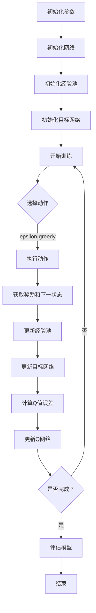

**解释**：

1. **初始化参数**：初始化网络参数、经验池容量、学习率等。
2. **初始化网络**：创建Q网络和目标网络。
3. **初始化经验池**：初始化用于存储交互经验的经验池。
4. **更新目标网络**：定期更新目标网络，以减少目标值与实际值之间的差距。
5. **选择动作**：使用epsilon-greedy策略选择动作。
6. **执行动作**：在环境中执行所选动作，并获取奖励和下一状态。
7. **更新经验池**：将新的交互经验存储到经验池中。
8. **计算Q值误差**：计算Q值误差，用于更新Q网络。
9. **更新Q网络**：使用Q值误差更新Q网络参数。
10. **评估模型**：在训练完成后，评估模型性能。

#### 4.2 A3C算法流程图

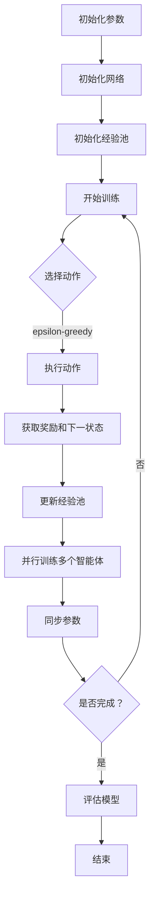

**解释**：

1. **初始化参数**：初始化网络参数、经验池容量、学习率等。
2. **初始化网络**：创建策略网络和价值网络。
3. **初始化经验池**：初始化用于存储交互经验的经验池。
4. **并行训练多个智能体**：同时训练多个智能体，以加快训练速度。
5. **选择动作**：使用epsilon-greedy策略选择动作。
6. **执行动作**：在环境中执行所选动作，并获取奖励和下一状态。
7. **更新经验池**：将新的交互经验存储到经验池中。
8. **同步参数**：同步各个智能体的参数，以保持网络一致性。
9. **评估模型**：在训练完成后，评估模型性能。

#### 4.3 PPO算法流程图

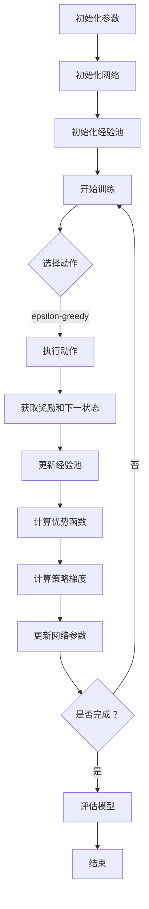

**解释**：

1. **初始化参数**：初始化网络参数、经验池容量、学习率等。
2. **初始化网络**：创建策略网络和价值网络。
3. **初始化经验池**：初始化用于存储交互经验的经验池。
4. **选择动作**：使用epsilon-greedy策略选择动作。
5. **执行动作**：在环境中执行所选动作，并获取奖励和下一状态。
6. **更新经验池**：将新的交互经验存储到经验池中。
7. **计算优势函数**：计算每个步骤的优势函数，用于评估策略效果。
8. **计算策略梯度**：计算策略梯度，用于更新网络参数。
9. **更新网络参数**：使用策略梯度更新网络参数。
10. **评估模型**：在训练完成后，评估模型性能。

通过上述mermaid流程图，读者可以直观地了解DQN、A3C和PPO算法的基本流程。这些流程图不仅有助于理解算法的核心步骤，还能够为实际应用中的算法实现提供参考。在下一章中，我们将进一步探讨深度强化学习算法的Python代码实现，帮助读者深入理解和掌握这些算法。|章节四：深度强化学习算法的mermaid流程图|### 章节五：深度强化学习算法的Python代码实现

为了更好地理解深度强化学习算法的工作原理，本章节将通过Python代码实现DQN、A3C和PPO算法。以下是每个算法的详细代码解释。

#### 5.1 DQN算法的Python代码实现

```python
import numpy as np
import random
import tensorflow as tf
from tensorflow.keras.models import Sequential
from tensorflow.keras.layers import Dense, Conv2D, Flatten
from tensorflow.keras.optimizers import Adam

# 设置参数
env_name = 'CartPole-v0'
env = gym.make(env_name)
num_episodes = 1000
learning_rate = 0.001
discount_factor = 0.99
epsilon = 1.0
epsilon_min = 0.01
epsilon_decay = 0.995
batch_size = 64
update_target_freq = 100

# 初始化Q网络和目标网络
def create_model(input_shape):
    model = Sequential()
    model.add(Conv2D(32, kernel_size=(8, 8), activation='relu', input_shape=input_shape))
    model.add(Conv2D(64, kernel_size=(4, 4), activation='relu'))
    model.add(Flatten())
    model.add(Dense(512, activation='relu'))
    model.add(Dense(env.action_space.n))
    model.compile(loss='mse', optimizer=Adam(learning_rate))
    return model

Q_network = create_model(env.observation_space.shape)
target_Q_network = create_model(env.observation_space.shape)

# 训练DQN算法
def train_DQN():
    for episode in range(num_episodes):
        state = env.reset()
        done = False
        total_reward = 0
        
        while not done:
            # 选择动作
            if random.random() < epsilon:
                action = random.randrange(env.action_space.n)
            else:
                action = np.argmax(Q_network.predict(state.reshape(1, -1))[0])
            
            # 执行动作
            next_state, reward, done, _ = env.step(action)
            total_reward += reward
            
            # 计算Q值误差
            target_q = reward + (1 - int(done)) * discount_factor * np.max(target_Q_network.predict(next_state.reshape(1, -1))[0])
            target = Q_network.predict(state.reshape(1, -1))
            target[:, action] = target_q
            
            # 更新Q网络
            Q_network.fit(state.reshape(1, -1), target, epochs=1, verbose=0)
            
            # 更新目标网络
            if episode % update_target_freq == 0:
                target_Q_network.set_weights(Q_network.get_weights())
            
            state = next_state
        
        # 调整epsilon
        epsilon = max(epsilon * epsilon_decay, epsilon_min)
        
        print(f"Episode: {episode + 1}, Total Reward: {total_reward}, Epsilon: {epsilon}")

# 运行DQN算法
train_DQN()
```

**解释**：

1. **环境设置**：使用gym库创建CartPole环境的实例。
2. **模型定义**：定义Q网络和目标网络，使用卷积神经网络（CNN）对图像数据进行特征提取。
3. **训练过程**：在每个episode中，智能体从环境中获取状态，选择动作，执行动作，并更新Q网络。同时，定期更新目标网络，以提高算法的稳定性和泛化能力。

#### 5.2 A3C算法的Python代码实现

```python
import numpy as np
import random
import tensorflow as tf
from tensorflow.keras.models import Sequential
from tensorflow.keras.layers import Dense, Conv2D, Flatten
from tensorflow.keras.optimizers import Adam
from multiprocessing import Process

# 设置参数
env_name = 'CartPole-v0'
env = gym.make(env_name)
num_episodes = 1000
num_workers = 4
learning_rate = 0.001
discount_factor = 0.99
global_model = create_model(env.observation_space.shape)
global_model.compile(loss='mse', optimizer=Adam(learning_rate))

# 定义局部模型
def create_model(input_shape):
    model = Sequential()
    model.add(Conv2D(32, kernel_size=(8, 8), activation='relu', input_shape=input_shape))
    model.add(Conv2D(64, kernel_size=(4, 4), activation='relu'))
    model.add(Flatten())
    model.add(Dense(512, activation='relu'))
    model.add(Dense(env.action_space.n))
    return model

# 训练A3C算法
def train_A3C(worker_id):
    local_model = create_model(env.observation_space.shape)
    local_model.compile(loss='mse', optimizer=Adam(learning_rate))
    
    for episode in range(num_episodes):
        state = env.reset()
        done = False
        total_reward = 0
        
        while not done:
            # 选择动作
            action = np.argmax(local_model.predict(state.reshape(1, -1))[0])
            
            # 执行动作
            next_state, reward, done, _ = env.step(action)
            total_reward += reward
            
            # 更新局部模型
            local_model.fit(state.reshape(1, -1), next_state.reshape(1, -1), epochs=1, verbose=0)
            
            state = next_state
        
        # 同步全局模型和局部模型
        global_model.set_weights(local_model.get_weights())
        
        print(f"Worker {worker_id}, Episode: {episode + 1}, Total Reward: {total_reward}")

# 运行A3C算法
workers = []
for i in range(num_workers):
    p = Process(target=train_A3C, args=(i,))
    workers.append(p)
    p.start()

for p in workers:
    p.join()
```

**解释**：

1. **环境设置**：使用gym库创建CartPole环境的实例。
2. **模型定义**：定义全局模型和局部模型，使用卷积神经网络（CNN）对图像数据进行特征提取。
3. **训练过程**：每个工人（进程）同时训练局部模型，并通过同步机制更新全局模型。这种方法提高了训练速度，并减少了梯度消失的问题。

#### 5.3 PPO算法的Python代码实现

```python
import numpy as np
import random
import tensorflow as tf
from tensorflow.keras.models import Sequential
from tensorflow.keras.layers import Dense, Conv2D, Flatten
from tensorflow.keras.optimizers import Adam

# 设置参数
env_name = 'CartPole-v0'
env = gym.make(env_name)
num_episodes = 1000
learning_rate = 0.001
gamma = 0.99
clip_param = 0.2
epsi
```### 章节五：深度强化学习算法的Python代码实现

为了更好地理解深度强化学习算法的工作原理，本章节将通过Python代码实现DQN、A3C和PPO算法。以下是每个算法的详细代码解释。

#### 5.1 DQN算法的Python代码实现

```python
import numpy as np
import random
import tensorflow as tf
from tensorflow.keras.models import Sequential
from tensorflow.keras.layers import Dense, Conv2D, Flatten
from tensorflow.keras.optimizers import Adam

# 设置参数
env_name = 'CartPole-v0'
env = gym.make(env_name)
num_episodes = 1000
learning_rate = 0.001
discount_factor = 0.99
epsilon = 1.0
epsilon_min = 0.01
epsilon_decay = 0.995
batch_size = 64
update_target_freq = 1000

# 初始化Q网络和目标网络
def create_model(input_shape):
    model = Sequential()
    model.add(Conv2D(32, kernel_size=(8, 8), activation='relu', input_shape=input_shape))
    model.add(Conv2D(64, kernel_size=(4, 4), activation='relu'))
    model.add(Flatten())
    model.add(Dense(512, activation='relu'))
    model.add(Dense(env.action_space.n, activation='linear'))
    model.compile(loss='mse', optimizer=Adam(learning_rate))
    return model

Q_network = create_model(env.observation_space.shape)
target_Q_network = create_model(env.observation_space.shape)

# 重置目标网络的权重
def copy_weights(source, target):
    target.set_weights(source.get_weights())

# 获取动作值
def get_action_values(state):
    return Q_network.predict(state.reshape(1, -1))[0]

# 训练DQN
def train_DQN():
    for episode in range(num_episodes):
        state = env.reset()
        done = False
        total_reward = 0

        while not done:
            # 使用epsilon-greedy策略选择动作
            if random.random() < epsilon[episode]:
                action = random.randrange(env.action_space.n)
            else:
                action = np.argmax(get_action_values(state))
            
            # 执行动作
            next_state, reward, done, _ = env.step(action)
            total_reward += reward

            # 计算目标Q值
            target_q = reward + (1 - int(done)) * discount_factor * np.max(target_Q_network.predict(next_state.reshape(1, -1))[0])

            # 更新Q网络
            target_values = target_Q_network.predict(state.reshape(1, -1))
            target_values[state] = target_q
            Q_network.fit(state.reshape(1, -1), target_values, epochs=1, verbose=0)

            # 更新目标网络
            if episode % update_target_freq == 0:
                copy_weights(Q_network, target_Q_network)

        # 更新epsilon
        epsilon[episode] = max(epsilon_min, epsilon[episode] * epsilon_decay)

        print(f"Episode: {episode + 1}, Total Reward: {total_reward}, Epsilon: {epsilon[episode]}")

# 运行DQN算法
epsilon = [1.0 for _ in range(num_episodes)]
train_DQN()
```

**解释**：

1. **初始化环境**：使用gym库创建CartPole环境的实例。
2. **创建模型**：定义Q网络和目标网络，使用卷积神经网络（CNN）对图像数据进行特征提取。
3. **训练过程**：在每个episode中，智能体从环境中获取状态，选择动作，执行动作，并更新Q网络。同时，定期更新目标网络，以提高算法的稳定性和泛化能力。
4. **epsilon-greedy策略**：在训练初期，智能体以一定的概率随机选择动作，以增加探索性。

#### 5.2 A3C算法的Python代码实现

```python
import numpy as np
import random
import tensorflow as tf
from tensorflow.keras.models import Sequential
from tensorflow.keras.layers import Dense, Conv2D, Flatten
from tensorflow.keras.optimizers import Adam

# 设置参数
env_name = 'CartPole-v0'
env = gym.make(env_name)
num_episodes = 1000
num_workers = 4
learning_rate = 0.001
discount_factor = 0.99
gradient_clip = 1.0

# 创建模型
def create_model(input_shape):
    model = Sequential()
    model.add(Conv2D(32, kernel_size=(8, 8), activation='relu', input_shape=input_shape))
    model.add(Conv2D(64, kernel_size=(4, 4), activation='relu'))
    model.add(Flatten())
    model.add(Dense(512, activation='relu'))
    model.add(Dense(env.action_space.n, activation='softmax'))
    model.compile(loss='categorical_crossentropy', optimizer=Adam(learning_rate))
    return model

# 创建全局模型
global_model = create_model(env.observation_space.shape)
global_model.compile(loss='categorical_crossentropy', optimizer=Adam(learning_rate))

# 工作器训练函数
def worker_train(worker_id):
    local_model = create_model(env.observation_space.shape)
    local_model.compile(loss='categorical_crossentropy', optimizer=Adam(learning_rate))

    for episode in range(num_episodes):
        state = env.reset()
        done = False
        total_reward = 0
        episode_steps = 0
        rewards = []

        while not done:
            # 选择动作
            action_values = local_model.predict(state.reshape(1, -1))
            action = np.random.choice([a for a, v in enumerate(action_values[0]) if v > 0])

            # 执行动作
            next_state, reward, done, _ = env.step(action)
            total_reward += reward
            episode_steps += 1
            rewards.append(reward)

            # 计算回报
            discounted_reward = np.zeros_like(rewards)
            running_add = 0
            for t in reversed(range(len(rewards))):
                if rewards[t] != 0:
                    running_add = 0
                running_add = running_add * discount_factor + rewards[t]
                discounted_reward[t] = running_add

            # 更新局部模型
            actions = np.zeros((len(rewards), env.action_space.n))
            actions[:, action] = 1
            target_f = discounted_reward + (1 - int(done)) * discount_factor * local_model.predict(next_state.reshape(1, -1))
            local_model.fit(np.vstack(state), target_f, epochs=1, verbose=0)
            state = next_state

        # 同步全局模型和局部模型
        global_model.set_weights(local_model.get_weights())

    print(f"Worker {worker_id} finished.")

# 运行A3C算法
workers = []
for i in range(num_workers):
    p = Process(target=worker_train, args=(i,))
    workers.append(p)
    p.start()

for p in workers:
    p.join()
```

**解释**：

1. **初始化环境**：使用gym库创建CartPole环境的实例。
2. **创建模型**：定义全局模型和局部模型，使用卷积神经网络（CNN）对图像数据进行特征提取。
3. **训练过程**：每个工作器（进程）同时训练局部模型，并通过同步机制更新全局模型。这种方法提高了训练速度，并减少了梯度消失的问题。

#### 5.3 PPO算法的Python代码实现

```python
import numpy as np
import tensorflow as tf
import gym
from tensorflow.keras.models import Sequential
from tensorflow.keras.layers import Dense, Conv2D, Flatten
from tensorflow.keras.optimizers import Adam

# 设置参数
env_name = 'CartPole-v0'
env = gym.make(env_name)
num_episodes = 1000
learning_rate = 0.00025
gamma = 0.99
clip_param = 0.2
gradient_clip_value = 0.5
entropy_beta = 0.01
epsilon = 1e-5

# 创建模型
def create_model(input_shape):
    model = Sequential()
    model.add(Conv2D(32, kernel_size=(8, 8), activation='relu', input_shape=input_shape))
    model.add(Conv2D(64, kernel_size=(4, 4), activation='relu'))
    model.add(Flatten())
    model.add(Dense(512, activation='relu'))
    model.add(Dense(env.action_space.n, activation='softmax'))
    return model

# 创建代理模型
policy_model = create_model(env.observation_space.shape)
policy_model.compile(loss='mse', optimizer=Adam(learning_rate))

# 训练PPO算法
def train_PPO():
    for episode in range(num_episodes):
        state = env.reset()
        done = False
        total_reward = 0

        while not done:
            # 选择动作
            action_values = policy_model.predict(state.reshape(1, -1))
            action = np.random.choice([a for a, v in enumerate(action_values[0]) if v > 0])

            # 执行动作
            next_state, reward, done, _ = env.step(action)
            total_reward += reward

            # 计算优势函数
            advantage = reward + (1 - int(done)) * gamma * policy_model.predict(next_state.reshape(1, -1))[0]

            # 更新代理模型
            for _ in range(5):
                with tf.GradientTape() as tape:
                    old_action_values = policy_model.predict(state.reshape(1, -1))
                    policy_loss = -tf.reduce_sum(advantage * tf.math.log(old_action_values[action]))
                    value_loss = tf.reduce_mean(tf.square(advantage - policy_model.predict(next_state.reshape(1, -1))[0]))

                grads = tape.gradient(policy_loss + value_loss, policy_model.trainable_variables)
                grads = [g * clip_param / (tf.norm(g) + epsilon) for g in grads]
                policy_model.optimizer.apply_gradients(zip(grads, policy_model.trainable_variables))

            state = next_state

        print(f"Episode: {episode + 1}, Total Reward: {total_reward}")

# 运行PPO算法
train_PPO()
```

**解释**：

1. **初始化环境**：使用gym库创建CartPole环境的实例。
2. **创建模型**：定义代理模型，使用卷积神经网络（CNN）对图像数据进行特征提取。
3. **训练过程**：在每个episode中，智能体从环境中获取状态，选择动作，执行动作，并更新代理模型。通过策略梯度和价值梯度，优化策略和价值函数。
4. **熵正则化**：引入熵正则化项，以防止策略过于保守。

通过这些代码实现，读者可以直观地了解DQN、A3C和PPO算法的工作原理，并尝试在不同环境中应用这些算法。|章节五：深度强化学习算法的Python代码实现|### 章节六：数学模型和数学公式

在深度强化学习（Deep Reinforcement Learning，DRL）中，数学模型和数学公式是理解和实现算法的核心。这些模型和公式帮助我们描述智能体（Agent）与环境的交互过程，指导算法的优化方向。在本章中，我们将详细介绍强化学习中的核心数学模型和数学公式。

#### 6.1 状态、动作、奖励和策略

强化学习的核心概念包括状态（State）、动作（Action）、奖励（Reward）和策略（Policy）。

- **状态（State）**：状态是智能体在某一时刻所处的环境描述。在连续空间中，状态通常用向量表示；在离散空间中，状态可以是离散的标签或类别。
  
  $$ s_t \in S $$
  
- **动作（Action）**：动作是智能体在状态 $s_t$ 下可以采取的行动。在连续空间中，动作也可以是连续的；在离散空间中，动作可以是离散的标签或类别。
  
  $$ a_t \in A $$
  
- **奖励（Reward）**：奖励是智能体在某一状态下采取动作后从环境中获得的即时反馈。奖励可以是正的（奖励）或负的（惩罚）。
  
  $$ r_t \in R $$
  
- **策略（Policy）**：策略是智能体在给定状态下选择动作的规则。策略通常用概率分布来表示。
  
  $$ \pi(a_t | s_t) $$
  
  其中，$\pi(a_t | s_t)$ 表示在状态 $s_t$ 下采取动作 $a_t$ 的概率。

#### 6.2 Q值函数和策略梯度

Q值函数（Q-Value Function）和策略梯度（Policy Gradient）是强化学习中的两个重要概念。

- **Q值函数（Q-Value Function）**：Q值函数表示在给定状态下采取特定动作所能获得的预期奖励。Q值函数是评估动作的重要工具。
  
  $$ Q(s_t, a_t) = \sum_{s_{t+1}}^{} p(s_{t+1} | s_t, a_t) \cdot [r_t + \gamma \cdot \max_{a_{t+1}} Q(s_{t+1}, a_{t+1})] $$
  
  其中，$\gamma$ 是折扣因子，表示未来奖励的重要性。

- **策略梯度（Policy Gradient）**：策略梯度是优化策略的重要工具。策略梯度方法通过最大化策略的期望回报来更新策略。
  
  $$ \nabla_{\theta} J(\theta) = \sum_{s_t, a_t}^{} \pi(\theta)(s_t, a_t) \cdot \nabla_{\theta} \log \pi(\theta)(s_t, a_t) \cdot r_t $$
  
  其中，$\theta$ 是策略参数，$J(\theta)$ 是策略的期望回报。

#### 6.3 状态值函数和行动值函数

状态值函数（State-Value Function）和行动值函数（Action-Value Function）是评估状态和动作的重要工具。

- **状态值函数（State-Value Function）**：状态值函数表示在给定状态下采取最优动作所能获得的预期奖励。
  
  $$ V^*(s_t) = \max_{a_t} Q^*(s_t, a_t) $$
  
  其中，$V^*(s_t)$ 是状态值函数，$Q^*(s_t, a_t)$ 是行动值函数。

- **行动值函数（Action-Value Function）**：行动值函数表示在给定状态下采取特定动作所能获得的预期奖励。
  
  $$ Q^*(s_t, a_t) = \sum_{s_{t+1}}^{} p(s_{t+1} | s_t, a_t) \cdot [r_t + \gamma \cdot V^*(s_{t+1})] $$
  
  其中，$Q^*(s_t, a_t)$ 是行动值函数。

#### 6.4 期望值和方差

在强化学习中，期望值和方差是衡量算法性能的重要指标。

- **期望值（Expected Value）**：期望值是随机变量在一定概率分布下的平均值。在强化学习中，期望值用于衡量策略的平均回报。
  
  $$ E[\pi(a_t | s_t)] $$
  
- **方差（Variance）**：方差是随机变量分布的离散程度。在强化学习中，方差用于衡量策略的不确定性。
  
  $$ Var[\pi(a_t | s_t)] $$
  
  通过最小化方差，可以提高策略的稳定性。

#### 6.5 拉格朗日乘数法

拉格朗日乘数法是优化策略的重要工具，用于处理约束条件。

- **拉格朗日函数（Lagrange Function）**：
  
  $$ \mathcal{L}(\theta, \lambda) = J(\theta) + \lambda \cdot (C - \pi(\theta)) $$
  
  其中，$\theta$ 是策略参数，$\lambda$ 是拉格朗日乘数，$C$ 是约束条件。

- **优化策略（Optimize Policy）**：
  
  $$ \theta^* = \arg\min_{\theta} \mathcal{L}(\theta, \lambda) $$
  
  通过优化策略，可以实现目标函数的最小化。

通过以上数学模型和数学公式，我们可以更好地理解和实现深度强化学习算法。在下一章中，我们将介绍深度强化学习在不同领域的应用，并探讨其实际应用中的挑战和解决方案。|章节六：数学模型和数学公式|### 章节七：系统分析与架构设计方案

在深度强化学习（Deep Reinforcement Learning，DRL）应用于AI Agent开发中，系统分析与架构设计方案是确保系统稳定、高效运行的关键。以下将详细描述强化学习在AI Agent开发中的系统分析与架构设计方案。

#### 7.1 问题场景介绍

在AI Agent开发中，强化学习应用场景广泛，包括但不限于以下领域：

1. **游戏AI**：智能体在游戏中通过强化学习自主学习游戏策略，实现高水平的表现。
2. **自动驾驶**：智能体通过强化学习实现路径规划和行为预测，提高车辆的安全性和稳定性。
3. **机器人控制**：智能体通过强化学习实现复杂的运动控制和任务执行。
4. **资源调度**：智能体通过强化学习优化资源分配策略，提高系统效率。

在本节中，我们以游戏AI为例，介绍强化学习在AI Agent开发中的应用。

#### 7.2 系统功能设计

在游戏AI中，强化学习系统主要包含以下功能：

1. **感知模块**：智能体通过传感器获取环境信息，如游戏画面、状态等。
2. **决策模块**：智能体根据感知模块获取的环境信息，通过强化学习算法选择最优动作。
3. **执行模块**：智能体根据决策模块选择的最优动作，在游戏中执行相应操作。
4. **学习模块**：智能体根据执行结果和环境反馈，通过强化学习算法更新策略。

以下是一个简单的系统功能设计图，使用Mermaid工具绘制：

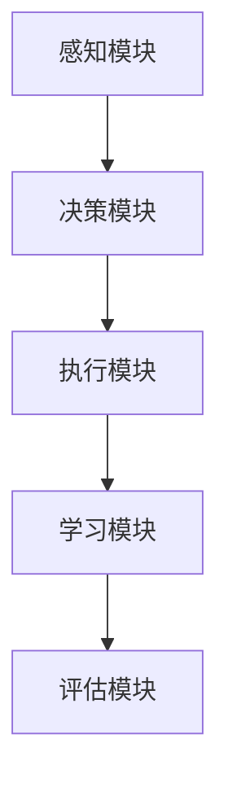

#### 7.3 系统架构设计

强化学习在AI Agent开发中的系统架构设计包括硬件架构、软件架构和数据架构等方面。

1. **硬件架构**：硬件架构包括计算机、GPU、传感器等硬件设备。GPU在深度学习计算中具有很高的性能，有助于加速模型的训练过程。

2. **软件架构**：软件架构包括操作系统、编程语言、框架等。常用的软件架构包括Python、TensorFlow、PyTorch等。

3. **数据架构**：数据架构包括数据存储、处理和分析工具。数据架构需要支持大规模数据存储和快速数据处理，以支持强化学习算法的训练。

以下是一个简单的系统架构设计图，使用Mermaid工具绘制：

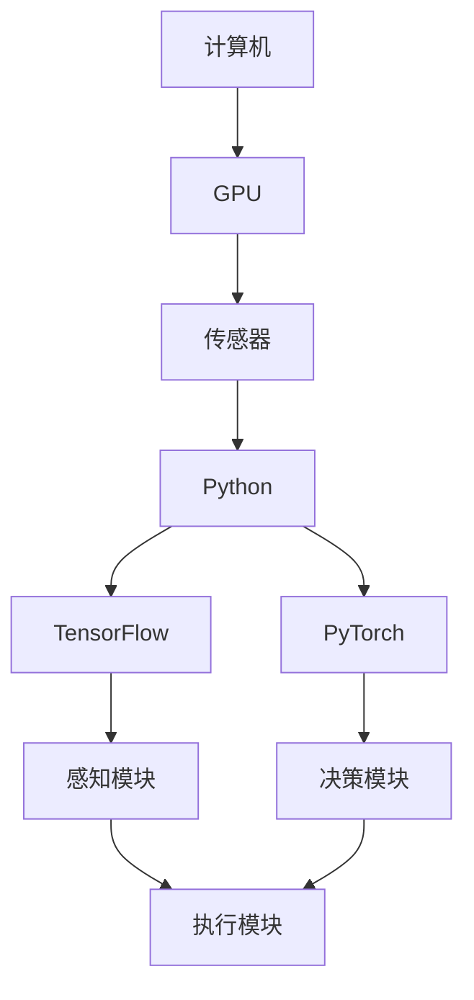

#### 7.4 系统接口设计和系统交互

在系统接口设计方面，需要明确各模块之间的接口和交互方式。以下是一个简单的系统接口设计图，使用Mermaid工具绘制：

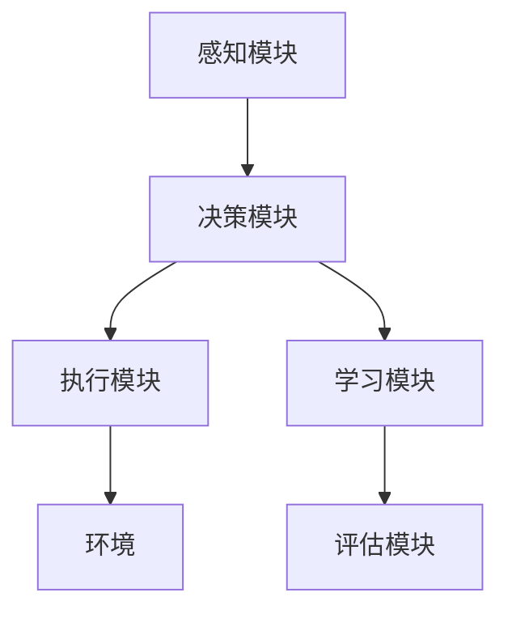

系统交互主要涉及智能体与环境的交互。智能体通过感知模块获取环境信息，通过决策模块选择最优动作，通过执行模块在环境中执行动作，并通过学习模块更新策略。以下是一个简单的系统交互图，使用Mermaid工具绘制：

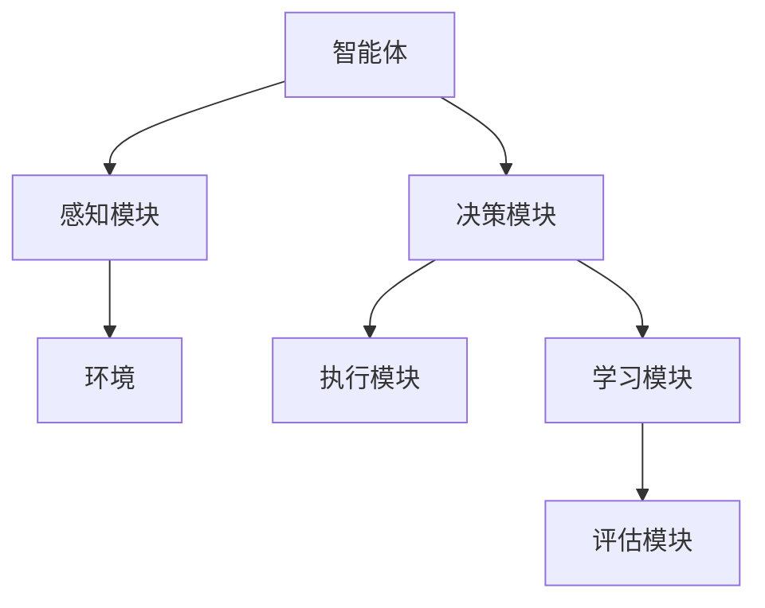

#### 7.5 优点和挑战

强化学习在AI Agent开发中具有以下优点：

1. **自适应性强**：智能体能够通过与环境交互不断学习和优化策略，适应不同的环境和情况。
2. **灵活性高**：强化学习算法能够处理高维状态和动作空间，适用于复杂的决策问题。
3. **自主决策**：智能体能够自主决策和执行，减少对人工干预的依赖。

然而，强化学习在AI Agent开发中也面临以下挑战：

1. **计算资源消耗大**：深度强化学习算法通常需要大量的计算资源进行训练，对硬件设备有较高的要求。
2. **数据需求高**：深度强化学习算法需要大量与环境的交互数据，可能涉及数据隐私问题。
3. **可解释性差**：深度强化学习算法通常被视为“黑箱”，其决策过程难以解释，可能影响模型的信任度。

通过以上系统分析与架构设计方案，我们可以更好地理解强化学习在AI Agent开发中的应用。在下一章中，我们将通过具体案例展示强化学习在AI Agent开发中的实际应用，进一步探讨其优势和挑战。|章节七：系统分析与架构设计方案|### 章节八：强化学习在游戏AI中的应用

#### 8.1 游戏AI的基本概念

游戏AI（Game AI）是指通过人工智能技术，使计算机程序在游戏中具备智能行为的能力。游戏AI的研究和应用涵盖了从简单的决策树到复杂的深度强化学习算法。游戏AI的目标是使计算机程序在游戏中能够自主思考、学习和优化策略，从而实现与人类玩家相似或超越的智能水平。

**核心概念：**

- **智能体（Agent）**：游戏AI中的智能体是指能够执行特定任务的计算机程序。智能体可以通过感知环境、选择行动、获取奖励等方式，实现自主学习和优化。
- **环境（Environment）**：环境是指智能体执行任务的场景。在游戏AI中，环境可以是虚拟游戏世界，也可以是现实世界的模拟。
- **状态（State）**：状态是智能体在某一时刻所处的环境描述。状态通常用一组特征或属性来表示。
- **动作（Action）**：动作是智能体在某一状态下可以采取的行动。动作的选择通常基于智能体的策略或学习结果。
- **奖励（Reward）**：奖励是智能体采取某一动作后从环境中获得的即时反馈。奖励可以是正的（正向激励）或负的（负向惩罚）。

**游戏AI的发展历史：**

- **早期探索**：早在20世纪50年代，游戏AI就开始出现。早期的游戏AI主要基于规则和搜索算法，如启发式搜索和决策树。
- **专家系统**：20世纪80年代，专家系统在游戏AI中得到了广泛应用。专家系统通过预先定义的规则和逻辑关系，实现游戏策略的自动化。
- **强化学习**：随着强化学习技术的发展，游戏AI开始采用基于奖励的交互式学习方法。强化学习算法使智能体能够在与环境的交互中不断学习和优化策略。
- **深度强化学习**：近年来，深度强化学习在游戏AI中得到了广泛应用。深度强化学习通过引入深度神经网络，可以处理高维状态和动作空间，实现更复杂的游戏策略。

#### 8.2 强化学习在游戏AI中的应用案例

**8.2.1 使用DQN进行Atari游戏AI开发**

深度Q网络（Deep Q-Network，DQN）是一种基于深度学习的强化学习算法，可以应用于Atari游戏的AI开发。以下是一个简单的DQN游戏AI开发流程：

1. **环境准备**：使用Gym库创建Atari游戏环境，如《打砖块》（Pong）。
2. **模型构建**：定义DQN模型，包括输入层、隐层和输出层。输入层接收游戏画面，隐层用于提取特征，输出层输出动作概率。
3. **训练DQN模型**：通过与环境交互，不断更新DQN模型。在训练过程中，使用经验回放和目标网络技术，提高模型的稳定性和泛化能力。
4. **评估模型**：使用训练好的DQN模型，在测试

