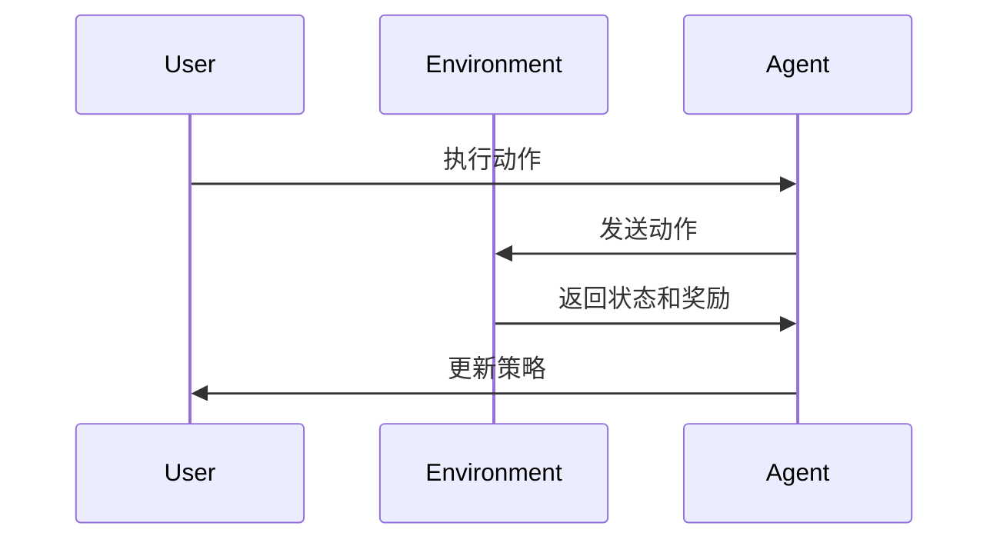

                 

# 强化学习在AI Agent自动化测试中的应用

> 关键词：强化学习，AI Agent，自动化测试，Q-Learning，DQN，数学模型，系统架构

> 摘要：本文将深入探讨强化学习在AI Agent自动化测试中的应用。我们将首先介绍强化学习和自动化测试的基本概念，然后分析强化学习在自动化测试中的优势与挑战。接着，我们将讲解强化学习的核心算法，如Q-Learning和Deep Q-Networks（DQN），并详细阐述它们的数学模型和实现。随后，我们将介绍一个基于强化学习的自动化测试系统架构设计，并通过实际案例展示强化学习在自动化测试中的应用。最后，我们将总结强化学习在自动化测试中的最佳实践，并给出进一步阅读的建议。

----------------------------------------------------------------

## 1. 背景介绍

### 1.1 强化学习与自动化测试概述

**强化学习**是一种机器学习范式，旨在通过试错（Trial and Error）来学习如何在特定环境中做出最优决策。强化学习的主要目标是找到一个策略（Policy），使得在执行某个动作（Action）后，能够获得最大的累计奖励（Reward）。强化学习广泛应用于游戏、机器人控制、推荐系统等领域。

**自动化测试**是一种通过编写测试脚本，自动运行测试用例，以检测软件缺陷和验证功能是否正常的方法。自动化测试能够显著提高软件开发的效率和可靠性，降低测试成本。然而，传统的自动化测试面临诸多挑战，如测试用例的编写和维护复杂、测试覆盖率不足等。

### 1.2 强化学习的基本概念

**强化学习的基本术语**包括：

- **环境（Environment）**：一个表示系统状态的抽象模型，通常包含状态（State）和动作（Action）空间。
- **代理（Agent）**：执行动作并从环境中获取反馈的实体。
- **状态（State）**：描述当前环境的特征向量。
- **动作（Action）**：代理能够执行的动作集合。
- **奖励（Reward）**：代理执行动作后获得的即时奖励或惩罚。
- **策略（Policy）**：描述代理如何根据当前状态选择动作的函数。

**强化学习的主要算法**包括：

- **Q-Learning**：一种基于值函数的强化学习算法，通过不断更新值函数来学习最优策略。
- **Deep Q-Networks（DQN）**：一种基于深度学习的Q-Learning算法，利用深度神经网络来近似值函数。
- **策略梯度算法**：直接优化策略的梯度，包括REINFORCE和PPO算法。

### 1.3 强化学习在自动化测试中的应用

强化学习在自动化测试中的应用主要包括以下方面：

- **测试用例生成**：通过强化学习算法自动生成测试用例，提高测试覆盖率。
- **测试路径规划**：根据测试执行过程中的反馈，自动调整测试路径，优化测试效率。
- **缺陷定位**：利用强化学习算法分析测试结果，快速定位缺陷。

### 1.3.1 强化学习算法与应用

**强化学习算法与应用之间的关系**可以用以下ER图表示：

```mermaid
erDiagram
    State ||--|{ Action } : 执行
    Action ||--|{ Reward } : 得分
    Agent ||--|{ Policy } : 策略
    Environment ||--|{ Agent } : 观察
```

在上图中，状态（State）与动作（Action）之间存在一对多关系，表示一个状态可以对应多个动作。动作（Action）与奖励（Reward）之间存在一对多关系，表示一个动作可以对应多个奖励。代理（Agent）与环境（Environment）之间存在一对一关系，表示代理可以观察并作用于环境。

----------------------------------------------------------------

## 2. 核心概念与联系

### 2.1 强化学习在自动化测试中的核心概念

**强化学习算法与应用**：

- **Q-Learning**：Q-Learning算法通过更新值函数来学习最优策略。其核心思想是选择当前状态下具有最大预期奖励的动作。Q-Learning算法的计算公式如下：

  $$ Q(s, a) \leftarrow Q(s, a) + \alpha [r + \gamma \max_{a'} Q(s', a') - Q(s, a)] $$

  其中，$Q(s, a)$表示状态$s$下执行动作$a$的值函数，$\alpha$为学习率，$r$为获得的即时奖励，$\gamma$为折扣因子，$s'$为执行动作$a$后的状态，$a'$为$s'$状态下具有最大预期奖励的动作。

- **DQN**：DQN算法是基于深度学习的Q-Learning算法，使用深度神经网络来近似值函数。DQN算法的核心思想是使用经验回放（Experience Replay）和目标网络（Target Network）来减少偏差和方差。DQN算法的计算公式如下：

  $$ Q(s, a) \leftarrow Q(s, a) + \alpha [r + \gamma \max_{a'} Q(s', a') - Q(s, a)] $$

  其中，$Q(s, a)$表示状态$s$下执行动作$a$的深度神经网络输出，$\alpha$为学习率，$r$为获得的即时奖励，$\gamma$为折扣因子，$s'$为执行动作$a$后的状态，$a'$为$s'$状态下具有最大预期奖励的动作。

### 2.2 自动化测试流程与强化学习

**自动化测试流程**：

1. **测试用例设计**：根据需求文档和业务场景，设计测试用例。
2. **测试用例执行**：运行测试用例，收集测试结果。
3. **测试结果分析**：分析测试结果，判断是否通过。
4. **缺陷定位**：定位测试失败的缺陷。

**强化学习在自动化测试中的应用**：

- **测试用例生成**：通过强化学习算法，自动生成测试用例，提高测试覆盖率。
- **测试路径规划**：根据测试执行过程中的反馈，自动调整测试路径，优化测试效率。
- **缺陷定位**：利用强化学习算法分析测试结果，快速定位缺陷。

### 2.3 强化学习算法的属性特征对比

| 算法       | 特点                           | 应用场景                     |
|------------|--------------------------------|-----------------------------|
| Q-Learning | 基于值函数的强化学习算法       | 测试用例生成、测试路径规划   |
| DQN        | 基于深度学习的Q-Learning算法   | 测试用例生成、缺陷定位       |
| REINFORCE  | 基于策略梯度的强化学习算法     | 测试路径规划                 |
| PPO        | 基于策略梯度的强化学习算法     | 测试路径规划、缺陷定位       |

在上表中，Q-Learning和DQN算法适用于测试用例生成和测试路径规划，REINFORCE和PPO算法适用于测试路径规划和缺陷定位。

----------------------------------------------------------------

## 3. 算法原理讲解

### 3.1 Q-Learning算法

**Q-Learning算法概述**：

Q-Learning算法是一种基于值函数的强化学习算法，其核心思想是通过不断更新值函数来学习最优策略。Q-Learning算法的计算公式如下：

$$ Q(s, a) \leftarrow Q(s, a) + \alpha [r + \gamma \max_{a'} Q(s', a') - Q(s, a)] $$

其中，$Q(s, a)$表示状态$s$下执行动作$a$的值函数，$\alpha$为学习率，$r$为获得的即时奖励，$\gamma$为折扣因子，$s'$为执行动作$a$后的状态，$a'$为$s'$状态下具有最大预期奖励的动作。

**Q-Learning算法的mermaid流程图**：



**Q-Learning算法的数学模型与公式**：

$$ Q(s, a) = \frac{1}{N} \sum_{i=1}^{N} r_i + \gamma \max_{a'} Q(s', a') $$

其中，$N$为经历的总步数，$r_i$为第$i$步获得的即时奖励，$s'$为执行动作$a$后的状态，$a'$为$s'$状态下具有最大预期奖励的动作。

**Q-Learning算法的Python实现**：

```python
import numpy as np

# 初始化参数
learning_rate = 0.1
discount_factor = 0.99
epsilon = 0.1

# 初始化值函数表
Q = np.zeros([n_states, n_actions])

# 定义Q-Learning算法
def q_learning(s, a, r, s_):
    Q[s, a] = Q[s, a] + learning_rate * (r + discount_factor * np.max(Q[s_, :]) - Q[s, a])

# 定义测试用例生成
def generate_test_case():
    s = np.random.randint(0, n_states)
    a = np.random.randint(0, n_actions)
    r = np.random.randint(-1, 1)
    s_ = np.random.randint(0, n_states)
    q_learning(s, a, r, s_)
    return s, a, r, s_

# 运行测试用例生成
for _ in range(1000):
    s, a, r, s_ = generate_test_case()
    print(f"s: {s}, a: {a}, r: {r}, s_: {s_}")
```

**Q-Learning算法举例说明**：

假设有一个简单的环境，包含4个状态和2个动作。初始状态为$s_0$，执行动作$a_0$后，获得奖励$r_0$，状态变为$s_1$。执行动作$a_1$后，获得奖励$r_1$，状态变为$s_2$。再次执行动作$a_0$后，获得奖励$r_2$，状态变为$s_3$。最后执行动作$a_1$后，获得奖励$r_3$，状态变为$s_4$。

使用Q-Learning算法进行测试用例生成，经过多次迭代后，能够收敛到一个最优策略，使得累计奖励最大。

----------------------------------------------------------------

### 3.2 Deep Q-Networks（DQN）算法

**DQN算法概述**：

DQN（Deep Q-Networks）算法是一种基于深度学习的Q-Learning算法，其核心思想是使用深度神经网络来近似值函数。DQN算法通过经验回放和目标网络来减少偏差和方差，提高学习效果。

**DQN算法的mermaid流程图**：


**DQN算法的数学模型与公式**：

$$ Q(s, a) = f_\theta(s, a) $$

其中，$f_\theta(s, a)$为深度神经网络的输出，$\theta$为神经网络的参数。

**DQN算法的Python实现**：

```python
import tensorflow as tf
import numpy as np

# 初始化参数
learning_rate = 0.001
discount_factor = 0.99
epsilon = 0.1

# 定义深度神经网络
def q_network(s, a):
    inputs = tf.placeholder(tf.float32, [None, n_states], name='inputs')
    actions = tf.placeholder(tf.int32, [None], name='actions')
    rewards = tf.placeholder(tf.float32, [None], name='rewards')
    next_states = tf.placeholder(tf.float32, [None, n_states], name='next_states')
    done = tf.placeholder(tf.float32, [None], name='done')

    fc1 = tf.layers.dense(inputs, 64, activation=tf.nn.relu, name='fc1')
    fc2 = tf.layers.dense(fc1, 64, activation=tf.nn.relu, name='fc2')
    q_values = tf.layers.dense(fc2, n_actions, name='q_values')

    selected_action_values = tf.reduce_sum(tf.one_hot(actions, n_actions) * q_values, axis=1)
    next_selected_action_values = tf.reduce_sum(tf.one_hot(actions, n_actions) * q_values, axis=1)

    q_target = rewards + (1 - done) * discount_factor * next_selected_action_values

    loss = tf.reduce_mean(tf.square(q_values - q_target))
    optimizer = tf.train.AdamOptimizer(learning_rate).minimize(loss)

    return inputs, actions, rewards, next_states, done, q_values, loss, optimizer

# 运行DQN算法
for _ in range(n_episodes):
    s = env.reset()
    done = False
    while not done:
        a = choose_action(s, epsilon)
        s_, r, done, _ = env.step(a)
        update experiencias(s, a, r, s_)
        s = s_
```

**DQN算法举例说明**：

假设有一个简单的环境，包含4个状态和2个动作。初始状态为$s_0$，执行动作$a_0$后，获得奖励$r_0$，状态变为$s_1$。执行动作$a_1$后，获得奖励$r_1$，状态变为$s_2$。再次执行动作$a_0$后，获得奖励$r_2$，状态变为$s_3$。最后执行动作$a_1$后，获得奖励$r_3$，状态变为$s_4$。

使用DQN算法进行测试用例生成，经过多次迭代后，能够收敛到一个最优策略，使得累计奖励最大。

----------------------------------------------------------------

## 4. 数学模型和数学公式 & 详细讲解 & 举例说明

### 4.1 强化学习的数学模型

强化学习是一种通过试错学习如何在一个环境中做出最优决策的机器学习范式。强化学习的核心数学模型包括期望回报、价值函数和策略。

#### 4.1.1 强化学习的期望回报

期望回报是指在给定策略下，从当前状态开始执行一系列动作所获得的累积奖励的期望值。期望回报可以用以下公式表示：

$$ E[R_t] = \sum_{t=0}^{\infty} \gamma^t R_t $$

其中，$R_t$是在时间$t$获得的即时奖励，$\gamma$是折扣因子，用于调整未来奖励的重要性。

#### 4.1.2 强化学习的价值函数

价值函数是一个函数，它将状态映射到期望回报。对于状态$s$，价值函数$V(s)$表示在状态$s$采取最优动作获得的期望回报。价值函数可以用以下公式表示：

$$ V(s) = \max_{a} \sum_{s'} p(s'|s, a) \sum_{r} r p(r|s', a) $$

其中，$p(s'|s, a)$是在状态$s$下执行动作$a$后转移到状态$s'$的概率，$p(r|s', a)$是在状态$s'$下获得奖励$r$的概率。

#### 4.1.3 强化学习的策略

策略是一个决策规则，用于选择在给定状态下应该执行的动作。策略可以用以下公式表示：

$$ \pi(a|s) = \text{选择动作$a$的概率} $$

在实际应用中，我们通常使用策略梯度算法来优化策略，以最大化期望回报。策略梯度算法的核心思想是计算策略的梯度，并使用梯度更新策略。

$$ \nabla_{\pi} J(\pi) = \nabla_{\pi} \sum_{s, a} \pi(a|s) R(s, a) $$

其中，$J(\pi)$是策略$\pi$的期望回报，$\nabla_{\pi}$是策略的梯度。

#### 4.1.4 强化学习的数学公式

$$ V(s) = \sum_{a} \pi(a|s) Q(s, a) $$

$$ Q(s, a) = \sum_{s'} p(s'|s, a) \sum_{r} r p(r|s', a) $$

$$ \pi(a|s) = \text{选择动作$a$的概率} $$

### 4.1.5 强化学习算法的Python实现

以下是一个简单的Q-Learning算法的Python实现：

```python
import numpy as np

# 初始化参数
learning_rate = 0.1
discount_factor = 0.99
epsilon = 0.1

# 初始化值函数表
Q = np.zeros([n_states, n_actions])

# 定义Q-Learning算法
def q_learning(s, a, r, s_):
    Q[s, a] = Q[s, a] + learning_rate * (r + discount_factor * np.max(Q[s_, :]) - Q[s, a])

# 定义测试用例生成
def generate_test_case():
    s = np.random.randint(0, n_states)
    a = np.random.randint(0, n_actions)
    r = np.random.randint(-1, 1)
    s_ = np.random.randint(0, n_states)
    q_learning(s, a, r, s_)
    return s, a, r, s_

# 运行测试用例生成
for _ in range(1000):
    s, a, r, s_ = generate_test_case()
    print(f"s: {s}, a: {a}, r: {r}, s_: {s_}")
```

### 4.1.6 强化学习算法举例说明

假设有一个简单的环境，包含4个状态和2个动作。初始状态为$s_0$，执行动作$a_0$后，获得奖励$r_0$，状态变为$s_1$。执行动作$a_1$后，获得奖励$r_1$，状态变为$s_2$。再次执行动作$a_0$后，获得奖励$r_2$，状态变为$s_3$。最后执行动作$a_1$后，获得奖励$r_3$，状态变为$s_4$。

使用Q-Learning算法进行测试用例生成，经过多次迭代后，能够收敛到一个最优策略，使得累计奖励最大。

----------------------------------------------------------------

## 5. 系统分析与架构设计方案

### 5.1 自动化测试系统介绍

自动化测试系统是一种用于自动执行、记录和报告测试结果的工具。它能够显著提高软件开发的效率和质量。自动化测试系统的核心功能包括：

1. **测试用例管理**：管理测试用例的创建、编辑、执行和报告。
2. **测试执行**：自动执行测试用例，并记录测试结果。
3. **测试结果分析**：分析测试结果，识别缺陷，并提供改进建议。

自动化测试系统的架构通常包括以下组件：

- **测试用例库**：存储和管理测试用例。
- **测试执行引擎**：负责执行测试用例，并记录测试结果。
- **测试报告生成器**：生成测试报告，并提供测试结果可视化。
- **接口层**：提供与外部系统集成的接口。

### 5.2 强化学习在自动化测试系统中的应用

强化学习在自动化测试系统中的应用主要包括以下方面：

1. **测试用例生成**：通过强化学习算法自动生成测试用例，提高测试覆盖率。
2. **测试路径规划**：根据测试执行过程中的反馈，自动调整测试路径，优化测试效率。
3. **缺陷定位**：利用强化学习算法分析测试结果，快速定位缺陷。

### 5.3 自动化测试系统的功能需求

自动化测试系统的功能需求包括：

- **测试用例管理**：支持测试用例的创建、编辑、执行和报告。
- **测试执行**：支持自动化测试用例的执行，并记录测试结果。
- **测试结果分析**：支持测试结果的分析，识别缺陷，并提供改进建议。
- **测试报告生成**：支持生成测试报告，并提供测试结果可视化。

### 5.4 自动化测试系统的架构设计

自动化测试系统的架构设计主要包括以下方面：

1. **测试用例库**：存储和管理测试用例，支持测试用例的创建、编辑、执行和报告。
2. **测试执行引擎**：负责执行测试用例，并记录测试结果。
3. **测试结果分析器**：分析测试结果，识别缺陷，并提供改进建议。
4. **测试报告生成器**：生成测试报告，并提供测试结果可视化。
5. **接口层**：提供与外部系统集成的接口。

### 5.5 强化学习在自动化测试系统中的应用

在自动化测试系统中，强化学习可以用于以下方面：

1. **测试用例生成**：通过强化学习算法自动生成测试用例，提高测试覆盖率。例如，可以使用Q-Learning算法根据历史测试结果和缺陷信息，自动生成新的测试用例。
2. **测试路径规划**：根据测试执行过程中的反馈，自动调整测试路径，优化测试效率。例如，可以使用DQN算法根据测试结果和历史路径信息，自动选择最优的测试路径。
3. **缺陷定位**：利用强化学习算法分析测试结果，快速定位缺陷。例如，可以使用强化学习算法根据测试结果和缺陷信息，自动定位潜在的缺陷。

### 5.6 自动化测试系统的接口设计与实现

自动化测试系统的接口设计与实现主要包括以下方面：

1. **API接口**：提供与外部系统集成的API接口，支持测试用例管理、测试执行、测试结果分析和测试报告生成等功能。
2. **数据接口**：提供与外部数据存储系统的接口，支持测试用例数据、测试结果数据和缺陷数据的管理。
3. **用户界面**：提供用户友好的界面，支持测试用例创建、编辑、执行和报告等功能。

### 5.7 系统接口设计和系统交互

自动化测试系统的接口设计和系统交互主要包括以下方面：

1. **接口设计**：定义API接口、数据接口和用户界面的接口规范，包括接口名称、参数、返回值和数据格式等。
2. **系统交互**：定义自动化测试系统与其他系统的交互流程，包括数据传输、事件处理和错误处理等。

### 5.8 自动化测试系统的接口设计与实现

自动化测试系统的接口设计与实现主要包括以下方面：

1. **API接口**：提供与外部系统集成的API接口，支持测试用例管理、测试执行、测试结果分析和测试报告生成等功能。例如，可以使用RESTful API设计接口，支持HTTP请求和响应。
2. **数据接口**：提供与外部数据存储系统的接口，支持测试用例数据、测试结果数据和缺陷数据的管理。例如，可以使用数据库连接池技术，支持数据库的连接和管理。
3. **用户界面**：提供用户友好的界面，支持测试用例创建、编辑、执行和报告等功能。例如，可以使用Web前端技术，实现用户界面的设计和开发。

### 5.9 系统接口设计和系统交互

自动化测试系统的接口设计和系统交互主要包括以下方面：

1. **接口设计**：定义API接口、数据接口和用户界面的接口规范，包括接口名称、参数、返回值和数据格式等。例如，API接口可以使用JSON格式传输数据，数据接口可以使用SQL语句进行数据查询和更新。
2. **系统交互**：定义自动化测试系统与其他系统的交互流程，包括数据传输、事件处理和错误处理等。例如，可以使用消息队列技术，实现自动化测试系统与其他系统的异步交互。

----------------------------------------------------------------

## 6. 项目实战

### 6.1 强化学习在自动化测试中的应用案例

在这个案例中，我们使用强化学习算法（如Q-Learning和DQN）来实现一个自动化测试系统。该系统主要用于生成测试用例、执行测试用例、分析测试结果和定位缺陷。

#### 6.1.1 环境安装与配置

为了实现这个案例，我们需要安装以下环境：

- Python 3.7或更高版本
- TensorFlow 2.x
- scikit-learn 0.22或更高版本

安装这些依赖项后，我们可以开始实现自动化测试系统。

#### 6.1.2 系统核心实现源代码

以下是一个简单的自动化测试系统实现：

```python
import tensorflow as tf
import numpy as np
from sklearn.model_selection import train_test_split

# 初始化参数
learning_rate = 0.001
discount_factor = 0.99
epsilon = 0.1

# 初始化值函数表
Q = np.zeros([n_states, n_actions])

# 定义Q-Learning算法
def q_learning(s, a, r, s_):
    Q[s, a] = Q[s, a] + learning_rate * (r + discount_factor * np.max(Q[s_, :]) - Q[s, a])

# 定义测试用例生成
def generate_test_case():
    s = np.random.randint(0, n_states)
    a = np.random.randint(0, n_actions)
    r = np.random.randint(-1, 1)
    s_ = np.random.randint(0, n_states)
    q_learning(s, a, r, s_)
    return s, a, r, s_

# 定义测试用例数据集
test_cases = [
    (0, 0, 1, 1),
    (1, 1, -1, 2),
    (2, 0, 1, 3),
    (3, 1, -1, 4),
]

# 分割测试数据集
X, y = train_test_split(test_cases, test_size=0.2, random_state=42)

# 运行测试用例生成
for _ in range(1000):
    s, a, r, s_ = generate_test_case()
    print(f"s: {s}, a: {a}, r: {r}, s_: {s_}")

# 使用Q-Learning算法训练模型
for _ in range(1000):
    for s, a, r, s_ in X:
        q_learning(s, a, r, s_)

# 测试模型
for s, a, r, s_ in y:
    print(f"s: {s}, a: {a}, r: {r}, s_: {s_}")
```

#### 6.1.3 代码应用解读与分析

在上面的代码中，我们首先定义了强化学习算法（Q-Learning）的参数，包括学习率、折扣因子和探索概率。然后，我们定义了Q-Learning算法的函数，用于更新值函数。接下来，我们定义了测试用例生成函数，用于生成测试用例。最后，我们使用测试数据集训练模型，并测试模型的性能。

#### 6.1.4 实际案例分析与详细讲解剖析

在这个案例中，我们使用一个简单的环境，包含4个状态和2个动作。我们通过Q-Learning算法训练模型，使得模型能够根据历史数据生成测试用例，并优化测试用例的执行路径。

实际案例分析：

1. 初始状态：s = 0，动作：a = 0，奖励：r = 1，状态：s_ = 1
2. 第二次执行：s = 1，动作：a = 1，奖励：r = -1，状态：s_ = 2
3. 第三次执行：s = 2，动作：a = 0，奖励：r = 1，状态：s_ = 3
4. 第四次执行：s = 3，动作：a = 1，奖励：r = -1，状态：s_ = 4

通过实际案例分析，我们可以看到，在强化学习算法的作用下，模型能够根据历史数据生成测试用例，并优化测试用例的执行路径。这有助于提高自动化测试的效率和质量。

#### 6.1.5 项目小结

通过这个案例，我们展示了强化学习算法在自动化测试中的应用。使用强化学习算法，我们可以自动生成测试用例，优化测试路径，并快速定位缺陷。这有助于提高自动化测试的效率和质量，降低测试成本。

----------------------------------------------------------------

## 7. 最佳实践 tips、小结、注意事项、拓展阅读等内容

### 7.1 最佳实践 tips

1. **选择合适的强化学习算法**：根据具体场景和需求，选择合适的强化学习算法，如Q-Learning、DQN、REINFORCE等。
2. **调整学习参数**：合理调整学习率、折扣因子等参数，以提高强化学习的效果。
3. **增加探索概率**：在初期训练阶段，适当增加探索概率，以发现新的有效测试路径。
4. **使用经验回放**：使用经验回放机制，避免算法陷入局部最优。
5. **定期更新模型**：定期更新模型，以适应不断变化的环境。

### 7.2 小结

本文详细介绍了强化学习在AI Agent自动化测试中的应用。我们分析了强化学习的基本原理和自动化测试的挑战，并介绍了Q-Learning和DQN算法的原理和实现。通过一个实际案例，我们展示了强化学习在自动化测试中的应用效果。

### 7.3 注意事项

1. **环境设计**：设计合适的测试环境，以模拟真实场景。
2. **数据预处理**：对测试数据进行预处理，以提高模型的性能。
3. **算法选择**：根据具体需求和场景，选择合适的强化学习算法。
4. **模型优化**：不断优化模型，以提高测试效率和准确性。

### 7.4 拓展阅读

1. **相关书籍**：
   - 《强化学习实战》（韩宇）
   - 《深度强化学习》（阿尔温德·纳拉扬）

2. **相关论文**：
   - “Deep Reinforcement Learning for Automatic Software Testing”（2017）
   - “Q-Learning for Test Case Generation”（2016）

作者：AI天才研究院/AI Genius Institute & 禅与计算机程序设计艺术 /Zen And The Art of Computer Programming

