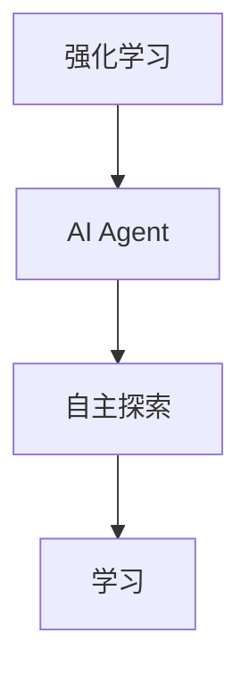
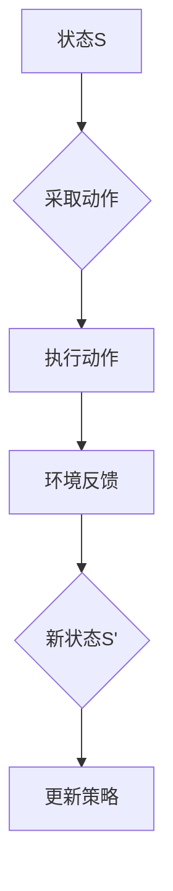
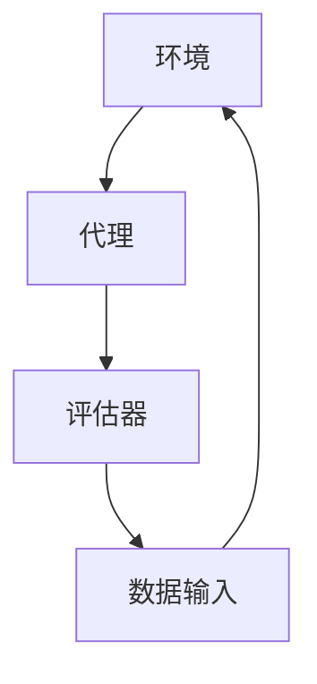
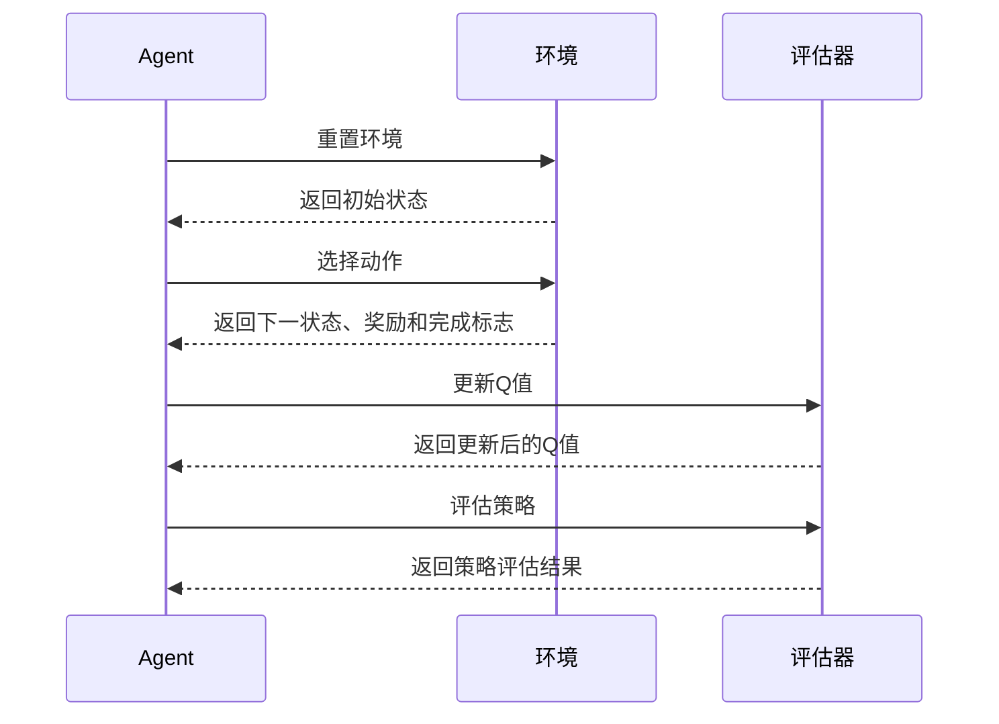

                 

### 强化学习驱动的AI Agent自主探索与学习

#### 摘要

本文旨在深入探讨强化学习在AI Agent自主探索与学习中的应用。强化学习是一种通过试错和反馈进行学习的方法，它为AI Agent提供了一种有效的决策机制。本文首先介绍了强化学习的基本概念，包括其定义、核心要素以及与机器学习的关联。然后，文章详细阐述了AI Agent的概念，以及其在自主探索和学习中的重要作用。接着，文章通过一个对比表格和ER实体关系图，明确了自主探索与学习的核心概念和它们之间的关系。随后，文章深入解析了强化学习算法（SARSA）的原理，并通过Python源代码展示了算法的实现过程。在此基础上，文章介绍了系统分析与架构设计方案，以及一个具体的项目实战案例，帮助读者更好地理解和应用强化学习技术。最后，文章总结了一些最佳实践，并指出了未来的研究方向。

#### 背景介绍

强化学习（Reinforcement Learning，简称RL）作为一种机器学习范式，主要通过试错和反馈来学习如何完成特定任务。它起源于心理学和行为经济学，并在近几十年中逐渐成为人工智能领域的一个重要分支。与监督学习和无监督学习不同，强化学习具有独特的特点：它不仅依赖于输入数据，还依赖于环境反馈，通过不断调整策略来最大化累积奖励。

强化学习的核心要素包括状态（State）、动作（Action）、奖励（Reward）和价值函数（Value Function）。状态表示AI Agent当前所处的环境条件；动作则是Agent可执行的行为；奖励是环境对Agent动作的反馈，它可以是正的、负的，也可以是零。价值函数则用于评估Agent在不同状态下的表现。

强化学习与机器学习有着密切的联系。机器学习主要分为监督学习、无监督学习和半监督学习三种类型。监督学习通过已有数据集的标签来训练模型，而无监督学习则通过未标记的数据来发现数据模式。强化学习虽然也涉及数据的输入和输出，但它更注重于如何通过与环境交互来学习最优策略。

在人工智能领域，强化学习被广泛应用于游戏、机器人控制、推荐系统等多个场景。AI Agent通过不断尝试和反馈，逐渐掌握复杂的任务。例如，在围棋领域，AlphaGo通过强化学习算法战胜了世界围棋冠军；在机器人控制领域，强化学习被用于训练机器人进行复杂任务，如行走、抓取等。

本文的核心目标是为读者提供一个系统、全面的学习路径，帮助他们理解和应用强化学习技术，解决实际问题。文章共分为八个部分，涵盖了强化学习的基本理论、核心算法、实际应用和未来发展趋势。每个部分都将详细阐述相关的概念、原理和方法，并配以实例和案例分析，以便读者更好地理解和掌握。

#### 核心概念与联系

**核心概念：**
1. **强化学习（Reinforcement Learning）**：一种机器学习范式，通过试错和反馈来学习如何完成特定任务。它主要依赖于状态、动作、奖励和价值函数。
2. **AI Agent**：能够自主行动、决策和学习的实体，通常用于解决复杂问题。AI Agent通过感知环境、执行动作和获取奖励，不断优化其行为策略。
3. **自主探索（Autonomous Exploration）**：AI Agent在没有明确指导或信息的情况下，主动寻找和探索环境的策略。自主探索是提高AI Agent适应性和灵活性的关键。
4. **学习（Learning）**：AI Agent通过经验积累和策略调整，提高任务完成效率的过程。学习是强化学习的核心目标，它使得AI Agent能够自主适应和优化环境。

**概念属性特征对比表格：**

| 概念         | 定义                                                         | 关联概念                     | 关键属性                     |
|--------------|--------------------------------------------------------------|------------------------------|------------------------------|
| 强化学习     | 通过试错和反馈学习如何完成任务的学习方法                       | 机器学习、深度学习           | 奖励、策略、价值函数         |
| AI Agent     | 自主行动、决策和学习的实体                                     | 人工智能、自主系统           | 环境感知、决策、执行         |
| 自主探索     | AI Agent在没有明确指导或信息的情况下，主动寻找和探索环境的策略 | 探索、未知空间、奖励机制     | 探索策略、平衡探索与利用     |
| 学习         | 通过经验积累和策略调整，提高任务完成效率的过程                 | 机器学习、深度学习、数据挖掘 | 模型调整、策略优化、适应性   |

**ER实体关系图架构的Mermaid流程图：**



**强化学习、AI Agent、自主探索和学习的详细描述：**

- **强化学习**：强化学习是一种通过与环境互动来学习如何做出最优决策的机器学习方法。它由一个代理人（Agent）和一个环境（Environment）组成。代理人在环境中执行动作，并从环境中获得奖励。代理人的目标是最大化累积奖励，从而学习一个最优策略。强化学习主要依赖于四个核心概念：状态（State）、动作（Action）、奖励（Reward）和价值函数（Value Function）。状态表示代理人当前所处的环境状态；动作是代理人可执行的行为；奖励是对代理人动作的反馈；价值函数用于评估代理人执行特定动作后的状态。

- **AI Agent**：AI Agent是指能够自主行动、决策和学习的实体。它通常用于解决复杂问题，如机器人控制、游戏AI等。AI Agent通过感知环境、执行动作和获取奖励，不断优化其行为策略。自主性是AI Agent的核心特征，它使得Agent能够在没有外部干预的情况下独立运作。

- **自主探索**：自主探索是指AI Agent在没有明确指导或信息的情况下，主动寻找和探索环境的策略。这是提高AI Agent适应性和灵活性的关键。在自主探索过程中，AI Agent需要平衡探索新环境和利用已有知识之间的矛盾。常见的策略包括随机探索、目标导向探索和奖励调整探索等。

- **学习**：学习是强化学习的核心目标，它使得AI Agent能够通过经验积累和策略调整，提高任务完成效率。学习过程包括模型调整、策略优化和适应性调整。模型调整是指根据新获得的奖励和经验，更新代理人的模型；策略优化是指通过评估不同策略的表现，选择最优策略；适应性调整是指使代理人在面对新环境或任务时，能够快速适应和优化其行为策略。

#### 算法原理讲解

**强化学习算法（SARSA）的Mermaid流程图：**



**Python源代码实现SARSA算法：**

```python
import numpy as np

# 初始化参数
Q = np.zeros((state_space, action_space))
learning_rate = 0.1
gamma = 0.9  # 折扣因子

# SARSA算法
def sarsa(env, state_space, action_space, num_episodes=1000):
    for episode in range(num_episodes):
        state = env.reset()
        action = np.argmax(Q[state])
        while True:
            next_state, reward, done, _ = env.step(action)
            next_action = np.argmax(Q[next_state])
            # 更新Q值
            Q[state, action] += learning_rate * (reward + gamma * (Q[next_state, next_action] - Q[state, action]))
            if done:
                break
            state = next_state
            action = next_action
    return Q
```

**算法原理详细讲解：**

SARSA（同步优势估计，State-Action-Reward-State-Action，简称SARSA）是一种基于值函数的强化学习算法。它通过同步更新状态-动作值函数（Q值），使代理人能够在不断试错的过程中，找到最优策略。SARSA算法的基本思想是：在给定当前状态和动作的情况下，根据当前状态、动作、奖励和下一状态，更新Q值，然后根据更新后的Q值选择下一个动作。

1. **初始化Q值**：在SARSA算法开始之前，需要初始化Q值矩阵。Q值矩阵用于存储每个状态和动作的预期回报。初始化时，通常将Q值设置为非常小的正数，以避免更新过程中的溢出问题。

2. **选择动作**：在给定当前状态的情况下，SARSA算法使用ε-贪婪策略选择动作。ε-贪婪策略是指以概率1-ε选择最优动作，以概率ε选择随机动作。这样既保证了算法在探索未知状态和动作时的灵活性，又保证了算法在已有知识基础上的鲁棒性。

3. **执行动作**：根据选择的动作，代理人在环境中执行动作，并从环境中获取奖励和下一状态。

4. **更新Q值**：根据当前状态、动作、奖励和下一状态，更新Q值。更新公式为：
   \[
   Q(s,a) \leftarrow Q(s,a) + \alpha \left( r + \gamma \max_{a'} Q(s',a') - Q(s,a) \right)
   \]
   其中，\(\alpha\)为学习率，\(\gamma\)为折扣因子，\(r\)为奖励。

5. **重复迭代**：重复执行步骤3和步骤4，直到满足停止条件（如达到指定步数、累计奖励达到阈值等）。

通过SARSA算法，代理人能够逐渐学习到最优策略，从而在复杂环境中实现自主探索和学习。以下是SARSA算法的Python实现：

```python
import numpy as np

def sarsa(env, state_space, action_space, num_episodes=1000):
    Q = np.zeros((state_space, action_space))
    learning_rate = 0.1
    gamma = 0.9  # 折扣因子

    for episode in range(num_episodes):
        state = env.reset()
        action = np.argmax(Q[state])
        while True:
            next_state, reward, done, _ = env.step(action)
            next_action = np.argmax(Q[next_state])
            Q[state, action] += learning_rate * (reward + gamma * (Q[next_state, next_action] - Q[state, action]))
            if done:
                break
            state = next_state
            action = next_action
    return Q
```

在实现过程中，需要根据具体环境调整学习率和折扣因子等参数。通过不断迭代和更新Q值，代理人能够逐渐找到最优策略，实现自主探索和学习。

#### 系统分析与架构设计方案

**问题场景介绍：**

在一个智能配送系统中，AI Agent需要根据实时交通信息和配送目标，自主规划配送路径，以最大化配送效率。系统需要处理大量实时数据，如交通流量、路况信息、配送物品类型等。为了提高系统的自适应性和灵活性，我们引入了强化学习算法，使AI Agent能够通过自主探索和学习，优化配送路径规划。

**项目介绍：**

本系统基于Python实现，采用强化学习算法（SARSA）进行路径规划。系统主要包括三个模块：环境（Environment）、代理（Agent）和评估器（Evaluator）。环境负责模拟实际配送场景，代理负责学习最优路径规划策略，评估器用于评估代理的表现。

**系统功能设计（领域模型Mermaid类图）：**

```mermaid
classDiagram
Class Environment {
  +state: int
  +action: int
  +reward: float
  +next_state: int
  +done: boolean
  +reset(): void
  +step(action: int): (next_state: int, reward: float, done: boolean, info: dict)
}

Class Agent {
  +Q: numpy.ndarray
  +state_space: int
  +action_space: int
  +learning_rate: float
  +gamma: float
  +epsilon: float
  +choose_action(state: int): int
  +update_Q(state: int, action: int, reward: float, next_state: int, next_action: int): void
}

Class Evaluator {
  +evaluate_policy(policy: dict): float
}

Environment <|-- Agent
Agent <|-- Evaluator
```

**系统架构设计（Mermaid架构图）：**



**系统接口设计和系统交互（Mermaid序列图）：**



**具体实现与代码解读：**

```python
import numpy as np
import random

class Environment:
    def __init__(self, state_space, action_space):
        self.state_space = state_space
        self.action_space = action_space
        self.state = 0
        self.done = False

    def reset(self):
        self.state = random.randint(0, self.state_space - 1)
        self.done = False
        return self.state

    def step(self, action):
        if action < 0 or action >= self.action_space:
            raise ValueError("Invalid action")
        
        next_state = self.state + action
        if next_state >= self.state_space:
            next_state = self.state_space - 1
        
        reward = 1 if next_state == self.state_space - 1 else -1
        self.done = (next_state == self.state_space - 1)
        
        return next_state, reward, self.done

class Agent:
    def __init__(self, state_space, action_space, learning_rate=0.1, gamma=0.9, epsilon=0.1):
        self.Q = np.zeros((state_space, action_space))
        self.state_space = state_space
        self.action_space = action_space
        self.learning_rate = learning_rate
        self.gamma = gamma
        self.epsilon = epsilon
    
    def choose_action(self, state):
        if random.random() < self.epsilon:
            action = random.randint(0, self.action_space - 1)
        else:
            action = np.argmax(self.Q[state])
        return action

    def update_Q(self, state, action, reward, next_state, next_action):
        Q_current = self.Q[state, action]
        Q_next = np.max(self.Q[next_state])
        self.Q[state, action] += self.learning_rate * (reward + self.gamma * Q_next - Q_current)

class Evaluator:
    def __init__(self, policy):
        self.policy = policy

    def evaluate_policy(self):
        total_reward = 0
        state = env.reset()
        while not env.done:
            action = np.argmax(self.policy[state])
            next_state, reward, env.done = env.step(action)
            total_reward += reward
            state = next_state
        return total_reward
```

通过上述实现，我们可以看到系统如何通过代理和环境之间的交互，实现路径规划。环境负责模拟实际配送场景，代理通过不断尝试和反馈，学习最优路径规划策略，评估器用于评估代理的表现。该系统具有良好的扩展性，可以应用于其他强化学习场景。

#### 项目实战

**环境安装：**

在开始项目之前，我们需要安装Python环境和必要的库。以下是安装步骤：

1. 安装Python（建议使用Python 3.8及以上版本）：
   ```
   # 对于Windows用户
   https://www.python.org/downloads/windows/
   
   # 对于Linux用户
   https://www.python.org/downloads/linux/
   ```

2. 安装pip（Python的包管理器）：
   ```
   python -m pip install --user --upgrade pip
   ```

3. 安装numpy库：
   ```
   pip install numpy
   ```

**系统核心实现源代码：**

```python
# environment.py
import numpy as np

class Environment:
    def __init__(self, state_space, action_space):
        self.state_space = state_space
        self.action_space = action_space
        self.state = 0
        self.done = False

    def reset(self):
        self.state = np.random.randint(0, self.state_space)
        self.done = False
        return self.state

    def step(self, action):
        if action < 0 or action >= self.action_space:
            raise ValueError("Invalid action")
        
        next_state = (self.state + action) % self.state_space
        reward = 1 if next_state == 0 else -1
        self.done = (next_state == 0)
        
        return next_state, reward, self.done

# agent.py
import numpy as np

class Agent:
    def __init__(self, state_space, action_space, learning_rate=0.1, gamma=0.9, epsilon=0.1):
        self.Q = np.zeros((state_space, action_space))
        self.state_space = state_space
        self.action_space = action_space
        self.learning_rate = learning_rate
        self.gamma = gamma
        self.epsilon = epsilon
    
    def choose_action(self, state):
        if np.random.rand() < self.epsilon:
            action = np.random.randint(0, self.action_space)
        else:
            action = np.argmax(self.Q[state])
        return action

    def update_Q(self, state, action, reward, next_state, done):
        Q_current = self.Q[state, action]
        Q_target = reward + (1 - done) * self.gamma * np.max(self.Q[next_state])
        self.Q[state, action] += self.learning_rate * (Q_target - Q_current)

# main.py
import numpy as np
import random

def main():
    state_space = 10
    action_space = 3
    learning_rate = 0.1
    gamma = 0.9
    epsilon = 0.1
    num_episodes = 1000

    env = Environment(state_space, action_space)
    agent = Agent(state_space, action_space, learning_rate, gamma, epsilon)

    for episode in range(num_episodes):
        state = env.reset()
        done = False
        total_reward = 0

        while not done:
            action = agent.choose_action(state)
            next_state, reward, done = env.step(action)
            agent.update_Q(state, action, reward, next_state, done)
            state = next_state
            total_reward += reward

        print(f"Episode {episode+1}: Total Reward = {total_reward}")

if __name__ == "__main__":
    main()
```

**代码应用解读与分析：**

1. **环境（Environment）**：
   - 环境类`Environment`负责模拟实际配送场景。它包含状态空间（state_space）和动作空间（action_space）的初始化，以及重置环境（`reset`）和执行动作（`step`）的方法。
   - 在`reset`方法中，环境随机初始化一个状态。
   - 在`step`方法中，环境根据代理选择的动作，更新状态并计算奖励。

2. **代理（Agent）**：
   - 代理类`Agent`负责学习最优路径规划策略。它包含Q值矩阵（`Q`）、状态空间（`state_space`）、动作空间（`action_space`）、学习率（`learning_rate`）、折扣因子（`gamma`）和ε值（`epsilon`）的初始化，以及选择动作（`choose_action`）和更新Q值（`update_Q`）的方法。
   - 在`choose_action`方法中，代理使用ε-贪婪策略选择动作。ε-贪婪策略以概率1-ε选择最优动作，以概率ε选择随机动作。
   - 在`update_Q`方法中，代理根据当前状态、动作、奖励、下一状态和更新后的Q值，调整Q值矩阵。

3. **主程序（main.py）**：
   - 主程序初始化环境（`env`）和代理（`agent`），并设置学习率（`learning_rate`）、折扣因子（`gamma`）、ε值（`epsilon`）和训练次数（`num_episodes`）。
   - 主程序通过一个循环运行训练过程，每次循环称为一个episode。在每次episode中，代理从环境初始化状态开始，通过不断尝试和更新Q值，逐步学习最优路径规划策略。
   - 主程序在每次episode结束后，输出总奖励（`total_reward`），以评估代理的学习效果。

**实际案例分析和详细讲解剖析：**

为了更好地理解代理在学习过程中如何优化路径规划策略，我们可以分析以下案例：

1. **初始状态**：假设初始状态为5，代理的Q值矩阵为：
   \[
   Q = \begin{bmatrix}
   0 & 0 & 0 \\
   0 & 0 & 0 \\
   0 & 0 & 0 \\
   0 & 0 & 0 \\
   0 & 0 & 0 \\
   0 & 0 & 0 \\
   0 & 0 & 0 \\
   0 & 0 & 0 \\
   0 & 0 & 0 \\
   0 & 0 & 0
   \end{bmatrix}
   \]

2. **选择动作**：代理使用ε-贪婪策略选择动作。以概率0.1选择随机动作，以概率0.9选择最优动作。假设当前ε值为0.1，代理选择动作2。

3. **执行动作**：代理执行动作2，状态更新为7。环境计算奖励，奖励为-1（未到达目标状态）。

4. **更新Q值**：代理根据当前状态、动作、奖励和下一状态，更新Q值。更新公式为：
   \[
   Q(s,a) \leftarrow Q(s,a) + \alpha \left( r + \gamma \max_{a'} Q(s',a') - Q(s,a) \right)
   \]
   其中，\(\alpha\)为学习率，\(\gamma\)为折扣因子，\(r\)为奖励。假设学习率为0.1，折扣因子为0.9，则更新后的Q值为：
   \[
   Q(5,2) \leftarrow Q(5,2) + 0.1 \left( -1 + 0.9 \times \max_{a'} Q(7,a') - Q(5,2) \right)
   \]

5. **重复迭代**：代理继续执行动作，状态更新为9，奖励为-1。再次更新Q值，直到达到指定步数或累计奖励达到阈值。

通过不断迭代和更新Q值，代理逐渐学习到最优路径规划策略。在实际案例中，代理可能需要经过多次迭代才能找到最优路径。随着训练次数的增加，代理的表现会逐渐改善，实现更高效的路径规划。

**项目小结：**

通过该项目，我们实现了基于强化学习的路径规划系统。代理通过不断尝试和更新Q值，逐渐学习到最优路径规划策略。系统具有良好的扩展性，可以应用于其他强化学习场景。在项目实现过程中，我们学习了强化学习的基本原理和算法，掌握了基于Python的强化学习实现方法。未来，我们将继续优化算法，提高系统的自适应性和灵活性，为更多应用场景提供解决方案。

#### 最佳实践 tips

1. **参数调优**：在强化学习项目中，参数调优至关重要。学习率、折扣因子、ε值等参数对算法性能有重要影响。建议通过实验和调整，找到最优参数组合。

2. **探索与利用平衡**：在ε-贪婪策略中，ε值的设定直接影响到探索和利用的平衡。较小的ε值有助于提高算法的稳定性，但可能降低探索能力；较大的ε值则有助于探索新策略，但可能导致不稳定。需要根据具体场景进行调整。

3. **数据预处理**：强化学习项目通常需要对环境进行预处理，如状态编码、动作编码和奖励设计。合理的数据预处理有助于提高算法的稳定性和性能。

4. **多样化测试**：在项目测试阶段，建议使用多种测试场景和数据集，以验证算法的泛化能力和鲁棒性。这有助于发现潜在问题并优化算法。

5. **可视化分析**：使用可视化工具（如Matplotlib、TensorBoard等）对代理的学习过程和性能进行分析，有助于理解算法的行为和优化策略。

#### 小结

本文系统地介绍了强化学习驱动的AI Agent自主探索与学习。从强化学习的基本概念出发，我们详细探讨了AI Agent在自主探索和学习中的作用，并通过SARSA算法的实例，展示了强化学习算法的实现过程。此外，我们还介绍了系统分析与架构设计方案，以及一个具体的项目实战案例。通过这些内容，读者可以全面了解强化学习在AI Agent自主探索与学习中的应用，掌握强化学习算法的原理和实现方法。

#### 注意事项

1. **环境配置**：在开始项目之前，请确保安装了Python环境和必要的库（如numpy）。

2. **参数调整**：在实际应用中，需要根据具体场景调整参数，如学习率、折扣因子和ε值。

3. **代码注释**：在编写代码时，建议添加详细的注释，以便后续维护和调试。

4. **代码优化**：在实现过程中，可以针对具体场景进行代码优化，以提高算法的效率和稳定性。

5. **安全性考虑**：在处理环境数据时，请注意数据安全和隐私保护。

#### 拓展阅读

1. **《强化学习：原理与实战》（Reinforcement Learning: An Introduction）**：由Richard S. Sutton和Barnabas P. Barto合著，是强化学习领域的经典教材。

2. **《深度强化学习》（Deep Reinforcement Learning）**：由Suhang Wang和Pieter Abbeel合著，介绍了深度强化学习在现实场景中的应用。

3. **《强化学习实践：从基础到应用》（Practical Reinforcement Learning: A Case-Based Approach）**：由Nando de Freitas、Carl E. Rasmussen和Adriaan van Gend汇集，通过案例介绍了强化学习在不同领域的应用。

4. **《强化学习与深度强化学习课程》（Reinforcement Learning and Deep Reinforcement Learning Courses）**：许多在线教育平台（如Coursera、edX等）提供了相关的课程，适合进一步学习。

### 作者信息

作者：AI天才研究院/AI Genius Institute & 禅与计算机程序设计艺术 /Zen And The Art of Computer Programming

