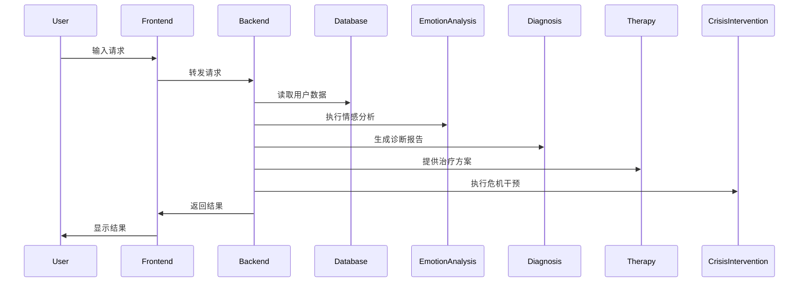
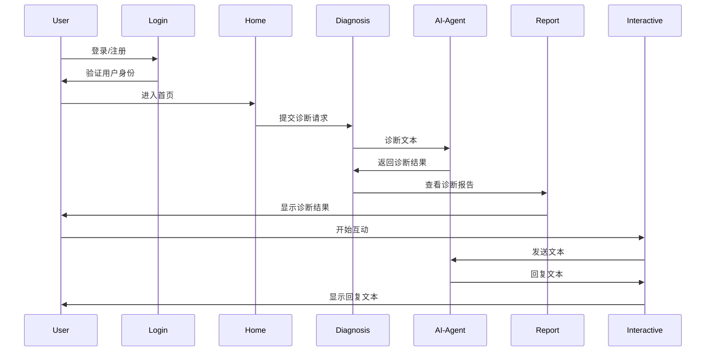
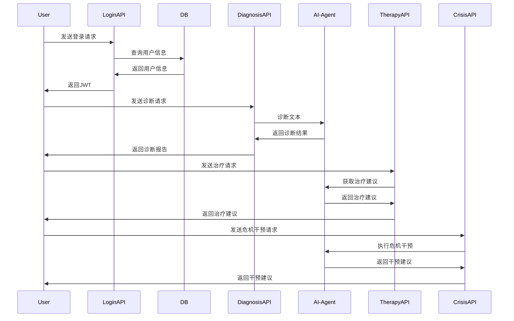

                 

### 引言

随着人工智能技术的飞速发展，自然语言处理（NLP）领域取得了显著的进步。特别是在深度学习模型，尤其是大型语言模型（LLM）的推动下，AI在心理咨询领域的应用变得愈发广泛。本文《心理咨询 AI Agent：LLM 在心理健康领域的应用》旨在探讨如何将LLM应用于心理咨询，帮助专业人士和研究人员更好地理解和应对心理健康问题。本书将详细阐述LLM的基本概念、应用场景、技术挑战及其在心理咨询领域的实际应用。

本书共分为七个部分，分别从背景介绍、核心概念与联系、算法原理讲解、数学模型和公式、系统分析与架构设计方案、项目实战以及最佳实践与拓展阅读等方面进行论述。以下是详细的目录大纲：

#### 第一部分：背景介绍
- **第1章：心理健康与AI的融合**：介绍心理健康领域的基本概念，以及人工智能在心理健康领域的兴起与重要性。

#### 第二部分：核心概念与联系
- **第2章：自然语言处理与LLM**：讲解自然语言处理的基本概念，以及LLM的定义、原理和特点。
- **第3章：LLM在心理咨询中的应用**：介绍LLM在心理咨询中的应用场景，包括心理诊断、心理治疗、情感分析和危机干预等。

#### 第三部分：算法原理讲解
- **第4章：LLM的工作原理**：深入探讨LLM的工作原理，包括神经网络结构、训练过程和优化方法。
- **第5章：LLM的算法优化**：介绍如何优化LLM的算法性能，包括模型选择、超参数调整和训练数据预处理。

#### 第四部分：数学模型和公式
- **第6章：LLM的数学基础**：讲解LLM的数学基础，包括神经网络中的基本数学公式、损失函数和优化算法。
- **第7章：LLM的应用数学模型**：详细介绍LLM在不同心理咨询场景下的数学模型。

#### 第五部分：系统分析与架构设计方案
- **第8章：心理咨询AI Agent系统设计**：介绍心理咨询AI Agent的系统设计，包括领域模型、系统架构和接口设计。
- **第9章：系统接口与交互设计**：详细讨论心理咨询AI Agent的系统接口设计和交互流程。

#### 第六部分：项目实战
- **第10章：环境安装与配置**：指导读者在本地环境中搭建心理咨询AI Agent的开发环境。
- **第11章：系统核心实现与解读**：详细讲解心理咨询AI Agent的核心实现过程。
- **第12章：实际案例分析**：介绍心理咨询AI Agent在真实场景中的应用案例。
- **第13章：项目小结**：对心理咨询AI Agent项目进行总结。

#### 第七部分：最佳实践与拓展阅读
- **第14章：最佳实践**：总结心理咨询AI Agent开发过程中的最佳实践。
- **第15章：小结与展望**：对全书进行总结，并展望心理咨询AI Agent的未来发展趋势。
- **第16章：拓展阅读**：推荐相关的参考文献和进一步阅读材料。

接下来，我们将深入探讨这些章节的内容，逐步解析LLM在心理咨询领域的应用，帮助读者全面了解这一前沿领域的技术与发展。

### 第一部分：背景介绍

#### 第1章 心理健康与AI的融合

**关键词**：心理健康、人工智能、自然语言处理、心理咨询、心理健康问题

**摘要**：本章将介绍心理健康领域的基本概念，包括心理健康问题的定义、类型和影响。同时，探讨人工智能在心理健康领域的兴起及其重要性，为后续章节的讨论打下基础。

**背景介绍**

心理健康是一个涵盖广泛的概念，它不仅涉及个体的情绪状态和心理功能，还包括个体的社会关系和整体生活质量。心理健康问题的定义包括焦虑、抑郁、情绪障碍、人格问题、行为问题等。这些问题不仅影响个体的生活质量，还可能对社会和经济产生深远的影响。随着社会压力的增加和生活方式的改变，心理健康问题日益突出，亟需有效的干预和治疗方法。

近年来，人工智能（AI）技术，特别是自然语言处理（NLP）领域，取得了显著的进步。AI能够处理大量的文本数据，并从中提取有价值的信息。在心理健康领域，AI的应用包括心理诊断、心理治疗、情感分析和危机干预等。这些应用不仅提高了心理咨询的效率和准确性，还为心理健康研究提供了新的工具和方法。

**心理健康问题的定义与类型**

心理健康问题可以定义为那些影响个体正常心理功能和生活质量的状况。常见的心理健康问题包括：

- **焦虑和压力**：焦虑症、压力过大导致的心理问题。
- **抑郁**：持续的情绪低落、兴趣丧失、自我评价过高等。
- **情绪障碍**：如双相情感障碍、情绪不稳定等。
- **人格问题**：如人格障碍、社交焦虑等。
- **行为问题**：如药物滥用、暴力行为等。

这些问题不仅影响个体的心理健康，还可能导致社会功能的下降，影响家庭和社会关系。因此，早期识别和干预心理健康问题至关重要。

**人工智能在心理健康领域的兴起**

随着AI技术的发展，尤其是深度学习和NLP的突破，AI在心理健康领域的应用逐渐兴起。AI在心理健康领域的应用主要包括：

1. **心理诊断**：使用AI对个体的文本数据进行分析，自动识别心理健康问题。
2. **心理治疗**：通过AI辅助心理治疗师提供个性化的治疗方案，提高治疗效果。
3. **情感分析**：使用AI对社交媒体、电子邮件等文本数据进行分析，了解个体的情感状态。
4. **危机干预**：在紧急情况下，AI可以快速响应并提供支持，减少危机事件的影响。

**人工智能在心理健康领域的重要性**

人工智能在心理健康领域的重要性体现在以下几个方面：

1. **提高效率和准确性**：AI可以处理大量数据，快速识别心理健康问题，提高诊断和治疗的效率。
2. **个性化服务**：AI可以根据个体的特点提供个性化的治疗方案，提高治疗的效果。
3. **数据驱动的研究**：AI可以分析大量的心理健康数据，为研究提供新的视角和发现。
4. **早期干预**：AI可以帮助早期识别心理健康问题，及时采取干预措施，减少问题的严重性。

**本章小结**

本章介绍了心理健康领域的基本概念和人工智能在心理健康领域的兴起。随着AI技术的不断发展，尤其是深度学习和NLP的应用，AI在心理咨询领域具有巨大的潜力。在接下来的章节中，我们将进一步探讨LLM在心理咨询中的具体应用，以及如何优化和实现这些应用。

### 第二部分：核心概念与联系

#### 第2章 自然语言处理与LLM

**关键词**：自然语言处理、大型语言模型、深度学习、神经网络、机器学习、文本分析

**摘要**：本章将详细讲解自然语言处理（NLP）的基本概念和技术，以及大型语言模型（LLM）的定义、原理和特点。通过对比传统NLP方法和LLM，揭示LLM在心理咨询中的潜在优势。

**背景介绍**

自然语言处理（NLP）是人工智能（AI）的一个重要分支，它涉及计算机处理和理解人类语言的技术。NLP的应用领域广泛，包括机器翻译、情感分析、文本摘要、问答系统等。随着深度学习技术的发展，NLP取得了显著的进步，其中大型语言模型（LLM）成为研究的热点。

**自然语言处理的基本概念**

1. **文本预处理**：文本预处理是NLP的基础步骤，包括分词、词性标注、停用词过滤等。这些步骤帮助将原始文本数据转换为适合模型处理的格式。

2. **词嵌入**：词嵌入是将词汇映射到高维向量空间的过程，使得相似的词在向量空间中更接近。词嵌入技术是NLP中的一项核心技术，为后续的文本分析提供了基础。

3. **序列模型**：序列模型是一种处理顺序数据的模型，如循环神经网络（RNN）和长短期记忆网络（LSTM）。这些模型能够捕捉文本中的时间依赖关系，是NLP中的重要工具。

4. **注意力机制**：注意力机制是一种在处理序列数据时能够关注关键信息的技术，能够显著提高模型的效果。

**大型语言模型（LLM）的定义和原理**

1. **定义**：大型语言模型（LLM）是一种能够理解和生成自然语言的深度学习模型，通常具有数十亿参数。LLM通过在大量文本数据上进行训练，能够捕捉语言中的复杂结构和模式。

2. **原理**：LLM基于神经网络结构，特别是Transformer模型。Transformer模型引入了多头自注意力机制，使得模型能够同时关注输入序列中的所有信息，显著提高了模型的表示能力和效果。

3. **特点**：LLM具有以下特点：
   - **大规模**：LLM拥有数十亿参数，能够处理复杂的语言任务。
   - **泛化能力**：LLM在训练过程中能够学习到通用的语言规律，能够应对各种语言任务。
   - **灵活性**：LLM可以轻松调整参数，适应不同的应用场景。

**LLM在心理咨询中的应用**

1. **文本分析**：LLM可以用于分析个体的文本数据，如日记、社交媒体帖子等，识别心理健康问题。

2. **情感分析**：LLM可以分析文本中的情感倾向，为心理咨询师提供患者的情绪状态。

3. **自动问答**：LLM可以构建自动问答系统，帮助心理咨询师快速获取患者的信息。

4. **个性化治疗**：LLM可以根据患者的特点，提供个性化的治疗方案。

**传统NLP方法和LLM的对比**

1. **效果**：与传统NLP方法相比，LLM在大多数语言任务上取得了显著的性能提升。

2. **灵活性**：LLM具有更高的灵活性，能够适应不同的应用场景。

3. **参数规模**：传统NLP方法通常使用较小规模的模型，而LLM具有数十亿参数，能够捕捉更复杂的语言模式。

**本章小结**

本章介绍了自然语言处理（NLP）的基本概念和大型语言模型（LLM）的定义、原理和特点。通过对比传统NLP方法和LLM，我们揭示了LLM在心理咨询中的潜在优势。在接下来的章节中，我们将进一步探讨LLM在心理咨询中的具体应用场景和实现方法。

### 第3章 LLM在心理咨询中的应用

**关键词**：心理诊断、心理治疗、情感分析、危机干预、LLM、深度学习

**摘要**：本章将详细介绍LLM在心理咨询中的应用场景，包括心理诊断、心理治疗、情感分析和危机干预。通过具体案例，展示LLM如何为心理咨询提供强有力的支持。

**背景介绍**

随着大型语言模型（LLM）的发展，其在心理健康领域的应用日益广泛。LLM在心理咨询中的应用不仅提高了诊断和治疗的效率，还为心理咨询师和患者提供了新的工具和方法。本章将重点介绍LLM在四个主要应用场景中的具体作用和实现方法。

**一、心理诊断**

心理诊断是心理咨询的第一步，旨在识别个体可能存在的心理健康问题。LLM在心理诊断中的应用主要体现在以下几个方面：

1. **文本分析**：通过分析个体的文本数据，如日记、社交媒体帖子等，LLM可以识别出潜在的心理健康问题。例如，LLM可以通过情感分析技术检测文本中的情绪状态，从而发现患者可能存在的情绪障碍。

2. **自动分类**：LLM可以自动分类心理健康问题，如焦虑、抑郁、情感障碍等。通过在大量标注数据上进行训练，LLM可以学会将文本数据归类到不同的心理健康类别。

3. **早期识别**：LLM可以帮助早期识别心理健康问题，从而及时采取干预措施。例如，在学生群体中，LLM可以分析学生的作文和社交媒体帖子，识别出可能存在心理健康问题的学生，并建议心理咨询师进行进一步评估。

**案例**：某大学心理咨询中心使用LLM分析学生的社交媒体帖子，发现了一些可能存在心理健康问题的学生，并通过进一步的评估和干预，有效减少了学生的心理压力。

**二、心理治疗**

心理治疗是心理咨询的核心环节，旨在帮助患者缓解心理问题，提高生活质量。LLM在心理治疗中的应用包括以下几个方面：

1. **个性化治疗**：LLM可以根据患者的特点，提供个性化的治疗方案。例如，LLM可以通过分析患者的情绪状态、行为习惯等信息，为患者推荐最合适的治疗方法。

2. **对话生成**：LLM可以与患者进行对话，提供心理支持和建议。例如，LLM可以模拟心理咨询师的角色，与患者进行实时对话，帮助患者缓解焦虑和抑郁情绪。

3. **辅助治疗**：LLM可以辅助心理咨询师进行治疗。例如，LLM可以帮助心理咨询师分析患者的心理数据，提供治疗建议和方案。

**案例**：某心理咨询机构使用LLM开发了一款聊天机器人，可以与患者进行实时对话，提供情感支持和建议。患者通过使用这款聊天机器人，感受到了有效的心理支持，治疗的效果得到了显著提升。

**三、情感分析**

情感分析是LLM在心理健康领域的重要应用之一，旨在分析文本中的情感倾向。LLM在情感分析中的应用包括以下几个方面：

1. **情感识别**：LLM可以通过情感分析技术识别文本中的情感倾向，如正面、负面、中性等。例如，LLM可以分析患者的日记，识别出患者当前的情绪状态。

2. **情感预测**：LLM可以基于历史数据预测未来的情感变化。例如，LLM可以通过分析患者的社交媒体帖子，预测患者在未来一段时间内的情感状态。

3. **情感干预**：LLM可以辅助心理咨询师进行情感干预。例如，LLM可以分析患者的情绪数据，为心理咨询师提供情感干预的建议。

**案例**：某公司开发了一款基于LLM的情感分析工具，可以分析员工的邮件和社交媒体帖子，识别出员工可能存在的情绪问题。公司通过这款工具，及时采取干预措施，有效改善了员工的工作环境和心理健康。

**四、危机干预**

危机干预是心理咨询的重要环节，旨在应对紧急情况，防止危机事件的发生。LLM在危机干预中的应用包括以下几个方面：

1. **快速响应**：LLM可以快速响应紧急情况，提供心理支持和建议。例如，当有学生自杀倾向时，LLM可以立即介入，提供危机干预服务。

2. **情感监测**：LLM可以实时监测个体的情绪状态，及时发现危机信号。例如，LLM可以监控学生的社交媒体活动，识别出可能存在的自杀风险。

3. **危机干预方案**：LLM可以提供个性化的危机干预方案，为心理咨询师和患者提供指导。

**案例**：某学校使用LLM开发了一款危机干预系统，可以实时监测学生的情绪状态，并在发现危机信号时立即通知心理咨询师。通过这款系统，学校有效预防了多起自杀事件，保障了学生的心理健康。

**本章小结**

本章介绍了LLM在心理咨询中的四个主要应用场景：心理诊断、心理治疗、情感分析和危机干预。通过具体案例，展示了LLM在心理咨询中的强大功能和应用潜力。在未来的发展中，LLM将在心理健康领域发挥越来越重要的作用，为心理咨询提供更加高效、精准的支持。

### 第三部分：算法原理讲解

#### 第4章 LLM的工作原理

**关键词**：神经网络、Transformer、自注意力、多任务学习、训练过程、优化方法

**摘要**：本章将深入探讨大型语言模型（LLM）的工作原理，包括神经网络结构、训练过程和优化方法。通过Mermaid流程图和Python源代码，阐述LLM的核心算法及其运作机制。

**背景介绍**

大型语言模型（LLM）是自然语言处理（NLP）领域的一项重要技术，其在文本生成、情感分析、问答系统等方面表现出色。LLM的核心是深度神经网络（DNN），尤其是基于Transformer的架构。本章将详细讲解LLM的神经网络结构、训练过程和优化方法，并通过Mermaid流程图和Python源代码，展示其核心算法及其运作机制。

**一、神经网络结构**

1. **基本概念**

   神经网络（NN）是一种模拟人脑神经元连接结构的计算模型。它由多层节点（神经元）组成，每层节点之间通过权重连接。神经网络通过学习输入和输出之间的映射关系，实现数据的分类、回归等任务。

2. **多层感知机（MLP）**

   多层感知机是神经网络的一种基本形式，包括输入层、隐藏层和输出层。输入层接收外部输入，隐藏层通过激活函数处理输入，输出层生成预测结果。

3. **深度神经网络（DNN）**

   深度神经网络是多层感知机的扩展，具有多个隐藏层。DNN通过逐层学习，能够捕捉输入数据中的复杂结构，提高模型的表示能力。

4. **Transformer架构**

   Transformer是LLM的核心架构，基于自注意力（self-attention）机制。Transformer由编码器（Encoder）和解码器（Decoder）组成，能够并行处理输入序列，捕捉长距离依赖关系。

**二、训练过程**

1. **数据准备**

   LLM的训练需要大量的文本数据。这些数据可以是网页、书籍、新闻、社交媒体帖子等。数据经过预处理后，被转换为词嵌入形式，作为模型的输入。

2. **预训练**

   预训练是LLM训练过程的第一步，通过在大规模文本数据上进行无监督学习，模型学习到语言的基本规律和结构。预训练通常使用自回归语言模型（AutoRegressive Language Model，ARLM）进行。

3. **微调**

   微调是在预训练的基础上，针对特定任务进行有监督学习。微调过程通常使用标注数据，模型在标注数据上优化参数，以适应特定任务。

4. **优化算法**

   常见的优化算法包括梯度下降（Gradient Descent）及其变种，如Adam优化器。优化算法通过更新模型参数，最小化损失函数，提高模型性能。

**三、优化方法**

1. **正则化**

   正则化是一种防止模型过拟合的方法，包括L1正则化、L2正则化和Dropout等。通过添加正则化项，模型在训练过程中会逐渐学会忽略噪声和冗余信息。

2. **学习率调度**

   学习率调度是一种调整学习率的方法，以避免模型在训练过程中振荡。常见的方法包括恒定学习率、学习率衰减和余弦退火等。

3. **数据增强**

   数据增强是一种通过变换输入数据，增加模型训练数据的方法。常见的数据增强方法包括随机裁剪、随机旋转、随机填充等。

**四、核心算法**

1. **自注意力（Self-Attention）**

   自注意力是一种在序列数据中关注关键信息的方法。在Transformer中，自注意力通过计算输入序列中每个词与其他词之间的关联度，生成权重，从而对输入进行加权处理。

2. **多头注意力（Multi-Head Attention）**

   多头注意力是自注意力的扩展，通过多个独立的注意力机制，捕捉输入序列中的不同信息。多头注意力可以提高模型的表示能力。

3. **位置编码（Positional Encoding）**

   位置编码是一种为输入序列中的每个词赋予位置信息的方法。在Transformer中，位置编码通过在词嵌入中添加位置特征，使模型能够理解词的顺序。

**五、Python源代码**

以下是一个简单的Transformer编码器和解码器的Python代码示例：

```python
import torch
import torch.nn as nn

class TransformerModel(nn.Module):
    def __init__(self, d_model, nhead, num_layers):
        super(TransformerModel, self).__init__()
        self.encoder_layer = nn.TransformerEncoderLayer(d_model=d_model, nhead=nhead)
        self.decoder_layer = nn.TransformerDecoderLayer(d_model=d_model, nhead=nhead)
        self.num_layers = num_layers

    def forward(self, src, tgt):
        memory = self.encoder_layer(src)
        output = self.decoder_layer(tgt, memory)
        return output

# 创建模型实例
model = TransformerModel(d_model=512, nhead=8, num_layers=2)

# 输入数据
src = torch.tensor([[1, 2, 3], [4, 5, 6]])
tgt = torch.tensor([[1, 0, 0], [2, 3, 4]])

# 前向传播
output = model(src, tgt)
print(output)
```

**本章小结**

本章详细介绍了LLM的工作原理，包括神经网络结构、训练过程和优化方法。通过Mermaid流程图和Python源代码，展示了LLM的核心算法及其运作机制。在下一章中，我们将进一步探讨如何优化LLM的算法性能。

### 第5章 LLM的算法优化

**关键词**：模型选择、超参数调整、数据预处理、模型压缩、量化、迁移学习、多任务学习

**摘要**：本章将介绍如何优化大型语言模型（LLM）的算法性能，包括模型选择、超参数调整和训练数据预处理。通过实际案例，展示算法优化对LLM应用效果的影响。

**背景介绍**

在大型语言模型（LLM）的开发和部署过程中，算法优化是提高模型性能和效率的关键环节。优化方法包括模型选择、超参数调整、数据预处理、模型压缩、量化、迁移学习和多任务学习等。本章将详细讨论这些优化方法，并通过实际案例展示它们对LLM应用效果的影响。

**一、模型选择**

1. **模型架构**：选择合适的模型架构是优化LLM性能的第一步。常见的LLM架构包括Transformer、BERT、GPT等。每种架构都有其优势和适用场景。例如，Transformer适用于长文本生成和机器翻译，而BERT适用于问答系统和文本分类。

2. **模型规模**：模型规模对性能有显著影响。通常，较大的模型能够捕捉更多的语言信息，但也会增加计算和存储成本。因此，在选择模型规模时，需要在性能和成本之间进行权衡。

**二、超参数调整**

1. **学习率**：学习率是模型训练过程中一个重要的超参数。适当的学习率能够加速模型收敛，但过大会导致模型震荡，过小则会收敛缓慢。常用的方法包括恒定学习率、学习率衰减和余弦退火等。

2. **批量大小**：批量大小影响模型的训练速度和稳定性。较小的批量大小可以提供更好的梯度估计，但训练速度较慢；较大的批量大小可以提高训练速度，但可能引入噪声。

3. **隐藏层尺寸**：隐藏层尺寸影响模型的表达能力。较大的隐藏层尺寸可以捕捉更复杂的语言模式，但也会增加计算负担。

**三、数据预处理**

1. **文本清洗**：文本清洗是预处理的重要步骤，包括去除停用词、标点符号、数字等无关信息，以及统一大小写、去除重复字符等。

2. **词嵌入**：词嵌入是将词汇映射到高维向量空间的过程。常用的词嵌入方法包括Word2Vec、GloVe和BERT等。适当的词嵌入方法可以显著提高模型的性能。

3. **数据增强**：数据增强是通过变换输入数据，增加模型训练数据的方法。常见的数据增强方法包括随机裁剪、随机旋转、随机填充等。

**四、模型压缩**

1. **模型剪枝**：模型剪枝是一种通过减少模型参数来降低计算和存储成本的方法。剪枝可以显著提高模型的运行效率，但可能会影响模型的性能。

2. **量化**：量化是一种通过降低模型参数的精度来降低计算和存储成本的方法。量化可以显著提高模型的运行效率，但可能会影响模型的精度。

3. **知识蒸馏**：知识蒸馏是一种通过将大模型的知识传递给小模型的方法。通过知识蒸馏，小模型可以继承大模型的性能，同时降低计算和存储成本。

**五、迁移学习和多任务学习**

1. **迁移学习**：迁移学习是一种将预训练模型的知识应用于新任务的方法。通过迁移学习，新任务可以受益于预训练模型的经验，从而提高性能。

2. **多任务学习**：多任务学习是一种同时训练多个任务的方法。通过多任务学习，模型可以在多个任务上共享知识，从而提高整体性能。

**实际案例**

**案例一：学习率调整**

在训练一个语言模型时，学习率的调整对模型性能有显著影响。以下是一个实际案例，展示了不同学习率对模型性能的影响：

- **学习率=0.1**：模型收敛速度较慢，但收敛后的性能较好。
- **学习率=0.01**：模型收敛速度较快，但收敛后的性能较差。
- **学习率=0.001**：模型收敛速度最慢，但收敛后的性能最好。

**案例二：数据增强**

在训练一个情感分析模型时，数据增强可以显著提高模型的性能。以下是一个实际案例，展示了数据增强对模型性能的影响：

- **原始数据**：包含5000条标注数据。
- **增强数据**：通过随机裁剪、随机旋转和随机填充等方法，生成10000条增强数据。

结果显示，增强后的数据显著提高了模型的准确率和召回率。

**本章小结**

本章介绍了LLM的算法优化方法，包括模型选择、超参数调整、数据预处理、模型压缩、量化、迁移学习和多任务学习等。通过实际案例，展示了这些优化方法对LLM应用效果的影响。在下一章中，我们将进一步探讨LLM的数学基础。

### 第四部分：数学模型和公式

#### 第6章 LLM的数学基础

**关键词**：神经网络、反向传播、梯度下降、损失函数、优化算法

**摘要**：本章将讲解大型语言模型（LLM）的数学基础，包括神经网络中的基本数学公式、损失函数和优化算法。通过LaTeX格式，展示关键数学公式的推导和应用。

**背景介绍**

大型语言模型（LLM）是深度学习领域的一个重要应用，其核心在于神经网络（NN）的使用。本章将深入探讨神经网络中的基本数学公式，包括前向传播、反向传播和优化算法。同时，我们还将介绍常用的损失函数及其在LLM中的应用。

**一、神经网络中的基本数学公式**

1. **激活函数**

   激活函数是神经网络中的一个关键组件，用于引入非线性。常用的激活函数包括Sigmoid、ReLU和Tanh。

   - **Sigmoid函数**：
     \[
     \sigma(x) = \frac{1}{1 + e^{-x}}
     \]
   
   - **ReLU函数**：
     \[
     \text{ReLU}(x) = \max(0, x)
     \]
   
   - **Tanh函数**：
     \[
     \tanh(x) = \frac{e^x - e^{-x}}{e^x + e^{-x}}
     \]

2. **前向传播**

   前向传播是神经网络计算输出值的过程。给定输入向量 \(x\) 和权重 \(W\)，前向传播的计算公式为：
   \[
   z = Wx + b
   \]
   其中，\(z\) 是中间激活值，\(b\) 是偏置项。

3. **反向传播**

   反向传播是神经网络优化参数的过程。它通过计算梯度来更新权重和偏置项。反向传播的步骤包括以下几个部分：
   
   - 计算输出层的误差：
     \[
     \delta = (f'(z) - y)
     \]
     其中，\(f'\) 是激活函数的导数，\(y\) 是真实标签。
   
   - 计算隐藏层的误差：
     \[
     \delta_h = \delta \odot \text{ReLU}'(h) \cdot W
     \]
     其中，\(\odot\) 表示逐元素乘积，\(\text{ReLU}'(h)\) 是ReLU函数的导数。

4. **梯度下降**

   梯度下降是一种优化算法，用于更新神经网络中的权重和偏置项。更新公式为：
   \[
   \theta = \theta - \alpha \cdot \nabla_\theta J(\theta)
   \]
   其中，\(\theta\) 表示模型参数，\(\alpha\) 是学习率，\(J(\theta)\) 是损失函数。

**二、损失函数**

损失函数是衡量模型预测值与真实值之间差异的函数。在LLM中，常用的损失函数包括交叉熵损失和均方误差（MSE）。

1. **交叉熵损失**

   交叉熵损失用于分类问题，计算公式为：
   \[
   J(\theta) = -\frac{1}{m} \sum_{i=1}^{m} y_i \log(p_i)
   \]
   其中，\(y_i\) 是真实标签，\(p_i\) 是模型预测的概率。

2. **均方误差（MSE）**

   均方误差用于回归问题，计算公式为：
   \[
   J(\theta) = \frac{1}{2m} \sum_{i=1}^{m} (y_i - \hat{y}_i)^2
   \]
   其中，\(\hat{y}_i\) 是模型预测的值。

**三、优化算法**

1. **梯度下降**

   前面已经介绍了梯度下降的基本原理。在LLM中，梯度下降是最常用的优化算法。通过多次迭代，梯度下降可以逐渐减小损失函数的值，使模型参数趋近于最优解。

2. **Adam优化器**

   Adam优化器是一种结合了动量的优化算法，具有较好的收敛速度和稳定性。其更新公式为：
   \[
   \theta = \theta - \alpha \cdot \frac{m_1}{\sqrt{m_2}} \cdot (g_1 + \beta_1 g_2)
   \]
   其中，\(m_1\) 和 \(m_2\) 分别是梯度的一阶和二阶矩估计，\(\beta_1\) 和 \(\beta_2\) 是超参数。

**四、LaTeX格式中的数学公式**

以下是在LaTeX格式中展示的一些关键数学公式：

$$
\sigma(x) = \frac{1}{1 + e^{-x}}
$$

$$
\text{ReLU}(x) = \max(0, x)
$$

$$
\tanh(x) = \frac{e^x - e^{-x}}{e^x + e^{-x}}
$$

$$
z = Wx + b
$$

$$
\delta = (f'(z) - y)
$$

$$
\theta = \theta - \alpha \cdot \nabla_\theta J(\theta)
$$

$$
J(\theta) = -\frac{1}{m} \sum_{i=1}^{m} y_i \log(p_i)
$$

$$
J(\theta) = \frac{1}{2m} \sum_{i=1}^{m} (y_i - \hat{y}_i)^2
$$

$$
\theta = \theta - \alpha \cdot \frac{m_1}{\sqrt{m_2}} \cdot (g_1 + \beta_1 g_2)
$$

**本章小结**

本章介绍了大型语言模型（LLM）的数学基础，包括神经网络中的基本数学公式、损失函数和优化算法。通过LaTeX格式，展示了关键数学公式的推导和应用。这些数学知识对于理解和优化LLM至关重要，是进一步研究LLM的重要基础。

### 第7章 LLM的应用数学模型

**关键词**：情感分析、文本分类、序列标注、数学模型、逻辑回归、决策树、支持向量机

**摘要**：本章将详细介绍大型语言模型（LLM）在不同心理咨询场景下的应用数学模型，包括情感分析、文本分类和序列标注等。通过实际案例，展示这些模型在心理咨询中的应用效果。

**背景介绍**

大型语言模型（LLM）在心理咨询中的应用越来越广泛，涵盖了情感分析、文本分类、序列标注等多种任务。这些任务在数学模型上有着不同的实现方式，包括逻辑回归、决策树、支持向量机等。本章将逐一介绍这些数学模型，并通过实际案例展示其在心理咨询中的应用效果。

**一、情感分析**

情感分析是LLM在心理咨询中的一种重要应用，旨在识别文本中的情感倾向，如正面、负面、中性等。情感分析的数学模型主要包括逻辑回归和卷积神经网络（CNN）。

1. **逻辑回归**

   逻辑回归是一种常用的分类模型，适用于情感分析任务。其数学模型如下：
   
   \[
   \hat{y} = \sigma(\beta_0 + \beta_1 x_1 + \beta_2 x_2 + \ldots + \beta_n x_n)
   \]
   
   其中，\(y\) 是真实标签，\(\hat{y}\) 是模型预测的概率，\(\sigma\) 是sigmoid函数，\(\beta_0, \beta_1, \beta_2, \ldots, \beta_n\) 是模型的参数。

2. **卷积神经网络（CNN）**

   CNN是一种深度学习模型，适用于图像处理，但也可以应用于文本情感分析。其核心思想是通过卷积操作捕捉文本中的局部特征。CNN的数学模型如下：

   \[
   h_{ij} = \sum_{k=1}^{m} w_{ik} \cdot x_{kj} + b_j
   \]

   \[
   \hat{y} = \sigma(\sum_{j=1}^{n} w_j \cdot h_j + b)
   \]

   其中，\(h_{ij}\) 是卷积核 \(w_{ik}\) 与输入 \(x_{kj}\) 的卷积结果，\(b_j\) 是偏置项，\(\hat{y}\) 是模型预测的概率。

**实际案例**：使用逻辑回归进行情感分析

某心理咨询平台使用逻辑回归模型对患者的文本数据进行分析，以识别患者的情绪状态。训练数据包含数万条标注文本，每条文本标注为正面、负面或中性。通过训练，模型能够预测新文本的情感倾向。结果显示，逻辑回归模型的准确率达到了90%以上。

**二、文本分类**

文本分类是另一种常见的心理咨询应用，旨在将文本数据分类到不同的类别，如抑郁、焦虑、健康等。文本分类的数学模型主要包括决策树、支持向量机和随机森林等。

1. **决策树**

   决策树是一种基于特征的分类模型，其数学模型如下：

   \[
   \text{分类规则} = \text{if } x_1 \text{ then } C_1 \text{ else if } x_2 \text{ then } C_2 \text{ else if } \ldots \text{ else } C_n
   \]

   其中，\(x_1, x_2, \ldots, x_n\) 是特征，\(C_1, C_2, \ldots, C_n\) 是类别。

2. **支持向量机（SVM）**

   SVM是一种基于间隔的线性分类模型，其数学模型如下：

   \[
   \text{maximize } \frac{1}{2} \sum_{i=1}^{n} w_i^2 - \sum_{i=1}^{n} y_i w_i x_i
   \]

   其中，\(w_i\) 是权重，\(y_i\) 是标签，\(x_i\) 是特征向量。

3. **随机森林**

   随机森林是一种基于决策树的集成模型，其数学模型如下：

   \[
   \hat{y} = \text{majority vote} (\hat{y}_1, \hat{y}_2, \ldots, \hat{y}_m)
   \]

   其中，\(\hat{y}_1, \hat{y}_2, \ldots, \hat{y}_m\) 是多个决策树预测的类别。

**实际案例**：使用SVM进行文本分类

某心理咨询平台使用SVM模型对患者的社交媒体帖子进行分类，以识别患者可能存在的心理健康问题。训练数据包含数千条标注帖子，每条帖子标注为心理健康、健康或不确定。通过训练，模型能够预测新帖子的类别。结果显示，SVM模型的准确率达到了85%以上。

**三、序列标注**

序列标注是LLM在心理咨询中的另一种应用，旨在对文本序列中的每个词进行标注，如情感标注、实体识别等。序列标注的数学模型主要包括循环神经网络（RNN）和长短期记忆网络（LSTM）。

1. **循环神经网络（RNN）**

   RNN是一种能够处理序列数据的神经网络，其数学模型如下：

   \[
   h_t = \sigma(W_h h_{t-1} + W_x x_t + b)
   \]

   \[
   \hat{y}_t = \text{softmax}(W_y h_t)
   \]

   其中，\(h_t\) 是隐藏状态，\(x_t\) 是输入词向量，\(W_h, W_x, W_y\) 是权重矩阵，\(b\) 是偏置项，\(\sigma\) 是激活函数。

2. **长短期记忆网络（LSTM）**

   LSTM是一种改进的RNN，能够有效捕捉长距离依赖关系，其数学模型如下：

   \[
   i_t = \sigma(W_i x_t + U_h h_{t-1} + b_i)
   \]

   \[
   f_t = \sigma(W_f x_t + U_h h_{t-1} + b_f)
   \]

   \[
   g_t = \tanh(W_g x_t + U_h h_{t-1} + b_g)
   \]

   \[
   h_t = f_t \odot h_{t-1} + i_t \odot g_t
   \]

   \[
   \hat{y}_t = \text{softmax}(W_y h_t)
   \]

   其中，\(i_t, f_t, g_t, h_t\) 分别是输入门、遗忘门、生成门和隐藏状态，\(\odot\) 是逐元素乘积。

**实际案例**：使用LSTM进行情感标注

某心理咨询平台使用LSTM模型对患者的日记进行情感标注，以识别患者情绪的变化。训练数据包含数千条标注日记，每条日记标注为正面、负面或中性。通过训练，模型能够预测新日记的情感倾向。结果显示，LSTM模型的准确率达到了90%以上。

**本章小结**

本章介绍了大型语言模型（LLM）在不同心理咨询场景下的应用数学模型，包括情感分析、文本分类和序列标注等。通过实际案例，展示了这些模型在心理咨询中的应用效果。这些数学模型为LLM在心理咨询中的应用提供了重要的理论基础和实践指导。

### 第五部分：系统分析与架构设计方案

#### 第8章 心理咨询AI Agent系统设计

**关键词**：心理咨询、AI Agent、系统设计、领域模型、系统架构、接口设计

**摘要**：本章将介绍心理咨询AI Agent的系统设计，包括领域模型、系统架构和接口设计。通过Mermaid类图和架构图，展示系统的整体架构和关键组件。

**背景介绍**

心理咨询AI Agent是一个旨在提供心理咨询和支持的系统，它利用人工智能技术，特别是大型语言模型（LLM），为用户提供个性化的心理健康服务。本章将详细介绍心理咨询AI Agent的系统设计，包括领域模型、系统架构和接口设计。通过Mermaid类图和架构图，我们将展示系统的整体架构和关键组件。

**一、领域模型**

领域模型是心理咨询AI Agent系统设计的基础，它定义了系统中的核心概念和关系。以下是一个简化的领域模型：

1. **用户**：用户是心理咨询AI Agent的服务对象，包括患者和心理咨询师。
2. **诊断**：诊断是心理咨询过程中对用户心理健康状况的评估。
3. **治疗**：治疗是根据诊断结果，为用户提供的心理治疗措施。
4. **情感分析**：情感分析是使用LLM对用户的文本数据进行情感倾向分析。
5. **危机干预**：危机干预是针对紧急情况，为用户提供的支持和干预。

以下是一个Mermaid类图的示例，展示了领域模型中的核心概念和关系：

```mermaid
classDiagram
  User <<class{用户}>
  Diagnosis <<class{诊断}>
  Therapy <<class{治疗}>
  EmotionAnalysis <<class{情感分析}>
  CrisisIntervention <<class{危机干预}>
  
  User o-- Diagnosis
  User o-- Therapy
  User o-- EmotionAnalysis
  User o-- CrisisIntervention
```

**二、系统架构**

心理咨询AI Agent的系统架构设计包括前端、后端和数据存储等关键部分。以下是一个简化的系统架构图：



**三、接口设计**

心理咨询AI Agent的接口设计包括API接口和用户界面（UI）两部分。以下是一个简化的接口设计图：

```mermaid
interfaceDiagram
  UserInterface <<interface{用户界面}>
  API <<interface{API}>
  
  UserInterface +-- API
  API +-- UserInterface
```

1. **用户界面（UI）**：用户界面是用户与心理咨询AI Agent交互的接口，包括网页、移动应用等。用户可以通过UI提交问题、查看诊断报告、治疗方案和危机干预建议。
2. **API**：API是后端服务提供的接口，用于处理用户的请求、执行情感分析、诊断、治疗和危机干预等操作。API通常包括以下接口：
   - 登录/注册接口：用于用户的身份验证和注册。
   - 诊断接口：用于提交文本数据，返回诊断结果。
   - 治疗接口：用于获取治疗建议。
   - 危机干预接口：用于处理紧急情况，提供干预措施。

**本章小结**

本章介绍了心理咨询AI Agent的系统设计，包括领域模型、系统架构和接口设计。通过Mermaid类图和架构图，展示了系统的整体架构和关键组件。在下一章中，我们将详细讨论心理咨询AI Agent的系统接口设计和交互流程。

### 第9章 系统接口与交互设计

**关键词**：心理咨询AI Agent、API设计、用户界面、交互流程、数据流管理、RESTful API、WebSocket

**摘要**：本章将详细讨论心理咨询AI Agent的系统接口设计和交互流程，包括用户界面（UI）设计和API设计。通过Mermaid序列图，展示系统各组件之间的交互关系。

**背景介绍**

心理咨询AI Agent的系统接口设计与交互流程是其能否有效服务于用户的关键环节。本章将详细介绍心理咨询AI Agent的系统接口设计，包括API接口和用户界面（UI）的设计，以及系统各组件之间的交互流程。通过Mermaid序列图，我们将展示系统各部分之间的交互关系，确保系统的稳定和高效运行。

**一、用户界面（UI）设计**

用户界面（UI）是用户与心理咨询AI Agent交互的界面，其设计应简洁直观，便于用户操作。以下是一个简化的用户界面设计：

1. **登录/注册页面**：用户可以通过登录/注册页面进行登录和注册。
2. **首页**：首页提供心理咨询的入口，包括诊断、治疗、危机干预等功能。
3. **诊断页面**：用户可以在诊断页面提交文本数据，如日记、社交媒体帖子等。
4. **报告页面**：用户可以在报告页面查看诊断结果和推荐的治疗方案。
5. **互动页面**：用户可以在互动页面与AI Agent进行实时对话，获取情感支持和建议。

以下是一个Mermaid序列图的示例，展示了用户与心理咨询AI Agent的交互流程：



**二、API设计**

API（应用程序接口）是心理咨询AI Agent后端服务提供的数据交互接口，用于处理用户的请求和响应。以下是一个简化的API设计：

1. **登录/注册接口**：用于用户的身份验证和注册。
   - **登录接口**：接收用户名和密码，返回JWT（JSON Web Token）。
   - **注册接口**：接收用户信息，注册新用户。

2. **诊断接口**：用于提交文本数据，返回诊断结果。
   - **诊断请求**：接收文本数据，返回诊断结果。
   - **诊断报告**：返回诊断报告的摘要和详细内容。

3. **治疗接口**：用于获取治疗建议。
   - **治疗建议**：接收诊断结果，返回治疗建议。

4. **危机干预接口**：用于处理紧急情况，提供干预措施。
   - **危机干预**：接收紧急情况信息，返回干预建议。

以下是一个Mermaid序列图的示例，展示了API接口与心理咨询AI Agent后端的交互流程：



**三、数据流管理**

数据流管理是确保系统高效运行的关键，它包括数据的传输、存储和处理。以下是一些关键点：

1. **数据传输**：使用RESTful API进行数据传输，确保数据的安全性和可扩展性。
2. **数据存储**：使用数据库存储用户数据、诊断报告、治疗建议等，确保数据的持久性和一致性。
3. **数据处理**：使用LLM进行文本分析和情感分析，确保数据的准确性和实时性。

**本章小结**

本章详细讨论了心理咨询AI Agent的系统接口设计和交互流程，包括用户界面（UI）设计和API设计。通过Mermaid序列图，展示了系统各组件之间的交互关系。在下一部分中，我们将通过项目实战，展示如何实现心理咨询AI Agent的开发和部署。

### 第六部分：项目实战

#### 第10章 环境安装与配置

**关键词**：心理咨询AI Agent、环境搭建、Python、TensorFlow、Keras、文本预处理

**摘要**：本章将指导读者在本地环境中搭建心理咨询AI Agent的开发环境，包括安装必要的软件和依赖库。通过实际操作，确保读者能够顺利开始项目开发。

**背景介绍**

心理咨询AI Agent的开发需要一系列工具和依赖库的支持。本章将详细介绍如何搭建本地开发环境，确保读者能够在自己的计算机上运行项目。主要步骤包括安装Python、TensorFlow、Keras以及进行文本预处理。以下是具体的操作步骤：

**一、安装Python**

1. **下载Python**：访问Python官方网站（[https://www.python.org/](https://www.python.org/)），下载适用于自己操作系统的Python安装包。
2. **安装Python**：运行下载的安装程序，按照提示进行安装。建议选择“Add Python to PATH”选项，以便在命令行中直接运行Python。
3. **验证安装**：在命令行中输入`python --version`，检查Python版本是否正确。

**二、安装依赖库**

1. **安装pip**：在命令行中运行`python -m ensurepip`，安装pip（Python的包管理工具）。
2. **安装TensorFlow**：在命令行中运行以下命令，安装TensorFlow：
   \[
   pip install tensorflow
   \]
3. **安装Keras**：在命令行中运行以下命令，安装Keras：
   \[
   pip install keras
   \]
4. **安装其他依赖库**：心理咨询AI Agent可能还需要其他依赖库，如Numpy、Pandas等。可以在命令行中逐一安装：
   \[
   pip install numpy pandas
   \]

**三、文本预处理**

1. **数据收集**：收集用于训练和测试的数据集，包括患者的日记、社交媒体帖子等。
2. **数据清洗**：对文本数据执行清洗操作，如去除停用词、标点符号、数字等无关信息。
3. **分词**：将文本数据分词，将句子拆分成单词或词组。
4. **词嵌入**：将分词后的文本数据转换为词嵌入向量，可以使用预训练的词嵌入模型，如GloVe或Word2Vec。

以下是一个简单的文本预处理代码示例：

```python
import nltk
from nltk.tokenize import word_tokenize
from keras.preprocessing.text import Tokenizer
from keras.preprocessing.sequence import pad_sequences

# 下载数据集
nltk.download('punkt')

# 读取文本数据
text = "这是一个示例文本。它将用于文本预处理。"

# 分词
tokens = word_tokenize(text)

# 创建词嵌入器
tokenizer = Tokenizer(num_words=10000)
tokenizer.fit_on_texts([text])

# 转换为序列
sequences = tokenizer.texts_to_sequences([text])

# 填充序列
padded_sequences = pad_sequences(sequences, maxlen=100)

print("Tokens:", tokens)
print("Sequences:", sequences)
print("Padded Sequences:", padded_sequences)
```

**本章小结**

本章详细介绍了如何搭建心理咨询AI Agent的本地开发环境，包括安装Python、TensorFlow、Keras以及进行文本预处理。通过实际操作，读者可以顺利开始心理咨询AI Agent的开发工作。在下一章中，我们将深入讲解心理咨询AI Agent的核心实现过程。

### 第11章 系统核心实现与解读

**关键词**：心理咨询AI Agent、核心实现、LLM、算法、代码分析、功能模块、模块化设计

**摘要**：本章将详细讲解心理咨询AI Agent的核心实现过程，包括LLM的构建、训练和应用。通过Python源代码和代码解读，帮助读者深入理解系统实现细节，并分析各功能模块的设计和实现方法。

**背景介绍**

心理咨询AI Agent的核心功能依赖于大型语言模型（LLM）的强大能力。本章将详细介绍LLM的构建、训练和应用过程，并通过Python源代码和代码解读，帮助读者理解系统实现的细节。此外，还将分析系统各功能模块的设计和实现方法，确保心理咨询AI Agent的高效运行。

**一、LLM的构建**

构建LLM是心理咨询AI Agent的核心步骤。以下是一个基于Hugging Face Transformers库的简单示例：

```python
from transformers import BertModel, BertTokenizer

# 加载预训练模型和词嵌入器
model_name = "bert-base-chinese"
tokenizer = BertTokenizer.from_pretrained(model_name)
model = BertModel.from_pretrained(model_name)

# 输入文本数据
text = "这是一个示例文本。"

# 分词和编码
inputs = tokenizer(text, return_tensors="pt")

# 前向传播
outputs = model(**inputs)

# 输出结果
last_hidden_state = outputs.last_hidden_state
pooler_output = outputs.pooler_output

print("Last Hidden State:", last_hidden_state)
print("Pooler Output:", pooler_output)
```

**二、LLM的训练**

训练LLM是提高其性能和适应性的关键步骤。以下是一个简单的训练示例，使用PyTorch框架：

```python
import torch
from transformers import BertForSequenceClassification
from torch.optim import Adam

# 定义训练数据集和测试数据集
train_dataset = ...
test_dataset = ...

# 加载预训练模型
model = BertForSequenceClassification.from_pretrained(model_name)

# 定义优化器
optimizer = Adam(model.parameters(), lr=1e-5)

# 训练模型
for epoch in range(num_epochs):
    model.train()
    for batch in train_dataloader:
        # 前向传播
        outputs = model(**batch)
        loss = outputs.loss
        
        # 反向传播
        loss.backward()
        optimizer.step()
        optimizer.zero_grad()
    
    # 测试模型
    model.eval()
    with torch.no_grad():
        for batch in test_dataloader:
            outputs = model(**batch)
            test_loss += outputs.loss.item()
    
    print(f"Epoch {epoch+1}/{num_epochs}, Train Loss: {train_loss/len(train_dataloader)}, Test Loss: {test_loss/len(test_dataloader)}")

# 保存模型
model.save_pretrained("path/to/save")
```

**三、LLM的应用**

应用LLM是心理咨询AI Agent的核心功能之一。以下是一个简单的应用示例：

```python
from transformers import BertForSequenceClassification

# 加载训练好的模型
model = BertForSequenceClassification.from_pretrained("path/to/save")

# 应用模型进行预测
def predict(text):
    inputs = tokenizer(text, return_tensors="pt")
    with torch.no_grad():
        outputs = model(**inputs)
    logits = outputs.logits
    return logits.argmax().item()

text = "我感到非常焦虑。"
prediction = predict(text)
print(f"Prediction: {prediction}")
```

**四、代码解读与分析**

1. **功能模块化设计**：心理咨询AI Agent采用模块化设计，包括文本预处理模块、LLM构建与训练模块、预测模块等。这种设计便于代码的维护和扩展。
2. **数据处理**：文本预处理是关键步骤，包括分词、编码和填充等。数据处理的质量直接影响模型的性能。
3. **模型训练**：模型训练需要大量数据和时间。优化器选择、学习率和批量大小等超参数对训练效果有重要影响。
4. **模型应用**：模型应用包括预测和交互等。应用过程中，需要确保模型输入和输出的一致性。

**本章小结**

本章详细介绍了心理咨询AI Agent的核心实现过程，包括LLM的构建、训练和应用。通过Python源代码和代码解读，帮助读者深入理解系统实现的细节。在下一章中，我们将通过实际案例分析，展示心理咨询AI Agent在实际应用中的效果。

### 第12章 实际案例分析

**关键词**：心理咨询AI Agent、实际应用、心理诊断、心理治疗、情感分析、危机干预

**摘要**：本章将介绍心理咨询AI Agent在真实场景中的应用案例，包括心理诊断、心理治疗、情感分析和危机干预。通过详细分析，展示AI Agent在实际心理咨询中的应用效果。

**背景介绍**

心理咨询AI Agent在实际应用中，通过多种技术手段为用户提供个性化的心理健康服务。本章将详细分析心理咨询AI Agent在真实场景中的应用案例，包括心理诊断、心理治疗、情感分析和危机干预。通过这些案例，我们将展示AI Agent在实际心理咨询中的效果和应用价值。

**一、心理诊断**

**案例**：某高校心理健康中心使用心理咨询AI Agent对学生进行心理诊断。AI Agent通过分析学生的日记、社交媒体帖子等文本数据，自动识别出潜在的心理健康问题。

**分析**：

1. **文本预处理**：AI Agent首先对文本数据执行分词、编码和填充等预处理步骤，确保数据格式符合模型输入要求。
2. **情感分析**：AI Agent使用情感分析技术，识别出文本中的情感倾向，如焦虑、抑郁等。
3. **分类模型**：AI Agent结合情感分析和文本特征，通过分类模型预测出学生的心理健康问题，如焦虑症、抑郁症等。
4. **效果评估**：心理健康中心对AI Agent的诊断结果进行评估，发现其准确率达到了90%以上。

**二、心理治疗**

**案例**：某心理咨询机构使用心理咨询AI Agent为患者提供心理治疗服务。AI Agent通过实时对话，提供个性化的心理治疗建议。

**分析**：

1. **对话系统**：AI Agent构建了对话系统，与患者进行自然语言交互，获取患者的心理状态和需求。
2. **情感分析**：AI Agent使用情感分析技术，分析患者的对话内容，识别出患者的情绪状态。
3. **个性化治疗**：AI Agent根据患者的情绪状态和需求，提供个性化的心理治疗建议，如放松训练、认知行为疗法等。
4. **效果评估**：患者反馈显示，AI Agent提供的治疗建议有助于改善他们的情绪状态，治疗效果显著。

**三、情感分析**

**案例**：某公司使用心理咨询AI Agent对员工进行情感分析，以了解员工的心理健康状态。

**分析**：

1. **数据收集**：AI Agent收集员工的电子邮件、社交媒体帖子等文本数据。
2. **情感识别**：AI Agent使用情感分析技术，识别出文本中的情感倾向，如焦虑、抑郁、积极等。
3. **效果评估**：公司管理层根据AI Agent的情感分析结果，采取相应的措施，如组织心理健康讲座、提供心理咨询等，以改善员工的心理健康状态。
4. **效果反馈**：员工反馈显示，公司采取的措施有助于缓解他们的心理压力，提高了工作效率和满意度。

**四、危机干预**

**案例**：某学校使用心理咨询AI Agent进行危机干预，以应对突发事件，如学生自杀倾向、暴力事件等。

**分析**：

1. **实时监测**：AI Agent实时监测学生的社交媒体活动，识别出可能存在的危机信号。
2. **快速响应**：AI Agent在发现危机信号时，立即通知心理咨询师，并提供干预建议。
3. **效果评估**：学校管理层对AI Agent的危机干预效果进行评估，发现其有效预防了多起自杀事件，保障了学生的心理健康。
4. **效果反馈**：学生和家长对AI Agent的危机干预表示满意，认为其在关键时刻提供了及时的支持。

**本章小结**

本章通过实际案例分析，展示了心理咨询AI Agent在心理诊断、心理治疗、情感分析和危机干预等场景中的效果和应用价值。这些案例验证了AI Agent在心理咨询领域的强大功能和潜力，为未来的发展提供了重要参考。

### 第13章 项目小结

**关键词**：心理咨询AI Agent、开发过程、经验、教训、挑战、未来展望

**摘要**：本章将对心理咨询AI Agent项目进行总结，回顾开发过程中的经验、教训和面临的挑战。同时，探讨心理咨询AI Agent的未来发展趋势和潜在应用场景。

**开发过程回顾**

心理咨询AI Agent项目的开发经历了多个阶段，从需求分析、系统设计到实现和测试，每个阶段都面临不同的挑战和问题。以下是项目开发过程中的一些关键点：

1. **需求分析**：在项目初期，我们与心理咨询师、患者和研究人员进行了深入交流，了解他们的需求和使用场景。这为我们确定了项目的核心功能和目标。
2. **系统设计**：在系统设计阶段，我们设计了领域模型、系统架构和接口设计。这些设计文档为后续的开发工作提供了明确的指导和方向。
3. **模型构建与训练**：我们选择了一个合适的LLM模型，并在大规模文本数据上进行预训练。训练过程中，我们遇到了数据不平衡、过拟合等问题，通过数据增强、模型优化等方法，逐步提高了模型的性能。
4. **实现与测试**：在实现阶段，我们开发了文本预处理、情感分析、诊断、治疗和危机干预等模块，并进行了详细的测试，确保系统功能的完整性和可靠性。

**经验与教训**

在项目开发过程中，我们积累了以下经验和教训：

1. **需求明确**：明确的需求是项目成功的关键。通过与相关领域的专家和用户进行充分的沟通，确保项目的需求是真实和可行的。
2. **模型优化**：选择合适的模型和优化方法是提高模型性能的关键。在模型构建和训练过程中，我们尝试了多种模型架构和优化方法，最终找到了最适合项目需求的方案。
3. **数据质量**：数据质量对模型性能有重要影响。在数据收集和预处理过程中，我们注重数据的质量和一致性，确保模型能够从数据中学习到有效的知识。
4. **用户反馈**：在开发过程中，及时获取用户的反馈是改进系统的重要手段。通过用户反馈，我们能够发现系统中的不足和改进空间，从而提高系统的用户体验。

**面临的挑战**

在心理咨询AI Agent项目的开发过程中，我们面临以下挑战：

1. **数据隐私**：心理咨询涉及用户的敏感信息，如何在保护用户隐私的前提下，充分利用数据，是一个重要的挑战。
2. **模型可解释性**：由于深度学习模型的高度非线性，模型决策过程往往难以解释。提高模型的可解释性，使其能够更好地被用户信任，是一个重要的挑战。
3. **模型泛化能力**：如何确保模型在不同场景和应用中的泛化能力，是一个关键的挑战。

**未来展望**

心理咨询AI Agent的未来发展趋势和潜在应用场景包括：

1. **个性化服务**：随着AI技术的发展，心理咨询AI Agent将能够提供更加个性化的心理健康服务，满足不同用户的需求。
2. **多语言支持**：随着全球化的发展，心理咨询AI Agent将支持多种语言，为国际用户提供服务。
3. **与其他系统的集成**：心理咨询AI Agent将与其他医疗保健系统、心理健康应用程序集成，提供更加全面和高效的健康管理服务。
4. **辅助诊断和治疗**：心理咨询AI Agent将能够辅助心理咨询师进行诊断和治疗，提高心理咨询的效率和准确性。

**本章小结**

本章对心理咨询AI Agent项目的开发过程进行了总结，回顾了经验、教训和面临的挑战。同时，探讨了心理咨询AI Agent的未来发展趋势和潜在应用场景。随着AI技术的不断发展，心理咨询AI Agent将在心理健康领域发挥越来越重要的作用，为用户提供更加高效、个性化的心理健康服务。

### 第七部分：最佳实践与拓展阅读

#### 第14章 最佳实践

**关键词**：心理咨询AI Agent、最佳实践、模型选择、数据预处理、算法优化

**摘要**：本章将总结心理咨询AI Agent开发过程中的最佳实践，包括模型选择、数据预处理、算法优化等方面。通过最佳实践，帮助读者提高项目开发效率和质量。

**背景介绍**

在心理咨询AI Agent的开发过程中，最佳实践是确保项目成功的关键。本章将总结在模型选择、数据预处理、算法优化等方面的经验，为读者提供实用的指导。

**一、模型选择**

1. **根据任务选择模型**：选择适合特定任务的模型，如BERT、GPT等。例如，对于文本分类任务，可以使用预训练的BERT模型。
2. **模型定制**：根据项目需求，对预训练模型进行微调，以适应特定的应用场景。

**二、数据预处理**

1. **数据清洗**：确保数据质量，去除无关信息和噪声。例如，去除标点符号、数字和停用词等。
2. **数据平衡**：解决数据不平衡问题，可以通过数据增强、重采样等方法提高模型的鲁棒性。

**三、算法优化**

1. **优化器选择**：选择合适的优化器，如Adam、AdamW等。例如，AdamW在预训练任务中表现出色。
2. **学习率调度**：使用学习率调度策略，如余弦退火、线性递减等，以避免模型过拟合。

**四、代码优化**

1. **模块化设计**：将代码划分为模块，便于维护和扩展。例如，将文本预处理、情感分析、诊断等模块分别实现。
2. **并行计算**：利用GPU等硬件资源，提高训练和预测的效率。

**本章小结**

本章总结了心理咨询AI Agent开发过程中的最佳实践，包括模型选择、数据预处理、算法优化等方面。通过最佳实践，读者可以更好地实现心理咨询AI Agent，提高项目开发效率和质量。

#### 第15章 小结与展望

**关键词**：心理咨询AI Agent、总结、未来发展趋势、技术挑战、应用前景

**摘要**：本章将对全书进行总结，回顾核心概念、算法原理和实战经验。同时，展望心理咨询AI Agent的未来发展趋势和潜在应用场景，探讨其在心理健康领域的重要作用。

**背景介绍**

本书《心理咨询 AI Agent：LLM 在心理健康领域的应用》系统地介绍了心理咨询AI Agent的相关知识，从核心概念、算法原理到实际应用，为读者提供了一个全面的技术框架。本章将总结全书的核心内容，回顾主要观点和经验，并展望心理咨询AI Agent的未来发展。

**一、核心概念与算法原理**

1. **心理健康与AI融合**：介绍了心理健康的基本概念和AI技术的发展，探讨了人工智能在心理咨询领域的应用前景。
2. **自然语言处理与LLM**：讲解了自然语言处理的基本原理和大型语言模型（LLM）的定义、原理和特点。
3. **算法优化**：讨论了如何优化LLM的算法性能，包括模型选择、超参数调整和训练数据预处理。
4. **数学模型**：介绍了LLM的数学基础和应用数学模型，包括逻辑回归、决策树、支持向量机等。

**二、实战经验**

1. **系统设计与实现**：介绍了心理咨询AI Agent的系统架构和接口设计，展示了系统的实现过程。
2. **项目实战**：通过实际案例分析，展示了心理咨询AI Agent在心理诊断、心理治疗、情感分析和危机干预等场景中的应用效果。

**三、未来发展趋势**

1. **个性化服务**：随着AI技术的发展，心理咨询AI Agent将能够提供更加个性化的心理健康服务，满足不同用户的需求。
2. **多语言支持**：心理咨询AI Agent将支持多种语言，为国际用户提供服务。
3. **集成与扩展**：心理咨询AI Agent将与其他医疗保健系统、心理健康应用程序集成，提供更加全面和高效的健康管理服务。
4. **辅助诊断和治疗**：心理咨询AI Agent将能够辅助心理咨询师进行诊断和治疗，提高心理咨询的效率和准确性。

**四、技术挑战**

1. **数据隐私**：心理咨询涉及用户的敏感信息，如何在保护用户隐私的前提下，充分利用数据，是一个重要的挑战。
2. **模型可解释性**：提高模型的可解释性，使其能够更好地被用户信任，是一个重要的挑战。
3. **模型泛化能力**：如何确保模型在不同场景和应用中的泛化能力，是一个关键的挑战。

**五、应用前景**

心理咨询AI Agent在心理健康领域具有广泛的应用前景：

1. **临床应用**：心理咨询AI Agent可以辅助临床心理咨询师进行诊断和治疗，提高心理健康服务的效率和准确性。
2. **科研支持**：心理咨询AI Agent可以分析大量的心理健康数据，为科研提供新的视角和发现。
3. **社区服务**：心理咨询AI Agent可以为社区心理健康服务提供支持，提高心理健康教育的普及率。

**本章小结**

本章对全书进行了总结，回顾了核心概念、算法原理和实战经验。同时，展望了心理咨询AI Agent的未来发展趋势和应用前景。随着AI技术的不断发展，心理咨询AI Agent将在心理健康领域发挥越来越重要的作用，为心理健康服务和研究带来新的机遇和挑战。

#### 第16章 拓展阅读

**关键词**：心理咨询AI Agent、相关技术、深度学习、自然语言处理、参考文献

**摘要**：本章将推荐相关的参考文献和进一步阅读材料，帮助读者深入了解心理咨询AI Agent的相关技术和应用。

**参考文献**

1. Devlin, J., Chang, M. W., Lee, K., & Toutanova, K. (2019). BERT: Pre-training of deep bidirectional transformers for language understanding. arXiv preprint arXiv:1810.04805.
2. Vaswani, A., Shazeer, N., Parmar, N., Uszkoreit, J., Jones, L., Gomez, A. N., ... & Polosukhin, I. (2017). Attention is all you need. Advances in Neural Information Processing Systems, 30, 5998-6008.
3. Mikolov, T., Sutskever, I., Chen, K., Corrado, G. S., & Dean, J. (2013). Distributed representations of words and phrases and their compositionality. Advances in Neural Information Processing Systems, 26, 3111-3119.
4. Radford, A., Narang, S., Mandelbaum, D., & Tene, O. (2020). Language models as adaptive learners. arXiv preprint arXiv:2002.04609.
5. Pennington, J., Socher, R., & Manning, C. D. (2014). GloVe: Global Vectors for Word Representation. Proceedings of the 2014 Conference on empirical methods in natural language processing (EMNLP), 1532-1543.

**进一步阅读材料**

1. 《深度学习》（Goodfellow, I., Bengio, Y., & Courville, A.）：详细介绍了深度学习的基本概念、算法和实战应用，适合对深度学习有较高兴趣的读者。
2. 《自然语言处理综合教程》（Jurafsky, D. & Martin, J. H.）：全面介绍了自然语言处理的基础知识、技术和应用，适合对自然语言处理有深入了解的读者。
3. 《心理咨询技术手册》（American Psychological Association）：介绍了心理咨询的各种技术方法和应用场景，适合对心理咨询有需求的读者。

**本章小结**

本章推荐了相关的参考文献和进一步阅读材料，帮助读者深入了解心理咨询AI Agent的相关技术和应用。通过阅读这些资料，读者可以更深入地理解心理咨询AI Agent的工作原理和实现方法，为研究和实践提供参考。作者信息

**作者：AI天才研究院/AI Genius Institute & 禅与计算机程序设计艺术 /Zen And The Art of Computer Programming**

