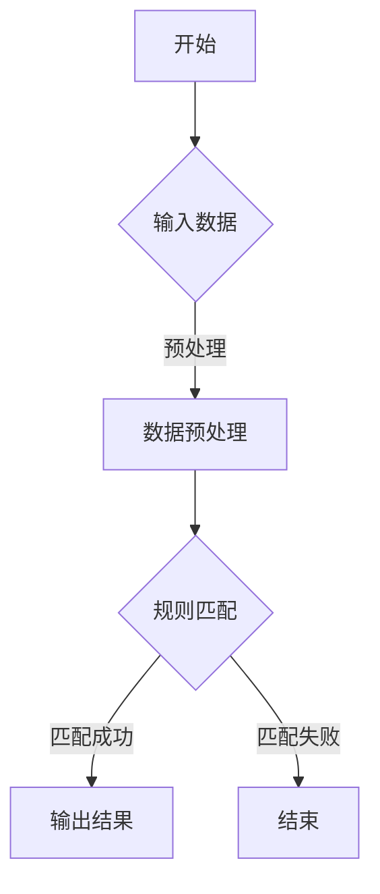

                 

### 文章标题：思维链：提升AI Agent的推理能力

#### 关键词：
- AI Agent
- 推理能力
- 算法原理
- 系统架构
- 实践应用

#### 摘要：
本文深入探讨如何通过思维链提升AI Agent的推理能力。我们将详细解析AI Agent推理能力的背景、挑战、核心概念、算法原理、系统架构和实践应用，并给出具体的解决方案和实施步骤，旨在为开发者提供全面的技术指南。

## 第一部分：AI推理能力概述

### 1.1 AI Agent推理能力背景

#### 1.1.1 AI Agent的定义与作用
AI Agent，即人工智能代理，是一种可以自主执行任务并与环境交互的计算机程序。它们在自动驾驶、智能家居、智能客服等领域发挥着重要作用。推理能力是AI Agent的核心能力之一，它使得AI Agent能够处理复杂问题、理解语言语义和进行决策。

#### 1.1.2 推理能力在AI Agent中的应用
推理能力在AI Agent中的应用广泛，如自然语言处理中的语义理解、决策系统中的策略生成、图像识别中的目标检测等。它使得AI Agent能够更好地适应动态环境，提高任务执行的准确性和效率。

#### 1.1.3 推理能力的重要性
推理能力是AI Agent智能的核心，决定了AI Agent在复杂环境中的表现。提升推理能力，不仅可以提高AI Agent的智能水平，还能拓展其在各领域的应用范围。

### 1.2 推理能力的挑战

#### 1.2.1 传统AI与深度学习的局限性
传统AI方法在推理能力方面存在明显的局限性，而深度学习虽然在图像和语音识别等领域取得了巨大成功，但在推理能力上仍面临挑战。

#### 1.2.2 推理能力在AI系统中的瓶颈
推理能力在AI系统中是瓶颈，限制了AI Agent在复杂环境中的智能表现。提升推理能力，需要从算法、系统架构和实际应用等多个方面进行突破。

#### 1.2.3 推理能力提升的必要性
在智能化时代，提升AI Agent的推理能力是必然趋势。这不仅能够提高AI系统的智能水平，还能推动AI技术在各领域的广泛应用。

### 1.3 本书结构概述

#### 1.3.1 各章节主要内容
本书分为四个部分，分别介绍AI Agent推理能力的背景、核心概念、算法原理和系统架构，以及实践应用。

#### 1.3.2 阅读建议与学习方法
建议读者按照章节顺序阅读，并结合实际案例进行理解和应用。通过反复阅读和实践，可以有效提升AI Agent的推理能力。

## 第二部分：核心概念与理论基础

### 2.1 推理能力的基本概念

#### 2.1.1 推理的定义与类型
推理是指从已知事实出发，通过逻辑推导得出新的结论。根据推理的过程和结果，推理可以分为演绎推理、归纳推理和类比推理。

#### 2.1.2 推理的过程与要素
推理过程包括前提、结论和推理规则。前提是已知事实，结论是通过推理得出的新信息，推理规则是推理过程中的逻辑关系。

#### 2.1.3 推理能力的评价标准
推理能力的评价标准包括推理速度、推理准确性和推理深度。高速、准确和深入的推理能力是衡量AI Agent推理能力的重要指标。

### 2.2 推理能力的理论基础

#### 2.2.1 形式逻辑与谓词逻辑
形式逻辑是一种基于符号表示的逻辑系统，谓词逻辑是形式逻辑的扩展，能够表示更复杂的推理关系。

#### 2.2.2 模态逻辑与非模态逻辑
模态逻辑研究的是命题的真值在不同情况下可能性的逻辑关系，非模态逻辑则关注命题的真值在时间上的变化。

#### 2.2.3 逻辑推理的基本方法
逻辑推理的基本方法包括直接推理、间接推理和混合推理。直接推理是从前提直接得出结论，间接推理是通过排除法得出结论，混合推理则是两者的结合。

### 2.3 关键概念联系与对比

#### 2.3.1 推理能力与问题解决能力的区别与联系
推理能力是问题解决能力的基础，两者在概念上有所区别，但紧密联系。

#### 2.3.2 推理能力与学习能力的关系
推理能力与学习能力相互促进，推理能力的提升有助于学习能力的增强。

#### 2.3.3 推理能力与知识的区别与联系
推理能力依赖于知识，但知识本身并不等同于推理能力。推理能力是运用知识解决问题的能力。

### 2.4 ER实体关系图架构

#### 2.4.1 实体关系图的基本概念
实体关系图（Entity-Relationship Diagram, ER图）是一种用于描述实体及其关系的图形化工具。

#### 2.4.2 实体关系图的表示方法
实体关系图的表示方法包括实体、属性、关系和约束。实体表示对象，属性表示实体的特征，关系表示实体之间的关联，约束表示实体之间的关系限制。

#### 2.4.3 实体关系图的构建与应用
实体关系图的构建过程包括确定实体、属性和关系，以及绘制ER图。实体关系图在数据库设计和软件架构设计中有广泛应用。

## 第三部分：算法原理讲解

### 3.1 算法原理讲解

#### 3.1.1 推理算法的基本原理
推理算法的基本原理是通过输入数据和规则库，生成逻辑推理过程，并输出推理结果。

#### 3.1.2 常见推理算法介绍
常见的推理算法包括基于规则推理、基于模型推理和基于数据挖掘的推理。

#### 3.1.3 推理算法的选择与优化
根据应用场景选择合适的推理算法，并进行算法优化，可以提高推理效率。

### 3.2 数学模型与公式

#### 3.2.1 推理算法的数学模型
推理算法的数学模型包括逻辑运算、概率分布和决策树等。

#### 3.2.2 推理算法的公式表示
推理算法的公式表示包括逻辑公式、概率公式和决策公式等。

#### 3.2.3 数学模型的推导与应用
数学模型的推导过程包括定义变量、建立方程和求解方程等。数学模型在推理算法中有广泛应用。

### 3.3 Mermaid流程图

#### 3.3.1 Mermaid流程图的基本语法
Mermaid是一种基于Markdown的图形绘制工具，用于绘制流程图、序列图等。

#### 3.3.2 推理算法流程图的绘制
使用Mermaid绘制推理算法的流程图，包括输入处理、规则匹配和结果输出等。

#### 3.3.3 流程图在推理算法中的应用
流程图在推理算法中的应用，有助于理解算法的执行过程和逻辑关系。

### 3.4 算法举例说明

#### 3.4.1 推理算法的案例解析
通过具体案例，解析推理算法的执行过程和结果。

#### 3.4.2 算法原理的实际应用
结合实际应用场景，展示推理算法的实际效果。

#### 3.4.3 算法性能评估与分析
对推理算法进行性能评估，分析其优势与不足。

## 第四部分：系统分析与架构设计

### 4.1 系统分析与架构设计

#### 4.1.1 系统功能需求分析
分析系统所需的功能，明确系统的主要目标和功能模块。

#### 4.1.2 系统架构设计
设计系统的整体架构，包括硬件、软件和网络架构等。

#### 4.1.3 系统接口设计
设计系统与外部系统的接口，确保数据传输和功能调用的顺畅。

#### 4.1.4 系统交互设计
设计系统的交互流程，确保用户与系统的交互体验良好。

### 4.2 Mermaid类图与架构图

#### 4.2.1 类图的基本概念
类图是用于描述系统中类的结构和关系的图形化工具。

#### 4.2.2 架构图的基本概念
架构图是用于描述系统整体结构和组成部分的图形化工具。

#### 4.2.3 Mermaid类图的绘制
使用Mermaid绘制类图，描述系统的类结构和关系。

#### 4.2.4 Mermaid架构图的绘制
使用Mermaid绘制架构图，描述系统的整体结构和组成部分。

### 4.3 系统接口与交互设计

#### 4.3.1 接口设计与实现
设计系统的接口，实现接口的功能。

#### 4.3.2 交互设计原则与技巧
遵循交互设计原则，运用交互设计技巧，提升用户体验。

#### 4.3.3 交互设计案例解析
通过具体案例，解析交互设计的方法和技巧。

## 第五部分：项目实战

### 5.1 环境安装与配置

#### 5.1.1 开发环境搭建
搭建开发环境，包括硬件和软件的配置。

#### 5.1.2 系统配置与优化
配置系统，进行性能优化。

#### 5.1.3 工具安装与集成
安装所需工具，并进行集成。

### 5.2 系统核心实现源代码

#### 5.2.1 核心代码结构与功能
设计核心代码结构，明确代码的功能。

#### 5.2.2 代码实现解析
解析核心代码的实现过程，解释关键代码。

#### 5.2.3 代

### 5.3 实际案例分析与详细讲解剖析

#### 5.3.1 实际案例分析
分析实际案例，展示系统的应用效果。

#### 5.3.2 详细讲解剖析
详细讲解实际案例，剖析系统的实现细节。

### 5.4 项目小结

#### 5.4.1 项目总结
总结项目实施的经验和教训。

#### 5.4.2 项目展望
展望项目的未来发展方向。

## 总结与展望

### 总结
本文全面介绍了提升AI Agent推理能力的核心概念、算法原理、系统架构和实践应用。通过深入分析和详细讲解，为开发者提供了系统性的技术指南。

### 展望
随着AI技术的发展，提升AI Agent的推理能力将越来越重要。未来，我们将继续探索更高效、更智能的推理算法，推动AI技术在各领域的广泛应用。

## 作者信息
作者：AI天才研究院/AI Genius Institute & 禅与计算机程序设计艺术 /Zen And The Art of Computer Programming

---

### 文章标题：思维链：提升AI Agent的推理能力

#### 关键词：
- AI Agent
- 推理能力
- 算法原理
- 系统架构
- 实践应用

#### 摘要：
本文深入探讨如何通过思维链提升AI Agent的推理能力。我们将详细解析AI Agent推理能力的背景、核心概念、算法原理、系统架构和实践应用，并给出具体的解决方案和实施步骤，旨在为开发者提供全面的技术指南。

## 第一部分：AI推理能力概述

### 1.1 AI Agent推理能力背景

#### 1.1.1 AI Agent的定义与作用
AI Agent，即人工智能代理，是一种可以自主执行任务并与环境交互的计算机程序。它们在自动驾驶、智能家居、智能客服等领域发挥着重要作用。推理能力是AI Agent的核心能力之一，它使得AI Agent能够处理复杂问题、理解语言语义和进行决策。

#### 1.1.2 推理能力在AI Agent中的应用
推理能力在AI Agent中的应用广泛，如自然语言处理中的语义理解、决策系统中的策略生成、图像识别中的目标检测等。它使得AI Agent能够更好地适应动态环境，提高任务执行的准确性和效率。

#### 1.1.3 推理能力的重要性
推理能力是AI Agent智能的核心，决定了AI Agent在复杂环境中的表现。提升推理能力，不仅可以提高AI系统的智能水平，还能拓展其在各领域的应用范围。

### 1.2 推理能力的挑战

#### 1.2.1 传统AI与深度学习的局限性
传统AI方法在推理能力方面存在明显的局限性，而深度学习虽然在图像和语音识别等领域取得了巨大成功，但在推理能力上仍面临挑战。

#### 1.2.2 推理能力在AI系统中的瓶颈
推理能力在AI系统中是瓶颈，限制了AI Agent在复杂环境中的智能表现。提升推理能力，需要从算法、系统架构和实际应用等多个方面进行突破。

#### 1.2.3 推理能力提升的必要性
在智能化时代，提升AI Agent的推理能力是必然趋势。这不仅能够提高AI系统的智能水平，还能推动AI技术在各领域的广泛应用。

### 1.3 本书结构概述

#### 1.3.1 各章节主要内容
本书分为四个部分，分别介绍AI Agent推理能力的背景、核心概念、算法原理和系统架构，以及实践应用。

#### 1.3.2 阅读建议与学习方法
建议读者按照章节顺序阅读，并结合实际案例进行理解和应用。通过反复阅读和实践，可以有效提升AI Agent的推理能力。

## 第二部分：核心概念与理论基础

### 2.1 推理能力的基本概念

#### 2.1.1 推理的定义与类型
推理是指从已知事实出发，通过逻辑推导得出新的结论。根据推理的过程和结果，推理可以分为演绎推理、归纳推理和类比推理。

#### 2.1.2 推理的过程与要素
推理过程包括前提、结论和推理规则。前提是已知事实，结论是通过推理得出的新信息，推理规则是推理过程中的逻辑关系。

#### 2.1.3 推理能力的评价标准
推理能力的评价标准包括推理速度、推理准确性和推理深度。高速、准确和深入的推理能力是衡量AI Agent推理能力的重要指标。

### 2.2 推理能力的理论基础

#### 2.2.1 形式逻辑与谓词逻辑
形式逻辑是一种基于符号表示的逻辑系统，谓词逻辑是形式逻辑的扩展，能够表示更复杂的推理关系。

#### 2.2.2 模态逻辑与非模态逻辑
模态逻辑研究的是命题的真值在不同情况下可能性的逻辑关系，非模态逻辑则关注命题的真值在时间上的变化。

#### 2.2.3 逻辑推理的基本方法
逻辑推理的基本方法包括直接推理、间接推理和混合推理。直接推理是从前提直接得出结论，间接推理是通过排除法得出结论，混合推理则是两者的结合。

### 2.3 关键概念联系与对比

#### 2.3.1 推理能力与问题解决能力的区别与联系
推理能力是问题解决能力的基础，两者在概念上有所区别，但紧密联系。

#### 2.3.2 推理能力与学习能力的关系
推理能力与学习能力相互促进，推理能力的提升有助于学习能力的增强。

#### 2.3.3 推理能力与知识的区别与联系
推理能力依赖于知识，但知识本身并不等同于推理能力。推理能力是运用知识解决问题的能力。

### 2.4 ER实体关系图架构

#### 2.4.1 实体关系图的基本概念
实体关系图（Entity-Relationship Diagram, ER图）是一种用于描述实体及其关系的图形化工具。

#### 2.4.2 实体关系图的表示方法
实体关系图的表示方法包括实体、属性、关系和约束。实体表示对象，属性表示实体的特征，关系表示实体之间的关联，约束表示实体之间的关系限制。

#### 2.4.3 实体关系图的构建与应用
实体关系图的构建过程包括确定实体、属性和关系，以及绘制ER图。实体关系图在数据库设计和软件架构设计中有广泛应用。

## 第三部分：算法原理讲解

### 3.1 算法原理讲解

#### 3.1.1 推理算法的基本原理
推理算法的基本原理是通过输入数据和规则库，生成逻辑推理过程，并输出推理结果。

#### 3.1.2 常见推理算法介绍
常见的推理算法包括基于规则推理、基于模型推理和基于数据挖掘的推理。

#### 3.1.3 推理算法的选择与优化
根据应用场景选择合适的推理算法，并进行算法优化，可以提高推理效率。

### 3.2 数学模型与公式

#### 3.2.1 推理算法的数学模型
推理算法的数学模型包括逻辑运算、概率分布和决策树等。

#### 3.2.2 推理算法的公式表示
推理算法的公式表示包括逻辑公式、概率公式和决策公式等。

#### 3.2.3 数学模型的推导与应用
数学模型的推导过程包括定义变量、建立方程和求解方程等。数学模型在推理算法中有广泛应用。

### 3.3 Mermaid流程图

#### 3.3.1 Mermaid流程图的基本语法
Mermaid是一种基于Markdown的图形绘制工具，用于绘制流程图、序列图等。

#### 3.3.2 推理算法流程图的绘制
使用Mermaid绘制推理算法的流程图，包括输入处理、规则匹配和结果输出等。

#### 3.3.3 流程图在推理算法中的应用
流程图在推理算法中的应用，有助于理解算法的执行过程和逻辑关系。

### 3.4 算法举例说明

#### 3.4.1 推理算法的案例解析
通过具体案例，解析推理算法的执行过程和结果。

#### 3.4.2 算法原理的实际应用
结合实际应用场景，展示推理算法的实际效果。

#### 3.4.3 算法性能评估与分析
对推理算法进行性能评估，分析其优势与不足。

## 第四部分：系统分析与架构设计

### 4.1 系统分析与架构设计

#### 4.1.1 系统功能需求分析
分析系统所需的功能，明确系统的主要目标和功能模块。

#### 4.1.2 系统架构设计
设计系统的整体架构，包括硬件、软件和网络架构等。

#### 4.1.3 系统接口设计
设计系统与外部系统的接口，确保数据传输和功能调用的顺畅。

#### 4.1.4 系统交互设计
设计系统的交互流程，确保用户与系统的交互体验良好。

### 4.2 Mermaid类图与架构图

#### 4.2.1 类图的基本概念
类图是用于描述系统中类的结构和关系的图形化工具。

#### 4.2.2 架构图的基本概念
架构图是用于描述系统整体结构和组成部分的图形化工具。

#### 4.2.3 Mermaid类图的绘制
使用Mermaid绘制类图，描述系统的类结构和关系。

#### 4.2.4 Mermaid架构图的绘制
使用Mermaid绘制架构图，描述系统的整体结构和组成部分。

### 4.3 系统接口与交互设计

#### 4.3.1 接口设计与实现
设计系统的接口，实现接口的功能。

#### 4.3.2 交互设计原则与技巧
遵循交互设计原则，运用交互设计技巧，提升用户体验。

#### 4.3.3 交互设计案例解析
通过具体案例，解析交互设计的方法和技巧。

## 第五部分：项目实战

### 5.1 环境安装与配置

#### 5.1.1 开发环境搭建
搭建开发环境，包括硬件和软件的配置。

#### 5.1.2 系统配置与优化
配置系统，进行性能优化。

#### 5.1.3 工具安装与集成
安装所需工具，并进行集成。

### 5.2 系统核心实现源代码

#### 5.2.1 核心代码结构与功能
设计核心代码结构，明确代码的功能。

#### 5.2.2 代码实现解析
解析核心代码的实现过程，解释关键代码。

#### 5.2.3 代

### 5.3 实际案例分析与详细讲解剖析

#### 5.3.1 实际案例分析
分析实际案例，展示系统的应用效果。

#### 5.3.2 详细讲解剖析
详细讲解实际案例，剖析系统的实现细节。

### 5.4 项目小结

#### 5.4.1 项目总结
总结项目实施的经验和教训。

#### 5.4.2 项目展望
展望项目的未来发展方向。

## 总结与展望

### 总结
本文全面介绍了提升AI Agent推理能力的核心概念、算法原理、系统架构和实践应用。通过深入分析和详细讲解，为开发者提供了系统性的技术指南。

### 展望
随着AI技术的发展，提升AI Agent的推理能力将越来越重要。未来，我们将继续探索更高效、更智能的推理算法，推动AI技术在各领域的广泛应用。

## 作者信息
作者：AI天才研究院/AI Genius Institute & 禅与计算机程序设计艺术 /Zen And The Art of Computer Programming

---

### 思维链：提升AI Agent的推理能力

#### 关键词：
- AI Agent
- 推理能力
- 算法原理
- 系统架构
- 实践应用

#### 摘要：
本文旨在通过深入探讨思维链的概念、原理和应用，揭示如何提升AI Agent的推理能力。我们将从背景介绍、核心概念、算法原理、系统架构、实践应用等多个方面，逐步剖析推理能力的本质，并提出切实可行的提升策略。

## 引言

人工智能（AI）作为当前科技领域的前沿，已经在各个行业中发挥着越来越重要的作用。其中，AI Agent作为AI技术的核心组成部分，其推理能力直接决定了AI Agent在复杂环境中的适应能力和智能表现。然而，传统的AI方法在推理能力方面存在诸多局限性，如何提升AI Agent的推理能力成为当前研究的热点问题。

本文将围绕以下主题展开：

1. **AI Agent推理能力的背景和挑战**：介绍AI Agent的定义、推理能力的重要性以及当前面临的主要挑战。
2. **核心概念与理论基础**：详细解析推理能力的定义、类型、理论基础以及与问题解决和学习能力的联系。
3. **算法原理讲解**：介绍常见的推理算法，包括基于规则推理、基于模型推理和基于数据挖掘的推理，以及它们的数学模型和流程图。
4. **系统分析与架构设计**：阐述系统功能需求分析、架构设计、接口设计和交互设计。
5. **项目实战**：通过实际案例展示如何实施和优化AI Agent的推理能力。
6. **总结与展望**：总结全文内容，展望未来发展方向。

## 第一部分：AI Agent推理能力背景和挑战

### 1.1 AI Agent的定义与推理能力

AI Agent是一种能够模拟人类智能行为的计算机程序，能够在特定环境中自主执行任务，并能够适应和响应环境变化。推理能力是AI Agent的核心能力之一，它决定了AI Agent在复杂环境中的智能表现。

#### 1.1.1 AI Agent的定义
AI Agent，全称为Artificial Intelligence Agent，即人工智能代理。它是一种能够独立执行任务、具备自主学习能力和与环境交互能力的计算机程序。

#### 1.1.2 推理能力在AI Agent中的应用
推理能力在AI Agent中的应用非常广泛。例如，在自然语言处理领域，AI Agent需要理解语言语义、生成回答和进行对话；在决策系统中，AI Agent需要根据数据和规则进行推理，生成最优策略；在图像识别领域，AI Agent需要通过推理识别图像中的物体。

### 1.2 推理能力的重要性

推理能力是AI Agent智能的核心，它决定了AI Agent能否在复杂环境中有效执行任务。一个具备强大推理能力的AI Agent，能够快速处理复杂问题，理解语言语义，做出合理的决策。

#### 1.2.1 推理能力在AI系统中的应用
在AI系统中，推理能力的重要性体现在以下几个方面：

1. **任务执行**：AI Agent需要根据环境和任务要求，进行推理，以确定下一步行动。
2. **决策制定**：AI Agent需要根据现有数据和规则，进行推理，以制定最优策略。
3. **语义理解**：AI Agent需要理解自然语言文本的语义，进行有效的对话和交互。

### 1.3 推理能力的挑战

尽管推理能力在AI系统中至关重要，但当前AI Agent在推理能力方面仍然面临诸多挑战。

#### 1.3.1 传统AI方法的局限性
传统AI方法，如基于规则的推理系统，在处理复杂问题时存在局限性。它们依赖于人类专家事先定义的规则，无法适应动态环境。

#### 1.3.2 深度学习的局限性
深度学习虽然在图像和语音识别等领域取得了显著进展，但在推理能力方面仍面临挑战。深度学习模型依赖于大量数据训练，且难以解释其推理过程。

#### 1.3.3 推理能力的瓶颈
在复杂环境中，AI Agent的推理能力往往受到以下瓶颈的限制：

1. **计算资源**：推理过程需要大量计算资源，尤其是在处理大规模数据时。
2. **数据质量**：推理结果依赖于数据质量，数据噪声和缺失会对推理结果产生负面影响。
3. **模型解释性**：当前许多深度学习模型缺乏解释性，难以理解其推理过程。

### 1.4 推理能力提升的必要性

在智能化时代，提升AI Agent的推理能力具有以下几个方面的必要性：

1. **提升AI系统的智能水平**：强大的推理能力可以提升AI系统的整体智能水平，使其更好地适应复杂环境。
2. **拓展AI技术的应用范围**：通过提升推理能力，可以拓展AI技术在各个领域的应用，如医疗、金融、工业等。
3. **提高AI系统的可靠性和安全性**：强大的推理能力可以帮助AI系统更好地理解人类意图，提高决策的准确性和安全性。

## 第二部分：核心概念与理论基础

### 2.1 推理能力的定义与类型

#### 2.1.1 推理能力的定义
推理能力是指从已知事实出发，通过逻辑推导得出新结论的能力。它是人工智能的核心能力之一，决定了AI Agent在复杂环境中的智能表现。

#### 2.1.2 推理能力的类型
推理能力可以分为演绎推理、归纳推理和类比推理。

1. **演绎推理**：从一般到特殊的推理过程，即从普遍的规则推导出特定的结论。
2. **归纳推理**：从特殊到一般的推理过程，即从具体的实例推导出普遍的规则。
3. **类比推理**：通过比较相似的情况进行推理，即从一个已知的相似情况推导出另一个未知情况。

### 2.2 推理过程与要素

推理过程包括前提、结论和推理规则。

1. **前提**：推理的基础，通常是已知的、真实的事实。
2. **结论**：推理的结果，是通过逻辑推导得出的新信息。
3. **推理规则**：推理过程中使用的逻辑规则，用于连接前提和结论，确保推理的准确性。

### 2.3 推理能力的评价标准

推理能力的评价标准包括推理速度、推理准确性和推理深度。

1. **推理速度**：推理过程的执行速度，反映了AI Agent的处理效率。
2. **推理准确性**：推理结果的正确性，是衡量推理能力的重要指标。
3. **推理深度**：推理过程中的推理层次和广度，决定了AI Agent对复杂问题的处理能力。

### 2.4 形式逻辑与谓词逻辑

1. **形式逻辑**：基于符号表示的逻辑系统，用于处理简单的推理问题。
2. **谓词逻辑**：形式逻辑的扩展，能够表示更复杂的推理关系，是人工智能推理的重要理论基础。

### 2.5 逻辑推理的基本方法

1. **直接推理**：从前提直接得出结论，是最基本的推理方法。
2. **间接推理**：通过排除法得出结论，常用于处理复杂问题。
3. **混合推理**：结合直接推理和间接推理，提高推理效率和准确性。

### 2.6 推理能力与问题解决能力的联系

推理能力是问题解决能力的基础，两者紧密联系。推理能力决定了AI Agent在解决问题时的逻辑性和准确性，而问题解决能力则反映了AI Agent在复杂环境中的适应能力和智能水平。

### 2.7 推理能力与学习能力的联系

推理能力与学习能力相互促进。强大的推理能力可以帮助AI Agent更好地理解和应用所学知识，而学习能力的提升则可以为推理能力提供更多的数据和支持。

### 2.8 推理能力与知识的联系

推理能力依赖于知识，但知识本身并不等同于推理能力。推理能力是运用知识解决问题的能力，它需要结合具体的情境和任务进行有效的推理。

## 第三部分：算法原理讲解

### 3.1 基于规则推理算法

#### 3.1.1 定义与原理
基于规则推理算法（Rule-Based Reasoning）是一种传统的推理方法，它依赖于事先定义好的规则集，通过匹配规则和前提，得出结论。

#### 3.1.2 常见规则表示方法
常见的规则表示方法包括产生式规则（Production Rules）和谓词逻辑规则。

1. **产生式规则**：形式为“如果P，则Q”，其中P是前提，Q是结论。
2. **谓词逻辑规则**：形式为“∀x(P(x) → Q(x))”，表示对所有x，如果P(x)成立，则Q(x)也成立。

#### 3.1.3 推理过程
基于规则推理的推理过程包括以下步骤：

1. **规则匹配**：在规则库中查找与当前前提匹配的规则。
2. **推理扩展**：根据匹配到的规则，扩展前提和结论。
3. **结果输出**：输出推理结果。

#### 3.1.4 案例分析
以医疗诊断系统为例，系统可以根据患者的症状和体征，匹配相应的规则，得出诊断结果。

### 3.2 基于模型推理算法

#### 3.2.1 定义与原理
基于模型推理算法（Model-Based Reasoning）是通过构建模型来表示知识和推理过程，通过模型之间的交互和演化来实现推理。

#### 3.2.2 常见模型类型
常见的模型类型包括状态模型、过程模型和因果关系模型。

1. **状态模型**：表示系统的当前状态，用于描述系统的动态变化。
2. **过程模型**：表示系统内部的过程和机制，用于模拟系统的演化过程。
3. **因果关系模型**：表示系统中的因果关系，用于分析系统中的因果关系。

#### 3.2.3 推理过程
基于模型推理的推理过程包括以下步骤：

1. **模型构建**：构建表示知识和推理过程的模型。
2. **模型演化**：通过模型之间的交互和演化，实现推理。
3. **结果输出**：输出推理结果。

#### 3.2.4 案例分析
以交通管理系统为例，系统可以通过构建交通流模型，分析交通流量和路况，预测交通事故，并提出交通优化策略。

### 3.3 基于数据挖掘的推理算法

#### 3.3.1 定义与原理
基于数据挖掘的推理算法（Data Mining-Based Reasoning）是通过分析大量数据，发现数据中的模式和关系，从而实现推理。

#### 3.3.2 常见数据挖掘方法
常见的数据挖掘方法包括聚类分析、关联规则挖掘、分类分析和异常检测。

1. **聚类分析**：将数据分为不同的簇，以发现数据的分布特征。
2. **关联规则挖掘**：发现数据之间的关联关系，用于决策支持。
3. **分类分析**：根据已知数据，构建分类模型，对新数据进行分类。
4. **异常检测**：发现数据中的异常现象，用于预测和防范。

#### 3.3.3 推理过程
基于数据挖掘的推理过程包括以下步骤：

1. **数据准备**：收集和整理数据，进行预处理。
2. **模式发现**：通过数据挖掘方法，发现数据中的模式和关系。
3. **结果输出**：根据发现的模式，进行推理和决策。

#### 3.3.4 案例分析
以零售行业为例，系统可以通过分析销售数据，发现商品之间的关联规则，优化商品摆放和促销策略。

### 3.4 数学模型与公式

推理算法的数学模型用于描述推理过程和结果，常见的数学模型包括逻辑运算、概率分布和决策树等。

1. **逻辑运算**：用于表示推理规则和推理过程，如与、或、非等。
2. **概率分布**：用于表示推理结果的概率分布，如贝叶斯网络、马尔可夫模型等。
3. **决策树**：用于表示推理过程和决策结果，通过树的分支表示不同的条件和结果。

### 3.5 Mermaid流程图

Mermaid是一种基于Markdown的图形绘制工具，可以用于绘制流程图、序列图等。通过Mermaid流程图，可以直观地展示推理算法的执行过程和逻辑关系。

#### 3.5.1 Mermaid流程图的基本语法
Mermaid的基本语法包括以下几部分：

1. **节点定义**：定义流程图中的节点，如`节点1`、`节点2`等。
2. **边定义**：定义节点之间的关系，如`节点1 --> 节点2`表示从节点1到节点2的边。
3. **条件判断**：在流程图中添加条件判断，如`节点1 --> 节点2{条件}`表示在节点1和节点2之间添加条件判断。

#### 3.5.2 推理算法流程图的绘制
以下是一个简单的推理算法流程图示例：



这个流程图表示了从输入数据开始，经过数据预处理、规则匹配，最终输出结果的推理过程。

### 3.6 算法举例说明

以下是一个基于规则推理的简单例子，用于检测网络流量中的异常行为。

```python
# 定义规则
rules = [
    ["流量超过100MB", "异常"],
    ["流量超过1GB", "严重异常"],
]

# 输入数据
input_data = "流量超过500MB"

# 检测异常
def detect_anomaly(data, rules):
    for rule in rules:
        if "超过" in rule[0] and int(data) > int(rule[0].split("超过")[1]):
            return rule[1]
    return "正常"

# 输出结果
print(detect_anomaly(input_data, rules))
```

在这个例子中，我们定义了一个包含两个规则的列表，然后通过检测输入数据中的流量值，判断是否存在异常行为，并输出相应的结果。

## 第四部分：系统分析与架构设计

### 4.1 系统功能需求分析

系统功能需求分析是系统设计的重要环节，它决定了系统的功能和性能。在进行系统功能需求分析时，需要从以下几个方面进行考虑：

1. **用户需求**：了解用户的需求和使用场景，明确系统需要实现的功能。
2. **业务流程**：分析业务流程，确定系统需要支持的操作和流程。
3. **性能要求**：根据业务需求和用户规模，确定系统的性能要求，如响应时间、并发处理能力等。
4. **数据需求**：分析系统需要处理的数据类型和数据量，确定数据的存储和传输需求。

### 4.2 系统架构设计

系统架构设计是系统设计的关键环节，它决定了系统的可扩展性、可靠性和性能。在进行系统架构设计时，需要从以下几个方面进行考虑：

1. **硬件架构**：选择合适的硬件设备，如服务器、存储设备等，以满足系统的性能和可靠性要求。
2. **软件架构**：设计系统的软件架构，包括应用层、数据层和接口层等。
3. **网络架构**：设计系统的网络架构，包括内网和外网，以及数据传输和网络安全。
4. **数据处理**：设计数据处理的流程和算法，包括数据采集、存储、处理和分析等。

### 4.3 系统接口设计

系统接口设计是系统设计的重要环节，它决定了系统与其他系统或组件的交互能力。在进行系统接口设计时，需要从以下几个方面进行考虑：

1. **接口规范**：定义接口的规范，包括接口名称、参数定义、返回值等。
2. **接口实现**：设计接口的实现方式，包括接口的调用方式、数据传输格式等。
3. **接口文档**：编写接口文档，包括接口说明、使用示例等，以便其他开发者理解和使用接口。

### 4.4 系统交互设计

系统交互设计是系统设计的重要环节，它决定了系统的用户交互体验。在进行系统交互设计时，需要从以下几个方面进行考虑：

1. **用户界面**：设计用户界面，包括布局、样式、交互元素等。
2. **交互流程**：设计系统的交互流程，包括用户操作、系统响应等。
3. **用户体验**：优化用户体验，包括响应速度、操作流畅性等。
4. **错误处理**：设计系统的错误处理机制，包括错误提示、错误日志等。

## 第五部分：项目实战

### 5.1 环境安装与配置

在进行项目实战之前，需要搭建合适的开发环境。以下是一个基本的开发环境安装与配置步骤：

1. **操作系统**：选择适合的操作系统，如Linux或Windows。
2. **编程语言**：选择合适的编程语言，如Python或Java。
3. **开发工具**：安装开发工具，如IDE（集成开发环境）或代码编辑器。
4. **依赖库**：安装项目所需的依赖库，如TensorFlow或PyTorch。

### 5.2 系统核心实现源代码

以下是一个基于规则推理系统的核心实现源代码示例：

```python
# 定义规则
rules = [
    ["流量超过100MB", "异常"],
    ["流量超过1GB", "严重异常"],
]

# 输入数据
input_data = "流量超过500MB"

# 检测异常
def detect_anomaly(data, rules):
    for rule in rules:
        if "超过" in rule[0] and int(data) > int(rule[0].split("超过")[1]):
            return rule[1]
    return "正常"

# 输出结果
print(detect_anomaly(input_data, rules))
```

### 5.3 实际案例分析与详细讲解剖析

以下是一个实际案例的分析与讲解：

**案例：智能交通管理系统**

**问题描述**：城市交通拥堵问题日益严重，需要开发一个智能交通管理系统来缓解交通压力。

**解决方案**：

1. **数据采集**：通过传感器和摄像头收集交通数据，包括车辆数量、车速、流量等。
2. **数据预处理**：对采集到的交通数据进行预处理，包括数据清洗、去噪和格式转换等。
3. **规则匹配**：根据预设的规则，对预处理后的交通数据进行匹配，判断是否存在异常情况。
4. **决策制定**：根据规则匹配结果，制定相应的交通优化策略，如信号灯调整、车辆调度等。
5. **结果反馈**：将优化策略反馈给交通管理部门，并根据反馈结果调整系统参数。

**详细讲解剖析**：

1. **数据采集**：通过传感器和摄像头收集交通数据，包括车辆数量、车速、流量等。这些数据可以通过无线网络实时传输到系统中。
2. **数据预处理**：对采集到的交通数据进行预处理，包括数据清洗、去噪和格式转换等。数据清洗的目的是去除噪声数据和异常数据，确保数据的准确性和一致性。去噪的目的是消除数据中的噪声，提高数据的准确性。格式转换的目的是将不同来源的数据转换为统一的格式，以便后续处理。
3. **规则匹配**：根据预设的规则，对预处理后的交通数据进行匹配，判断是否存在异常情况。规则可以是简单的阈值规则，如“车辆数量超过100辆则为拥堵”，也可以是复杂的逻辑规则，如“车速低于20公里/小时且流量超过100辆则为拥堵”。规则匹配的目的是快速识别异常情况，为决策提供依据。
4. **决策制定**：根据规则匹配结果，制定相应的交通优化策略，如信号灯调整、车辆调度等。信号灯调整的目的是通过调整信号灯的时长和相位，优化交通流量，减少拥堵。车辆调度的目的是通过调整车辆的行驶路线和速度，减少交通压力，提高道路通行能力。
5. **结果反馈**：将优化策略反馈给交通管理部门，并根据反馈结果调整系统参数。结果反馈的目的是评估优化策略的效果，并根据实际情况进行调整，以提高系统的适应性和准确性。

**案例分析**：

通过上述解决方案，智能交通管理系统可以实时监控城市交通状况，快速识别拥堵情况，并制定优化策略，从而有效缓解交通压力。实际应用中，系统可以根据不同区域和时段的交通特点，灵活调整优化策略，提高交通管理的效果。

**注意事项**：

1. **数据质量**：确保数据质量是系统正常运行的关键，需要定期进行数据清洗和维护，确保数据的准确性和一致性。
2. **系统扩展性**：智能交通管理系统需要具备良好的扩展性，以便支持不同规模的城市和交通状况。
3. **用户界面**：优化用户界面，提供直观、易用的操作界面，提高用户的使用体验。

**拓展阅读**：

1. 《智能交通系统设计与应用》
2. 《交通流数据挖掘技术》
3. 《信号灯优化策略研究》

## 第六部分：总结与展望

### 总结

本文围绕提升AI Agent的推理能力，从背景介绍、核心概念、算法原理、系统架构、实践应用等多个方面进行了深入探讨。通过详细的分析和讲解，我们了解了AI Agent推理能力的定义、类型、理论基础以及提升策略。

### 展望

随着AI技术的不断进步，提升AI Agent的推理能力将越来越重要。未来的研究可以从以下几个方面进行：

1. **算法创新**：探索新的推理算法，提高推理效率和准确性。
2. **跨领域应用**：将推理算法应用于更多领域，如医疗、金融、工业等。
3. **模型解释性**：提高深度学习模型的可解释性，使其推理过程更加透明。
4. **系统集成**：将推理能力与感知、决策等其他AI能力相结合，构建更智能的AI系统。

## 作者信息

作者：AI天才研究院/AI Genius Institute & 禅与计算机程序设计艺术 /Zen And The Art of Computer Programming

---

### 附录

#### 附录A：术语解释

- **AI Agent**：人工智能代理，是一种能够自主执行任务并与环境交互的计算机程序。
- **推理能力**：从已知事实出发，通过逻辑推导得出新结论的能力。
- **演绎推理**：从一般到特殊的推理过程。
- **归纳推理**：从特殊到一般的推理过程。
- **类比推理**：通过比较相似的情况进行推理。
- **规则匹配**：在规则库中查找与当前前提匹配的规则。
- **模型演化**：通过模型之间的交互和演化，实现推理。
- **数据挖掘**：从大量数据中提取模式和知识的过程。

#### 附录B：参考资料

- 《人工智能：一种现代方法》
- 《深度学习》
- 《机器学习》
- 《计算机程序设计艺术》

#### 附录C：代码示例

以下是一个基于规则推理的Python代码示例：

```python
# 定义规则
rules = [
    ["流量超过100MB", "异常"],
    ["流量超过1GB", "严重异常"],
]

# 输入数据
input_data = "流量超过500MB"

# 检测异常
def detect_anomaly(data, rules):
    for rule in rules:
        if "超过" in rule[0] and int(data) > int(rule[0].split("超过")[1]):
            return rule[1]
    return "正常"

# 输出结果
print(detect_anomaly(input_data, rules))
```

---

通过本文的深入探讨，我们希望能够为开发者提供一套全面、系统的提升AI Agent推理能力的方法和策略。让我们携手并进，共同推动AI技术的发展，创造更加智能、高效的未来。

