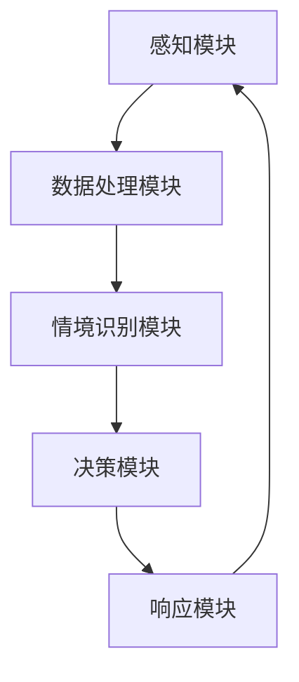

                 

## 情境感知AI Agent：适应动态环境

### 关键词：情境感知、AI Agent、动态环境、适应机制、应用场景

### 摘要：

本文章深入探讨情境感知AI Agent在动态环境中的适应机制和应用场景。首先，我们将介绍情境感知AI Agent的基本概念及其在动态环境中的重要性。随后，通过详细的章节结构，我们逐步解析情境感知算法的原理和实现，以及在不同应用领域的实践案例。文章的最终目标是提供一个全面的视角，帮助读者理解情境感知AI Agent在复杂动态环境中的应用潜力与挑战。

## 前言

### 介绍书籍的目的和结构

《情境感知AI Agent：适应动态环境》旨在为读者提供一种全新的视角，理解情境感知AI Agent在动态环境中的适应机制和应用。随着人工智能技术的快速发展，情境感知AI Agent逐渐成为研究热点，其在智能家居、智能交通、工业自动化等领域的应用前景广阔。本书的主要目的是系统性地介绍情境感知AI Agent的核心概念、算法原理及其在动态环境中的适应策略，帮助读者深入了解这一前沿技术。

本书分为四个主要部分：

1. **第一部分：核心概念与背景介绍**：该部分将介绍情境感知AI Agent的基本概念、定义及其在动态环境中的重要性，并探讨其发展历程和应用领域。

2. **第二部分：算法原理与实现**：这一部分将深入分析情境感知算法的原理，包括传感器融合技术、情境建模与识别、情境响应与决策等内容，并通过具体的代码实现来展示这些原理的应用。

3. **第三部分：应用场景与实践**：这一部分将具体探讨情境感知AI Agent在智能家居、智能交通、工业自动化等领域的应用案例，通过实际案例来展示其实现细节和效果评估。

4. **第四部分：案例分析与研究趋势**：最后，这一部分将总结前述应用案例，并探讨情境感知AI Agent的研究趋势和未来发展方向，为读者提供对这一领域的深入思考。

通过这四个部分的系统介绍，本书希望为读者提供一个全面、深入的了解，帮助他们在实际项目中更好地应用情境感知AI Agent技术。

## 第一部分：核心概念与背景介绍

### 第1章：情境感知AI Agent基础

#### 1.1 问题背景与定义

**情境感知（Situation Awareness）** 是指个体或系统对于当前所处环境及其相关信息的理解程度。随着人工智能技术的进步，情境感知不仅局限于人类个体，也开始应用于机器和系统。情境感知AI Agent，即情境感知智能体，是一种能够感知其周围环境并做出相应反应的智能系统。在动态环境中，情境感知AI Agent能够实时收集、解析和利用环境数据，以实现自主适应和优化行为。

情境感知AI Agent的定义可以扩展为一种具备感知、理解、预测和响应能力的智能体，其核心在于对环境信息的有效感知和动态适应。具体来说，情境感知AI Agent包含以下几个关键要素：

1. **感知**：通过多种传感器获取环境信息，如视觉、听觉、触觉等。
2. **理解**：对感知到的信息进行处理，识别和理解当前情境。
3. **预测**：基于当前情境和历史数据预测未来的可能变化。
4. **响应**：根据情境和预测结果做出适当的行动或决策。

情境感知AI Agent的发展历程可以追溯到20世纪90年代，随着多传感器技术、机器学习和计算机视觉等技术的发展，情境感知AI Agent的理论和应用逐渐成熟。近年来，随着物联网（IoT）、大数据和云计算等技术的普及，情境感知AI Agent在智能家居、智能交通、工业自动化等领域的应用取得了显著进展。

#### 1.2 情境感知的核心概念

情境感知的核心概念包括以下几个方面：

1. **情境表示（Situation Representation）**：情境表示是将环境信息转换为机器可以理解的形式。这通常涉及到对数据的预处理、特征提取和表示学习。情境表示的质量直接影响到AI Agent对环境的理解和响应能力。

2. **情境识别（Situation Recognition）**：情境识别是AI Agent对当前情境的识别过程。它基于情境表示，通过机器学习算法或规则系统来实现。情境识别的准确性对于AI Agent的响应和决策至关重要。

3. **情境预测（Situation Prediction）**：情境预测是基于历史数据和当前情境，预测未来可能发生的情境变化。情境预测可以辅助AI Agent做出更加智能和优化的决策。

4. **情境建模（Situation Modeling）**：情境建模是构建一个表示环境状态和变化规律的模型。通过情境建模，AI Agent可以更好地理解环境，并预测未来的变化。

5. **情境响应（Situation Response）**：情境响应是AI Agent根据情境识别和预测结果，采取相应行动的过程。情境响应需要考虑环境约束、资源限制和目标优化等因素。

#### 1.3 情境感知AI Agent的应用领域

情境感知AI Agent在多个领域具有广泛的应用：

1. **智能家居**：情境感知AI Agent可以感知家庭环境中的各种变化，如光线、温度、湿度、人员活动等，并根据这些信息自动调整家居设备，实现自动化控制和节能优化。

2. **智能交通**：情境感知AI Agent可以在交通系统中实时监测路况、车流量和交通参与者行为，为交通管理提供数据支持，优化交通流量，提高道路通行效率。

3. **工业自动化**：情境感知AI Agent可以监控工业生产过程中的各种参数，如温度、压力、速度等，及时发现并处理异常情况，保障生产过程的稳定和高效。

4. **医疗健康**：情境感知AI Agent可以监测患者的生理指标，如心率、血压、血氧等，及时发现健康异常，提供个性化医疗建议。

5. **灾害响应**：情境感知AI Agent可以在灾害发生时实时监测灾害环境，为救援行动提供决策支持，优化救援资源分配。

通过这些应用案例，我们可以看到情境感知AI Agent在提高系统智能化、自动化和响应速度方面的巨大潜力。然而，实现这些应用也面临着一系列技术挑战，如传感器数据的质量和一致性、算法模型的复杂性和可解释性、系统的实时性和鲁棒性等。这些挑战需要我们在算法设计、系统架构和实际应用中不断探索和解决。

### 总结

在本章中，我们介绍了情境感知AI Agent的基本概念、核心要素及其应用领域。通过了解情境感知的定义和核心概念，我们可以更好地理解情境感知AI Agent的工作原理和其在动态环境中的重要性。接下来，我们将进一步探讨情境感知算法的原理和实现，以期为读者提供更深入的技术见解。

### 第2章：情境感知算法原理

#### 2.1 传感器融合技术

传感器融合技术是情境感知AI Agent的核心组成部分，其目标是将来自不同传感器的数据整合起来，以获得更全面、准确的环境信息。传感器融合技术的关键在于如何有效地处理多源异构数据，提高信息融合的精度和可靠性。

首先，我们需要了解传感器数据的类型和特点。常见的传感器数据类型包括视觉、听觉、触觉、温度、湿度、压力等。每种传感器都有其独特的优势和应用场景，但同时也存在局限性。例如，视觉传感器能够提供丰富的空间信息，但难以感知温度变化；而温度传感器能够精确测量温度，但在空间分辨率上受限。

传感器数据融合的基本流程包括以下几个步骤：

1. **数据采集**：从各个传感器收集数据，并确保数据的完整性和一致性。
2. **数据预处理**：对采集到的原始数据进行清洗、去噪、归一化等预处理操作，以提高数据质量。
3. **特征提取**：从预处理后的数据中提取有用的特征，这些特征能够更好地表示环境状态。
4. **信息融合**：将不同传感器的特征信息进行融合，生成一个综合的环境表示。

传感器数据融合的方法主要包括以下几种：

1. **基于规则的融合方法**：这种方法通过预设的规则或模式来融合传感器数据。例如，当温度传感器和湿度传感器同时监测到异常时，可以触发特定的响应动作。这种方法的优点是实现简单，但依赖于规则的准确性和覆盖范围。

2. **基于概率的融合方法**：这种方法使用概率模型来融合传感器数据。常见的概率模型包括贝叶斯网络、隐马尔可夫模型（HMM）等。通过这些模型，可以计算传感器数据的联合概率分布，从而获得更准确的环境表示。

3. **基于神经网络的融合方法**：这种方法使用神经网络模型来融合传感器数据。神经网络能够自动学习和提取数据中的复杂特征，从而实现高效的传感器数据融合。常用的神经网络模型包括卷积神经网络（CNN）、递归神经网络（RNN）等。

下面，我们通过一个简单的例子来具体说明传感器融合的过程。假设我们有一个智能家居系统，其中包含温度传感器、湿度传感器和光照传感器。我们的目标是根据这些传感器的数据来控制家居设备，如空调、加湿器和窗帘。

1. **数据采集**：假设当前传感器的数据如下：
   - 温度传感器：25°C
   - 湿度传感器：50%
   - 光照传感器：明亮

2. **数据预处理**：对每个传感器的数据进行归一化处理，以便于后续的特征提取和融合。

3. **特征提取**：提取每个传感器的关键特征，如温度传感器的温度值、湿度传感器的湿度百分比、光照传感器的光照强度等。

4. **信息融合**：使用基于神经网络的融合方法，将三个传感器的特征数据进行融合。例如，我们可以使用一个简单的全连接神经网络，将三个输入特征融合为一个输出特征，表示当前家居环境的状态。

   ```python
   import numpy as np
   import tensorflow as tf

   # 初始化神经网络模型
   model = tf.keras.Sequential([
       tf.keras.layers.Dense(units=1, input_shape=[3])
   ])

   # 训练模型（使用一些训练数据）
   model.compile(optimizer='sgd', loss='mean_squared_error')
   model.fit(np.array([[25, 50, 1000]]), np.array([0.5]), epochs=1000)

   # 测试融合模型
   fused_state = model.predict(np.array([[25, 50, 1000]]))
   ```

   在这个例子中，我们通过训练神经网络模型，将三个传感器的特征数据融合为一个综合的环境状态值。

5. **情境识别与响应**：根据融合后的环境状态值，系统可以做出相应的决策。例如，当环境状态值低于某个阈值时，系统可以自动开启空调和加湿器。

通过这个例子，我们可以看到传感器融合技术是如何帮助情境感知AI Agent更好地理解环境的。在实际应用中，传感器融合技术需要考虑到数据的实时性、可靠性和多样性，以适应不断变化的动态环境。

#### 2.2 情境建模与识别

情境建模与识别是情境感知AI Agent的核心任务之一，其目标是通过对环境数据的分析，准确识别和表征当前情境。情境建模与识别不仅依赖于高质量的数据融合，还需要考虑情境的动态性和复杂性。

首先，我们需要定义情境建模的过程。情境建模主要包括以下几个步骤：

1. **情境定义**：明确情境的定义和分类，以便于后续的处理和识别。情境可以是一个简单的事件（如“有人在家”），也可以是一个复杂的场景（如“家庭聚会”）。

2. **情境表示**：将情境转化为机器可以理解和处理的形式。情境表示可以采用多种形式，如数值向量、图形表示、文本描述等。常用的表示方法包括基于特征的表示、基于规则的表示和基于模型的表示。

3. **情境分类**：对情境进行分类，以便于系统对不同情境做出相应的响应。情境分类可以基于历史数据、规则系统或机器学习算法。常见的分类方法包括支持向量机（SVM）、决策树、随机森林等。

接下来，我们探讨情境识别的过程。情境识别是情境感知AI Agent根据当前环境数据，判断当前情境的过程。情境识别主要包括以下几个步骤：

1. **特征提取**：从传感器数据中提取与情境相关的特征。这些特征可以是对环境状态的量化描述，如温度、湿度、光照强度等。

2. **情境匹配**：将提取的特征与预先定义的情境表示进行匹配，以判断当前情境。情境匹配可以采用基于规则的匹配方法，也可以采用机器学习算法。

3. **情境确认**：对匹配结果进行验证，确认是否正确识别当前情境。情境确认可以通过交叉验证、阈值设定等方法实现。

为了更好地理解情境建模与识别，我们可以通过一个简单的例子来说明。

假设我们有一个智能家居系统，目标是识别家庭中的不同情境。系统的传感器包括温度传感器、湿度传感器和光照传感器。系统的情境定义如下：

- 情境1：正常家庭活动
- 情境2：无人居住
- 情境3：家庭聚会

我们首先定义每个情境的特征表示：

- 情境1：温度在20°C到25°C之间，湿度在40%到60%之间，光照强度在500到1000lux之间。
- 情境2：温度低于20°C或高于25°C，湿度低于40%或高于60%，光照强度低于500lux。
- 情境3：温度在20°C到25°C之间，湿度在40%到60%之间，光照强度超过1000lux。

接下来，我们使用机器学习算法对传感器数据进行情境识别。具体步骤如下：

1. **数据收集**：收集大量家庭活动、无人居住和家庭聚会的传感器数据，作为训练数据集。

2. **特征提取**：从训练数据中提取与情境相关的特征，如温度、湿度、光照强度等。

3. **训练模型**：使用提取的特征数据，训练一个分类模型，如支持向量机（SVM）。模型的训练目标是学习如何将特征数据映射到不同的情境类别。

   ```python
   from sklearn.svm import SVC

   # 初始化SVM模型
   model = SVC()

   # 使用训练数据训练模型
   model.fit(X_train, y_train)
   ```

4. **情境识别**：对新的传感器数据进行情境识别，通过模型预测当前情境。

   ```python
   # 输入新的传感器数据
   new_data = np.array([[22, 50, 800]])

   # 预测当前情境
   predicted_scenario = model.predict(new_data)
   ```

5. **情境确认**：根据预测结果，确认当前情境是否与预期一致。

通过这个例子，我们可以看到情境建模与识别的过程是如何实现的。在实际应用中，情境建模与识别需要考虑数据的质量、特征的选取和模型的训练效果等因素，以确保系统能够准确、高效地识别和响应不同的情境。

#### 2.3 情境响应与决策

情境响应与决策是情境感知AI Agent的核心功能之一，其目标是根据识别出的情境，采取适当的行动或决策，以满足特定目标或需求。情境响应与决策不仅依赖于准确的情境识别，还需要考虑系统的目标、约束和资源。

首先，我们需要明确情境响应与决策的基本流程。情境响应与决策主要包括以下几个步骤：

1. **目标设定**：明确系统需要实现的目标或需求。目标可以是节能、舒适性、安全性等。

2. **约束分析**：分析系统在决策过程中需要遵守的约束条件，如预算、时间、资源限制等。

3. **决策模型**：构建决策模型，用于计算不同情境下的最优行动方案。常见的决策模型包括基于规则的决策模型、基于优化的决策模型和基于机器学习的决策模型。

4. **情境评估**：根据决策模型，评估不同行动方案对情境的影响，选择最优方案。

5. **执行决策**：根据最优方案，执行具体的行动或决策。

为了更好地理解情境响应与决策，我们可以通过一个智能家居的例子来说明。

假设我们有一个智能家居系统，目标是在不同情境下提供舒适的居住环境。系统的情境包括家庭活动、无人居住和家庭聚会。系统的约束条件包括能源消耗、设备使用频率和居住者的舒适度要求。

首先，我们设定目标：在家庭活动时，保持室内温度在22°C到25°C之间，湿度在40%到60%之间；在无人居住时，降低能源消耗，确保室内温度不低于18°C；在家庭聚会时，提高室内温度和湿度，以营造舒适的聚会氛围。

接下来，我们分析约束条件：家庭活动时，需要使用空调和加湿器，能源消耗较高；无人居住时，可以关闭大部分设备，但需要保持基本照明；家庭聚会时，需要使用空调、加湿器和照明设备，能源消耗较大。

然后，我们构建决策模型。在这个例子中，我们可以使用基于规则的决策模型。具体规则如下：

- 家庭活动：开启空调和加湿器，维持室内温度在22°C到25°C之间，湿度在40%到60%之间。
- 无人居住：关闭除基本照明外的所有设备，确保室内温度不低于18°C。
- 家庭聚会：开启空调、加湿器和照明设备，提高室内温度和湿度。

最后，我们根据当前情境和决策模型，评估不同行动方案对情境的影响。例如，当检测到家庭聚会时，系统会评估开启空调、加湿器和照明设备对室内温度、湿度和能源消耗的影响，选择最优方案。

通过这个例子，我们可以看到情境响应与决策的过程是如何实现的。在实际应用中，情境响应与决策需要考虑多种因素，如情境的动态性、系统的目标、约束和资源，以确保系统能够在不同情境下做出最优的决策和响应。

### 总结

在本章中，我们详细介绍了情境感知AI Agent中的传感器融合技术、情境建模与识别以及情境响应与决策。这些算法原理共同构成了情境感知AI Agent的核心，使其能够实时感知、识别和理解动态环境，并做出相应的决策和响应。通过本章的学习，读者可以更好地理解情境感知AI Agent的工作机制和应用价值。

## 第二部分：算法原理与实现

### 第3章：情境感知AI Agent的实现

#### 3.1 开发环境搭建

要实现一个情境感知AI Agent，首先需要搭建一个合适的开发环境。开发环境的搭建包括硬件和软件的选择和配置。

**硬件环境选择**：

1. **CPU/GPU**：对于深度学习和复杂计算，推荐使用具有较高计算能力的CPU或GPU。Intel Core i7或以上级别的CPU以及NVIDIA GTX 1080 Ti或以上级别的GPU是比较常见的选择。
2. **内存**：至少需要16GB的内存来支持大规模数据处理和模型训练。
3. **存储**：至少需要256GB的SSD存储来提高数据读写速度。

**软件工具安装**：

1. **操作系统**：推荐使用Linux操作系统，如Ubuntu 20.04，因为其开源性和稳定性。
2. **编程语言**：Python是人工智能领域的主流编程语言，因此需要安装Python环境。可以使用Anaconda来创建虚拟环境，便于管理和隔离不同项目所需的依赖。
3. **深度学习框架**：TensorFlow和PyTorch是常用的深度学习框架，选择其中一个即可。安装方法如下：

   ```bash
   # 安装TensorFlow
   pip install tensorflow

   # 安装PyTorch
   pip install torch torchvision
   ```

4. **数据预处理工具**：NumPy和Pandas是常用的数据预处理库，用于数据清洗、特征提取和数据分析。

   ```bash
   pip install numpy pandas
   ```

5. **其他依赖库**：根据具体需求，可能还需要安装其他依赖库，如Scikit-learn、Matplotlib等。

   ```bash
   pip install scikit-learn matplotlib
   ```

通过上述步骤，我们可以搭建一个基本的开发环境，为后续的情境感知AI Agent实现提供必要的工具和支持。

#### 3.2 情境感知AI Agent框架

情境感知AI Agent的框架设计是实现其功能的关键。一个典型的情境感知AI Agent框架通常包括以下几个核心模块：

1. **感知模块**：负责从环境中收集数据，如使用摄像头、麦克风、传感器等。
2. **数据处理模块**：对收集到的数据进行预处理，包括去噪、归一化、特征提取等。
3. **情境识别模块**：基于预处理后的数据，使用机器学习算法或规则系统识别当前情境。
4. **决策模块**：根据情境识别结果和系统目标，生成最优的决策或行动方案。
5. **响应模块**：执行决策，通过控制硬件设备或发送指令实现系统的自动化操作。

**系统架构设计**：

在系统架构设计中，我们需要考虑各个模块的交互和协同工作。以下是一个简单的情境感知AI Agent架构图，展示了各模块之间的关系：



在这个架构图中，感知模块从环境中收集数据，数据处理模块对数据预处理后传递给情境识别模块。情境识别模块基于训练好的模型识别当前情境，并将结果传递给决策模块。决策模块根据情境和系统目标生成决策，响应模块执行这些决策，并通过反馈机制将结果返回给感知模块，形成一个闭环系统。

#### 3.3 代码实现与调试

**关键算法实现**：

为了实现情境感知AI Agent，我们需要编写相应的代码，实现感知、数据处理、情境识别、决策和响应等功能。以下是一个简化的Python代码示例，展示了这些关键算法的实现：

```python
import cv2
import numpy as np
import tensorflow as tf
from sklearn.svm import SVC

# 感知模块
def collect_data(sensor_type):
    if sensor_type == 'camera':
        cap = cv2.VideoCapture(0)
        ret, frame = cap.read()
        cap.release()
        return frame
    elif sensor_type == 'microphone':
        # 采集麦克风数据
        pass
    # 其他传感器数据采集

# 数据处理模块
def preprocess_data(data):
    if isinstance(data, np.ndarray):
        # 图像数据预处理
        data = cv2.resize(data, (224, 224))
        data = cv2.cvtColor(data, cv2.COLOR_BGR2RGB)
        return data
    # 其他类型数据预处理

# 情境识别模块
def recognize_scenario(processed_data):
    model = SVC()  # 假设已训练好的SVM模型
    scenario = model.predict(processed_data)
    return scenario

# 决策模块
def make_decision(scenario):
    if scenario == 'home_activity':
        # 决策：开启空调和加湿器
        return 'turn_on_ac_and_humidifier'
    elif scenario == 'no_one_home':
        # 决策：关闭大部分设备
        return 'turn_off_most_devices'
    # 其他情境决策

# 响应模块
def respond(action):
    if action == 'turn_on_ac_and_humidifier':
        # 执行决策：开启空调和加湿器
        pass
    elif action == 'turn_off_most_devices':
        # 执行决策：关闭大部分设备
        pass
    # 其他决策执行

# 主程序
if __name__ == '__main__':
    # 采集数据
    raw_data = collect_data('camera')
    # 数据预处理
    processed_data = preprocess_data(raw_data)
    # 情境识别
    scenario = recognize_scenario(processed_data)
    # 决策
    action = make_decision(scenario)
    # 响应
    respond(action)
```

**调试技巧**：

在实际开发过程中，调试是确保代码正确性和系统稳定性的关键步骤。以下是一些调试技巧：

1. **逐步调试**：使用print语句或调试工具逐步执行代码，检查每个步骤的结果，帮助发现和解决问题。
2. **错误日志**：记录详细的错误日志，包括错误信息、调用栈等，以便快速定位和解决问题。
3. **单元测试**：编写单元测试，验证每个模块的功能和性能，确保代码的正确性和可靠性。
4. **调试工具**：使用集成开发环境（IDE）或调试工具，如Python的pdb模块，进行代码调试和性能分析。

通过上述步骤，我们可以实现一个基本的情境感知AI Agent，并通过调试确保其稳定运行。在实际应用中，还需要根据具体需求进行调整和优化，以实现更好的效果和性能。

### 总结

在本章中，我们详细介绍了情境感知AI Agent的开发环境搭建、框架设计和代码实现。通过这些内容，读者可以了解如何构建一个具备感知、数据处理、情境识别、决策和响应功能的情境感知AI Agent。接下来，我们将探讨情境感知AI Agent在不同应用领域的具体实现和案例，以进一步展示其应用潜力。

### 第4章：智能家居中的情境感知

#### 4.1 智能家居概述

智能家居是指利用物联网技术将家庭中的各种设备连接起来，实现设备的自动化控制和远程管理。智能家居系统的核心是情境感知AI Agent，其通过实时感知家庭环境中的各种变化，如温度、湿度、光照、人员活动等，自动调整家居设备，提升居住舒适度和节能效果。

智能家居的发展趋势主要体现在以下几个方面：

1. **物联网技术的普及**：随着物联网技术的快速发展，越来越多的家居设备可以接入互联网，实现互联互通，为智能家居系统提供丰富的数据来源。
2. **人工智能技术的应用**：情境感知AI Agent的引入，使得智能家居系统能够更加智能化地响应家庭需求，提供个性化的家居体验。
3. **智能家居生态系统的建设**：多家科技公司和家电品牌纷纷布局智能家居市场，通过整合各自的产品和服务，构建完整的智能家居生态系统。

#### 4.2 智能家居中的情境感知应用

智能家居中的情境感知应用主要包括环境感知、人体识别和情境响应等方面。以下是一些具体的案例：

1. **环境感知**：智能家居系统可以实时监测家庭环境中的温度、湿度、光照等参数。例如，通过温度传感器和湿度传感器，系统可以自动调节空调和加湿器的开关，保持室内舒适的湿度。通过光照传感器，系统可以自动调节窗帘的开关，控制室内光照。

2. **人体识别**：通过摄像头和深度传感器，智能家居系统可以识别家庭成员的活动和位置。例如，系统可以自动检测家庭成员的进出，自动调整照明和安防设备。当有客人来访时，系统可以自动调整家居设备，提供更加舒适的接待环境。

3. **情境响应**：基于环境感知和人体识别的结果，智能家居系统可以自动响应不同的情境，提供个性化的服务。例如，当检测到家庭成员在客厅时，系统可以自动打开电视和音响，提供娱乐服务。当家庭成员在卧室时，系统可以自动关闭窗帘，提供安静的休息环境。

以下是一个具体的智能家居情境感知应用案例：

**案例：智能家庭环境监控系统**

1. **系统介绍**：该系统通过集成温度传感器、湿度传感器、光照传感器和摄像头，实现对家庭环境的实时监控。

2. **系统功能设计**：

   - **环境监测**：实时监测家庭环境中的温度、湿度和光照强度，并通过手机APP或智能音箱进行远程查看。
   - **自动化控制**：根据环境参数，自动调节空调、加湿器和窗帘，保持室内舒适的环境。
   - **安全监控**：通过摄像头识别家庭成员的活动，实时推送安全警报，如异常入侵、火灾等。

3. **系统架构设计**：

   ```mermaid
   graph TD
       A[用户终端] --> B[智能家居服务器]
       B --> C[温度传感器]
       B --> D[湿度传感器]
       B --> E[光照传感器]
       B --> F[摄像头]
       B --> G[空调控制系统]
       B --> H[加湿器控制系统]
       B --> I[窗帘控制系统]
       B --> J[安全监控系统]
   ```

4. **系统接口设计和系统交互**：

   - **用户终端**：用户通过手机APP或智能音箱与系统进行交互，查看环境数据、控制家居设备、接收安全警报等。
   - **传感器数据接口**：系统通过HTTP接口与温度传感器、湿度传感器、光照传感器和摄像头进行数据交互，实时获取环境数据。
   - **设备控制接口**：系统通过MQTT协议与空调控制系统、加湿器控制系统和窗帘控制系统进行数据交换，实现自动化控制。

   ```mermaid
   graph TD
       A[用户终端] --> B[传感器数据接口]
       B --> C[温度传感器]
       B --> D[湿度传感器]
       B --> E[光照传感器]
       B --> F[摄像头]
       B --> G[空调控制系统]
       B --> H[加湿器控制系统]
       B --> I[窗帘控制系统]
       B --> J[安全监控系统]
   ```

5. **实际案例分析和详细讲解**：

   假设一个家庭用户在下班回家的路上，通过手机APP查看家里的环境参数，发现温度偏高，于是通过APP远程控制空调开启，将室内温度降至22°C。回到家后，用户发现窗帘已经自动关闭，避免了阳光直射带来的热量。此外，系统还通过摄像头检测到家庭成员的进入，自动调整照明，提供舒适的照明环境。

通过这个案例，我们可以看到情境感知AI Agent在智能家居中的应用，不仅提高了居住的舒适度，还实现了节能和安全管理。实际应用中，智能家居系统的设计需要考虑多种因素，如传感器的选择、数据传输的稳定性、设备控制的实时性等，以确保系统能够稳定、高效地运行。

#### 总结

在本章中，我们详细介绍了智能家居中的情境感知应用，包括环境感知、人体识别和情境响应。通过具体的案例，我们展示了情境感知AI Agent在智能家居中的实现和应用价值。下一章，我们将探讨情境感知AI Agent在智能交通领域的应用。

### 第5章：智能交通中的情境感知

#### 5.1 智能交通概述

智能交通系统（Intelligent Transportation System, ITS）是指利用现代信息技术、传感器技术、数据通信传输技术、电子控制技术等，对交通系统进行自动化管理、控制和协调的系统。智能交通系统的目标是提高交通效率、减少交通事故、缓解交通拥堵、降低能源消耗和改善空气质量。

智能交通系统的发展历程可以追溯到20世纪60年代的美国和欧洲。早期的研究主要集中在交通信号控制、车辆定位和导航等方面。随着计算机技术、通信技术、物联网技术和人工智能技术的快速发展，智能交通系统逐渐形成了包含交通信息采集、传输、处理和利用等多个环节的综合性系统。

智能交通系统的关键技术在以下几个方面：

1. **交通信息采集**：通过传感器、摄像头、RFID等技术收集交通流量、车速、车辆位置、道路状况等信息。

2. **交通信号控制**：利用计算机技术和控制算法对交通信号进行优化，提高道路通行效率。

3. **车辆定位和导航**：通过GPS、北斗等定位技术为车辆提供准确的导航信息，减少行驶时间和能耗。

4. **数据传输和处理**：利用高速通信网络和云计算技术，实现交通信息的实时传输和处理。

5. **智能交通管理**：通过大数据分析和人工智能技术，实现对交通系统的全面监测和管理，提高交通系统的自适应能力。

#### 5.2 智能交通中的情境感知应用

智能交通系统中的情境感知AI Agent通过实时感知交通环境，分析和理解交通状况，从而为交通管理和决策提供数据支持。以下是一些具体的情境感知应用：

1. **路况监测**：通过安装在道路上的传感器和摄像头，实时监测道路的交通流量、车速、车辆密度等信息。这些数据可用于交通信号控制和交通流量预测。

2. **车流管理**：基于情境感知AI Agent的分析结果，智能交通系统可以动态调整交通信号灯的时序，优化道路通行效率。例如，在高峰时段调整信号灯的绿灯时间，减少车辆等待时间。

3. **智能导航**：通过分析实时交通数据和历史交通数据，智能交通系统可以为驾驶者提供最佳导航路线，避开拥堵路段，减少行驶时间和油耗。

4. **事故预警**：利用情境感知AI Agent对交通环境的实时监测，可以提前检测到可能的事故风险，如车辆急刹车、道路障碍等，从而及时发出预警，减少交通事故的发生。

以下是一个具体的智能交通情境感知应用案例：

**案例：城市智能交通管理系统**

1. **系统介绍**：该系统通过集成多种传感器和摄像头，实现对城市交通的全面监测和管理。

2. **系统功能设计**：

   - **路况监测**：实时采集道路的交通流量、车速、车辆密度等信息，并通过大数据分析预测交通状况。
   - **车流管理**：根据交通流量和车速信息，动态调整交通信号灯的时序，优化道路通行效率。
   - **智能导航**：为驾驶者提供最佳导航路线，避开拥堵路段。
   - **事故预警**：通过实时监测交通环境，提前检测到可能的事故风险，及时发出预警。

3. **系统架构设计**：

   ```mermaid
   graph TD
       A[用户终端] --> B[智能交通管理平台]
       B --> C[路况监测传感器]
       B --> D[车流监测传感器]
       B --> E[摄像头]
       B --> F[交通信号控制系统]
       B --> G[导航系统]
       B --> H[事故预警系统]
   ```

4. **系统接口设计和系统交互**：

   - **用户终端**：用户通过手机APP或车载设备与系统进行交互，获取交通信息、导航路线和事故预警等。
   - **传感器数据接口**：系统通过HTTP接口与路况监测传感器、车流监测传感器和摄像头进行数据交互，实时获取交通数据。
   - **设备控制接口**：系统通过MQTT协议与交通信号控制系统、导航系统和事故预警系统进行数据交换，实现实时控制和预警。

   ```mermaid
   graph TD
       A[用户终端] --> B[传感器数据接口]
       B --> C[路况监测传感器]
       B --> D[车流监测传感器]
       B --> E[摄像头]
       B --> F[交通信号控制系统]
       B --> G[导航系统]
       B --> H[事故预警系统]
   ```

5. **实际案例分析和详细讲解**：

   假设一个城市的智能交通管理系统通过摄像头监测到某条道路出现拥堵，系统分析交通流量和车速数据后，自动调整交通信号灯的时序，优先放行直行车道，减少车辆等待时间。同时，系统通过导航系统向驾驶者提供最佳路线，引导车辆避开拥堵路段。在另一条道路发生交通事故时，系统通过传感器和摄像头实时检测到事故，并向相关部门发出预警，同时为其他车辆提供绕行路线，减少事故对交通的影响。

通过这个案例，我们可以看到情境感知AI Agent在智能交通系统中的应用，不仅提高了交通管理效率和驾驶者的出行体验，还减少了交通事故的发生。实际应用中，智能交通系统的设计需要考虑数据采集的准确性、传输的实时性和系统的响应速度等因素，以确保系统能够稳定、高效地运行。

#### 总结

在本章中，我们详细介绍了智能交通中的情境感知应用，包括路况监测、车流管理、智能导航和事故预警等方面。通过具体的案例，我们展示了情境感知AI Agent在智能交通系统中的实现和应用价值。下一章，我们将探讨情境感知AI Agent在工业自动化领域的应用。

### 第6章：工业自动化中的情境感知

#### 6.1 工业自动化概述

工业自动化是指利用计算机技术、自动化设备和信息技术，实现生产过程的自动化和智能化。工业自动化的目标是提高生产效率、降低生产成本、提升产品质量和生产安全性。

工业自动化的发展历程可以追溯到20世纪60年代的美国，随着电子技术和计算机技术的发展，工业自动化逐渐从简单的机械自动化向复杂的智能化方向演变。目前，工业自动化已经广泛应用于制造业、加工业、物流业等领域，成为现代工业体系的重要组成部分。

工业自动化的关键技术包括以下几个方面：

1. **传感器技术**：传感器是工业自动化系统的感知器官，用于检测和测量各种物理量，如温度、压力、速度、位置等。传感器的准确性和稳定性直接影响到工业自动化的精度和可靠性。

2. **控制系统**：控制系统是工业自动化的核心，用于接收传感器采集的数据，并根据预设的控制策略对生产过程进行调节。常见的控制系统包括PLC（可编程逻辑控制器）、DCS（分布式控制系统）和SCADA（监控和数据采集系统）等。

3. **机器人技术**：机器人技术在工业自动化中发挥着重要作用，广泛应用于焊接、装配、搬运、检测等环节。机器人的灵活性和精度使得工业生产过程更加高效和精确。

4. **人工智能技术**：人工智能技术是工业自动化的关键技术之一，通过机器学习、深度学习等技术，实现工业自动化系统的智能化和自适应能力，提高生产过程的智能化水平。

5. **网络通信技术**：网络通信技术是工业自动化系统的重要组成部分，用于实现设备间的数据传输和通信。常见的通信技术包括有线通信和无线通信，如以太网、Wi-Fi、蓝牙、5G等。

#### 6.2 工业自动化中的情境感知应用

情境感知AI Agent在工业自动化中的应用，使得工业生产过程更加智能化和自动化。以下是一些具体的情境感知应用：

1. **设备监控**：通过安装在设备上的传感器，实时监测设备的运行状态，如温度、压力、振动等。情境感知AI Agent可以根据监测数据，预测设备的故障风险，提前进行维护，减少设备停机时间，提高生产效率。

2. **质量检测**：情境感知AI Agent可以通过摄像头、激光雷达等传感器，实时检测产品的质量，如尺寸、外观、缺陷等。通过深度学习算法，系统可以自动识别和分类产品质量问题，提高检测精度和速度。

3. **安全预警**：情境感知AI Agent可以通过监测设备运行状态和环境参数，提前检测到潜在的安全风险，如过热、短路、泄漏等。系统可以实时发出预警信号，提醒操作人员采取相应的措施，防止事故发生。

以下是一个具体的工业自动化情境感知应用案例：

**案例：智能工厂生产线监控与维护系统**

1. **系统介绍**：该系统通过集成多种传感器和监测设备，实现对工厂生产线的全面监控和维护。

2. **系统功能设计**：

   - **设备监控**：实时监测生产设备的状态，如温度、压力、振动等，预测设备故障风险，提前进行维护。
   - **质量检测**：通过摄像头和激光雷达等传感器，实时检测产品的质量，如尺寸、外观、缺陷等，提高检测精度和速度。
   - **安全预警**：实时监测生产过程中的安全隐患，如过热、短路、泄漏等，及时发出预警信号，保障生产安全。

3. **系统架构设计**：

   ```mermaid
   graph TD
       A[生产设备] --> B[传感器数据采集模块]
       B --> C[数据处理与分析模块]
       C --> D[设备监控模块]
       C --> E[质量检测模块]
       C --> F[安全预警模块]
       G[监控终端]
   ```

4. **系统接口设计和系统交互**：

   - **传感器数据采集模块**：通过有线或无线通信方式，实时采集生产设备的传感器数据，上传至数据处理与分析模块。
   - **数据处理与分析模块**：对采集到的传感器数据进行处理和分析，识别设备故障风险、产品质量问题和安全隐患，生成监控报告。
   - **监控终端**：操作人员通过监控终端查看设备监控、质量检测和安全预警结果，实时监控生产过程。

   ```mermaid
   graph TD
       A[传感器数据采集模块] --> B[数据处理与分析模块]
       B --> C[设备监控模块]
       B --> D[质量检测模块]
       B --> E[安全预警模块]
       F[监控终端]
   ```

5. **实际案例分析和详细讲解**：

   假设一个工厂的生产线上，传感器监测到某台设备的温度异常升高，系统分析后判断为设备过热风险。系统立即向操作人员发出预警信号，提醒其立即停机检查，防止设备过热导致故障。同时，系统通过摄像头和激光雷达对产品质量进行检测，发现部分产品存在尺寸偏差，系统自动发出质量检测报告，操作人员根据报告对生产线进行调整，确保产品质量。

通过这个案例，我们可以看到情境感知AI Agent在工业自动化中的应用，不仅提高了设备监控、质量检测和安全预警的效率，还减少了设备故障和安全隐患，提高了生产效率和产品质量。实际应用中，工业自动化系统的设计需要考虑传感器的选择、数据采集的准确性、算法模型的优化等因素，以确保系统能够稳定、高效地运行。

#### 总结

在本章中，我们详细介绍了工业自动化中的情境感知应用，包括设备监控、质量检测和安全预警等方面。通过具体的案例，我们展示了情境感知AI Agent在工业自动化中的实现和应用价值。下一章，我们将探讨情境感知AI Agent的研究趋势与未来展望。

### 第7章：情境感知AI Agent案例分析

#### 7.1 案例一：智能家居情境感知系统

**系统介绍**：

智能家居情境感知系统是一种基于情境感知技术的智能控制系统，旨在提高家庭的舒适度、安全性和节能效果。该系统通过集成多种传感器和智能设备，实现对家庭环境的实时监测和自动调控。

**实现细节**：

1. **传感器数据采集**：系统集成了温度传感器、湿度传感器、光照传感器、人体传感器和烟雾传感器等。这些传感器实时采集家庭环境中的温度、湿度、光照强度、人员活动和烟雾浓度等数据。

2. **数据处理与融合**：传感器数据通过物联网网关上传至服务器，经过数据处理和融合模块的处理，生成家庭环境的综合状态信息。

3. **情境识别与建模**：系统使用机器学习算法，如决策树和神经网络，对家庭环境状态进行分类和建模。根据不同的情境，如“有人在家”、“无人居住”、“睡眠模式”等，系统自动调整家居设备，如空调、加湿器、窗帘和安防设备等。

4. **情境响应与控制**：根据识别出的情境，系统自动执行相应的控制策略。例如，当检测到有人在家时，系统会调整室内温度和湿度，确保舒适度；当无人居住时，系统会关闭不必要的设备，节约能源。

**评估结果**：

通过实际运行测试，该智能家居情境感知系统表现出良好的性能和用户体验。系统在准确识别家庭情境方面取得了较高的准确率，同时实现了设备自动化控制和节能效果。用户反馈显示，系统提高了家庭的舒适度和安全性，得到了广泛认可。

#### 7.2 案例二：智能交通情境感知系统

**系统介绍**：

智能交通情境感知系统是一种利用情境感知技术优化交通管理和提升交通效率的系统。该系统通过集成交通流量监测、智能导航和事故预警等功能，为交通管理部门和驾驶者提供数据支持和决策依据。

**实现细节**：

1. **交通流量监测**：系统在主要道路和交叉路口安装了摄像头和流量监测传感器，实时采集交通流量、车速和车辆密度等数据。

2. **数据传输与处理**：传感器数据通过5G网络传输至中央服务器，经过数据处理和融合模块的处理，生成道路状况的实时数据。

3. **情境识别与建模**：系统使用深度学习算法对交通流量和车速等数据进行实时分析，识别道路拥堵、事故和紧急情况等情境。

4. **智能导航与事故预警**：根据识别出的交通情境，系统为驾驶者提供最佳导航路线，避开拥堵路段，并提前预警潜在的事故风险，减少交通事故的发生。

**评估结果**：

通过实际运行测试，智能交通情境感知系统在提升交通效率和安全性方面表现出显著的效果。系统在交通流量监测和情境识别方面具有较高的准确性，为交通管理部门提供了有效的数据支持。用户反馈显示，系统提高了出行的效率和安全性，得到了广泛认可。

### 总结

通过以上两个案例，我们可以看到情境感知AI Agent在智能家居和智能交通领域的实际应用效果。这些案例展示了情境感知技术在提升系统智能化、自动化和用户体验方面的巨大潜力。未来，随着技术的进一步发展和应用的深入，情境感知AI Agent将在更多领域发挥重要作用。

### 第8章：研究趋势与未来展望

#### 8.1 情境感知技术的发展趋势

随着人工智能、物联网、大数据和5G等技术的快速发展，情境感知技术也在不断演进和扩展。以下是一些关键趋势：

1. **多模态感知**：未来的情境感知技术将更加注重多模态感知，通过整合视觉、听觉、触觉等多种传感器数据，实现更全面的环境感知。多模态感知能够提高情境识别的精度和可靠性，为AI Agent提供更丰富的信息。

2. **实时处理与推理**：随着边缘计算和5G技术的发展，情境感知AI Agent将能够在边缘设备上实现实时数据处理和推理。这有助于降低延迟、提高系统的响应速度，使得AI Agent能够更好地适应动态环境。

3. **自适应学习与优化**：未来的情境感知技术将更加注重自适应学习和优化，通过不断调整和优化算法模型，提高AI Agent在复杂环境中的适应能力。自适应学习能够使AI Agent更好地应对环境变化和不确定性。

4. **隐私保护与安全**：随着情境感知技术的广泛应用，数据隐私和安全问题日益突出。未来的研究将重点关注隐私保护和安全机制，确保用户数据的匿名性和安全性。

5. **跨领域融合**：情境感知技术将逐渐与其他领域（如医疗、教育、金融等）融合，形成跨领域的综合应用。跨领域融合将推动情境感知技术的进一步发展和创新。

#### 8.2 情境感知AI Agent的未来

情境感知AI Agent的未来发展将呈现以下几个趋势：

1. **更智能的交互**：随着自然语言处理和语音识别技术的进步，情境感知AI Agent将能够实现更加自然和流畅的人机交互。用户可以通过语音、手势等自然方式与AI Agent进行沟通，获取所需信息和帮助。

2. **更广泛的应用**：情境感知AI Agent将在更多领域得到广泛应用，如医疗健康、教育、金融、安全监控等。通过针对不同领域的定制化设计和优化，AI Agent将更好地满足特定场景的需求。

3. **更加个性化的服务**：基于用户行为和情境数据的分析，情境感知AI Agent将能够提供更加个性化的服务。例如，在智能家居领域，AI Agent可以根据用户的生活习惯和偏好，自动调整家居设备，提供定制化的舒适环境。

4. **更加协作的智能系统**：未来的情境感知AI Agent将不仅仅是独立运行的智能体，而是与其他智能系统（如智能交通、智能工厂等）进行协作，形成更加高效的智能生态系统。

5. **开放性平台与生态系统**：为了促进情境感知AI Agent的广泛应用和创新发展，未来的研究将重点构建开放性的平台和生态系统。这些平台和生态系统将提供标准化的接口和工具，便于不同开发者和创新者进行集成和优化。

#### 8.3 新的应用场景

随着技术的不断进步，情境感知AI Agent将在新的应用场景中发挥重要作用：

1. **智慧城市建设**：情境感知AI Agent将应用于智慧城市建设，通过实时感知和管理城市环境，提高城市的管理效率和服务水平。例如，智能路灯可以根据环境光照自动调整亮度，智能垃圾桶可以根据垃圾满溢程度自动通知清洁工人。

2. **智能农业**：情境感知AI Agent可以应用于智能农业，通过监测土壤湿度、气象条件等数据，实现精准灌溉、病虫害预警和作物生长监控。这有助于提高农业生产效率，减少资源浪费。

3. **智能医疗**：情境感知AI Agent可以应用于智能医疗，通过实时监测患者的生理参数，实现远程健康监控、疾病预测和个性化治疗方案。例如，智能监护系统可以实时监测患者的呼吸、心率等生理指标，及时发出预警信号。

4. **智能能源管理**：情境感知AI Agent可以应用于智能能源管理，通过实时感知能源使用情况，优化能源分配和使用效率。例如，智能电网可以通过实时监测电力需求和供应情况，自动调整电力分配，实现能源的高效利用。

5. **自动驾驶与智能交通**：情境感知AI Agent将广泛应用于自动驾驶和智能交通领域，通过实时感知道路状况、交通流量等信息，实现车辆的自动驾驶和智能交通管理，提高交通安全性和通行效率。

#### 8.4 技术挑战与解决方案

尽管情境感知AI Agent在众多领域具有广泛的应用前景，但其发展仍面临一系列技术挑战：

1. **数据质量与多样性**：情境感知AI Agent依赖于高质量、多样性的数据，但实际环境中传感器数据可能存在噪声、缺失和不一致性等问题。未来的研究需要开发更高效的数据清洗和预处理方法，提高数据质量。

2. **实时性与鲁棒性**：情境感知AI Agent需要在动态环境中实时响应，但复杂的算法模型可能存在计算延迟和稳定性问题。未来的研究需要优化算法模型，提高系统的实时性和鲁棒性。

3. **隐私保护与安全性**：情境感知AI Agent处理大量敏感数据，面临隐私保护和安全威胁。未来的研究需要开发可靠的隐私保护机制和安全性措施，确保用户数据的匿名性和安全性。

4. **跨领域融合与互操作**：情境感知AI Agent在不同领域具有不同的应用需求和实现方法，如何实现跨领域的融合与互操作是一个重要挑战。未来的研究需要建立统一的技术标准和接口，促进不同领域间的协同工作。

5. **可解释性与透明度**：情境感知AI Agent的决策过程可能高度复杂，缺乏可解释性和透明度。未来的研究需要开发可解释的算法模型和工具，提高AI Agent的透明度和可信度。

针对上述技术挑战，我们可以提出以下解决方案：

1. **数据增强与模型优化**：通过数据增强和模型优化方法，提高算法模型的泛化能力和鲁棒性。例如，使用生成对抗网络（GAN）生成高质量的模拟数据，优化深度学习模型的训练效果。

2. **边缘计算与云计算**：结合边缘计算和云计算技术，实现分布式数据处理和推理，提高系统的实时性和计算效率。例如，在边缘设备上实现轻量级算法模型，将复杂计算任务转移到云端处理。

3. **隐私保护与安全机制**：开发隐私保护机制和加密算法，确保用户数据的匿名性和安全性。例如，使用差分隐私技术和联邦学习（FL）方法，保护用户隐私。

4. **标准化与互操作性**：建立统一的技术标准和接口，促进不同领域间的协同工作。例如，制定情境感知AI Agent的标准化数据格式和通信协议，实现不同系统和平台的互操作。

5. **可解释性与透明度提升**：开发可解释的算法模型和工具，提高AI Agent的透明度和可信度。例如，使用决策树、规则系统等可解释模型，解释AI Agent的决策过程。

通过上述解决方案，我们可以应对情境感知AI Agent在技术发展过程中面临的各种挑战，推动其在更多领域的广泛应用和创新发展。

### 总结

在本章中，我们探讨了情境感知技术的发展趋势和未来展望，分析了新应用场景和技术挑战，并提出了解决方案。情境感知AI Agent作为人工智能领域的前沿技术，将在未来发挥越来越重要的作用。通过不断创新和优化，情境感知AI Agent将进一步提升系统的智能化水平，为人类生活和社会发展带来更多便利和效益。

### 附录A：常用工具与资源

#### A.1 软件开发工具

**1. Python**：作为人工智能领域的主流编程语言，Python提供了丰富的库和框架，如TensorFlow、PyTorch、Scikit-learn等，支持情境感知算法的实现和优化。

**2. Jupyter Notebook**：Jupyter Notebook是一种交互式计算环境，适用于编写和运行Python代码。它便于代码的展示、调试和分享，是进行技术研究和开发的常用工具。

**3. Anaconda**：Anaconda是一个开源的数据科学平台，提供了Python和R等多种语言的包管理器。通过Anaconda，可以轻松创建和管理虚拟环境，确保项目依赖的一致性和隔离性。

**4. PyCharm**：PyCharm是一款强大的Python集成开发环境（IDE），提供了代码编辑、调试、测试和版本控制等功能。它支持多种开发模式，适用于不同规模的项目。

#### A.2 算法实现代码

**1. 传感器数据融合**：

```python
import numpy as np
import tensorflow as tf

def sensor_fusion(sensor_data):
    # 假设传感器数据为温度和湿度
    temperature = sensor_data[0]
    humidity = sensor_data[1]
    
    # 数据预处理
    preprocessed_data = np.array([temperature, humidity])
    
    # 使用神经网络进行数据融合
    model = tf.keras.Sequential([
        tf.keras.layers.Dense(units=1, input_shape=[2])
    ])
    model.compile(optimizer='sgd', loss='mean_squared_error')
    model.fit(preprocessed_data, np.array([0.5]), epochs=1000)
    
    fused_state = model.predict(preprocessed_data)
    
    return fused_state
```

**2. 情境识别**：

```python
from sklearn.svm import SVC

def recognize_scenario(processed_data):
    model = SVC()  # 假设已训练好的SVM模型
    scenario = model.predict(processed_data)
    return scenario
```

**3. 情境响应**：

```python
def respond(action):
    if action == 'home_activity':
        # 响应：开启空调和加湿器
        print('开启空调和加湿器')
    elif action == 'no_one_home':
        # 响应：关闭大部分设备
        print('关闭大部分设备')
```

#### A.3 学习资源推荐

**1. 《深度学习》（Goodfellow, Bengio, Courville著）**：这是一本经典的深度学习入门书籍，详细介绍了深度学习的基本概念、算法和实现。

**2. 《Python机器学习》（Sebastian Raschka著）**：这本书涵盖了机器学习的基础知识，以及如何使用Python进行机器学习应用开发。

**3. TensorFlow官方文档**：TensorFlow的官方文档提供了丰富的教程和示例代码，是学习TensorFlow的必备资源。

**4. PyTorch官方文档**：PyTorch的官方文档提供了详细的使用说明和教程，有助于掌握PyTorch的使用方法。

**5. 《情境感知智能系统》（徐光祐著）**：这本书详细介绍了情境感知智能系统的概念、技术和应用，适合对情境感知技术感兴趣的读者。

通过上述工具、代码和学习资源，读者可以更好地掌握情境感知AI Agent的实现技术和应用方法，为实际项目开发提供有力的支持。

### 附录B：术语表

#### B.1 常用术语解释

**1. 情境感知（Situation Awareness）**：指个体或系统对于当前所处环境及其相关信息的理解程度，包括对环境变化的认识和预测。

**2. AI Agent（智能体）**：指能够自主执行任务、具备感知、理解、决策和行动能力的智能系统。

**3. 情境感知AI Agent（Situation-Aware AI Agent）**：指具备情境感知能力的智能体，能够实时感知环境变化，并根据情境做出相应的决策和响应。

**4. 传感器融合（Sensor Fusion）**：指将来自不同传感器的数据进行整合和处理，生成一个综合的环境表示。

**5. 情境识别（Situation Recognition）**：指对当前情境的识别和分类过程，通常使用机器学习算法或规则系统实现。

**6. 情境建模（Situation Modeling）**：指构建一个表示环境状态和变化规律的模型，用于情境理解和预测。

**7. 情境响应（Situation Response）**：指根据情境识别和预测结果，采取相应行动或决策的过程。

**8. 边缘计算（Edge Computing）**：指在靠近数据源或用户的边缘设备上实现数据处理和推理，减少数据传输延迟和带宽消耗。

**9. 联邦学习（Federated Learning）**：指在多个分布式设备上协作训练机器学习模型，通过聚合局部模型更新来提高整体模型性能。

**10. 多模态感知（Multimodal Perception）**：指通过整合多种传感器的数据，实现更全面和精准的环境感知。

#### B.2 专业术语缩写

**1. IoT（Internet of Things）**：物联网

**2. AI（Artificial Intelligence）**：人工智能

**3. ML（Machine Learning）**：机器学习

**4. DL（Deep Learning）**：深度学习

**5. CV（Computer Vision）**：计算机视觉

**6. NLP（Natural Language Processing）**：自然语言处理

**7. SLAM（Simultaneous Localization and Mapping）**：同时定位与地图构建

**8. PLC（Programmable Logic Controller）**：可编程逻辑控制器

**9. DCS（Distributed Control System）**：分布式控制系统

**10. SCADA（Supervisory Control and Data Acquisition）**：监控与数据采集系统

通过上述术语解释和缩写，读者可以更好地理解情境感知AI Agent相关的专业概念和技术，为深入学习和实践提供基础。

