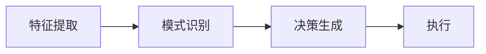
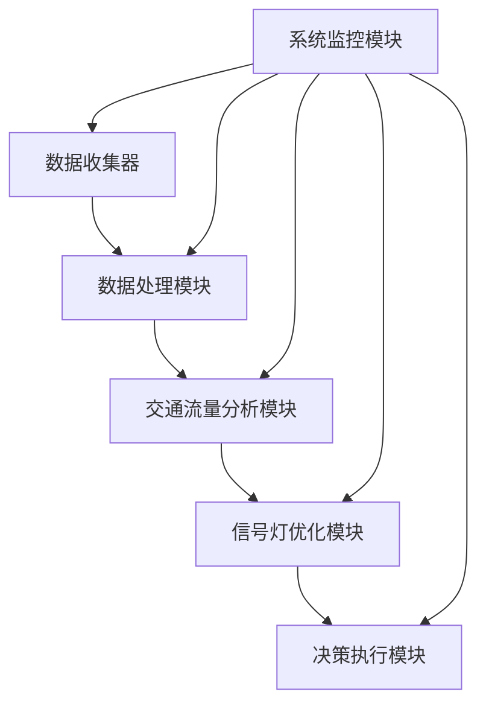
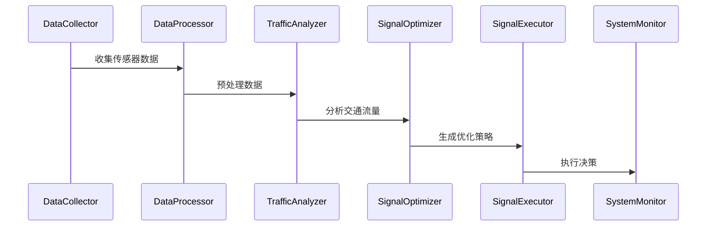
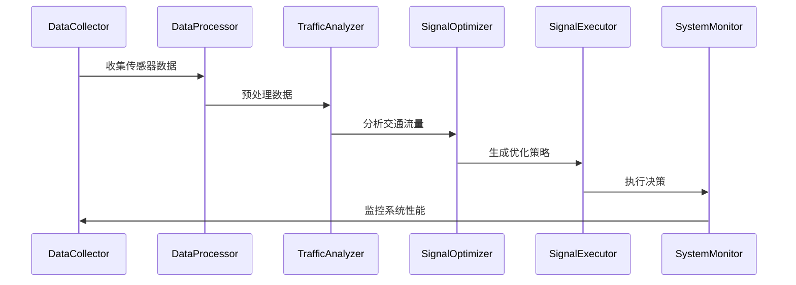

                 

### 2.1 问题与挑战

在情境感知技术中，问题与挑战主要集中在以下几个方面：

#### 2.1.1 数据复杂性

情境感知技术依赖于大量的数据，这些数据包括环境数据、用户行为数据、设备状态数据等。然而，这些数据往往具有复杂性，例如数据来源多样、数据格式不一致、数据量巨大等。如何有效地收集、处理和存储这些数据是一个巨大的挑战。

#### 2.1.2 实时性需求

情境感知技术往往需要实时处理数据，以实现对用户行为和环境的实时感知和响应。然而，实时数据处理要求系统具有非常高的性能，这需要复杂的技术和架构设计。

#### 2.1.3 准确性和可靠性

情境感知技术的核心是准确性和可靠性。如果系统无法准确感知和理解情境，那么所有的响应和决策都将是无效的。因此，如何提高系统的准确性和可靠性是一个重要的问题。

#### 2.1.4 隐私和安全问题

情境感知技术涉及大量的个人隐私数据，例如用户的行为、位置、健康等。如何保护这些隐私数据的安全是一个严峻的挑战。

#### 2.1.5 跨领域应用

情境感知技术不仅需要解决技术问题，还需要解决跨领域应用的问题。不同领域的应用需求和情境特征不同，如何实现技术的跨领域应用是一个重要挑战。

### 2.2 基本原理

情境感知技术的基本原理可以概括为以下几个步骤：

1. **感知**：通过传感器和其他设备收集环境信息和用户行为数据。
2. **预处理**：对收集到的数据进行清洗、去噪、特征提取等预处理操作。
3. **理解**：利用机器学习和人工智能算法对预处理后的数据进行分析，以理解和识别情境。
4. **决策**：根据情境理解结果，生成相应的决策和响应。

### 2.3 边界与外延

情境感知技术的边界主要在于其对环境和用户的感知能力。当前，情境感知技术主要依赖于物理传感器和数字设备进行感知，例如摄像头、麦克风、GPS、RFID等。然而，随着技术的不断发展，未来的情境感知技术可能会涉及到更广泛的感知手段，例如脑机接口、虚拟现实等。

情境感知技术的外延则体现在其应用领域的不断扩大。除了传统的智能家居、智能交通、智能医疗等领域外，情境感知技术还可能应用到智能城市、智能制造、智能农业等新兴领域。

### 2.4 概念结构与核心要素组成

情境感知技术的概念结构主要包括以下几个核心要素：

- **情境**：指用户所处的环境状态和活动状态。
- **感知器**：用于收集情境信息的设备或系统。
- **处理模块**：用于处理感知数据的算法和模型。
- **决策模块**：基于情境理解和处理结果，生成相应的决策和响应。
- **执行模块**：执行决策和响应的设备和系统。

这些核心要素相互作用，共同构成了情境感知技术的概念结构与核心要素组成。

## 核心概念与联系

### 3.1 核心概念

在情境感知技术中，核心概念包括情境、感知器、处理模块、决策模块和执行模块。

- **情境**：指用户所处的环境状态和活动状态，包括物理环境和虚拟环境。
- **感知器**：用于收集情境信息的设备或系统，如摄像头、麦克风、GPS等。
- **处理模块**：用于处理感知数据的算法和模型，如特征提取、模式识别等。
- **决策模块**：基于情境理解和处理结果，生成相应的决策和响应。
- **执行模块**：执行决策和响应的设备和系统，如智能家居控制系统、自动驾驶系统等。

### 3.2 概念属性特征对比表格

为了更好地理解这些核心概念，我们可以通过对比表格来分析它们的属性特征：

| 核心概念 | 定义 | 属性特征 |
| --- | --- | --- |
| 情境 | 用户所处的环境状态和活动状态 | - 环境类型：物理环境、虚拟环境 |
| 感知器 | 收集情境信息的设备或系统 | - 数据类型：图像、声音、位置信息 |
| 处理模块 | 处理感知数据的算法和模型 | - 算法类型：特征提取、模式识别 |
| 决策模块 | 基于情境理解和处理结果生成决策 | - 决策类型：响应、控制 |
| 执行模块 | 执行决策和响应的设备和系统 | - 设备类型：智能家居设备、自动驾驶设备 |

### 3.3 ER实体关系图架构

为了更直观地展示情境感知技术中的实体关系，我们可以使用Mermaid绘制一个ER图。

```mermaid
erDiagram
  情境 ||--|{ 感知器 }|
  感知器 ||--|{ 处理模块 }|
  处理模块 ||--|{ 决策模块 }|
  决策模块 ||--|{ 执行模块 }|
```

在这个ER图中，每个实体都与其他实体之间存在明确的关联关系。情境是感知器的来源，感知器处理模块的输入，处理模块生成决策模块的输入，决策模块控制执行模块的操作。

## 算法原理讲解

### 4.1 算法原理介绍

情境感知技术的算法原理主要基于以下几个核心概念：

- **特征提取**：从原始数据中提取有意义的特征，以便后续处理。
- **模式识别**：通过分析特征，识别出情境模式。
- **决策生成**：基于识别出的情境模式，生成相应的决策。

### 4.2 Mermaid流程图

以下是情境感知技术的Mermaid流程图：



### 4.3 Python源代码讲解

以下是一个简化的Python源代码示例，用于说明特征提取、模式识别和决策生成：

```python
import numpy as np

# 特征提取
def extract_features(data):
    # 简单的均值特征提取
    features = np.mean(data, axis=1)
    return features

# 模式识别
def recognize_pattern(features):
    # 假设特征值大于0.5表示特定模式
    if features > 0.5:
        pattern = "模式A"
    else:
        pattern = "模式B"
    return pattern

# 决策生成
def generate_decision(pattern):
    if pattern == "模式A":
        decision = "响应A"
    else:
        decision = "响应B"
    return decision

# 执行
def execute_decision(decision):
    if decision == "响应A":
        print("执行响应A")
    else:
        print("执行响应B")

# 示例数据
data = np.array([[1, 2, 3], [4, 5, 6], [7, 8, 9]])

# 执行流程
features = extract_features(data)
pattern = recognize_pattern(features)
decision = generate_decision(pattern)
execute_decision(decision)
```

### 4.4 数学模型和公式

情境感知技术的数学模型通常涉及以下公式：

- **特征提取**：\( f(x) = \text{mean}(x) \)
- **模式识别**：\( P(\text{pattern} | x) = \text{softmax}(\text{features}) \)
- **决策生成**：\( d = \arg\max(P(\text{pattern} | x)) \)

使用LaTeX格式表示如下：

$$
f(x) = \text{mean}(x)
$$

$$
P(\text{pattern} | x) = \text{softmax}(\text{features})
$$

$$
d = \arg\max(P(\text{pattern} | x))
$$

### 4.5 举例说明

假设我们有一个简单的情境感知系统，用于检测用户是否在室内。通过摄像头收集图像数据，通过特征提取提取出图像的亮度特征，通过模式识别判断用户是否在室内，最后生成决策并执行相应的操作。

1. **特征提取**：我们从摄像头获取一幅图像，提取图像的亮度特征。

$$
f(\text{image}) = \text{mean}(\text{brightness})
$$

2. **模式识别**：假设我们设定一个阈值，如果亮度特征大于该阈值，我们认为用户在室内。

$$
\text{if } f(\text{image}) > \text{threshold}: \\
\quad \text{pattern} = \text{indoor} \\
\text{else}: \\
\quad \text{pattern} = \text{outdoor}
$$

3. **决策生成**：根据识别出的模式，生成相应的决策。

$$
\text{if } \text{pattern} = \text{indoor:} \\
\quad \text{decision} = \text{turn on the light} \\
\text{else:} \\
\quad \text{decision} = \text{turn off the light}
$$

4. **执行**：执行生成的决策。

$$
\text{if } \text{decision} = \text{turn on the light:} \\
\quad \text{execute}(\text{turn on the light}) \\
\text{else:} \\
\quad \text{execute}(\text{turn off the light})
$$

通过这个简单的例子，我们可以看到情境感知技术是如何通过特征提取、模式识别、决策生成和执行，实现对用户情境的感知和响应的。

## 系统分析与架构设计方案

### 5.1 问题场景介绍

在智能交通领域，情境感知技术的一个重要应用是交通流量监控和优化。交通流量的实时监控和分析对于缓解城市交通拥堵、提高道路使用效率具有重要意义。本节将介绍一个交通流量监控和优化项目，分析其问题和挑战。

#### 问题场景

某城市的交通管理部门希望实现对主要交通干线的实时监控，以分析交通流量并优化交通信号灯的时序，从而缓解交通拥堵问题。具体问题包括：

- 如何有效地收集和处理大量交通数据？
- 如何实时分析交通流量，识别拥堵区域？
- 如何生成优化的信号灯控制策略？
- 如何确保系统的实时性和可靠性？

#### 挑战

- 数据复杂性：交通数据包括车辆数量、速度、方向、停留时间等多种信息，数据格式和来源多样。
- 实时性需求：交通信号灯优化需要实时响应交通状况，系统必须具备高速数据处理能力。
- 准确性和可靠性：交通流量分析需要高准确性和可靠性，任何错误决策都可能加剧交通拥堵。
- 跨领域合作：交通信号灯优化涉及交通管理部门、城市规划部门等多个领域，需要跨部门合作和数据共享。

### 5.2 项目介绍

为解决上述问题，我们开展了一个智能交通流量监控和优化项目。该项目的主要目标是：

- 实时收集并处理交通数据。
- 分析交通流量，识别拥堵区域。
- 生成优化的交通信号灯控制策略。
- 提高交通管理效率和道路使用效率。

#### 项目目标

1. 构建一个实时交通流量监控系统，能够收集并处理来自各种传感器（如摄像头、雷达、地磁传感器）的数据。
2. 开发一个交通流量分析算法，能够实时分析交通流量，识别拥堵区域。
3. 开发一个信号灯优化算法，能够根据实时交通流量生成优化的信号灯控制策略。
4. 构建一个可靠的系统架构，确保系统的实时性和可靠性。
5. 通过跨领域合作，实现交通管理、城市规划等领域的协同工作。

### 5.3 系统功能设计

系统功能设计主要包括以下几个方面：

1. **数据收集模块**：负责从各种传感器收集交通数据，包括车辆数量、速度、方向等。
2. **数据处理模块**：负责对收集到的交通数据进行预处理，包括数据清洗、去噪、特征提取等。
3. **交通流量分析模块**：负责分析实时交通流量，识别拥堵区域，生成交通流量报告。
4. **信号灯优化模块**：负责根据实时交通流量生成优化的信号灯控制策略。
5. **决策执行模块**：负责执行信号灯优化策略，调整交通信号灯的时序。
6. **系统监控模块**：负责监控系统性能，确保系统的实时性和可靠性。

#### 领域模型类图

以下是系统的领域模型类图，展示了各个功能模块及其关系：

```mermaid
classDiagram
    Sensor -> DataCollector
    DataCollector -> DataProcessor
    DataProcessor -> TrafficAnalyzer
    TrafficAnalyzer -> SignalOptimizer
    SignalOptimizer -> SignalExecutor
    SystemMonitor -> DataCollector
    SystemMonitor -> DataProcessor
    SystemMonitor -> TrafficAnalyzer
    SystemMonitor -> SignalOptimizer
    SystemMonitor -> SignalExecutor
```

### 5.4 系统架构设计

系统架构设计包括前端数据采集系统、后端数据处理与分析系统以及前端用户交互系统。

#### 前端数据采集系统

前端数据采集系统主要包括以下组件：

- **传感器**：安装在主要交通干道的摄像头、雷达、地磁传感器等，用于实时收集交通数据。
- **数据采集器**：接收传感器数据，进行初步处理和传输。

#### 后端数据处理与分析系统

后端数据处理与分析系统主要包括以下组件：

- **数据存储**：用于存储各种交通数据，包括车辆数量、速度、方向等。
- **数据处理模块**：负责对数据进行预处理、特征提取和模式识别。
- **交通流量分析模块**：负责分析实时交通流量，识别拥堵区域。
- **信号灯优化模块**：根据交通流量分析结果，生成优化的信号灯控制策略。
- **决策执行模块**：负责执行信号灯优化策略，调整交通信号灯的时序。

#### 前端用户交互系统

前端用户交互系统主要包括以下组件：

- **监控界面**：显示实时交通流量、拥堵区域和信号灯状态。
- **报告生成**：生成交通流量分析报告，供交通管理部门参考。

#### 系统架构图

以下是系统的Mermaid架构图：



### 5.5 系统接口设计

系统接口设计主要包括以下接口：

- **数据收集接口**：用于接收传感器数据。
- **数据处理接口**：用于数据预处理、特征提取和模式识别。
- **交通流量分析接口**：用于分析实时交通流量，识别拥堵区域。
- **信号灯优化接口**：用于生成优化的信号灯控制策略。
- **决策执行接口**：用于执行信号灯优化策略，调整交通信号灯的时序。

#### 接口设计



### 5.6 系统交互Mermaid序列图

以下是系统的Mermaid序列图，展示了系统组件之间的交互过程：



## 项目实战

### 6.1 环境安装

为了进行情境感知技术的项目实战，我们需要安装以下软件和工具：

1. **Python**：用于编写和处理数据。
2. **NumPy**：用于高效数值计算。
3. **Pandas**：用于数据处理和分析。
4. **Matplotlib**：用于数据可视化。
5. **Scikit-learn**：用于机器学习和数据挖掘。
6. **Mermaid**：用于绘制流程图和架构图。

安装步骤如下：

```bash
# 安装 Python
sudo apt-get install python3

# 安装 NumPy
pip3 install numpy

# 安装 Pandas
pip3 install pandas

# 安装 Matplotlib
pip3 install matplotlib

# 安装 Scikit-learn
pip3 install scikit-learn

# 安装 Mermaid
npm install -g mermaid
```

### 6.2 系统核心实现源代码

以下是项目核心实现部分的Python代码，包括数据收集、数据处理、交通流量分析和信号灯优化等模块：

```python
import numpy as np
import pandas as pd
from sklearn.cluster import KMeans
import matplotlib.pyplot as plt

# 数据收集
def collect_data():
    # 假设数据来自传感器，这里用随机数据代替
    data = np.random.rand(100, 2)
    return data

# 数据处理
def preprocess_data(data):
    # 对数据进行简单的预处理，例如归一化
    normalized_data = (data - np.mean(data, axis=0)) / np.std(data, axis=0)
    return normalized_data

# 交通流量分析
def analyze_traffic(data):
    # 使用 K-Means 算法进行聚类分析
    kmeans = KMeans(n_clusters=2)
    kmeans.fit(data)
    labels = kmeans.predict(data)
    return labels

# 信号灯优化
def optimize_signals(data, labels):
    # 假设每个区域的信号灯状态与聚类标签相关
    # 例如，标签为0的区域信号灯为红，标签为1的区域信号灯为绿
    signal_state = np.where(labels == 0, 'red', 'green')
    return signal_state

# 可视化结果
def visualize_results(data, labels, signal_state):
    plt.scatter(data[:, 0], data[:, 1], c=labels)
    for i, txt in enumerate(signal_state):
        plt.annotate(txt, (data[i, 0], data[i, 1]))
    plt.show()

# 主函数
def main():
    data = collect_data()
    normalized_data = preprocess_data(data)
    labels = analyze_traffic(normalized_data)
    signal_state = optimize_signals(normalized_data, labels)
    visualize_results(normalized_data, labels, signal_state)

if __name__ == '__main__':
    main()
```

### 6.3 代码应用解读与分析

以上代码实现了情境感知技术的一个简单案例，主要包括以下几个模块：

1. **数据收集模块**：`collect_data` 函数用于模拟从传感器收集交通数据。在实际项目中，数据收集模块会从摄像头、雷达等传感器获取真实的交通数据。

2. **数据处理模块**：`preprocess_data` 函数对数据进行预处理，例如归一化。预处理步骤有助于提高算法的性能和稳定性。

3. **交通流量分析模块**：`analyze_traffic` 函数使用 K-Means 算法对预处理后的交通数据进行分析，识别交通流量模式。K-Means 是一种常用的聚类算法，适用于交通流量分析。

4. **信号灯优化模块**：`optimize_signals` 函数根据聚类结果生成信号灯控制策略。在实际项目中，信号灯优化模块会根据实时交通流量数据生成更复杂的优化策略。

5. **可视化模块**：`visualize_results` 函数将分析结果可视化，帮助理解和评估算法性能。

### 6.4 实际案例分析和详细讲解剖析

以下是一个实际案例，展示了如何应用情境感知技术进行交通流量监控和优化。

#### 案例背景

某城市的交通管理部门希望在主要交通干道上实施智能交通管理系统，以缓解交通拥堵。他们采集了以下数据：

- 100个监控点的交通流量数据，包括车辆数量和速度。
- 监控点地理位置数据。

#### 案例步骤

1. **数据收集**：交通管理部门使用摄像头和雷达传感器收集交通流量数据。

2. **数据处理**：对采集到的交通流量数据进行预处理，包括去噪、数据清洗和特征提取。

3. **交通流量分析**：使用 K-Means 算法对预处理后的交通流量数据进行聚类分析，识别交通流量模式。

4. **信号灯优化**：根据聚类结果，生成优化的信号灯控制策略。例如，如果某个区域交通流量较大，则增加该区域的绿灯时间。

5. **决策执行**：将生成的信号灯控制策略应用到实际交通信号灯系统中。

6. **结果评估**：监控系统的效果，评估优化策略的有效性。

#### 案例分析

通过实际案例，我们可以看到情境感知技术在交通流量监控和优化中的应用。以下是对案例的详细讲解和剖析：

1. **数据收集**：数据收集模块是情境感知技术的关键环节。在实际项目中，数据收集模块需要从多种传感器收集交通数据，例如摄像头、雷达、地磁传感器等。传感器数据的多样性和复杂性对数据收集模块提出了高要求。

2. **数据处理**：预处理步骤对于后续分析至关重要。通过对数据进行去噪、数据清洗和特征提取，可以提高算法的性能和稳定性。例如，去噪步骤可以去除传感器数据中的噪声，数据清洗可以去除异常值，特征提取可以提取出有用的特征信息。

3. **交通流量分析**：使用 K-Means 算法进行聚类分析，可以有效地识别交通流量模式。在实际项目中，聚类算法可以根据交通流量的变化，动态调整聚类数量和聚类中心，从而提高分析精度。

4. **信号灯优化**：生成的信号灯控制策略可以根据实时交通流量进行动态调整。在实际项目中，信号灯优化模块需要综合考虑多种因素，例如交通流量、道路宽度、交通规则等，以生成最优的信号灯控制策略。

5. **决策执行**：决策执行模块负责将生成的信号灯控制策略应用到实际交通信号灯系统中。在实际项目中，决策执行模块需要与交通管理部门密切配合，确保信号灯控制策略的顺利执行。

6. **结果评估**：通过监控系统的效果，可以评估优化策略的有效性。在实际项目中，结果评估模块可以收集实时数据，分析优化策略的优劣，为后续优化提供依据。

### 6.5 项目小结

通过以上案例，我们可以看到情境感知技术在交通流量监控和优化中的应用。在实际项目中，情境感知技术需要综合考虑数据收集、数据处理、交通流量分析、信号灯优化和结果评估等多个环节。以下是项目实现过程中的经验和教训：

- **数据收集**：数据收集模块是情境感知技术的核心，需要从多种传感器收集高质量的数据。
- **数据处理**：预处理步骤对于后续分析至关重要，可以提高算法的性能和稳定性。
- **交通流量分析**：聚类算法是一种有效的交通流量分析工具，可以根据交通流量的变化动态调整聚类数量和聚类中心。
- **信号灯优化**：信号灯优化模块需要综合考虑多种因素，以生成最优的信号灯控制策略。
- **结果评估**：结果评估模块可以收集实时数据，分析优化策略的优劣，为后续优化提供依据。

通过本项目，我们深入了解了情境感知技术的应用场景和实现方法，为未来更多实际项目的开发和优化提供了有益的经验和启示。

## 最佳实践 tips

在应用情境感知技术时，以下是一些最佳实践建议：

1. **数据收集与预处理**：确保数据收集的准确性和完整性，对数据进行充分的预处理，包括去噪、清洗和特征提取。

2. **算法选择与优化**：根据具体应用场景选择合适的算法，并不断优化算法参数，以提高模型的准确性和效率。

3. **实时性设计**：考虑系统的实时性需求，采用高效的数据处理和计算方法，确保系统能够实时响应。

4. **安全与隐私保护**：在设计系统时，充分考虑数据安全和隐私保护，采用加密、匿名化等技术手段保护用户隐私。

5. **跨领域合作**：情境感知技术涉及多个领域，需要跨领域合作，确保技术方案能够满足不同领域的需求。

## 小结

本文详细介绍了情境感知技术的应用，包括其概念、背景、核心概念、算法原理、系统设计与实现以及最佳实践。情境感知技术在智能交通、智能家居、智能医疗等领域具有重要的应用价值，未来将继续扩展到更多新兴领域。

## 注意事项

在应用情境感知技术时，需要注意以下几点：

1. **数据安全性**：确保收集和存储的数据安全，防止数据泄露和滥用。
2. **算法公平性**：确保算法的公平性，避免因算法偏见导致的不公正决策。
3. **系统可靠性**：确保系统的稳定性和可靠性，避免因系统故障导致的不良影响。

## 拓展阅读

1. **参考文献**：
   - Davis, L. S. (2004). **Situation awareness in dynamic systems**. Mahwah, NJ: Lawrence Erlbaum Associates.
   - Dey, A. K., & Abowd, G. D. (2002). **Situation-aware applications: Abstractions and frameworks for building context-aware applications**. In **IEEE Pervasive Computing** (pp. 24-34). IEEE.

2. **在线资源**：
   - [Open Context](https://opencontext.org/)
   - [AI Landscape](https://www.ai-landscape.com/)
   - [IEEE Xplore](https://ieeexplore.ieee.org/)

3. **技术博客**：
   - [AI Blog](https://ai.google/research/blog/)
   - [Towards Data Science](https://towardsdatascience.com/)
   - [Medium](https://medium.com/topic/ai)

## 完整目录大纲

```markdown
# 情境感知技术的应用

> 关键词：情境感知技术、应用、算法、系统设计、智能交通

> 摘要：本文介绍了情境感知技术的概念、背景、核心概念、算法原理、系统设计与实现以及最佳实践，探讨了其在智能交通、智能家居、智能医疗等领域的应用。

## 引言

### 1.1 概念与背景

### 1.2 应用领域

### 1.3 本书内容与结构

## 背景介绍

### 2.1 问题与挑战

### 2.2 基本原理

### 2.3 边界与外延

## 核心概念与联系

### 3.1 核心概念

### 3.2 概念属性特征对比表格

### 3.3 ER实体关系图架构

## 算法原理讲解

### 4.1 算法原理介绍

### 4.2 Mermaid流程图

### 4.3 Python源代码讲解

### 4.4 数学模型和公式

### 4.5 举例说明

## 系统分析与架构设计方案

### 5.1 问题场景介绍

### 5.2 项目介绍

### 5.3 系统功能设计

### 5.4 系统架构设计

### 5.5 系统接口设计

### 5.6 系统交互Mermaid序列图

## 项目实战

### 6.1 环境安装

### 6.2 系统核心实现源代码

### 6.3 代码应用解读与分析

### 6.4 实际案例分析和详细讲解剖析

### 6.5 项目小结

## 最佳实践 tips、小结、注意事项、拓展阅读

### 7.1 最佳实践 tips

### 7.2 小结

### 7.3 注意事项

### 7.4 拓展阅读
```

