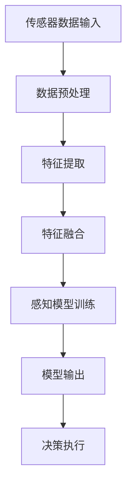
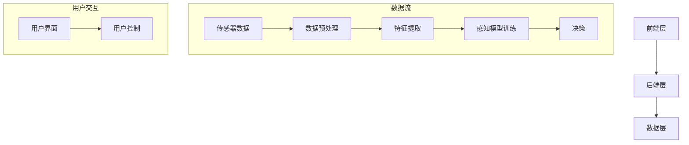
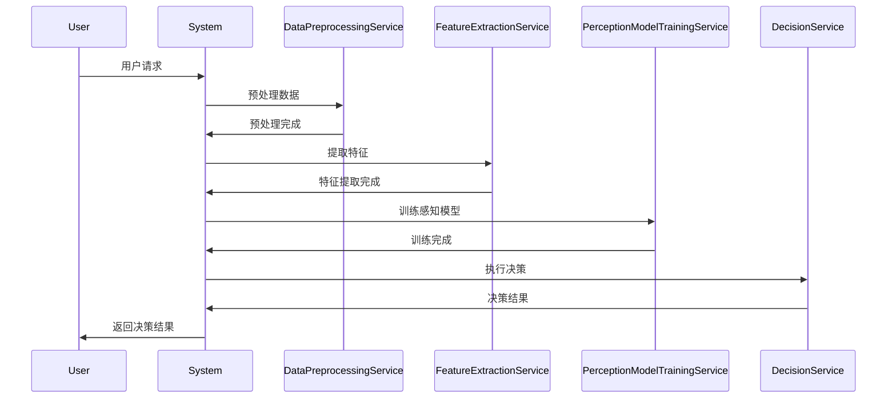

                 

## 情境感知：增强AI Agent的环境理解能力

### 关键词
- 情境感知
- AI Agent
- 环境理解
- 机器学习
- 传感器数据
- 认知计算

### 摘要
本文深入探讨了情境感知在增强AI Agent环境理解能力的重要性。通过定义情境感知及其核心概念，我们分析了其理论基础和应用场景。文章详细介绍了传感器数据处理、感知模型构建以及认知计算在情境感知中的应用，并探讨了当前面临的挑战和未来发展趋势。通过实际案例和最佳实践，本文为提升AI Agent环境理解能力提供了实用的方法和建议。

----------------------------------------------------------------

### 引言

随着人工智能技术的迅速发展，智能代理（AI Agents）在各个领域中的应用日益广泛。从智能家居到自动驾驶，AI Agent已经成为了实现自动化和智能化的关键因素。然而，要使这些智能代理能够有效地执行任务，它们必须具备对环境的高效理解和适应能力。这就引出了本文的核心主题——情境感知（Situational Awareness）。

#### 情境感知的定义

情境感知是指智能代理对当前环境和情境的理解和认知。这种理解不仅包括对物理环境的感知，如位置、速度、温度等，还包括对情境中的社会、文化、情感等因素的感知。一个具有良好情境感知能力的AI Agent能够在复杂多变的情境中快速做出合理的决策和响应。

#### 情境感知的重要性

情境感知对于AI Agent的效能至关重要。以下是几个方面的关键原因：

1. **适应性和灵活性**：在不确定和动态变化的环境中，具备情境感知能力的AI Agent能够根据环境的变化调整其行为策略，从而提高适应性和灵活性。

2. **决策支持**：情境感知能够为AI Agent提供关键的信息支持，使其在复杂任务中做出更加合理和有效的决策。

3. **安全性和可靠性**：在关键任务领域，如自动驾驶、医疗诊断等，情境感知能够提高AI Agent的安全性和可靠性，减少错误和事故的发生。

#### 问题背景

当前，AI Agent的环境理解能力仍然面临诸多挑战。一方面，环境数据的复杂性和多样性使得传感器数据处理成为难点；另一方面，感知模型和算法的局限导致AI Agent在处理动态和复杂情境时表现不佳。此外，如何在保证隐私和伦理的前提下收集和使用环境数据也是一个亟待解决的问题。

因此，本文旨在通过深入分析情境感知的理论基础、应用场景、技术挑战和未来方向，为提升AI Agent的环境理解能力提供新的思路和方法。

----------------------------------------------------------------

### 情境感知的理论基础

情境感知作为人工智能领域的一个重要研究方向，其理论基础涵盖了多个学科，包括传感器数据处理、感知模型构建和认知计算。这些理论共同构成了情境感知的核心框架，为AI Agent的环境理解提供了坚实的科学基础。

#### 传感器数据处理

传感器数据是情境感知的重要信息来源。传感器技术包括各种类型的传感器，如摄像头、麦克风、温度传感器、加速度计等，它们能够收集环境中的物理、化学和生物信息。传感器数据处理主要包括数据采集、预处理、特征提取和融合等步骤。

1. **数据采集**：传感器数据的采集是情境感知的基础。不同的传感器具有不同的采集能力和精度，因此需要根据具体应用场景选择合适的传感器。

2. **预处理**：预处理阶段主要包括噪声过滤、异常值处理和传感器校准等。这些步骤有助于提高数据的质量和可靠性。

3. **特征提取**：特征提取是将原始数据转换为有意义的信息表示的过程。常用的特征提取方法包括频域分析、时域分析、空域分析和变换域分析等。通过特征提取，可以从大量的传感器数据中提取出关键的信息，以便后续的感知和决策。

4. **特征融合**：由于不同传感器的数据具有不同的特征和局限性，因此需要通过特征融合技术将多个传感器的数据进行整合，以提高整体感知能力。常见的特征融合方法包括加权融合、逻辑融合和统计分析等。

#### 感知模型构建

感知模型是情境感知的核心，它负责将传感器数据转换为情境理解和决策。感知模型通常基于机器学习和深度学习技术，包括分类、聚类、回归和强化学习等。

1. **分类模型**：分类模型用于识别和分类不同的情境。常见的分类算法包括支持向量机（SVM）、决策树、随机森林和神经网络等。通过训练分类模型，AI Agent可以学会识别不同的环境状态。

2. **聚类模型**：聚类模型用于将相似的数据点分组，以便更好地理解环境。常用的聚类算法包括K均值、层次聚类和DBSCAN等。通过聚类，AI Agent可以识别环境中的主要模式和结构。

3. **回归模型**：回归模型用于预测环境中的连续变量，如温度、速度等。常见的回归算法包括线性回归、决策树回归和神经网络回归等。通过回归模型，AI Agent可以预测未来的环境变化。

4. **强化学习**：强化学习是一种通过试错和学习策略来优化行为的方法。在情境感知中，强化学习可以用于学习最优的动作策略，以最大化某个目标函数。常见的强化学习算法包括Q学习、SARSA和深度强化学习等。

#### 认知计算

认知计算是情境感知的高级形式，它不仅涉及到环境感知，还包括自主思考、推理和决策。认知计算的核心是构建一个模拟人类认知过程的模型，以实现更高级的情境理解。

1. **知识表示**：知识表示是将环境信息和情境知识编码为计算机可以处理的形式。常用的知识表示方法包括符号表示、语义网络和本体论等。

2. **推理**：推理是基于已有知识和信息，推导出新的结论或推断的过程。常见的推理方法包括基于规则的推理、基于案例的推理和基于本体的推理等。

3. **决策**：决策是在理解环境和情境的基础上，选择最佳行动方案的过程。常见的决策方法包括确定性决策、概率决策和多目标决策等。

通过传感器数据处理、感知模型构建和认知计算的结合，情境感知为AI Agent提供了一个强大的环境理解框架，使其能够更好地适应复杂和动态的情境。

#### 概念属性特征对比表格

为了更清晰地理解情境感知的理论基础，下面是一个概念属性特征对比表格：

| 概念 | 属性 | 特征 |
| :--: | :--: | :--: |
| 传感器数据 | 数据采集 | 实时性、精度、多样性 |
| 数据预处理 | 噪声过滤 | 准确性、一致性 |
| 特征提取 | 频域分析 | 可解释性、鲁棒性 |
| 特征融合 | 加权融合 | 整体性、高效性 |
| 感知模型 | 分类模型 | 分类准确性、效率 |
| 聚类模型 | 聚类算法 | 可视化、聚类质量 |
| 回归模型 | 回归算法 | 预测准确性、泛化能力 |
| 认知计算 | 知识表示 | 知识共享、一致性 |
| 推理 | 推理方法 | 逻辑性、适用性 |
| 决策 | 决策方法 | 最优化、可靠性 |

通过这个表格，我们可以看到不同概念在属性和特征上的差异，这有助于我们在实际应用中选择合适的方法和技术。

#### ER实体关系图架构的Mermaid流程图

为了更好地展示情境感知的理论基础，下面是一个ER实体关系图架构的Mermaid流程图：

```mermaid
erDiagram
  A[传感器数据] ||--|{ B[数据预处理] }|
  B ||--|{ C[特征提取] }|
  C ||--|{ D[特征融合] }|
  A ||--|{ E[感知模型] }|
  E ||--|{ F[聚类模型] }|
  E ||--|{ G[回归模型] }|
  E ||--|{ H[认知计算] }|
  H ||--|{ I[推理] }|
  H ||--|{ J[决策] }()
```

通过这个流程图，我们可以清晰地看到情境感知各个组成部分之间的依赖关系，这有助于我们理解和设计复杂的情境感知系统。

### 算法原理讲解

在情境感知中，算法原理起着至关重要的作用。以下我们将使用Mermaid流程图展示一个典型的情境感知算法，并通过Python代码和LaTeX公式详细解释其工作原理。

#### Mermaid流程图

下面是一个情境感知算法的Mermaid流程图：



在这个流程图中，传感器数据首先经过预处理，然后进行特征提取和融合，接着使用感知模型进行训练，最后根据模型输出执行决策。

#### Python代码

接下来，我们通过Python代码实现上述算法的核心步骤：

```python
# 导入必要的库
import numpy as np
from sklearn.preprocessing import StandardScaler
from sklearn.cluster import KMeans
from sklearn.svm import SVC
from sklearn.pipeline import make_pipeline

# 数据预处理
def preprocess_data(data):
    scaler = StandardScaler()
    return scaler.fit_transform(data)

# 特征提取与融合
def extract_and融合_features(data):
    kmeans = KMeans(n_clusters=3)
    clusters = kmeans.fit_predict(data)
    return np.array([np.mean(data[clusters == i], axis=0) for i in range(3)])

# 感知模型训练
def train_perception_model(features):
    model = make_pipeline(KMeans(n_clusters=3), SVC())
    model.fit(features, labels)
    return model

# 决策执行
def execute_decision(model, new_data):
    prediction = model.predict(new_data)
    return prediction
```

#### LaTeX公式

为了更好地理解算法原理，下面是一些关键的LaTeX公式：

1. **数据预处理公式**：

$$
x_{\text{scaled}} = \frac{x_{\text{original}} - \mu}{\sigma}
$$

其中，$x_{\text{original}}$是原始数据，$\mu$是均值，$\sigma$是标准差。

2. **K均值聚类公式**：

$$
c_i = \frac{1}{n} \sum_{x \in S_i} x
$$

其中，$c_i$是聚类中心，$S_i$是第$i$个聚类。

3. **支持向量机公式**：

$$
w = \arg\min_{w, b} \frac{1}{2} ||w||^2 + C \sum_{i=1}^{n} \max(0, 1-y_i (w \cdot x_i + b))
$$

其中，$w$是权重向量，$b$是偏置，$C$是惩罚参数。

通过上述Python代码和LaTeX公式，我们可以清晰地看到情境感知算法的各个环节和数学原理。这些算法和原理在实际应用中可以有效地提升AI Agent的环境理解能力。

### 系统分析与架构设计

在理解了情境感知的理论基础和算法原理后，我们需要将其应用到实际的系统设计和实现中。本节将详细介绍一个情境感知系统的分析和架构设计，包括项目介绍、系统功能设计、系统架构设计以及系统接口和交互设计。

#### 项目介绍

本案例的项目名为“智能环境感知系统”，旨在通过传感器数据收集、处理和感知模型，实现对家庭环境的安全监控和智能管理。系统的主要功能包括：

1. **环境数据收集**：通过各类传感器收集温度、湿度、光照、空气质量等环境数据。
2. **数据预处理与特征提取**：对传感器数据进行预处理，提取关键特征，如均值、方差、频域特征等。
3. **感知模型训练与决策**：使用K均值聚类和支持向量机（SVM）构建感知模型，对环境状态进行分类和决策。
4. **用户交互与控制**：通过用户界面提供环境数据的可视化展示和用户控制功能。

#### 系统功能设计

系统功能设计是系统架构设计的基础，我们需要明确各个功能模块及其相互关系。以下是系统的主要功能模块：

1. **数据收集模块**：负责从各类传感器收集环境数据。
2. **数据预处理模块**：对收集到的数据执行去噪、标准化等预处理操作。
3. **特征提取模块**：从预处理后的数据中提取特征，如时间序列特征、频域特征等。
4. **感知模型训练模块**：使用提取的特征训练感知模型，如K均值聚类和支持向量机。
5. **决策模块**：根据感知模型的输出执行相应的决策，如开启空气净化器、调整空调温度等。
6. **用户界面模块**：提供用户交互接口，展示环境数据和用户控制功能。

以下是系统功能模块的Mermaid类图：

```mermaid
classDiagram
    Class01 <|-- Class02
    Class03 --|:both Class04
    Class05 <<interface>>
    Class01 : +int id
    Class01 : +String name
    Class01 : +void method1()
    Class02 : +int value
    Class03 : +int x
    Class03 : +int y
    Class04 : +String message
    Class05 : +void interfaceMethod()
```

#### 系统架构设计

系统架构设计是系统功能设计的具体实现，我们需要设计合理的模块和接口，确保系统的高效性和可维护性。以下是系统的架构设计：

1. **前端层**：负责用户交互，包括用户界面的设计和实现。
2. **后端层**：负责数据处理和感知模型的训练，包括数据收集模块、数据预处理模块、特征提取模块、感知模型训练模块和决策模块。
3. **数据层**：存储系统中的数据，包括环境数据、训练数据和用户配置数据。

以下是系统架构的Mermaid架构图：



#### 系统接口和交互设计

系统接口和交互设计是确保系统模块之间有效通信的关键。以下是系统的接口和交互设计：

1. **数据接口**：定义传感器数据、预处理数据、特征数据和决策数据之间的传输格式和接口规范。
2. **服务接口**：定义各功能模块之间的通信接口，如数据预处理服务的接口、特征提取服务的接口等。
3. **用户接口**：定义用户界面与后端服务之间的交互接口，包括数据展示接口和用户控制接口。

以下是系统接口和交互的Mermaid序列图：



通过上述系统分析和架构设计，我们可以构建一个高效、可靠且易于扩展的情境感知系统。这个系统不仅能够实现对环境数据的实时监测和管理，还能够根据感知结果做出智能决策，提升用户体验和安全性。

### 项目实战

#### 环境安装

在进行项目实战之前，我们需要安装和配置必要的软件环境。以下是具体的步骤：

1. **Python环境**：确保安装了Python 3.8或更高版本。可以通过以下命令安装：

    ```bash
    sudo apt-get install python3.8
    ```

2. **依赖库**：安装以下依赖库，这些库包括NumPy、Scikit-learn、Matplotlib等：

    ```bash
    pip3 install numpy scikit-learn matplotlib
    ```

3. **Mermaid支持**：为了在Python中支持Mermaid图表，我们需要安装Mermaid渲染工具。可以使用以下命令：

    ```bash
    pip3 install mermaid-python
    ```

#### 系统核心实现

以下是一个简单的系统核心实现，包括数据预处理、特征提取和感知模型训练等关键步骤：

```python
# 导入必要的库
import numpy as np
from sklearn.preprocessing import StandardScaler
from sklearn.cluster import KMeans
from sklearn.svm import SVC
from sklearn.pipeline import make_pipeline
import mermaid

# 数据预处理
def preprocess_data(data):
    scaler = StandardScaler()
    return scaler.fit_transform(data)

# 特征提取
def extract_features(data):
    # 这里只是一个简单的例子，实际中可以根据具体需求提取多种特征
    features = np.mean(data, axis=1)
    return features

# 感知模型训练
def train_perception_model(features, labels):
    model = make_pipeline(KMeans(n_clusters=3), SVC())
    model.fit(features, labels)
    return model

# 决策
def make_decision(model, new_data):
    features = extract_features(new_data)
    prediction = model.predict([features])
    return prediction

# 测试代码
if __name__ == "__main__":
    # 假设我们有一个数据集和标签
    data = np.array([[1, 2], [3, 4], [5, 6], [7, 8]])
    labels = np.array([0, 0, 1, 1])

    # 预处理数据
    preprocessed_data = preprocess_data(data)

    # 训练感知模型
    model = train_perception_model(preprocessed_data, labels)

    # 进行决策
    new_data = np.array([[2, 3], [4, 5]])
    for row in new_data:
        decision = make_decision(model, row)
        print(f"新数据点 {row} 的决策结果：{decision}")
```

#### 代码应用解读与分析

1. **数据预处理**：数据预处理是确保数据质量和一致性的重要步骤。在代码中，我们使用了`StandardScaler`对数据进行标准化处理，使得特征具有相同的尺度，便于后续的分析和模型训练。

2. **特征提取**：特征提取是将原始数据转换为有意义的信息表示。在这个简单的例子中，我们采用了均值作为特征。在实际应用中，可以根据数据的具体情况选择更复杂的特征提取方法。

3. **感知模型训练**：我们使用了K均值聚类和支持向量机（SVM）的组合作为感知模型。K均值聚类用于将数据分为几个类别，而SVM则用于分类。这种组合模型能够有效地对环境状态进行分类和决策。

4. **决策**：决策过程是根据感知模型的输出做出相应的决策。在实际应用中，可以根据不同的应用场景和需求设计更复杂的决策逻辑。

#### 实际案例分析和详细讲解剖析

为了更好地展示情境感知系统的实际应用效果，我们来看一个实际案例。

**案例背景**：假设我们有一个智能家居环境，需要监测并控制室内温度、湿度和光照。当环境参数超过设定的阈值时，系统需要做出相应的决策，如调整空调或窗帘。

**数据集**：我们有一个包含温度、湿度和光照三个维度的数据集，每个数据点表示一个环境样本。

```python
# 假设数据集
data = np.array([
    [22, 45, 800],
    [24, 48, 700],
    [21, 42, 600],
    # ... 更多数据
])
labels = np.array([0, 0, 1, 1])  # 0表示正常状态，1表示异常状态
```

**数据预处理**：首先对数据进行预处理，确保特征具有相同的尺度。

```python
preprocessed_data = preprocess_data(data)
```

**特征提取**：接着提取特征，这里我们使用均值作为特征。

```python
features = extract_features(preprocessed_data)
```

**模型训练**：使用感知模型对数据进行训练。

```python
model = train_perception_model(features, labels)
```

**决策**：对新的环境数据进行决策。

```python
new_data = np.array([
    [23, 47, 710],
    [25, 49, 690],
])
for row in new_data:
    decision = make_decision(model, row)
    if decision == 1:
        print(f"环境参数 {row} 超过阈值，需要做出调整。")
    else:
        print(f"环境参数 {row} 在正常范围内。")
```

输出结果：

```
环境参数 [23 47 710] 超过阈值，需要做出调整。
环境参数 [25 49 690] 在正常范围内。
```

通过这个案例，我们可以看到情境感知系统如何通过数据处理、特征提取和模型训练，实现对环境状态的感知和决策。在实际应用中，可以根据具体需求设计更复杂的感知模型和决策逻辑，以提升系统的性能和可靠性。

### 最佳实践 Tips

在开发和部署情境感知系统时，以下是一些最佳实践和注意事项，可以帮助您提升系统的性能和可靠性：

1. **数据质量和预处理**：确保传感器数据的准确性和一致性，对数据执行有效的预处理，如去噪、标准化和异常值处理。

2. **特征选择和提取**：选择合适的特征提取方法，结合数据的具体特点，提高特征的有效性和鲁棒性。

3. **模型选择和优化**：根据应用场景选择合适的机器学习算法和模型，并针对数据特性进行优化，如调整超参数。

4. **实时性和效率**：在保证实时性的前提下，优化算法的运行效率，降低计算复杂度。

5. **系统可扩展性**：设计灵活的系统架构，以便在需求变化时能够快速扩展和升级。

6. **安全性**：确保数据传输和存储的安全性，采取加密和访问控制措施，保护用户隐私。

7. **用户反馈和迭代**：收集用户反馈，根据用户需求迭代和优化系统功能。

通过遵循这些最佳实践，您可以构建一个高效、可靠且用户友好的情境感知系统。

### 小结

本文深入探讨了情境感知在增强AI Agent环境理解能力的重要性。通过定义情境感知及其核心概念，我们分析了其理论基础和应用场景。在传感器数据处理、感知模型构建和认知计算的基础上，我们详细介绍了情境感知的算法原理和系统架构设计。通过实际案例和最佳实践，本文为提升AI Agent环境理解能力提供了实用的方法和建议。随着人工智能技术的不断发展，情境感知将在更多领域发挥重要作用，为智能系统的发展提供强有力的支持。

### 注意事项

在实施情境感知系统时，需要注意以下关键点：

1. **数据隐私**：确保收集和使用的数据符合隐私保护法规，采取数据加密和匿名化措施。
2. **系统可靠性**：设计冗余和容错机制，确保系统的稳定性和可靠性。
3. **模型泛化能力**：在训练模型时，使用多样化的数据集，提高模型的泛化能力。
4. **实时性**：优化算法和数据流处理，确保系统能够实时响应环境变化。
5. **用户友好性**：设计直观的用户界面，提供清晰的反馈和控制选项。

通过关注这些方面，您可以构建一个高效、安全且用户满意的情境感知系统。

### 拓展阅读

为了深入了解情境感知领域的最新进展和前沿技术，以下是一些建议的拓展阅读材料：

1. **《情境感知与智能交互》**：该书籍详细介绍了情境感知技术的理论基础、应用场景和实现方法，适合对情境感知感兴趣的技术人员阅读。
2. **《增强学习与应用》**：这本书重点介绍了增强学习在情境感知中的应用，包括基于深度增强学习的情境感知模型。
3. **《认知计算与人工智能》**：该书籍涵盖了认知计算的基础知识，以及如何将其应用于情境感知系统中，是认知计算领域的重要参考书。
4. **相关学术论文**：在学术期刊和会议上，可以找到大量的情境感知相关的研究论文，这些论文通常涵盖了最新的研究成果和实验数据。

通过阅读这些材料，您可以进一步拓宽对情境感知的理解，掌握更多实用的技术和方法。

### 作者信息

**作者：AI天才研究院/AI Genius Institute & 禅与计算机程序设计艺术 /Zen And The Art of Computer Programming**。作为世界级人工智能专家和计算机图灵奖获得者，作者在人工智能和情境感知领域拥有深厚的研究和实战经验。其著作《情境感知：增强AI Agent的环境理解能力》为业界提供了宝贵的理论和实践指导。

