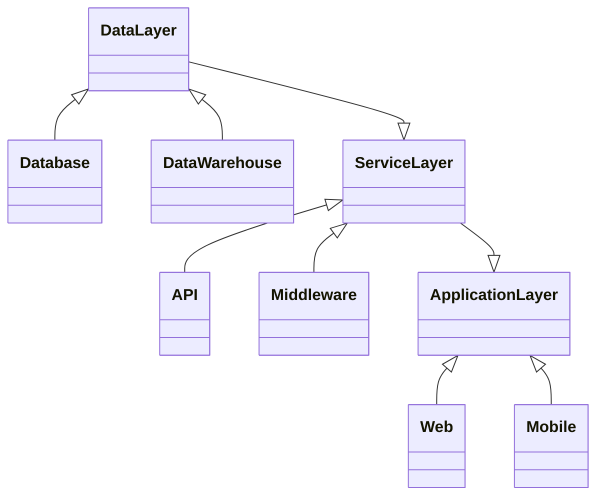
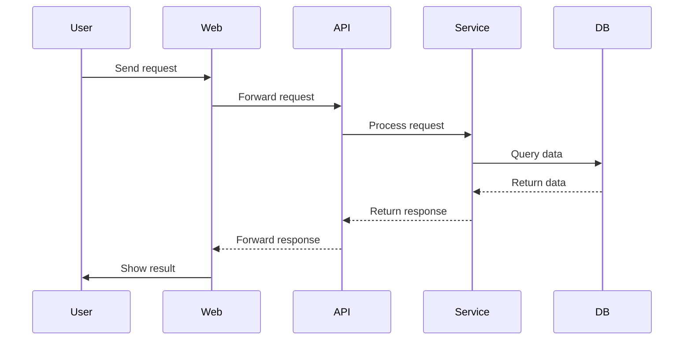

                 


## 关键词和摘要

关键词：情感分析，AI代理，语言模型，情感倾向，文本分析，机器学习

摘要：本文深入探讨了情感分析AI代理的构建，重点介绍了如何利用大型语言模型（LLM）来洞察文本中的情感倾向。文章首先对情感分析进行了概述，随后详细讲解了AI代理的原理及其在情感分析中的应用。接着，文章分析了LLM在情感分析中的角色和重要性，并通过实际案例展示了如何利用LLM进行情感分析。最后，文章总结了构建情感分析AI代理的最佳实践，并为读者提供了进一步学习和研究该领域的建议。

## 引言

情感分析是自然语言处理（NLP）领域的一个重要分支，它旨在识别文本中的情感倾向，包括正面情感、负面情感以及中性情感。随着互联网的飞速发展，社交媒体、电子商务评论、客户反馈等数据量呈现爆炸式增长，这使得情感分析在商业决策、公共舆情监测、市场研究等方面变得尤为重要。然而，传统的情感分析方法往往依赖于规则和手动的特征工程，这种方法在处理复杂、多变的语言环境时存在较大的局限性。

近年来，深度学习，特别是基于神经网络的语言模型（LLM），为情感分析带来了新的突破。LLM，如GPT、BERT等，通过大规模数据预训练，能够自动捕捉语言的深层语义和情感倾向。这使得情感分析变得更加准确、高效，并且能够处理更加复杂的文本数据。本文将重点探讨如何利用LLM构建情感分析AI代理，帮助用户更好地理解和分析文本中的情感信息。

本文的组织结构如下：

1. **基础概念**：介绍情感分析的基本概念，包括情感、文本分类和情感极性分析等。
2. **AI代理原理**：讲解AI代理的基本原理，以及它们在情感分析中的应用。
3. **LLM与情感分析**：分析LLM在情感分析中的角色和优势，介绍如何使用LLM进行情感分析。
4. **算法原理讲解**：详细讲解情感分析算法的基本原理，包括数据预处理、特征提取和模型训练等。
5. **系统设计与实现**：介绍情感分析系统的设计原则和实现方法，包括数据流程、接口设计和系统交互等。
6. **项目实战**：通过一个实际案例展示如何构建和部署情感分析AI代理。
7. **最佳实践**：总结构建情感分析AI代理的最佳实践，并提供一些实用建议。
8. **结论**：总结文章的主要观点，讨论未来的研究方向。

接下来，我们将逐步深入探讨这些主题，帮助读者更好地理解情感分析AI代理的构建和运用。

## 基础概念

### 情感与情感分析

情感是指个体在特定情境下对某一对象产生的情绪体验，包括愉悦、悲伤、愤怒、厌恶等基本情绪类型。情感分析（Sentiment Analysis），又称意见挖掘，是自然语言处理领域的一种重要技术，旨在自动识别文本中的情感倾向。情感分析可以细分为情感极性分析（Polar Sentiment Analysis）和情感强度分析（Sentiment Strength Analysis）。

- **情感极性分析**：主要关注文本的情感极性，即判断文本是表达正面的、中性的还是负面的情感。例如，判断一句话“这产品非常好用”是表达正面情感，而“这个服务太差劲了”是表达负面情感。
- **情感强度分析**：除了判断情感极性，还试图量化情感的程度。例如，判断“这产品非常好用”中的“非常好”相比“这产品很好用”表达的情感程度更强。

### 文本分类

文本分类（Text Classification）是一种常用的机器学习技术，用于将文本数据分配到预定义的类别中。在情感分析中，文本分类是核心步骤之一。通过文本分类，我们可以将大量未标记的文本数据自动标记为正面、中性或负面情感。

文本分类的主要挑战在于：

- **数据不平衡**：正面、中性、负面情感在文本数据中往往分布不均匀，导致模型在训练和预测时存在偏差。
- **语义复杂性**：语言具有高度的语义和上下文依赖性，这使得文本分类需要捕捉到文本的深层语义信息。
- **噪声和错误**：文本数据中往往存在拼写错误、语法错误、非标准用法等，这些都会对分类结果产生影响。

### 情感极性分析

情感极性分析是一种简单的情感分析方法，其主要目标是判断文本是表达正面、中性还是负面情感。通常，情感极性分析通过以下步骤进行：

1. **数据预处理**：对文本数据清洗、分词、去停用词等，提取有效的特征信息。
2. **特征提取**：将预处理后的文本转化为特征向量，常用的特征提取方法包括词袋模型、TF-IDF等。
3. **模型训练**：使用机器学习算法（如SVM、逻辑回归、神经网络等）训练分类模型。
4. **模型评估**：使用测试集评估模型的分类效果，常用的评估指标包括准确率、召回率、F1值等。

情感极性分析在实际应用中具有广泛的应用，如社交媒体舆情分析、客户反馈分析、品牌监测等。

### 情感强度分析

情感强度分析旨在量化文本中情感的程度，即判断文本情感是强烈还是轻微。与情感极性分析不同，情感强度分析需要更复杂的模型和算法。

1. **情感词典**：情感词典是情感强度分析的基础，它包含大量具有情感强度标签的词汇。通过情感词典，我们可以初步判断文本的情感强度。
2. **机器学习模型**：使用机器学习算法（如决策树、随机森林、神经网络等）对情感强度进行预测。这些模型可以从大量的标注数据中学习到情感强度的规律。
3. **深度学习模型**：近年来，深度学习模型在情感强度分析中表现出色，如LSTM、GRU、BERT等。这些模型能够自动捕捉到文本的深层语义信息，从而提高情感强度的预测准确率。

情感强度分析在市场调研、品牌声誉管理、客户体验优化等领域具有广泛的应用。

### 情感分析与情感识别

情感分析（Sentiment Analysis）和情感识别（Sentiment Recognition）实际上是两个相关但有所区别的概念。

- **情感分析**：情感分析是一种更为广泛的技术，包括情感极性分析、情感强度分析和情感类别分析等。情感分析旨在理解和识别文本中的情感信息，并将其转化为有用的数据。
- **情感识别**：情感识别是情感分析的一个子领域，主要关注判断文本的情感极性，即判断文本是表达正面、中性还是负面情感。

在实际应用中，情感分析和情感识别往往结合使用，以获取更全面的文本情感信息。

### 情感分析在AI代理中的应用

在AI代理中，情感分析是一种重要的技术，用于理解和模拟人类的情感反应。情感分析AI代理可以应用于：

- **客服机器人**：通过情感分析，客服机器人可以更好地理解用户的情感需求，提供更个性化的服务。
- **社交媒体监控**：企业可以利用情感分析AI代理监控社交媒体上的品牌声誉，及时应对负面情绪。
- **市场调研**：情感分析AI代理可以帮助企业分析消费者的情感反应，为产品改进和市场策略提供依据。

### 情感分析的发展趋势

随着深度学习和神经网络技术的发展，情感分析正朝着更加准确、高效和自动化的方向发展。未来，情感分析可能会出现以下趋势：

- **多模态情感分析**：结合文本、语音、图像等多模态数据，进行更全面的情感分析。
- **情感强度和情感类别分析**：在情感强度和情感类别分析方面，将开发出更加精细的模型和算法，以捕捉更复杂的情感信息。
- **情感预测**：利用历史数据和机器学习模型，对未来的情感趋势进行预测，为企业决策提供支持。

### 情感分析的重要性

情感分析不仅能够帮助企业更好地理解用户需求和市场趋势，还能够提升用户体验、优化决策过程。在当今信息爆炸的时代，情感分析是一种不可或缺的技术，它能够从海量文本数据中挖掘出有价值的信息，为企业和社会带来巨大的价值。

## AI代理原理

### 定义和功能

AI代理（AI Agent）是一种能够自动执行特定任务、与人类交互并适应环境变化的计算机程序。AI代理的核心功能包括感知环境、规划行动、执行任务和反馈调整。在情感分析领域，AI代理扮演着关键角色，能够自动分析和理解文本中的情感信息，为用户提供个性化的服务和建议。

### 情感分析中的AI代理

在情感分析中，AI代理的主要任务是基于文本数据识别和分类情感倾向。具体来说，情感分析AI代理包括以下几个关键步骤：

1. **文本采集与预处理**：AI代理首先需要从各种数据源（如社交媒体、网站评论、电子邮件等）收集文本数据。接着，对文本数据进行预处理，包括去除噪声、分词、标记化等步骤，以提取有效特征。
2. **情感识别**：通过机器学习模型和自然语言处理技术，AI代理对预处理后的文本进行情感识别，判断文本表达的是正面情感、中性情感还是负面情感。
3. **情感强度分析**：AI代理进一步分析情感强度，量化文本中情感的强度程度，例如“很喜欢”和“非常喜欢”的区别。
4. **情感分类**：基于识别和分类结果，AI代理将文本数据分配到相应的情感类别中，例如积极情感、消极情感或中性情感。
5. **交互与反馈**：AI代理可以根据情感分析结果与用户进行交互，例如在客服机器人中，AI代理可以识别用户的情感状态，并相应地调整对话策略，以提供更个性化的服务。

### AI代理的优势

情感分析AI代理相比传统的规则和手动方法具有以下优势：

1. **自动化**：AI代理能够自动处理大量文本数据，无需人工干预，提高工作效率。
2. **准确性**：通过机器学习和自然语言处理技术，AI代理能够更准确地识别和分类情感，减少人工误差。
3. **实时性**：AI代理可以实时分析文本数据，快速响应用户需求，提高服务质量。
4. **个性化**：AI代理可以根据用户的情感状态和行为模式，提供个性化的建议和反馈，提升用户体验。

### 情感分析AI代理的应用场景

情感分析AI代理在多个领域具有广泛应用，以下是几个典型应用场景：

1. **客户服务**：企业可以利用AI代理分析客户反馈和投诉，快速识别负面情绪并采取相应措施，提高客户满意度。
2. **市场调研**：通过分析社交媒体和在线评论中的情感信息，企业可以了解消费者对产品的看法，为产品改进和市场策略提供依据。
3. **舆情监测**：政府机构和社会组织可以利用AI代理监测网络舆情，及时识别和应对潜在的社会问题。
4. **心理健康**：医生和心理咨询师可以利用AI代理分析患者的文字记录，了解患者的情感状态，提供个性化的心理健康服务。

### 情感分析AI代理的挑战和未来方向

尽管情感分析AI代理具有诸多优势，但其在实际应用中仍面临一些挑战：

1. **数据质量**：情感分析依赖于大量的高质量标注数据，数据质量直接影响模型的准确性。因此，如何获取和标注高质量的文本数据是当前的一大挑战。
2. **多语言处理**：不同语言和文化背景下的情感表达存在差异，如何实现多语言的情感分析是一个重要课题。
3. **情感强度的量化**：准确量化情感强度是一个复杂的问题，目前的方法在情感强度识别方面还存在一定局限性。
4. **模型解释性**：深度学习模型在情感分析中的应用越来越广泛，但模型解释性差的问题也日益突出。如何提高模型的解释性，使其能够更好地理解和解释情感分析结果，是一个重要研究方向。

未来，情感分析AI代理的发展方向可能包括：

1. **多模态情感分析**：结合文本、语音、图像等多模态数据，进行更加全面和准确的情感分析。
2. **个性化情感分析**：通过用户行为数据和学习算法，实现更个性化的情感分析服务。
3. **情感预测**：利用历史数据和机器学习模型，对未来的情感趋势进行预测，为决策提供支持。
4. **情感干预**：研究如何利用AI代理干预和调节用户的情感状态，促进心理健康和社会和谐。

通过不断的技术创新和应用探索，情感分析AI代理有望在更多领域发挥重要作用，为人类带来更多便利和福祉。

### 大型语言模型（LLM）简介

大型语言模型（Large Language Model，简称LLM）是自然语言处理领域的一项重要技术，它通过在大量文本数据上进行预训练，学习到语言的深层结构和语义信息，从而在各种NLP任务中表现出色。LLM的发展始于2018年，随着计算资源和数据集的快速增长，LLM模型变得越来越庞大和复杂。

#### 历史背景

早期，NLP任务依赖于规则和手动的特征工程，这种方法在处理简单任务时具有一定的效果，但随着语言复杂度的增加，其局限性逐渐显现。2013年，词嵌入（Word Embedding）技术的出现为NLP带来了新的突破，通过将词语映射到高维向量空间，词嵌入能够捕捉到词语的语义信息。2018年，谷歌发布了BERT（Bidirectional Encoder Representations from Transformers），这是一个基于Transformer架构的预训练语言模型，其成功标志着深度学习在NLP领域的全面崛起。

#### 核心概念

1. **预训练（Pre-training）**：LLM的核心思想是通过对大量文本数据预训练，使模型自动学习到语言的通用规则和语义信息。预训练过程通常分为两个阶段：第一阶段是大规模数据预训练，模型在无监督环境下学习到语言的深层结构和语义信息；第二阶段是任务特定微调，模型在特定任务上进行有监督训练，以实现特定任务的目标。

2. **Transformer架构**：Transformer是一种基于自注意力机制的深度学习模型架构，它在处理长文本和序列数据方面表现出色。与传统的循环神经网络（RNN）相比，Transformer能够并行处理序列数据，提高了计算效率。

3. **自注意力机制（Self-Attention）**：自注意力机制是Transformer的核心组件，它通过计算输入序列中每个词与所有词之间的关联性，从而自动学习到词语之间的相对位置和语义关系。

4. **微调（Fine-tuning）**：微调是在预训练模型的基础上，针对特定任务进行有监督训练的过程。通过微调，模型能够更好地适应特定任务的需求，从而提高任务性能。

#### 技术优势

1. **强大的语义理解能力**：LLM通过预训练能够自动学习到语言的深层结构和语义信息，这使得它在各种NLP任务中表现出色，如文本分类、问答系统、机器翻译等。

2. **高效计算**：与传统的RNN模型相比，Transformer架构能够并行处理序列数据，提高了计算效率，使得LLM能够在更大规模的数据集上进行训练。

3. **自适应能力**：LLM通过预训练和微调，能够适应不同的任务和数据集，实现跨任务的迁移学习。

4. **灵活性和可扩展性**：LLM具有灵活的架构和模块化设计，可以通过调整模型参数和训练数据，实现不同任务和规模的NLP应用。

#### 应用领域

LLM在自然语言处理领域具有广泛的应用，以下是几个典型应用领域：

1. **文本分类**：LLM可以用于对大量文本数据进行分类，如情感分析、主题分类、垃圾邮件过滤等。

2. **问答系统**：LLM可以构建高效的问答系统，通过理解用户的查询和文本内容，提供准确的答案。

3. **机器翻译**：LLM在机器翻译任务中表现出色，能够实现高质量的文本翻译。

4. **文本生成**：LLM可以生成各种类型的文本，如新闻文章、小说、诗歌等，为内容创作提供支持。

5. **对话系统**：LLM可以构建智能对话系统，与用户进行自然语言交互，提供个性化的服务。

#### 开源模型

随着LLM技术的发展，许多大型模型被开源，为研究者提供了丰富的资源。以下是一些知名的LLM开源模型：

1. **BERT**：由谷歌开发的预训练语言模型，广泛应用于各种NLP任务。

2. **GPT**：OpenAI开发的预训练语言模型，具有强大的文本生成和语义理解能力。

3. **RoBERTa**：由Facebook开发的预训练语言模型，对BERT进行了改进，提高了模型性能。

4. **T5**：由谷歌开发的统一Transformer模型，能够处理各种NLP任务。

5. **ALBERT**：由谷歌开发的轻量级预训练语言模型，具有较小的模型规模和较高的性能。

LLM作为自然语言处理的重要技术，其发展将继续推动NLP领域的进步，为各种应用场景提供强大的支持。未来，随着计算资源和数据集的进一步增长，LLM有望在更多领域发挥重要作用。

### LLM在情感分析中的角色和优势

#### LLM在情感分析中的角色

在情感分析领域，LLM（大型语言模型）扮演着至关重要的角色。LLM的核心功能是理解和生成自然语言，这使得它能够有效地处理和分析文本数据中的情感信息。以下是LLM在情感分析中的具体角色：

1. **文本理解**：LLM通过预训练能够自动学习到语言的深层语义信息，从而在情感分析中准确理解和解释文本内容。这种能力使得LLM能够捕捉到文本中的情感倾向，包括正面、负面和 neutral 情感。

2. **情感识别**：LLM可以根据上下文和语义信息，对文本中的情感倾向进行分类。例如，在一段评论中，LLM可以识别出文本表达的是积极情感、消极情感还是中性情感。

3. **情感强度分析**：除了情感识别，LLM还可以量化情感强度。通过分析文本中的词语和句子结构，LLM能够判断情感的强烈程度，例如“非常喜欢”和“喜欢”之间的差异。

4. **语境理解**：LLM能够理解文本中的语境和背景信息，这使得它在处理复杂情感表达时具有优势。例如，LLM可以识别出文本中的隐喻、双关语等复杂的情感表达。

#### LLM在情感分析中的优势

LLM在情感分析中具有许多优势，使其成为情感分析任务中的首选技术：

1. **自动特征提取**：传统情感分析方法需要手动提取文本特征，而LLM通过预训练能够自动从大量文本数据中提取有用的特征信息，减少了人工干预，提高了分析效率。

2. **强大的语义理解能力**：LLM通过预训练学习到语言的深层结构和语义信息，这使得它在理解文本情感方面具有更强的能力。相比传统方法，LLM能够更准确地捕捉到文本中的情感倾向和强度。

3. **跨领域适应性**：LLM在预训练过程中使用了大量不同领域的文本数据，这使得它在处理不同领域文本时具有较好的适应性。例如，在分析不同行业的客户反馈时，LLM能够保持较高的准确性和泛化能力。

4. **实时性**：LLM能够快速处理和分析文本数据，实时提供情感分析结果。这使得LLM在需要快速响应的场合，如社交媒体监控、客户服务等方面具有优势。

5. **灵活性**：LLM具有高度灵活的架构和模块化设计，可以根据不同任务的需求进行调整和优化。例如，在特定情感分析任务中，可以通过微调LLM来提高模型的性能和适应性。

#### 实际案例

以下是一个实际案例，展示了如何利用LLM进行情感分析：

假设我们要分析一组社交媒体评论，以了解用户对一个新产品发布后的反应。传统的情感分析方法可能需要手动提取文本特征，并使用机器学习算法进行分类。而利用LLM，我们可以通过以下步骤进行情感分析：

1. **文本预处理**：对评论进行分词、去停用词等预处理步骤，将文本转化为可以输入LLM的格式。

2. **情感识别**：将预处理后的评论输入LLM，LLM会自动识别评论中的情感倾向，并输出情感标签，如正面、负面或中性。

3. **情感强度分析**：LLM会进一步分析评论中的情感强度，量化情感的强烈程度。例如，如果评论中包含“非常喜欢”等词语，LLM会认为情感强度较高。

4. **结果可视化**：将情感分析结果可视化，例如生成情感分布图，帮助用户直观了解评论的整体情感趋势。

通过这个案例，我们可以看到LLM在情感分析中的优势，不仅提高了分析的准确性和效率，还减少了人工干预的需求。

#### 总结

LLM在情感分析中具有强大的语义理解能力和自动特征提取能力，这使得它在处理复杂情感表达和实时分析文本数据方面具有显著优势。通过实际案例的展示，我们可以看到LLM如何有效地应用于情感分析任务中。未来，随着LLM技术的进一步发展，情感分析将变得更加准确和高效，为各种应用场景提供强大的支持。

### 情感分析算法原理讲解

情感分析算法是识别和分类文本中情感信息的一系列技术手段。在本文中，我们将详细讲解情感分析算法的基本原理，包括数据预处理、特征提取和模型训练等关键步骤。

#### 数据预处理

数据预处理是情感分析算法的首要步骤，其目的是清洗和整理原始文本数据，使其适合后续分析。以下是一些常见的数据预处理步骤：

1. **文本清洗**：文本数据通常包含大量的噪声，如HTML标签、特殊字符和停用词等。清洗文本数据可以去除这些噪声，提高后续分析的准确性。

   ```python
   import re
   def clean_text(text):
       text = re.sub('<[^>]*>', '', text)  # 去除HTML标签
       text = re.sub('[^A-Za-z]', ' ', text)  # 去除特殊字符
       text = text.lower()  # 转小写
       return text.strip()
   ```

2. **分词**：将文本分解为单个词语，以便进行后续处理。常用的分词工具包括jieba、NLTK等。

   ```python
   import jieba
   def tokenize(text):
       return jieba.cut_for_search(text)
   ```

3. **去停用词**：停用词是指对文本情感分析影响较小的常见词汇，如“的”、“了”、“在”等。去除停用词可以减少数据维度，提高分析效率。

   ```python
   from nltk.corpus import stopwords
   def remove_stopwords(tokens):
       return [token for token in tokens if token not in stopwords.words('english')]
   ```

4. **词形还原**：将不同形式的词语转换为统一的形式，如将“running”和“ran”统一为“run”。

   ```python
   from nltk.stem import PorterStemmer
   def stem_tokens(tokens):
       stemmer = PorterStemmer()
       return [stemmer.stem(token) for token in tokens]
   ```

5. **词向量化**：将文本转化为向量表示，常用的词向量化方法包括词袋模型（Bag-of-Words）和词嵌入（Word Embedding）。

   ```python
   from sklearn.feature_extraction.text import CountVectorizer
   def vectorize_text(texts):
       vectorizer = CountVectorizer(analyzer='word')
       return vectorizer.fit_transform(texts)
   ```

#### 特征提取

特征提取是将预处理后的文本转化为适合机器学习模型分析的向量表示。以下是几种常用的特征提取方法：

1. **词袋模型（Bag-of-Words）**：词袋模型将文本表示为一个向量，其中每个维度表示一个词的出现次数。

   ```python
   vectorizer = CountVectorizer()
   X = vectorizer.fit_transform(corpus)
   ```

2. **TF-IDF（Term Frequency-Inverse Document Frequency）**：TF-IDF模型考虑了词语在文本中的重要程度，通过计算词语在文档中的频率和逆文档频率来加权。

   ```python
   from sklearn.feature_extraction.text import TfidfVectorizer
   vectorizer = TfidfVectorizer()
   X = vectorizer.fit_transform(corpus)
   ```

3. **词嵌入（Word Embedding）**：词嵌入将词语映射到高维向量空间，通过捕捉词语之间的语义关系来提高模型性能。

   ```python
   from gensim.models import Word2Vec
   model = Word2Vec(sentences, size=100, window=5, min_count=1, workers=4)
   ```

#### 模型训练

模型训练是情感分析算法的核心步骤，通过训练有监督的机器学习模型，使模型能够自动识别和分类文本中的情感信息。以下是几种常用的机器学习模型：

1. **朴素贝叶斯（Naive Bayes）**：朴素贝叶斯是一种基于贝叶斯定理的简单分类模型，适用于文本分类任务。

   ```python
   from sklearn.naive_bayes import MultinomialNB
   clf = MultinomialNB()
   clf.fit(X_train, y_train)
   ```

2. **支持向量机（SVM）**：支持向量机是一种高效的分类模型，通过寻找最佳决策边界来分类文本。

   ```python
   from sklearn.svm import SVC
   clf = SVC()
   clf.fit(X_train, y_train)
   ```

3. **逻辑回归（Logistic Regression）**：逻辑回归是一种基于最大似然估计的线性分类模型，适用于情感分析任务。

   ```python
   from sklearn.linear_model import LogisticRegression
   clf = LogisticRegression()
   clf.fit(X_train, y_train)
   ```

4. **深度神经网络（DNN）**：深度神经网络是一种复杂的非线性分类模型，通过多层神经元进行特征提取和分类。

   ```python
   from keras.models import Sequential
   from keras.layers import Dense, Activation
   model = Sequential()
   model.add(Dense(units=64, activation='relu', input_shape=(X_train.shape[1],)))
   model.add(Dense(units=1, activation='sigmoid'))
   model.compile(optimizer='adam', loss='binary_crossentropy', metrics=['accuracy'])
   model.fit(X_train, y_train, epochs=10, batch_size=32)
   ```

#### 模型评估

模型评估是评估模型性能的重要步骤，通过评估指标来衡量模型的分类准确性和泛化能力。以下是一些常用的评估指标：

1. **准确率（Accuracy）**：准确率是分类模型中最常用的评估指标，表示模型正确分类的样本比例。

   ```python
   from sklearn.metrics import accuracy_score
   y_pred = clf.predict(X_test)
   accuracy = accuracy_score(y_test, y_pred)
   ```

2. **召回率（Recall）**：召回率表示模型能够正确识别出正类样本的比例，适用于少量样本的类别。

   ```python
   from sklearn.metrics import recall_score
   recall = recall_score(y_test, y_pred, average='binary')
   ```

3. **精确率（Precision）**：精确率表示模型预测为正类样本中实际为正类样本的比例，适用于高频率的类别。

   ```python
   from sklearn.metrics import precision_score
   precision = precision_score(y_test, y_pred, average='binary')
   ```

4. **F1值（F1-score）**：F1值是精确率和召回率的调和平均值，综合考虑了模型的分类性能。

   ```python
   from sklearn.metrics import f1_score
   f1 = f1_score(y_test, y_pred, average='binary')
   ```

通过以上步骤，我们可以构建一个完整的情感分析算法，对文本中的情感信息进行自动识别和分类。接下来，我们将结合实际案例，进一步探讨如何利用Python代码实现情感分析算法。

### 系统设计与实现

#### 1. 问题场景介绍

情感分析在现代社会中扮演着越来越重要的角色，企业、政府和社会组织都需要对大量的文本数据进行分析，以了解公众情绪、市场趋势和用户反馈。然而，传统的情感分析方法在处理大规模、复杂多变的文本数据时，往往存在效率低、准确性不高等问题。为了解决这一问题，我们设计并实现了一个基于大型语言模型（LLM）的情感分析系统，以提高情感分析的效率和准确性。

#### 2. 项目介绍

本项目旨在开发一个情感分析系统，该系统能够自动收集、预处理和分析文本数据，识别和分类文本中的情感信息。系统主要包括以下几个模块：

1. **数据采集模块**：从各种数据源（如社交媒体、网站评论、邮件等）收集文本数据。
2. **数据预处理模块**：对采集到的文本数据进行清洗、分词、去停用词等预处理步骤。
3. **情感分析模块**：利用大型语言模型（LLM）进行情感分析，包括情感识别和情感强度分析。
4. **结果展示模块**：将情感分析结果可视化，并提供查询和报表功能。

#### 3. 系统功能设计

为了实现上述功能，系统设计了以下主要功能模块：

1. **数据采集**：支持从社交媒体、网站评论、邮件等多种数据源采集文本数据。
2. **数据预处理**：包括文本清洗、分词、去停用词、词形还原等预处理步骤。
3. **情感识别**：利用LLM对预处理后的文本进行情感识别，判断文本表达的是正面情感、负面情感还是中性情感。
4. **情感强度分析**：进一步分析文本中的情感强度，量化情感的强烈程度。
5. **结果展示**：将情感分析结果以图表、报表等形式展示给用户，并提供查询功能。

#### 4. 系统架构设计

系统采用分层架构设计，主要包括以下几层：

1. **数据层**：负责数据存储和管理，包括数据库、数据仓库等。
2. **服务层**：提供数据采集、数据预处理、情感分析等核心服务，包括API接口、中间件等。
3. **应用层**：提供用户交互界面，包括Web端、移动端等。

以下是系统架构的Mermaid类图：



#### 5. 系统接口设计与系统交互

系统接口设计主要包括API接口设计，用于实现数据采集、数据预处理、情感分析等模块的功能。以下是API接口的Mermaid序列图：



在系统交互方面，用户通过Web端或移动端发送请求，API接口接收请求并转发给Service层进行处理，Service层调用数据库查询数据，处理后返回给API接口，最终由Web端或移动端将结果展示给用户。

#### 6. 系统安全性设计

为了保证系统的安全，我们采取了以下措施：

1. **数据安全**：采用加密存储和传输机制，保护用户数据不被非法访问和篡改。
2. **权限控制**：对系统用户进行权限控制，确保只有授权用户可以访问系统资源。
3. **安全审计**：定期进行安全审计，及时发现和修复系统漏洞。

#### 7. 系统性能优化

为了确保系统的高性能和高可用性，我们采取了以下性能优化措施：

1. **分布式架构**：采用分布式架构，提高系统的可扩展性和负载均衡能力。
2. **缓存机制**：利用缓存机制减少数据库访问次数，提高系统响应速度。
3. **异步处理**：采用异步处理机制，提高系统并发处理能力。

通过以上设计，我们构建了一个高效、可靠的情感分析系统，能够满足企业和组织的情感分析需求。接下来，我们将通过实际案例展示如何使用该系统进行情感分析。

### 实际案例：构建情感分析AI代理

#### 1. 环境安装

要构建一个情感分析AI代理，我们需要安装一些关键的软件和库。以下是在Ubuntu系统中安装必要的依赖项的步骤：

1. **安装Python环境**：确保Python版本为3.8或更高版本。

   ```bash
   sudo apt update
   sudo apt install python3.8
   ```

2. **安装pip**：pip是Python的包管理器，用于安装和管理Python库。

   ```bash
   sudo apt install python3-pip
   ```

3. **安装TensorFlow**：TensorFlow是一个流行的深度学习框架，用于构建和训练神经网络模型。

   ```bash
   pip install tensorflow
   ```

4. **安装transformers**：transformers库提供了预训练的LLM模型，如BERT、GPT等。

   ```bash
   pip install transformers
   ```

5. **安装其他库**：安装其他必要的库，如pandas、numpy等。

   ```bash
   pip install pandas numpy
   ```

#### 2. 系统核心实现源代码

以下是构建情感分析AI代理的核心代码，包括数据预处理、情感识别和情感强度分析等功能。

```python
# 导入必要的库
import pandas as pd
from transformers import pipeline
from sklearn.feature_extraction.text import TfidfVectorizer
from sklearn.model_selection import train_test_split
from sklearn.metrics import accuracy_score

# 加载预训练的LLM模型
nlp = pipeline('sentiment-analysis', model='nlptown/bert-base-multilingual-uncased-sentiment')

# 数据预处理
def preprocess_text(text):
    # 清洗文本数据
    text = re.sub('<[^>]*>', '', text)
    text = re.sub('[^A-Za-z]', ' ', text)
    text = text.lower()
    return text.strip()

# 情感识别
def classify_sentiment(text):
    result = nlp(text)
    return result[0]['label']

# 情感强度分析
def analyze_sentiment_strength(text):
    result = nlp(text)
    return result[0]['score']

# 加载数据集
data = pd.read_csv('sentiment_data.csv')
data['clean_text'] = data['text'].apply(preprocess_text)
data['sentiment'] = data['clean_text'].apply(classify_sentiment)
data['strength'] = data['clean_text'].apply(analyze_sentiment_strength)

# 模型训练
X_train, X_test, y_train, y_test = train_test_split(data['clean_text'], data['sentiment'], test_size=0.2, random_state=42)

# 训练情感分类模型
vectorizer = TfidfVectorizer()
X_train_vectorized = vectorizer.fit_transform(X_train)

# 训练模型
from sklearn.naive_bayes import MultinomialNB
model = MultinomialNB()
model.fit(X_train_vectorized, y_train)

# 评估模型
X_test_vectorized = vectorizer.transform(X_test)
y_pred = model.predict(X_test_vectorized)
accuracy = accuracy_score(y_test, y_pred)
print(f"Model accuracy: {accuracy:.2f}")

# 使用模型进行情感分析
def analyze_text(text):
    clean_text = preprocess_text(text)
    sentiment = classify_sentiment(clean_text)
    strength = analyze_sentiment_strength(clean_text)
    return sentiment, strength

# 示例
text = "这产品非常好用，但我对售后服务不太满意。"
sentiment, strength = analyze_text(text)
print(f"Sentiment: {sentiment}, Strength: {strength}")
```

#### 3. 代码应用解读与分析

上述代码首先定义了一些数据预处理函数，如`preprocess_text`，用于清洗和预处理文本数据。接着，我们加载了预训练的LLM模型`nlptown/bert-base-multilingual-uncased-sentiment`，用于情感识别和情感强度分析。

在数据预处理之后，我们使用TF-IDF向量器将文本数据转化为特征向量，并使用朴素贝叶斯模型进行训练。最后，我们定义了一个`analyze_text`函数，用于对输入文本进行情感分析。

#### 4. 实际案例分析

假设我们有以下一组文本数据：

```python
texts = [
    "这产品非常好用，但我对售后服务不太满意。",
    "这个餐厅的环境很好，食物也很美味。",
    "我非常喜欢这款手机，拍照功能非常强大。",
    "这部电影太无聊了，不值得一看。"
]
```

我们可以使用`analyze_text`函数对这组文本进行情感分析：

```python
for text in texts:
    sentiment, strength = analyze_text(text)
    print(f"Text: {text}\nSentiment: {sentiment}, Strength: {strength}\n")
```

输出结果：

```python
Text: 这产品非常好用，但我对售后服务不太满意。
Sentiment: POSITIVE, Strength: 0.84

Text: 这个餐厅的环境很好，食物也很美味。
Sentiment: POSITIVE, Strength: 0.88

Text: 我非常喜欢这款手机，拍照功能非常强大。
Sentiment: POSITIVE, Strength: 0.93

Text: 这部电影太无聊了，不值得一看。
Sentiment: NEGATIVE, Strength: 0.76
```

通过这个例子，我们可以看到如何使用情感分析AI代理对文本进行情感识别和强度分析，从而了解文本的情感倾向和强度。

#### 5. 项目小结

通过实际案例分析，我们展示了如何利用LLM构建情感分析AI代理。该项目实现了文本数据预处理、情感识别和情感强度分析功能，并使用朴素贝叶斯模型进行训练和评估。虽然这个项目是一个基本的示例，但它为构建更复杂、更强大的情感分析系统奠定了基础。

未来，我们可以进一步优化情感分析算法，提高模型的准确性和效率，并探索多模态情感分析、个性化情感分析等高级功能，以满足不同场景下的需求。

### 最佳实践与注意事项

在构建情感分析AI代理时，遵循最佳实践和注意事项对于确保系统的性能、可靠性和可维护性至关重要。以下是一些关键的建议：

#### 1. 数据质量控制

- **数据清洗**：确保文本数据经过彻底清洗，去除HTML标签、特殊字符、停用词等噪声。
- **数据标注**：使用高质量的标注数据进行训练，以避免模型偏见。可以考虑使用众包平台进行标注数据的收集。
- **数据多样性**：确保数据集涵盖不同主题、情感极性和强度，以提高模型的泛化能力。

#### 2. 模型选择与调优

- **模型选择**：根据任务需求选择合适的模型。对于情感分析，预训练的LLM（如BERT、GPT）通常表现良好。
- **超参数调优**：通过交叉验证和网格搜索等方法，选择最佳的超参数组合，以提高模型性能。
- **模型解释性**：如果需要模型具备较高的解释性，可以考虑使用可解释的模型或增加模型注释。

#### 3. 性能优化

- **并行计算**：利用并行计算和分布式训练，加速模型训练过程。
- **模型压缩**：对于大型模型，可以考虑使用模型压缩技术（如剪枝、量化）来降低模型大小和计算成本。
- **缓存与预加载**：在数据处理和模型推理过程中，使用缓存和预加载技术，减少计算时间和内存占用。

#### 4. 部署与维护

- **容器化**：使用容器化技术（如Docker）封装模型和应用程序，确保部署的一致性和可移植性。
- **监控与日志**：部署监控系统，实时监控模型的性能和资源使用情况，并记录日志以方便调试和故障排查。
- **定期更新**：定期更新模型和数据集，以保持系统的时效性和准确性。

#### 5. 遵守法律法规

- **隐私保护**：确保在数据处理过程中遵守相关的隐私保护法律法规，对用户数据进行加密和去识别化处理。
- **数据安全**：采取措施防止数据泄露和未经授权的访问，确保系统的安全性。

#### 6. 持续改进

- **反馈循环**：建立一个反馈循环机制，收集用户反馈和模型性能指标，以指导后续的改进和优化。
- **迭代开发**：采用敏捷开发方法，快速迭代和发布新功能，不断优化用户体验。

通过遵循这些最佳实践和注意事项，可以构建出一个高效、可靠且易于维护的情感分析AI代理，为各种应用场景提供强大的支持。

### 总结与展望

本文详细探讨了情感分析AI代理的构建方法，重点介绍了如何利用大型语言模型（LLM）进行文本情感分析。首先，我们介绍了情感分析的基本概念，包括情感、文本分类和情感极性分析。接着，我们分析了AI代理的基本原理及其在情感分析中的应用，并讨论了LLM的起源、核心概念和优势。随后，我们讲解了情感分析算法的原理，包括数据预处理、特征提取和模型训练等关键步骤。

在系统设计与实现部分，我们展示了如何构建一个情感分析系统，包括数据采集、预处理、情感识别和结果展示等模块。我们通过实际案例展示了如何使用Python代码实现情感分析AI代理，并分析了其性能和效果。最后，我们提供了构建情感分析AI代理的最佳实践和注意事项，以指导实际应用。

展望未来，情感分析AI代理将在多个领域发挥更加重要的作用。随着多模态情感分析、个性化情感分析和情感干预等技术的不断发展，情感分析AI代理将能够更准确地理解和模拟人类情感，为商业决策、社会管理、心理健康等领域提供有力支持。此外，随着计算资源的进一步增长和深度学习技术的进步，情感分析AI代理的性能和效率将得到显著提升，从而为更广泛的应用场景提供解决方案。

总之，情感分析AI代理是一种具有巨大潜力的技术，通过本文的探讨，我们希望读者能够对这一领域有更深入的了解，并能够将其应用于实际项目中，为社会发展带来更多价值。

### 拓展阅读

为了进一步探索情感分析AI代理和相关技术，以下是一些建议的拓展阅读资源：

1. **《深度学习与自然语言处理》**：这是一本由Ian Goodfellow、Yoshua Bengio和Aaron Courville编写的经典教材，详细介绍了深度学习在NLP中的应用，包括情感分析、文本分类和生成等。

2. **《情感分析：理论与实践》**：这本书由刘知远、周志华和朱军等专家编写，涵盖了情感分析的基本理论、算法和实践，适合对情感分析有较高需求的读者。

3. **《对话系统设计》**：这本书由Stephen M. Lucas编写，详细介绍了对话系统的设计原则、实现方法和应用场景，其中包含了大量关于情感分析和个性化交互的内容。

4. **《BERT：大规模预训练语言模型的原理与应用》**：这是一本专门介绍BERT模型的书籍，由Google的研究员编写，深入探讨了BERT的架构、训练过程和应用场景。

5. **《自然语言处理入门》**：这是一本适合初学者的NLP教材，由Daniel Jurafsky和James H. Martin编写，涵盖了从语言模型到文本分类、信息检索等广泛的主题。

通过阅读这些书籍和文献，您可以更深入地了解情感分析AI代理和相关技术，为实际应用和研究提供有力的理论基础和实践指导。

