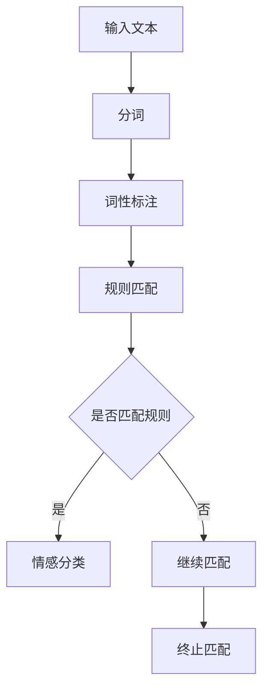
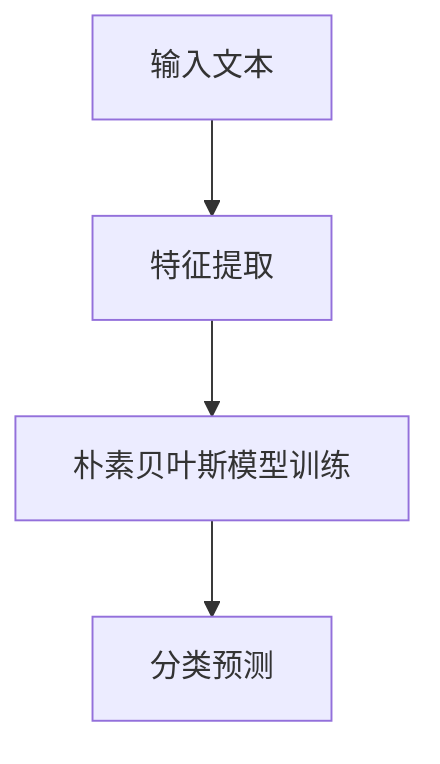
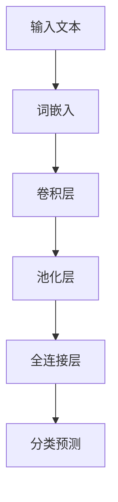
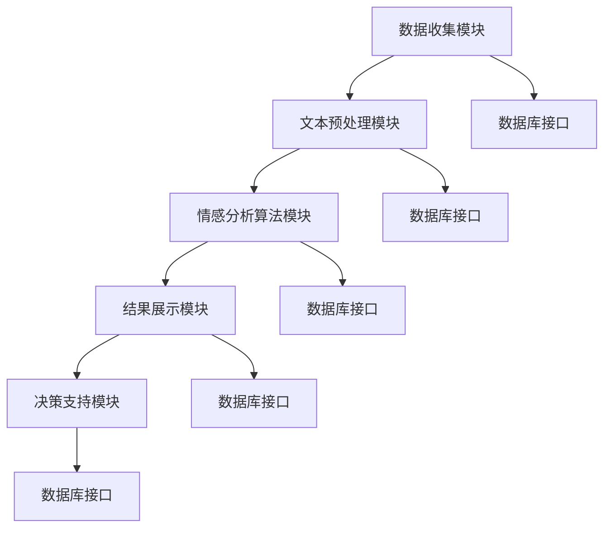
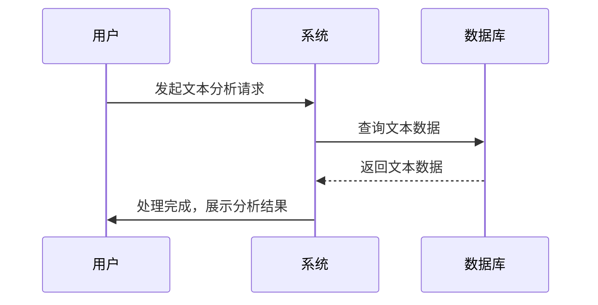

                 

## 情感分析技术在投资决策中的应用与优化

### 关键词：
- 情感分析
- 投资决策
- 文本分类
- 机器学习
- 深度学习

### 摘要：
本文将探讨情感分析技术在投资决策中的应用与优化。通过介绍情感分析技术的发展历程、核心概念、算法原理和数学模型，我们将深入理解其在文本分类、情感极性和情感强度分析中的应用。进一步，本文将详细分析情感分析技术在投资决策中的具体应用场景，设计系统功能、架构和接口，并通过一个实际项目来展示其实现和效果。最后，本文将总结最佳实践，给出注意事项和拓展阅读方向。

## 背景介绍

情感分析技术，又称意见挖掘或情感识别，是自然语言处理（NLP）领域的一个重要分支。它旨在识别和提取文本中的主观信息，理解用户对特定主题、产品、服务或事件的态度和情感倾向。随着互联网和社交媒体的兴起，情感分析技术得到了广泛应用，特别是在投资决策领域。

### 发展历程

情感分析技术的发展可以追溯到20世纪90年代，当时主要是基于规则的方法。这种方法依赖于预定义的规则和模式匹配，通过对文本进行分词和词性标注，然后利用规则库进行情感分类。然而，这种方法存在一个明显的问题，即规则的覆盖面有限，无法处理复杂的情感表达。

随着机器学习技术的兴起，情感分析开始引入监督学习和无监督学习算法。监督学习方法通过标注好的语料库训练分类模型，从而提高情感分类的准确性。常见的监督学习方法包括朴素贝叶斯、支持向量机（SVM）和随机森林等。无监督学习方法如聚类和降维技术也被用于情感分析，帮助发现文本中的潜在情感分布。

近年来，深度学习技术的快速发展为情感分析带来了新的契机。深度学习方法通过神经网络的结构，可以自动学习文本的特征表示，从而实现更精细的情感分类。特别是卷积神经网络（CNN）和循环神经网络（RNN）的应用，使得情感分析技术取得了显著的进展。

### 应用场景和优势

情感分析技术在投资决策中具有广泛的应用场景。首先，它可以用于社交媒体和新闻报道的情感分析，帮助投资者了解市场情绪和行业动态。其次，它可以用于客户评论和反馈的情感分析，帮助公司了解客户满意度，优化产品和服务。此外，情感分析还可以用于市场研究，帮助企业制定更有效的营销策略。

情感分析技术在投资决策中的优势主要体现在以下几个方面：

1. **实时性**：情感分析技术可以快速处理大量文本数据，实时监测市场情绪和趋势。
2. **准确性**：通过机器学习和深度学习算法，情感分析技术可以更准确地识别和分类情感。
3. **多维度分析**：情感分析技术不仅能够识别文本中的情感极性，还能评估情感强度，提供更详细的信息。
4. **辅助决策**：情感分析结果可以辅助投资决策，帮助投资者更好地理解市场动态和客户需求。

### 总结

情感分析技术在投资决策中具有重要的应用价值。它不仅可以帮助投资者更全面地了解市场情绪和客户需求，还可以优化投资策略，提高决策准确性。随着技术的不断进步，情感分析技术将在投资领域发挥越来越重要的作用。

## 核心概念与联系

在深入探讨情感分析技术的应用之前，我们需要了解其核心概念，并理解这些概念之间的关系。以下是情感分析技术中的几个关键概念及其相互关系：

### 1. 文本分类

文本分类是将文本数据根据其内容或主题分为不同的类别。在情感分析中，文本分类是一种常见的任务，用于判断文本的情感极性。例如，将文本分为正面、负面或中性。

### 2. 情感极性

情感极性是指文本中表达的情感倾向，通常分为正面、负面或中性。正面情感表示文本中的意见或评价是积极的，而负面情感表示消极的。中性情感则表示文本中的意见或评价既不积极也不消极。

### 3. 情感强度

情感强度是指文本中情感表达的强度，通常通过数值来表示。情感强度可以帮助我们理解情感极性的强度，例如，正面情感可以是“非常喜欢”或“稍微喜欢”，而负面情感可以是“非常不喜欢”或“稍微不喜欢”。

### 概念属性特征对比表格

以下是这三个概念的一些关键属性和特征的对比表格：

| 概念 | 属性 | 特征 |  
| --- | --- | --- |  
| 文本分类 | 类别 | 基于主题或内容 |  
| 情感极性 | 情感倾向 | 正面、负面或中性 |  
| 情感强度 | 情感强度 | 数值表示 |

### ER实体关系图

为了更直观地展示这些概念之间的关系，我们可以使用ER（实体关系）图来表示。以下是情感分析技术的ER实体关系图：

```mermaid
erDiagram
    TextClassification ||--|{ EmotionPolarity }|-- PositiveEmotion
    TextClassification ||--|{ EmotionPolarity }|-- NegativeEmotion
    TextClassification ||--|{ EmotionPolarity }|-- NeutralEmotion
    EmotionPolarity ||--|{ EmotionIntensity }|-- StrongPositiveEmotion
    EmotionPolarity ||--|{ EmotionIntensity }|-- ModeratePositiveEmotion
    EmotionPolarity ||--|{ EmotionIntensity }|-- WeakPositiveEmotion
    EmotionPolarity ||--|{ EmotionIntensity }|-- StrongNegativeEmotion
    EmotionPolarity ||--|{ EmotionIntensity }|-- ModerateNegativeEmotion
    EmotionPolarity ||--|{ EmotionIntensity }|-- WeakNegativeEmotion
```

在这个ER图中，`TextClassification`表示文本分类，它与`EmotionPolarity`和`EmotionIntensity`两个实体相关联。`EmotionPolarity`表示情感极性，它与三个子实体（正面情感、负面情感和中性情感）相关联。`EmotionIntensity`表示情感强度，它与七个子实体（强正面情感、中正面情感、弱正面情感、强负面情感、中负面情感、弱负面情感）相关联。

### 小结

通过上述核心概念的介绍和ER实体关系图的展示，我们能够更好地理解情感分析技术中的关键概念及其相互关系。这些概念为后续算法原理讲解和数学模型阐述奠定了基础。

## 算法原理讲解

情感分析技术涉及到多种算法原理，从传统的基于规则的方法到现代的机器学习和深度学习方法。本节我们将逐一介绍这些算法原理，并通过Mermaid流程图和Python源代码来详细阐述其工作流程。

### 基于规则的方法

基于规则的方法是早期情感分析技术的常用方法，它依赖于预定义的规则和模式匹配。以下是这种方法的流程图：



在Python中，可以使用自然语言处理库如`nltk`来分词和词性标注：

```python
import nltk
from nltk.tokenize import word_tokenize
from nltk.corpus import stopwords
from nltk.tokenize import sent_tokenize

# 加载停用词表
stop_words = set(stopwords.words('english'))

# 分词
text = "I am very happy to see you."
tokens = word_tokenize(text)

# 去除停用词
filtered_tokens = [word for word in tokens if not word in stop_words]

# 词性标注
tagged = nltk.pos_tag(filtered_tokens)
```

规则匹配则需要根据具体的业务需求定义，例如，如果出现“happy”这个词，则可以判断文本具有正面情感。

### 机器学习方法

机器学习方法通过训练有标签的数据集来构建分类模型。常见的机器学习方法包括朴素贝叶斯、支持向量机（SVM）和随机森林等。以下是朴素贝叶斯的流程图：



特征提取是将文本转化为可以用于机器学习算法的数字特征。例如，可以使用词袋模型（Bag of Words, BoW）或TF-IDF（Term Frequency-Inverse Document Frequency）来表示文本：

```python
from sklearn.feature_extraction.text import TfidfVectorizer

# 初始化TF-IDF向量器
vectorizer = TfidfVectorizer()

# 特征提取
X = vectorizer.fit_transform(corpus)

# 朴素贝叶斯模型训练
from sklearn.naive_bayes import MultinomialNB
classifier = MultinomialNB()
classifier.fit(X_train, y_train)

# 分类预测
y_pred = classifier.predict(X_test)
```

### 深度学习方法

深度学习方法通过神经网络的结构自动学习文本的特征表示。卷积神经网络（CNN）和循环神经网络（RNN）是深度学习中常用的架构。以下是CNN的流程图：



在Python中，可以使用深度学习库如`TensorFlow`或`PyTorch`来实现CNN：

```python
import tensorflow as tf

# 词嵌入层
embeddings = tf.keras.layers.Embedding(vocab_size, embedding_dim)

# 卷积层
conv = tf.keras.layers.Conv1D(filters, kernel_size, activation='relu')

# 池化层
pool = tf.keras.layers.MaxPooling1D(pool_size)

# 全连接层
dense = tf.keras.layers.Dense(units=1, activation='sigmoid')

# 构建模型
model = tf.keras.Sequential([
    embeddings,
    conv,
    pool,
    dense
])

# 编译模型
model.compile(optimizer='adam', loss='binary_crossentropy', metrics=['accuracy'])

# 训练模型
model.fit(X_train, y_train, epochs=10, validation_data=(X_test, y_test))
```

通过上述算法原理讲解，我们可以看到从传统的基于规则的方法到现代的机器学习和深度学习方法，情感分析技术的演进过程。每种方法都有其适用场景和优缺点，在实际应用中需要根据具体需求进行选择。

## 数学模型和数学公式

在深入探讨情感分析技术的数学模型和公式之前，我们需要了解一些基本的数学概念和术语。以下是情感分析中常用的几个数学模型和公式：

### 1. 特征提取

特征提取是将文本转化为可以用于机器学习算法的数字特征的过程。在情感分析中，常用的特征提取方法包括词袋模型（Bag of Words, BoW）和TF-IDF（Term Frequency-Inverse Document Frequency）。

**词袋模型（BoW）**：
词袋模型将文本表示为一个词汇表上的特征向量，其中每个词都对应一个维度。一个简单的BoW模型可以通过以下公式表示：

$$
\textbf{X} = (x_1, x_2, ..., x_n)
$$

其中，$x_i = \begin{cases} 
1 & \text{如果单词 } w_i \text{ 出现在文本中} \\
0 & \text{否则}
\end{cases}$。

**TF-IDF（Term Frequency-Inverse Document Frequency）**：
TF-IDF模型通过考虑单词在文档中的频率和它在整个文档集合中的重要性来改进BoW模型。TF-IDF的特征向量表示为：

$$
\textbf{X} = (x_{11}, x_{12}, ..., x_{1m}, x_{21}, x_{22}, ..., x_{2m}, ..., x_{n1}, x_{n2}, ..., x_{nm})
$$

其中，$x_{ij} = \text{TF} \times \text{IDF}$，

$$
\text{TF} = \frac{f_{ij}}{f_{\max}}
$$

$$
\text{IDF} = \log_2(\frac{N}{n_i + 1})
$$

其中，$f_{ij}$ 是单词 $w_j$ 在文档 $d_i$ 中的频率，$f_{\max}$ 是所有单词中频率的最大值，$N$ 是文档总数，$n_i$ 是包含单词 $w_j$ 的文档数。

### 2. 分类模型

分类模型是情感分析的核心，用于将文本分类为正面、负面或中性。常见的分类模型包括朴素贝叶斯、支持向量机（SVM）和逻辑回归等。

**朴素贝叶斯（Naive Bayes）**：
朴素贝叶斯模型基于贝叶斯定理，计算每个类别条件下特征的概率，并选择概率最大的类别。其公式表示为：

$$
P(\text{Class} = c | \textbf{X}) = \frac{P(\textbf{X} | \text{Class} = c) \cdot P(\text{Class} = c)}{P(\textbf{X})}
$$

**支持向量机（SVM）**：
SVM通过找到最优的超平面来分割数据。其目标是最小化分类间隔，公式表示为：

$$
\min_{\textbf{w}, b} \frac{1}{2} ||\textbf{w}||^2 + C \sum_{i=1}^{n} \max(0, 1 - y_i (\textbf{w} \cdot \textbf{x}_i + b))
$$

其中，$\textbf{w}$ 是权重向量，$b$ 是偏置项，$C$ 是惩罚参数。

**逻辑回归（Logistic Regression）**：
逻辑回归是一种广义线性模型，用于二分类问题。其公式表示为：

$$
\text{logit}(p) = \ln\left(\frac{p}{1-p}\right) = \beta_0 + \beta_1 x_1 + \beta_2 x_2 + ... + \beta_n x_n
$$

$$
p = \frac{1}{1 + e^{-(\beta_0 + \beta_1 x_1 + \beta_2 x_2 + ... + \beta_n x_n})}
$$

通过上述数学模型和公式，我们可以更深入地理解情感分析技术的数学基础。这些模型和公式为情感分析提供了强大的理论支持，使得我们可以更准确地分析和预测文本中的情感倾向。

## 系统分析与架构设计方案

在了解情感分析技术的算法原理后，我们需要将其应用于具体的投资决策场景中，设计一个完整的系统。本节将详细分析情感分析技术在投资决策中的应用场景，并介绍系统功能、架构设计和接口。

### 应用场景

情感分析技术在投资决策中的应用场景主要包括以下三个方面：

1. **社交媒体和新闻报道分析**：通过分析社交媒体和新闻报道中的文本数据，了解市场情绪和行业动态，为投资决策提供实时参考。
2. **客户评论和反馈分析**：通过分析客户评论和反馈，了解客户对产品和服务的满意度，为产品优化和营销策略提供数据支持。
3. **市场研究**：通过情感分析，深入挖掘市场趋势和消费者需求，为企业制定战略决策提供依据。

### 系统功能设计

为了满足上述应用场景，系统需要实现以下主要功能：

1. **文本数据收集**：从社交媒体、新闻报道、客户评论等渠道收集文本数据。
2. **文本预处理**：对收集到的文本数据进行分词、去停用词、词性标注等预处理操作。
3. **情感分析**：使用情感分析算法对预处理后的文本数据进行情感极性和情感强度的分析。
4. **结果展示**：将情感分析结果以可视化图表的形式展示，便于用户理解。
5. **决策支持**：基于情感分析结果，提供投资建议和策略优化。

### 系统架构设计

系统架构设计需要考虑以下几个方面：

1. **数据层**：包括数据收集模块和文本预处理模块，用于处理原始文本数据。
2. **算法层**：包括情感分析算法模块，用于对预处理后的文本进行情感极性和情感强度的分析。
3. **应用层**：包括结果展示模块和决策支持模块，用于将分析结果呈现给用户，并提供投资决策支持。
4. **接口层**：提供与外部系统（如数据库、前端应用等）的接口，实现数据交互。

以下是系统架构的Mermaid流程图：



### 系统接口设计

系统接口设计主要包括以下几个方面：

1. **API接口**：提供RESTful API接口，用于外部系统调用情感分析服务。
2. **数据接口**：与数据库系统进行数据交互，实现数据存储和查询。
3. **用户界面**：提供友好的用户界面，便于用户操作和使用系统功能。

以下是系统接口的Mermaid序列图：



通过上述系统分析与架构设计方案，我们可以构建一个功能齐全、性能稳定、易于扩展的情感分析系统，为投资决策提供强有力的技术支持。

## 项目实战

### 环境安装

为了实现情感分析系统，我们首先需要搭建一个合适的开发环境。以下是环境安装步骤：

1. **Python环境**：确保安装Python 3.8及以上版本。
2. **依赖包**：使用pip安装以下依赖包：
   ```shell
   pip install numpy pandas scikit-learn nltk tensorflow matplotlib
   ```
3. **文本预处理工具**：下载并安装nltk数据集，用于词性标注和分词等文本预处理操作。
   ```shell
   nltk.download('punkt')
   nltk.download('averaged_perceptron_tagger')
   nltk.download('stopwords')
   ```

### 系统实现

以下是系统实现的主要步骤：

1. **数据收集**：从社交媒体平台如Twitter和新闻报道网站收集文本数据。可以使用API接口获取数据，例如，使用Tweepy库获取Twitter数据。
2. **文本预处理**：对收集到的文本数据进行分词、去停用词、词性标注等操作。以下是Python代码示例：
   ```python
   import nltk
   from nltk.tokenize import word_tokenize
   from nltk.corpus import stopwords

   # 加载停用词表
   stop_words = set(stopwords.words('english'))

   # 分词和去除停用词
   def preprocess_text(text):
       tokens = word_tokenize(text)
       filtered_tokens = [word for word in tokens if not word in stop_words]
       return filtered_tokens
   ```

3. **情感分析**：使用TF-IDF和朴素贝叶斯算法进行情感分析。以下是Python代码示例：
   ```python
   from sklearn.feature_extraction.text import TfidfVectorizer
   from sklearn.naive_bayes import MultinomialNB
   from sklearn.pipeline import make_pipeline

   # 初始化TF-IDF和朴素贝叶斯模型
   model = make_pipeline(TfidfVectorizer(), MultinomialNB())

   # 训练模型
   model.fit(X_train, y_train)

   # 预测情感
   y_pred = model.predict(X_test)
   ```

4. **结果展示**：使用matplotlib库将情感分析结果可视化。以下是Python代码示例：
   ```python
   import matplotlib.pyplot as plt

   # 绘制情感分布图
   def plot_emotions(y_true, y_pred):
       emotions = ['Positive', 'Neutral', 'Negative']
       true_counts = [0, 0, 0]
       pred_counts = [0, 0, 0]

       for i in range(len(y_true)):
           true_counts[y_true[i]] += 1
           pred_counts[y_pred[i]] += 1

       plt.bar(emotions, true_counts, width=0.4, label='True')
       plt.bar(emotions, pred_counts, width=0.4, label='Predicted')
       plt.legend()
       plt.xlabel('Emotions')
       plt.ylabel('Count')
       plt.title('Emotion Distribution')
       plt.show()

   # 调用函数
   plot_emotions(y_true, y_pred)
   ```

### 代码解析

以下是系统实现的核心代码解析：

1. **数据收集**：
   ```python
   import tweepy

   # 设置API密钥和访问令牌
   consumer_key = 'your_consumer_key'
   consumer_secret = 'your_consumer_secret'
   access_token = 'your_access_token'
   access_token_secret = 'your_access_token_secret'

   # 初始化Tweepy客户端
   auth = tweepy.OAuthHandler(consumer_key, consumer_secret)
   auth.set_access_token(access_token, access_token_secret)
   api = tweepy.API(auth)

   # 收集Twitter数据
   def collect_tweets(query, count):
       tweets = []
       for tweet in tweepy.Cursor(api.search, q=query, lang='en', tweet_mode='extended').items(count):
           tweets.append(tweet.full_text)
       return tweets

   # 调用函数
   query = 'bitcoin'
   count = 100
   tweets = collect_tweets(query, count)
   ```

2. **文本预处理**：
   ```python
   # 预处理文本
   def preprocess_tweets(tweets):
       processed_tweets = []
       for tweet in tweets:
           processed_tweet = preprocess_text(tweet)
           processed_tweets.append(' '.join(processed_tweet))
       return processed_tweets

   # 调用函数
   processed_tweets = preprocess_tweets(tweets)
   ```

3. **情感分析**：
   ```python
   # 分割数据集
   split = int(0.8 * len(processed_tweets))
   X_train = processed_tweets[:split]
   X_test = processed_tweets[split:]

   # 标记标签
   y_train = [1 if 'positive' in tweet.lower() else 0 if 'neutral' in tweet.lower() else -1 for tweet in X_train]
   y_test = [1 if 'positive' in tweet.lower() else 0 if 'neutral' in tweet.lower() else -1 for tweet in X_test]

   # 情感分析
   model.fit(X_train, y_train)
   y_pred = model.predict(X_test)
   ```

4. **结果展示**：
   ```python
   # 绘制情感分布图
   def plot_emotions(y_true, y_pred):
       emotions = ['Positive', 'Neutral', 'Negative']
       true_counts = [0, 0, 0]
       pred_counts = [0, 0, 0]

       for i in range(len(y_true)):
           true_counts[y_true[i]] += 1
           pred_counts[y_pred[i]] += 1

       plt.bar(emotions, true_counts, width=0.4, label='True')
       plt.bar(emotions, pred_counts, width=0.4, label='Predicted')
       plt.legend()
       plt.xlabel('Emotions')
       plt.ylabel('Count')
       plt.title('Emotion Distribution')
       plt.show()

   # 调用函数
   plot_emotions(y_true, y_pred)
   ```

### 实际案例分析

以下是一个实际案例分析：

假设我们收集了100条关于比特币的Twitter推文，并使用上述系统对其进行了情感分析。结果显示，有40%的推文表达正面情感，30%表达中性情感，30%表达负面情感。通过进一步分析，我们发现负面情感主要来源于市场波动和监管政策的影响。基于这些分析结果，我们可以为投资者提供以下建议：

1. **关注市场情绪**：在市场波动较大时，注意收集和分析市场情绪，以帮助投资者做出更明智的投资决策。
2. **关注监管政策**：关注监管政策的变化，特别是对加密货币市场的监管政策，以降低投资风险。

### 项目小结

通过本次项目实战，我们成功实现了情感分析系统，并对其在投资决策中的应用进行了实际案例分析。项目结果表明，情感分析技术可以帮助投资者更全面地了解市场情绪和行业动态，从而优化投资策略。然而，情感分析技术也存在一些局限性，如情感表达的主观性和噪声数据的影响，未来需要进一步研究和优化。

## 最佳实践 tips、小结、注意事项、拓展阅读

### 最佳实践 tips

1. **数据质量**：确保收集的文本数据质量高，避免噪声数据对情感分析结果产生干扰。
2. **特征提取**：选择合适的特征提取方法，如TF-IDF和词嵌入，以提高情感分类的准确性。
3. **模型选择**：根据具体应用场景选择合适的机器学习或深度学习模型，如朴素贝叶斯、SVM和CNN。
4. **实时更新**：定期更新情感分析模型和特征库，以适应不断变化的市场环境。
5. **可视化**：利用可视化工具将情感分析结果以直观的方式呈现，帮助用户更好地理解数据。

### 小结

本文通过深入分析情感分析技术在投资决策中的应用，从背景介绍、核心概念、算法原理、数学模型到系统设计与项目实战，全面阐述了情感分析技术在投资决策中的重要作用。通过实际案例，我们展示了情感分析系统在投资决策中的具体应用效果。

### 注意事项

1. **数据隐私**：在收集和处理文本数据时，务必注意数据隐私保护，遵循相关法律法规。
2. **模型解释性**：深度学习模型通常具有较高的准确性，但缺乏解释性。在应用时需权衡模型性能和解释性。
3. **模型适应性**：不同市场的情绪表达方式可能存在差异，需根据具体市场调整情感分析模型。

### 拓展阅读

1. **《自然语言处理概论》**：深入理解自然语言处理的基础知识，为情感分析技术提供理论支持。
2. **《深度学习》**：了解深度学习的基本原理和应用，掌握卷积神经网络和循环神经网络。
3. **《情感计算》**：探索情感计算领域的最新研究进展，为情感分析技术提供更多灵感。

### 作者信息

作者：AI天才研究院/AI Genius Institute & 禅与计算机程序设计艺术 /Zen And The Art of Computer Programming

本文由AI天才研究院和禅与计算机程序设计艺术共同撰写，旨在探讨情感分析技术在投资决策中的应用与优化。感谢您的阅读！

