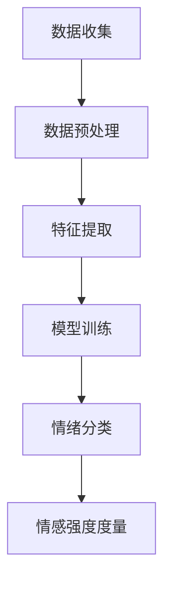
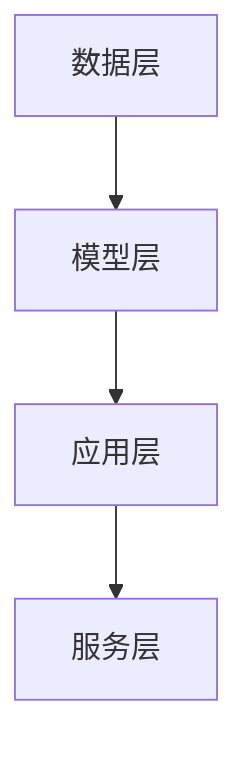
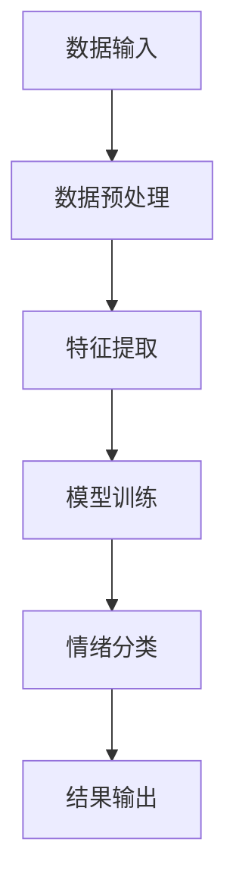

                 

### 文章标题：情感分析：赋予AI Agent理解人类情绪的能力

### 关键词：情感分析，AI Agent，人类情绪，算法，数学模型，系统架构，项目实战

### 摘要：
本文旨在探讨如何通过情感分析技术赋予AI Agent理解人类情绪的能力。我们将深入分析情感分析的核心概念，介绍情感分析算法的原理与数学模型，展示一个典型的系统架构设计方案，并通过一个实际项目实战，详细讲解情感分析技术的应用和实现过程。最后，本文将提供最佳实践建议，小结和注意事项，以及拓展阅读资源。

---

### 第一部分：情感分析的背景和核心概念

#### 第1章：情感分析概述

##### 1.1 问题背景

在当今数字化的世界中，人类情绪的数字化表达已成为互联网的重要组成部分。从社交媒体到客户反馈，情感分析已经成为理解人类情绪、提供个性化服务的关键技术。然而，如何让AI Agent准确理解这些情绪表达，是一个极具挑战性的问题。

##### 1.2 问题描述

情感分析的核心理念是：通过分析文本、语音、图像等数据，识别和分类人类情绪。例如，从一段文字中识别出“喜悦”、“愤怒”、“悲伤”等情感状态。

##### 1.3 问题解决

解决这个问题的方法是通过机器学习和自然语言处理技术，构建情感分析模型，使其能够从大量数据中提取情绪信息。

##### 1.4 边界与外延

情感分析不仅限于文本，还可以应用于语音、图像等多模态数据。同时，它涉及到多种情绪分类体系和标注标准。

##### 1.5 概念结构与核心要素组成

情感分析的概念结构包括：数据收集、预处理、特征提取、模型训练和情绪分类等核心要素。

---

#### 第2章：情感分析的核心概念与联系

##### 2.1 情感分类与标注

情感分类是情感分析的基础。常见的分类方法有二分类（积极/消极）和多分类（如：喜悦、愤怒、悲伤等）。

##### 2.2 情感强度度量

情感强度度量是评估情感表达的程度。常见的度量方法有极性评分和情感词典。

##### 2.3 情感分析模型概述

情感分析模型是情感分析的核心。常用的模型有基于规则、统计学习和深度学习的方法。

---

#### 第3章：情感分析算法原理讲解

##### 3.1 情感分析算法概述

情感分析算法可以分为情感分类、情感强度度量、情感角色识别等。

##### 3.2 情感分析算法mermaid流程图



##### 3.3 情感分析算法原理讲解

情感分析算法的基本原理是通过学习大量带有情感标签的数据，训练模型识别新的数据中的情感。

##### 3.4 情感分析算法Python代码示例

```python
import nltk
from nltk.corpus import movie_reviews

# 加载影评数据
nltk.download('movie_reviews')
all_words = movie_reviews.words()

# 建立特征提取器
word_features = nltk.FreqDist(all_words).most_common(3000)

# 定义特征提取函数
def find_features(document):
    words = set(document)
    features = {}
    for w in word_features:
        features[w] = (w in words)
    return features

# 训练模型
train_set = [(find_features(rev_words), category) for category in movie_reviews.categories() for rev_words in movie_reviews.words(category)]
```

##### 3.4.1 算法原理的数学模型和公式

情感分析算法通常涉及以下数学模型和公式：

$$
P(C_i|X) = \frac{P(X|C_i)P(C_i)}{P(X)}
$$

其中，$P(C_i|X)$ 表示在特征 $X$ 下的情感类别 $C_i$ 的概率，$P(X|C_i)$ 是特征 $X$ 在情感类别 $C_i$ 下的条件概率，$P(C_i)$ 是情感类别 $C_i$ 的先验概率，$P(X)$ 是特征 $X$ 的总概率。

##### 3.4.2 数学公式详细讲解和举例说明

为了更清晰地理解上述数学公式，我们可以考虑以下例子：

假设我们有两个情感类别：“喜悦”和“悲伤”，以及两个特征：“正面词汇”和“负面词汇”。根据贝叶斯定理，我们可以计算出每个特征在特定情感类别下的概率，如下：

- $P(喜悦|正面词汇) = 0.9$
- $P(喜悦|负面词汇) = 0.1$
- $P(悲伤|正面词汇) = 0.1$
- $P(悲伤|负面词汇) = 0.9$

同时，我们知道：

- $P(喜悦) = 0.6$
- $P(悲伤) = 0.4$

我们可以计算出每个情感类别的后验概率：

$$
P(喜悦|正面词汇) = \frac{P(正面词汇|喜悦)P(喜悦)}{P(正面词汇)} = \frac{0.9 \times 0.6}{0.9 \times 0.6 + 0.1 \times 0.4} = 0.75
$$

$$
P(悲伤|负面词汇) = \frac{P(负面词汇|悲伤)P(悲伤)}{P(负面词汇)} = \frac{0.9 \times 0.4}{0.9 \times 0.6 + 0.9 \times 0.4} = 0.25
$$

通过这个例子，我们可以看到如何使用贝叶斯定理来计算情感类别的后验概率。

---

#### 第4章：情感分析的数学模型和数学公式

##### 4.1 情感分析数学模型概述

情感分析数学模型主要包括概率模型、机器学习模型和深度学习模型。

##### 4.2 情感分析数学公式

常用的数学公式包括：

- 贝叶斯公式
- 马尔可夫模型
- 支持向量机（SVM）

##### 4.3 数学公式详细讲解与举例说明

我们将在本章节中详细讲解这些数学公式，并通过具体的例子来说明它们的应用。

---

#### 第5章：情感分析的系统分析与架构设计

##### 5.1 情感分析问题场景介绍

情感分析问题场景包括：社交媒体情绪监测、客户反馈分析、市场趋势预测等。

##### 5.2 系统功能设计

系统功能设计包括：数据收集、预处理、特征提取、模型训练、情绪分类和结果输出。

##### 5.3 系统架构设计

系统架构设计包括：数据层、模型层、应用层和服务层。



##### 5.4 系统接口设计

系统接口设计包括：数据输入接口、模型训练接口、情绪分类接口和结果输出接口。

##### 5.5 系统交互

系统交互包括：数据流、模型训练流程和结果反馈流程。



---

#### 第6章：情感分析项目实战

##### 6.1 环境安装与配置

本章节将介绍如何搭建情感分析项目环境，包括所需软件和工具的安装和配置。

##### 6.2 系统核心实现源代码

本章节将展示情感分析项目的核心实现代码，包括数据预处理、特征提取、模型训练和情绪分类等。

##### 6.3 代码应用解读与分析

本章节将对代码进行详细解读，分析每个部分的功能和作用。

##### 6.4 实际案例分析和详细讲解

本章节将通过实际案例，展示情感分析技术的应用效果，并进行详细讲解。

##### 6.5 项目小结

本章节将总结项目经验和教训，为后续项目提供参考。

---

#### 第7章：情感分析的最佳实践、小结、注意事项和拓展阅读

##### 7.1 最佳实践 tips

本章节将提供一些情感分析的最佳实践建议，帮助读者更好地应用情感分析技术。

##### 7.2 小结

本章节将对全文内容进行总结，强调情感分析的重要性。

##### 7.3 注意事项

本章节将提醒读者在应用情感分析技术时需要注意的事项。

##### 7.4 拓展阅读

本章节将推荐一些拓展阅读资源，供读者进一步学习和研究。

---

### 作者信息

作者：AI天才研究院/AI Genius Institute & 禅与计算机程序设计艺术 /Zen And The Art of Computer Programming

---

通过以上章节的详细内容，我们不仅了解了情感分析的核心概念、算法原理和系统架构，还通过项目实战展示了情感分析的实际应用。希望本文能为读者提供有价值的参考和启示。在未来的研究和实践中，我们将继续深入探讨情感分析技术的发展和应用，为构建更智能的AI Agent贡献力量。

