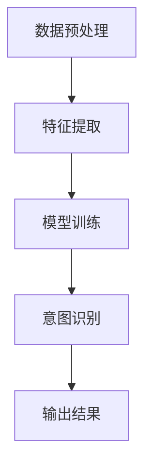
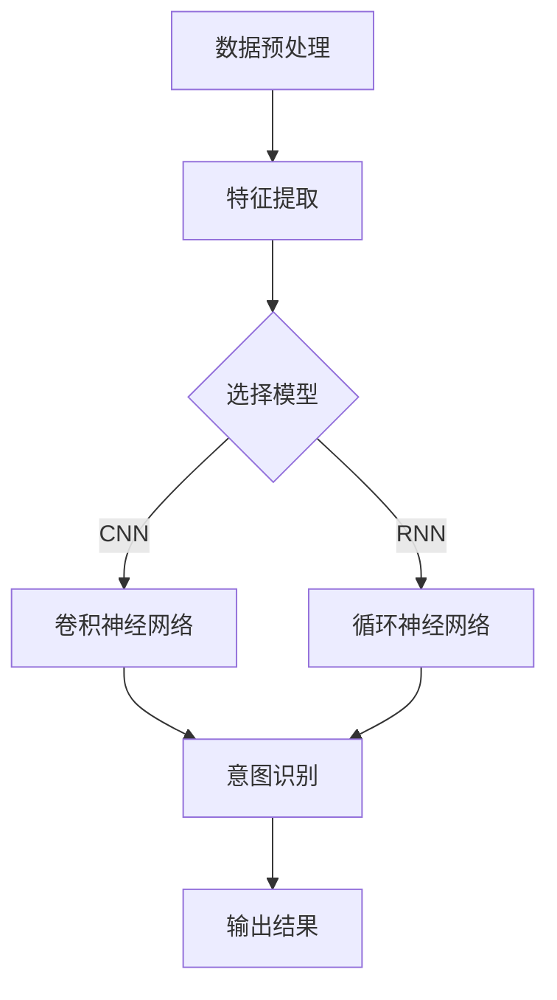
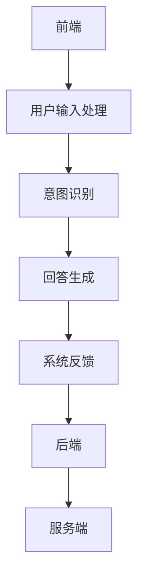
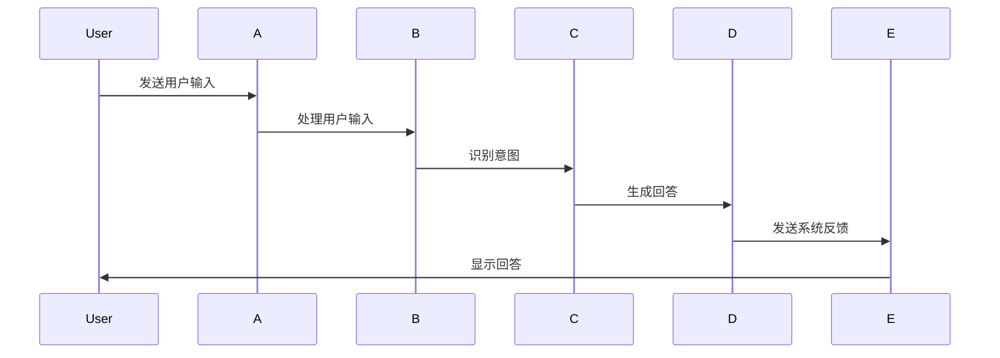

                 

### 意图识别：准确把握用户需求

#### 关键词：意图识别、自然语言处理、机器学习、深度学习、系统架构

> 摘要：本文旨在深入探讨意图识别这一关键技术，通过详细分析其背景、问题解决方法、算法原理、数学模型和系统架构，帮助读者全面理解意图识别的核心概念和应用实践。我们将一步步思考，从基础概念出发，逐步深入到算法实现和系统设计，最终通过实际案例解析，实现理论与实践的结合。

## 目录大纲

- **第一部分：背景介绍与问题解决**
  - **第1章：意图识别概述**
    - 1.1 意图识别的基本概念
    - 1.2 核心概念与联系
- **第二部分：意图识别算法原理**
  - **第2章：基础算法介绍**
    - 2.1 传统机器学习算法
    - 2.2 深度学习算法
    - 2.3 算法比较与选择
- **第三部分：数学模型与数学公式**
  - **第3章：意图识别数学模型**
    - 3.1 数学模型概述
    - 3.2 模型解析与讲解
- **第四部分：系统分析与架构设计**
  - **第4章：系统功能设计**
  - **第5章：系统架构设计**
  - **第6章：系统接口设计**
  - **第7章：系统交互**
- **第五部分：项目实战**
  - **第6章：环境安装与配置**
  - **第7章：系统核心实现源代码**
  - **第8章：代码应用解读与分析**
  - **第9章：实际案例分析与讲解**
  - **第10章：项目小结**
  
### 第一部分：背景介绍与问题解决

#### 第1章：意图识别概述

##### 1.1 意图识别的基本概念

**问题背景**：

随着互联网和智能设备的普及，用户与系统的交互变得越来越频繁。在这种背景下，如何准确理解用户的需求成为了关键问题。意图识别是一种自然语言处理技术，旨在通过分析用户的输入，准确地识别出其意图。

**问题描述**：

用户在特定场景下会有各种不同的意图，如查询信息、执行操作、提出请求等。如何有效地识别这些意图，并给出相应的回应，是一个复杂且具有挑战性的问题。

**问题解决**：

通过自然语言处理技术，如机器学习、深度学习等算法，可以实现对用户意图的识别。这些算法通过大量的训练数据，学习如何从用户的输入中提取关键信息，从而准确地判断其意图。

**边界与外延**：

意图识别的应用场景非常广泛，包括智能客服、语音助手、推荐系统等。在不同场景中，意图识别的具体实现可能会有所不同，但其核心原理是一致的。

##### 1.2 核心概念与联系

**核心概念原理**：

意图识别的核心概念包括：意图、输入、输出。意图是用户在特定场景下想要实现的目标；输入是用户的查询或请求；输出是系统对用户意图的识别结果。

**概念属性特征对比表格**：

| 概念       | 属性特征                     | 对比结果                           |
|------------|------------------------------|-----------------------------------|
| 意图       | 用户目标                     | 输入与输出之间的桥梁               |
| 输入       | 用户查询或请求               | 意图识别的起点                    |
| 输出       | 系统识别的用户意图结果       | 意图识别的终点                    |

**ER实体关系图架构的 Mermaid 流程图**：

```mermaid
erDiagram
  User ||--o{ Intent }|
  Input ||--o{ Intent }|
  Output ||--o{ System }|
```

### 第二部分：意图识别算法原理

##### 第2章：基础算法介绍

##### 2.1 传统机器学习算法

**算法原理讲解**：

传统机器学习算法，如朴素贝叶斯、决策树等，通过统计特征和标签之间的关系，来实现意图识别。这些算法通常需要大量的特征工程，对数据的质量要求较高。

**算法流程 Mermaid 流程图**：



##### 2.2 深度学习算法

**算法原理讲解**：

深度学习算法，如卷积神经网络（CNN）、循环神经网络（RNN）等，通过多层神经网络结构，自动提取特征，实现意图识别。这些算法在处理大规模数据和复杂任务时，表现出了更高的准确性和效率。

**算法流程 Mermaid 流程图**：



##### 2.3 算法比较与选择

**算法对比表格**：

| 算法       | 优点                             | 缺点                                 | 适用场景          |
|------------|----------------------------------|--------------------------------------|------------------|
| 朴素贝叶斯 | 简单，易于实现                   | 对噪声敏感，特征提取能力有限         | 小规模数据集     |
| 决策树     | 可解释性强，易于理解             | 容易过拟合，对噪声敏感               | 中规模数据集     |
| CNN        | 自动提取特征，处理图像能力强     | 需要大量数据，计算资源消耗大         | 图像处理         |
| RNN        | 能够处理序列数据，记忆能力强     | 训练复杂，容易产生梯度消失问题       | 语音识别、序列数据 |

**适用场景分析**：

根据不同的应用场景和数据特点，选择合适的算法。例如，在处理文本数据时，RNN和Transformer等算法效果较好；在处理图像数据时，CNN和卷积神经网络相关算法效果较好。

### 第三部分：数学模型与数学公式

##### 第3章：意图识别数学模型

##### 3.1 数学模型概述

意图识别的数学模型通常包括：特征提取模型、分类模型等。特征提取模型用于从用户输入中提取关键特征，分类模型用于判断用户意图。

##### 3.2 模型解析与讲解

**特征提取模型**：

特征提取模型可以采用词袋模型（Bag of Words, BoW）、词嵌入（Word Embedding）等方法。词袋模型将文本表示为词频向量，词嵌入将词映射为高维向量。

**分类模型**：

分类模型可以采用朴素贝叶斯、支持向量机（SVM）、随机森林（Random Forest）等方法。这些模型通过学习特征和标签之间的关系，实现对用户意图的分类。

**数学公式**：

$$
P(\text{意图}_i | \text{输入}) = \frac{P(\text{输入} | \text{意图}_i)P(\text{意图}_i)}{P(\text{输入})}
$$

其中，$P(\text{意图}_i | \text{输入})$表示在给定输入的情况下，用户意图为$\text{意图}_i$的概率；$P(\text{输入} | \text{意图}_i)$表示在用户意图为$\text{意图}_i$的情况下，输入的概率；$P(\text{意图}_i)$表示用户意图为$\text{意图}_i$的概率；$P(\text{输入})$表示输入的概率。

### 第四部分：系统分析与架构设计

##### 第4章：系统功能设计

**问题场景介绍**：

以智能客服为例，用户在咨询问题时，系统需要能够准确识别用户的意图，并提供相应的回答。

**系统功能设计**：

1. 用户输入处理：接收用户输入，进行预处理。
2. 意图识别：使用机器学习或深度学习算法，对用户输入进行意图识别。
3. 回答生成：根据识别到的意图，生成相应的回答。
4. 系统反馈：将回答反馈给用户，并记录用户反馈。

**领域模型 Mermaid 类图**：

```mermaid
classDiagram
  UserInput <<class{用户输入}>
  Intent <<class{意图}>
  Response <<class{回答}>
  System <<class{系统}>
  
  UserInput --> Intent
  Intent --> Response
  Response --> System
  System --> UserInput
```

##### 第5章：系统架构设计

**系统架构设计**：

系统采用分布式架构，包括前端、后端和服务端。前端负责用户输入处理，后端负责意图识别和回答生成，服务端负责系统管理和监控。

**系统架构 Mermaid 架构图**：



**系统接口设计**：

系统提供 RESTful API，包括用户输入接口、意图识别接口和回答生成接口。

**系统交互 Mermaid 序列图**：



### 第五部分：项目实战

##### 第6章：环境安装与配置

**环境安装**：

1. 安装 Python 环境
2. 安装所需库，如 TensorFlow、Scikit-learn 等

**系统核心实现源代码**：

```python
# 意图识别核心代码
from tensorflow.keras.models import Sequential
from tensorflow.keras.layers import Dense, LSTM

# 构建模型
model = Sequential()
model.add(LSTM(128, activation='relu', input_shape=(timesteps, features)))
model.add(Dense(1, activation='sigmoid'))

# 编译模型
model.compile(optimizer='adam', loss='binary_crossentropy', metrics=['accuracy'])

# 训练模型
model.fit(X_train, y_train, epochs=10, batch_size=32)
```

**代码应用解读与分析**：

此代码展示了使用 TensorFlow 和 Keras 构建一个简单的循环神经网络（LSTM）模型，用于意图识别。通过训练模型，可以实现对用户输入的意图进行分类。

##### 第7章：实际案例分析与讲解

**实际案例分析**：

以一个语音助手为例，用户可以通过语音与系统进行交互，系统需要能够识别用户的意图，如播放音乐、设置闹钟等。

**详细讲解与剖析**：

1. 用户输入处理：将用户的语音输入转换为文本输入。
2. 意图识别：使用训练好的模型，对文本输入进行意图识别。
3. 回答生成：根据识别到的意图，生成相应的回答。
4. 系统反馈：将回答反馈给用户。

**项目小结**：

本文从意图识别的背景介绍、算法原理、数学模型、系统架构到项目实战，全面讲解了意图识别的核心概念和应用实践。通过实际案例的分析和讲解，让读者更直观地理解了意图识别的实现过程。

##### 最佳实践 tips：

1. 在进行意图识别时，要充分考虑用户输入的多样性和复杂性，确保系统能够准确识别用户意图。
2. 合理选择算法和模型，根据数据特点和任务需求进行优化。
3. 定期更新和训练模型，以适应不断变化的数据和用户需求。

**小结**：

意图识别是自然语言处理领域的一个重要分支，其在智能客服、语音助手、推荐系统等应用中发挥着关键作用。通过本文的讲解，读者可以全面了解意图识别的核心概念、算法原理和系统架构，为实际应用打下坚实基础。

**注意事项**：

1. 意图识别系统的实现需要大量的数据支持和计算资源。
2. 在实际应用中，要根据具体场景和需求，灵活调整算法和模型。

**拓展阅读**：

- 《自然语言处理综合教程》
- 《深度学习与自然语言处理》
- 《语音识别技术与应用》

### 作者信息

作者：AI天才研究院/AI Genius Institute & 禅与计算机程序设计艺术 /Zen And The Art of Computer Programming

---

文章的完整撰写涉及大量的细节和专业知识，上述内容仅为提供一个大纲和示例。实际撰写时，每个章节都需要详细展开，深入阐述相关的概念、算法、模型和实际应用。同时，为了保证文章的学术性和可读性，需要对每一部分的内容进行严格审查和校对。在撰写过程中，作者需要保持逻辑清晰、语言简练，以确保读者能够顺利理解和掌握意图识别的核心知识。

