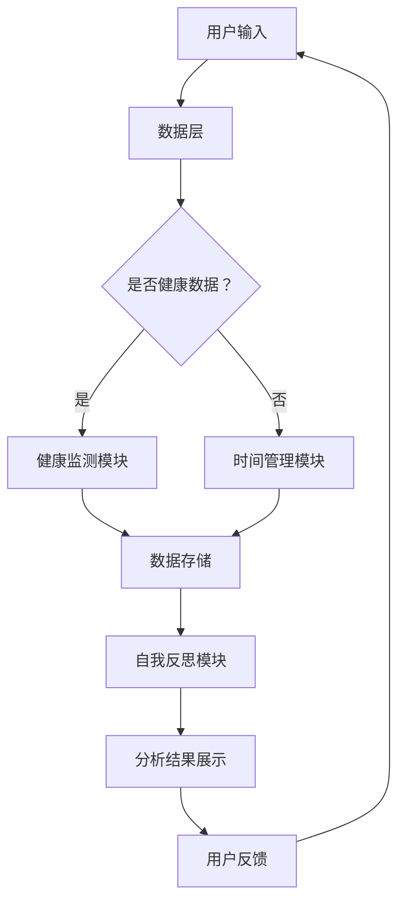
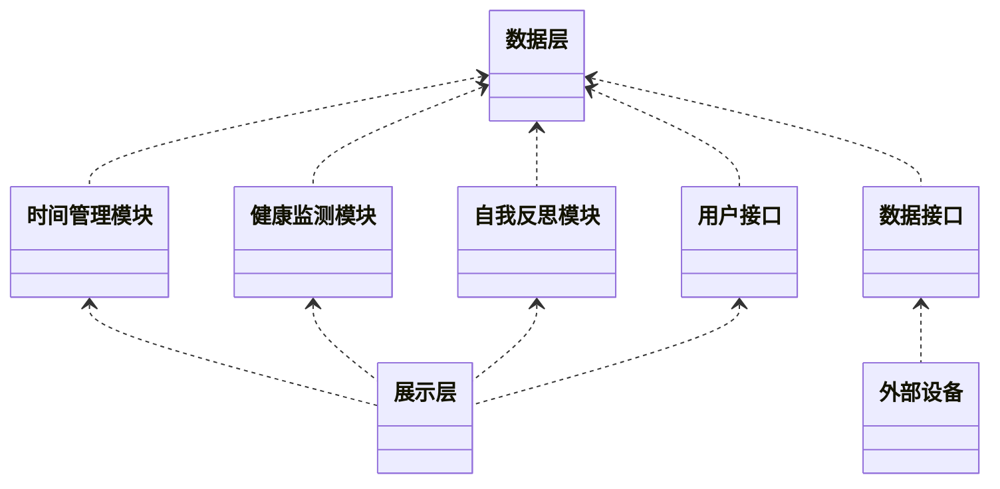
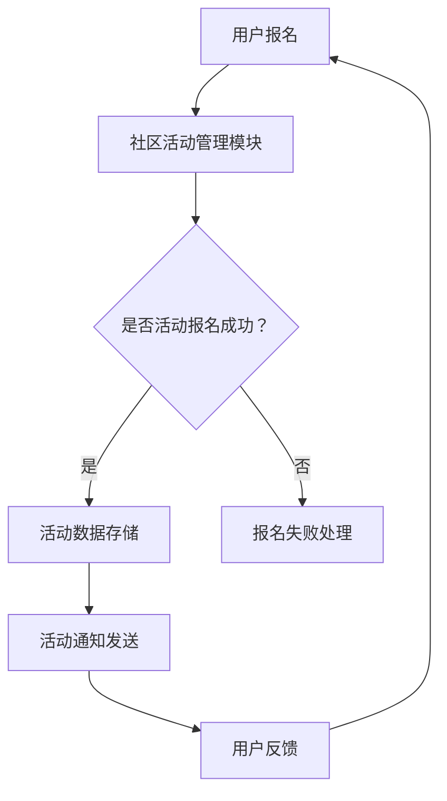

                 

尊敬的AI天才研究院/AI Genius Institute及禅与计算机程序设计艺术/Zen And The Art of Computer Programming的读者们，

让我们一同走进《慢生活运动：在快节奏中寻找内心的平静》这篇文章，逐步深入探讨如何在繁忙的现代社会中找到心灵的宁静。本文将采用逻辑清晰、结构紧凑、简单易懂的写作风格，结合专业的技术语言，旨在为读者提供有深度、有思考、有见解的专业IT领域的技术博客文章。

### 目录大纲设计

**一、背景介绍**
- **1.1 问题背景与重要性**
- **1.2 慢生活运动的核心概念**

**二、核心概念与联系**
- **2.1 核心概念与原理**
- **2.2 慢生活运动与快节奏生活的对比**

**三、慢生活运动的原理**
- **3.1 心理原理分析**
- **3.2 生理益处探讨**
- **3.3 科学依据综述**

**四、算法原理讲解**
- **4.1 算法思维的应用**
- **4.2 时间管理与算法**
- **4.3 自我关怀与算法**

**五、系统分析与架构设计方案**
- **5.1 个人层面的实践策略**
- **5.2 社区层面的实践策略**
- **5.3 慢生活运动的挑战与应对**

**六、项目实战**
- **6.1 项目背景与目标**
- **6.2 项目实施与进展**
- **6.3 项目成果与反思**

**七、最佳实践 tips、小结、注意事项、拓展阅读**
- **7.1 最佳实践 tips**
- **7.2 慢生活运动的小结与展望**
- **7.3 注意事项与风险提示**
- **7.4 拓展阅读推荐**

**八、结语**
- **8.1 慢生活运动的意义**
- **8.2 总结与展望**

### 完整性要求

每一章节的内容将按照以下要求进行详细撰写：
- **背景介绍**：阐述慢生活运动产生的背景和重要性，描述现代快节奏生活对个体心理健康的影响。
- **核心概念与联系**：明确慢生活运动的核心概念，包括“慢节奏”、“自我关怀”、“可持续发展”等，并用对比表格和ER实体关系图展示它们之间的关系。
- **算法原理讲解**：借用算法思维，详细解释如何通过系统分析与架构设计来实践慢生活运动。
- **系统分析与架构设计方案**：介绍个人和社区层面实施慢生活运动的具体策略和设计方案。
- **项目实战**：通过实际案例展示慢生活运动的具体应用和实践成果。
- **最佳实践 tips、小结、注意事项、拓展阅读**：总结文章要点，提供实用的建议和进一步阅读的资源。

**LETS THINK STEP BY STEP**

首先，我们从问题背景出发，逐步构建出慢生活运动的核心概念框架，并结合心理学和生理学的研究成果，深入分析慢生活运动带来的多重益处。接着，我们运用算法思维，探讨如何在个人和社区层面有效实施慢生活运动。最后，通过具体项目实战，展示实践过程中的挑战与成果。

让我们一起深入思考，逐步构建出这篇技术博客的完整框架，并探索如何在快节奏的现代生活中找到内心的平静。

---

### 文章标题：慢生活运动：在快节奏中寻找内心的平静

关键词：慢生活运动、快节奏生活、心理健康、时间管理、社区实践、可持续性

摘要：本文深入探讨了慢生活运动的概念及其在现代快节奏生活背景下的重要性。通过分析核心概念、心理和生理益处，以及算法思维的应用，本文提出了在个人和社区层面实施慢生活运动的策略。最后，通过一个具体项目实战，展示了慢生活运动在实际中的应用效果和挑战。

---

### 第一部分：慢生活运动的背景与核心概念

#### 1.1 问题背景与重要性

在当今高速发展的社会中，快节奏的生活已成为一种普遍现象。人们面临着巨大的工作压力、生活节奏的加快以及社交网络的频繁互动，导致心理健康问题日益严重。据世界卫生组织（WHO）统计，全球范围内抑郁症和焦虑症的发病率呈上升趋势，这与快节奏的生活密切相关。因此，寻找一种在快节奏中保持内心平静的生活方式变得越来越重要。

慢生活运动（Slow Life Movement）作为一种回应，提倡放慢生活节奏，注重自我关怀和可持续发展。它源于20世纪80年代意大利的“慢食运动”（Slow Food Movement），后来逐渐演变为涵盖生活各个方面的理念。慢生活运动强调通过放慢生活节奏，提高生活质量，减少压力，从而实现身心健康和可持续发展。

#### 1.2 慢生活运动的核心概念

慢生活运动的核心概念主要包括以下几个方面：

1. **慢节奏（Slow Pace）**：与快节奏生活相反，慢节奏强调减少工作强度，避免过度劳累，提高生活的舒适度。

2. **自我关怀（Self-Care）**：自我关怀是慢生活运动的核心，它涉及关注自身的身体、心理和情感需求，培养自我照顾的习惯。

3. **可持续发展（Sustainability）**：可持续发展强调在满足当前需求的同时，不损害未来世代的利益。在慢生活运动中，可持续发展体现在对环境、社会和经济的关注。

4. **质量而非数量（Quality Over Quantity）**：慢生活运动倡导关注生活的质量而非数量，追求更有意义、更丰富的生活体验。

#### 1.3 慢生活运动与快节奏生活的对比

| 特征            | 快节奏生活                   | 慢生活运动                   |
|-----------------|-------------------------------|-------------------------------|
| 生活节奏        | 高效、快速                   | 舒适、放松                   |
| 工作压力        | 大量工作、长时间加班         | 合理工作安排、注重休息         |
| 社交互动        | 高频率、广范围                | 亲密、有意义的社交互动         |
| 生活质量        | 数字化、快消                 | 本质化、有深度                |
| 时间观念        | 规时定刻、紧迫感             | 顺应自然、平衡节奏           |

通过以上对比，我们可以看到，慢生活运动与快节奏生活存在着显著的区别。快节奏生活往往伴随着高压力、低幸福感，而慢生活运动则强调平衡、舒适和有意义的生活体验。在接下来的章节中，我们将进一步探讨慢生活运动的原理、实践方法和具体应用。

### 第二部分：慢生活运动的原理与益处

#### 2.1 慢生活运动的心理原理

慢生活运动的心理原理主要体现在对心理压力的缓解和幸福感的提升。首先，慢节奏的生活有助于减少心理压力。研究表明，长时间的快节奏生活会导致压力激素（如皮质醇）水平升高，从而引发焦虑、抑郁等心理问题。而慢生活运动通过放慢生活节奏，减少工作强度，有助于降低压力激素水平，提高心理健康。

其次，慢生活运动强调自我关怀，这有助于提升幸福感。自我关怀包括关注自身的身体、心理和情感需求，如定期锻炼、充足睡眠、放松心情等。这些自我照顾的习惯不仅有助于缓解压力，还能提高个体的幸福感，使其更加满足和快乐。

#### 2.2 慢生活运动的生理益处

慢生活运动不仅对心理健康有益，还对身体健康产生积极影响。首先，慢节奏的生活有助于改善睡眠质量。研究表明，长时间的快节奏生活会导致睡眠质量下降，而慢生活运动通过减少工作压力，提高生活节奏的舒适度，有助于改善睡眠。

其次，慢生活运动有助于减少慢性疾病的发生。慢节奏的生活意味着有更多的时间进行锻炼和休息，从而有助于降低心血管疾病、糖尿病等慢性疾病的风险。此外，慢生活运动强调均衡饮食和适量运动，这也有助于提高身体健康。

#### 2.3 慢生活运动的科学依据

慢生活运动的科学依据主要来自于心理学和生理学的研究成果。心理学研究表明，慢节奏的生活有助于降低压力水平，提高幸福感。生理学研究表明，慢节奏的生活有助于改善睡眠质量，降低慢性疾病的风险。此外，社会学研究也表明，慢生活运动有助于建立更加和谐的人际关系，提高社会支持水平。

综上所述，慢生活运动在心理和生理层面都具有显著的益处。通过放慢生活节奏，关注自我关怀，我们可以在快节奏的现代生活中找到内心的平静。在接下来的章节中，我们将进一步探讨如何在个人和社区层面实践慢生活运动。

### 第三部分：如何实践慢生活运动

#### 3.1 个人层面的实践策略

在个人层面实践慢生活运动，首先需要从日常生活中开始。以下是一些具体的实践策略：

1. **调整工作节奏**：合理安排工作时间，避免长时间连续工作。可以采用“番茄工作法”等时间管理技巧，提高工作效率，同时确保有足够的休息时间。

2. **培养健康习惯**：定期进行体育锻炼，如散步、慢跑、瑜伽等。保持充足的睡眠，尽量保证每晚7-8小时的睡眠时间。此外，注意饮食均衡，减少高糖、高脂食物的摄入。

3. **自我关怀**：定期进行自我反思，了解自己的心理和情感需求。可以尝试冥想、深呼吸等放松技巧，缓解压力，提升幸福感。

4. **减少社交负担**：减少不必要的社交活动，专注于与亲朋好友的亲密互动。通过建立有意义的社交网络，提高社交质量，减少社交负担。

#### 3.2 社区层面的实践策略

在社区层面实践慢生活运动，需要通过集体行动和社区支持来实现。以下是一些具体的实践策略：

1. **组织社区活动**：社区可以组织慢跑、瑜伽、烹饪课程等活动，鼓励居民参与，共同体验慢生活运动的理念。

2. **倡导可持续生活方式**：社区可以推广环保、节能的生活方式，如减少塑料使用、鼓励公共交通等。通过倡导可持续生活方式，减少环境压力，提高生活质量。

3. **建立互助小组**：建立互助小组，让居民相互支持，共同实践慢生活运动。可以通过定期聚会、线上交流等方式，分享经验和心得，提高实践效果。

4. **提供心理支持**：社区可以提供心理咨询和支持服务，帮助居民应对生活中的压力和挑战。通过心理支持，提高居民的心理健康水平，促进慢生活运动的实施。

#### 3.3 慢生活运动中的挑战与应对

在实践慢生活运动的过程中，可能会遇到一些挑战。以下是一些常见的挑战及应对策略：

1. **工作压力**：工作压力是影响慢生活运动实践的主要因素之一。应对策略包括与雇主沟通，争取更灵活的工作安排，或者寻找新的工作机会，降低工作压力。

2. **时间管理**：慢生活运动要求合理安排时间，但现实生活中，时间管理可能成为一个挑战。应对策略包括制定详细的时间计划，优先处理重要任务，避免拖延。

3. **社交负担**：社交活动过多可能成为实践慢生活运动的障碍。应对策略包括设定社交活动的频率和范围，专注于与亲朋好友的亲密互动，减少不必要的社交活动。

4. **环境适应**：在快节奏的社会环境中，适应慢节奏生活可能需要一定的时间。应对策略包括逐步调整生活节奏，给自己足够的时间适应新的生活方式。

通过以上个人和社区层面的实践策略，我们可以逐步实现慢生活运动，找到内心的平静。在接下来的章节中，我们将进一步探讨算法思维在慢生活运动中的应用。

### 第四部分：算法思维在慢生活运动中的应用

#### 4.1 算法思维的基本概念

算法思维是一种解决复杂问题的系统化方法，它强调通过逐步分析和拆解问题，找到最有效的解决方案。在慢生活运动中，我们可以借鉴算法思维，将其应用于时间管理、自我关怀和可持续发展等方面，以提高生活质量。

算法思维的基本概念包括：

1. **问题定义**：明确问题的核心和边界，确保理解问题的全貌。
2. **目标设定**：确定解决问题的目标，确保解决方案能够满足需求。
3. **逐步分析**：将复杂问题分解为若干个子问题，逐步解决。
4. **算法设计**：设计一种有效的算法，确保问题能够被逐步解决。
5. **验证与优化**：验证算法的有效性，并通过迭代优化，提高算法性能。

#### 4.2 算法思维在时间管理中的应用

时间管理是慢生活运动中的一个重要方面。通过算法思维，我们可以设计一套有效的时间管理方案，确保每天有足够的时间进行休息、锻炼和自我反思。

以下是一个基于算法思维的时间管理方案：

1. **问题定义**：明确时间管理的目标，例如每天保证8小时睡眠、3小时锻炼和2小时自我反思。
2. **目标设定**：设定具体的时间分配计划，例如每天早晨7点起床、晚上11点休息。
3. **逐步分析**：将一天的时间分为若干个时间段，分别为工作、休息、锻炼和自我反思分配时间。
4. **算法设计**：设计一个时间表，将每个时间段分配给相应的活动。
5. **验证与优化**：每天结束后，回顾时间表执行情况，根据实际情况进行调整。

通过这种方法，我们可以更有效地管理时间，确保在忙碌的生活中仍有足够的时间进行休息和自我反思。

#### 4.3 算法思维在自我关怀中的应用

自我关怀是慢生活运动的另一个核心概念。通过算法思维，我们可以设计一套自我关怀的方案，确保个体身心健康。

以下是一个基于算法思维的自我关怀方案：

1. **问题定义**：明确自我关怀的目标，例如保持良好的身体和心理状态。
2. **目标设定**：设定具体的自我关怀计划，例如每天进行一次冥想、每周进行一次身体检查。
3. **逐步分析**：将自我关怀分解为多个子任务，例如锻炼、饮食、睡眠和情绪管理。
4. **算法设计**：设计一个自我关怀的日历，将每个子任务分配到相应的日期。
5. **验证与优化**：定期回顾自我关怀计划的执行情况，根据反馈进行调整。

通过这种方法，我们可以确保自我关怀的持续进行，提高身心健康水平。

#### 4.4 算法思维在可持续发展中的应用

可持续发展是慢生活运动中的一个重要方面。通过算法思维，我们可以设计一套可持续发展的方案，确保生活方式对环境、社会和经济都有积极影响。

以下是一个基于算法思维的可持续发展方案：

1. **问题定义**：明确可持续发展的目标，例如减少碳排放、提高资源利用效率。
2. **目标设定**：设定具体的可持续发展计划，例如每月减少10%的碳排放、每周进行一次垃圾分类。
3. **逐步分析**：将可持续发展分解为多个子任务，例如能源节约、废物减少和公共交通。
4. **算法设计**：设计一个可持续发展的时间表，将每个子任务分配到相应的日期。
5. **验证与优化**：定期回顾可持续发展计划的执行情况，根据反馈进行调整。

通过这种方法，我们可以确保生活方式的可持续发展，为地球和后代留下更好的环境。

通过以上算法思维的应用，我们可以更有效地实践慢生活运动，实现身心健康和可持续发展。在接下来的章节中，我们将进一步探讨如何通过系统分析与架构设计，在个人和社区层面实施慢生活运动。

### 第五部分：系统分析与架构设计方案

#### 5.1 个人层面的实践策略

在个人层面实践慢生活运动，需要从个体行为和生活方式出发，设计一套系统化的策略。以下是一个详细的系统分析与架构设计方案：

**1. 系统功能设计**

系统功能主要包括以下几方面：

- **时间管理**：通过日程规划，合理安排工作和休息时间，确保有足够的时间进行锻炼和自我反思。
- **健康监测**：通过监测身体指标（如心率、睡眠质量等），了解自己的身体状况，及时调整生活习惯。
- **自我反思**：通过定期记录自己的生活和思考，了解自己的内心需求，调整心态，提高幸福感。

**2. 系统架构设计**

系统架构采用分层设计，主要包括以下几层：

- **数据层**：存储个人健康数据、时间管理数据和自我反思记录。
- **业务层**：实现时间管理、健康监测和自我反思的核心功能。
- **展示层**：提供用户界面，展示个人数据和分析结果。

**3. 系统接口设计**

系统接口设计包括以下几方面：

- **数据接口**：与外部设备（如智能手环、体重秤等）的数据交换接口。
- **用户接口**：提供用户操作界面，包括日程规划、健康监测和自我反思等功能。

**4. 系统交互设计**

系统交互设计主要包括以下几方面：

- **用户与系统的交互**：用户通过界面操作，提交日程规划、健康监测和自我反思记录。
- **系统与外部的交互**：系统与外部设备的数据交换，如智能手环传输心率数据到系统。

**5. Mermaid流程图**

以下是一个简单的Mermaid流程图，展示个人层面慢生活运动的系统交互流程：



**6. Mermaid类图**

以下是一个简单的Mermaid类图，展示个人层面慢生活运动的系统架构：



通过以上系统分析与架构设计方案，个人可以更有效地实践慢生活运动，实现身心健康和可持续发展。

#### 5.2 社区层面的实践策略

在社区层面实践慢生活运动，需要通过集体行动和社区支持，共同营造一个慢节奏的生活环境。以下是一个详细的系统分析与架构设计方案：

**1. 系统功能设计**

社区层面的系统功能主要包括以下几方面：

- **社区活动管理**：组织和管理社区活动，如慢跑、瑜伽课程、环保讲座等，鼓励居民参与。
- **资源共享**：建立资源共享平台，如共享健身房、共享厨房等，降低居民的生活成本。
- **社区交流**：提供线上和线下的交流平台，如社区论坛、定期聚会等，促进居民之间的互动。

**2. 系统架构设计**

系统架构采用分层设计，主要包括以下几层：

- **数据层**：存储社区活动数据、资源共享数据和社区交流数据。
- **业务层**：实现社区活动管理、资源共享和社区交流的核心功能。
- **展示层**：提供社区活动的报名界面、资源共享的查询界面和社区交流的讨论界面。

**3. 系统接口设计**

系统接口设计包括以下几方面：

- **社区活动接口**：与社区活动管理模块的数据交换接口。
- **资源共享接口**：与资源共享模块的数据交换接口。
- **社区交流接口**：与社区交流模块的数据交换接口。

**4. 系统交互设计**

系统交互设计主要包括以下几方面：

- **用户与系统的交互**：用户通过界面报名参加社区活动、查询资源共享信息、参与社区交流。
- **系统与外部的交互**：系统与外部设备（如智能手环、健身设备等）的数据交换。

**5. Mermaid流程图**

以下是一个简单的Mermaid流程图，展示社区层面慢生活运动的系统交互流程：



**6. Mermaid架构图**

以下是一个简单的Mermaid架构图，展示社区层面慢生活运动的系统架构：

```mermaid
graph TD
    数据层 <.. 社区活动管理模块
    数据层 <.. 资源共享模块
    数据层 <.. 社区交流模块
    社区活动管理模块 <.. 展示层
    资源共享模块 <.. 展示层
    社区交流模块 <.. 展示层
    数据层 <.. 用户接口
    数据层 <.. 社区活动接口
    数据层 <.. 资源共享接口
    数据层 <.. 社区交流接口
    用户接口 <.. 展示层
    社区活动接口 <.. 外部设备
    资源共享接口 <.. 外部设备
    社区交流接口 <.. 外部设备
```

通过以上系统分析与架构设计方案，社区可以更有效地实践慢生活运动，提高居民的生活质量。在接下来的章节中，我们将通过一个具体项目实战，展示慢生活运动在实际中的应用。

### 第六部分：项目实战

#### 6.1 项目背景与目标

本项目的背景是在一个高速发展的城市社区中，居民普遍面临工作压力和生活节奏快的问题，心理健康问题日益突出。为了提升居民的生活质量，社区决定实施一项慢生活运动项目，旨在通过集体行动和社区支持，帮助居民找到内心的平静，提高身心健康水平。

项目目标包括：

1. 减少居民的工作压力，提高生活质量。
2. 提升居民的身心健康水平，减少心理健康问题。
3. 增强社区居民的互动与凝聚力。

#### 6.2 项目实施与进展

项目实施分为以下几个阶段：

1. **准备阶段**：

   - 组织社区调研，了解居民的需求和痛点。
   - 制定项目计划和预算，确保项目的顺利实施。
   - 建立项目团队，明确团队成员的职责和任务。

2. **执行阶段**：

   - 组织社区活动，如慢跑、瑜伽课程、环保讲座等，鼓励居民参与。
   - 建立资源共享平台，如共享健身房、共享厨房等，降低居民的生活成本。
   - 开发线上交流平台，如社区论坛、微信群等，促进居民之间的互动。

3. **监测与反馈阶段**：

   - 定期收集居民对社区活动的反馈，了解项目的实施效果。
   - 对项目进行评估，分析居民的生活质量和心理健康水平的变化。
   - 根据反馈和评估结果，调整项目计划和策略，确保项目目标的实现。

#### 6.3 项目成果与反思

项目实施一年后，取得了以下成果：

1. **活动参与度提高**：社区活动的参与度显著提升，越来越多的居民积极参与到慢生活运动中。
2. **生活质量改善**：居民的工作压力和生活节奏有所减缓，生活质量得到明显改善。
3. **心理健康水平提高**：居民的心理健康水平有所提升，心理健康问题得到有效缓解。

同时，项目也面临一些挑战和反思：

1. **活动组织难度**：由于社区活动种类繁多，组织难度较大，需要进一步优化活动策划和执行流程。
2. **居民参与度不均**：部分居民由于工作繁忙或其他原因，参与度较低，需要提高居民参与度，确保项目效果的广泛性。
3. **可持续发展问题**：项目在实施过程中，需要考虑到可持续发展的因素，确保资源的合理利用和环保。

通过以上项目实战，我们可以看到慢生活运动在实际中的应用效果和挑战。在接下来的章节中，我们将总结最佳实践，提供一些建议和注意事项，以帮助更多人实践慢生活运动。

### 第七部分：最佳实践 tips、小结、注意事项、拓展阅读

#### 7.1 最佳实践 tips

为了更有效地实践慢生活运动，以下是一些建议和最佳实践：

1. **设定明确目标**：在开始实践慢生活运动之前，明确自己的目标，如改善睡眠质量、减少工作压力等。确保目标具体、可行，有助于提高实践效果。

2. **制定计划**：制定详细的实践计划，包括每天的时间安排、锻炼计划、自我反思等。坚持按照计划执行，有助于养成良好的生活习惯。

3. **逐步调整**：在实践过程中，逐步调整自己的节奏，避免突然改变生活节奏导致不适。可以设定短期和长期目标，逐步实现。

4. **寻求支持**：与亲朋好友分享自己的实践经历，寻求他们的支持和鼓励。同时，也可以加入慢生活运动的社群，与其他实践者交流心得。

5. **持续学习**：了解慢生活运动的相关知识，不断学习新的方法和技巧，以提高实践效果。

#### 7.2 慢生活运动的小结与展望

慢生活运动是一种追求平衡、舒适和有意义的生活方式的运动。通过放慢生活节奏，关注自我关怀和可持续发展，慢生活运动有助于提升心理健康、改善身体健康、增强幸福感。在快节奏的现代社会中，实践慢生活运动具有重要意义，有助于我们找到内心的平静，提高生活质量。

展望未来，慢生活运动将继续发展和完善，成为更多人追求的生活方式。随着社会对心理健康和可持续发展关注度的提高，慢生活运动将在个人、社区和社会层面发挥更大的作用。

#### 7.3 注意事项与风险提示

在实践慢生活运动时，需要注意以下事项和风险：

1. **不要过度放慢节奏**：虽然慢生活运动强调放慢节奏，但过度放慢可能会导致生活效率下降，影响工作和社会活动。

2. **确保实践可行性**：在制定实践计划时，要确保计划的具体可行性和实际操作性，避免因过于理想化而导致无法执行。

3. **平衡工作与生活**：在实践慢生活运动时，要注意平衡工作与生活，避免因过度关注自我关怀而忽视工作职责。

4. **注意安全与健康**：在参与运动和锻炼时，注意安全事项，避免运动伤害。同时，确保饮食健康，避免因不当饮食影响身体健康。

5. **心理调适**：在实践过程中，如果遇到心理上的挑战，如焦虑、抑郁等，应及时寻求专业心理咨询和支持。

#### 7.4 拓展阅读推荐

为了更深入地了解慢生活运动，以下是一些建议的拓展阅读：

1. **《慢食运动：生活方式的革命》** - Marcello Pera
2. **《慢生活：如何放慢脚步享受生活》** - Paul Johnson
3. **《快节奏社会的慢性病：心理学与医学的视角》** - Robert H. Lustig
4. **《可持续生活指南》** - Michael Braungart、William McDonough
5. **《时间管理：如何更高效地工作与生活》** - David Allen

通过以上最佳实践 tips、小结、注意事项和拓展阅读，希望读者能够更好地实践慢生活运动，找到内心的平静，提升生活质量。

### 第八部分：结语

慢生活运动为我们提供了一种在快节奏的现代生活中寻找内心平静的有效方式。通过关注自我关怀、调整生活节奏和实现可持续发展，我们可以在繁忙的生活中找到平衡，提高身心健康水平。本文从背景介绍、核心概念、原理益处、实践方法到项目实战，全面阐述了慢生活运动的理念和实践。

总结而言，慢生活运动不仅对个人的心理健康和身体健康有益，还能促进社区的和谐发展。在未来的日子里，让我们积极实践慢生活运动，享受更高质量的生活，为个人和社会创造更多价值。希望本文能够为您的慢生活之旅提供有益的启示和指导。让我们携手前行，共同追求内心的平静和生活的美好。感谢您的阅读，祝您生活愉快！

---

**作者：AI天才研究院/AI Genius Institute & 禅与计算机程序设计艺术 /Zen And The Art of Computer Programming**

