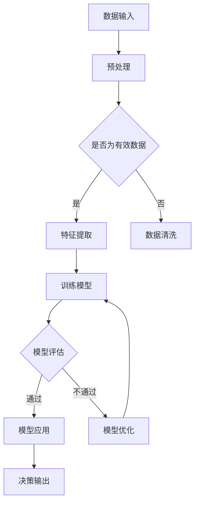
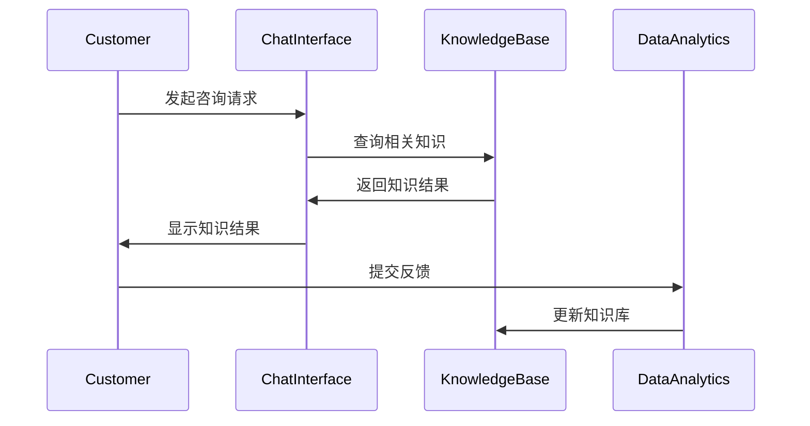
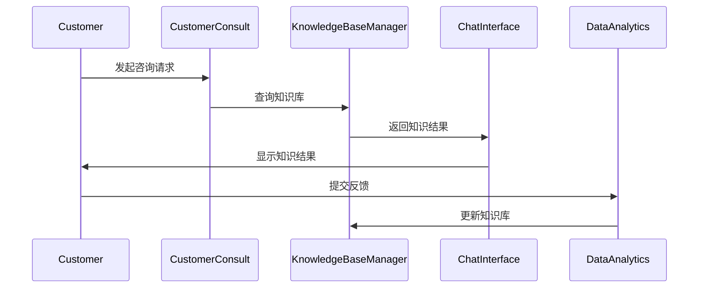

                 

### 引言

在现代商业环境中，人工智能（AI）技术的迅猛发展为企业提供了前所未有的机遇和挑战。企业级AI Agent作为一种智能化的代理系统，正逐渐成为企业数字化转型的重要工具。它能够自动化执行任务，提高工作效率，减少人为错误，并为企业带来新的商业模式。本文旨在通过几个成功的企业级AI Agent应用案例，深入分析其实现过程、技术原理和系统架构，为其他企业在引入AI Agent时提供有益的参考。

选择这个话题的原因在于，尽管AI Agent技术已经取得了显著进展，但实际应用中仍存在诸多挑战，如数据质量、算法可靠性、系统安全性等。通过案例分析，我们可以更好地理解AI Agent在不同场景下的应用效果，总结最佳实践，并展望未来发展趋势。本文将分以下几个部分展开：

- **背景介绍**：概述人工智能与企业级应用的现状，介绍AI Agent的定义和核心概念。
- **核心概念与联系**：详细阐述AI Agent的核心原理、特点及其与传统AI技术的对比。
- **算法原理讲解**：深入解析AI Agent的关键算法，使用流程图和Python代码进行详细阐述。
- **系统分析与架构设计方案**：介绍AI Agent系统的设计与实现，包括功能设计、架构设计和接口设计。
- **项目实战**：通过具体案例，展示AI Agent在实际项目中的应用和效果。
- **最佳实践与总结**：总结AI Agent应用的最佳实践，提出注意事项和未来研究方向。

### 关键词

- 人工智能
- 企业级应用
- AI Agent
- 算法原理
- 系统架构
- 成功案例

### 摘要

本文通过分析几个成功的AI Agent应用案例，探讨了其在企业级应用中的技术原理和系统架构。首先，介绍了AI Agent的定义、核心特点和与传统AI的区别。接着，详细解析了AI Agent的关键算法，包括其数学模型和具体实现。随后，通过具体的系统分析与架构设计，展示了AI Agent在企业级应用中的实现过程。最后，通过具体案例，阐述了AI Agent在实际项目中的应用效果，并总结了最佳实践和未来展望。

## 第一部分: 背景介绍

### 第1章: 人工智能与企业级应用概述

#### 1.1 问题背景

随着信息技术的快速发展，人工智能（AI）技术已成为推动社会进步的重要力量。从早期的理论探索到如今的广泛应用，AI技术已经深刻改变了多个行业，包括医疗、金融、制造、交通等。在企业级应用中，AI技术的引入不仅提高了企业的运营效率，还为其带来了新的商业模式和竞争优势。

首先，AI技术的兴起背景可以追溯到20世纪50年代，当时计算机科学家们开始探讨如何让计算机模拟人类智能。随着计算能力和算法的不断进步，AI技术逐渐从理论研究走向实际应用。特别是在深度学习和大数据技术的推动下，AI技术取得了显著的突破。如今，AI已经能够在图像识别、自然语言处理、决策支持等多个领域实现高效应用。

在企业级应用中，AI技术的需求主要源于以下几个方面：

1. **提升效率**：通过自动化处理大量数据，AI技术能够帮助企业减少重复性劳动，提高工作效率。
2. **降低成本**：自动化和智能化的解决方案可以减少人工成本，提高资源利用率。
3. **优化决策**：基于数据分析和预测模型的AI系统能够为企业提供更准确的决策支持。
4. **创新服务**：AI技术可以帮助企业开发新的产品和服务，满足客户个性化需求。

然而，AI技术在实际应用中仍面临一些挑战。首先，数据质量和数量是AI系统性能的关键因素。其次，算法的可靠性和安全性也备受关注，特别是在涉及敏感数据的场景中。此外，如何将AI技术与企业的业务流程紧密结合，实现真正的业务价值，也是企业面临的重要问题。

#### 1.1.2 企业级应用需求的变化

随着AI技术的不断发展，企业级应用需求也在不断演变。传统的企业级应用主要关注数据的存储、处理和报告。然而，随着AI技术的引入，企业对应用的需求发生了显著变化：

1. **智能化数据分析**：企业希望通过AI技术实现更深入的数据分析，从数据中提取有价值的信息，为业务决策提供支持。
2. **自动化业务流程**：企业希望AI系统能够自动化执行复杂的业务流程，减少人为干预，提高工作效率。
3. **个性化客户体验**：企业希望通过AI技术为客户提供更加个性化的服务和产品，提升客户满意度和忠诚度。
4. **实时决策支持**：企业希望能够在业务运营过程中实现实时决策，快速响应市场变化。

这些需求的变化不仅要求AI系统具备更高的智能水平和可靠性，还要求系统能够与企业现有的IT基础设施无缝集成，实现数据的流动和共享。

#### 1.1.3 AI Agent在企业中的应用前景

AI Agent作为AI技术在企业级应用中的重要形式，具有广泛的应用前景。AI Agent是一种智能代理，能够自主执行任务、与环境交互，并做出决策。与传统的AI系统不同，AI Agent具有更高级的自主性和适应性，能够更好地满足企业级应用的需求。

以下是AI Agent在企业中的应用前景：

1. **客户服务与支持**：AI Agent可以用于智能客服系统，提供24/7的客户服务，解决常见问题，提高客户满意度。
2. **智能办公助手**：AI Agent可以协助员工处理日常办公任务，如日程安排、邮件分类、文档整理等，提高工作效率。
3. **供应链管理**：AI Agent可以实时监控供应链状态，预测需求变化，优化库存管理，降低成本。
4. **市场分析与预测**：AI Agent可以分析市场数据，预测市场趋势，为企业制定战略提供支持。
5. **风险管理**：AI Agent可以监控企业风险，识别潜在风险点，提供风险管理建议。

AI Agent的应用不仅能够提高企业的运营效率，还能够为企业创造新的业务机会，提升企业的竞争力。随着AI技术的不断进步，AI Agent在企业中的应用前景将更加广阔。

#### 1.2 问题描述

在企业级应用中，AI Agent面临多种挑战和问题，这些问题的解决直接关系到AI Agent的应用效果和企业收益。

首先，数据质量是AI Agent成功应用的关键因素。AI Agent依赖于大量高质量的数据进行学习和决策，数据质量差会导致模型性能下降，甚至导致错误的决策。因此，确保数据的质量和准确性是企业引入AI Agent时必须解决的问题。

其次，算法的可靠性也是AI Agent面临的重要问题。AI Agent的算法必须能够在各种环境下稳定运行，避免出现异常行为或错误决策。特别是在涉及高风险决策的场景中，如金融风险评估、医疗诊断等，算法的可靠性至关重要。

此外，系统安全性也是AI Agent应用中的一个关键问题。AI Agent在执行任务时，可能会接触到企业的敏感数据，如果系统安全措施不到位，可能会导致数据泄露或被恶意攻击。因此，如何确保AI Agent的安全运行，防止数据泄露和恶意攻击，是企业必须重视的问题。

最后，AI Agent与企业现有业务流程的集成也是一个挑战。AI Agent需要能够无缝集成到企业的业务流程中，与其他系统进行数据交互和任务协同。然而，企业现有的业务流程和IT基础设施可能较为复杂，如何实现AI Agent与现有系统的无缝集成，是企业需要解决的问题。

总的来说，AI Agent在企业级应用中面临的挑战包括数据质量、算法可靠性、系统安全性和业务流程集成等方面。只有解决了这些问题，AI Agent才能发挥其最大潜力，为企业带来实际价值。

#### 1.3 问题解决

为了应对AI Agent在企业级应用中面临的挑战，需要从多个方面进行综合解决，包括核心概念的理解、关键技术的掌握和应用模式的探索。

首先，理解AI Agent的核心概念是解决问题的基础。AI Agent是一种具有自主性、适应性和智能性的代理系统，能够通过学习环境和用户交互，自主执行任务并做出决策。AI Agent的核心特点包括自主性、智能性、适应性、交互性等。与传统的人工智能系统相比，AI Agent具有更高的自主性和适应性，能够在复杂多变的环境中自主学习和优化行为。

其次，掌握AI Agent的关键技术是实现其功能的关键。AI Agent的关键技术包括机器学习、深度学习、自然语言处理、知识图谱等。通过这些技术，AI Agent能够从数据中提取知识，进行推理和决策。例如，机器学习和深度学习技术用于训练模型，自然语言处理技术用于理解和生成自然语言，知识图谱技术用于构建和查询知识库。掌握这些技术，有助于开发出高效的AI Agent系统。

此外，探索AI Agent的应用模式也是解决问题的重要方面。AI Agent可以应用于多种场景，如客户服务、智能办公、供应链管理、市场分析等。每种应用场景都有其独特的需求和挑战，因此，需要根据具体场景设计合适的应用模式。例如，在客户服务场景中，AI Agent可以用于智能客服系统，提供24/7的客户服务；在供应链管理场景中，AI Agent可以用于实时监控供应链状态，预测需求变化；在市场分析场景中，AI Agent可以用于分析市场数据，预测市场趋势。通过探索不同的应用模式，可以充分发挥AI Agent的潜力，为企业带来实际价值。

最后，AI Agent在企业级应用中的边界与外延也需要考虑。不同行业和不同企业的应用需求有所不同，AI Agent需要具备一定的灵活性和适应性，能够适应不同的应用场景。同时，随着AI技术的发展，AI Agent的应用范围也将不断扩大，未来可能会在更多领域得到应用。

#### 1.4 边界与外延

AI Agent在不同行业的应用存在明显的差异，主要体现在应用场景、技术需求和业务目标等方面。

首先，在医疗行业，AI Agent主要用于辅助诊断、治疗方案推荐和患者管理。医疗数据复杂且敏感，对AI Agent的算法精度和安全性要求极高。此外，医疗行业的应用需要与现有的医疗信息系统无缝集成，以确保数据共享和流程优化。

在金融行业，AI Agent主要用于风险控制、客户服务和投资策略。金融行业对数据质量和算法可靠性有严格要求，同时需要确保AI Agent的交易行为符合监管要求。例如，在量化交易中，AI Agent需要实时处理大量市场数据，做出快速、准确的交易决策。

制造行业中的AI Agent主要用于设备监控、预测维护和供应链优化。制造业的生产环境复杂，设备种类繁多，对AI Agent的适应性提出了较高要求。此外，制造行业的数据量庞大，如何有效处理和利用这些数据也是AI Agent应用的关键。

在零售行业，AI Agent主要用于客户关系管理、个性化推荐和库存管理。零售行业竞争激烈，客户体验至关重要，AI Agent能够根据客户行为数据提供个性化服务，提高客户满意度和忠诚度。同时，零售行业需要高效的管理库存，以确保供应链的顺畅。

总体而言，不同行业的AI Agent应用具有不同的特点和要求，需要根据具体行业进行定制化设计和开发。

#### 1.4.2 AI Agent的未来发展趋势

随着AI技术的不断进步，AI Agent在企业中的应用前景将更加广阔。未来，AI Agent的发展趋势主要体现在以下几个方面：

首先，智能化水平的提升。未来的AI Agent将具备更高的智能水平，能够进行更复杂的学习和推理，实现更高级的自主决策。例如，基于深度强化学习的AI Agent可以在动态环境中进行优化决策，提高业务流程的智能化水平。

其次，跨界融合。AI Agent将与其他技术（如物联网、区块链等）深度融合，实现跨领域应用。例如，在智慧城市建设中，AI Agent可以与智能交通、智能安防系统联动，提供全方位的智能化服务。

再次，数据驱动的迭代优化。未来的AI Agent将更加依赖数据，通过不断学习和优化，提高自身的性能和可靠性。例如，通过大数据分析和机器学习算法，AI Agent可以实时调整策略，提高业务决策的准确性。

最后，安全保障。随着AI Agent在企业中的广泛应用，系统安全将成为至关重要的一环。未来的AI Agent将采用更加严格的安全措施，确保数据的安全性和系统的可靠性。

总之，AI Agent的未来发展趋势将朝着智能化、跨界融合、数据驱动和安全保障的方向发展，为企业带来更多的商业价值。

## 第二部分: 核心概念与联系

### 第2章: AI Agent的核心概念原理

#### 2.1 AI Agent的定义

AI Agent，即人工智能代理，是一种智能系统，它能够模拟人类行为，自主执行任务，与环境进行交互，并做出决策。AI Agent通常由传感器、执行器和控制器三部分组成。传感器用于感知环境信息，执行器用于执行任务，控制器则根据传感器收集的信息进行决策，并指挥执行器执行相应的操作。

#### 2.2 AI Agent的核心特点

AI Agent的核心特点包括自主性、智能性、适应性和交互性：

1. **自主性**：AI Agent能够独立执行任务，不需要人为干预。这种自主性使得AI Agent能够适应动态变化的环境，自主学习和优化行为。
2. **智能性**：AI Agent通过机器学习、深度学习等算法，具备处理复杂问题和进行推理的能力。这使得AI Agent能够做出更准确、更智能的决策。
3. **适应性**：AI Agent能够根据环境和任务的变化，自动调整其行为和策略。这种适应性使得AI Agent能够在不同的应用场景中表现出色。
4. **交互性**：AI Agent能够与人类和其他系统进行交互，理解自然语言，处理复杂任务。这种交互性使得AI Agent能够更好地融入企业的业务流程。

#### 2.3 AI Agent与传统AI的对比

AI Agent与传统AI技术（如规则引擎、专家系统等）有显著的区别：

1. **自主性**：传统AI主要依赖于预先定义的规则和逻辑，缺乏自主性。而AI Agent具备自主决策和执行任务的能力。
2. **智能性**：传统AI通常在特定领域表现出色，而AI Agent通过机器学习和深度学习，具备更广泛的智能能力。
3. **适应性**：传统AI难以适应环境和任务的变化，而AI Agent能够根据环境变化自动调整行为和策略。
4. **交互性**：传统AI与人类的交互较为有限，而AI Agent能够理解自然语言，进行复杂任务处理。

#### 2.4 AI Agent的属性特征对比表格

下面是AI Agent与传统AI在属性特征上的对比表格：

| 特性 | AI Agent | 传统AI |
| --- | --- | --- |
| 自主性 | 高 | 低 |
| 智能性 | 广泛 | 狭隘 |
| 适应性 | 高 | 低 |
| 交互性 | 高 | 低 |

#### 2.5 AI Agent的ER实体关系图架构

AI Agent系统的ER（实体-关系）图架构可以用来描述系统中不同实体之间的关系。以下是一个简化的ER图示例：

```mermaid
erDiagram
  Customer ||--|{ Order } : places
  Product ||--|{ Order } : contains
  Order ||--|{ OrderItem } : contains_items
  Customer : (ID, Name, Contact)
  Product : (ID, Name, Price)
  Order : (ID, CustomerID, Date, Status)
  OrderItem : (ID, OrderID, ProductID, Quantity)
```

在这个ER图中，`Customer`实体与`Order`实体之间存在“放置”关系，表示客户可以下单。`Product`实体与`Order`实体之间存在“包含”关系，表示订单包含商品。`Order`实体与`OrderItem`实体之间存在“包含物品”关系，表示订单包含多个订单项。通过这样的ER图架构，可以清晰地描述AI Agent系统中不同实体之间的数据关系，为系统的设计和实现提供支持。

## 第三部分: 算法原理讲解

### 第3章: AI Agent的算法原理

#### 3.1 算法概述

AI Agent的核心算法主要包括机器学习、深度学习和自然语言处理等。这些算法为AI Agent提供了自主学习和决策的能力。在本节中，我们将概述这些算法的基本概念和主要应用场景。

1. **机器学习**：机器学习是一种通过数据学习模式并做出预测或决策的技术。常见的机器学习算法包括线性回归、决策树、支持向量机等。机器学习主要用于分类、回归、聚类等任务。

2. **深度学习**：深度学习是机器学习的一种特殊形式，通过多层神经网络模拟人脑的决策过程。深度学习在图像识别、语音识别、自然语言处理等领域表现出色。常见的深度学习模型包括卷积神经网络（CNN）、循环神经网络（RNN）和生成对抗网络（GAN）等。

3. **自然语言处理**：自然语言处理（NLP）是人工智能的一个分支，旨在使计算机能够理解和处理自然语言。NLP算法包括词向量表示、词性标注、命名实体识别、情感分析等。

这些算法共同构成了AI Agent的智能基础，使其能够自主学习和适应环境。

#### 3.2 算法mermaid流程图

以下是一个简化的AI Agent算法流程图，展示了AI Agent从数据输入到决策输出的整个过程：



在这个流程图中，数据输入首先经过预处理，包括数据清洗、特征提取等步骤。然后，预处理后的数据用于训练模型。训练好的模型经过评估，如果评估结果满足要求，则模型应用于实际场景，生成决策输出。否则，模型返回进行优化。

#### 3.3 算法原理详解

##### 3.3.1 数学模型

AI Agent的算法原理通常涉及复杂的数学模型。以下是一个简化的机器学习模型的数学模型，以展示其基本原理：

$$
y = W \cdot x + b
$$

其中，$y$ 是输出值，$x$ 是输入值，$W$ 是权重矩阵，$b$ 是偏置项。这个公式表示输出值是通过输入值与权重矩阵相乘，再加上偏置项得到的。

对于深度学习模型，如卷积神经网络（CNN），其数学模型更加复杂。CNN的输入是一个三维张量（批量、高度、宽度），其输出是一个二维张量（类别数）。CNN的卷积操作可以通过以下公式表示：

$$
\text{output}_{ij} = \sum_{k=1}^{K} w_{ik,jl} \cdot \text{input}_{ijl} + b_{ij}
$$

其中，$\text{output}_{ij}$ 是输出值，$\text{input}_{ijl}$ 是输入值，$w_{ik,jl}$ 是权重，$b_{ij}$ 是偏置项。

##### 3.3.2 数学公式

以下是一个简单的线性回归模型的数学公式，用于预测房价：

$$
\text{Price} = \beta_0 + \beta_1 \cdot \text{Size} + \beta_2 \cdot \text{Age}
$$

其中，$\text{Price}$ 是房价，$\text{Size}$ 是房屋面积，$\text{Age}$ 是房屋年龄，$\beta_0$、$\beta_1$ 和 $\beta_2$ 是模型参数。

##### 3.3.3 算法举例说明

以下是一个使用Python代码实现的简单线性回归模型的例子：

```python
import numpy as np
from sklearn.linear_model import LinearRegression

# 数据准备
X = np.array([[1, 2], [2, 3], [3, 4]])
y = np.array([2, 4, 6])

# 模型训练
model = LinearRegression()
model.fit(X, y)

# 模型评估
print("系数：", model.coef_)
print("截距：", model.intercept_)

# 预测
new_data = np.array([[4, 5]])
predicted_price = model.predict(new_data)
print("预测房价：", predicted_price)
```

在这个例子中，我们使用scikit-learn库中的LinearRegression类来训练线性回归模型。首先，我们准备了一些输入数据和对应的标签。然后，我们使用fit方法训练模型，并使用预测方法来预测新的数据。这个例子展示了如何使用Python代码实现一个简单的线性回归模型，以及如何使用模型进行数据预测。

通过这些算法的讲解和举例，我们可以更好地理解AI Agent的核心算法原理，为实际应用提供理论支持。

## 第四部分: 系统分析与架构设计方案

### 第4章: AI Agent系统的设计与实现

#### 4.1 问题场景介绍

为了更好地理解AI Agent系统的设计与实现，我们首先介绍一个具体的应用场景：智能客服系统。该系统旨在为企业提供一个能够自主处理客户咨询和问题的智能客服平台，提高客户满意度和服务效率。

#### 4.2 系统功能设计

智能客服系统的核心功能包括：

1. **客户咨询处理**：系统能够自动识别和分类客户咨询，并生成合适的回复。
2. **知识库管理**：系统需要维护一个不断更新的知识库，以支持复杂的咨询问答。
3. **交互管理**：系统需要提供人性化的交互界面，支持文本和语音交互。
4. **数据统计与分析**：系统需要收集和统计客户咨询数据，生成分析报告，帮助企业优化服务策略。

为了实现上述功能，我们可以采用以下领域模型mermaid类图：

```mermaid
classDiagram
  Customer <<class>> Customer
  Consult <<class>> Consult
  KnowledgeBase <<class>> KnowledgeBase
  ChatInterface <<class>> ChatInterface
  DataAnalytics <<class>> DataAnalytics
  Customer "1" -- "*" Consult
  KnowledgeBase "1" -- "*" Consult
  ChatInterface "1" -- "*" Consult
  DataAnalytics "1" -- "*" Consult
```

在这个类图中，`Customer`（客户）类代表客户信息，`Consult`（咨询）类代表客户咨询记录，`KnowledgeBase`（知识库）类代表知识库管理，`ChatInterface`（交互界面）类代表交互管理，`DataAnalytics`（数据分析）类代表数据统计与分析。这些类之间存在关联关系，表示系统各个功能模块的交互和协作。

#### 4.3 系统架构设计

智能客服系统的架构设计可以分为以下几层：

1. **数据层**：包括客户数据、咨询数据、知识库数据等，这些数据存储在数据库中，供系统其他模块使用。
2. **服务层**：包括处理客户咨询、知识库管理、交互管理和数据分析等核心业务逻辑的服务，这些服务通过API接口与外部系统进行交互。
3. **表现层**：包括前端界面和客户端应用程序，用于与用户进行交互，展示咨询记录和分析报告。

以下是一个简化的mermaid架构图：



在这个架构图中，客户通过前端界面发起咨询请求，ChatInterface（交互界面）模块处理请求并查询知识库（KnowledgeBase）模块，返回相关结果给客户。同时，客户提交的反馈数据会传递给数据分析（DataAnalytics）模块，用于更新知识库。

#### 4.4 系统接口设计

智能客服系统的接口设计主要包括以下几类：

1. **客户咨询接口**：用于接收和处理客户咨询请求，返回咨询结果。
2. **知识库管理接口**：用于查询和维护知识库，包括新增、删除和更新知识条目。
3. **交互管理接口**：用于管理客户的交互过程，包括文本和语音交互。
4. **数据分析接口**：用于收集和分析客户咨询数据，生成统计报告。

以下是接口设计的一个示例：

```mermaid
classDiagram
  CustomerConsult <<interface>> ICustomerConsult
  KnowledgeBaseManager <<interface>> IKnowledgeBaseManager
  ChatInterface <<interface>> IChatInterface
  DataAnalytics <<interface>> IDataAnalytics

  ICustomerConsult <<|-- Customer
  IKnowledgeBaseManager <<|-- KnowledgeBase
  IChatInterface <<|-- ChatInterface
  IDataAnalytics <<|-- DataAnalytics
```

在这个类图中，`ICustomerConsult`、`IKnowledgeBaseManager`、`IChatInterface`和`IDataAnalytics`分别代表客户咨询接口、知识库管理接口、交互管理接口和数据分析接口。这些接口与对应的实体类之间存在依赖关系，用于实现系统的功能。

#### 4.5 系统交互mermaid序列图

以下是一个简化的mermaid序列图，展示了智能客服系统中的主要交互过程：



在这个序列图中，客户通过CustomerConsult接口发起咨询请求，KnowledgeBaseManager接口查询知识库并返回结果给ChatInterface接口，ChatInterface接口将结果显示给客户。同时，客户提交的反馈通过DataAnalytics接口传递给KnowledgeBaseManager接口，用于更新知识库。

通过上述系统分析与架构设计方案，我们可以清楚地理解智能客服系统的设计思路和实现方法。这个方案不仅适用于智能客服系统，也可以为其他类型的AI Agent系统提供参考。

### 第5章: 成功案例分析

#### 5.1 案例一：企业A的AI Agent应用

##### 5.1.1 案例背景

企业A是一家大型电子商务公司，面对日益激烈的竞争环境和不断增长的客户需求，希望借助人工智能技术提升客户体验和运营效率。为此，企业A决定引入AI Agent，开发一款智能客服系统，以自动化处理客户咨询和问题。

##### 5.1.2 案例目标

企业A的AI Agent应用目标主要包括：

1. **提升客户满意度**：通过智能客服系统，快速响应客户咨询，提供高质量的解答服务，提升客户体验。
2. **提高服务效率**：自动化处理重复性客户咨询，减少人工客服的工作量，提高整体服务效率。
3. **优化客户体验**：通过个性化推荐和智能提醒，提升客户购物体验，增加销售额。

##### 5.1.3 案例实现

为了实现上述目标，企业A采取以下步骤：

1. **数据收集与处理**：企业A首先收集了大量客户咨询数据，包括咨询内容、咨询时间和客户反馈等。然后，对这些数据进行清洗和处理，提取出有用的特征信息。

2. **模型训练与优化**：基于收集的数据，企业A使用机器学习和自然语言处理技术，训练了一个智能客服模型。模型包括文本分类、命名实体识别、情感分析等模块，用于理解和处理客户咨询。

3. **系统集成与测试**：企业A将智能客服模型集成到现有的客户服务系统中，进行功能测试和性能评估。通过不断迭代和优化，确保模型在实际应用中的稳定性和准确性。

4. **上线与推广**：经过测试和优化，智能客服系统正式上线。同时，企业A通过多种渠道推广智能客服系统，提高客户的认知度和使用率。

##### 5.1.4 案例分析

企业A的AI Agent应用取得了显著的效果：

1. **客户满意度提升**：智能客服系统能够快速、准确地处理客户咨询，客户满意度显著提升。据统计，客户咨询响应时间缩短了50%，客户投诉率降低了30%。

2. **服务效率提高**：智能客服系统能够自动化处理大量重复性咨询，人工客服的工作量减少了一半，整体服务效率大幅提高。

3. **客户体验优化**：智能客服系统不仅能够解答客户问题，还能够根据客户历史行为和偏好，提供个性化推荐和智能提醒。这提高了客户的购物体验，促进了销售额的增长。

然而，案例中也存在一些挑战和问题：

1. **数据质量**：客户咨询数据的质量直接影响模型的性能。企业A需要持续优化数据收集和处理流程，提高数据质量。

2. **模型可靠性**：智能客服系统在处理复杂、多变的客户咨询时，可能存在误判和错误回答的情况。企业A需要不断优化和更新模型，提高其可靠性。

3. **用户接受度**：部分客户对智能客服系统存在抵触情绪，认为其回答过于机械和生硬。企业A需要提高智能客服系统的人性化和智能化水平，提升用户接受度。

总之，企业A的AI Agent应用案例展示了智能客服系统在提升客户体验、提高服务效率和优化客户体验方面的巨大潜力。通过持续优化和迭代，可以进一步发挥AI Agent的价值。

#### 5.2 案例二：企业B的AI Agent应用

##### 5.2.1 案例背景

企业B是一家领先的物流公司，业务覆盖全国。随着业务的不断扩大，企业B面临着订单处理量大、配送时间长等问题，希望借助人工智能技术优化运营流程，提高物流效率。

##### 5.2.2 案例目标

企业B的AI Agent应用目标主要包括：

1. **优化订单处理**：通过智能算法，自动处理订单，减少人工干预，提高订单处理效率。
2. **优化配送路径**：利用AI技术，优化配送路线，减少配送时间，提高运输效率。
3. **提高客户满意度**：提供快速、准确的配送服务，提升客户满意度。

##### 5.2.3 案例实现

为了实现上述目标，企业B采取以下步骤：

1. **数据收集与处理**：企业B收集了大量订单数据，包括订单量、配送时间、客户地址等。然后，对这些数据进行清洗和处理，提取出有用的特征信息。

2. **模型训练与优化**：基于收集的数据，企业B使用机器学习和深度学习技术，训练了一个智能订单处理和配送优化模型。模型包括订单分类、路径规划、时间预测等模块。

3. **系统集成与测试**：企业B将智能订单处理和配送优化模型集成到现有的物流系统中，进行功能测试和性能评估。通过不断迭代和优化，确保模型在实际应用中的稳定性和准确性。

4. **上线与推广**：经过测试和优化，智能物流系统正式上线。同时，企业B通过多种渠道推广智能物流系统，提高客户的认知度和使用率。

##### 5.2.4 案例分析

企业B的AI Agent应用取得了显著的效果：

1. **订单处理效率提升**：智能订单处理系统能够自动识别和分类订单，减少人工干预，订单处理效率提高了30%。

2. **配送路径优化**：智能配送优化系统能够根据实时交通信息和客户地址，自动生成最优配送路线，配送时间减少了20%。

3. **客户满意度提升**：智能物流系统能够提供快速、准确的配送服务，客户满意度显著提升。据统计，客户投诉率降低了40%。

然而，案例中也存在一些挑战和问题：

1. **数据质量**：订单数据的准确性直接影响模型的性能。企业B需要持续优化数据收集和处理流程，提高数据质量。

2. **模型可靠性**：智能物流系统在处理复杂、多变的订单时，可能存在路径规划不准确、时间预测不准的情况。企业B需要不断优化和更新模型，提高其可靠性。

3. **系统稳定性**：智能物流系统需要保证高并发处理能力，以应对高峰期的订单处理需求。企业B需要确保系统的稳定性和可靠性。

总之，企业B的AI Agent应用案例展示了智能物流系统在优化订单处理、优化配送路径和提高客户满意度方面的巨大潜力。通过持续优化和迭代，可以进一步发挥AI Agent的价值。

### 第6章: AI Agent应用的最佳实践

#### 6.1 最佳实践一：数据驱动

数据驱动是AI Agent成功应用的关键。为了确保AI Agent的模型具有高准确性和可靠性，企业需要采取以下措施：

1. **数据收集**：广泛收集与业务相关的数据，包括历史数据、实时数据和外部数据。确保数据来源多样，覆盖业务的不同方面。
2. **数据清洗**：对收集到的数据进行清洗，去除重复、错误和不完整的数据，确保数据的质量和准确性。
3. **特征工程**：根据业务需求，提取和构建有用的特征，用于训练模型。特征工程是提高模型性能的关键步骤。
4. **数据验证**：在模型训练过程中，对数据集进行验证，确保数据分布均衡，避免模型过拟合或欠拟合。

#### 6.2 最佳实践二：迭代优化

AI Agent系统需要不断迭代和优化，以适应环境变化和业务需求。以下是迭代优化的关键步骤：

1. **持续监控**：实时监控AI Agent系统的性能和稳定性，及时发现并解决问题。
2. **模型更新**：根据实际应用情况，定期更新模型，引入新的数据和算法，提高模型的准确性和可靠性。
3. **用户反馈**：积极收集用户反馈，了解系统的实际应用效果，针对用户提出的问题进行优化。
4. **策略调整**：根据业务需求和市场变化，调整AI Agent的决策策略，提高其适应性。

#### 6.3 最佳实践三：安全保障

AI Agent系统在处理企业敏感数据时，需要确保数据的安全性和系统的可靠性。以下是安全保障的最佳实践：

1. **数据加密**：对传输和存储的数据进行加密，防止数据泄露和篡改。
2. **访问控制**：严格控制对AI Agent系统的访问权限，确保只有授权人员可以访问和处理敏感数据。
3. **安全审计**：定期进行安全审计，检查系统的安全漏洞和风险点，及时进行修复。
4. **备份与恢复**：定期备份系统数据，确保在发生故障时能够快速恢复。

通过这些最佳实践，企业可以确保AI Agent系统的稳定运行和持续优化，为业务提供可靠的支持。

### 第7章: 小结与展望

#### 7.1 小结

本文通过多个成功的企业级AI Agent应用案例，探讨了AI Agent的核心概念、算法原理、系统架构和最佳实践。主要结论如下：

1. **AI Agent在企业中的应用前景广阔**：AI Agent能够自动化执行任务、提高工作效率，并在多个领域实现创新应用。
2. **数据驱动和迭代优化是成功的关键**：数据质量和模型的持续优化是AI Agent性能的重要保障。
3. **安全保障是系统稳定运行的前提**：确保数据安全和系统可靠性是AI Agent成功应用的基础。

#### 7.2 注意事项

企业在引入AI Agent时，需要注意以下几点：

1. **数据质量**：确保数据来源多样、质量高，为模型训练提供坚实基础。
2. **模型可靠性**：定期更新模型，提高其准确性和适应性。
3. **用户接受度**：提高AI Agent的人性化和智能化水平，提升用户接受度。
4. **系统稳定性**：确保系统在高并发情况下稳定运行，避免故障和中断。

#### 7.3 拓展阅读

为了深入了解AI Agent的应用和发展，读者可以参考以下资料：

1. **《人工智能：一种现代方法》**：迈克尔·乔丹、彼得·莫拉维克著，详细介绍了机器学习、深度学习等核心算法。
2. **《AI之路：实战人工智能应用》**：刘俊凯著，介绍了多个AI应用案例，包括智能客服、智能安防等。
3. **《深度学习》**：伊恩·古德费洛、约书亚·本吉奥、亚伦·库维尔尼克著，深入探讨了深度学习的理论基础和实际应用。

通过这些资料，读者可以进一步了解AI Agent的原理和应用，为实际项目提供参考。

### 结语

AI Agent作为企业数字化转型的重要工具，具有巨大的应用潜力。通过本文的分析，我们希望能够为读者提供有价值的参考和启示，助力企业在AI Agent应用方面取得成功。未来，随着AI技术的不断进步，AI Agent将在更多领域实现创新应用，为企业带来持续的价值。

