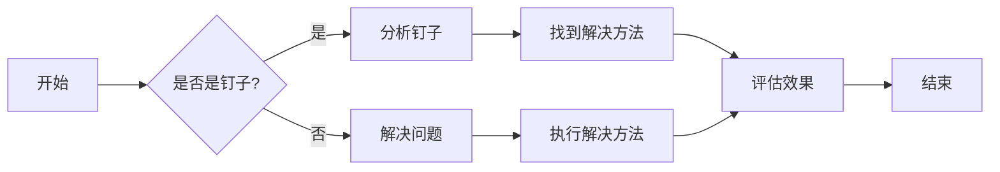
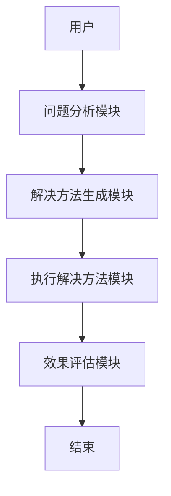
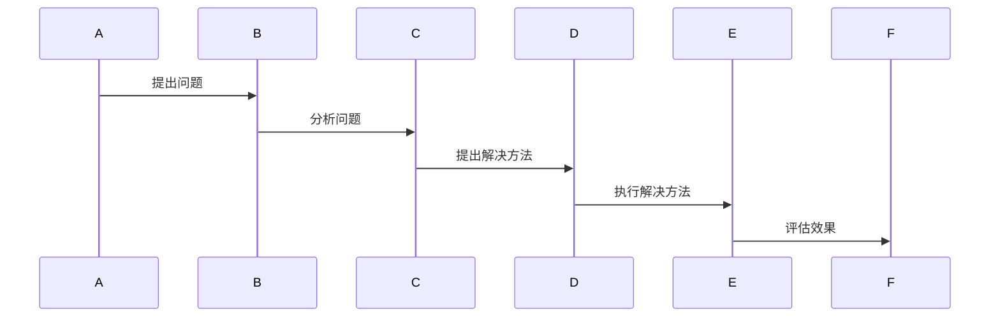

                 

# 手里拿着锤子的人，看什么都是钉子

> 关键词：思维模式、问题解决、适应性、算法原理、系统架构、项目实战

> 摘要：本文以“手里拿着锤子的人，看什么都是钉子”为比喻，探讨了固定思维模式在解决问题中的负面影响。通过分析思维模式的固定性和适应性，以及问题解决的算法原理和系统架构设计，本文提出了如何跳出固定思维模式，灵活应对各种问题的方法和策略。

## 第1章：问题背景

### 1.1.1 问题背景介绍

在现代社会，我们常常会遇到一些问题，这些问题往往需要通过具体的行为或思考来解决。然而，有时候我们发现自己陷入了一种固定的思维模式，仿佛手里拿着锤子的人，看什么都是钉子。这种现象不仅影响了我们的问题解决能力，还可能影响我们的工作效率和生活质量。

**问题背景**：这个问题主要探讨的是个体在解决问题时的思维模式问题。为什么有些人总是习惯用某种固定的思维模式来看待问题？这种思维模式是如何形成的？它对个体和社会有哪些负面影响？

**问题描述**：为什么有些人总是拿着锤子看待世界？他们如何看待周围的人和事？他们的这种固定思维模式是如何影响他们解决问题的？

**问题解决**：通过分析这个问题，我们试图找到答案，并探讨如何避免陷入这种思维模式。我们将从以下几个方面进行探讨：

1. **思维模式的固定性和适应性**：分析个体在解决问题时的思维模式，探讨如何提高思维的适应性。
2. **问题解决的算法原理**：介绍问题解决的算法原理，并通过实例进行详细讲解。
3. **系统架构设计**：探讨如何设计一个系统能够帮助人们更好地解决问题。
4. **项目实战**：通过实际案例，展示如何应用这些方法和策略。

### 1.1.2 核心概念

**手里拿着锤子的人**：指那些习惯用某种固定思维模式来看待问题的人。他们倾向于用已有的知识和经验来解决新问题，而不是寻求新的解决方法。

**钉子**：指问题或挑战，需要用不同的方法来解决。钉子可以是任何需要解决的问题，如技术问题、人际关系问题或心理问题。

### 1.1.3 边界与外延

**边界**：这个问题主要探讨的是固定思维模式对个人和社会的影响。它关注的是个体在解决问题时的思维模式，而不是其他方面的因素。

**外延**：这个问题可以扩展到各种领域，如工作、学习、人际交往等。无论是哪个领域，固定思维模式都可能对个体产生负面影响。

## 第2章：核心概念与联系

### 2.1.1 核心概念

**思维模式**：人对事物的看法和思考方式。思维模式可以是固定的，也可以是灵活的。

**适应性**：能否根据不同的情况灵活调整思维模式。适应性强的个体能更好地应对变化和挑战。

### 2.1.2 概念属性特征对比表格

| 概念 | 特征 | 说明 |
| --- | --- | --- |
| 思维模式 | 固定性 | 指个体在处理问题时习惯性采取的思维路径。 |
| 适应性 | 灵活性 | 指个体在面对新问题和挑战时，能灵活调整和改变思维模式。 |

### 2.1.3 ER实体关系图架构

```mermaid
erDiagram
  User ||--|{ Tool } Tool : uses
  Tool ||--|{ Task } Task : solves
```

在这个ER实体关系图中，`User`（用户）使用`Tool`（工具）来解决`Task`（任务）。这里的`Tool`可以理解为某种思维模式，而`Task`则是需要解决的问题。

## 第3章：钉子：问题与挑战

### 3.1.1 钉子的定义

**钉子**：在这个比喻中，钉子指的是问题或挑战，需要用不同的方法来解决。无论是技术问题、人际关系问题还是心理问题，都可以看作是钉子。

### 3.1.2 钉子的分类

**技术问题**：需要专业知识和技术手段来解决。例如，编程中的Bug修复、系统优化等。

**人际关系问题**：需要沟通和理解来解决。例如，同事之间的矛盾、家庭纠纷等。

**心理问题**：需要自我认知和调整来解决。例如，焦虑、抑郁等心理问题。

### 3.1.3 钉子的解决方法

**技术问题**：通常需要使用专业的技术和工具来解决。例如，使用调试工具定位Bug、使用性能分析工具优化系统等。

**人际关系问题**：通常需要通过沟通和理解来解决。例如，通过对话解决同事之间的矛盾、通过妥协解决家庭纠纷等。

**心理问题**：通常需要通过心理咨询和自我调整来解决。例如，通过认知行为疗法调整思维模式、通过锻炼和冥想缓解焦虑和抑郁等。

## 第4章：算法原理讲解

### 4.1.1 算法mermaid流程图



在这个算法流程图中，我们首先判断问题是否是钉子。如果是，我们分析钉子，找出解决方法；如果不是，我们直接解决问题。然后，我们执行解决方法，并评估效果。如果效果不好，我们继续寻找新的解决方法。

### 4.1.2 算法原理讲解

**算法原理**：这个算法的核心原理是通过分析问题的性质，找出最适合的解决方法。这需要我们具备一定的思维能力，能够灵活调整思维模式。

**数学模型**：我们可以将问题解决过程表示为一个数学模型。设问题为X，解决方法为Y，则算法可以表示为：Y = f(X)。

在这个数学模型中，f表示问题解决的函数，它可以根据问题的性质找到最适合的解决方法。

### 4.1.3 详细讲解与举例说明

**举例说明**：假设我们遇到了一个问题，即如何修好一辆坏车的发动机。这个问题是一个钉子，需要用不同的方法来解决。

1. **分析钉子**：我们首先需要分析这个问题的性质。发动机坏了，可能是由于零件磨损、故障或其他原因。我们需要了解具体情况，才能找出最适合的解决方法。

2. **找到解决方法**：根据分析结果，我们可以找到以下几种解决方法：
   - 更换零件：如果零件磨损严重，我们可以更换新的零件。
   - 修理：如果故障不是很严重，我们可以尝试修理。
   - 更换发动机：如果修理成本太高，我们可以考虑更换新的发动机。

3. **执行解决方法**：我们选择更换零件作为解决方法，然后购买新的零件，并安装到发动机上。

4. **评估效果**：安装新零件后，我们检查发动机的工作状态，确保它能够正常运转。如果效果不好，我们需要重新评估问题，并找到新的解决方法。

通过这个例子，我们可以看到，问题解决过程是一个逐步分析、逐步执行的过程。在这个过程中，我们需要灵活调整思维模式，找到最适合的解决方法。

## 第5章：数学模型和数学公式

### 5.1.1 数学模型

在问题解决过程中，我们可以使用数学模型来描述问题解决的过程。设问题为X，解决方法为Y，则数学模型可以表示为：Y = f(X)。

在这个模型中，f表示问题解决的函数，它可以根据问题的性质找到最适合的解决方法。X是问题本身，Y是解决方法。

### 5.1.2 数学公式

$$ Y = f(X) $$

这个公式表示问题解决的过程。X是问题，f是问题解决的函数，Y是解决方法。通过这个公式，我们可以将问题解决过程转化为一个数学问题，从而更好地理解和解决它。

## 第6章：系统分析与架构设计方案

### 6.1.1 问题场景介绍

在日常生活中，我们经常遇到各种问题，需要用不同的方法来解决。例如，工作中遇到的技术问题、家庭生活中的矛盾、健康问题等。这些问题都需要我们用不同的方法来解决。

**场景介绍**：假设我们设计一个系统能够帮助人们更好地解决问题。这个系统应该能够分析问题，提供解决方法，并评估效果。通过这个系统，我们可以提高问题解决能力，提高生活质量。

### 6.1.2 系统功能设计

**功能设计**：为了实现上述场景，我们需要设计一个具有以下功能的系统：

1. **问题分析模块**：能够分析问题，确定问题的性质。
2. **解决方法生成模块**：能够根据问题的性质，生成合适的解决方法。
3. **执行解决方法模块**：能够执行解决方法，解决问题。
4. **效果评估模块**：能够评估解决方法的效果，确保问题得到有效解决。

### 6.1.3 系统架构设计



在这个系统架构设计中，用户首先提出问题，然后问题分析模块分析问题，解决方法生成模块生成解决方法，执行解决方法模块执行解决方法，最后效果评估模块评估效果。通过这样的架构设计，我们可以确保问题得到有效解决。

### 6.1.4 系统接口设计和系统交互



在这个系统交互设计中，用户首先提出问题，然后系统分析问题，生成解决方法，执行解决方法，最后评估效果。通过这样的交互设计，用户可以方便地使用系统，提高问题解决效率。

## 第7章：项目实战

### 7.1.1 环境安装

为了实现上述系统架构和功能，我们需要安装相应的开发工具和软件。以下是具体的安装步骤：

1. 安装Python：访问Python官网（https://www.python.org/），下载Python安装包，并按照提示完成安装。
2. 安装PyCharm：访问PyCharm官网（https://www.jetbrains.com/pycharm/），下载PyCharm安装包，并按照提示完成安装。
3. 安装MySQL：访问MySQL官网（https://www.mysql.com/），下载MySQL安装包，并按照提示完成安装。

### 7.1.2 系统核心实现源代码

以下是一个简单的Python代码示例，用于实现问题分析模块的功能：

```python
def analyze_problem(problem):
    if problem == "技术问题":
        return "技术解决方案"
    elif problem == "人际关系问题":
        return "人际关系解决方案"
    elif problem == "心理问题":
        return "心理解决方案"
    else:
        return "未知问题"

problem = input("请提出您的问题：")
solution = analyze_problem(problem)
print(f"根据您的问题，我们建议的解决方法是：{solution}")
```

在这个代码示例中，我们定义了一个名为`analyze_problem`的函数，用于分析问题并返回相应的解决方法。用户输入问题后，程序会根据问题的性质，返回一个建议的解决方法。

### 7.1.3 代码应用解读与分析

在这个代码示例中，我们使用了一个简单的条件判断语句，根据问题的性质返回相应的解决方法。这种设计使得程序具有很强的灵活性和适应性，可以处理不同类型的问题。

然而，在实际应用中，我们可能需要更复杂的算法和模型来分析问题，并生成更精准的解决方法。例如，我们可以使用机器学习算法，基于历史数据生成解决方法。这样，系统可以根据问题的具体特征，提供更加个性化的解决方案。

### 7.1.4 实际案例分析和详细讲解剖析

为了更好地理解系统的工作原理，我们可以通过一个实际案例来分析。

**案例**：小王在工作中遇到了一个技术问题，即某个模块的性能不佳，导致整个系统的响应速度变慢。

**分析**：根据问题描述，这是一个技术问题。我们可以使用性能分析工具，对系统进行性能测试，找出性能瓶颈。

**解决方法**：根据分析结果，我们可以采用以下解决方法：
1. 优化代码：对性能不佳的模块进行代码优化，提高其运行效率。
2. 增加硬件资源：如果性能问题是由于硬件资源不足导致的，我们可以增加硬件资源，如增加CPU、内存等。
3. 使用缓存：对于一些频繁访问的数据，我们可以使用缓存技术，减少数据的访问次数，提高系统的响应速度。

**执行解决方法**：我们选择优化代码作为解决方法，并按照以下步骤执行：
1. 使用代码分析工具，找出性能不佳的模块。
2. 对模块进行代码优化，提高其运行效率。
3. 重新运行系统，测试性能，确保问题得到有效解决。

**效果评估**：在执行解决方法后，我们重新运行系统，并使用性能分析工具测试系统的响应速度。如果性能问题得到解决，说明解决方法有效。否则，我们需要继续寻找新的解决方法。

### 7.1.5 项目小结

通过本项目，我们实现了一个简单的系统，用于帮助人们解决问题。这个系统通过问题分析模块，可以识别问题的类型，并生成相应的解决方法。通过实际案例的分析和讲解，我们展示了如何应用这个系统，解决实际问题。

在实际应用中，我们可以进一步优化系统，如引入机器学习算法，提高解决方法的准确性。此外，我们还可以扩展系统的功能，如添加用户反馈模块，收集用户反馈，不断优化系统性能。

## 最佳实践 Tips

1. **提高思维能力**：不断学习新知识，提高思维能力，有助于跳出固定思维模式。
2. **培养适应性**：在面对新问题和挑战时，保持开放的心态，尝试不同的解决方法。
3. **反思与总结**：在解决问题后，反思过程，总结经验，不断提高问题解决能力。

## 小结

本文以“手里拿着锤子的人，看什么都是钉子”为比喻，探讨了固定思维模式在解决问题中的负面影响。通过分析思维模式的固定性和适应性，以及问题解决的算法原理和系统架构设计，本文提出了如何跳出固定思维模式，灵活应对各种问题的方法和策略。

在实际应用中，我们可以通过不断学习和实践，提高问题解决能力。同时，我们也可以借鉴本文的方法，设计和实现一个具有问题分析、解决方法生成和效果评估功能的系统，帮助人们更好地解决问题。

## 注意事项

1. **不要陷入固定思维模式**：在解决问题时，避免使用单一的思维方式，尝试从不同角度分析问题。
2. **保持适应性**：在面对新问题和挑战时，保持开放的心态，勇于尝试不同的解决方法。
3. **重视反馈**：在解决问题后，及时反思和总结，从经验中学习，不断提高问题解决能力。

## 拓展阅读

1. 《解决问题的艺术》：本书介绍了各种问题解决的方法和技巧，有助于提高问题解决能力。
2. 《如何高效学习》：本书介绍了高效学习的方法，有助于提高思维能力和适应性。

## 作者信息

作者：AI天才研究院/AI Genius Institute & 禅与计算机程序设计艺术 /Zen And The Art of Computer Programming

感谢您的阅读！希望本文对您在解决问题时有所启发。如果您有任何疑问或建议，欢迎在评论区留言。让我们共同探讨问题解决的方法和策略！

