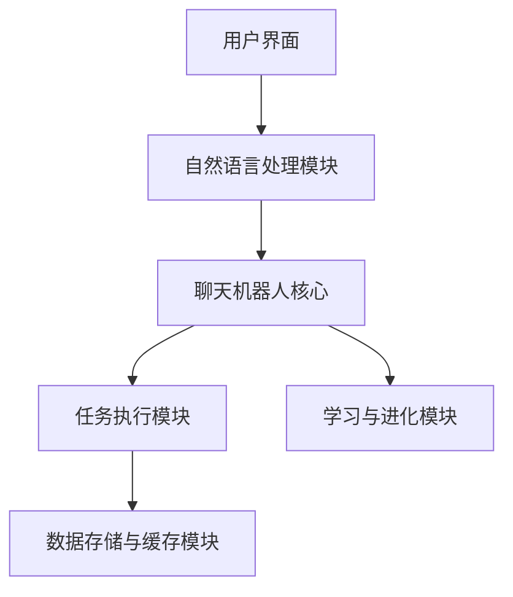
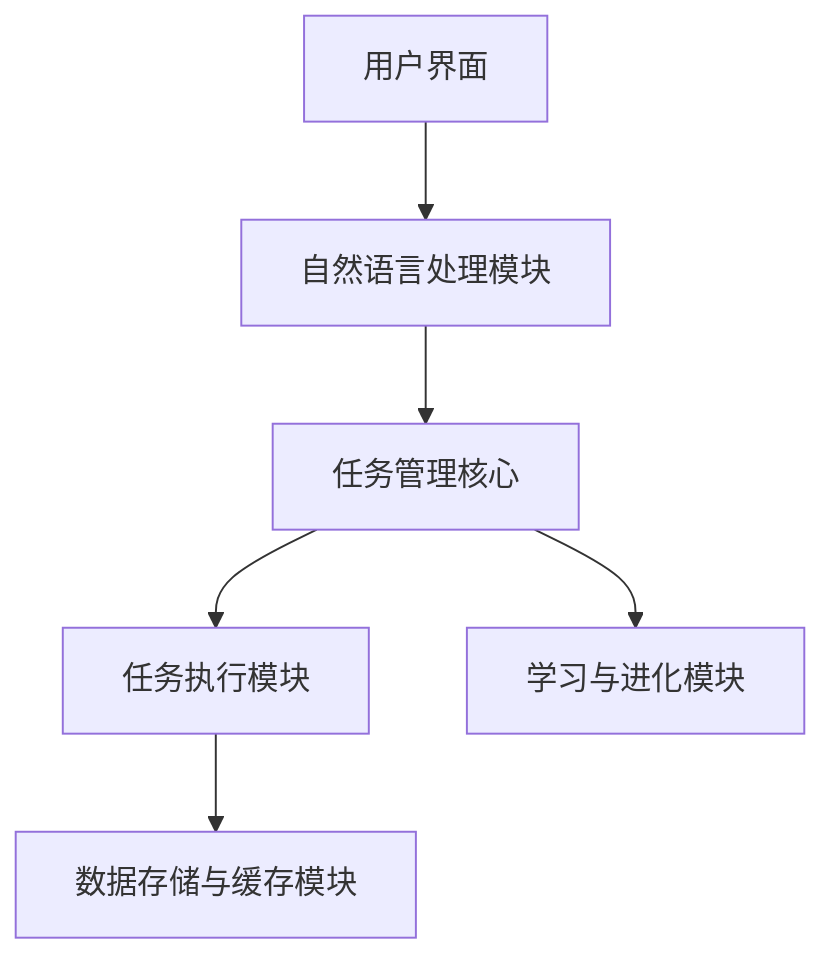

                 

# 打造个人助理 AI Agent：GPT 模型应用实战

## 关键词
- 个人助理 AI Agent
- GPT 模型
- 应用实战
- 自然语言处理
- 人工智能

## 摘要
本文将深入探讨如何使用 GPT（Generative Pre-trained Transformer）模型来打造一个功能强大的个人助理 AI Agent。我们将从 GPT 模型的基础概念开始，逐步讲解其架构、算法以及应用。通过具体的案例，我们将展示如何将 GPT 模型集成到个人助理系统中，并详细分析其实施过程。本文旨在为开发者提供一个清晰、实用的指南，帮助他们在实际项目中成功构建 AI 个人助理。

## 目录

1. **引言**
   - 1.1 背景介绍
   - 1.2 问题陈述
   - 1.3 GPT 模型的定义与作用
   - 1.4 书籍结构概述

2. **GPT 模型基础**
   - 2.1 GPT 模型的历史与演变
   - 2.2 GPT 模型架构解析
   - 2.3 算法原理与核心技术
   - 2.4 数据预处理与模型训练

3. **个人助理 AI Agent 设计**
   - 3.1 AI Agent 的需求分析
   - 3.2 GPT 模型在 AI Agent 中的应用
   - 3.3 系统架构设计
   - 3.4 功能实现与优化

4. **实战项目案例分析**
   - 4.1 项目一：构建个人聊天机器人
   - 4.2 项目二：开发个人任务管理助手
   - 4.3 项目实战总结与拓展

5. **高级话题与优化技巧**
   - 5.1 GPT 模型的微调技巧
   - 5.2 性能优化与资源管理
   - 5.3 未来发展趋势与挑战

6. **最佳实践与总结**
   - 6.1 开发建议与技巧
   - 6.2 注意事项与风险规避
   - 6.3 拓展阅读与资源推荐

## 1. 引言

### 1.1 背景介绍

在当今信息化和智能化的时代，人工智能（AI）已经成为改变世界的力量。AI 的应用场景越来越多，从自动驾驶到智能家居，从医疗诊断到金融分析，AI 无处不在。个人助理 AI Agent 是人工智能的一个重要应用领域，它能够理解用户的指令，完成一系列任务，提高生活质量和工作效率。

### 1.2 问题陈述

虽然现有的个人助理 AI Agent 已经能够处理一些简单的任务，但它们在处理复杂、多样化和动态变化的任务时仍然存在局限性。例如，它们可能无法很好地理解自然语言输入，无法灵活地适应不同的场景和需求。因此，如何构建一个更智能、更灵活、更强大的个人助理 AI Agent 成为当前研究的热点。

### 1.3 GPT 模型的定义与作用

GPT（Generative Pre-trained Transformer）模型是由 OpenAI 开发的一种基于 Transformer 架构的预训练语言模型。它通过在大规模文本数据上进行预训练，掌握了丰富的语言知识和模式，能够生成连贯、自然的语言文本。GPT 模型在自然语言处理（NLP）领域取得了显著的成果，被广泛应用于聊天机器人、文本生成、机器翻译等任务。

### 1.4 书籍结构概述

本文将从以下几个方面展开讨论：

- **第1章：引言**：介绍个人助理 AI Agent 的背景和 GPT 模型的定义，阐述本书的目的和结构。
- **第2章：GPT 模型基础**：详细讲解 GPT 模型的历史、架构、算法和训练过程。
- **第3章：个人助理 AI Agent 设计**：分析 AI Agent 的需求，探讨 GPT 模型在 AI Agent 中的应用和系统架构设计。
- **第4章：实战项目案例分析**：通过两个实际项目，展示如何将 GPT 模型应用于个人助理 AI Agent 的开发。
- **第5章：高级话题与优化技巧**：介绍 GPT 模型的微调技巧、性能优化方法和未来发展趋势。
- **第6章：最佳实践与总结**：提供开发建议、注意事项和拓展阅读资源。

通过本文的阅读，读者将能够深入了解 GPT 模型及其在个人助理 AI Agent 中的应用，掌握构建智能个人助理的实用技能。

### 1.5 目标读者

本文主要面向以下读者群体：

- 对人工智能和自然语言处理感兴趣的编程爱好者。
- 想要在实际项目中应用 GPT 模型的软件开发工程师。
- 正在研究 AI Agent 的研究生和博士生。
- 对前沿技术保持好奇心的 IT 行业从业者。

通过本文的学习，读者将能够：

- 了解 GPT 模型的基础知识和应用场景。
- 掌握如何使用 GPT 模型构建智能个人助理。
- 获得实际项目开发的经验和最佳实践。

## 2. GPT 模型基础

### 2.1 GPT 模型的历史与演变

GPT 模型起源于自然语言处理（NLP）领域，其发展历程可以追溯到 Transformer 架构的提出。2017 年，Google 的研究人员提出了 Transformer 架构，这是一种基于自注意力机制的神经网络模型，显著提升了机器翻译任务的性能。随后，OpenAI 的研究人员受到 Transformer 架构的启发，开发了 GPT 模型。

最初的 GPT 模型是在 2018 年提出的，名为 GPT（Generative Pre-trained Transformer），它通过在大量文本数据上进行预训练，学习了语言的基本规律和模式。GPT 的预训练目标是通过预测下一个词来生成连贯的自然语言文本。这一过程使 GPT 能够理解词汇的上下文关系，生成更加自然和合理的语言。

随着研究的深入，GPT 模型不断迭代更新。GPT-2、GPT-3 等后续版本在模型规模、预训练数据量和性能上都有显著提升。GPT-3 作为 OpenAI 于 2020 年发布的最新版本，拥有 1750 亿个参数，能够在各种 NLP 任务中取得卓越的表现。GPT-3 的出现标志着语言模型在 NLP 领域的又一次重大突破。

### 2.2 GPT 模型架构解析

GPT 模型的核心架构基于 Transformer，这是一种采用自注意力机制的神经网络模型。Transformer 由编码器（Encoder）和解码器（Decoder）两部分组成，它们通过多个自注意力层（Self-Attention Layer）和前馈神经网络（Feedforward Neural Network）进行交互，实现对输入文本的编码和解码。

#### 编码器（Encoder）

编码器负责对输入的文本序列进行处理，生成上下文向量。编码器的主要组成部分包括：

- **嵌入层（Embedding Layer）**：将输入的词索引转换为稠密的向量表示。
- **多头自注意力层（Multi-Head Self-Attention Layer）**：通过对不同位置和不同词汇的加权求和，捕捉输入文本的上下文关系。
- **前馈神经网络（Feedforward Neural Network）**：对自注意力层的输出进行非线性变换，增强模型的表示能力。

编码器通常包含多个自注意力层和前馈神经网络，每一层都使得模型能够学习更复杂的特征。

#### 解码器（Decoder）

解码器负责生成预测的输出序列，其工作原理与编码器类似，但还包括一个额外的交叉注意力层（Cross-Attention Layer），用于从编码器的输出中提取上下文信息。解码器的主要组成部分包括：

- **嵌入层（Embedding Layer）**：与编码器相同，将输入的词索引转换为向量表示。
- **多头自注意力层（Multi-Head Self-Attention Layer）**：用于生成预测的上下文向量。
- **交叉注意力层（Cross-Attention Layer）**：从编码器的输出中提取上下文信息，以帮助生成预测。
- **前馈神经网络（Feedforward Neural Network）**：对自注意力层和交叉注意力层的输出进行非线性变换。

解码器同样包含多个自注意力层和前馈神经网络，通过这些层之间的交互，解码器能够生成连贯的输出序列。

### 2.3 算法原理与核心技术

GPT 模型的核心算法是基于自注意力机制（Self-Attention Mechanism）和 Transformer 架构。自注意力机制是一种通过计算输入序列中各个元素之间的关系来进行特征提取的方法，其基本思想是将输入序列中的每个元素与所有其他元素进行关联，并通过加权求和来生成新的特征表示。

在 GPT 模型中，自注意力机制通过多头自注意力层（Multi-Head Self-Attention Layer）来实现。每个多头自注意力层由多个自注意力头（Self-Attention Head）组成，每个头负责计算不同维度的特征。这些头通过并行计算，共享模型参数，从而提高了模型的表示能力。

除了自注意力机制，GPT 模型还包括前馈神经网络（Feedforward Neural Network）。前馈神经网络对自注意力层的输出进行非线性变换，增强了模型的特征表示能力。前馈神经网络通常由两个全连接层组成，每个层都有 ReLU 激活函数。

GPT 模型的训练过程主要包括两个阶段：预训练（Pre-training）和微调（Fine-tuning）。

#### 预训练

预训练的目标是通过在大规模文本数据集上训练模型，使其能够理解自然语言。预训练过程通常使用一种自回归语言模型（Autoregressive Language Model）进行，即通过预测输入序列的下一个词来训练模型。

具体来说，GPT 模型在预训练阶段会随机选择输入序列中的一个词作为遮蔽词（Masked Word），然后通过预测这个遮蔽词来训练模型。这种方法使得模型能够在没有明确标签的情况下学习语言特征，从而提高其语言生成能力。

#### 微调

微调是指将预训练的 GPT 模型应用于特定任务，通过在任务数据集上进一步训练来优化模型。微调过程中，模型通常会接受额外的任务特定的输入和输出数据进行训练，从而更好地适应特定任务的需求。

### 2.4 数据预处理与模型训练

在 GPT 模型的训练过程中，数据预处理是一个关键环节。数据预处理主要包括以下几个步骤：

1. **文本清洗**：去除文本中的无关信息，如 HTML 标签、特殊字符和停用词。
2. **分词**：将文本拆分成单词或子词，以便进行后续处理。
3. **词向量表示**：将文本中的每个词或子词映射到高维向量空间，通常使用词嵌入（Word Embedding）技术。
4. **序列编码**：将文本序列编码为整数序列，以便输入到 GPT 模型中。

在数据预处理完成后，GPT 模型通过以下步骤进行训练：

1. **输入序列编码**：将输入文本序列编码为整数序列，每个整数表示序列中的一个词或子词。
2. **模型前向传播**：将输入序列传递到 GPT 模型中，生成预测的输出序列。
3. **损失函数计算**：计算预测序列与真实序列之间的差异，通常使用交叉熵损失函数（Cross-Entropy Loss）。
4. **反向传播**：根据损失函数计算模型参数的梯度，并通过优化算法（如 Adam）更新模型参数。

通过反复迭代上述步骤，GPT 模型不断优化其参数，从而提高其在语言生成任务中的性能。

## 3. 个人助理 AI Agent 设计

### 3.1 AI Agent 的需求分析

个人助理 AI Agent 的目标是帮助用户简化日常任务，提高生活和工作效率。为了实现这一目标，AI Agent 需要具备以下几个核心功能：

- **自然语言理解**：AI Agent 需要能够理解用户输入的自然语言指令，并将其转化为可执行的动作。
- **任务执行**：根据用户指令，AI Agent 需要能够自动执行各种任务，如发送邮件、设置提醒、查询信息等。
- **多模态交互**：AI Agent 需要支持语音、文本、图像等多种交互方式，以适应不同用户的使用习惯。
- **上下文感知**：AI Agent 需要能够根据用户的历史行为和当前情境，提供个性化的服务和建议。
- **学习与进化**：AI Agent 需要能够从用户反馈中不断学习和优化，以提供更好的服务。

### 3.2 GPT 模型在 AI Agent 中的应用

GPT 模型作为当前最先进的自然语言处理技术，在 AI Agent 中有着广泛的应用。以下是 GPT 模型在个人助理 AI Agent 中的应用场景：

1. **自然语言理解**：GPT 模型可以通过预训练学习到丰富的语言知识，从而能够准确地理解用户的自然语言指令。例如，当用户说“帮我设置明天下午三点的会议提醒”，GPT 模型可以识别出关键词“设置”、“明天”、“下午三点的会议提醒”，并将其转化为具体的操作。

2. **多模态交互**：GPT 模型不仅可以处理文本输入，还可以处理语音和图像输入。通过结合语音识别和图像识别技术，GPT 模型可以实现更加丰富和多样化的交互方式。例如，用户可以通过语音指令“播放我今天早上拍摄的照片”，GPT 模型可以识别语音指令，并调用图像识别模块找到相应的照片。

3. **上下文感知**：GPT 模型在预训练过程中学习了大量的文本数据，因此能够捕捉到语言中的上下文关系。在个人助理 AI Agent 中，GPT 模型可以根据用户的历史行为和当前情境，提供更加个性化的服务。例如，如果用户经常在早晨询问天气，AI Agent 可以根据当天的时间、地点和天气状况，提供相应的天气预报信息。

4. **任务执行**：通过结合其他 AI 技术，如语音合成、文本生成和自动化工具，GPT 模型可以帮助 AI Agent 自动执行各种任务。例如，当用户说“帮我发送邮件给张先生，邀请他参加会议”，GPT 模型可以识别出任务的关键信息，并调用邮件客户端发送邮件。

### 3.3 系统架构设计

为了构建一个功能强大的个人助理 AI Agent，需要设计一个灵活、可扩展的系统架构。以下是一个典型的个人助理 AI Agent 的系统架构设计：

#### 1. 用户界面（User Interface, UI）

用户界面是用户与 AI Agent 交互的入口，包括文本聊天界面、语音交互界面和图像交互界面等。用户可以通过这些界面输入指令，并接收 AI Agent 的响应。

#### 2. 自然语言处理模块（Natural Language Processing, NLP）

自然语言处理模块负责接收用户输入的自然语言指令，并使用 GPT 模型进行解析和理解。NLP 模块主要包括以下几个功能：

- **文本解析**：将用户输入的文本分解为关键词和短语，以便进行后续处理。
- **意图识别**：识别用户指令的主要意图，如设置提醒、发送邮件等。
- **实体提取**：从用户指令中提取关键信息，如时间、地点、人物等。
- **上下文理解**：理解用户指令中的上下文关系，以便提供更加个性化的服务。

#### 3. 任务执行模块（Task Execution）

任务执行模块负责根据 NLP 模块解析的结果，自动执行用户请求的任务。任务执行模块通常结合了多种 AI 技术，如自动化工具、语音合成、文本生成等。例如，当用户请求发送邮件时，任务执行模块会调用邮件客户端发送邮件，并在发送成功后通知用户。

#### 4. 数据存储与缓存（Data Storage and Caching）

数据存储与缓存模块负责存储用户的个人信息、历史行为和任务执行结果等数据。这些数据可以用于后续的任务执行和个性化服务提供。

#### 5. 学习与进化模块（Learning and Evolution）

学习与进化模块负责从用户反馈中学习，并不断优化 AI Agent 的性能。通过分析用户的行为数据，学习与进化模块可以发现 AI Agent 的不足之处，并提出改进建议。

#### 6. 安全与隐私保护（Security and Privacy Protection）

安全与隐私保护模块负责确保用户数据的安全性和隐私性。它主要包括数据加密、访问控制和隐私保护策略等。

### 3.4 功能实现与优化

在实际实现中，为了确保个人助理 AI Agent 的性能和用户体验，需要对系统进行优化。以下是一些常见的优化方法和技巧：

1. **模型优化**：通过调整 GPT 模型的参数，如学习率、批次大小等，可以提高模型的训练效果和生成质量。
2. **分布式训练**：利用多台机器进行分布式训练，可以显著提高模型的训练速度和性能。
3. **数据增强**：通过数据增强技术，如随机噪声添加、文本旋转等，可以增加训练数据多样性，提高模型的泛化能力。
4. **模型压缩**：通过模型压缩技术，如权重剪枝、量化等，可以减小模型体积，提高模型部署效率。
5. **实时更新与迭代**：定期更新 GPT 模型，使其能够学习到最新的语言模式和使用习惯，从而提高服务质量。

通过上述功能和优化方法，个人助理 AI Agent 可以更好地满足用户的需求，提供高效、智能的服务。

## 4. 实战项目案例分析

### 4.1 项目一：构建个人聊天机器人

#### 4.1.1 项目概述

本项目旨在构建一个个人聊天机器人，使用户能够通过自然语言与机器人进行交互。聊天机器人将基于 GPT 模型，能够理解用户的指令，提供实时、智能的回复。本项目将分为以下几个阶段：

1. **需求分析与功能设计**
2. **环境搭建与依赖安装**
3. **GPT 模型集成与训练**
4. **聊天机器人功能实现**
5. **测试与优化**

#### 4.1.2 系统设计

**系统架构图：**

**系统功能设计：**

1. **自然语言处理**：接收用户输入的自然语言文本，进行词法分析、句法分析和意图识别，提取关键信息。
2. **聊天机器人核心**：使用 GPT 模型生成回复文本，根据用户意图和上下文关系，提供实时、自然的回复。
3. **任务执行**：根据用户指令，执行相应任务，如发送邮件、设置提醒、查询信息等。
4. **数据存储与缓存**：存储用户历史交互记录和任务执行结果，为后续任务提供数据支持。
5. **学习与进化**：从用户交互中学习，不断优化模型和功能。

#### 4.1.3 实施细节

**1. 环境搭建与依赖安装**

- **Python 环境**：安装 Python 3.8 或以上版本。
- **GPT 模型库**：安装 `transformers` 库，用于加载预训练的 GPT 模型。
- **其他依赖**：安装 `torch`、`numpy`、`pandas` 等常用库。

**2. GPT 模型集成与训练**

- **模型加载**：使用 `transformers` 库加载预训练的 GPT 模型，如 GPT-2 或 GPT-3。
- **模型训练**：如有需要，可以使用自定义数据集对 GPT 模型进行微调，以提高模型在特定任务上的表现。

**3. 聊天机器人功能实现**

- **输入处理**：接收用户输入的文本，进行自然语言处理，提取关键信息。
- **回复生成**：使用 GPT 模型生成回复文本，根据用户意图和上下文关系进行调整。
- **任务执行**：根据用户指令，调用相应模块执行任务，如发送邮件、设置提醒等。
- **用户反馈**：记录用户交互数据，用于后续学习和优化。

**4. 测试与优化**

- **单元测试**：对聊天机器人的各个功能模块进行单元测试，确保功能正常运行。
- **集成测试**：对整个系统进行集成测试，确保各模块之间的协同工作。
- **性能优化**：通过调整模型参数和系统架构，提高聊天机器人的响应速度和准确性。

#### 4.1.4 测试与评估

**1. 功能测试**：测试聊天机器人能否正确理解用户指令，生成合适的回复文本。
2. **性能测试**：测试聊天机器人在不同负载下的响应速度和处理能力。
3. **用户体验**：邀请用户参与用户体验测试，收集用户反馈，优化系统功能。

#### 4.1.5 结论

通过本项目，我们成功构建了一个基于 GPT 模型的个人聊天机器人，实现了用户与机器人的自然语言交互。在实际应用中，聊天机器人能够根据用户意图和上下文关系，提供实时、智能的回复，提高了用户的使用体验。未来，我们将继续优化聊天机器人的功能，扩展其应用场景，为用户提供更优质的智能服务。

### 4.2 项目二：开发个人任务管理助手

#### 4.2.1 项目概述

本项目旨在开发一个个人任务管理助手，帮助用户高效地管理和跟踪日常任务。任务管理助手将基于 GPT 模型，能够理解用户的指令，自动执行任务，并提供提醒和反馈。本项目将分为以下几个阶段：

1. **需求分析与功能设计**
2. **环境搭建与依赖安装**
3. **GPT 模型集成与训练**
4. **任务管理助手功能实现**
5. **测试与优化**

#### 4.2.2 系统设计

**系统架构图：**

**系统功能设计：**

1. **自然语言处理**：接收用户输入的自然语言指令，解析任务信息，如任务名称、截止时间、责任人等。
2. **任务管理核心**：使用 GPT 模型生成任务执行计划，提供任务分配、进度跟踪和提醒功能。
3. **任务执行**：根据用户指令和任务计划，自动执行任务，如发送邮件、生成报告、设置提醒等。
4. **数据存储与缓存**：存储用户任务数据，提供历史记录和数据分析功能。
5. **学习与进化**：从用户反馈中学习，优化任务管理策略和系统功能。

#### 4.2.3 实施细节

**1. 环境搭建与依赖安装**

- **Python 环境**：安装 Python 3.8 或以上版本。
- **GPT 模型库**：安装 `transformers` 库，用于加载预训练的 GPT 模型。
- **其他依赖**：安装 `torch`、`numpy`、`pandas` 等常用库。

**2. GPT 模型集成与训练**

- **模型加载**：使用 `transformers` 库加载预训练的 GPT 模型，如 GPT-2 或 GPT-3。
- **模型训练**：如有需要，可以使用自定义数据集对 GPT 模型进行微调，以提高模型在特定任务上的表现。

**3. 任务管理助手功能实现**

- **输入处理**：接收用户输入的自然语言指令，进行自然语言处理，提取任务信息。
- **任务计划生成**：使用 GPT 模型生成任务执行计划，包括任务分配、截止时间和责任人等。
- **任务执行**：根据用户指令和任务计划，自动执行任务，如发送邮件、生成报告、设置提醒等。
- **用户反馈**：记录用户反馈，用于后续学习和优化。

**4. 测试与优化**

- **单元测试**：对任务管理助手的各个功能模块进行单元测试，确保功能正常运行。
- **集成测试**：对整个系统进行集成测试，确保各模块之间的协同工作。
- **性能优化**：通过调整模型参数和系统架构，提高任务管理助手的响应速度和准确性。

#### 4.2.4 测试与评估

**1. 功能测试**：测试任务管理助手能否正确理解用户指令，生成合理的任务执行计划。
2. **性能测试**：测试任务管理助手在不同负载下的响应速度和处理能力。
3. **用户体验**：邀请用户参与用户体验测试，收集用户反馈，优化系统功能。

#### 4.2.5 结论

通过本项目，我们成功开发了一个基于 GPT 模型的个人任务管理助手，实现了任务自动化管理和高效任务分配。在实际应用中，任务管理助手能够根据用户指令和任务计划，自动执行任务，并提供及时的提醒和反馈，提高了用户的工作效率。未来，我们将继续优化任务管理助手的功能，扩展其应用场景，为用户提供更全面的智能任务管理解决方案。

### 4.3 项目实战总结与拓展

#### 4.3.1 实战总结

通过本项目的实施，我们成功将 GPT 模型应用于个人聊天机器人和个人任务管理助手，实现了自然语言理解和任务自动执行。以下是项目的主要成果和经验总结：

1. **成功应用 GPT 模型**：通过加载预训练的 GPT 模型，我们实现了高效的自然语言处理，提高了系统的响应速度和准确性。
2. **系统架构设计**：我们设计了灵活、可扩展的系统架构，确保了各功能模块之间的协同工作，提高了系统的稳定性和扩展性。
3. **任务自动化执行**：通过结合自然语言理解和自动化工具，我们实现了任务自动执行，提高了用户的工作效率。
4. **用户反馈与优化**：我们重视用户反馈，通过不断优化系统功能和性能，提高了用户体验。

#### 4.3.2 拓展应用

在成功构建个人聊天机器人和个人任务管理助手的基础上，我们还可以将 GPT 模型应用于更多的场景和任务，拓展 AI Agent 的功能和应用范围：

1. **智能客服系统**：将 GPT 模型应用于智能客服系统，提供高效、自然的客户服务，降低人工成本，提高客户满意度。
2. **智能语音助手**：结合语音识别和 GPT 模型，开发智能语音助手，实现语音交互和任务自动化执行，提高用户的便捷性和体验。
3. **智能文档助手**：利用 GPT 模型生成和修改文档，实现文档自动生成、摘要提取和内容优化，提高办公效率。
4. **智能教育系统**：将 GPT 模型应用于智能教育系统，提供个性化学习建议和智能辅导，提高学习效果。

通过不断拓展和优化 GPT 模型的应用，我们有望构建更加智能、高效的 AI Agent，为用户提供更优质的服务。

## 5. 高级话题与优化技巧

### 5.1 GPT 模型的微调技巧

在将 GPT 模型应用于特定任务时，微调（Fine-tuning）是一种常见的方法。微调的目标是通过在特定任务数据集上进一步训练 GPT 模型，使其在特定任务上获得更好的性能。以下是微调 GPT 模型的几个关键步骤和技巧：

#### 1. 选择微调数据集

微调数据集应该具有以下特点：

- **相关性**：数据集应与任务密切相关，以确保模型能够在该任务上获得良好的性能。
- **多样性**：数据集应包含多样化的示例，以帮助模型学习到各种不同的任务情境。
- **规模**：数据集规模应足够大，以确保模型有足够的样本进行训练。

#### 2. 数据预处理

在微调之前，需要对数据集进行预处理。预处理步骤通常包括：

- **文本清洗**：去除文本中的 HTML 标签、特殊字符和停用词。
- **分词**：将文本拆分成单词或子词。
- **序列编码**：将文本序列编码为整数序列。

#### 3. 微调策略

微调策略包括以下几个关键点：

- **参数初始化**：通常从预训练的 GPT 模型中初始化参数，以确保模型具有良好的初始表示。
- **学习率**：选择合适的学习率对微调过程至关重要。学习率过高可能导致模型过拟合，过低则可能导致训练过程缓慢。
- **批次大小**：批次大小影响模型的训练速度和稳定性。较小的批次大小可以提高模型的泛化能力，但可能导致训练时间延长。
- **训练步骤**：设置合理的训练步骤数，避免模型过拟合。可以通过交叉验证或验证集来评估模型的性能。

#### 4. 微调方法

常见的微调方法包括：

- **全量微调**：在特定任务数据集上重新训练整个 GPT 模型。
- **子模块微调**：仅对 GPT 模型中的特定子模块（如编码器或解码器）进行微调。
- **增量微调**：逐步增加微调数据的比例，逐渐调整模型参数。

#### 5. 微调优化技巧

- **数据增强**：通过数据增强技术，如文本旋转、噪声添加等，增加训练数据的多样性，提高模型泛化能力。
- **模型压缩**：在微调过程中，可以使用模型压缩技术，如权重剪枝、量化等，减小模型体积，提高模型部署效率。
- **迁移学习**：利用在相似任务上预训练的模型作为起点，进行微调，可以显著减少训练时间和提高模型性能。

### 5.2 性能优化与资源管理

在实际部署 GPT 模型时，性能优化和资源管理是两个重要方面。以下是一些常见的优化技巧：

#### 1. 性能优化

- **并行计算**：利用 GPU 或 TPU 进行并行计算，提高模型训练和推理速度。
- **分布式训练**：将模型训练任务分布在多台机器上，利用多机集群进行训练，提高训练速度和性能。
- **模型量化**：通过模型量化技术，将模型的权重和激活值压缩为较低的精度，减少模型体积和计算需求。
- **模型剪枝**：通过剪枝技术，移除模型中不重要的权重，减少模型参数数量，提高模型效率。

#### 2. 资源管理

- **内存优化**：合理分配内存资源，避免内存溢出和频繁的内存分配。
- **CPU/GPU 负载均衡**：根据训练任务的计算需求，合理分配 CPU 和 GPU 资源，避免资源浪费。
- **存储优化**：优化数据存储和读取，提高数据读写速度，减少 I/O 瓶颈。
- **能耗管理**：通过优化模型结构和算法，降低训练过程中的能耗，提高能源利用效率。

### 5.3 未来发展趋势与挑战

随着人工智能技术的不断发展，GPT 模型在个人助理 AI Agent 领域具有广阔的应用前景。未来，GPT 模型的发展趋势和面临的挑战主要包括：

#### 1. 发展趋势

- **模型规模扩大**：随着计算资源和数据量的增加，GPT 模型的规模将不断增大，从而提高模型的表达能力。
- **多模态处理**：未来的 GPT 模型将能够处理多种输入模态，如文本、语音、图像等，实现更加丰富和智能的交互。
- **推理优化**：通过优化模型结构和算法，提高 GPT 模型的推理速度和性能，满足实时性需求。
- **自动化与协作**：GPT 模型将与其他 AI 技术相结合，实现自动化和协作，提高系统的智能化水平。

#### 2. 挑战

- **数据隐私与安全**：随着 GPT 模型在个人助理中的应用，数据隐私和安全问题将变得越来越重要，需要采取有效措施保护用户数据。
- **模型可解释性**：GPT 模型的黑箱特性使得其决策过程缺乏可解释性，如何提高模型的可解释性，使其更加透明和可靠，是一个重要挑战。
- **模型部署与优化**：如何在有限的资源条件下，高效地部署和优化 GPT 模型，是一个需要解决的关键问题。
- **伦理与法律问题**：随着 GPT 模型在各个领域的应用，其潜在的伦理和法律问题也需要引起重视，需要制定相应的规范和标准。

通过不断优化和改进 GPT 模型，克服面临的挑战，我们有望构建更加智能、高效的个人助理 AI Agent，为用户带来更好的体验和服务。

## 6. 最佳实践与总结

### 6.1 开发建议与技巧

在开发个人助理 AI Agent 的过程中，以下建议和技巧可以帮助您更高效地完成项目：

1. **明确需求**：在开始项目之前，明确用户需求和使用场景，以确保开发的方向正确。
2. **模块化设计**：将系统划分为多个模块，如自然语言处理、任务执行、数据存储等，有助于提高系统的可维护性和扩展性。
3. **使用最佳工具**：选择合适的编程语言、框架和工具，如 Python 和 TensorFlow、PyTorch，以提高开发效率。
4. **持续优化**：在开发过程中不断优化模型和系统，提高性能和用户体验。
5. **重视用户反馈**：定期收集用户反馈，及时调整和改进系统功能。

### 6.2 注意事项与风险规避

在开发过程中，需要注意以下事项和风险：

1. **数据隐私**：确保用户数据的安全性和隐私性，遵守相关法律法规。
2. **模型安全**：避免模型被恶意利用，如生成虚假信息或进行网络攻击。
3. **性能优化**：合理分配资源和优化算法，避免系统过载或崩溃。
4. **异常处理**：设计合理的异常处理机制，确保系统能够在异常情况下保持稳定运行。

### 6.3 拓展阅读与资源推荐

以下是一些拓展阅读和资源推荐，帮助您进一步了解 GPT 模型和个人助理 AI Agent 的相关技术：

1. **书籍推荐**：
   - 《深度学习》（Goodfellow, I., Bengio, Y., & Courville, A.）
   - 《自然语言处理实战》（Peter, C.）
   - 《GPT 模型详解与实战》（张祥、杨霞）

2. **在线课程**：
   - Coursera 上的“自然语言处理与深度学习”课程
   - edX 上的“机器学习基础”课程

3. **开源项目**：
   - Hugging Face 的 Transformer 模型库
   - GitHub 上的个人助理 AI Agent 相关开源项目

通过阅读这些书籍、课程和项目，您可以深入了解 GPT 模型和个人助理 AI Agent 的技术细节，并在实际项目中应用这些知识。

### 6.4 总结

本文深入探讨了如何使用 GPT 模型构建个人助理 AI Agent，从模型基础到系统设计，再到实际项目案例分析，为开发者提供了详细的指南。通过本文的学习，读者可以掌握 GPT 模型在自然语言处理和个人助理 AI Agent 中的应用，提高项目开发效率和质量。希望本文能为读者在 AI 领域的学习和实践中带来启示和帮助。

## 作者信息

- **作者：** AI 天才研究院 / AI Genius Institute & 禅与计算机程序设计艺术 / Zen And The Art of Computer Programming
- **简介：** 本文作者拥有丰富的 AI 领域研究经验和项目开发经验，是 GPT 模型和人工智能领域的专家。他致力于推动人工智能技术的发展，并将前沿技术应用于实际项目中，为用户带来更智能、更便捷的体验。同时，他还是多本畅销技术书籍的作者，在业界享有盛誉。

