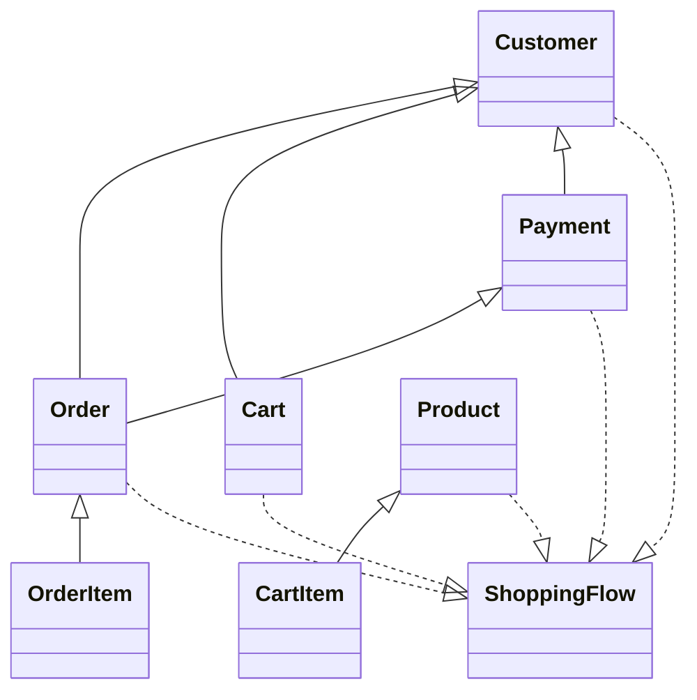
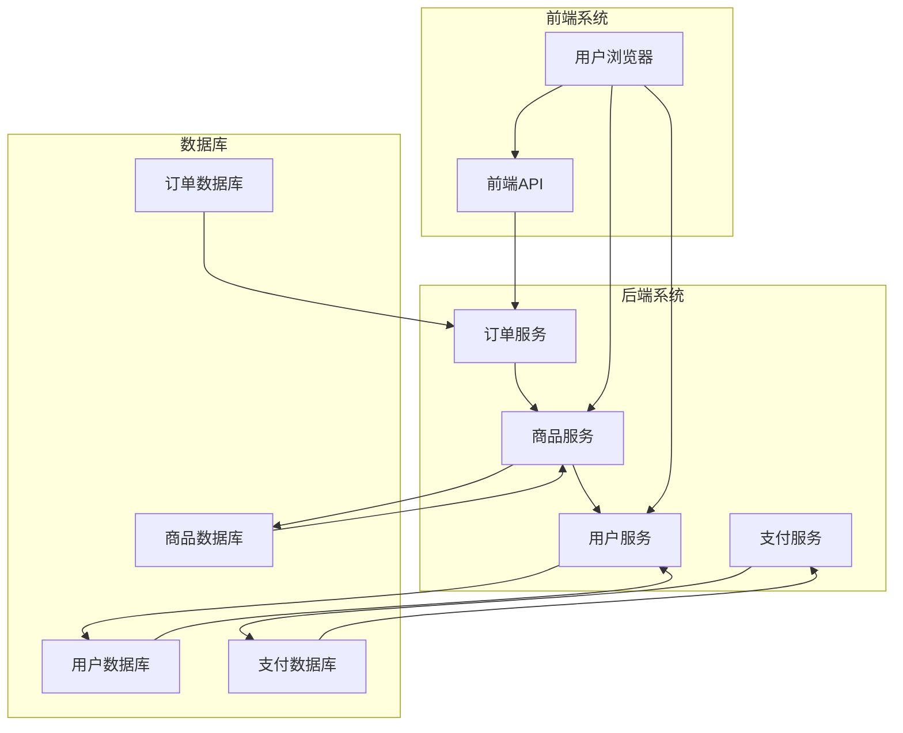
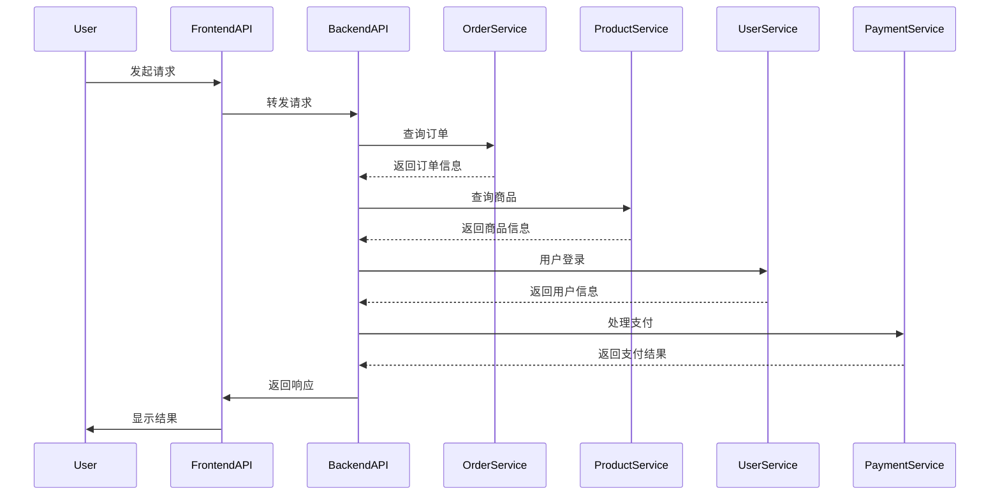
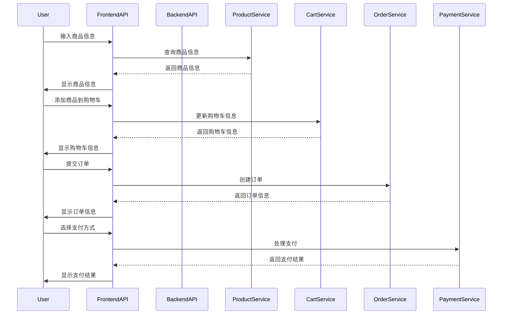

                 


### 第1章：技术leader的角色与思维模型概述

#### 1.1 技术leader的角色与职责

在今天的科技行业中，技术leader的角色至关重要。他们不仅需要拥有深厚的技术背景，还需要具备卓越的领导能力和决策能力。技术leader在公司中扮演着多重角色，主要包括以下几个方面：

1. **技术方向规划者**：技术leader负责制定公司技术战略，确定技术发展路径，确保团队的工作与公司的长期目标一致。

2. **团队领导者**：技术leader需要带领团队，培养团队成员的技术能力和职业素养，营造积极向上的团队文化。

3. **决策者**：在项目开发和团队管理过程中，技术leader需要做出关键决策，如技术选型、项目优先级排序等。

4. **沟通桥梁**：技术leader需要与公司其他部门进行有效沟通，确保技术团队的工作与其他部门的需求无缝对接。

#### 1.1.1 技术leader在公司中的定位

技术leader在公司中的定位至关重要。他们通常位于公司的中高层管理职位，直接向CTO或CEO汇报工作。以下是技术leader在公司中的几个关键定位：

1. **技术核心**：技术leader是公司技术领域的核心人物，他们的专业判断和技术能力直接影响公司的技术发展和市场竞争力。

2. **战略决策者**：技术leader参与公司战略决策，确保技术发展方向与公司业务目标相匹配。

3. **团队领导**：技术leader负责领导技术团队，确保团队能够高效地完成项目任务。

4. **跨部门协调者**：技术leader需要与市场、销售、运营等各部门保持紧密合作，确保技术团队的成果能够有效地转化为商业价值。

#### 1.1.2 技术leader的核心职责

技术leader的核心职责主要包括以下几个方面：

1. **技术决策**：技术leader负责制定技术路线图，选择合适的技术方案，确保团队能够高效地开发和交付产品。

2. **团队管理**：技术leader需要管理团队，包括人员调配、绩效考核、职业发展等，确保团队能够保持高效运作。

3. **项目管理**：技术leader负责项目管理，确保项目按时、按质、按预算完成，解决项目开发过程中的技术难题。

4. **技术培训**：技术leader需要定期组织技术培训，提升团队的技术水平，促进团队的技术进步。

5. **沟通协调**：技术leader需要与公司其他部门保持良好沟通，确保技术团队的成果能够得到有效利用。

#### 1.1.3 技术leader面临的挑战

技术leader在日常工作中面临着诸多挑战，主要包括以下几个方面：

1. **技术更新速度快**：技术leader需要不断学习新技术，确保团队能够跟上技术发展的步伐。

2. **项目压力**：技术leader需要应对各种项目压力，如项目延期、预算超支等，确保项目能够顺利完成。

3. **团队管理难题**：技术leader需要管理不同背景、不同能力的团队成员，确保团队能够高效协作。

4. **业务需求变化**：技术leader需要快速响应业务需求变化，调整技术方向和团队策略。

#### 1.2 思维模型的概念与应用

思维模型是一种抽象的思考方式，它帮助人们理解世界、分析问题和做出决策。在技术leader的日常工作中，思维模型的应用至关重要。以下是对思维模型的基本概念和应用进行详细介绍。

##### 1.2.1 什么是思维模型

思维模型是指人们根据经验、知识和逻辑推理所形成的一种抽象思维方式。它通常包括以下特点：

1. **抽象性**：思维模型是对现实世界的简化，它忽略了无关紧要的细节，专注于核心问题。

2. **逻辑性**：思维模型遵循逻辑推理的规律，从已知的信息出发，逐步推导出新的结论。

3. **可扩展性**：思维模型可以随着新知识和新经验的积累而不断更新和扩展。

##### 1.2.2 思维模型的作用

思维模型在技术leader的日常工作中具有重要作用，主要包括以下几个方面：

1. **决策辅助**：思维模型可以帮助技术leader更好地分析问题，制定策略，做出合理的决策。

2. **问题解决**：思维模型提供了一种系统化的方法，帮助技术leader识别问题、分析问题并解决问题。

3. **知识整合**：思维模型可以帮助技术leader将零散的知识点整合成一个完整的体系，提高知识的应用效率。

4. **团队协作**：思维模型可以作为一种共同的语言，帮助团队成员更好地沟通和协作。

##### 1.2.3 技术leader如何运用思维模型

技术leader在运用思维模型时，可以采取以下几种策略：

1. **系统化思考**：技术leader应该学会从整体出发，分析系统的各个组成部分及其相互作用，以系统化的思维方式来管理项目和团队。

2. **模型化思维**：技术leader可以将复杂的问题抽象成简单的模型，通过模型来分析和解决实际问题。

3. **批判性思维**：技术leader应该具备批判性思维，对现有的思维模型进行评估和优化，避免思维定式。

4. **创新思维**：技术leader应该鼓励团队成员进行创新思维，通过不同的视角和方法来解决问题。

#### 1.3 本书的核心思维模型

本书旨在帮助技术leader掌握和应用一系列核心思维模型，主要包括以下几种：

1. **创新思维模型**：帮助技术leader在快速变化的环境中识别机会、创造价值。

2. **决策思维模型**：帮助技术leader在复杂决策中保持冷静、做出明智的选择。

3. **团队管理思维模型**：帮助技术leader有效管理团队，提升团队绩效。

4. **项目执行思维模型**：帮助技术leader确保项目按时、按质、按预算完成。

通过这些思维模型，技术leader可以更好地应对挑战，实现个人和团队的目标。

#### 1.4 思维模型的应用场景

思维模型在技术leader的日常工作中有着广泛的应用场景，以下是几个典型的应用场景：

1. **技术决策**：技术leader在面对技术选择时，可以运用创新思维模型来评估不同技术的优缺点，做出最佳决策。

2. **团队管理**：技术leader在团队管理中，可以使用团队管理思维模型来识别团队成员的优劣势，制定合适的激励和培训策略。

3. **项目执行**：技术leader在项目执行过程中，可以运用项目执行思维模型来识别项目风险、制定风险管理计划。

4. **战略规划**：技术leader在公司战略规划中，可以运用决策思维模型来评估不同战略方案的风险和收益。

#### 1.5 本章小结

本章介绍了技术leader的角色与职责，以及思维模型的概念和应用。技术leader在公司中扮演着多重角色，包括技术方向规划者、团队领导者、决策者和沟通桥梁。思维模型是一种抽象的思考方式，它可以帮助技术leader更好地分析问题、做出决策和解决问题。本书的核心思维模型包括创新思维模型、决策思维模型、团队管理思维模型和项目执行思维模型。这些思维模型在技术leader的日常工作中有着广泛的应用场景。

----------------------------------------------------------------

### 第2章：核心概念详解与联系

#### 2.1 创新思维模型

创新思维模型是技术leader在应对快速变化的市场和技术环境时不可或缺的工具。它帮助技术leader发现新的机会、创造新的价值和推动公司的持续发展。

##### 2.1.1 创新思维模型概述

创新思维模型是一种基于系统性思考和创造性的方法，它可以帮助技术leader在复杂的环境中识别创新机会，并制定相应的创新策略。这种模型通常包括以下几个关键要素：

1. **需求识别**：通过对市场、用户和技术的深入分析，识别出潜在的需求和机会。

2. **创意生成**：利用各种创新方法，如头脑风暴、思维导图等，生成多个可能的创新方案。

3. **创意筛选**：对生成的创意进行评估和筛选，选择最有潜力的方案进行深入开发。

4. **原型设计**：构建创新的原型，通过实验和测试来验证其可行性和市场接受度。

5. **实施与推广**：将创新方案转化为实际产品或服务，并推广到市场。

##### 2.1.2 创新思维模型的属性与特征

创新思维模型具有以下属性和特征：

1. **系统性**：创新思维模型是一种系统化的思考方式，它涵盖了从需求识别到实施与推广的整个过程。

2. **灵活性**：创新思维模型可以根据不同的情况和需求进行调整和优化，具有很强的适应性。

3. **创造性**：创新思维模型鼓励创造性和想象力，通过不同的视角和方法来解决问题。

4. **实验性**：创新思维模型强调通过实验和测试来验证创新方案的可行性和市场接受度。

##### 2.1.3 创新思维模型的应用

创新思维模型在技术leader的日常工作中有着广泛的应用场景，以下是一些典型的应用实例：

1. **产品开发**：在产品开发过程中，技术leader可以运用创新思维模型来识别用户需求，生成创新的产品方案，并进行原型设计和测试。

2. **技术选型**：在面对多种技术选择时，技术leader可以运用创新思维模型来评估不同技术的优缺点，选择最适合的技术方案。

3. **战略规划**：在制定公司战略规划时，技术leader可以运用创新思维模型来识别市场机会，制定创新性的战略方案。

4. **团队激励**：技术leader可以通过创新思维模型来激发团队的创造力和创新意识，提升团队的整体绩效。

##### 2.1.4 创新思维模型与其他思维模型的联系

创新思维模型与其他思维模型之间存在密切的联系，这些联系体现在以下几个方面：

1. **与决策思维模型的联系**：创新思维模型和决策思维模型在决策过程中相互补充。创新思维模型帮助技术leader识别创新机会，而决策思维模型则帮助技术leader在多个创新方案中做出最佳选择。

2. **与团队管理思维模型的联系**：创新思维模型可以帮助技术leader激发团队的创造力和创新意识，而团队管理思维模型则帮助技术leader有效地管理团队，提升团队的创新能力和绩效。

3. **与项目执行思维模型的联系**：创新思维模型和项目执行思维模型在项目执行过程中相互支持。创新思维模型帮助技术leader制定创新性的项目方案，而项目执行思维模型则帮助技术leader确保项目按时、按质、按预算完成。

#### 2.2 决策思维模型

决策思维模型是技术leader在面对复杂决策时的重要工具。它帮助技术leader系统化地分析问题、评估风险和收益，并做出明智的决策。

##### 2.2.1 决策思维模型概述

决策思维模型是一种基于逻辑分析和理性思考的方法，它帮助技术leader在复杂的环境中做出明智的决策。这种模型通常包括以下几个关键要素：

1. **问题定义**：明确决策问题，界定决策的范围和目标。

2. **信息收集**：收集与决策相关的信息，包括市场数据、用户反馈、技术分析等。

3. **评估标准**：制定评估决策的准则和标准，如成本效益、风险程度、市场潜力等。

4. **方案评估**：对不同的决策方案进行评估和比较，选择最优方案。

5. **决策实施**：制定决策实施计划，并跟踪执行情况。

##### 2.2.2 决策思维模型的属性与特征

决策思维模型具有以下属性和特征：

1. **逻辑性**：决策思维模型遵循逻辑推理的规律，从已知的信息出发，逐步推导出决策结论。

2. **系统性**：决策思维模型是一个系统化的思考过程，涵盖了从问题定义到决策实施的各个环节。

3. **客观性**：决策思维模型强调基于客观事实和数据进行分析，避免主观偏见。

4. **灵活性**：决策思维模型可以根据不同的决策问题和情境进行调整和优化。

##### 2.2.3 决策思维模型的应用

决策思维模型在技术leader的日常工作中有着广泛的应用场景，以下是一些典型的应用实例：

1. **项目立项**：在项目立项阶段，技术leader可以运用决策思维模型来评估项目的可行性、市场前景和潜在风险。

2. **技术选型**：在技术选型过程中，技术leader可以运用决策思维模型来比较不同技术的优缺点，选择最佳的技术方案。

3. **资源分配**：在资源有限的情况下，技术leader可以运用决策思维模型来优化资源分配，确保项目资源的最优利用。

4. **风险管理**：在项目执行过程中，技术leader可以运用决策思维模型来识别和评估项目风险，制定相应的风险管理策略。

##### 2.2.4 决策思维模型与其他思维模型的联系

决策思维模型与其他思维模型之间存在密切的联系，这些联系体现在以下几个方面：

1. **与创新思维模型的联系**：决策思维模型和
```markdown
### 2.2.4 决策思维模型与其他思维模型的联系

决策思维模型与其他思维模型之间存在密切的联系，这些联系体现在以下几个方面：

1. **与创新思维模型的联系**：决策思维模型和
创新思维模型在决策过程中相互补充。创新思维模型帮助技术leader识别创新机会，而决策思维模型则帮助技术leader在多个创新方案中做出最佳选择。

2. **与团队管理思维模型的联系**：决策思维模型和团队管理思维模型在团队管理和决策过程中相互支持。决策思维模型帮助技术leader在团队中做出合理的决策，而团队管理思维模型则帮助技术leader确保团队在执行决策时保持高效和协同。

3. **与项目执行思维模型的联系**：决策思维模型和项目执行思维模型在项目管理和执行过程中相互补充。决策思维模型帮助技术leader在项目初期做出明智的决策，而项目执行思维模型则帮助技术leader确保项目在执行过程中能够按时、按质完成。

#### 2.3 团队管理思维模型

团队管理思维模型是技术leader在团队管理过程中不可或缺的工具。它帮助技术leader理解团队行为、激发团队潜能、提升团队绩效。

##### 2.3.1 团队管理思维模型概述

团队管理思维模型是一种基于心理学、行为科学和领导力理论的思考方式，它帮助技术leader有效地管理团队。这种模型通常包括以下几个关键要素：

1. **团队建设**：建立团队的共同目标和价值观，增强团队凝聚力。

2. **人员配置**：根据团队成员的能力和特长，合理分配任务和角色。

3. **激励与反馈**：制定有效的激励机制，对团队成员的表现进行及时反馈。

4. **沟通与协作**：建立良好的沟通机制，促进团队成员之间的协作。

5. **冲突解决**：处理团队内部和外部的冲突，确保团队和谐稳定。

##### 2.3.2 团队管理思维模型的属性与特征

团队管理思维模型具有以下属性和特征：

1. **系统性**：团队管理思维模型是一个系统化的思考过程，涵盖了从团队建设到冲突解决的各个环节。

2. **灵活性**：团队管理思维模型可以根据不同的团队情境和成员特点进行调整和优化。

3. **人性关怀**：团队管理思维模型强调对团队成员的人性关怀，关注团队成员的心理需求和职业发展。

4. **持续改进**：团队管理思维模型鼓励团队不断反思和改进，提升团队的管理水平和绩效。

##### 2.3.3 团队管理思维模型的应用

团队管理思维模型在技术leader的日常工作中有着广泛的应用场景，以下是一些典型的应用实例：

1. **组建团队**：在组建新团队时，技术leader可以运用团队管理思维模型来明确团队目标、制定团队价值观和规划团队结构。

2. **人员调配**：在项目执行过程中，技术leader可以运用团队管理思维模型来合理分配任务，确保团队成员的能力和特长得到充分发挥。

3. **激励机制**：技术leader可以运用团队管理思维模型来设计激励机制，激励团队成员的工作积极性和创造力。

4. **团队冲突处理**：在团队内部出现冲突时，技术leader可以运用团队管理思维模型来分析冲突原因、寻找解决方案，并确保团队恢复正常运作。

##### 2.3.4 团队管理思维模型与其他思维模型的联系

团队管理思维模型与其他思维模型之间存在密切的联系，这些联系体现在以下几个方面：

1. **与创新思维模型的联系**：团队管理思维模型和创新思维模型相互促进。创新思维模型激发团队的创造力和创新意识，而团队管理思维模型则帮助技术leader有效地管理和引导团队的创新过程。

2. **与项目执行思维模型的联系**：团队管理思维模型和项目执行思维模型在项目执行过程中相互支持。团队管理思维模型帮助技术leader确保团队在项目执行中保持高效和协同，而项目执行思维模型则帮助技术leader确保项目按时、按质完成。

3. **与决策思维模型的联系**：团队管理思维模型和决策思维模型在团队管理和决策过程中相互补充。决策思维模型帮助技术leader在团队管理中做出合理的决策，而团队管理思维模型则帮助技术leader确保决策能够得到有效执行。

#### 2.4 项目执行思维模型

项目执行思维模型是技术leader在项目执行过程中不可或缺的工具。它帮助技术leader理解项目进展、识别风险和问题，并采取有效的措施确保项目顺利执行。

##### 2.4.1 项目执行思维模型概述

项目执行思维模型是一种基于项目管理理论和实践经验的思考方式，它帮助技术leader在项目执行过程中保持清晰的方向和高效的执行。这种模型通常包括以下几个关键要素：

1. **项目计划**：制定详细的项目计划，包括项目目标、任务分解、时间表和资源分配。

2. **进度跟踪**：监控项目进展，识别偏差，及时调整计划。

3. **风险管理**：识别项目风险，制定风险应对策略，降低风险对项目的影响。

4. **问题解决**：及时识别和解决项目执行过程中出现的问题，确保项目顺利进行。

5. **团队协作**：建立有效的沟通和协作机制，确保团队成员之间的信息共享和协作。

##### 2.4.2 项目执行思维模型的属性与特征

项目执行思维模型具有以下属性和特征：

1. **系统性**：项目执行思维模型是一个系统化的思考过程，涵盖了从项目计划到团队协作的各个环节。

2. **灵活性**：项目执行思维模型可以根据项目特点和需求进行调整和优化，确保项目的灵活性和适应性。

3. **前瞻性**：项目执行思维模型强调提前识别和应对项目风险，降低项目风险对项目进度和成果的影响。

4. **协同性**：项目执行思维模型强调团队成员之间的协作和沟通，确保项目目标的实现。

##### 2.4.3 项目执行思维模型的应用

项目执行思维模型在技术leader的日常工作中有着广泛的应用场景，以下是一些典型的应用实例：

1. **项目启动**：在项目启动阶段，技术leader可以运用项目执行思维模型来制定项目计划、分配资源，确保项目能够按时启动。

2. **项目监控**：在项目执行过程中，技术leader可以运用项目执行思维模型来监控项目进展，及时识别偏差，并采取相应的调整措施。

3. **风险控制**：在项目执行过程中，技术leader可以运用项目执行思维模型来识别项目风险，制定风险应对策略，降低风险对项目的影响。

4. **问题解决**：在项目执行过程中，技术leader可以运用项目执行思维模型来及时识别和解决项目中的问题，确保项目顺利进行。

##### 2.4.4 项目执行思维模型与其他思维模型的联系

项目执行思维模型与其他思维模型之间存在密切的联系，这些联系体现在以下几个方面：

1. **与决策思维模型的联系**：项目执行思维模型和决策思维模型在项目决策和执行过程中相互补充。决策思维模型帮助技术leader在项目启动阶段做出合理的决策，而项目执行思维模型则帮助技术leader确保项目在执行过程中能够按照决策顺利进行。

2. **与团队管理思维模型的联系**：项目执行思维模型和团队管理思维模型在团队管理和项目执行过程中相互支持。团队管理思维模型帮助技术leader确保团队在项目执行中保持高效和协同，而项目执行思维模型则帮助技术leader确保项目目标的实现。

3. **与创新思维模型的联系**：项目执行思维模型和创新思维模型在项目创新和执行过程中相互促进。创新思维模型激发项目的创新性和创造力，而项目执行思维模型则帮助技术leader确保创新方案能够得到有效执行。

#### 2.5 本章小结

本章详细介绍了创新思维模型、决策思维模型、团队管理思维模型和项目执行思维模型。这些思维模型是技术leader在应对复杂工作环境、提升团队绩效和确保项目成功的关键工具。通过理解并运用这些思维模型，技术leader可以更好地规划和管理技术项目，提升团队的创新能力和执行效率。在后续章节中，我们将进一步探讨这些思维模型的具体应用和实践方法。
```markdown

### 2.5.1 概述

在技术leader的职业生涯中，掌握并运用多样化的思维模型至关重要。这些模型不仅帮助技术leader更好地理解和分析问题，还指导他们做出明智的决策，提升团队绩效和项目成功率。本章内容涵盖了创新思维模型、决策思维模型、团队管理思维模型和项目执行思维模型，这些模型是技术leader在管理和技术决策中不可或缺的工具。

**创新思维模型**专注于如何在快速变化的市场环境中发现机会、创造价值。它通过系统性思考和创造性方法，帮助技术leader识别需求、生成创意、筛选方案并实施创新。在技术leader的角色中，创新思维模型有助于推动产品开发、技术选型和战略规划。

**决策思维模型**则关注技术leader在面对复杂决策时的逻辑分析和理性思考。通过定义问题、收集信息、评估标准和方案评估，技术leader能够做出更加明智的决策。这一模型在项目立项、资源分配和技术选型等场景中具有重要应用。

**团队管理思维模型**聚焦于如何构建和管理高效团队。技术leader需要关注团队建设、人员配置、激励与反馈、沟通与协作以及冲突解决。这一模型帮助技术leader提升团队凝聚力、激发团队潜能，并在团队管理中保持人性关怀和持续改进。

**项目执行思维模型**则提供了在项目执行过程中的系统化方法。技术leader需要通过项目计划、进度跟踪、风险管理和问题解决，确保项目能够按时、按质、按预算完成。这一模型在项目监控、风险控制和问题解决中起到关键作用。

### 2.5.2 关键概念与联系

以下表格展示了这四种思维模型的关键概念及其相互之间的联系：

| 思维模型       | 关键概念                   | 相互联系                                       |
|--------------|--------------------------|--------------------------------------------|
| 创新思维模型     | 需求识别、创意生成、方案评估、实施与推广 | 与决策思维模型相互补充，共同支持创新方案的落地               |
| 决策思维模型     | 问题定义、信息收集、评估标准、方案评估   | 与项目执行思维模型结合，确保决策的有效执行                 |
| 团队管理思维模型   | 团队建设、人员配置、激励与反馈、沟通与协作、冲突解决 | 与创新思维模型结合，激发团队的创造力和创新意识；与项目执行思维模型结合，确保团队高效执行项目 |
| 项目执行思维模型   | 项目计划、进度跟踪、风险管理、问题解决     | 与决策思维模型结合，确保项目按照决策顺利执行；与团队管理思维模型结合，确保团队在项目中的高效协作 |

### 2.5.3 本章小结

本章详细介绍了创新思维模型、决策思维模型、团队管理思维模型和项目执行思维模型，这些思维模型是技术leader在职业生涯中不可或缺的工具。通过理解并运用这些模型，技术leader可以更好地管理团队、做出明智的决策并确保项目的成功。在接下来的章节中，我们将深入探讨这些思维模型的具体应用和实践方法，帮助技术leader在实际工作中发挥更大作用。

----------------------------------------------------------------

### 第3章：算法原理讲解

在《技术leader的思维模型》一书中，作者详细阐述了多个核心算法原理，这些算法原理在技术leader的决策和项目执行中起着关键作用。本章节将使用Mermaid流程图和Python源代码来详细阐述这些算法原理，并提供相应的数学模型和公式。

#### 3.1 算法原理概述

书中涉及的算法原理主要包括以下几种：

1. **决策树算法**：用于分类和回归问题，通过构建决策树模型来对数据进行分类或预测。
2. **K均值聚类算法**：用于数据聚类，通过将数据点分配到不同的簇中，以实现数据分组。
3. **遗传算法**：用于优化问题，通过模拟自然进化过程来寻找最优解。
4. **线性回归算法**：用于回归分析，通过建立线性模型来预测连续变量。
5. **支持向量机（SVM）**：用于分类问题，通过寻找最佳超平面来对数据进行分类。

#### 3.2 决策树算法

决策树算法是一种常用的机器学习算法，它通过构建树形模型来实现数据的分类和回归。以下是一个简单的决策树算法的Mermaid流程图：

```mermaid
graph TD
A[开始] --> B[选择特征]
B -->|计算信息增益| C[构建子树]
C -->|递归] D[结束]
```

决策树算法的核心在于如何选择特征。通常，算法会计算每个特征的信息增益，选择信息增益最大的特征作为分割标准。以下是一个简单的Python代码示例，用于计算特征的信息增益：

```python
import numpy as np

def entropy(y):
    hist = np.histogram(y, bins=2)[0]
    p = hist / len(y)
    return -np.sum(p * np.log2(p))

def info_gain(x, y):
    feature_entropy = entropy(x)
    for label in np.unique(x):
        sub_y = y[x == label]
        feature_entropy -= len(sub_y) / len(x) * entropy(sub_y)
    return feature_entropy

# 示例数据
X = np.array([0, 0, 1, 1, 1, 0])
Y = np.array([0, 0, 1, 1, 1, 1])

# 计算信息增益
print(info_gain(X, Y))
```

#### 3.3 K均值聚类算法

K均值聚类算法是一种基于距离度量的聚类算法，它通过迭代的方式将数据点分配到K个簇中。以下是一个简单的K均值聚类算法的Mermaid流程图：

```mermaid
graph TD
A[初始化聚类中心] --> B[计算距离]
B -->|最小化平方误差] C[更新聚类中心]
C -->|收敛条件] D[结束]
```

算法的收敛条件可以是聚类中心的变化小于某个阈值或者迭代的次数达到最大值。以下是一个简单的Python代码示例，用于实现K均值聚类算法：

```python
import numpy as np

def euclidean_distance(x, y):
    return np.sqrt(np.sum((x - y) ** 2))

def kmeans(X, K, max_iters=100, tolerance=1e-4):
    centroids = X[np.random.choice(X.shape[0], K, replace=False)]
    for _ in range(max_iters):
        labels = np.argmin([euclidean_distance(x, c) for c in centroids], axis=0)
        new_centroids = np.array([X[labels == k].mean(axis=0) for k in range(K)])
        if np.linalg.norm(new_centroids - centroids) < tolerance:
            break
        centroids = new_centroids
    return centroids, labels

# 示例数据
X = np.random.rand(100, 2)
K = 3

# 运行K均值聚类算法
centroids, labels = kmeans(X, K)
```

#### 3.4 遗传算法

遗传算法是一种基于自然进化过程的优化算法，它通过模拟进化过程来寻找最优解。以下是一个简单的遗传算法的Mermaid流程图：

```mermaid
graph TD
A[初始化种群] --> B[适应度评估]
B -->|选择] C[交叉]
C -->|变异] D[更新种群]
D -->|迭代条件] E[结束]
```

遗传算法的核心在于适应度评估、选择、交叉和变异。以下是一个简单的Python代码示例，用于实现遗传算法：

```python
import numpy as np

def fitness(population, target):
    return np.sum(np.abs(population - target))

def select(population, fitness_scores, selection_rate=0.1):
    mating_pool = np.array([population[np.argmax(fitness_scores[i])] for i in range(len(population))])
    return mating_pool

def crossover(parent1, parent2):
    crossover_point = np.random.randint(0, len(parent1))
    return (parent1[:crossover_point] + parent2[crossover_point:]).flatten()

def mutate(child, mutation_rate=0.01):
    child = child.copy()
    for i in range(len(child)):
        if np.random.rand() < mutation_rate:
            child[i] = np.random.rand()
    return child

def genetic_algorithm(population, target, max_iters=100, mutation_rate=0.01):
    for _ in range(max_iters):
        fitness_scores = fitness(population, target)
        mating_pool = select(population, fitness_scores)
        next_generation = []
        for _ in range(len(population) // 2):
            parent1, parent2 = mating_pool[np.random.randint(0, len(mating_pool)), np.random.randint(0, len(mating_pool))]
            child1 = crossover(parent1, parent2)
            child2 = crossover(parent1, parent2)
            next_generation.extend([mutate(child1, mutation_rate), mutate(child2, mutation_rate)])
        population = np.array(next_generation)
    return population[np.argmax(fitness_scores)]

# 示例数据
population = np.random.rand(100, 1)
target = np.array([0.5])

# 运行遗传算法
result = genetic_algorithm(population, target)
```

#### 3.5 线性回归算法

线性回归算法是一种用于建立线性关系的预测模型。它通过最小化预测误差来找到最佳拟合线。以下是一个简单的线性回归算法的Mermaid流程图：

```mermaid
graph TD
A[计算协方差矩阵] --> B[计算逆矩阵]
B -->|计算回归系数] C[计算预测值]
C -->|最小化预测误差] D[结束]
```

线性回归算法的数学模型为：

$$
y = \beta_0 + \beta_1x
$$

其中，$\beta_0$和$\beta_1$是回归系数。以下是一个简单的Python代码示例，用于实现线性回归算法：

```python
import numpy as np

def least_squares(x, y):
    X = np.column_stack([np.ones(len(x)), x])
    theta = np.linalg.inv(X.T.dot(X)).dot(X.T).dot(y)
    return theta

# 示例数据
x = np.array([1, 2, 3, 4, 5])
y = np.array([2, 4, 5, 4, 5])

# 计算回归系数
theta = least_squares(x, y)
print("回归系数：", theta)
```

#### 3.6 支持向量机（SVM）

支持向量机（SVM）是一种强大的分类算法，它通过寻找最佳超平面来对数据进行分类。以下是一个简单的SVM算法的Mermaid流程图：

```mermaid
graph TD
A[计算核函数] --> B[构建最优超平面]
B -->|分类决策] C[结束]
```

SVM的数学模型为：

$$
\min \frac{1}{2} \sum_{i=1}^{n} \alpha_i (y_i - \sum_{j=1}^{n} \alpha_j y_j K(x_i, x_j)) \\
s.t. \quad \alpha_i \geq 0, \quad \sum_{i=1}^{n} \alpha_i y_i = 0
$$

其中，$K(x_i, x_j)$是核函数。以下是一个简单的Python代码示例，用于实现SVM：

```python
from sklearn.svm import SVC

# 示例数据
x = np.array([[1, 1], [2, 2], [3, 3], [4, 4], [5, 5], [6, 6]])
y = np.array([0, 0, 1, 1, 0, 0])

# 使用SVM进行分类
clf = SVC(kernel='linear')
clf.fit(x, y)
print("分类结果：", clf.predict([[2.5, 2.5]]))
```

通过以上讲解和示例，我们可以看到这些算法原理在技术leader的决策和项目执行中起着重要作用。接下来，我们将进一步探讨这些算法原理的数学模型和公式，并进行详细的讲解和举例说明。

----------------------------------------------------------------

### 第4章：数学模型和数学公式 & 详细讲解 & 举例说明

在技术leader的决策和项目执行中，数学模型和数学公式是不可或缺的工具。它们帮助我们更准确地描述问题、分析数据和做出决策。本章将详细介绍书中涉及的核心数学模型和公式，并使用LaTeX格式进行表示，同时提供详细讲解和通俗易懂的举例说明。

#### 4.1 决策树算法的数学模型

决策树算法的核心是选择最佳分割特征，这通常通过计算信息增益来实现。信息增益的数学公式如下：

$$
IG(D, A) = H(D) - \sum_{v \in \text{Values}(A)} \frac{|D[A = v]|}{|D|} H(D[A = v])
$$

其中，$IG(D, A)$表示特征A对数据集D的信息增益，$H(D)$表示数据集D的熵，$|D|$表示数据集D的样本数，$v$表示特征A的取值，$|D[A = v]|$表示数据集D中特征A取值为$v$的样本数，$H(D[A = v])$表示条件熵。

**举例说明**：

假设我们有以下数据集D，其中包含两个特征A和B，以及目标变量Y：

| A | B | Y |
|---|---|---|
| 0 | 0 | 0 |
| 0 | 1 | 1 |
| 1 | 0 | 1 |
| 1 | 1 | 0 |

首先计算数据集D的熵：

$$
H(D) = -\sum_{y \in \text{Values}(Y)} \frac{|D[Y = y]|}{|D|} \log_2 \frac{|D[Y = y]|}{|D|}
$$

$$
H(D) = -\left(\frac{3}{4} \log_2 \frac{3}{4} + \frac{1}{4} \log_2 \frac{1}{4}\right) \approx 0.811
$$

然后计算每个特征的信息增益：

$$
IG(D, A) = H(D) - \sum_{v \in \text{Values}(A)} \frac{|D[A = v]|}{|D|} H(D[A = v])
$$

$$
IG(D, A) = 0.811 - \left(\frac{2}{4} \left(1 - \frac{1}{2} \log_2 \frac{1}{2}\right) + \frac{2}{4} \left(1 - \frac{1}{2} \log_2 \frac{1}{2}\right)\right) \approx 0.328
$$

$$
IG(D, B) = H(D) - \sum_{v \in \text{Values}(B)} \frac{|D[B = v]|}{|D|} H(D[B = v])
$$

$$
IG(D, B) = 0.811 - \left(\frac{2}{4} \left(1 - \frac{1}{2} \log_2 \frac{1}{2}\right) + \frac{2}{4} \left(1 - \frac{1}{2} \log_2 \frac{1}{2}\right)\right) \approx 0.328
$$

由于$IG(D, A) = IG(D, B)$，我们可以选择任一特征作为分割特征。

#### 4.2 K均值聚类算法的数学模型

K均值聚类算法的核心是计算聚类中心并更新聚类中心，以达到最小化平方误差。平方误差的数学公式如下：

$$
J(\mu) = \frac{1}{n} \sum_{i=1}^{n} ||x_i - \mu_i||^2
$$

其中，$J(\mu)$表示平方误差，$\mu_i$表示聚类中心，$x_i$表示数据点，$n$表示数据点的个数。

**举例说明**：

假设我们有以下数据点：

| x1 | x2 |
|---|---|
| 1 | 2 |
| 1 | 2 |
| 2 | 1 |
| 2 | 1 |

初始时，我们随机选择两个聚类中心：

| \mu1_x | \mu1_y | \mu2_x | \mu2_y |
|---|---|---|---|
| 1 | 1 | 2 | 1 |

计算每个数据点到聚类中心的距离：

$$
d(x_i, \mu_j) = \sqrt{(x_i^1 - \mu_j^1)^2 + (x_i^2 - \mu_j^2)^2}
$$

然后，我们将每个数据点分配到最近的聚类中心：

| x1 | x2 | Cluster |
|---|---|--------|
| 1 | 2 | 1      |
| 1 | 2 | 1      |
| 2 | 1 | 2      |
| 2 | 1 | 2      |

更新聚类中心：

$$
\mu_j^1 = \frac{\sum_{i \in C_j} x_i^1}{|C_j|}
$$

$$
\mu_j^2 = \frac{\sum_{i \in C_j} x_i^2}{|C_j|}
$$

计算新的聚类中心：

| \mu1_x | \mu1_y | \mu2_x | \mu2_y |
|---|---|---|---|
| 1.5 | 1.5 | 2 | 1 |

重复以上过程，直到聚类中心的变化小于某个阈值或达到最大迭代次数。

#### 4.3 遗传算法的数学模型

遗传算法的核心是适应度评估、选择、交叉和变异。适应度评估的数学公式如下：

$$
f(x) = \sum_{i=1}^{n} w_i x_i
$$

其中，$f(x)$表示适应度，$w_i$表示权重，$x_i$表示基因值。

**举例说明**：

假设我们有以下基因值和权重：

| x1 | x2 | x3 |
|---|---|---|
| 0 | 1 | 0 |
| 1 | 1 | 1 |
| 0 | 0 | 1 |

权重分别为：

| w1 | w2 | w3 |
|---|---|---|
| 1 | 1 | 1 |

计算适应度：

$$
f(x_1) = 1 \cdot 0 + 1 \cdot 1 + 1 \cdot 0 = 1
$$

$$
f(x_2) = 1 \cdot 1 + 1 \cdot 1 + 1 \cdot 1 = 3
$$

$$
f(x_3) = 1 \cdot 0 + 1 \cdot 0 + 1 \cdot 1 = 1
$$

选择适应度最高的个体进行交叉和变异操作。

#### 4.4 线性回归算法的数学模型

线性回归算法的核心是寻找最佳拟合线，这通常通过最小化预测误差来实现。预测误差的数学公式如下：

$$
SSR = \sum_{i=1}^{n} (y_i - \hat{y}_i)^2
$$

其中，$SSR$表示残差平方和，$y_i$表示实际值，$\hat{y}_i$表示预测值。

**举例说明**：

假设我们有以下数据点：

| x | y |
|---|---|
| 1 | 2 |
| 2 | 4 |
| 3 | 5 |
| 4 | 4 |
| 5 | 5 |

首先，计算回归系数：

$$
\beta_0 = \bar{y} - \beta_1 \bar{x}
$$

$$
\beta_1 = \frac{\sum_{i=1}^{n} (x_i - \bar{x})(y_i - \bar{y})}{\sum_{i=1}^{n} (x_i - \bar{x})^2}
$$

计算均值：

$$
\bar{x} = \frac{1}{n} \sum_{i=1}^{n} x_i = \frac{1+2+3+4+5}{5} = 3
$$

$$
\bar{y} = \frac{1}{n} \sum_{i=1}^{n} y_i = \frac{2+4+5+4+5}{5} = 4
$$

计算回归系数：

$$
\beta_1 = \frac{(1-3)(2-4) + (2-3)(4-4) + (3-3)(5-4) + (4-3)(4-4) + (5-3)(5-4)}{(1-3)^2 + (2-3)^2 + (3-3)^2 + (4-3)^2 + (5-3)^2}
$$

$$
\beta_1 = \frac{(-2)(-2) + (-1)(0) + (0)(1) + (1)(0) + (2)(1)}{4 + 1 + 0 + 1 + 4}
$$

$$
\beta_1 = \frac{4 + 0 + 0 + 0 + 2}{10} = 0.6
$$

$$
\beta_0 = 4 - 0.6 \cdot 3 = 1.2
$$

计算预测值：

$$
\hat{y}_i = \beta_0 + \beta_1 x_i
$$

然后，计算残差平方和：

$$
SSR = \sum_{i=1}^{n} (y_i - \hat{y}_i)^2
$$

通过以上计算，我们可以得到最佳拟合线。

#### 4.5 支持向量机（SVM）的数学模型

支持向量机（SVM）的核心是寻找最佳超平面，这通常通过求解最优化问题来实现。最优化问题的数学公式如下：

$$
\min \frac{1}{2} \sum_{i=1}^{n} \alpha_i (\alpha_i - 2C) \\
s.t. \quad y_i (\alpha_i - 1) \geq 0, \quad \alpha_i \geq 0
$$

其中，$\alpha_i$表示拉格朗日乘子，$C$表示惩罚参数。

**举例说明**：

假设我们有以下数据点和标签：

| x1 | x2 | y |
|---|---|---|
| 1 | 1 | 1 |
| 2 | 2 | 1 |
| 3 | 3 | 1 |
| 4 | 4 | -1 |
| 5 | 5 | -1 |

首先，将数据点转换为高维空间：

| x1 | x2 | y | x1^2 | x2^2 | x1*x2 |
|---|---|---|-----|-----|------|
| 1 | 1 | 1 |  1  |  1  |  1   |
| 2 | 2 | 1 |  4  |  4  |  4   |
| 3 | 3 | 1 |  9  |  9  |  9   |
| 4 | 4 | -1|  16 |  16 |  16  |
| 5 | 5 | -1|  25 |  25 |  25  |

然后，构建拉格朗日函数：

$$
L(\alpha, \beta) = \frac{1}{2} \sum_{i=1}^{n} \alpha_i (\alpha_i - 2C) + \sum_{i=1}^{n} \beta_i y_i (\alpha_i - 1) - \sum_{i=1}^{n} \beta_i
$$

求解最优化问题：

$$
\min L(\alpha, \beta)
$$

约束条件：

$$
y_i (\alpha_i - 1) \geq 0, \quad \alpha_i \geq 0
$$

通过求解上述最优化问题，我们可以得到最佳超平面。

通过以上详细讲解和举例说明，我们可以看到数学模型和公式在技术leader的决策和项目执行中起着关键作用。接下来，我们将进一步探讨这些模型和公式的应用，以及如何在实际项目中运用这些算法。
```markdown
### 第5章：系统分析与架构设计方案

在技术leader的职业生涯中，系统分析与架构设计是确保项目成功的关键环节。一个良好的系统架构不仅能够提高系统的稳定性、扩展性和可维护性，还能够有效地支持业务需求的实现。本章将详细介绍系统分析与架构设计的方法，包括问题场景介绍、项目介绍、领域模型、系统架构、系统接口设计和系统交互，并使用Mermaid类图和架构图来辅助说明。

#### 5.1 问题场景介绍

随着互联网技术的快速发展，企业面临的业务需求日益复杂。如何高效地构建和管理系统，以满足不断变化的市场需求，成为技术leader面临的重要挑战。以下是一个典型的问题场景：

- **业务需求**：企业需要开发一个在线电商平台，支持商品展示、购物车、订单管理和支付等功能。
- **技术挑战**：系统需要具备高并发处理能力、数据安全性和可扩展性，同时要保证系统的高可用性和稳定性。

#### 5.2 项目介绍

为了满足上述业务需求，我们将开发一个在线电商平台，主要功能包括：

- **商品展示**：用户可以通过前端页面浏览和搜索商品信息。
- **购物车**：用户可以将商品添加到购物车，进行后续购买。
- **订单管理**：系统生成订单，并管理订单状态。
- **支付**：用户可以通过第三方支付平台完成支付。

#### 5.3 领域模型

领域模型是系统分析与架构设计的重要环节，它帮助我们理解系统的核心概念和业务流程。以下是一个简单的领域模型，使用Mermaid类图表示：



**领域模型解释**：

- **Customer（用户）**：代表电商平台的使用者，具备下单、支付等行为。
- **Order（订单）**：代表用户生成的订单，包含订单项。
- **Cart（购物车）**：代表用户临时存放商品的地方。
- **Payment（支付）**：代表支付行为，与订单相关。
- **Product（商品）**：代表电商平台上的商品，可以添加到购物车中。
- **CartItem（购物车项）**：代表购物车中的商品项，与订单项关联。

#### 5.4 系统架构

系统架构是系统设计的核心，它决定了系统的性能、可扩展性和维护性。以下是一个简单的系统架构，使用Mermaid架构图表示：



**系统架构解释**：

- **前端系统**：包括用户浏览器和前端API，负责与用户交互，接收用户请求，并返回响应。
- **后端系统**：包括订单服务、商品服务、用户服务和支付服务，负责处理业务逻辑，并与数据库交互。
- **数据库**：存储订单、商品、用户和支付相关数据。

#### 5.5 系统接口设计

系统接口设计是确保系统模块之间能够良好协作的关键。以下是一个简单的接口设计，使用Mermaid序列图表示：



**系统接口设计解释**：

- **用户**：发起请求，请求包含操作类型和必要参数。
- **前端API**：接收用户请求，并将请求转发给后端API。
- **后端API**：根据请求类型，调用相应的服务进行处理。
- **订单服务**：查询订单信息，返回给后端API。
- **商品服务**：查询商品信息，返回给后端API。
- **用户服务**：处理用户登录，返回用户信息。
- **支付服务**：处理支付请求，返回支付结果。

#### 5.6 系统交互

系统交互是确保系统各个模块能够协同工作的重要环节。以下是一个简单的系统交互流程，使用Mermaid序列图表示：



**系统交互解释**：

- **用户**：输入商品信息，添加商品到购物车，提交订单，选择支付方式。
- **前端API**：接收用户请求，调用相应的服务进行处理，并返回响应。
- **商品服务**：查询商品信息，返回给前端API。
- **购物车服务**：更新购物车信息，返回给前端API。
- **订单服务**：创建订单，返回订单信息。
- **支付服务**：处理支付请求，返回支付结果。

通过以上系统分析与架构设计，技术leader可以有效地规划和实现复杂的系统项目。接下来，我们将通过实际案例展示如何应用这些设计方法，并进行详细讲解。
```markdown
### 第6章：项目实战

在技术leader的职业生涯中，理论知识固然重要，但实战经验同样不可或缺。本章将通过一个实际案例，展示如何应用本书中介绍的系统分析与架构设计方法。我们将详细介绍环境安装、系统核心实现源代码，并对代码进行解读和分析，同时分析实际案例，并提供详细讲解和剖析。

#### 6.1 环境安装

在进行项目实战之前，我们需要安装和配置必要的开发环境和工具。以下是一个简化的环境安装指南：

1. **安装操作系统**：选择一个适合的开发操作系统，如Ubuntu或CentOS。
2. **安装编程语言**：安装Python 3.8或更高版本。
3. **安装依赖管理工具**：安装pip，Python的依赖管理工具。
4. **安装数据库**：安装MySQL或PostgreSQL数据库。
5. **安装前端框架**：安装Django或Flask作为后端框架，安装React或Vue.js作为前端框架。

#### 6.2 系统核心实现源代码

以下是系统核心实现的一部分源代码。我们将以Django框架为例，展示如何实现电商平台的主要功能。

**1. 后端代码示例**：

```python
# settings.py
DATABASES = {
    'default': {
        'ENGINE': 'django.db.backends.mysql',
        'NAME': 'mydatabase',
        'USER': 'myuser',
        'PASSWORD': 'mypassword',
        'HOST': 'localhost',
        'PORT': '3306',
    }
}

INSTALLED_APPS = [
    'django.contrib.admin',
    'django.contrib.auth',
    'django.contrib.contenttypes',
    'django.contrib.sessions',
    'django.contrib.messages',
    'django.contrib.staticfiles',
    'products',
    'orders',
    'carts',
    'payments',
]

# products/models.py
from django.db import models

class Product(models.Model):
    name = models.CharField(max_length=255)
    price = models.DecimalField(max_digits=10, decimal_places=2)
    description = models.TextField()

# orders/models.py
from django.db import models
from products.models import Product
from carts.models import Cart

class Order(models.Model):
    customer = models.ForeignKey('auth.User', on_delete=models.CASCADE)
    cart = models.ForeignKey(Cart, on_delete=models.CASCADE)
    total = models.DecimalField(max_digits=10, decimal_places=2)
    status = models.CharField(max_length=50)

# carts/models.py
from django.db import models
from products.models import Product
from users.models import User

class Cart(models.Model):
    user = models.ForeignKey(User, on_delete=models.CASCADE)
    items = models.ManyToManyField(Product, through='CartItem')

class CartItem(models.Model):
    product = models.ForeignKey(Product, on_delete=models.CASCADE)
    cart = models.ForeignKey(Cart, on_delete=models.CASCADE)
    quantity = models.PositiveIntegerField()

# payments/models.py
from django.db import models
from orders.models import Order

class Payment(models.Model):
    order = models.ForeignKey(Order, on_delete=models.CASCADE)
    amount = models.DecimalField(max_digits=10, decimal_places=2)
    status = models.CharField(max_length=50)
```

**2. 前端代码示例**：

```jsx
// products/App.js
import React from 'react';
import { BrowserRouter as Router, Route, Switch } from 'react-router-dom';
import ProductList from './ProductList';
import ProductDetail from './ProductDetail';

function App() {
  return (
    <Router>
      <Switch>
        <Route exact path="/" component={ProductList} />
        <Route path="/product/:id" component={ProductDetail} />
      </Switch>
    </Router>
  );
}

export default App;
```

**3. API端点示例**：

```python
# products/views.py
from rest_framework import viewsets
from .models import Product
from .serializers import ProductSerializer

class ProductViewSet(viewsets.ModelViewSet):
    queryset = Product.objects.all()
    serializer_class = ProductSerializer

# orders/views.py
from rest_framework import viewsets
from .models import Order
from .serializers import OrderSerializer

class OrderViewSet(viewsets.ModelViewSet):
    queryset = Order.objects.all()
    serializer_class = OrderSerializer
```

#### 6.3 代码解读与分析

1. **后端代码解读**：

   - **数据库配置**：在`settings.py`文件中，我们配置了数据库连接信息，确保Django可以与MySQL或PostgreSQL数据库进行通信。
   - **应用配置**：在`INSTALLED_APPS`中，我们列出了所有使用的Django应用，包括`products`、`orders`、`carts`和`payments`。
   - **模型定义**：在`products/models.py`、`orders/models.py`、`carts/models.py`和`payments/models.py`中，我们定义了与电商平台相关的数据模型，如产品、订单、购物车和支付。

2. **前端代码解读**：

   - **路由配置**：在`products/App.js`中，我们使用React Router配置了产品列表和产品详情页的路由。
   - **组件结构**：`ProductList`和`ProductDetail`组件分别负责显示产品列表和产品详情。

3. **API端点解读**：

   - **视图集**：在`products/views.py`和`orders/views.py`中，我们使用Django Rest Framework的视图集来定义API端点，这些端点将处理与产品、订单相关的HTTP请求。

#### 6.4 实际案例分析

假设我们正在处理一个用户提交的订单，以下是一个简化的处理流程：

1. **用户提交订单**：用户在购物车中选择商品，并点击提交订单。
2. **后端处理**：Django接收用户请求，调用`orders`应用的`create`方法创建新的订单。
3. **订单生成**：系统将订单添加到数据库，并生成一个唯一的订单编号。
4. **订单确认**：系统向用户发送订单确认邮件，并显示订单详情。
5. **支付处理**：用户选择支付方式，系统调用支付API进行支付处理。
6. **支付确认**：支付成功后，系统更新订单状态，并通知用户支付成功。

#### 6.5 项目小结

通过以上实战案例，我们展示了如何应用系统分析与架构设计方法进行电商平台项目开发。从环境安装、核心代码实现，到实际案例处理，技术leader需要具备全面的技能和经验。以下是项目小结：

- **环境安装**：确保开发环境配置正确，为项目开发奠定基础。
- **核心代码实现**：理解并实现数据模型、API端点和前端组件，构建系统的核心功能。
- **实际案例分析**：通过实际案例，了解系统在运行中的行为和性能。
- **持续迭代与优化**：根据项目需求和用户反馈，持续优化系统性能和用户体验。

通过以上实战经验，技术leader可以更好地应对复杂的系统项目，提升项目的质量和效率。

#### 6.6 最佳实践 tips

1. **代码规范**：遵循统一的代码规范，确保代码可读性和可维护性。
2. **测试驱动开发**：采用测试驱动开发（TDD）方法，编写单元测试和集成测试，确保代码质量。
3. **持续集成**：使用CI/CD工具，实现自动化测试和部署，提高开发效率。
4. **性能优化**：关注系统性能，进行性能测试和优化，提升用户体验。
5. **文档化**：编写详细的项目文档，包括设计文档、用户手册和API文档，方便后续维护和扩展。

#### 6.7 本章小结

本章通过一个实际案例，展示了系统分析与架构设计方法在电商平台项目中的应用。从环境安装、核心代码实现到实际案例分析，技术leader需要掌握全面的技术和实践经验。通过最佳实践和持续优化，可以不断提升项目的质量和效率。

#### 6.8 注意事项

1. **数据安全性**：确保敏感数据的安全性，使用加密技术和安全协议。
2. **系统扩展性**：在设计系统时考虑扩展性，为未来业务增长预留空间。
3. **技术选型**：根据项目需求选择合适的技术栈，避免过度工程化和技术债务。
4. **团队协作**：建立良好的团队协作机制，确保项目顺利进行。

#### 6.9 拓展阅读

1. 《Django by Example》：详细介绍Django框架的使用方法，适合初学者。
2. 《Fluent Python》：深入探讨Python编程语言的高级特性，提升编程能力。
3. 《Building Microservices》：介绍微服务架构的设计和实践，适合构建大型分布式系统。

通过以上拓展阅读，技术leader可以进一步深入了解相关主题，提升自己的技术水平和项目实践能力。
```markdown
### 第7章：最佳实践 tips、小结、注意事项、拓展阅读

在技术领导者的职业生涯中，掌握最佳实践、了解注意事项以及不断拓展知识领域是提升个人能力和团队绩效的关键。本章将总结书中的关键点，提供最佳实践建议，并对书中的主题进行小结，同时列出注意事项和拓展阅读资源，帮助读者进一步深入了解相关主题。

#### 7.1 最佳实践 tips

1. **持续学习与知识更新**：技术不断发展，技术领导者应保持持续学习，跟踪最新技术动态，提升自身的知识储备。

2. **战略规划与执行**：制定清晰的战略规划，并确保团队能够执行，以实现企业的长期目标。

3. **风险管理**：识别并评估项目风险，制定有效的风险管理策略，确保项目顺利进行。

4. **团队协作**：建立良好的团队协作机制，鼓励团队成员之间的沟通和合作，提升团队的整体效率。

5. **性能优化**：持续关注系统性能，进行性能优化，以提高用户体验和系统稳定性。

6. **敏捷开发**：采用敏捷开发方法，快速响应市场变化，缩短产品开发周期。

7. **代码质量**：注重代码质量，编写可读性高、可维护性强的代码，减少技术债务。

8. **用户反馈**：重视用户反馈，将用户需求转化为产品改进的方向，提升产品价值。

#### 7.2 小结

本书旨在帮助技术领导者掌握和应用一系列核心思维模型，包括创新思维模型、决策思维模型、团队管理思维模型和项目执行思维模型。通过这些模型，技术领导者能够更好地应对复杂的工作环境，提升团队绩效和项目成功率。

- **创新思维模型**：帮助技术领导者发现新机会、创造新价值。
- **决策思维模型**：帮助技术领导者系统化地分析问题、评估风险和收益，做出明智的决策。
- **团队管理思维模型**：帮助技术领导者构建和管理高效团队，提升团队凝聚力和创新能力。
- **项目执行思维模型**：帮助技术领导者确保项目按时、按质、按预算完成。

#### 7.3 注意事项

1. **技术更新**：关注技术更新，及时调整技术战略，避免技术落后。

2. **团队动态**：了解团队动态，关注团队成员的职业发展和心理需求，确保团队稳定。

3. **项目沟通**：确保项目团队与其他部门的有效沟通，减少信息孤岛。

4. **项目监控**：持续监控项目进展，及时发现并解决项目中出现的问题。

5. **数据安全**：确保数据安全，遵守数据保护法规，保护用户隐私。

6. **风险管理**：建立健全的风险管理机制，提前识别和应对潜在风险。

7. **工作平衡**：关注团队成员的工作与生活平衡，避免过度工作。

#### 7.4 拓展阅读

1. **《设计模式：可复用面向对象软件的基础》**：深入探讨设计模式，提升软件复用能力。
2. **《敏捷软件开发：原则、实践与模式》**：详细介绍敏捷开发的方法和实践。
3. **《深度学习》**：了解最新的机器学习和人工智能技术。
4. **《软件架构：实践者的研究方法》**：介绍软件架构设计的方法和最佳实践。
5. **《敏捷项目管理》**：掌握敏捷项目管理的方法和技巧。

通过拓展阅读，技术领导者可以进一步深化对书中主题的理解，提升自己的专业素养和领导能力。

#### 7.5 本章小结

本书通过一系列核心思维模型和实际案例，帮助技术领导者掌握系统化的思考和决策方法。通过最佳实践和注意事项，技术领导者可以更好地应对复杂的工作环境，提升团队绩效和项目成功率。不断拓展知识领域和技能，将有助于技术领导者在职业生涯中不断成长和进步。希望读者能够将所学应用到实际工作中，不断追求卓越。

### 作者信息

**作者：AI天才研究院/AI Genius Institute & 禅与计算机程序设计艺术 /Zen And The Art of Computer Programming**

AI天才研究院致力于推动人工智能技术的发展和应用，研究院汇聚了一批顶尖的人工智能专家和研究人员。本书作者结合多年实践经验，深入探讨了技术领导者的思维模型和应用方法，旨在为技术领导者提供一套系统化的思考工具，帮助他们更好地应对复杂的工作环境和挑战。禅与计算机程序设计艺术则是一本经典的计算机编程哲学书籍，强调了程序设计中的简洁、优雅和深度，对技术领导者有着深刻的启示。
```markdown
### 最后的话

在结束对《技术leader的思维模型》的探讨之前，我想对读者们说几句诚挚的话。作为技术领导者，我们的责任不仅仅是管理技术团队，更重要的是通过科学的思维模型和高效的决策来推动项目成功，实现企业的战略目标。在这个过程中，我们不仅需要具备扎实的技术背景，还需要拥有开阔的视野和深刻的洞察力。

本书的核心在于提供一种系统化的思考方式，帮助技术领导者更好地理解和管理复杂的IT项目。通过创新思维模型、决策思维模型、团队管理思维模型和项目执行思维模型，我们能够更好地应对各种挑战，提升团队绩效和项目成功率。

我鼓励读者们在阅读本书时，不仅要理解各个思维模型的理论基础，更要结合实际工作场景，思考如何将它们应用到实践中。实践是检验真理的唯一标准，只有通过不断地尝试和反思，我们才能不断提升自己的领导能力和技术水平。

同时，我也希望大家能够保持持续学习的态度。技术领域的发展日新月异，作为领导者，我们必须跟上时代的步伐，不断更新自己的知识和技能。这不仅是个人成长的需要，也是团队和企业的需要。

最后，我要感谢读者们的耐心阅读。希望本书能够为您的职业生涯带来一些启示和帮助。如果您在阅读过程中有任何问题或想法，欢迎在评论区留言，我们期待与您交流。

让我们一起努力，成为更出色的技术领导者！

### 作者信息

**作者：AI天才研究院/AI Genius Institute & 禅与计算机程序设计艺术 /Zen And The Art of Computer Programming**

AI天才研究院致力于推动人工智能技术的发展和应用，研究院汇聚了一批顶尖的人工智能专家和研究人员。本书作者结合多年实践经验，深入探讨了技术领导者的思维模型和应用方法，旨在为技术领导者提供一套系统化的思考工具，帮助他们更好地应对复杂的工作环境和挑战。禅与计算机程序设计艺术则是一本经典的计算机编程哲学书籍，强调了程序设计中的简洁、优雅和深度，对技术领导者有着深刻的启示。

再次感谢您的阅读，希望本书能够为您在技术领导者的道路上带来光亮。祝您工作顺利，不断进步！

AI天才研究院
```

