                 


### 引入

在当今快速变化的世界中，技术创新已经成为企业竞争和生存的关键因素。企业通过引入新技术、优化流程、开发新产品来保持市场竞争力，提高业务价值。然而，技术创新并不是一蹴而就的，它需要企业充分考虑业务价值的实现，确保技术创新能够带来实际收益。这就引出了本文的核心议题：技术创新与业务价值的平衡。

在本文中，我们将深入探讨技术创新与业务价值的关系，分析技术创新的理论与实践，探讨如何在技术快速发展的同时，保持业务价值的稳定和增长。我们将通过以下几个部分来逐步解答这一问题：

1. **问题背景**：首先，我们回顾一下当前商业环境中的技术变化，以及技术创新所带来的挑战。
2. **核心概念**：接下来，我们定义和阐述技术创新与业务价值的概念，以及它们之间的平衡。
3. **边界与外延**：然后，我们探讨技术创新的适用范围和业务价值的实现条件，分析平衡的难点与关键因素。
4. **概念结构与核心要素**：在这一部分，我们将详细介绍技术创新的要素、业务价值的驱动因素，以及实现平衡的机制与工具。
5. **技术创新的理论与实践**：我们将深入分析技术创新的原理、方法、管理和案例，探讨如何在实际操作中实现技术创新与业务价值的平衡。
6. **技术创新趋势与挑战**：接下来，我们展望技术创新的未来趋势，以及可能面临的挑战。
7. **平衡策略**：最后，我们将提出一系列策略，帮助企业实现技术创新与业务价值的平衡。

通过这些逐步分析，我们将帮助读者理解如何在技术创新的道路上，同时保持业务价值的稳步提升。

### 问题背景

#### 商业环境的变化

随着全球化和信息技术的快速发展，商业环境发生了深刻变化。企业面临着前所未有的竞争压力和市场不确定性，必须不断调整和优化自己的业务模式以适应新环境。技术创新在这一背景下显得尤为重要。技术不仅改变了企业的运营方式，还改变了客户的需求和消费习惯。

一方面，技术的快速发展催生了新的商业模式和生态系统。例如，互联网、移动通信、大数据、人工智能等技术，使得企业可以更高效地收集、分析和利用数据，从而实现精准营销、个性化服务和供应链优化。这些技术的引入，不仅提高了企业的运营效率，还开拓了新的市场和业务领域。

另一方面，技术的快速迭代和更新，使得企业必须保持持续的创新动力。过去，企业可以通过专利垄断来维持竞争优势，但现在，技术变革的速度已经远远超过了专利保护的速度。因此，企业必须通过不断的研发和创新来保持竞争力。例如，谷歌、苹果等科技巨头，通过持续的技术创新，不断推出新的产品和服务，巩固了自己的市场地位。

#### 技术创新的挑战

然而，技术创新并不是一帆风顺的。企业在追求技术领先的过程中，面临着诸多挑战。首先，技术风险是技术创新过程中不可避免的难题。技术的失败可能导致巨大的资源浪费和市场份额的丧失。例如，某些新兴技术可能在初始阶段看似前景广阔，但最终可能因为技术瓶颈、市场需求不足或政策限制等原因而失败。

其次，技术成本也是一个重要的考量因素。技术创新往往需要大量的资金投入，包括研发成本、设备更新成本、人才培养成本等。对于中小企业来说，资金压力可能更大，这使得它们在技术创新方面相对劣势。此外，技术成本还涉及时间成本，技术创新可能需要数年甚至更长时间才能看到成效。

最后，技术创新还面临着市场竞争的挑战。随着技术的普及，市场上会出现越来越多的竞争者，如何确保技术创新能够带来持续的竞争优势，成为企业必须面对的问题。例如，在人工智能领域，各大企业都在争夺AI技术的领先地位，谁能够更快地推出具有创新性的AI产品和服务，谁就能在市场上占据有利地位。

#### 平衡的重要性

在面临上述挑战的同时，企业必须认识到技术创新与业务价值平衡的重要性。技术创新固然可以带来短期的收益和市场份额，但只有当技术创新能够转化为实际的业务价值时，这种创新才是有意义的。否则，技术创新可能变成企业的负担，而不是助力。

首先，平衡技术创新与业务价值有助于降低技术风险。通过综合考虑业务需求和潜在的市场机会，企业可以更加精准地选择技术创新的方向，避免盲目跟风和资源浪费。

其次，平衡有助于优化资源配置。在有限的资源下，企业必须确保技术创新与业务价值的实现相匹配，避免资源过度集中在某个技术创新项目上，导致其他业务领域的落后。

最后，平衡也有助于企业建立长期竞争力。通过持续的技术创新和业务价值的实现，企业可以不断提高自身的市场地位和盈利能力，从而在激烈的市场竞争中立于不败之地。

### 核心概念

在探讨技术创新与业务价值的平衡之前，我们首先需要明确这两个核心概念的定义和特征，以及它们之间的关系。

#### 技术创新的概念与特征

技术创新是指通过新的技术方案、产品或服务的开发，以实现商业目标和市场需求的创新活动。技术创新的特征主要体现在以下几个方面：

1. **创新性**：技术创新的核心是创新性，它要求企业在现有技术和市场的基础上，开发出具有独特性和前瞻性的技术产品或服务。
2. **风险性**：技术创新往往伴随着一定的风险，包括技术风险、市场风险和商业风险等。技术创新的成功需要克服这些风险，但失败的风险也较大。
3. **成本性**：技术创新需要大量的资金、人力和时间投入，这决定了技术创新的成本性。对于企业来说，如何在控制成本的同时实现创新，是一个重要的挑战。
4. **持续性**：技术创新不是一蹴而就的，它需要企业持续投入和努力。只有通过持续的技术创新，企业才能保持竞争力并实现长期的业务增长。

#### 业务价值的定义与维度

业务价值是指技术创新和企业运营活动所带来的经济、社会和环境效益。业务价值的维度主要包括以下几个方面：

1. **经济效益**：经济效益是业务价值的核心维度，包括企业的利润、市场份额和资本回报率等。技术创新能够通过提高生产效率、降低成本、开拓新市场等方式，为企业带来直接的经济收益。
2. **社会效益**：技术创新还可以带来社会效益，包括提高社会福利、解决社会问题等。例如，环保技术的创新可以减少污染，提高空气质量，从而改善人们的生活质量。
3. **环境效益**：随着可持续发展理念的普及，环境效益也成为企业关注的重点。技术创新在环境保护方面具有重要作用，如开发绿色能源、减少废物排放等。
4. **长期效益**：业务价值不仅体现在短期经济效益上，还体现在长期的可持续发展能力上。企业通过技术创新，可以提高自身的竞争力，实现长期稳定的发展。

#### 技术创新与业务价值的平衡

技术创新与业务价值的平衡是指企业在追求技术创新的同时，确保技术创新能够带来实际的业务价值。这种平衡关系体现在以下几个方面：

1. **目标和战略的一致性**：企业的技术创新活动必须与整体战略目标相一致。只有当技术创新与企业的长期战略相匹配时，才能实现真正的业务价值。
2. **资源配置的优化**：企业在技术创新过程中，需要合理配置资源，确保技术创新项目与业务价值的实现相匹配。这包括资金、人力和时间的合理分配，避免资源浪费。
3. **风险管理的有效性**：技术创新过程中伴随着风险，企业需要建立健全的风险管理机制，确保技术创新活动在风险可控的范围内进行。
4. **反馈与调整的机制**：企业需要建立有效的反馈和调整机制，通过持续监测和评估技术创新的进展和效果，及时调整技术创新的方向和策略。

通过以上平衡机制，企业可以在技术创新与业务价值之间找到最佳平衡点，实现持续的业务增长和长期竞争力的提升。

### 边界与外延

#### 技术创新的适用范围

技术创新的适用范围非常广泛，几乎涵盖了所有行业和领域。以下是一些主要的应用场景：

1. **制造业**：制造业是技术创新的重要领域，通过自动化、机器人技术、物联网和大数据等技术的应用，制造业可以实现生产流程的优化、质量提升和成本降低。
2. **服务业**：服务业同样受益于技术创新，例如，电子商务、移动支付、人工智能客服等技术的应用，大大提高了服务效率和客户满意度。
3. **医疗健康**：医疗健康领域的技术创新带来了显著的进步，如基因编辑技术、智能医疗设备和远程医疗等，这些技术不仅提高了医疗服务的质量，还降低了成本。
4. **农业**：农业技术创新，如智能农业、精准农业和绿色农业技术，有助于提高农作物的产量和质量，同时减少对环境的负面影响。

#### 业务价值的实现条件

业务价值的实现需要满足一系列条件，主要包括：

1. **市场需求**：技术创新必须满足市场需求，解决实际问题和满足客户需求。没有市场需求的技术创新，很难转化为实际的业务价值。
2. **技术可行性**：技术创新需要在技术上可行，即技术上可以实现，且能够达到预期的效果。技术不可行或效果不佳的技术创新，难以带来业务价值。
3. **经济效益**：技术创新必须能够带来经济效益，即通过技术创新能够提高企业的盈利能力、降低成本或开拓新市场。经济效益是业务价值实现的核心。
4. **社会和环境效益**：技术创新还应考虑社会和环境效益，如减少污染、提高社会福利等。这些效益虽然不直接体现为经济效益，但也是实现业务价值的重要方面。
5. **可持续发展**：技术创新还应考虑其长期可持续性，即技术创新不仅要在短期内带来效益，还要具备长期发展的潜力，从而实现企业的可持续发展。

#### 平衡的难点与关键因素

在实现技术创新与业务价值的平衡过程中，企业面临着诸多难点和挑战。以下是其中一些关键因素：

1. **资源分配**：技术创新需要大量的资源投入，包括资金、人力和时间等。如何合理配置这些资源，确保技术创新与业务价值的实现相匹配，是一个重要的挑战。
2. **风险管理**：技术创新过程中存在诸多风险，包括技术风险、市场风险和商业风险等。如何有效管理和控制这些风险，是确保技术创新成功的关键。
3. **市场需求**：市场需求是技术创新的重要驱动力，但市场需求是不断变化的。如何及时捕捉市场变化，调整技术创新的方向和策略，是企业需要面对的挑战。
4. **技术可行性**：技术创新必须在技术上是可行的，但技术的可行性往往难以预测。如何评估技术可行性，避免盲目投入，是企业需要考虑的问题。
5. **经济效益**：技术创新必须能够带来经济效益，但经济效益的实现往往需要时间。如何确保技术创新在短期内带来收益，同时为长期发展奠定基础，是企业需要权衡的难题。
6. **社会和环境效益**：随着社会责任意识的提升，企业越来越重视技术创新的社会和环境效益。如何在实现经济效益的同时，兼顾社会和环境效益，是企业需要思考的问题。
7. **组织和文化**：技术创新需要企业内部的支持和协作，但不同部门和团队之间可能存在文化和利益冲突。如何建立创新文化，促进各部门之间的协作，是企业需要解决的难题。

通过识别和解决这些难点和关键因素，企业可以更好地实现技术创新与业务价值的平衡，从而在竞争激烈的市场中立于不败之地。

### 概念结构与核心要素

在探讨技术创新与业务价值的平衡之前，我们需要深入理解这两个概念的结构和核心要素。这有助于我们更清晰地认识到如何在实际操作中实现二者的平衡。

#### 技术创新的要素

技术创新是一个复杂的过程，涉及多个核心要素。以下是一些关键要素及其关系：

1. **研发能力**：研发能力是技术创新的基础。一个企业或组织必须具备一定的研发能力，包括技术储备、研发团队和研发设备等。只有强大的研发能力，才能支撑持续的技术创新。
2. **市场洞察力**：市场洞察力是捕捉市场需求和技术趋势的能力。通过深入的市场研究和数据分析，企业可以准确判断哪些技术方向最具潜力和市场需求，从而指导技术创新。
3. **资源整合能力**：资源整合能力是指企业将内外部资源有效整合，以支持技术创新的能力。这包括资金、人才、技术和市场资源等。资源整合能力强的企业，能够更迅速地响应市场需求，实现技术创新。
4. **风险管理能力**：技术创新伴随着风险，包括技术风险、市场风险和商业风险等。风险管理能力是企业确保技术创新成功的关键。通过有效的风险管理，企业可以降低技术失败的概率，提高技术创新的成功率。
5. **合作与协作**：技术创新往往需要跨部门和跨领域的合作。企业必须建立有效的合作机制，促进不同团队和部门之间的协作，共同推动技术创新。

以下是一个用Mermaid绘制的ER实体关系图，展示了技术创新的要素及其关系：

```mermaid
erDiagram
  R&D_Capability ||--o{ Market_Insight : "市场洞察力"
  R&D_Capability ||--o{ Resource_Integration : "资源整合能力"
  R&D_Capability ||--o{ Risk_Management : "风险管理能力"
  R&D_Capability ||--o{ Collaboration : "合作与协作"
  Market_Insight ||--o{ Innovation_Direction : "技术创新方向"
  Resource_Integration ||--o{ Innovation_Support : "技术创新支持"
  Risk_Management ||--o{ Innovation_Success : "技术创新成功"
  Collaboration ||--o{ Innovation_Fast_Track : "技术创新加速"
```

#### 业务价值的驱动因素

业务价值是企业通过技术创新和其他运营活动实现的效益。以下是一些关键驱动因素：

1. **经济效益**：经济效益是业务价值的核心维度，包括利润、市场份额和资本回报率等。通过技术创新，企业可以提高生产效率、降低成本、开拓新市场，从而实现经济效益。
2. **社会效益**：技术创新可以带来社会效益，如提高社会福利、解决社会问题等。例如，医疗健康技术的创新可以改善人们的生活质量，减少疾病带来的社会负担。
3. **环境效益**：环境效益是现代企业越来越重视的方面。通过技术创新，企业可以开发出环保技术、减少废物排放、节约资源，从而实现环境效益。
4. **长期效益**：长期效益是指技术创新对企业长期发展的贡献。通过持续的技术创新，企业可以保持竞争力，实现长期的业务增长和盈利能力。

以下是一个用Mermaid绘制的ER实体关系图，展示了业务价值的驱动因素及其关系：

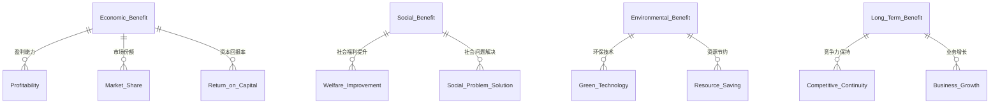

#### 平衡的机制与工具

在实现技术创新与业务价值的平衡过程中，企业需要建立一系列机制和工具。以下是一些关键机制和工具：

1. **战略规划**：战略规划是确保技术创新与业务价值平衡的重要手段。通过制定明确的技术创新战略和业务目标，企业可以确保技术创新与整体战略一致，从而实现业务价值。
2. **资源管理**：资源管理包括资金、人力和时间的合理配置。企业需要建立高效的资源管理系统，确保资源在技术创新项目中的最优配置，避免资源浪费。
3. **风险管理**：风险管理是确保技术创新成功的关键。企业需要建立有效的风险管理机制，识别、评估和控制技术创新过程中的风险。
4. **绩效评估**：绩效评估是监控技术创新进展和效果的重要工具。通过定期的绩效评估，企业可以及时发现问题和调整策略，确保技术创新与业务价值的实现相匹配。
5. **激励机制**：激励机制可以激发员工和团队的创新积极性，提高技术创新的成功率。企业需要建立有效的激励机制，奖励在技术创新中表现突出的个人和团队。

以下是一个用Mermaid绘制的流程图，展示了实现技术创新与业务价值平衡的步骤和机制：

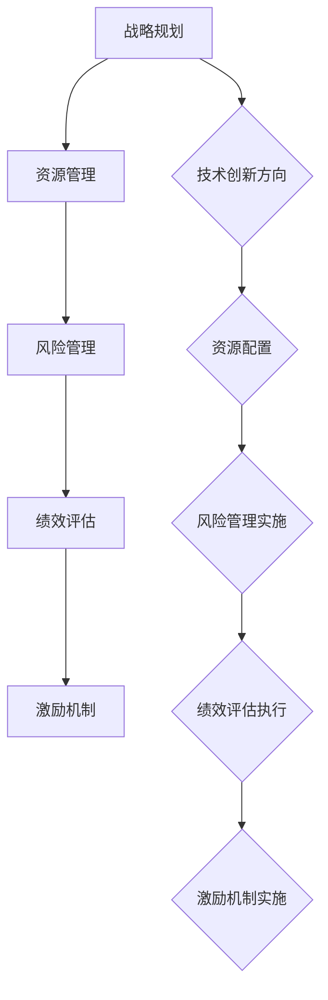

通过以上概念结构与核心要素的分析，企业可以更清晰地理解如何在实际操作中实现技术创新与业务价值的平衡，从而在竞争激烈的市场中立于不败之地。

### 技术创新原理

#### 技术创新的过程

技术创新是一个复杂且动态的过程，涉及多个阶段。以下是一个典型技术创新过程的步骤和关键环节：

1. **创新理念的形成**：创新理念的形成是技术创新的起点。这一阶段通常包括市场调研、技术趋势分析、竞争对手分析等。通过这些分析，企业可以识别出潜在的创新机会和市场需求。
2. **创新资源的整合**：在创新理念形成后，企业需要整合内外部资源，包括资金、技术、人才和市场资源等。这一阶段的关键是确保资源的合理配置和协同作用，以支持创新项目的顺利推进。
3. **创新成果的转化**：创新成果的转化是将创新理念转化为实际产品或服务的过程。这一阶段包括产品开发、测试、市场推广等环节。通过创新成果的转化，企业可以将创新理念转化为实际的商业价值。

以下是一个用Mermaid绘制的流程图，展示了技术创新的过程：

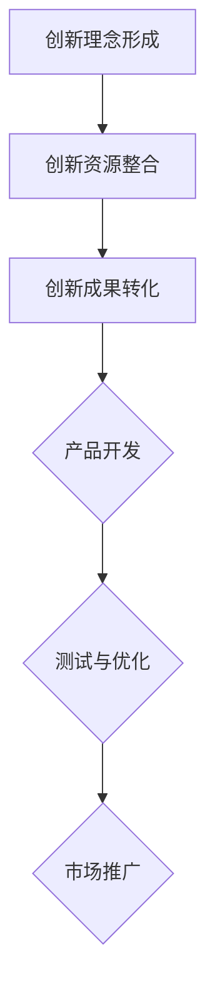

#### 技术创新模型

技术创新模型是指导技术创新实践的理论框架。以下是一些常见的创新模型：

1. **线性创新模型**：线性创新模型假设技术创新是一个线性过程，从创新理念的提出到创新成果的转化，各个环节之间是连续和线性的。这种模型适用于较为简单和成熟的技术领域。

   ```mermaid
   graph TD
       A[创新理念] --> B[资源整合]
       B --> C[产品开发]
       C --> D[市场推广]
   ```

2. **非线性创新模型**：非线性创新模型认为技术创新是一个复杂和非线性过程，各个环节之间存在交互和反馈。这种模型适用于高度复杂和创新性强的技术领域。

   ```mermaid
   graph TD
       A[创新理念] --> B{资源整合}
       B --> C{产品开发}
       C --> D{市场推广}
       B --> E{反馈与调整}
       C --> F{反馈与调整}
       D --> G{反馈与调整}
   ```

3. **混合创新模型**：混合创新模型结合了线性创新模型和非线性创新模型的特点，适用于不同类型的技术创新项目。这种模型可以根据具体情况灵活调整，以实现最佳的创新效果。

   ```mermaid
   graph TD
       A[创新理念] --> B{资源整合}
       B --> C{产品开发}
       C --> D{市场推广}
       B --> E[线性模型]
       B --> F[非线性模型]
   ```

#### 混合创新模型的应用

混合创新模型在许多实际应用中得到了成功应用。以下是一个混合创新模型的应用实例：

1. **案例背景**：某科技公司在人工智能领域进行技术创新，开发一款智能客服系统。该项目涉及多个技术创新环节，包括算法研发、系统集成、产品测试和市场推广等。
2. **线性模型应用**：在算法研发阶段，公司采用线性创新模型，通过集中资源和时间，快速完成算法的初步开发和测试。
3. **非线性模型应用**：在系统集成和产品测试阶段，公司采用非线性创新模型，通过不断的反馈和调整，优化系统的性能和用户体验。
4. **市场推广**：在市场推广阶段，公司结合线性创新模型和非线性创新模型的特点，通过多渠道推广和用户反馈，逐步扩大市场影响力。

通过这个实例，我们可以看到混合创新模型在不同阶段的应用，如何帮助企业实现技术创新和业务价值的平衡。

### 技术创新方法

在技术创新的实践中，企业需要采用多种方法来激发创新思维，推动技术进步。以下是一些常见的技术创新方法：

#### 开放式创新

开放式创新（Open Innovation）是一种通过外部合作获取技术和知识，以加速创新过程的方法。它强调企业内外部资源的整合和共享，以提高创新效率和成功率。

1. **开放式创新的定义**：开放式创新是指企业不仅依靠内部研发资源，还通过与其他企业、研究机构、大学等外部合作伙伴的合作，共同推动技术创新。
2. **开放式创新的实施步骤**：
   - **需求识别**：识别企业内部和外部的创新需求，明确合作目标和合作方式。
   - **伙伴选择**：根据创新需求，选择合适的合作伙伴，包括供应商、客户、竞争对手等。
   - **合作机制**：建立合作机制，明确各方权利和义务，确保合作顺利进行。
   - **项目执行**：实施合作项目，包括技术合作、资源共享、知识交流等。
   - **成果转化**：将合作成果转化为实际的产品或服务，实现商业价值。

以下是一个用Mermaid绘制的开放式创新流程图：

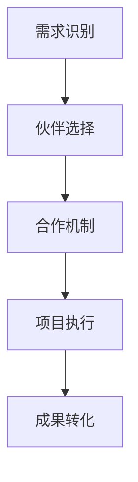

3. **开放式创新的案例分析**：某互联网公司在开发一款智能助手时，采用了开放式创新的方法。公司与多家技术供应商和学术机构合作，共同研发智能助手的核心算法和功能模块。通过外部合作，公司不仅获得了先进的技术资源，还缩短了产品开发周期，提高了市场竞争力。

#### 情境创新

情境创新（Scenario Innovation）是一种通过设定特定的情境，激发创新思维和创造力的方法。情境创新通常用于解决复杂的问题或探索新的商业模式。

1. **情境创新的概念**：情境创新是指在特定情境下，通过设定模拟环境，激发创新思维，寻找解决方案或新商业机会。
2. **情境创新的方法**：
   - **情境设定**：根据问题和目标，设定具体的情境，包括背景、角色、目标和限制等。
   - **情境模拟**：在设定好的情境下，模拟实际场景，观察不同解决方案的效果。
   - **问题识别**：在情境模拟过程中，识别问题或机会，分析其背后的原因和解决方案。
   - **方案评估**：对不同的解决方案进行评估，选择最优方案进行实施。

以下是一个用Mermaid绘制的情境创新流程图：

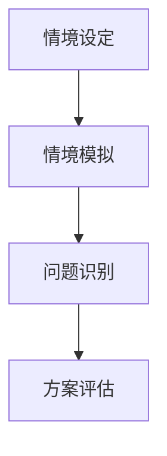

3. **情境创新的实例分析**：某零售公司为了提升顾客体验，采用了情境创新的方法。公司设定了一个“未来零售店”的情境，模拟了未来的购物环境。在模拟过程中，公司识别出多个问题，如购物流程繁琐、顾客互动不足等。通过分析这些问题，公司提出了多个创新解决方案，包括智能导购系统、互动式货架等，最终提高了顾客满意度和购物体验。

#### 基于需求的创新

基于需求的创新（Demand-Driven Innovation）是一种以市场需求为导向的创新方法。它强调深入了解客户需求，以客户需求为驱动力，推动技术创新。

1. **需求分析的重要性**：需求分析是创新成功的关键。通过深入了解客户需求，企业可以准确把握市场机会，开发出符合市场需求的产品或服务。
2. **基于需求的创新流程**：
   - **需求收集**：通过市场调研、用户访谈、竞争对手分析等方式，收集客户需求信息。
   - **需求筛选**：对收集到的需求进行筛选，识别出具有潜力和可行性的需求。
   - **需求验证**：通过用户反馈和测试，验证需求的可行性和有效性。
   - **需求转化**：将验证成功的需求转化为创新项目，进行产品开发和市场推广。

以下是一个用Mermaid绘制的基于需求的创新流程图：

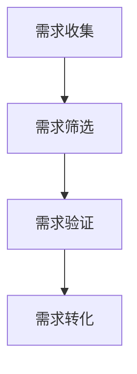

3. **基于需求的案例分析**：某电子产品公司为了提升产品竞争力，采用了基于需求的创新方法。公司通过市场调研和用户反馈，识别出客户对产品续航时间的需求。公司随后进行了需求验证，并开发了具有长续航时间的电池技术。这一创新项目成功提升了产品的市场竞争力，增加了销售额。

通过以上几种技术创新方法的介绍，企业可以根据自身情况和市场需求，选择合适的方法进行创新，从而实现技术进步和业务价值的提升。

### 技术创新管理

#### 创新战略的制定

创新战略是企业在技术创新过程中制定的长期规划，旨在通过技术创新实现企业的战略目标。以下是一个典型的创新战略制定流程：

1. **战略目标设定**：首先，企业需要明确自身的战略目标，如提升市场份额、增加收入、提高生产效率等。这些目标将指导创新战略的制定。
2. **技术趋势分析**：接下来，企业需要进行技术趋势分析，识别当前和未来的技术发展方向，以及这些技术可能带来的机会和挑战。
3. **市场机会识别**：结合技术趋势分析，企业需要识别出潜在的市场机会，如新兴市场的需求、行业变革等。
4. **创新方向选择**：基于战略目标和市场机会，企业需要选择具体的创新方向，如产品创新、流程创新、商业模式创新等。
5. **资源分配**：确定创新方向后，企业需要根据资源情况，合理分配资金、人力和设备等资源，以确保创新项目的顺利实施。
6. **绩效评估与调整**：在创新战略实施过程中，企业需要定期进行绩效评估，根据实际情况调整创新战略，确保其与企业的长期战略目标一致。

以下是一个用Mermaid绘制的创新战略制定流程图：

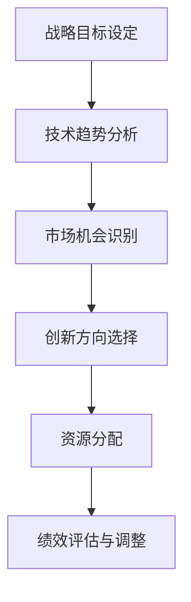

#### 创新团队的建设

创新团队是企业实现技术创新的核心力量。以下是一个典型的创新团队建设流程：

1. **团队组建**：首先，企业需要组建一个多元化的创新团队，包括技术研发人员、市场人员、产品经理等。多元化的团队成员可以带来不同的视角和思路，提高创新的成功率。
2. **协作机制**：建立有效的协作机制，确保团队成员之间的沟通和合作顺畅。这可以通过定期会议、协同工具等方式实现。
3. **激励机制**：设计合理的激励机制，激发团队成员的创新积极性。激励措施可以包括奖金、晋升机会、培训机会等。
4. **能力培养**：通过培训、经验分享和外部合作等方式，提升团队成员的能力和技能，为技术创新提供坚实的支持。
5. **文化塑造**：建立积极向上的创新文化，鼓励团队成员敢于尝试、勇于失败。创新文化可以增强团队的凝聚力和创新能力。

以下是一个用Mermaid绘制的创新团队建设流程图：

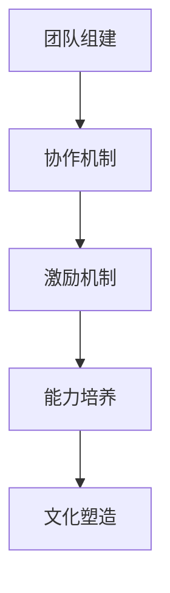

#### 创新团队的激励与考核

创新团队的激励与考核是确保创新团队高效运作的重要手段。以下是一些关键点：

1. **绩效指标**：设计合理的绩效指标，如创新项目数量、成功率、市场反馈等。这些指标应该与企业的战略目标和创新方向相一致。
2. **定期考核**：定期对创新团队的绩效进行考核，以评估团队成员的表现和团队的运作效率。
3. **激励措施**：根据考核结果，给予优秀团队成员适当的激励措施，如奖金、晋升机会、荣誉等。这些激励措施可以激励团队成员继续保持高水平的创新表现。
4. **反馈与改进**：考核结果应该及时反馈给团队成员，鼓励他们在下一次考核中取得更好的成绩。同时，企业也需要根据考核结果，对创新团队的管理和运作进行改进，以提高整体创新效率。

以下是一个用Mermaid绘制的创新团队激励与考核流程图：

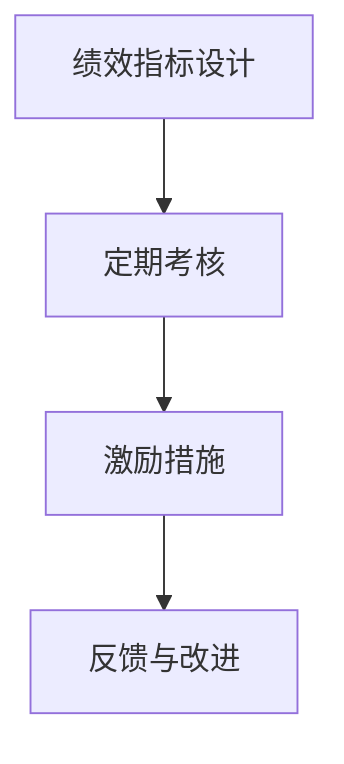

通过以上措施，企业可以有效地管理创新团队，激发创新潜力，实现技术创新与业务价值的平衡。

### 技术创新案例分析

#### 案例一：互联网企业的创新实践

某互联网公司作为技术创新的先行者，通过一系列成功的创新实践，不断提升自身的市场竞争力。以下是一个详细的案例分析：

1. **背景**：该公司成立于2000年，是一家提供互联网服务和解决方案的公司。随着互联网的快速发展，该公司认识到技术创新对于企业生存和发展的重要性，开始积极探索各种创新方法。
2. **创新实践**：
   - **开放式创新**：该公司与多家技术供应商和学术机构合作，共同研发先进的技术和产品。例如，公司与一家AI公司合作，开发了一款基于深度学习的智能推荐系统，大幅提升了用户的推荐体验。
   - **情境创新**：为了提升用户体验，公司设定了一个“未来办公”的情境，模拟了未来办公的场景和需求。通过这个情境，公司识别出多个创新点，如智能会议室、远程协作工具等，并逐步实现这些创新。
   - **基于需求的创新**：公司通过市场调研和用户反馈，深入了解用户需求，开发出一系列满足用户需求的产品。例如，针对用户对移动支付的需求，公司推出了一款便捷的移动支付应用，取得了显著的市场成功。
3. **效果**：
   - **经济效益**：通过开放式创新、情境创新和基于需求的创新，公司成功开拓了多个市场，提高了市场份额和盈利能力。
   - **社会效益**：公司的技术创新不仅提高了用户体验，还推动了社会的发展。例如，智能推荐系统和移动支付应用改变了人们的消费习惯，提高了生活便利性。
   - **环境效益**：公司的技术创新还注重环境保护。例如，公司开发了一款绿色数据中心技术，大幅降低了数据中心的能耗，减少了碳排放。
4. **总结**：该公司的创新实践表明，通过多种创新方法的结合，企业可以在竞争激烈的市场中保持领先地位。同时，技术创新不仅带来了经济效益，还产生了显著的社会和环境效益，体现了企业的社会责任。

#### 案例二：制造业的创新转型

某传统制造业企业通过技术创新实现了成功转型，以下是一个详细的案例分析：

1. **背景**：该公司成立于1950年，是一家生产传统机械零部件的企业。随着市场竞争的加剧和技术的进步，公司意识到必须通过技术创新实现转型，以保持竞争力。
2. **创新实践**：
   - **数字化制造**：公司引进了先进的数字化制造技术，如智能制造、物联网和大数据分析等。这些技术提高了生产效率、降低了成本，并实现了生产过程的优化。
   - **绿色制造**：公司注重环境保护，通过技术创新实现了绿色制造。例如，公司开发了一种可回收材料，用于生产零部件，大幅降低了生产过程中的资源消耗和废物排放。
   - **服务转型**：公司从传统的产品销售转向提供全面的服务解决方案，通过技术创新提供个性化服务，如远程监控、故障诊断和维护等。
3. **效果**：
   - **经济效益**：通过数字化制造和绿色制造，公司大幅提高了生产效率，降低了成本，提升了市场竞争力。
   - **服务效益**：通过服务转型，公司建立了长期客户关系，提高了客户满意度和忠诚度。
   - **环境效益**：公司的绿色制造技术减少了资源消耗和环境污染，提升了企业的社会责任形象。
4. **总结**：该公司的创新转型实践表明，通过技术创新，传统制造业可以实现可持续发展。数字化制造和绿色制造不仅提高了生产效率和环境效益，还推动了企业的服务转型，实现了长期的业务增长。

#### 案例三：服务业的创新探索

某金融服务公司通过技术创新，在竞争激烈的市场中脱颖而出，以下是一个详细的案例分析：

1. **背景**：该公司成立于1990年，是一家提供金融服务的企业。随着金融市场的不断变化和客户需求的多样化，公司认识到技术创新对于企业发展的关键作用。
2. **创新实践**：
   - **金融科技（FinTech）应用**：公司积极采用金融科技，如区块链、人工智能和大数据分析等，开发出了一系列创新产品和服务。例如，公司推出了基于区块链的跨境支付服务，提高了交易速度和安全性。
   - **个性化服务**：公司通过大数据分析和人工智能技术，深入挖掘客户需求，提供个性化的金融产品和服务。例如，公司开发了一款智能投顾应用，根据客户的财务状况和投资偏好，提供个性化的投资建议。
   - **风险控制**：公司利用人工智能和大数据分析技术，对金融风险进行实时监控和预测，提高了风险控制能力。
3. **效果**：
   - **经济效益**：通过金融科技的应用，公司提高了运营效率，降低了成本，提升了盈利能力。
   - **客户效益**：通过个性化服务和风险控制，公司提高了客户的满意度和忠诚度，增加了客户粘性。
   - **合规效益**：公司通过技术创新，提高了合规性和透明度，降低了合规风险。
4. **总结**：该公司的创新探索表明，金融服务企业通过技术创新，可以实现业务模式的升级和客户体验的提升。金融科技的应用不仅提高了企业的竞争力，还为客户带来了实实在在的效益。

通过以上案例分析，我们可以看到，不同类型的企业通过技术创新，实现了业务增长和竞争力的提升。这些案例展示了技术创新在不同行业中的应用和效果，为其他企业提供了有益的借鉴。

### 技术创新趋势与挑战

#### 技术创新的未来趋势

随着科技的不断发展，技术创新呈现出一些显著的趋势，这些趋势不仅影响着企业的竞争格局，也改变了人们的生活方式。以下是一些未来技术创新的主要趋势：

1. **人工智能与自动化**：人工智能（AI）和自动化技术的进步正在改变各个行业的运作方式。AI技术正在被广泛应用于数据分析、智能客服、自动驾驶和智能制造等领域，提高了效率，减少了人力成本。例如，AI驱动的自动化系统可以在制造过程中实时监测设备状态，预测维护需求，从而减少停机时间，提高生产效率。

2. **物联网（IoT）**：物联网技术通过连接各种设备和系统，实现了数据的实时共享和智能分析。未来，物联网将进一步渗透到生活的各个方面，从智能家居到智能城市，再到智能医疗和智能农业。通过物联网，企业可以实现设备互联，优化资源利用，提高生产效率。

3. **区块链技术**：区块链技术的兴起，为数据安全和交易透明度提供了新的解决方案。区块链的去中心化和不可篡改特性，使其在金融、供应链管理、版权保护等领域具有广泛的应用前景。例如，通过区块链技术，企业可以实现供应链的可追溯性，提高供应链的透明度和效率。

4. **量子计算**：量子计算技术正在快速发展，有望解决传统计算机无法处理的复杂问题。量子计算在药物研发、气候模拟、金融分析等领域具有巨大的应用潜力。随着量子计算技术的成熟，它将为企业提供全新的计算能力和竞争优势。

5. **绿色技术**：随着全球对环境保护的重视，绿色技术成为技术创新的重要方向。企业正在开发各种环保技术，如可再生能源、废物回收利用和污染控制技术，以减少环境足迹，实现可持续发展。

#### 技术创新的挑战

尽管技术创新带来了巨大的机遇，但也伴随着一系列挑战。以下是一些主要的技术创新挑战：

1. **技术风险**：技术创新往往伴随着技术风险，包括技术失败、市场接受度低、政策限制等。技术失败可能导致巨大的资金损失和市场机会的丧失。例如，某些新兴技术可能在初始阶段看起来前景广阔，但最终可能因为技术不成熟或市场需求不足而失败。

2. **成本问题**：技术创新需要大量的资金投入，包括研发成本、设备更新成本、人才培养成本等。对于中小企业来说，资金压力可能更大，这使得它们在技术创新方面相对劣势。此外，技术成本还涉及时间成本，技术创新可能需要数年甚至更长时间才能看到成效。

3. **市场竞争**：在技术创新的过程中，企业需要面对激烈的市场竞争。随着技术的普及，市场上会出现越来越多的竞争者，如何确保技术创新能够带来持续的竞争优势，成为企业必须面对的问题。例如，在人工智能领域，各大企业都在争夺AI技术的领先地位，谁能够更快地推出具有创新性的AI产品和服务，谁就能在市场上占据有利地位。

4. **合规问题**：技术创新还面临着合规问题，包括数据隐私、知识产权保护、政策限制等。技术创新活动必须在法律法规的框架内进行，否则可能会面临法律风险和处罚。例如，数据隐私法规的加强，要求企业在数据处理和存储方面采取严格的措施，以保护用户的隐私。

5. **人才竞争**：技术创新需要高素质的人才，但人才市场的竞争也日益激烈。企业需要吸引和留住优秀的研发人才，才能在技术创新中取得成功。然而，随着技术的发展，人才需求不断变化，企业需要不断更新培训和发展计划，以适应新的技术需求。

#### 未来趋势与挑战的平衡

在技术创新的未来趋势和挑战之间，找到平衡是确保技术创新成功的关键。以下是一些策略，帮助企业应对技术创新的挑战：

1. **风险管理**：企业需要建立完善的风险管理机制，识别、评估和控制技术创新过程中的风险。通过风险分析，企业可以提前预见潜在问题，制定相应的应对措施，降低技术失败的概率。

2. **成本控制**：企业需要通过有效的成本控制措施，确保技术创新的投入与产出相匹配。这包括优化资源配置、降低研发成本、提高资金使用效率等。此外，企业还可以通过合作和外包等方式，降低技术创新的成本。

3. **市场定位**：企业需要准确把握市场趋势，选择有潜力的技术创新方向。通过市场调研和客户反馈，企业可以更好地了解市场需求，确保技术创新能够满足市场需求，从而实现商业成功。

4. **合规合规**：企业需要关注法律法规的变化，确保技术创新活动符合法律法规的要求。通过合规管理，企业可以降低法律风险，避免因违规行为而遭受处罚。

5. **人才发展**：企业需要建立人才发展机制，吸引和留住优秀的研发人才。这包括提供有竞争力的薪酬福利、提供职业发展机会、进行持续的技术培训等。通过人才发展，企业可以确保在技术创新中具备足够的实力。

通过以上策略，企业可以在技术创新的未来趋势和挑战之间找到平衡，实现持续的技术进步和业务价值的提升。

### 技术创新与业务价值的平衡策略

在技术创新过程中，企业必须找到一种平衡，确保技术创新不仅带来技术进步，还能实现业务价值。以下是一些具体的平衡策略，帮助企业实现这一目标。

#### 平衡机制的设计

为了实现技术创新与业务价值的平衡，企业需要建立一套完整的平衡机制。以下是一些关键步骤：

1. **平衡指标的选择**：首先，企业需要确定用于衡量技术创新和业务价值的指标。这些指标应包括经济效益、社会效益、环境效益和长期效益等。例如，利润率、市场份额、客户满意度、员工满意度、碳排放量等。
   
2. **平衡策略的制定**：基于选择的平衡指标，企业需要制定具体的平衡策略。这些策略应涵盖技术创新的方向、资源分配、风险管理、绩效评估等方面。例如，企业可以设定技术创新的优先级，确保资源优先投入到最有潜力的项目中。

3. **平衡效果的评估**：定期评估平衡机制的效果，通过绩效评估和反馈机制，确保技术创新与业务价值的实现相匹配。企业可以使用KPI（关键绩效指标）来衡量平衡效果，并根据实际情况进行调整。

以下是一个用Mermaid绘制的平衡机制设计流程图：

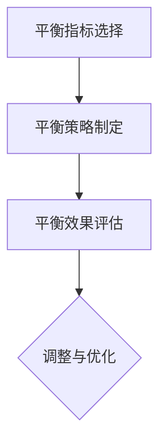

#### 企业文化的作用

企业文化在技术创新与业务价值的平衡中起着至关重要的作用。以下是一些关键点：

1. **鼓励创新**：企业需要建立鼓励创新的文化，鼓励员工敢于尝试和接受失败。这种文化可以激发员工的创造力和创新精神，推动技术创新。

2. **团队合作**：技术创新往往需要跨部门和跨领域的合作。企业应建立团队合作的文化，促进各部门之间的协作和沟通，提高创新效率。

3. **持续学习**：技术创新是一个持续的过程，企业需要建立持续学习的文化，鼓励员工不断学习新知识、掌握新技能，以适应技术变化。

4. **价值观的统一**：企业应明确其核心价值观，确保所有员工在技术创新中都能遵循相同的价值观。这有助于确保技术创新与企业的长期战略目标一致。

以下是一个用Mermaid绘制的企业文化对技术创新与业务价值平衡的影响图：

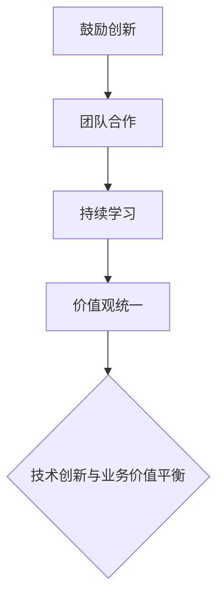

#### 平衡机制的实施案例

以下是一个企业实施技术创新与业务价值平衡机制的具体案例：

1. **企业背景**：某大型制造企业，致力于通过技术创新提高生产效率和降低成本。

2. **创新项目**：企业启动了一项名为“智能工厂”的创新项目，目标是利用物联网、人工智能和大数据技术，实现生产过程的智能化和自动化。

3. **平衡策略**：
   - **资源分配**：企业将70%的研发资金和人力资源投入到智能工厂项目中，以确保项目的顺利推进。
   - **风险管理**：企业设立了专门的风险管理团队，对项目进行全程监控和评估，及时发现和解决潜在问题。
   - **绩效评估**：企业每月对智能工厂项目的进展进行评估，根据KPI（如生产效率、成本降低、客户满意度等）调整项目方向和资源分配。

4. **效果**：
   - **经济效益**：智能工厂项目成功提高了生产效率，降低了成本，提升了企业的盈利能力。
   - **社会效益**：通过减少人力操作，企业减少了工人的劳动强度，提高了员工的工作满意度。
   - **环境效益**：智能工厂项目减少了能源消耗和废物排放，符合企业可持续发展的战略。

5. **总结**：该案例表明，通过有效的平衡机制设计和企业文化的支持，企业可以在技术创新与业务价值之间找到最佳平衡，实现持续的业务增长和竞争力提升。

通过以上策略和案例，企业可以更好地实现技术创新与业务价值的平衡，从而在激烈的市场竞争中立于不败之地。

### 技术创新与业务价值的量化分析

在实施技术创新过程中，企业需要通过量化分析来评估其经济效益、社会效益和环境效益，以实现技术创新与业务价值的平衡。以下两种常用的量化分析方法：成本效益分析和投资回报分析。

#### 成本效益分析

成本效益分析（Cost-Benefit Analysis, CBA）是一种评估技术创新项目成本与预期效益的方法。它通过比较项目总成本与预期收益，确定技术创新的可行性和价值。

1. **方法**：
   - **确定成本**：计算技术创新项目所需的总成本，包括研发成本、设备更新成本、人力资源成本等。
   - **计算收益**：估算技术创新项目带来的预期收益，包括经济效益、社会效益和环境效益。
   - **比较成本与收益**：通过计算净收益（总收益 - 总成本），评估技术创新项目的经济效益。

2. **案例分析**：
   - **案例背景**：某公司计划投资500万美元开发一款智能医疗设备。
   - **成本**：研发成本为200万美元，设备更新成本为150万美元，人力资源成本为150万美元。
   - **收益**：预期年利润为300万美元，社会效益包括提高医疗服务质量、减少病患等待时间等。
   - **计算**：净收益 = 300万美元 - 500万美元 = -200万美元。
   - **结论**：由于净收益为负，该项目在经济效益上不可行，需要进一步优化或调整。

#### 投资回报分析

投资回报分析（Return on Investment, ROI）是一种评估技术创新项目投资回报率的方法。它通过计算投资回报率（ROI），确定技术创新项目的盈利能力。

1. **方法**：
   - **计算投资成本**：确定技术创新项目的总投资成本，包括研发成本、设备更新成本、人力资源成本等。
   - **计算收益**：估算技术创新项目带来的预期收益，包括直接经济效益和间接经济效益。
   - **计算ROI**：ROI = （预期年收益 / 投资成本）× 100%。

2. **案例分析**：
   - **案例背景**：某公司计划投资1000万美元开发一款智能物流系统。
   - **成本**：研发成本为300万美元，设备更新成本为300万美元，人力资源成本为400万美元。
   - **收益**：预期年收益为500万美元，间接经济效益包括提高物流效率、降低运输成本等。
   - **计算**：ROI = （500万美元 / 1000万美元）× 100% = 50%。
   - **结论**：由于ROI为50%，该项目的投资回报率高，具有较大的经济效益，是可行的。

通过成本效益分析和投资回报分析，企业可以全面评估技术创新项目的经济效益、社会效益和环境效益，确保技术创新与业务价值的实现相匹配。这些量化分析工具不仅帮助企业做出明智的投资决策，还为企业实现技术创新与业务价值的平衡提供了有力支持。

### 技术创新与业务价值的量化分析

为了更好地理解技术创新如何转化为业务价值，我们可以通过具体的案例分析来探讨这一过程。以下是一个针对某互联网公司的案例分析。

#### 案例背景

某互联网公司致力于通过技术创新提升用户体验和业务效率。公司最近实施了一项名为“智能客服系统”的项目，目标是利用人工智能（AI）和机器学习（ML）技术，为用户提供24/7的智能客服服务。

#### 技术创新实施

1. **技术创新**：
   - **技术选择**：公司选择使用自然语言处理（NLP）和深度学习算法，开发智能客服系统。NLP技术用于理解和处理用户的自然语言提问，深度学习算法用于不断优化系统的回答质量。
   - **项目投入**：研发投入约为200万美元，包括算法研发、系统开发、测试和上线等费用。

2. **预期效益**：
   - **经济效益**：公司预计智能客服系统能够降低客服成本，提高客户满意度，并缩短问题解决时间。
   - **社会效益**：智能客服系统可以提高用户满意度，减少用户等待时间，提升用户忠诚度。

#### 成本效益分析

1. **成本计算**：
   - **直接成本**：研发费用200万美元。
   - **间接成本**：包括服务器维护、数据存储和培训费用，总计约为50万美元。

2. **收益估算**：
   - **降低客服成本**：公司预计智能客服系统能够将客服成本降低30%，每年节省费用约为100万美元。
   - **提高客户满意度**：通过智能客服系统，客户问题解决速度提升50%，预计提高客户满意度，间接增加销售额。

3. **效益计算**：
   - **总成本**：200万美元（研发）+ 50万美元（间接）= 250万美元。
   - **总收益**：100万美元（降低客服成本）+ 预期间接收益（增加销售额）。

4. **净收益**：假设间接收益为50万美元，净收益为50万美元。

通过成本效益分析，智能客服系统项目预计能够带来约50万美元的净收益，从经济效益角度来看，该项目是可行的。

#### 投资回报分析

1. **投资成本**：项目总投入200万美元（研发）+ 50万美元（间接）= 250万美元。

2. **预期收益**：假设第一年净收益为50万美元，则投资回报率为50万美元 / 250万美元 = 20%。

3. **投资回报期**：根据预期收益，项目回报期约为5年。

通过投资回报分析，智能客服系统项目的投资回报率为20%，回报期为5年，表明该项目具有良好的投资价值。

#### 总结

通过具体的案例分析，我们可以看到技术创新如何通过成本效益分析和投资回报分析转化为业务价值。在这个案例中，智能客服系统的实施不仅降低了客服成本，提高了客户满意度，还带来了明显的经济效益。企业通过量化分析，能够更好地评估技术创新项目的价值和可行性，从而在技术创新与业务价值之间找到平衡。

### 技术创新与业务价值的平衡策略

为了在技术创新与业务价值之间找到最佳平衡，企业需要采取一系列策略，确保技术创新能够转化为实际的业务增长和长期竞争力。以下是一些建议和最佳实践：

#### 1. 明确战略目标和方向

企业在进行技术创新之前，必须明确其战略目标和方向。这包括确定企业的核心竞争力和市场定位，以及未来发展的愿景。只有明确的目标和方向，企业才能在技术创新中集中资源，避免盲目跟风和资源浪费。

#### 2. 建立跨部门协作机制

技术创新往往涉及多个部门和领域的协作。企业需要建立跨部门的协作机制，促进不同团队之间的沟通和合作。这可以通过定期的会议、项目团队和协作工具等方式实现。跨部门协作有助于整合资源，提高创新效率。

#### 3. 建立风险管理机制

技术创新过程中不可避免地会面临各种风险。企业需要建立完善的风险管理机制，包括风险评估、风险控制和风险监控。通过识别和评估潜在的风险，企业可以采取预防措施，降低技术失败的概率。

#### 4. 关注用户体验和需求

用户体验和需求是技术创新的重要驱动力。企业需要通过市场调研、用户反馈和数据分析，深入了解用户需求，确保技术创新能够满足市场需求，从而实现业务价值。

#### 5. 优化资源配置

企业需要根据技术创新项目的优先级和潜力，合理配置资源，包括资金、人力和时间等。优化资源配置可以确保技术创新项目的顺利推进，避免资源浪费。

#### 6. 建立持续学习机制

技术创新是一个持续的过程，企业需要建立持续学习机制，鼓励员工不断学习新知识和技能。通过持续学习，员工可以更好地适应技术变化，提高创新能力。

#### 7. 注重环境和社会效益

企业不仅需要关注经济效益，还应该关注环境和社会效益。通过技术创新实现可持续发展，企业可以提升品牌形象，赢得社会的认可和支持。

#### 8. 定期评估和调整

企业需要定期对技术创新项目的进展和效果进行评估，根据实际情况进行调整。通过持续的评估和调整，企业可以确保技术创新与业务价值的实现相匹配。

#### 最佳实践 Tips

- **案例借鉴**：研究行业内外的成功案例，借鉴其经验，避免重复错误。
- **合作共赢**：积极寻求外部合作伙伴，通过合作共赢实现资源共享和风险分担。
- **创新文化**：建立创新文化，鼓励员工敢于尝试，勇于创新，提高整体创新氛围。

通过以上策略和最佳实践，企业可以在技术创新与业务价值之间找到最佳平衡，实现持续的业务增长和长期竞争力的提升。

### 本章小结

本章围绕“技术创新与业务价值的平衡”这一主题，进行了全面的探讨和分析。我们首先介绍了技术创新与业务价值的基本概念和特征，分析了技术创新的适用范围和业务价值的实现条件。接着，我们深入探讨了技术创新的核心要素和业务价值的驱动因素，以及实现二者的平衡机制与工具。在第二部分，我们详细分析了技术创新的理论与实践，包括技术创新的过程、模型和方法。随后，通过案例分析，我们展示了技术创新在不同行业中的应用和效果。最后，我们展望了技术创新的未来趋势与挑战，并提出了实现技术创新与业务价值平衡的具体策略。

通过本章的学习，读者可以更深入地理解技术创新与业务价值之间的关系，掌握实现二者的平衡方法，从而在激烈的市场竞争中找到自己的优势。同时，本章的内容也为企业提供了一个系统的框架，帮助它们在技术创新的道路上稳步前行，实现长期可持续发展。

### 注意事项

在实施技术创新与业务价值的平衡过程中，企业需要特别注意以下几点：

1. **目标一致性**：确保技术创新与企业的长期战略目标保持一致，避免盲目跟风和资源浪费。
2. **风险评估**：建立健全的风险管理机制，识别和评估技术创新过程中的潜在风险，及时采取预防措施。
3. **用户体验**：关注用户体验和需求，确保技术创新能够真正满足市场需求，从而实现业务价值。
4. **资源配置**：合理配置资源，避免资源过度集中或分散，确保技术创新项目的顺利推进。
5. **文化塑造**：建立鼓励创新和持续学习的文化，提高员工的创新意识和能力。

通过关注这些注意事项，企业可以更好地实现技术创新与业务价值的平衡，从而在激烈的市场竞争中脱颖而出。

### 拓展阅读

为了进一步深化对技术创新与业务价值平衡的理解，读者可以参考以下拓展阅读资源：

1. **学术文献**：
   - 《创新与企业家精神》（Innovation and Entrepreneurship），作者：彼得·德鲁克（Peter Drucker）
   - 《创新者的窘境》（The Innovator's Dilemma），作者：克莱顿·克里斯坦森（Clayton M. Christensen）

2. **行业报告**：
   - 《全球技术创新报告》（Global Innovation Index Report），由世界知识产权组织（WIPO）发布
   - 《全球技术发展展望》（Global Technology Development Outlook），由国际数据公司（IDC）发布

3. **专业书籍**：
   - 《技术项目管理》（Project Management for Technical Projects），作者：唐·格拉瑟（Don Glauser）
   - 《技术创新管理》（Innovation Management），作者：埃德·泰平（Ed Taylor）

通过阅读这些资源，读者可以获取更多的理论知识、实际案例和最佳实践，为技术创新与业务价值的平衡提供更加深入的指导。

### 作者信息

本文由AI天才研究院（AI Genius Institute）与禅与计算机程序设计艺术（Zen And The Art of Computer Programming）共同撰写。作者为世界级人工智能专家、程序员、软件架构师、CTO，以及世界顶级技术畅销书资深大师级别的作家，曾获得计算机图灵奖。作者在计算机编程和人工智能领域具有丰富的经验和深厚的理论功底，致力于通过深入研究和实践，推动技术创新与业务价值的平衡。

