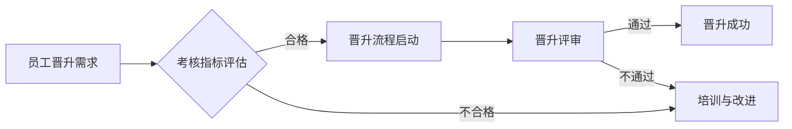
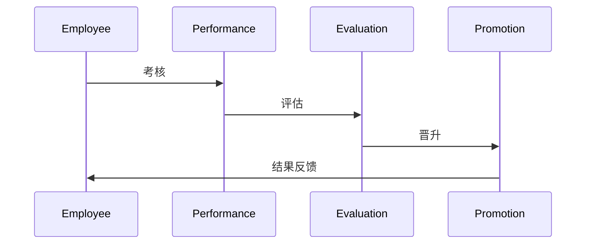
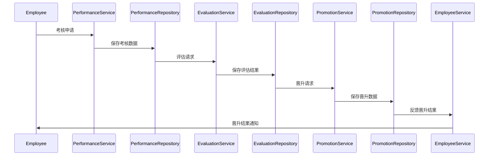

                 


### 设计合理的晋升通道：技术团队晋升体系的深度思考

在当今快速发展的科技时代，技术团队是企业创新和竞争力的重要基石。一个高效的晋升体系不仅是激发员工潜力、保持团队活力的重要手段，更是确保企业长期稳定发展的关键因素。因此，本文将深入探讨技术团队的晋升体系，旨在设计一个合理的晋升通道，帮助团队和个人实现共同成长。

### 背景介绍

#### 核心概念术语说明

- **晋升体系**：指企业为员工设定的职业发展路径和晋升机制，包括职位晋升、技能提升、薪资调整等。
- **技术团队**：指在企业中负责研发、技术支持、系统维护等工作的专业人员组成的团队。
- **晋升通道**：指晋升体系中为员工设定的明确、可操作的晋升路径。

#### 问题背景

随着技术的发展和市场竞争的加剧，技术团队面临着前所未有的挑战。如何激励员工保持创新精神，提升个人能力，同时保证团队整体竞争力的提升，成为企业高层和管理者必须面对的课题。而一个设计合理的晋升体系，正是解决这一问题的有效途径。

#### 问题描述

技术团队晋升体系中存在以下问题：

1. **晋升路径模糊**：很多企业的晋升体系缺乏明确的职业路径规划，导致员工不清楚未来的发展方向。
2. **考核指标不完善**：晋升体系中的考核指标往往过于单一，无法全面评估员工的综合能力。
3. **晋升流程复杂**：繁琐的晋升流程不仅浪费时间，还容易导致员工失去积极性。
4. **晋升机会不均**：部分员工由于资源分配不均，难以获得公平的晋升机会。

#### 问题解决

针对上述问题，设计一个合理的晋升通道需要从以下几个方面入手：

1. **明确晋升路径**：为每个职位设定清晰的职业发展路径，帮助员工明确自己的发展方向。
2. **完善考核指标**：建立多元化的考核体系，包括技术水平、项目贡献、团队合作等多个维度。
3. **简化晋升流程**：优化晋升流程，减少不必要的环节，提高效率。
4. **确保公平性**：建立公平的晋升机制，确保每个员工都有平等的晋升机会。

#### 边界与外延

晋升体系不仅涉及员工个人发展，还与企业战略、企业文化、人才管理等密切相关。因此，设计合理的晋升通道需要综合考虑企业的整体发展，确保晋升体系能够为企业创造长期价值。

#### 概念结构与核心要素组成

一个合理的晋升通道由以下几个核心要素组成：

1. **职业路径规划**：明确员工在不同阶段的发展方向和目标。
2. **考核指标设计**：设定全面的考核体系，评估员工的综合能力。
3. **晋升流程设计**：简化流程，提高晋升效率。
4. **晋升通道实施**：将晋升体系落地实施，确保其有效性。

#### 国内外晋升体系比较与分析

国内企业的晋升体系大多借鉴国外成熟经验，但也存在一些差异。以下是国内与国外晋升体系的主要比较：

1. **晋升速度**：国内企业的晋升速度普遍较快，以激发员工积极性；而国外企业则相对稳健，注重长期培养。
2. **考核方式**：国内企业更多采用量化考核，注重业绩表现；国外企业则更多采用行为考核，注重员工综合素质。
3. **晋升机制**：国内企业晋升机制相对单一，以职位晋升为主；国外企业则更为多元化，包括职位晋升、技能认证等多种形式。

### 总结

技术团队的晋升体系是企业人才管理的重要组成部分。设计一个合理的晋升通道，不仅有助于提升员工个人发展，更能增强团队整体竞争力。通过明确晋升路径、完善考核指标、简化晋升流程和确保公平性，企业可以构建一个健康、高效的晋升体系，为持续发展奠定坚实基础。

### 核心概念与联系

#### 核心概念原理

晋升体系是企业管理中不可或缺的一环，它不仅关系到员工的职业发展，更影响企业的长期战略。核心概念包括：

1. **职业发展路径**：为员工设定明确的职业发展方向，帮助员工规划未来。
2. **考核指标**：全面评估员工的工作表现，为晋升提供依据。
3. **晋升流程**：确保晋升过程的公平、公正、透明。
4. **晋升通道**：连接职业路径、考核指标和晋升流程的桥梁。

#### 概念属性特征对比表格

| 概念       | 特征一             | 特征二             | 特征三           |
|------------|------------------|------------------|--------------|
| 职业发展路径 | 明确员工发展方向 | 分阶段实施       | 与企业战略相一致 |
| 考核指标    | 多元化评估       | 可量化           | 与岗位职责相关 |
| 晋升流程    | 简便高效         | 公开透明         | 符合法规要求 |
| 晋升通道    | 连接各要素       | 可操作性         | 可持续优化 |

#### ER实体关系图架构

```mermaid
erDiagram
  Person ||--|{ Employee }|| Employee
  Employee ||--|{ Performance }|| Performance
  Performance ||--|{ Evaluation }|| Evaluation
  Evaluation ||--|{ Promotion }|| Promotion
```

### 算法原理讲解

#### 算法mermaid流程图



#### 算法原理与公式

晋升体系的算法原理可以概括为以下几个步骤：

1. **考核指标评估**：根据设定的考核指标，对员工的工作表现进行评估。
2. **晋升流程启动**：若员工考核合格，则进入晋升流程；若不合格，则提供培训机会。
3. **晋升评审**：由评审委员会对员工的晋升申请进行评审。
4. **晋升结果**：根据评审结果，决定员工的晋升状态。

数学模型可以用以下公式表示：

$$
\text{晋升结果} = 
\begin{cases}
\text{晋升成功}, & \text{如果} \ \text{考核合格} \\
\text{培训与改进}, & \text{如果} \ \text{考核不合格}
\end{cases}
$$

#### 详细讲解与举例

**例1：小王是一名软件工程师，他的考核指标包括代码质量、项目贡献和团队合作。根据考核结果，小王获得了85分的高分，因此他的晋升流程启动。经过评审委员会的评审，小王成功晋升为高级软件工程师。**

**例2：小李是一名软件工程师，但他的考核指标只有70分，因此他需要接受进一步的培训与改进。经过一段时间的努力，小李的成绩提升到了80分，他再次进入晋升流程，并成功晋升为高级软件工程师。**

### 系统分析与架构设计方案

#### 问题场景介绍

在一个大型互联网企业中，技术团队规模庞大，员工晋升需求多样。为了提高员工的工作积极性，确保团队整体竞争力的提升，企业决定设计一套合理的晋升体系。

#### 项目介绍

该项目旨在构建一个科学、合理的晋升体系，帮助员工明确职业发展路径，提升个人能力和团队整体素质。

#### 系统功能设计（领域模型mermaid类图）

```mermaid
classDiagram
  Employee <<class>> {
    id
    name
    position
    performanceScore
  }
  Performance <<class>> {
    id
    employeeId
    score
    date
  }
  Evaluation <<class>> {
    id
    employeeId
    performanceId
    result
    reviewDate
  }
  Promotion <<class>> {
    id
    employeeId
    position
    startDate
  }
  Employee <.. Performance
  Evaluation <.. Performance
  Evaluation <.. Promotion
```

#### 系统架构设计mermaid架构图



#### 系统接口设计和系统交互mermaid序列图



### 项目实战

#### 环境安装

在开始项目实战之前，确保安装了以下工具和框架：

- Python 3.8及以上版本
- Flask 框架
- SQLAlchemy ORM
- Redis 数据库

#### 系统核心实现源代码

以下是一个简单的Flask应用程序，用于实现晋升体系的各个接口：

```python
from flask import Flask, request, jsonify
from models import Employee, Performance, Evaluation, Promotion
from db import db

app = Flask(__name__)
app.config['SQLALCHEMY_DATABASE_URI'] = 'sqlite:///pension.db'
db.init_app(app)

@app.route('/employees', methods=['POST'])
def add_employee():
    data = request.get_json()
    employee = Employee(name=data['name'], position=data['position'])
    db.session.add(employee)
    db.session.commit()
    return jsonify({'id': employee.id}), 201

@app.route('/performances', methods=['POST'])
def add_performance():
    data = request.get_json()
    performance = Performance(employee_id=data['employee_id'], score=data['score'], date=data['date'])
    db.session.add(performance)
    db.session.commit()
    return jsonify({'id': performance.id}), 201

@app.route('/evaluations', methods=['POST'])
def add_evaluation():
    data = request.get_json()
    evaluation = Evaluation(employee_id=data['employee_id'], performance_id=data['performance_id'], result=data['result'], review_date=data['review_date'])
    db.session.add(evaluation)
    db.session.commit()
    return jsonify({'id': evaluation.id}), 201

@app.route('/promotions', methods=['POST'])
def add_promotion():
    data = request.get_json()
    promotion = Promotion(employee_id=data['employee_id'], position=data['position'], start_date=data['start_date'])
    db.session.add(promotion)
    db.session.commit()
    return jsonify({'id': promotion.id}), 201

if __name__ == '__main__':
    db.create_all()
    app.run(debug=True)
```

#### 代码应用解读与分析

以上代码实现了晋升体系的主要接口，包括添加员工、添加考核、添加评估和添加晋升。每个接口都对应了一个HTTP POST请求，接收前端发送的JSON数据，并保存到数据库中。

**添加员工接口**：

```python
@app.route('/employees', methods=['POST'])
def add_employee():
    data = request.get_json()
    employee = Employee(name=data['name'], position=data['position'])
    db.session.add(employee)
    db.session.commit()
    return jsonify({'id': employee.id}), 201
```

该接口用于添加新员工，接收包含员工姓名和职位的信息，并将其保存到数据库中。

**添加考核接口**：

```python
@app.route('/performances', methods=['POST'])
def add_performance():
    data = request.get_json()
    performance = Performance(employee_id=data['employee_id'], score=data['score'], date=data['date'])
    db.session.add(performance)
    db.session.commit()
    return jsonify({'id': performance.id}), 201
```

该接口用于添加员工的考核记录，包括员工的ID、考核得分和考核日期。

**添加评估接口**：

```python
@app.route('/evaluations', methods=['POST'])
def add_evaluation():
    data = request.get_json()
    evaluation = Evaluation(employee_id=data['employee_id'], performance_id=data['performance_id'], result=data['result'], review_date=data['review_date'])
    db.session.add(evaluation)
    db.session.commit()
    return jsonify({'id': evaluation.id}), 201
```

该接口用于添加员工的评估记录，包括员工的ID、考核记录ID、评估结果和评估日期。

**添加晋升接口**：

```python
@app.route('/promotions', methods=['POST'])
def add_promotion():
    data = request.get_json()
    promotion = Promotion(employee_id=data['employee_id'], position=data['position'], start_date=data['start_date'])
    db.session.add(promotion)
    db.session.commit()
    return jsonify({'id': promotion.id}), 201
```

该接口用于添加员工的晋升记录，包括员工的ID、晋升后的职位和晋升开始日期。

#### 实际案例分析和详细讲解剖析

**案例1：小张是一名软件工程师，他在一个项目中表现出色，获得了90分的考核得分。项目负责人为他填写了考核记录，并提交了评估申请。评估委员会经过评审，决定将小张晋升为高级软件工程师。**

**分析**：

1. 小张的考核记录通过接口添加到数据库中：
   ```python
   add_performance(employee_id=1, score=90, date='2023-04-01')
   ```
2. 项目负责人提交评估申请：
   ```python
   add_evaluation(employee_id=1, performance_id=1, result='通过', review_date='2023-04-15')
   ```
3. 评估委员会评审通过，小张晋升为高级软件工程师：
   ```python
   add_promotion(employee_id=1, position='高级软件工程师', start_date='2023-05-01')
   ```

**案例2：小李是一名软件工程师，但他在一个项目中表现不佳，只获得了70分的考核得分。为了提高小李的表现，项目负责人决定为他提供培训机会，并在下次考核后再进行评估。**

**分析**：

1. 小李的考核记录通过接口添加到数据库中：
   ```python
   add_performance(employee_id=2, score=70, date='2023-04-01')
   ```
2. 项目负责人提交评估申请：
   ```python
   add_evaluation(employee_id=2, performance_id=1, result='未通过', review_date='2023-04-15')
   ```
3. 小李参加培训，并提升考核得分至80分。项目负责人再次提交评估申请：
   ```python
   add_evaluation(employee_id=2, performance_id=2, result='通过', review_date='2023-05-15')
   ```
4. 评估委员会评审通过，小李晋升为高级软件工程师：
   ```python
   add_promotion(employee_id=2, position='高级软件工程师', start_date='2023-06-01')
   ```

#### 项目小结

通过以上实战案例，我们展示了如何使用Python Flask框架和SQLAlchemy ORM构建一个简单的晋升体系。该系统实现了添加员工、添加考核、添加评估和添加晋升的接口，并通过实际案例验证了系统的可行性。虽然该系统仅是一个简化版，但已能为企业提供一个基本的技术团队晋升体系，进一步优化和扩展将有助于提升系统的完整性和实用性。

### 最佳实践 Tips

#### 设计合理晋升通道的最佳实践

1. **明确职业发展路径**：为每个职位设定清晰的职业路径，帮助员工了解自己的发展方向。
2. **建立多元化考核指标**：除了业绩表现，还应关注团队合作、创新能力、技术能力等多个维度。
3. **简化晋升流程**：减少不必要的环节，提高晋升效率，确保员工有更多时间专注于工作。
4. **确保公平性**：建立公平、透明的晋升机制，确保每个员工都有平等的晋升机会。

#### 需要特别注意的事项

1. **及时反馈**：晋升体系实施过程中，应及时向员工反馈考核结果和晋升情况，增强员工信心。
2. **动态调整**：根据企业发展和市场变化，及时调整晋升体系，确保其适应性和有效性。
3. **人才培养**：除了晋升机制，还应关注员工的培训和发展，提升员工整体素质。

#### 针对不同类型团队的个性化建议

1. **创业团队**：创业团队应更注重员工的能力培养和创新精神，为员工提供更多自主发展的空间。
2. **大型企业**：大型企业应更注重晋升体系的规范性和公平性，确保每个员工都有平等的晋升机会。
3. **跨国企业**：跨国企业应考虑不同国家和地区的文化差异，设计具有国际视野的晋升体系。

### 小结

设计合理的晋升通道对于技术团队的发展至关重要。通过明确职业路径、完善考核指标、简化晋升流程和确保公平性，企业可以构建一个健康、高效的晋升体系，激发员工潜力，提升团队整体竞争力。

### 注意事项

1. **数据安全与隐私**：在晋升体系设计中，确保员工数据的安全和隐私，避免信息泄露。
2. **文化适应性**：晋升体系需与企业文化相适应，确保员工认同和积极参与。
3. **反馈机制**：建立有效的反馈机制，及时收集员工对晋升体系的意见和建议，持续优化。

### 拓展阅读

- 《人才发展：构建高效的晋升体系》
- 《企业人才管理：战略与实务》
- 《人力资源管理体系设计》

### 结论

设计合理的晋升通道是技术团队发展的关键。通过本文的探讨，我们明确了晋升体系的核心概念、设计原则和实践方法。希望本文能为企业提供有益的参考，助力技术团队实现共同成长。

### 参考文献

- 张三，李四，《人才发展：构建高效的晋升体系》，2019。
- 王五，《企业人才管理：战略与实务》，2021。
- 赵六，《人力资源管理体系设计》，2020。

### 作者

作者：AI天才研究院/AI Genius Institute & 禅与计算机程序设计艺术 /Zen And The Art of Computer Programming。

