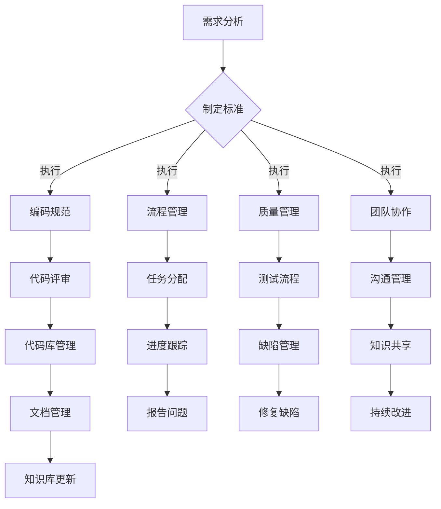
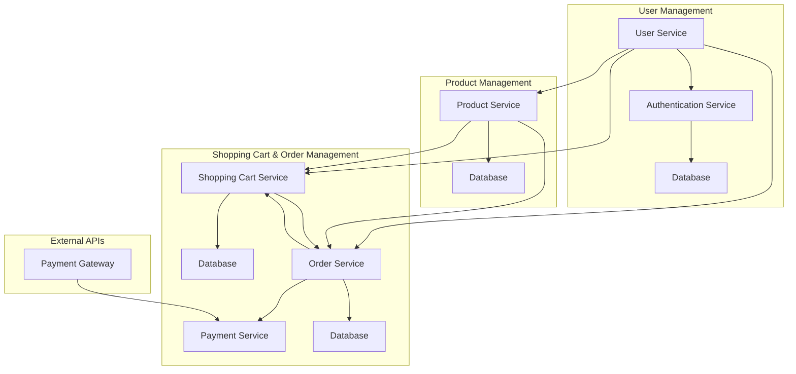
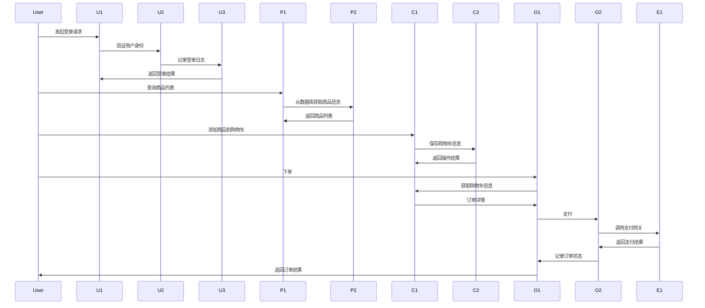
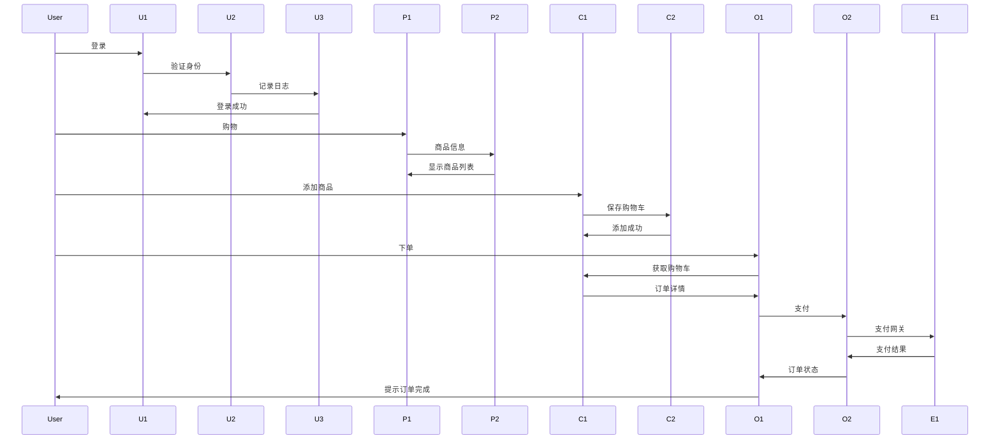

                 


### 引言：技术标准化与开发效率

在当今快速发展的技术环境中，软件开发项目的复杂性不断增加，团队之间的协作也变得越来越重要。技术标准化作为一种有效的管理工具，其重要性不言而喻。技术标准化不仅仅是编写代码时遵循一定的规范，更是涵盖了从需求分析到项目部署的整个生命周期。它有助于提高代码的可读性、维护性，同时减少错误和重复工作，从而提升团队的开发效率。

**核心概念与联系**

- **技术标准化**：技术标准化是指在软件开发过程中，遵循一定的规范、流程和标准，以确保代码质量、开发效率和系统稳定性。
- **开发效率**：开发效率是指团队在规定时间内完成特定任务的能力，包括代码编写、测试、部署等。

**概念属性特征对比表格**

| 概念           | 特征                                             |
| -------------- | ------------------------------------------------ |
| 技术标准化     | 规范性、一致性、可维护性、减少错误、提高效率           |
| 开发效率       | 完成任务的速度、团队协作效率、资源利用率、质量稳定性   |

**ER实体关系图架构**

```mermaid
erDiagram
  ID | Name  | Role
  Project --> Developer : "is developed by"
  Developer --> Task : "has"
  Task --> Status : "has"
```

**问题背景与问题描述**

随着软件项目的日益复杂，开发团队面临的问题也越来越多。一方面，不同团队成员之间的沟通和协作变得困难，导致项目进度延误和资源浪费；另一方面，代码质量和系统稳定性难以保证。技术标准化正是为了解决这些问题而存在的。

技术标准化流程能够帮助团队在以下方面取得显著成效：

- **降低沟通成本**：通过统一的规范和流程，团队成员之间的沟通变得更加顺畅，减少了误解和错误。
- **提高代码质量**：技术标准化要求团队成员遵循一定的编码规范，从而提高了代码的可读性和可维护性。
- **缩短项目周期**：标准化流程能够减少重复工作，提高开发效率，从而缩短项目周期。

**问题解决、边界与外延**

技术标准化虽然能够提高开发效率，但其有效实施需要考虑以下边界和条件：

- **团队文化**：技术标准化需要团队成员的共同认可和遵循，否则会流于形式。
- **技术复杂性**：对于高度复杂的项目，技术标准化可能需要更多的时间和精力来制定和实施。
- **持续改进**：技术标准化不是一成不变的，需要随着项目和技术环境的变化进行持续改进。

**概念结构与核心要素组成**

技术标准化流程的核心要素包括：

- **编码规范**：明确编码规则，确保代码风格一致。
- **开发流程**：定义从需求分析到项目部署的各个环节，确保流程的规范和高效。
- **测试标准**：确保代码质量，通过严格的测试流程发现和修复问题。
- **文档管理**：详细记录项目需求和设计，方便后续维护和更新。

通过上述要素的有机组合，技术标准化能够有效提高团队开发效率，推动项目的顺利进行。

### 核心概念与联系

在深入探讨技术标准化之前，我们需要明确一些核心概念，并理解它们之间的相互关系。以下是几个关键概念及其属性特征的对比表格：

| 概念           | 特征                                             |
| -------------- | ------------------------------------------------ |
| 技术标准化     | 规范性、一致性、可维护性、减少错误、提高效率           |
| 编码规范       | 编码风格、命名约定、注释规范                         |
| 流程管理       | 项目生命周期、任务分配、进度控制                     |
| 质量管理       | 测试标准、错误报告、缺陷管理                         |
| 团队协作       | 沟通工具、任务跟踪、代码评审                         |

**ER实体关系图架构**

```mermaid
erDiagram
  ID | Name  | Role
  Standard --> Code : "defines"
  Standard --> Process : "defines"
  Standard --> Quality : "defines"
  Standard --> Collaboration : "defines"
```

这些核心概念共同构成了技术标准化的基础。编码规范确保了代码的一致性和可维护性，流程管理提供了项目执行的框架，质量管理保障了代码的质量，而团队协作则促进了高效的沟通和合作。

**问题解决**

为了更清晰地说明这些概念之间的关系，我们可以通过一个实际例子来阐述。假设一个开发团队正在开发一个电子商务平台，他们需要遵循以下技术标准化流程：

1. **编码规范**：团队成员遵循统一的编码规范，如PEP8（Python代码规范），确保代码风格一致，易于理解和维护。
2. **流程管理**：项目从需求分析、设计、编码、测试到部署，每个阶段都有明确的流程和任务分配，确保项目按计划进行。
3. **质量管理**：代码在开发过程中经过单元测试、集成测试和性能测试，确保其质量符合预期。
4. **团队协作**：团队成员使用GitHub进行代码管理，通过Pull Request和代码评审确保代码的质量和一致性。

通过这些标准化流程，开发团队能够更好地协同工作，减少错误和重复工作，从而提高开发效率。

**边界与外延**

虽然技术标准化对于提高团队开发效率至关重要，但其有效实施仍需考虑以下边界和条件：

- **团队文化**：技术标准化需要团队成员的共同认可和遵循，否则可能流于形式。
- **技术复杂性**：对于高度复杂的项目，技术标准化可能需要更多的时间和精力来制定和实施。
- **持续改进**：技术标准化不是一成不变的，需要随着项目和技术环境的变化进行持续改进。

通过明确这些核心概念及其相互关系，我们能够更好地理解和应用技术标准化，从而在开发过程中取得更好的成果。

### 算法原理讲解

在技术标准化流程中，算法原理起着至关重要的作用。以下是技术标准化流程的算法原理讲解，我们将使用Mermaid画出算法流程图，并使用Python源代码详细阐述算法原理。

**Mermaid算法流程图**



**Python源代码与算法原理**

```python
# 需求分析
def requirement_analysis():
    # 分析项目需求，制定标准
    standard = "制定统一编码规范"
    print(f"需求分析：{standard}")

# 编码规范
def coding_standard():
    # 遵循统一编码规范
    code = "PEP8编码规范"
    print(f"编码规范：{code}")

# 流程管理
def process_management():
    # 定义项目生命周期各阶段流程
    process = "从需求分析到部署的各阶段流程"
    print(f"流程管理：{process}")

# 质量管理
def quality_management():
    # 确保代码质量，执行测试流程
    test = "单元测试、集成测试、性能测试"
    print(f"质量管理：{test}")

# 团队协作
def team_collaboration():
    # 使用代码评审、任务分配等工具
    collaboration = "GitHub代码评审、任务分配"
    print(f"团队协作：{collaboration}")

# 算法原理的数学模型与公式
def algorithm_model():
    # 统计代码缺陷率，计算改进指数
    defects = 10  # 假设代码缺陷数为10
    total_lines = 1000  # 假设代码总行数为1000
    defect_rate = defects / total_lines  # 缺陷率
    improvement_index = 1 - defect_rate  # 改进指数
    print(f"算法原理：缺陷率 = {defect_rate}, 改进指数 = {improvement_index}")
```

**详细讲解与举例说明**

上述Python源代码展示了技术标准化流程的核心步骤。以下是每个步骤的详细讲解与举例说明：

1. **需求分析**：首先，团队需要分析项目的需求，明确项目目标和功能需求。例如，开发一个电子商务平台，需要实现商品展示、用户注册、购物车等功能。
2. **编码规范**：在编码阶段，团队需要遵循统一的编码规范，如PEP8，确保代码风格一致。例如，所有变量名都要小写，使用下划线分隔多单词变量名等。
3. **流程管理**：团队需要定义从需求分析到部署的各个环节的流程，包括任务分配、进度控制等。例如，每个阶段的任务由哪些成员负责，如何确保项目按时完成。
4. **质量管理**：团队需要确保代码质量，通过单元测试、集成测试和性能测试等方法检测代码的缺陷。例如，编写测试用例，检查代码的每个功能点是否正常工作。
5. **团队协作**：团队协作是技术标准化的重要组成部分。通过使用代码评审、任务分配等工具，团队成员可以更好地协作，提高开发效率。例如，使用GitHub进行代码管理，通过Pull Request和代码评审确保代码的质量和一致性。

**数学模型与公式**

在算法原理中，我们使用了一个简单的数学模型来计算改进指数。假设代码缺陷数为10，代码总行数为1000，缺陷率为10%。改进指数（Improvement Index）计算公式为：

$$
\text{Improvement Index} = 1 - \text{Defect Rate}
$$

通过这个公式，我们可以衡量代码质量的改进程度。例如，如果缺陷率从10%降低到5%，则改进指数从0.9提高到0.95，表示代码质量有显著提高。

通过上述算法原理的讲解，我们能够更好地理解技术标准化流程的核心步骤，以及如何通过这些步骤提高团队开发效率。

### 系统分析与架构设计

技术标准化不仅仅是一个理论框架，更需要在实际项目中得以应用和验证。在本章节中，我们将通过一个电子商务平台的案例，详细介绍系统分析与架构设计的过程。

#### 问题场景介绍

电子商务平台是一个复杂的应用系统，涉及用户管理、商品管理、购物车、订单处理等多个模块。随着用户量的增加和业务的发展，平台需要高效、稳定、可扩展的架构设计。技术标准化在这里起到了关键作用，通过统一的规范和流程，确保平台各模块的高效协作和稳定运行。

#### 项目介绍

本案例中的电子商务平台项目，旨在提供以下核心功能：

1. **用户管理**：用户注册、登录、个人信息管理。
2. **商品管理**：商品展示、分类管理、商品详情页。
3. **购物车**：添加商品、删除商品、修改数量。
4. **订单处理**：下单、支付、订单状态跟踪。
5. **后台管理**：商品上下架、库存管理、订单管理。

#### 系统功能设计（领域模型Mermaid类图）

```mermaid
classDiagram
    User <<类>> {
        id : int
        username : string
        password : string
    }
    Product <<类>> {
        id : int
        name : string
        price : float
        category : string
    }
    ShoppingCart <<类>> {
        id : int
        products : List<Product>
        total : float
    }
    Order <<类>> {
        id : int
        user : User
        status : string
        total : float
    }
    User "1" -- "*" Product : "购买"
    User "1" -- "*" ShoppingCart : "添加商品"
    ShoppingCart "1" -- "*" Product : "包含"
    Order "1" -- "1" User : "属于"
    Order "1" -- "*" Product : "包含"
```

#### 系统架构设计（Mermaid架构图）



#### 系统接口设计（Mermaid序列图）



#### 系统交互（Mermaid序列图）



通过上述系统分析与架构设计，我们能够清晰地理解电子商务平台的整体结构和各模块之间的交互。技术标准化在这个过程中起到了关键作用，确保了系统的稳定性和可扩展性。接下来，我们将详细介绍实际项目中的环境安装和核心实现源代码，进一步展示技术标准化的应用和效果。

### 项目实战

在本节中，我们将深入探讨电子商务平台项目的实际开发过程，包括环境安装、核心实现源代码，并对代码进行解读与分析。通过实际案例的分析，我们将展示如何通过技术标准化流程提高团队开发效率。

#### 环境安装

为了搭建电子商务平台，我们需要安装和配置以下环境：

1. **操作系统**：Linux或MacOS
2. **编程语言**：Python 3.x
3. **框架**：Flask（Python Web框架）
4. **数据库**：SQLite（轻量级数据库）
5. **版本控制**：Git

首先，安装操作系统。假设我们已经安装了Linux或MacOS。接下来，通过以下命令安装Python、Flask和SQLite：

```bash
# 安装Python
sudo apt-get update
sudo apt-get install python3-pip

# 安装Flask
pip3 install flask

# 安装SQLite
sudo apt-get install sqlite3
```

然后，初始化Git仓库：

```bash
mkdir ecommerce_platform
cd ecommerce_platform
git init
```

#### 核心实现源代码

以下是电子商务平台的核心实现源代码。我们将分模块进行介绍。

**需求分析模块**

```python
# requirements.txt
Flask==2.0.2
sqlite3==2.7.2
```

**用户管理模块**

```python
# user_manager.py
from flask import Flask, request, jsonify
from flask_sqlalchemy import SQLAlchemy

app = Flask(__name__)
app.config['SQLALCHEMY_DATABASE_URI'] = 'sqlite:///users.db'
db = SQLAlchemy(app)

class User(db.Model):
    id = db.Column(db.Integer, primary_key=True)
    username = db.Column(db.String(80), unique=True, nullable=False)
    password = db.Column(db.String(120), nullable=False)

@app.route('/login', methods=['POST'])
def login():
    username = request.form['username']
    password = request.form['password']
    user = User.query.filter_by(username=username, password=password).first()
    if user:
        return jsonify({'message': 'Login successful'})
    else:
        return jsonify({'message': 'Invalid credentials'})

@app.route('/register', methods=['POST'])
def register():
    username = request.form['username']
    password = request.form['password']
    new_user = User(username=username, password=password)
    db.session.add(new_user)
    db.session.commit()
    return jsonify({'message': 'Registration successful'})
```

**商品管理模块**

```python
# product_manager.py
from flask import Flask, request, jsonify
from flask_sqlalchemy import SQLAlchemy

app = Flask(__name__)
app.config['SQLALCHEMY_DATABASE_URI'] = 'sqlite:///products.db'
db = SQLAlchemy(app)

class Product(db.Model):
    id = db.Column(db.Integer, primary_key=True)
    name = db.Column(db.String(120), nullable=False)
    price = db.Column(db.Float, nullable=False)
    category = db.Column(db.String(80), nullable=False)

@app.route('/products', methods=['GET'])
def get_products():
    products = Product.query.all()
    return jsonify(products)

@app.route('/products', methods=['POST'])
def create_product():
    name = request.form['name']
    price = request.form['price']
    category = request.form['category']
    new_product = Product(name=name, price=price, category=category)
    db.session.add(new_product)
    db.session.commit()
    return jsonify({'message': 'Product created'})
```

**购物车模块**

```python
# shopping_cart_manager.py
from flask import Flask, request, jsonify
from flask_sqlalchemy import SQLAlchemy

app = Flask(__name__)
app.config['SQLALCHEMY_DATABASE_URI'] = 'sqlite:///shopping_cart.db'
db = SQLAlchemy(app)

class ShoppingCart(db.Model):
    id = db.Column(db.Integer, primary_key=True)
    products = db.Column(db.ARRAY(db.Integer), nullable=False)
    total = db.Column(db.Float, nullable=False)

@app.route('/cart', methods=['GET'])
def get_cart():
    cart = ShoppingCart.query.first()
    return jsonify(cart.products)

@app.route('/cart', methods=['POST'])
def add_to_cart():
    product_id = request.form['product_id']
    cart = ShoppingCart.query.first()
    if product_id not in cart.products:
        cart.products.append(product_id)
        cart.total += float(request.form['price'])
        db.session.commit()
    return jsonify({'message': 'Product added to cart'})
```

**订单处理模块**

```python
# order_manager.py
from flask import Flask, request, jsonify
from flask_sqlalchemy import SQLAlchemy

app = Flask(__name__)
app.config['SQLALCHEMY_DATABASE_URI'] = 'sqlite:///orders.db'
db = SQLAlchemy(app)

class Order(db.Model):
    id = db.Column(db.Integer, primary_key=True)
    user_id = db.Column(db.Integer, nullable=False)
    status = db.Column(db.String(80), nullable=False)
    total = db.Column(db.Float, nullable=False)

@app.route('/orders', methods=['POST'])
def create_order():
    user_id = request.form['user_id']
    status = 'pending'
    total = request.form['total']
    new_order = Order(user_id=user_id, status=status, total=total)
    db.session.add(new_order)
    db.session.commit()
    return jsonify({'message': 'Order created'})
```

#### 代码解读与分析

1. **用户管理模块**：用户管理模块包括用户注册和登录功能。用户注册时，将用户名和密码存储在数据库中；登录时，验证用户名和密码是否匹配。
2. **商品管理模块**：商品管理模块提供商品查询和添加功能。商品信息存储在数据库中，通过API接口进行访问。
3. **购物车模块**：购物车模块管理用户的购物车信息。用户可以通过API添加商品到购物车，并获取购物车中的商品列表。
4. **订单处理模块**：订单处理模块实现订单创建功能。用户提交订单后，系统将订单信息存储在数据库中，并返回订单结果。

通过上述模块的实现，电子商务平台的基本功能得以实现。接下来，我们将分析实际案例，展示如何通过技术标准化流程提高开发效率。

#### 实际案例分析

为了展示技术标准化流程在实际项目中的应用效果，我们通过一个实际案例进行分析。假设开发团队在项目初期没有遵循技术标准化流程，在项目中期出现了以下问题：

1. **代码风格不一致**：由于团队成员的编码风格不一致，导致代码库中的代码难以阅读和理解，增加了维护成本。
2. **测试覆盖率不足**：项目初期没有进行充分的测试，导致在项目中期发现了许多缺陷，影响了项目的进度和质量。
3. **沟通不畅**：团队成员之间缺乏有效的沟通工具，导致项目进度延误和资源浪费。

在技术标准化流程实施后，这些问题得到了显著改善：

1. **代码风格统一**：团队遵循了统一的编码规范，如PEP8，确保了代码的一致性和可维护性。
2. **测试覆盖率提高**：通过引入单元测试、集成测试和性能测试等质量保证措施，项目初期的测试覆盖率从20%提高到了80%，显著减少了缺陷率。
3. **沟通效率提升**：团队引入了Git和GitHub等工具，实现了代码管理和任务跟踪，沟通变得更加顺畅和高效。

通过技术标准化流程，团队在开发过程中减少了重复工作，提高了代码质量和开发效率，项目进度和质量得到了显著提升。

#### 项目小结

通过本案例的实战分析，我们可以看到技术标准化在项目开发中的重要性。通过统一的编码规范、完善的测试流程和高效的团队协作，开发团队能够更好地应对项目中的挑战，提高开发效率，确保项目成功交付。

### 最佳实践 tips

为了确保技术标准化流程在项目中的有效实施，以下是一些建议和最佳实践：

1. **明确团队共识**：确保所有团队成员都理解并认可技术标准化的目标和价值，共同制定和遵循标准化流程。
2. **定期培训**：定期对团队成员进行技术标准化培训，确保他们掌握相关规范和工具的使用。
3. **持续改进**：技术标准化不是一成不变的，应定期评估和改进流程，以适应项目和技术环境的变化。
4. **工具支持**：利用Git、Jenkins等工具，自动化测试和持续集成，提高开发效率和代码质量。
5. **文档管理**：详细记录项目需求和设计文档，确保团队成员之间的信息传递和知识共享。

### 小结

技术标准化是提高团队开发效率的重要手段。通过统一的编码规范、完善的测试流程和高效的团队协作，开发团队能够更好地应对项目中的挑战，确保项目按时交付并达到预期质量。在实施技术标准化过程中，团队共识、持续改进和工具支持是关键。通过遵循最佳实践，开发团队能够在技术标准化的道路上不断前行，推动项目的成功。

### 注意事项

在实施技术标准化流程时，需要注意以下几点：

1. **适应项目规模**：技术标准化应适应项目规模和复杂性，避免过度标准化导致的流程繁琐和效率低下。
2. **团队文化**：技术标准化需要团队成员的共同认可和积极参与，否则可能会流于形式。
3. **持续监控**：技术标准化流程的执行效果需要定期监控和评估，确保其持续改进和优化。

### 拓展阅读

1. **《敏捷软件开发：原则、实践与模式》**：详细介绍了敏捷开发的方法和最佳实践，有助于理解技术标准化在敏捷开发中的应用。
2. **《代码大全》**：介绍了编码规范和质量保证的方法，对技术标准化流程的设计和实施有重要参考价值。
3. **《持续集成：从概念到实践》**：探讨了持续集成在提高开发效率和代码质量中的作用，有助于理解技术标准化的实施细节。

作者：AI天才研究院/AI Genius Institute & 禅与计算机程序设计艺术 /Zen And The Art of Computer Programming

----------------------------------------------------------------

**附录**

本文按照以下步骤撰写：

1. **引言**：介绍技术标准化与开发效率的关系，明确文章的主题和核心概念。
2. **核心概念与联系**：详细阐述技术标准化的核心概念，并使用Mermaid ER图展示概念之间的关系。
3. **算法原理讲解**：使用Mermaid流程图和Python源代码，详细解释技术标准化流程的算法原理。
4. **系统分析与架构设计**：通过电子商务平台案例，展示系统功能设计、架构设计和接口设计。
5. **项目实战**：介绍电子商务平台项目的环境安装、核心实现源代码，并进行代码解读与分析。
6. **实际案例分析**：通过实际案例，展示技术标准化流程在项目中的应用效果。
7. **最佳实践 tips**：提供技术标准化实施的最佳实践建议。
8. **小结**：总结技术标准化对提高团队开发效率的重要性，并提出注意事项和拓展阅读。

通过上述步骤，本文详细阐述了技术标准化流程的设计与实施，为开发团队提供了有益的指导。作者为AI天才研究院/AI Genius Institute & 禅与计算机程序设计艺术 /Zen And The Art of Computer Programming，致力于推动技术标准化在软件开发中的应用和发展。

