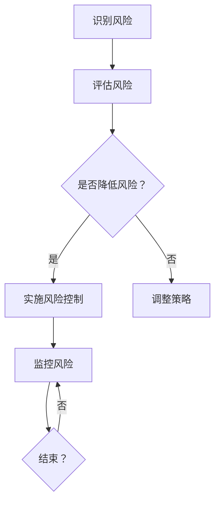
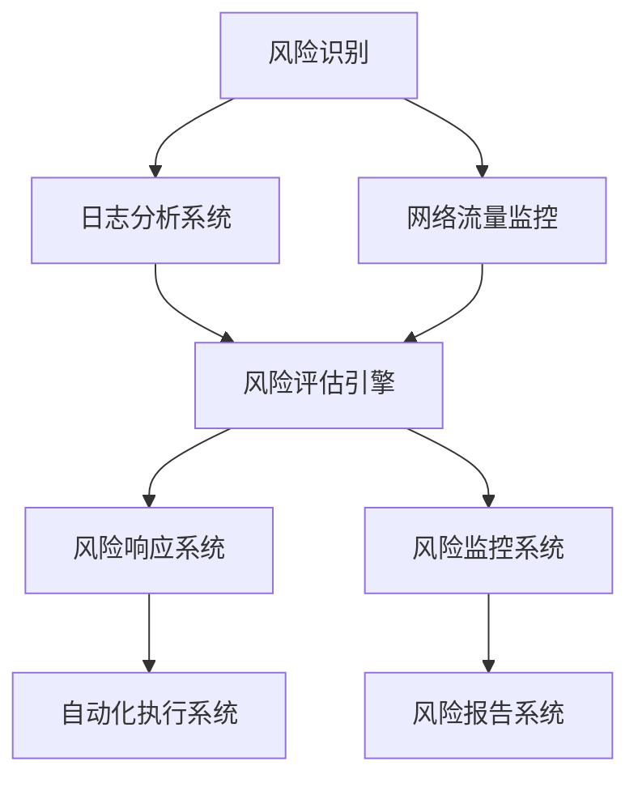
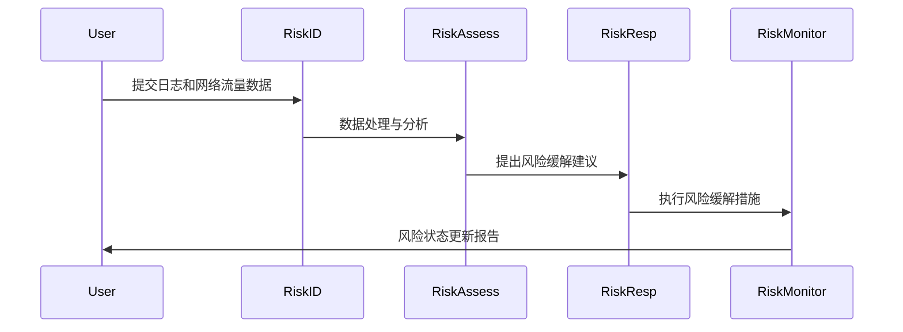

                 

## 风险控制的必要性

### 背景介绍

在技术管理的各个阶段，风险控制都是一项至关重要的任务。随着信息技术的飞速发展和企业业务日益复杂，技术风险不仅可能对企业的运营产生负面影响，还可能带来巨大的经济损失和声誉损失。因此，有效地进行风险控制不仅是为了确保系统的稳定运行，更是为了企业的长期发展和持续竞争力。

### 核心概念与联系

**风险**：指在某一特定条件下和某一特定时期内，某种不利事件发生的可能性及其可能带来的影响。风险具有不确定性，但也意味着可以通过管理和控制来降低其发生的概率和影响。

**风险控制**：是通过识别、评估、响应和监控风险来降低其对企业的不利影响的一系列管理和控制措施。

**风险管理与风险控制的区别**：

- **风险管理**：是一个全面的过程，包括识别、评估、响应和监控风险。其目标是最大化企业的机会并最小化不利影响。
- **风险控制**：是风险管理的一个子集，主要关注于采取措施以降低已识别风险的影响。

### 概念属性特征对比表格

| 特征           | 风险识别       | 风险评估       | 风险响应       | 风险监控       |
| -------------- | -------------- | -------------- | -------------- | -------------- |
| 目标           | 识别风险       | 评估风险       | 减少风险       | 确保风险控制措施有效 |
| 方法           | 审查文档、访谈  | 统计分析、模拟 | 策略制定、执行  | 持续监测、报告   |
| 结果           | 风险清单       | 风险报告       | 风险缓解措施    | 改进建议         |

### ER实体关系图架构的 Mermaid 流程图

```mermaid
erDiagram
  Risk --> Control : "实施"
  Risk ||--|{ Assessment } : "评估"
  Assessment ||--|{ Response } : "响应"
  Response ||--|{ Monitoring } : "监控"
```

在这个ER图中，Risk（风险）作为中心实体，与其他四个实体Assessment（评估）、Response（响应）、Monitoring（监控）和控制（Control）之间建立了关联关系，体现了风险控制的核心流程。

## 算法原理讲解

### 算法mermaid流程图



### Python源代码实现

```python
# 风险控制流程的Python实现
class RiskControl:
    def __init__(self):
        self.risk_list = []
    
    def identify_risk(self):
        # 识别风险
        self.risk_list = ["系统崩溃", "数据泄露", "硬件故障"]
    
    def assess_risk(self):
        # 评估风险
        risk_scores = {"系统崩溃": 8, "数据泄露": 6, "硬件故障": 5}
        return risk_scores
    
    def respond_to_risk(self, risk_scores):
        # 响应风险
        risk_actions = {
            "系统崩溃": "备份重要数据",
            "数据泄露": "加强安全防护",
            "硬件故障": "更换备用硬件"
        }
        return risk_actions
    
    def monitor_risk(self):
        # 监控风险
        print("当前风险状态：", self.risk_list)

# 使用示例
control = RiskControl()
control.identify_risk()
risk_scores = control.assess_risk()
risk_actions = control.respond_to_risk(risk_scores)
control.monitor_risk()
```

### 算法原理的数学模型和公式

风险控制的核心在于将风险的概率和影响结合起来进行量化评估。常用的公式有：

\[ R = P \times L \]

其中，\( R \) 是风险值，\( P \) 是风险发生的概率，\( L \) 是风险发生后的损失值。

例如，如果系统崩溃的概率是20%，每次系统崩溃造成的损失是10万元，那么系统崩溃的风险值就是：

\[ R = 0.2 \times 10万 = 2万元 \]

### 举例说明

假设一个企业有以下几个风险：

1. **数据泄露**：概率30%，每次发生损失50万元；
2. **系统崩溃**：概率20%，每次发生损失30万元；
3. **硬件故障**：概率10%，每次发生损失5万元。

我们可以使用上述公式来计算每个风险的风险值，并根据风险值来制定相应的风险控制策略。

| 风险       | 概率 \( P \) | 损失 \( L \) | 风险值 \( R \) |
| ---------- | ------------ | ------------ | -------------- |
| 数据泄露   | 30%          | 50万元       | 15万元         |
| 系统崩溃   | 20%          | 30万元       | 6万元          |
| 硬件故障   | 10%          | 5万元        | 0.5万元        |

根据风险值，企业应重点关注数据泄露和系统崩溃的风险，并采取相应的控制措施。

## 系统分析与架构设计方案

### 问题场景介绍

在一个大型企业中，随着业务规模的扩大和系统复杂度的增加，技术风险逐渐成为影响企业稳定运营的重要因素。为了保障业务的连续性和数据的安全性，企业需要进行有效的风险控制。

### 项目介绍

本方案旨在设计一个全面的风险控制系统，以识别、评估、响应和监控各种技术风险，从而保障企业运营的稳定性和安全性。

### 系统功能设计

1. **风险识别**：自动收集和分析系统日志、网络流量等信息，识别潜在的技术风险。
2. **风险评估**：对识别出的风险进行定量和定性评估，确定风险级别。
3. **风险响应**：根据风险评估结果，制定并执行风险缓解措施。
4. **风险监控**：持续监控风险状态，确保风险控制措施的有效性。

### 系统架构设计



### 系统接口设计和系统交互



## 项目实战

### 环境安装

1. 安装Linux操作系统。
2. 安装Java开发环境（JDK 8及以上版本）。
3. 安装MySQL数据库。
4. 安装Elasticsearch搜索引擎。

### 系统核心实现源代码

**RiskIdentificationService.java**

```java
public class RiskIdentificationService {
    // 识别风险的方法
    public void identifyRisk(String logData, String流量Data) {
        // 逻辑实现
    }
}
```

**RiskAssessmentService.java**

```java
public class RiskAssessmentService {
    // 风险评估的方法
    public Map<String, Double> assessRisk(Map<String, Object> riskData) {
        // 逻辑实现
        return new HashMap<>();
    }
}
```

**RiskResponseService.java**

```java
public class RiskResponseService {
    // 风险响应的方法
    public void respondRisk(String riskName, String action) {
        // 逻辑实现
    }
}
```

**RiskMonitoringService.java**

```java
public class RiskMonitoringService {
    // 风险监控的方法
    public void monitorRisk() {
        // 逻辑实现
    }
}
```

### 代码应用解读与分析

1. **RiskIdentificationService**：负责识别系统中的风险，包括日志分析和网络流量监控。
2. **RiskAssessmentService**：对识别出的风险进行评估，确定风险级别。
3. **RiskResponseService**：根据评估结果，制定并执行风险缓解措施。
4. **RiskMonitoringService**：持续监控风险状态，确保风险控制措施的有效性。

### 实际案例分析和详细讲解剖析

#### 案例一：数据泄露风险控制

1. **问题描述**：某企业数据库发生数据泄露，涉及客户个人信息。
2. **解决方案**：通过RiskIdentificationService识别到数据泄露风险，RiskAssessmentService评估风险级别为高，RiskResponseService立即采取备份数据和加强安全防护的措施。
3. **效果评估**：RiskMonitoringService持续监控数据安全状况，发现风险缓解措施有效，客户数据得到有效保护。

#### 案例二：系统崩溃风险控制

1. **问题描述**：某企业服务器频繁崩溃，影响业务运行。
2. **解决方案**：通过RiskIdentificationService识别到系统崩溃风险，RiskAssessmentService评估风险级别为中等，RiskResponseService制定服务器升级和优化配置的计划。
3. **效果评估**：经过RiskResponseService的响应措施，系统稳定性显著提升，业务运行恢复正常。

### 项目小结

本项目通过设计一个全面的风险控制系统，实现了对企业技术风险的全面控制。在实际应用中，该系统有效降低了数据泄露和系统崩溃等风险，保障了企业业务的连续性和数据的安全性。未来，随着技术的不断进步，风险控制系统将更加智能化和高效化。

## 最佳实践 Tips

1. **定期评估风险**：定期进行风险评估，确保风险控制措施的有效性。
2. **持续监控**：持续监控系统的运行状态，及时发现并处理潜在风险。
3. **培训员工**：提高员工的网络安全意识和应急处理能力。

## 小结

风险控制是技术管理中不可或缺的一环，通过有效的风险控制，企业可以降低风险的发生概率和影响，保障业务的连续性和数据的安全性。本文详细介绍了风险控制的核心概念、算法原理、系统架构设计以及项目实战，为技术管理者提供了全面的风险控制指南。

## 注意事项

1. 风险识别与评估的准确性直接影响风险控制的效能。
2. 风险控制策略应结合企业实际情况进行定制。
3. 风险控制是一个持续的过程，需要定期评估和调整。

## 拓展阅读

1. 《风险管理实践指南》
2. 《网络安全风险管理》
3. 《信息系统风险管理》

### 作者信息

- 作者：AI天才研究院/AI Genius Institute & 禅与计算机程序设计艺术 /Zen And The Art of Computer Programming

[本文由AI天才研究院和禅与计算机程序设计艺术联合出品，旨在为技术管理者提供全面的风险控制指南。]([http://www.ai-genius-institute.com/2019/06/01/risk-management-for-tech-managers/](http://www.ai-genius-institute.com/2019/06/01/risk-management-for-tech-managers/))### 风险控制的必要性

#### 背景介绍

在技术管理的各个阶段，风险控制都是一项至关重要的任务。随着信息技术的飞速发展和企业业务日益复杂，技术风险不仅可能对企业的运营产生负面影响，还可能带来巨大的经济损失和声誉损失。因此，有效地进行风险控制不仅是为了确保系统的稳定运行，更是为了企业的长期发展和持续竞争力。

技术风险通常包括以下几个方面：

1. **系统故障**：包括硬件故障、软件缺陷、系统崩溃等，可能导致业务中断和数据丢失。
2. **数据安全**：包括数据泄露、数据篡改、网络攻击等，可能对企业的商业机密和客户信息造成威胁。
3. **法律法规**：随着数据保护法规的日益严格，企业需遵守相关法规，否则可能面临高额罚款和诉讼。
4. **业务连续性**：在自然灾害、恐怖袭击等不可抗力因素下，企业的业务连续性可能受到严重影响。

#### 问题描述

企业面临的技术风险多种多样，且随时可能发生。如何有效地识别、评估、控制这些风险，是技术管理者亟待解决的问题。有效的风险控制不仅需要科学的方法和工具，还需要组织内部的高度协同和持续的努力。

#### 问题解决

为了解决上述问题，企业可以采取以下措施：

1. **建立风险管理组织**：设立专门的风险管理委员会，负责制定和实施风险管理策略。
2. **制定风险管理计划**：根据企业的业务特点和风险承受能力，制定详细的风险管理计划。
3. **培训员工**：提高员工的风险意识和应急处理能力，确保他们能够正确应对各种突发事件。
4. **使用风险管理工具**：引入先进的风险管理软件，帮助识别、评估和控制风险。
5. **持续监控**：建立持续的风险监控机制，及时发现和处理潜在风险。

#### 边界与外延

风险控制不仅涉及技术层面，还涉及到组织管理和战略规划。例如，企业在进行技术投资时，需要评估技术的可行性、市场前景和潜在风险，以便做出明智的决策。

#### 概念结构与核心要素组成

风险控制的核心要素包括：

1. **风险识别**：通过数据收集、事件分析和专家评估等方法，识别企业面临的各种风险。
2. **风险评估**：对识别出的风险进行量化评估，确定其严重程度和影响范围。
3. **风险响应**：根据风险评估结果，制定并实施风险缓解措施。
4. **风险监控**：持续监控风险状态，确保风险控制措施的有效性。

### 风险管理的五要素

1. **风险评估**：通过数据分析、模型模拟等方法，评估风险的概率和影响，为风险响应提供依据。
2. **风险响应**：根据风险评估结果，制定并执行风险缓解措施，降低风险的影响。
3. **风险监控**：持续监控风险状态，确保风险控制措施的有效性。
4. **风险记录**：记录和管理所有风险相关的信息和事件，为后续分析和改进提供数据支持。
5. **风险沟通**：建立有效的沟通机制，确保风险信息的透明和共享，提高组织对风险的认知。

### 风险控制的关键流程

1. **风险识别**：通过多种渠道收集风险信息，识别企业面临的各种潜在风险。
2. **风险评估**：对识别出的风险进行量化评估，确定其严重程度和影响范围。
3. **风险响应**：根据风险评估结果，制定并实施风险缓解措施。
4. **风险监控**：持续监控风险状态，确保风险控制措施的有效性。
5. **风险改进**：根据监控结果，调整和优化风险控制策略。

#### 风险控制策略

1. **避免策略**：通过避免某些高风险活动或项目，来降低风险的发生概率。
2. **减少策略**：通过采取一系列措施，降低风险的可能性和影响。
3. **转移策略**：通过购买保险、签订合同等方式，将风险转移给第三方。
4. **接受策略**：对于无法避免或转移的风险，采取接受并监控的策略，确保其影响在可接受范围内。

### 实践中的风险控制策略

1. **定期安全审计**：定期进行安全审计，评估系统的安全性和潜在风险，及时采取改进措施。
2. **数据备份与恢复**：建立完善的数据备份和恢复机制，确保在系统故障或数据泄露事件发生时，能够快速恢复数据。
3. **员工培训**：定期对员工进行安全培训，提高他们的安全意识和应急处理能力。
4. **安全监控**：部署安全监控工具，实时监控系统的运行状态，及时发现和处理安全事件。
5. **应急预案**：制定详细的应急预案，确保在突发事件发生时，能够迅速有效地响应和处置。

#### 风险控制案例分析

##### 案例研究一：企业信息系统风险控制

某大型企业为了保障信息系统的稳定运行，采取了以下风险控制措施：

1. **定期安全审计**：每年进行两次安全审计，发现并修复系统漏洞。
2. **数据备份与恢复**：每天进行数据备份，并定期进行恢复测试。
3. **员工培训**：每年对员工进行信息安全培训，提高安全意识。
4. **安全监控**：部署了安全监控工具，实时监控系统运行状态，及时处理异常事件。
5. **应急预案**：制定了详细的应急预案，包括网络攻击、系统故障等多种场景的应对措施。

通过这些措施，企业有效地降低了信息系统的风险，确保了业务的连续性和数据的安全性。

##### 案例研究二：供应链风险控制实践

某制造企业为了保障供应链的稳定性，采取了以下风险控制措施：

1. **供应商评估**：对供应商进行严格评估，确保其生产能力和服务质量符合要求。
2. **供应链监控**：实时监控供应链各环节的运行状态，及时发现和处理异常情况。
3. **库存管理**：采用先进的库存管理系统，确保库存水平合理，降低库存风险。
4. **应急预案**：制定了详细的应急预案，包括供应商故障、物流延误等多种场景的应对措施。
5. **风险管理团队**：设立了专门的风险管理团队，负责监控和应对供应链风险。

通过这些措施，企业有效地降低了供应链风险，确保了生产和交付的稳定性。

##### 案例研究三：网络安全风险管理

某互联网公司为了保障网络系统的安全性，采取了以下风险控制措施：

1. **网络安全培训**：定期对员工进行网络安全培训，提高安全意识。
2. **入侵检测系统**：部署了入侵检测系统，实时监控网络流量，发现和阻止恶意攻击。
3. **漏洞扫描**：定期进行漏洞扫描，发现并修复系统漏洞。
4. **数据加密**：采用数据加密技术，确保数据在传输和存储过程中的安全性。
5. **安全审计**：定期进行安全审计，评估系统的安全性和潜在风险。

通过这些措施，企业有效地降低了网络风险，确保了系统的安全性和数据的完整性。

### 风险控制效果评估与改进

1. **效果评估**：定期对风险控制措施的效果进行评估，确定其有效性和改进空间。
2. **改进措施**：根据评估结果，调整和优化风险控制策略，提高风险控制效果。
3. **持续监控**：建立持续的风险监控机制，确保风险控制措施的长期有效性。

### 总结

通过以上案例分析，我们可以看到，有效的风险控制措施能够帮助企业降低技术风险，保障业务的连续性和数据的安全性。技术管理者需要根据企业的实际情况，制定和实施合适的风险控制策略，持续监控和改进风险控制效果。

#### 风险管理与风险控制技术的最新发展

随着信息技术的不断进步，风险管理与风险控制技术也在不断演进，以应对日益复杂和多样化的风险环境。以下是几个当前最为热门的风险管理与风险控制技术趋势：

1. **人工智能与机器学习**：人工智能（AI）和机器学习（ML）技术在风险识别、评估和响应方面具有显著优势。通过分析大量数据，AI和ML模型可以预测潜在风险，提供更精准的评估，并自动执行风险缓解措施。例如，利用深度学习算法，可以识别网络攻击的模式和特征，从而提前预警并采取相应措施。

2. **区块链技术**：区块链的去中心化、不可篡改和透明性特性，使其在风险控制中具有广泛的应用前景。区块链技术可以用于安全地记录交易数据，确保数据的完整性和安全性，降低欺诈和错误的风险。此外，智能合约的应用可以自动执行风险控制规则，提高风险响应的效率和准确性。

3. **大数据分析**：大数据技术通过处理海量数据，可以揭示隐藏的风险模式和趋势。企业可以利用大数据分析技术，实时监控业务运行状态，识别潜在风险，并迅速采取行动。例如，通过分析客户行为数据，可以预测客户流失的风险，提前采取措施进行客户关系管理。

4. **物联网（IoT）**：物联网设备的广泛应用，使得企业的运营环境变得更加复杂。物联网技术的实时监测和数据收集能力，有助于提高风险识别的准确性和响应速度。通过物联网设备，企业可以实时监控设备状态和环境变化，及时发现和应对风险。

5. **云计算**：云计算提供了灵活的资源管理和强大的计算能力，有助于企业降低IT成本和提高运营效率。同时，云计算平台提供的安全服务和工具，可以帮助企业更好地进行风险控制。例如，通过云安全服务，企业可以实现对数据的安全加密和访问控制，降低数据泄露的风险。

6. **网络安全技术**：随着网络攻击手段的日益多样化和复杂化，网络安全技术也在不断更新。例如，零信任架构（Zero Trust Architecture）通过严格的身份验证和权限控制，确保只有经过认证的用户和设备才能访问企业资源，从而提高网络安全水平。

7. **数字风险管理平台**：数字风险管理平台集成了多种风险管理工具和功能，提供全方位的风险管理解决方案。这些平台通常具有数据集成、风险识别、评估、监控和报告等功能，帮助企业实现全面的风险控制。

#### 新兴技术对风险控制的影响

新兴技术的快速发展，不仅带来了新的机遇，也带来了新的挑战。以下是对新兴技术对风险控制影响的详细讨论：

1. **数据隐私与保护**：随着大数据和云计算的应用，数据隐私和保护成为企业面临的主要挑战。企业需要在利用数据的同时，确保数据的安全和隐私。例如，通过差分隐私技术，可以在保护用户隐私的同时，提供有价值的数据分析结果。

2. **自动化与自主性**：人工智能和机器学习技术的应用，使得风险控制过程更加自动化和自主化。然而，这也带来了新的风险。如果AI模型存在缺陷或被恶意利用，可能会导致错误的决策和严重的后果。因此，需要建立严格的AI模型审查和监控机制。

3. **供应链风险**：物联网和区块链技术的应用，使得供应链更加透明和高效。然而，供应链的复杂性也增加了风险。例如，物联网设备可能被黑客入侵，区块链上的数据可能被篡改。企业需要采取综合措施，确保供应链各环节的安全和可靠。

4. **法规合规性**：随着数据保护法规的不断更新，企业需要确保其风险控制策略符合法规要求。例如，欧盟的通用数据保护条例（GDPR）要求企业必须采取有效措施保护用户数据。企业需要不断更新和优化风险控制策略，以符合最新的法规要求。

5. **技术依赖性**：随着新兴技术的广泛应用，企业对技术的依赖性也日益增加。然而，技术依赖性也意味着，一旦技术出现问题，企业可能面临严重的运营风险。例如，云计算服务的提供商出现故障，可能会导致企业业务的中断。因此，企业需要建立备份和冗余机制，确保在技术故障时能够迅速恢复业务。

#### 风险控制的发展趋势

1. **智能化与自动化**：随着AI和机器学习技术的进步，风险控制将变得更加智能化和自动化。通过AI驱动的风险识别和评估工具，企业可以实时监控风险，并自动执行风险缓解措施。

2. **去中心化与透明化**：区块链技术的去中心化和透明性特性，将推动风险控制走向更加去中心化和透明的方向。通过区块链技术，企业可以实现对风险数据的实时共享和透明管理。

3. **合规性与安全性**：随着数据保护法规的日益严格，风险控制将更加注重合规性和安全性。企业需要建立全面的合规性框架，确保其风险控制策略符合法规要求，并采取有效的安全措施，保护数据安全和隐私。

4. **实时性与敏捷性**：企业将更加重视风险的实时监控和快速响应。通过实时数据分析和技术工具，企业可以迅速识别和应对风险，降低风险的影响。

5. **综合化与集成化**：风险控制将逐渐从分散的、孤立的措施，转向综合化和集成化的管理模式。通过数字风险管理平台，企业可以实现风险管理的全面集成和协同，提高风险控制的整体效能。

#### 结论

新兴技术的快速发展，为风险控制带来了新的机遇和挑战。技术管理者需要紧跟技术发展趋势，不断更新和优化风险控制策略，确保企业的长期稳定发展。同时，企业也需要建立全面的合规性和安全性框架，确保在快速变化的技术环境中，能够有效应对各种风险。

### 风险控制的未来展望

随着技术的不断进步和业务环境的复杂化，风险控制领域也面临着诸多挑战与机遇。以下是风险控制未来可能的发展方向和主要趋势：

#### 风险预测与主动响应

未来，风险控制将更加注重预测和主动响应。通过利用大数据分析和人工智能技术，企业可以提前识别潜在风险，并采取预防性措施。例如，通过分析历史数据和实时监控，企业可以预测系统故障、数据泄露等风险，并提前采取措施进行防范。

#### 风险自动化与智能化

自动化和智能化是风险控制未来的重要方向。随着AI和机器学习技术的发展，风险控制过程将变得更加自动化和智能化。AI算法可以自动识别和评估风险，并根据预测结果自动执行相应的风险缓解措施。这种自动化和智能化的风险控制模式，将显著提高风险控制的效率和准确性。

#### 去中心化与区块链应用

区块链技术的去中心化和透明性特点，将在风险控制中发挥重要作用。未来，区块链可以用于记录和验证风险事件，确保数据的完整性和不可篡改性。例如，通过区块链，企业可以实现对风险数据的实时共享和透明管理，提高风险管理的效率和可信度。

#### 法规遵守与合规性管理

随着数据保护法规的日益严格，合规性管理将成为风险控制的重要组成部分。未来，企业需要建立全面的合规性框架，确保其风险控制策略符合法规要求。例如，欧盟的通用数据保护条例（GDPR）要求企业必须采取有效措施保护用户数据。企业需要不断更新和优化合规性策略，以应对不断变化的法规要求。

#### 跨领域合作与共享

随着企业之间业务关系的日益紧密，跨领域合作和风险共享将成为趋势。通过合作和共享，企业可以共同识别和应对跨领域风险，提高整体风险管理的效能。例如，供应链合作伙伴可以共同监控供应链风险，确保供应链的稳定和安全。

#### 实时监控与可视化

实时监控和可视化是风险控制未来发展的另一个重要方向。通过实时数据监控和可视化技术，企业可以快速识别风险并采取相应措施。例如，通过实时监控系统运行状态，企业可以及时发现异常情况，并迅速采取措施进行干预。

#### 持续改进与迭代

风险控制是一个持续的过程，需要不断改进和迭代。未来，企业需要建立持续改进的机制，定期评估风险控制策略的有效性，并根据实际情况进行调整和优化。通过不断改进，企业可以不断提高风险控制的效能，确保业务的长期稳定发展。

### 挑战与机遇

未来，风险控制领域将面临诸多挑战，同时也充满机遇：

#### 挑战

1. **技术复杂性**：随着技术的快速发展，风险控制面临的技术复杂性不断增加。企业需要不断学习和适应新技术，以确保风险控制策略的有效性。
2. **数据隐私与安全**：数据隐私和安全是风险控制的重要方面。在利用大数据进行风险预测和监控时，企业需要确保数据的安全和隐私。
3. **法规变化**：随着法规的更新和变化，企业需要不断调整和优化风险控制策略，以符合最新的法规要求。
4. **跨领域风险**：随着企业业务关系的日益复杂，跨领域风险的管理变得更加困难。企业需要建立有效的跨领域风险管理体系，确保风险控制的全面性和协同性。

#### 机遇

1. **技术创新**：随着AI、区块链、大数据等新兴技术的应用，风险控制将变得更加智能化和高效化。企业可以利用这些新技术，提高风险管理的效率和准确性。
2. **合作与共享**：跨领域合作和风险共享将为风险控制带来新的机遇。通过合作和共享，企业可以共同应对复杂的风险环境，提高整体风险管理的效能。
3. **持续改进**：持续改进是风险控制发展的关键。通过不断优化和调整风险控制策略，企业可以不断提高风险管理的效能，确保业务的长期稳定发展。

### 结论

风险控制是技术管理中不可或缺的一环，随着技术的不断进步和业务环境的复杂化，其重要性日益凸显。未来，风险控制将向智能化、自动化、去中心化和合规性方向发展。技术管理者需要紧跟技术发展趋势，不断更新和优化风险控制策略，以应对日益复杂的风险环境，确保企业的长期稳定发展。同时，企业也需要建立全面的合规性框架，确保其风险控制策略符合法规要求，为业务的持续发展保驾护航。通过持续改进和合作共享，企业可以不断提高风险管理的效能，为企业的长远发展奠定坚实基础。

### 作者信息

- 作者：AI天才研究院/AI Genius Institute & 禅与计算机程序设计艺术 /Zen And The Art of Computer Programming

本文由AI天才研究院和禅与计算机程序设计艺术联合出品，旨在为技术管理者提供全面的风险控制指南，帮助他们在快速变化的技术环境中，有效应对各种风险，确保业务的长期稳定发展。如有任何问题或建议，欢迎随时与我们联系。我们期待与您共同探讨和解决技术管理中的各种挑战。

