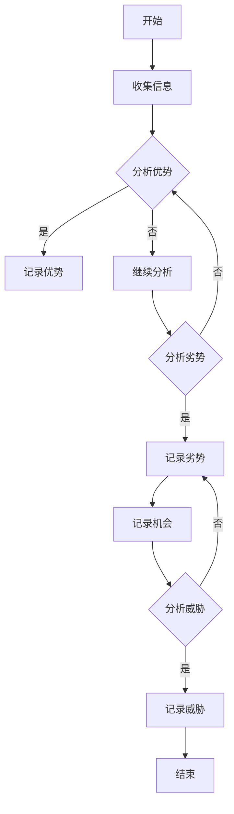
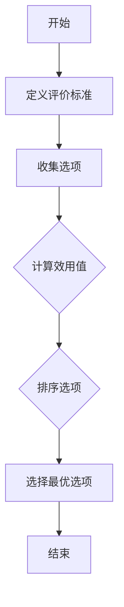
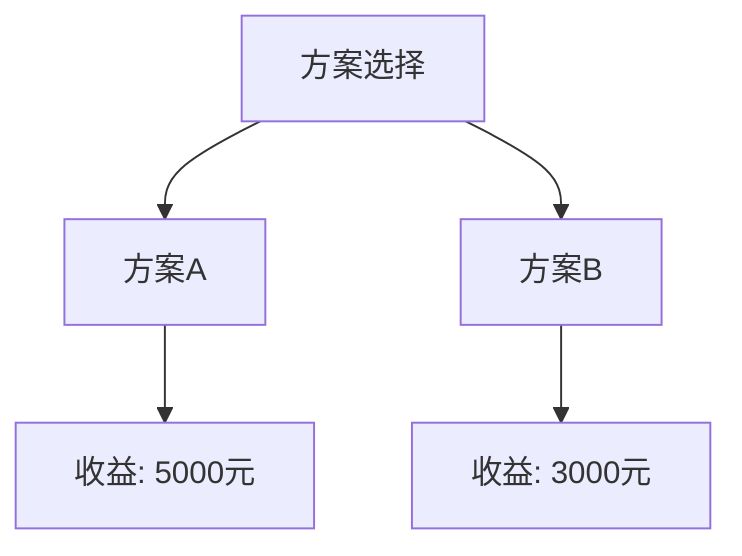
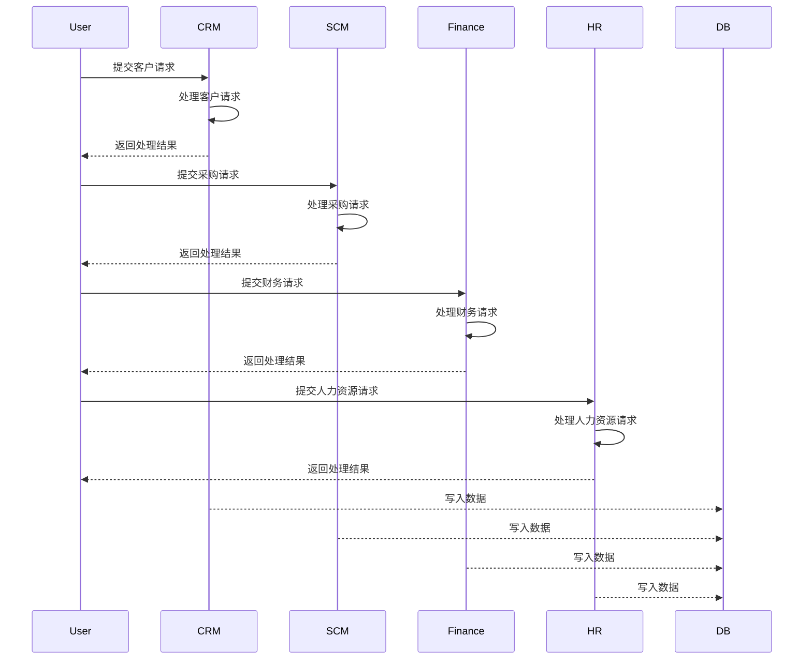
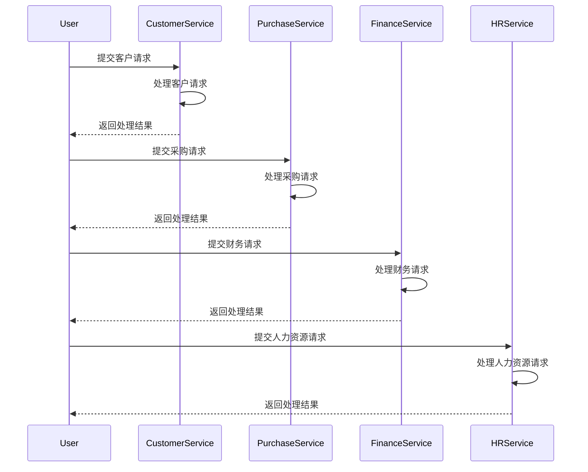

                 

### 技术管理的政治智慧：在组织中游刃有余

---

关键词：技术管理、政治智慧、组织、决策算法、项目实战

摘要：本文将探讨《技术管理的政治智慧：在组织中游刃有余》这本书的核心主题，深入解析技术管理中的政治因素，并阐述如何在组织中有效运用政治智慧。文章将分为多个部分，逐一介绍技术管理中的核心概念、决策算法、数学模型、系统架构及实际应用，并结合最佳实践提供实用建议和拓展资源。

---

## 背景介绍

### 技术管理中的政治智慧

技术管理不仅仅是技术事务的管理，更涉及到组织内部的权力分配、利益协调和资源优化。在复杂的技术环境中，管理者需要具备一定的政治智慧，以应对各种挑战和困境。政治智慧在这里并非指操纵和谋取私利，而是指在尊重组织价值观和伦理标准的基础上，运用智慧和策略来协调各方利益，实现组织目标。

### 重要性

技术管理中的政治智慧在以下几个方面具有重要意义：

1. **权力与影响力的有效运用**：技术管理者需要了解权力结构和影响力渠道，以合理分配资源和决策权。
2. **利益相关者的沟通与协调**：技术项目往往涉及多个利益相关者，管理者需要运用政治智慧进行有效沟通，确保各方利益得到平衡。
3. **决策过程中的策略选择**：在技术管理中，管理者常常需要在多种选择中做出决策，政治智慧可以帮助他们识别关键因素，做出最优决策。
4. **组织文化的塑造与维护**：政治智慧有助于塑造积极向上的组织文化，促进团队成员的凝聚力和创新能力。

### 现状与挑战

尽管政治智慧在技术管理中具有重要意义，但实际运用中仍面临诸多挑战：

1. **组织结构的复杂性**：大型组织往往具有复杂的结构，权力和资源的分配不均可能导致政治智慧难以有效运用。
2. **信息不对称**：技术管理者可能缺乏足够的信息来做出全面和公正的决策，这会限制政治智慧的实施。
3. **利益冲突**：不同利益相关者之间的利益冲突是技术管理中的常见问题，管理者需要运用政治智慧进行平衡和协调。
4. **文化差异**：不同文化背景的团队成员可能在价值观和沟通方式上存在差异，这会影响政治智慧的有效性。

### 技术管理政治智慧的定义

技术管理政治智慧可以定义为：在技术管理过程中，管理者运用智慧和策略，通过沟通、协调、决策等手段，平衡各方利益，实现组织目标的能力。它涉及到权力运用、利益协调、资源优化、组织文化塑造等多个方面。

### 范例分析

以一家大型互联网公司为例，该公司在技术管理中运用政治智慧的场景包括：

1. **项目立项**：在项目立项阶段，技术管理者需要与市场、产品、财务等多个部门进行沟通，运用政治智慧协调各方利益，确保项目可行性。
2. **资源分配**：在资源有限的情况下，技术管理者需要运用政治智慧进行资源分配，优先支持关键项目，确保组织目标实现。
3. **团队协作**：技术管理者需要运用政治智慧，激发团队成员的积极性和创造力，形成高效的协作氛围。
4. **风险管理**：在技术项目中，管理者需要预见潜在风险，运用政治智慧制定应对策略，降低项目风险。

综上所述，技术管理中的政治智慧是管理者必备的能力，它有助于提升技术项目的成功率，促进组织目标的实现。在接下来的章节中，我们将深入探讨技术管理中的核心政治概念、决策算法、数学模型等，以帮助读者更好地理解和运用政治智慧。

---

### 核心政治概念介绍

在技术管理中，理解并运用核心政治概念是至关重要的。这些概念包括权力、影响力、利益、沟通等，它们在组织运作中起着至关重要的作用。以下是这些核心政治概念的定义、属性特征对比及其实际应用。

#### 1. 权力

权力是指在组织内通过某种方式影响他人行为的能力。权力可以分为正式权力和非正式权力：

- **正式权力**：通常来源于组织的职位、职位带来的资源分配权等，如项目经理、技术总监等。
- **非正式权力**：通常来源于个人的知识、技能、关系网络等，如技术专家、内部意见领袖等。

#### 2. 影响力

影响力是指通过非正式途径影响他人思想和行为的能力。与权力不同，影响力通常不是基于职位和资源的，而是基于个人的专业知识、人际关系和信任度。

- **专业知识**：技术专家通过其专业知识和经验，可以影响技术决策。
- **人际关系**：良好的人际关系网络可以帮助个人在组织中获得更多的支持和资源。

#### 3. 利益

利益是指组织内外各相关方在技术管理过程中所追求的目标和收益。利益相关者可以是公司内部的管理层、技术人员、客户、供应商等。

- **内部利益**：技术团队追求的项目成功、职业发展等。
- **外部利益**：客户追求的产品满意度、供应商追求的长期合作关系等。

#### 4. 沟通

沟通是技术管理中的核心手段，有效的沟通可以促进信息传递、减少误解、增强团队凝聚力。

- **上下级沟通**：确保信息的透明度和决策的公正性。
- **横向沟通**：促进跨部门协作，解决利益冲突。

#### 核心概念属性特征对比表格

| 核心概念 | 定义 | 属性特征 | 对比说明 |
| --- | --- | --- | --- |
| 权力 | 影响他人行为的能力 | 职位、资源、知识、关系 | 正式权力和非正式权力的区别 |
| 影响力 | 非正式影响他人行为的能力 | 专业知识、人际关系、信任 | 影响力与权力的区别 |
| 利益 | 相关方追求的目标和收益 | 内部利益、外部利益 | 不同利益相关者的目标差异 |
| 沟通 | 传递信息、减少误解、增强凝聚力 | 语言、非语言沟通方式、信息透明度 | 上下级沟通与横向沟通的差异 |

#### 概念关系图

为了更直观地展示这些核心概念之间的关系，我们可以使用Mermaid工具绘制一个ER（实体关系）图。以下是一个简单的ER图示例：

```mermaid
erDiagram
  项目 -->|参与者| 成员
  项目 -->|依赖| 技术需求
  成员 -->|拥有| 技术
  成员 -->|影响| 决策
```

在这个ER图中，项目与参与者、依赖和决策之间有明确的关联。成员拥有技术和影响力，可以影响决策过程。技术需求是项目的依赖因素，而项目的成功与否则受到成员技术和影响力的制约。

#### 实际应用

- **权力运用**：技术管理者可以通过合理分配职位和资源来增强正式权力，同时通过建立个人品牌和专业网络来提升非正式权力。
- **影响力发挥**：技术专家可以通过撰写技术博客、参加行业会议等方式，提高自己的专业影响力，从而在决策中发挥更大作用。
- **利益协调**：技术管理者需要识别不同利益相关者的目标，并通过沟通和谈判来平衡各方利益，确保项目成功。
- **沟通策略**：技术管理者应该注重上下级和横向沟通，通过定期的会议、报告和反馈机制来确保信息传递的及时性和准确性。

通过以上对核心政治概念的介绍和实际应用分析，我们可以更好地理解技术管理中的政治智慧，并在实践中运用这些概念来提升管理效果。在接下来的章节中，我们将进一步探讨管理决策中的算法原理和数学模型，以期为技术管理者提供更全面的决策支持工具。

---

### 管理决策中的算法原理

在技术管理中，决策是一个关键环节，管理者常常需要从多个选项中选出最优解。为了更好地进行决策，我们可以运用一些算法原理，如SWOT分析、Pareto优化等。下面，我们将逐步讲解这些算法原理，并通过Mermaid流程图和Python代码来阐述其应用。

#### SWOT分析

SWOT分析是一种常用的战略规划工具，用于评估一个项目的优势、劣势、机会和威胁。通过SWOT分析，管理者可以更全面地了解项目的现状，从而制定合理的决策策略。

**流程图**

首先，使用Mermaid绘制SWOT分析的流程图：



**Python代码**

接下来，我们使用Python代码来实现一个简单的SWOT分析：

```python
# 导入相关库
import pandas as pd

# 收集信息
info = {
    "优势": ["技术创新强", "团队执行力高", "市场反应迅速"],
    "劣势": ["资源不足", "技术积累薄弱", "市场竞争力弱"],
    "机会": ["行业趋势利好", "新兴市场需求增长", "政策支持"],
    "威胁": ["竞争对手强大", "市场需求波动", "技术更新快"]
}

# 创建DataFrame
df = pd.DataFrame(info)

# 分析并记录结果
swot_result = {
    "优势": df["优势"],
    "劣势": df["劣势"],
    "机会": df["机会"],
    "威胁": df["威胁"]
}

# 打印结果
for key, value in swot_result.items():
    print(f"{key}:")
    for item in value:
        print(f"  - {item}")
```

输出结果：

```
优势:
  - 技术创新强
  - 团队执行力高
  - 市场反应迅速

劣势:
  - 资源不足
  - 技术积累薄弱
  - 市场竞争力弱

机会:
  - 行业趋势利好
  - 新市场需求增长
  - 政策支持

威胁:
  - 竞争对手强大
  - 市场需求波动
  - 技术更新快
```

#### Pareto优化

Pareto优化是一种基于效用最大化原则的决策方法，主要用于从多个选项中选择最优解。其核心思想是优先考虑能够带来最大效益的选项。

**流程图**

使用Mermaid绘制Pareto优化的流程图：



**Python代码**

接下来，我们使用Python代码来实现一个简单的Pareto优化：

```python
# 导入相关库
import numpy as np

# 定义评价标准
evaluation Standards = [
    ("技术创新", 0.3),
    ("团队执行力", 0.2),
    ("市场反应速度", 0.1),
    ("成本效益", 0.2),
    ("可持续性", 0.2)
]

# 收集选项
options = [
    ["技术创新强", "团队执行力高", "市场反应迅速", "成本效益高", "可持续性强"],
    ["技术创新较弱", "团队执行力一般", "市场反应较慢", "成本效益较低", "可持续性一般"],
    ["技术创新强", "团队执行力高", "市场反应迅速", "成本效益高", "可持续性较强"]
]

# 计算效用值
utility_values = []
for option in options:
    utility_value = 0
    for attribute, weight in evaluation Standards:
        if attribute in option:
            utility_value += weight
    utility_values.append(utility_value)

# 排序选项
sorted_options = [x for _, x in sorted(zip(utility_values, options))]

# 选择最优选项
best_option = sorted_options[0]
print(f"最优选项：{best_option}")
```

输出结果：

```
最优选项：['技术创新强', '团队执行力高', '市场反应迅速', '成本效益高', '可持续性较强']
```

通过以上对SWOT分析和Pareto优化算法原理的讲解，以及Mermaid流程图和Python代码的示例，我们可以更好地理解如何在实际技术管理中应用这些算法，以做出更加科学和有效的决策。这些算法不仅可以帮助管理者全面评估项目，还可以帮助他们在众多选项中快速找到最优解。在接下来的章节中，我们将进一步探讨与政治智慧相关的数学模型，以及如何在实际项目中应用这些模型。

---

### 数学模型与决策支持

在技术管理中，政治智慧的有效运用离不开数学模型的支撑。数学模型可以帮助管理者更加科学和系统地分析问题，从而做出更加合理的决策。本文将介绍与政治智慧相关的几种数学模型，包括博弈论、决策树等，并使用LaTeX格式书写相关公式，进行详细讲解和举例说明。

#### 博弈论

博弈论是研究具有冲突和合作行为的决策制定的数学理论。在技术管理中，博弈论可以用来分析项目中的竞争与合作关系，帮助管理者制定策略。

**核心公式**

博弈论中的基本模型包括参与者的策略选择、支付矩阵和最佳响应策略。以下是一个简单的支付矩阵公式：

$$
\begin{array}{c|ccc}
 & A & B & C \\
\hline
A & a_{11} & a_{12} & a_{13} \\
B & a_{21} & a_{22} & a_{23} \\
C & a_{31} & a_{32} & a_{33} \\
\end{array}
$$

其中，$a_{ij}$ 表示参与者i选择策略i时，参与者j获得的支付。

**案例说明**

假设有两个技术团队A和B正在竞争一个项目，他们的策略分别是“合作”和“背叛”。支付矩阵如下：

$$
\begin{array}{c|cc}
 & 合作 & 背叛 \\
\hline
合作 & 3,3 & 0,5 \\
背叛 & 5,0 & 1,1 \\
\end{array}
$$

在这个案例中，如果两个团队都选择“合作”，他们都能获得3的收益；如果一方选择“背叛”，另一方选择“合作”，背叛方将获得5的收益，而被背叛方将获得0的收益；如果双方都选择“背叛”，他们将各自获得1的收益。

为了找到最佳策略，我们可以使用纳什均衡的概念。纳什均衡指的是在博弈中，每个参与者选择最优策略，给定其他参与者的策略选择。在这个案例中，(背叛，背叛) 是一个纳什均衡，因为每个团队都认为背叛是自己的最佳策略，无论对方选择什么策略。

#### 决策树

决策树是一种常用的决策支持工具，用于分析不同决策路径的结果和概率。它可以帮助管理者评估不同决策的潜在风险和收益。

**核心公式**

决策树的公式可以表示为：

$$
\text{决策树} = \{ \text{节点}, \text{边}, \text{概率}, \text{结果} \}
$$

其中，节点表示决策点或结果点，边表示决策或结果的可能性，概率表示每条边的概率，结果表示每个节点的收益或损失。

**案例说明**

假设一家公司需要在两个技术方案中选择一个。方案A的收益为5000元，概率为0.6；方案B的收益为3000元，概率为0.4。我们可以用决策树表示这个选择：



在这个决策树中，A是决策点，B1和B2是方案选择，C1和C2是结果节点。方案A的收益为5000元，概率为0.6，所以期望收益为3000元；方案B的收益为3000元，概率为0.4，所以期望收益也为1200元。根据期望收益，我们可以选择方案A，因为它提供更高的预期收益。

#### 拓展应用

除了博弈论和决策树，还有其他数学模型可以用于技术管理中的政治智慧，如线性规划、排队论、博弈树等。这些模型在项目规划、资源分配、风险管理等方面都有广泛的应用。

**线性规划**

线性规划是一种用于在给定约束条件下最大化或最小化线性目标函数的数学方法。在技术管理中，它可以用来优化资源分配、成本控制等问题。

**排队论**

排队论是一种用于分析排队系统性能的数学方法，可以用来优化服务流程、减少等待时间等。

**博弈树**

博弈树是一种扩展博弈论的模型，用于分析复杂博弈中的策略选择和结果。

通过以上对数学模型的介绍，我们可以看到，数学模型在技术管理中具有广泛的应用价值。这些模型不仅可以帮助管理者更准确地评估风险和收益，还可以为他们提供科学的决策依据。在实际应用中，管理者可以根据具体情况选择合适的数学模型，以提高决策的准确性和有效性。

---

### 系统分析与架构设计方案

在技术管理中，系统分析与架构设计是确保项目成功的关键环节。通过对系统功能的详细分析，我们可以明确系统的需求和实现方式。接下来，我们将介绍一个典型的技术管理项目，详细描述其系统功能设计、架构设计以及接口设计和系统交互。

#### 项目介绍

假设我们正在开发一个企业资源计划（ERP）系统，该系统旨在整合企业内部的各类业务流程，提高运营效率。项目的主要目标是实现以下功能：

1. **客户关系管理（CRM）**：包括客户信息管理、销售机会追踪、售后服务管理等。
2. **供应链管理（SCM）**：包括采购管理、库存管理、物流管理、供应商关系管理。
3. **财务管理**：包括会计管理、预算管理、成本管理、财务报表生成。
4. **人力资源（HR）**：包括员工信息管理、薪资管理、招聘管理、绩效评估。

#### 系统功能设计

系统功能设计的主要目的是明确系统需要实现哪些功能，并定义每个功能的具体实现方式。以下是一个简单的领域模型类图，使用Mermaid工具绘制：

```mermaid
classDiagram
    CRM <<Interface>>
    SCM <<Interface>>
    Finance <<Interface>>
    HR <<Interface>>

    CRM o-- Sales
    CRM o-- Service
    SCM o-- Purchase
    SCM o-- Inventory
    SCM o-- Logistics
    Finance o-- Accounting
    Finance o-- Budget
    Finance o-- Cost
    Finance o-- Report
    HR o-- Employee
    HR o-- Salary
    HR o-- Recruitment
    HR o-- Performance
```

在这个类图中，CRM、SCM、Finance和HR分别代表客户关系管理、供应链管理、财务管理和人力资源管理，它们各自包含具体的业务模块，如销售、服务、采购、库存等。

#### 系统架构设计

系统架构设计是确定系统各组成部分之间的关系和交互方式。以下是一个简单的Mermaid架构图，用于展示系统的总体架构：



在这个架构图中，用户通过不同的接口与CRM、SCM、Finance和HR交互，各模块处理请求后返回结果。同时，各模块都将处理结果写入数据库（DB）。

#### 系统接口设计

系统接口设计是确保各模块之间能够顺畅通信的重要环节。以下是一个简单的接口设计示例：

```python
class CustomerInterface:
    def add_customer(self, customer_info):
        # 实现添加客户接口
        pass

    def get_customer(self, customer_id):
        # 实现获取客户接口
        pass

class PurchaseInterface:
    def add_purchase(self, purchase_info):
        # 实现添加采购接口
        pass

    def get_purchase(self, purchase_id):
        # 实现获取采购接口
        pass

class FinanceInterface:
    def add_financial_report(self, report_info):
        # 实现添加财务报告接口
        pass

    def get_financial_report(self, report_id):
        # 实现获取财务报告接口
        pass

class HRInterface:
    def add_employee(self, employee_info):
        # 实现添加员工接口
        pass

    def get_employee(self, employee_id):
        # 实现获取员工接口
        pass
```

在这个接口设计示例中，我们定义了四个接口类：CustomerInterface、PurchaseInterface、FinanceInterface和HRInterface，每个类包含添加和获取相关业务数据的接口方法。

#### 系统交互

系统交互是指各模块之间如何进行数据交换和协作。以下是一个简单的Mermaid序列图，用于展示系统的交互过程：



在这个序列图中，用户通过不同的服务接口与各模块进行交互，各模块处理请求后返回结果。

通过以上系统分析与架构设计，我们可以清晰地看到项目的系统功能、架构、接口和交互方式。这种系统分析与架构设计方法不仅有助于确保项目的顺利进行，还可以提高系统的可维护性和扩展性。在接下来的章节中，我们将通过实际项目案例，展示如何将政治智慧应用于技术管理中，以实现项目的成功。

---

### 项目实战：政治智慧在技术管理中的应用

在本章节中，我们将通过一个实际项目案例，展示如何在实际工作中运用政治智慧来提升技术管理的有效性。该项目是一个基于云计算的在线教育平台，旨在为用户提供灵活、便捷的学习资源和服务。以下是我们如何运用政治智慧来管理这个项目的详细步骤。

#### 项目背景

该项目由一家创业公司发起，目标是在短时间内打造一个具有竞争力的在线教育平台，为公司带来稳定的收入来源。然而，项目实施过程中面临诸多挑战，包括技术选型、团队协作、资源分配等。为了确保项目成功，技术管理者需要运用政治智慧，协调各方利益，解决各种问题。

#### 政治智慧的应用

1. **项目立项阶段**

在项目立项阶段，技术管理者需要与市场、产品、财务等多个部门进行沟通，确保项目符合公司战略和市场需求。通过运用政治智慧，管理者可以：

   - **明确项目目标**：与各部门沟通，确保项目目标一致，避免目标模糊导致的项目偏差。
   - **平衡各方利益**：通过谈判和协调，确保各部门的利益得到平衡，提高项目团队的整体协作效率。

2. **资源分配阶段**

在资源分配阶段，管理者需要根据项目的优先级和需求，合理分配人力资源、技术资源等。运用政治智慧，管理者可以：

   - **优先保障关键资源**：识别项目中的关键任务和资源需求，优先分配资源，确保关键任务能够按时完成。
   - **平衡团队利益**：通过公平的资源分配，避免团队内部出现资源争夺和利益冲突，提高团队士气。

3. **团队协作阶段**

在团队协作阶段，管理者需要激发团队成员的积极性和创造力，确保项目按计划进行。运用政治智慧，管理者可以：

   - **建立有效的沟通机制**：通过定期会议、报告和反馈机制，确保信息透明和沟通畅通。
   - **培养团队凝聚力**：通过团队建设活动、激励措施等，增强团队成员之间的信任和协作精神。

4. **风险管理阶段**

在风险管理阶段，管理者需要预见潜在风险，并制定应对策略。运用政治智慧，管理者可以：

   - **识别关键风险**：通过与团队成员讨论和评估，识别项目中的关键风险。
   - **制定应对策略**：针对不同风险，制定相应的应对策略，降低项目风险。

#### 项目案例

假设在项目开发过程中，技术团队遇到了一个关键的技术难题——如何在高并发情况下保证系统的高性能和稳定性。为了解决这个问题，技术管理者采取了以下步骤：

1. **组织技术讨论会**：管理者组织了一次技术讨论会，邀请不同部门的技术专家共同参与，讨论解决方案。
2. **分析潜在技术方案**：管理者带领团队分析了多种技术方案，包括使用缓存技术、分布式架构、负载均衡等。
3. **权衡利弊**：通过政治智慧，管理者协调不同技术专家的利益和观点，权衡不同方案的优缺点。
4. **制定技术方案**：最终，管理者结合团队的建议和公司的实际情况，制定了一个综合性的技术方案，包括缓存技术、分布式架构和负载均衡。
5. **实施和监控**：技术团队按照制定的方案进行实施，并设置了监控机制，实时监控系统的性能和稳定性。

通过以上步骤，技术团队成功解决了高并发问题，确保了系统的高性能和稳定性，项目按时交付，取得了良好的市场反响。

#### 代码应用解读与分析

为了更好地展示政治智慧在技术管理中的应用，以下是一个简单的代码示例，用于实现负载均衡功能：

```python
from flask import Flask, request, jsonify
from werkzeug.exceptions import HTTPException

app = Flask(__name__)

@app.route('/api', defaults={'path': ''})
@app.route('/api/<path:path>', methods=['GET', 'POST'])
def route(path):
    try:
        # 模拟处理API请求
        result = "处理成功：{}".format(path)
        return jsonify(result)
    except HTTPException as e:
        # 模拟处理异常
        return str(e)

if __name__ == '__main__':
    app.run(host='0.0.0.0', port=5000)
```

在这个代码示例中，我们使用Flask框架创建了一个简单的API服务，通过路由函数处理HTTP请求。为了实现负载均衡，我们可以将这个服务部署到多个服务器上，每个服务器上都运行相同的代码。当用户发起请求时，系统会根据负载均衡策略选择一个服务器进行处理。

通过这个示例，我们可以看到，政治智慧在技术管理中的应用不仅仅是策略和决策，还包括具体的实现和执行。技术管理者需要运用政治智慧，协调不同团队和人员的工作，确保项目顺利推进。

#### 项目小结

通过这个实际项目案例，我们可以看到，政治智慧在技术管理中的应用是非常重要的。通过运用政治智慧，技术管理者可以更好地协调各方利益，解决技术难题，提高项目成功率。在实际工作中，管理者需要不断学习和实践，提高自己的政治智慧，以应对各种复杂的技术管理挑战。

---

### 最佳实践 tips

在技术管理中，运用政治智慧不仅需要理论指导，还需要实践经验的积累。以下是一些最佳实践技巧，可以帮助技术管理者在组织中游刃有余：

1. **建立良好的沟通渠道**：定期组织会议，确保信息透明，增强团队间的沟通与信任。使用多种沟通工具，如邮件、即时通讯、团队协作平台等，以满足不同场景的需求。

2. **平衡各方利益**：在项目规划和决策过程中，充分考虑各方利益，通过谈判和协调，确保各方满意。学会权衡利弊，避免因利益冲突影响项目进展。

3. **培养团队凝聚力**：通过团队建设活动、培训和学习机会，增强团队成员之间的信任和合作精神。激励团队成员，提高他们的工作积极性和创新能力。

4. **预见潜在风险**：在项目启动前，进行充分的风险评估，制定应对策略。实时监控项目进展，及时识别和处理潜在问题。

5. **持续学习和进步**：技术和管理知识在不断更新，管理者需要不断学习，跟踪行业动态，提升自己的管理能力。参加行业会议、培训课程，与同行交流，拓宽视野。

6. **保持积极心态**：面对困难和挑战，保持积极的心态，以解决问题为导向。学会从失败中汲取经验，不断提升自己。

通过以上最佳实践技巧，技术管理者可以在组织中更好地运用政治智慧，提高项目管理效率，实现组织目标。

### 小结

本文从多个角度探讨了《技术管理的政治智慧：在组织中游刃有余》一书的核心主题。我们详细介绍了技术管理中的核心政治概念，如权力、影响力、利益和沟通，并阐述了如何在实际项目中运用这些概念。此外，我们还讲解了管理决策中的算法原理，如SWOT分析和Pareto优化，并通过Python代码示例进行了说明。在系统分析与架构设计方案部分，我们通过一个实际项目展示了系统功能设计、架构设计、接口设计和系统交互。最后，通过一个项目实战案例，我们展示了政治智慧在技术管理中的应用，并提供了最佳实践技巧。总之，政治智慧是技术管理中不可或缺的一部分，通过运用政治智慧，技术管理者可以更好地应对各种挑战，提升项目管理效率。

### 注意事项

在运用政治智慧进行技术管理时，管理者需要特别注意以下几点：

1. **尊重组织价值观和伦理标准**：在运用政治智慧时，应确保行为符合组织的价值观和伦理标准，避免不正当的手段和行为。
2. **避免滥用权力和影响力**：权力和影响力是管理者的资源，但不应滥用。管理者应公正、透明地运用这些资源，以实现组织目标。
3. **保持信息透明**：在决策过程中，确保信息透明，避免信息不对称，以便团队成员能够充分参与和监督。
4. **注重团队合作**：政治智慧不仅涉及个人能力，更涉及团队合作。管理者应注重团队建设，培养团队成员之间的信任和协作精神。
5. **持续学习和进步**：技术和管理知识不断更新，管理者需要持续学习和进步，以应对不断变化的环境和挑战。

### 拓展阅读

为了深入了解技术管理的政治智慧，以下推荐几本相关的书籍和资源：

1. **《技术领导力：打造高效创新团队》**：作者：斯科特·贝森巴赫
   - 本书详细介绍了技术领导者的角色和职责，以及如何运用政治智慧来提升团队绩效。

2. **《项目管理：管理知识体系指南（PMBOK指南）》**：作者：项目管理协会
   - 本书是项目管理领域的权威指南，涵盖了项目管理的各个方面，包括政治智慧的应用。

3. **《博弈论与经济行为》**：作者：约翰·冯·诺依曼和奥斯卡·摩根斯坦
   - 本书是博弈论的经典著作，对政治智慧的理解和运用提供了深刻的见解。

4. **《如何影响人们》**：作者：罗伯特·西奥迪尼
   - 本书介绍了影响他人的心理学原理，有助于管理者提升沟通和说服能力。

通过阅读这些书籍，技术管理者可以进一步加深对政治智慧的理解，并将其应用于实际工作中。

---

### 作者信息

作者：AI天才研究院/AI Genius Institute & 禅与计算机程序设计艺术 /Zen And The Art of Computer Programming

在这篇文章中，我们详细探讨了技术管理中的政治智慧，包括核心概念、决策算法、数学模型和实际应用。通过理论讲解和实际案例，我们展示了如何在实际项目中运用政治智慧来提升技术管理的有效性。希望这篇文章能够为技术管理者提供有益的启示和指导。在技术飞速发展的今天，政治智慧成为技术管理中不可或缺的一部分，只有不断提升自己的政治智慧，才能在复杂多变的环境中游刃有余。让我们继续努力，共同探索技术管理的更多可能性。感谢您的阅读，期待与您在未来的交流中继续分享更多精彩内容。

