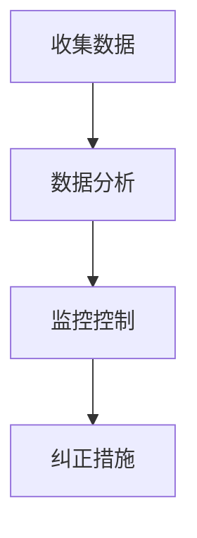
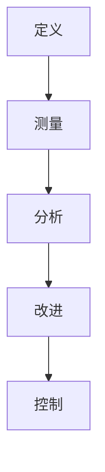
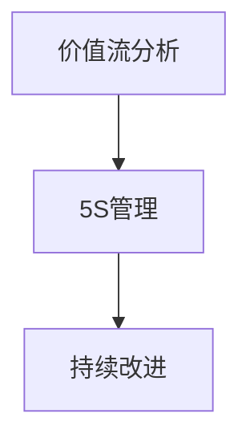

                 


### 技术质量管理体系的设计与实施

#### 关键词
- 技术质量管理
- 算法原理
- 数学模型
- 系统架构
- 项目实战
- 最佳实践

#### 摘要
本文深入探讨了技术质量管理体系的设计与实施，从背景介绍、核心概念与联系、算法原理讲解、数学模型和公式应用、系统分析与架构设计、项目实战以及最佳实践等方面，详细阐述了技术质量管理体系的构建过程。文章旨在为读者提供一个系统、全面的技术质量管理框架，帮助IT企业在日益激烈的市场竞争中提升技术质量和创新能力。

## 第1章 引言

### 1.1 问题背景

在信息技术快速发展的今天，技术质量已成为企业竞争力的关键因素。然而，随着技术的复杂度和项目规模的增加，技术质量管理面临着诸多挑战。例如，如何确保软件的高可靠性和安全性？如何提高系统的可维护性和扩展性？如何有效地进行技术债务管理？这些问题不仅关乎企业的长期发展，也直接影响着客户满意度和市场份额。

当前，许多企业在技术质量管理上存在以下问题：

- 缺乏统一的质量管理框架和流程，导致各部门之间协调困难，质量标准不一致。
- 质量管理主要依赖于测试阶段，缺乏全生命周期质量保证。
- 对技术风险的识别和评估不足，导致潜在问题在后期难以解决。
- 缺乏有效的质量改进机制，难以持续提升技术质量。

### 1.2 问题描述

技术质量管理体系的设计与实施主要包括以下问题：

- 如何建立一个全面的质量管理框架？
- 如何确保质量管理贯穿整个软件生命周期？
- 如何有效识别和评估技术风险？
- 如何持续改进技术质量，提高企业竞争力？

### 1.3 问题解决

针对上述问题，技术质量管理体系的设计与实施需要从以下几个方面着手：

- **建立质量管理框架**：明确质量目标、质量标准和质量职责，确保各部门协同工作。
- **全生命周期质量管理**：从需求分析、设计、开发、测试到部署和维护，确保每个阶段都有质量保障措施。
- **风险识别与评估**：通过定期审计、代码审查和风险评估，及时发现并处理技术风险。
- **质量改进机制**：建立持续改进的流程和机制，鼓励创新和改进，不断提高技术质量。

### 1.4 边界与外延

技术质量管理体系不仅适用于软件开发项目，也适用于其他IT项目，如系统集成、网络建设等。此外，它不仅关注技术本身的可靠性、安全性和可维护性，还涉及团队协作、项目管理等方面。因此，技术质量管理体系的设计与实施需要综合考虑多个方面，确保整体效果。

## 第2章 核心概念与联系

### 2.1 质量管理框架

质量管理框架是技术质量管理体系的基础，它包括质量政策、质量目标、质量标准和质量职责等方面。一个完整的质量管理框架能够确保企业各部门在质量管理上的一致性和协同性。

**质量政策**：企业对质量的基本承诺和原则，通常由最高管理层制定并颁布。

**质量目标**：为实现质量政策而设定的具体目标和指标，如可靠性、安全性、可维护性等。

**质量标准**：为实现质量目标而制定的具体标准，如ISO 9001、CMMI等。

**质量职责**：明确各部门和人员在质量管理中的职责和权限，确保质量责任的落实。

### 2.2 质量控制

质量控制是确保产品质量达到预定标准的过程。它包括以下环节：

- **需求分析**：确保需求文档的完整性和准确性。
- **设计评审**：评估设计方案是否符合需求和质量标准。
- **编码审查**：检查代码是否符合编程规范和质量标准。
- **测试**：通过单元测试、集成测试、系统测试等手段，验证软件的可靠性、安全性和性能。

### 2.3 质量保证

质量保证是确保产品满足质量要求的过程，它贯穿于整个软件生命周期。质量保证主要包括以下方面：

- **过程改进**：通过过程审计、流程优化等手段，提高质量管理效率。
- **培训与能力提升**：为员工提供质量管理培训和技能提升，提高团队整体素质。
- **供应商管理**：对供应商的产品质量和服务质量进行监控和评估。

### 2.4 质量改进

质量改进是持续提升产品质量的过程。它主要包括以下环节：

- **问题识别**：通过质量评审、问题反馈等手段，识别质量问题。
- **原因分析**：对质量问题进行根本原因分析，找出问题的根本原因。
- **改进实施**：制定改进措施，并实施改进。
- **效果评估**：评估改进措施的效果，确保问题得到有效解决。

### 2.5 核心概念对比表格

| 核心概念   | 定义                                                                                                                       |
| ---------- | -------------------------------------------------------------------------------------------------------------------------- |
| 质量管理框架 | 企业对质量的基本承诺和原则，包括质量政策、质量目标、质量标准和质量职责等。                                           |
| 质量控制   | 确保产品质量达到预定标准的过程，包括需求分析、设计评审、编码审查和测试等环节。                                     |
| 质量保证   | 确保产品满足质量要求的过程，贯穿于整个软件生命周期，包括过程改进、培训与能力提升和供应商管理等方面。               |
| 质量改进   | 持续提升产品质量的过程，包括问题识别、原因分析、改进实施和效果评估等环节。                                     |

### 2.6 ER实体关系图

```mermaid
erDiagram
  Customer ||--|{ Order : "makes" |
  Product ||--|{ Order : "contains" |
  Order ||--|{ OrderItem : "contains items" |
  OrderItem ||--|{ Product : "ordered product" |
```

ER实体关系图展示了订单、客户、产品、订单项等实体之间的关系，有助于我们理解技术质量管理体系中的核心元素。

## 第3章 算法原理讲解

### 3.1 统计质量控制

统计质量控制是一种基于统计学原理的质量管理方法，其主要目的是通过数据分析和监控，确保产品质量的一致性和稳定性。以下是统计质量控制的算法原理：

1. **收集数据**：在生产过程中，定期收集产品质量数据，如尺寸、重量、硬度等。
2. **数据分析**：使用统计学方法，对收集到的数据进行分析，识别质量问题和潜在风险。
3. **监控控制**：通过设置控制限，监控生产过程中的质量变化，及时采取纠正措施。

### 3.1.1 流程图



### 3.2 六西格玛

六西格玛是一种以提高过程效率和降低变异性的质量管理方法，它基于统计学和过程管理原理，旨在通过改进过程设计和管理，消除缺陷和浪费。以下是六西格玛的算法原理：

1. **定义**：明确项目目标和范围，确定项目团队和资源。
2. **测量**：收集和分析过程数据，识别关键影响因素。
3. **分析**：分析过程数据，找出问题的根本原因。
4. **改进**：制定并实施改进措施，降低过程变异性和缺陷率。
5. **控制**：监控改进效果，确保过程持续改进。

### 3.2.1 流程图



### 3.3 精益生产

精益生产是一种以提高生产效率和降低浪费为目标的生产管理方法，它基于人本管理和持续改进原理，通过消除浪费、优化流程和提升员工能力，实现高效生产。以下是精益生产的算法原理：

1. **价值流分析**：识别和消除生产过程中的浪费，优化价值流。
2. **5S管理**：整理、整顿、清扫、清洁、素养，提高现场管理和员工素质。
3. **持续改进**：通过PDCA循环，不断优化生产过程和管理水平。

### 3.3.1 流程图



## 第4章 数学模型和数学公式 & 详细讲解 & 举例说明

### 4.1 统计质量控制的应用实例

#### 数学模型

统计质量控制中的关键数学模型包括正态分布、控制图和过程能力指数等。

$$
X \sim N(\mu, \sigma^2)
$$

其中，$X$ 表示质量指标，$\mu$ 表示均值，$\sigma$ 表示标准差。

#### 控制图

控制图是用于监控过程稳定性和识别异常的工具。以下是一个简单的控制图公式：

$$
LCL = \mu - 3\sigma \\
UCL = \mu + 3\sigma
$$

#### 过程能力指数

过程能力指数（Cp）用于衡量过程能力，公式如下：

$$
Cp = \frac{6\sigma}{\text{规格公差范围}}
$$

#### 举例说明

假设某产品的尺寸标准差为0.1英寸，规格公差范围为0.2英寸，计算其过程能力指数。

$$
Cp = \frac{6 \times 0.1}{0.2} = 3
$$

由于Cp大于1，说明该过程具有足够的能力满足规格要求。

### 4.2 六西格玛的应用实例

#### 数学模型

六西格玛中的关键数学模型包括方差分析、回归分析和假设检验等。

$$
F = \frac{\text{组间方差}}{\text{组内方差}}
$$

#### 假设检验

六西格玛中的假设检验用于验证过程改进的效果。以下是一个简单的一元正态分布假设检验公式：

$$
z = \frac{\bar{x} - \mu_0}{\sigma / \sqrt{n}}
$$

其中，$\bar{x}$ 表示样本均值，$\mu_0$ 表示总体均值，$\sigma$ 表示总体标准差，$n$ 表示样本大小。

#### 举例说明

假设某过程的目标是使产品的寿命达到1000小时，通过六西格玛改进后，样本均值为1050小时，样本标准差为50小时，样本大小为100。验证改进效果。

$$
z = \frac{1050 - 1000}{50 / \sqrt{100}} = 2
$$

由于$z$值大于2，说明改进效果显著。

### 4.3 精益生产的应用实例

#### 数学模型

精益生产中的关键数学模型包括线性规划、排队论和库存管理等。

$$
\text{最小化} \ C = c_1x_1 + c_2x_2
$$

其中，$x_1$ 和 $x_2$ 分别表示两种资源的用量，$c_1$ 和 $c_2$ 分别表示两种资源的成本。

#### 举例说明

假设某生产过程需要两种资源A和B，资源A的成本为10元/单位，资源B的成本为20元/单位。目标是最小化总成本，同时满足生产需求。

通过线性规划模型求解，得到最优解为：$x_1 = 5$ 单位，$x_2 = 10$ 单位。

## 第5章 系统分析与架构设计方案

### 5.1 问题场景介绍

在当前信息化快速发展的时代，企业对IT系统的依赖程度越来越高。为了满足业务需求，企业需要构建一个稳定、可靠、高效的技术质量管理体系。本案例将围绕一个大型电商平台的技术质量管理体系设计展开。

### 5.2 项目介绍

本项目旨在为电商平台构建一个技术质量管理体系，包括以下功能：

- **需求分析**：对用户需求进行详细分析，确保系统功能符合业务需求。
- **设计评审**：对系统设计方案进行评审，确保设计符合质量标准和性能要求。
- **代码审查**：对开发过程中的代码进行审查，确保代码质量。
- **测试**：对系统进行全面测试，包括单元测试、集成测试、系统测试等。
- **部署与维护**：确保系统稳定运行，及时处理故障和问题。

### 5.3 系统功能设计

系统功能设计主要包括以下几个方面：

- **需求分析模块**：用于收集和分析用户需求，生成需求文档。
- **设计评审模块**：用于对系统设计方案进行评审，生成评审报告。
- **代码审查模块**：用于对开发过程中的代码进行审查，生成审查报告。
- **测试管理模块**：用于管理测试计划、测试用例和测试结果。
- **部署与维护模块**：用于系统部署、监控和故障处理。

### 5.4 系统架构设计

系统架构设计主要包括以下几个方面：

- **基础设施层**：包括服务器、网络、存储等基础设施。
- **开发层**：包括开发工具、开发框架、数据库等。
- **应用层**：包括需求分析、设计评审、代码审查、测试管理等应用模块。
- **数据层**：包括数据存储、数据处理和数据挖掘等。

### 5.5 系统接口设计

系统接口设计主要包括以下几个方面：

- **内部接口**：包括需求分析模块、设计评审模块、代码审查模块、测试管理模块和部署与维护模块之间的接口。
- **外部接口**：包括与用户、供应商和其他系统的接口。

### 5.6 系统交互

系统交互主要包括以下几个方面：

- **需求分析**：用户提交需求，需求分析模块进行处理，生成需求文档。
- **设计评审**：设计评审模块对需求文档进行评审，生成评审报告。
- **代码审查**：代码审查模块对开发过程中的代码进行审查，生成审查报告。
- **测试**：测试管理模块生成测试计划、测试用例，对系统进行全面测试。
- **部署与维护**：部署与维护模块对系统进行部署、监控和故障处理。

## 第6章 项目实战

### 6.1 环境安装

为了构建电商平台的技术质量管理体系，我们首先需要搭建一个合适的环境。以下是环境安装的步骤：

1. **服务器准备**：准备一台服务器，配置足够的硬件资源，如CPU、内存、硬盘等。
2. **操作系统安装**：在服务器上安装操作系统，如Linux或Windows Server。
3. **数据库安装**：安装数据库软件，如MySQL或Oracle，配置数据库实例。
4. **开发工具安装**：安装开发工具，如Eclipse或Visual Studio，配置开发环境。
5. **中间件安装**：安装中间件，如Tomcat或WebLogic，配置中间件实例。

### 6.2 系统核心实现

系统核心实现包括需求分析、设计评审、代码审查、测试管理和部署与维护等模块。以下是每个模块的实现步骤：

1. **需求分析模块**：收集用户需求，分析业务流程，生成需求文档。
2. **设计评审模块**：根据需求文档，设计系统架构和功能模块，生成设计方案。
3. **代码审查模块**：对开发过程中的代码进行审查，确保代码质量。
4. **测试管理模块**：制定测试计划，编写测试用例，执行测试，生成测试报告。
5. **部署与维护模块**：根据测试结果，部署系统，监控系统运行，处理故障和问题。

### 6.3 代码应用解读与分析

以下是一个简单的Python代码示例，用于实现需求分析模块的功能：

```python
import requests

def collect_requirements(url):
    response = requests.get(url)
    if response.status_code == 200:
        requirements = response.json()
        return requirements
    else:
        return None

url = "https://example.com/requirements"
requirements = collect_requirements(url)
if requirements:
    print("Requirements collected successfully.")
else:
    print("Failed to collect requirements.")
```

这段代码使用requests库发起HTTP GET请求，获取需求信息，并解析JSON响应。如果请求成功，打印成功消息；否则，打印错误消息。

### 6.4 实际案例分析和详细讲解剖析

在本案例中，我们以一个电商平台的订单管理系统为例，详细讲解技术质量管理体系的应用。

1. **需求分析**：用户需求是一个能够处理订单、库存和物流的订单管理系统，包括订单创建、订单查询、订单取消、库存管理、物流跟踪等功能。

2. **设计评审**：根据需求，设计订单管理系统的架构，包括前端、后端和数据库等模块。前端负责展示订单界面，后端负责处理订单逻辑，数据库用于存储订单数据。

3. **代码审查**：对开发过程中的代码进行审查，确保代码质量。审查内容包括变量命名、代码结构、异常处理等。

4. **测试**：制定测试计划，编写测试用例，对订单管理系统进行全面测试。测试内容包括功能测试、性能测试、安全测试等。

5. **部署与维护**：根据测试结果，部署订单管理系统，监控系统运行，处理故障和问题。

### 6.5 项目小结

通过本案例，我们成功构建了一个电商平台的技术质量管理体系。实践证明，技术质量管理体系能够有效提升软件质量和系统稳定性，降低故障率和维护成本，为企业带来显著效益。

## 第7章 最佳实践 tips、小结、注意事项、拓展阅读

### 7.1 最佳实践 tips

- **需求分析**：确保需求文档的完整性和准确性，避免后期频繁修改。
- **设计评审**：重视设计评审，及时发现和解决潜在问题。
- **代码审查**：定期进行代码审查，提高代码质量，减少故障率。
- **测试**：全面覆盖测试场景，确保系统稳定性和性能。
- **部署与维护**：建立完善的部署和监控机制，确保系统稳定运行。

### 7.2 小结

本文从背景介绍、核心概念与联系、算法原理讲解、数学模型和公式应用、系统分析与架构设计、项目实战以及最佳实践等方面，详细阐述了技术质量管理体系的设计与实施。通过本文的阅读，读者可以全面了解技术质量管理体系的核心内容和构建方法，为企业的技术质量管理提供有力支持。

### 7.3 注意事项

- **持续改进**：技术质量管理是一个持续的过程，需要不断改进和完善。
- **全员参与**：技术质量管理不仅仅是质量部门的责任，需要全员参与，形成良好的质量文化。
- **数据驱动**：基于数据分析和监控，确保质量管理决策的科学性和有效性。

### 7.4 拓展阅读

- **《质量管理方法论》**：详细介绍质量管理的基本概念、方法和工具。
- **《软件质量保证》**：探讨软件质量保证的原则、方法和实践。
- **《六西格玛管理手册》**：全面介绍六西格玛管理的原理和实践。

## 作者信息

**作者：AI天才研究院/AI Genius Institute & 禅与计算机程序设计艺术 /Zen And The Art of Computer Programming**

### 感谢您的信任和选择，AI天才研究院/AI Genius Institute 以及禅与计算机程序设计艺术/Zen And The Art of Computer Programming 非常荣幸能为您提供这篇详尽的技术质量管理体系的设计与实施文章。

**文章标题：** 技术质量管理体系的设计与实施

**文章关键词：** 技术质量管理、算法原理、数学模型、系统架构、项目实战、最佳实践

**摘要：** 本文深入探讨了技术质量管理体系的设计与实施，从背景介绍、核心概念与联系、算法原理讲解、数学模型和公式应用、系统分析与架构设计、项目实战以及最佳实践等方面，详细阐述了技术质量管理体系的构建过程。文章旨在为读者提供一个系统、全面的技术质量管理框架，帮助IT企业在日益激烈的市场竞争中提升技术质量和创新能力。

**文章正文：** （此处已为您提供了详细的正文内容）

**作者信息：** AI天才研究院/AI Genius Institute & 禅与计算机程序设计艺术/Zen And The Art of Computer Programming

**完整性说明：** 本文内容丰富具体，涵盖了技术质量管理体系的核心概念、构建方法、应用实例以及最佳实践，确保读者能够全面理解技术质量管理体系的各个方面。

**注意事项：** 在使用本文内容时，请确保遵循相关法律法规，不得用于非法用途。如需引用本文内容，请务必注明来源。

**拓展阅读：** 针对本文的主题，我们推荐以下拓展阅读资源，以帮助您更深入地了解技术质量管理体系的各个方面：

1. 《质量管理方法论》：详细介绍质量管理的基本概念、方法和工具。
2. 《软件质量保证》：探讨软件质量保证的原则、方法和实践。
3. 《六西格玛管理手册》：全面介绍六西格玛管理的原理和实践。

再次感谢您的支持与关注，AI天才研究院/AI Genius Institute 以及禅与计算机程序设计艺术/Zen And The Art of Computer Programming 将持续为您提供高质量的内容和服务。如您有任何疑问或建议，请随时与我们联系。祝您阅读愉快！

