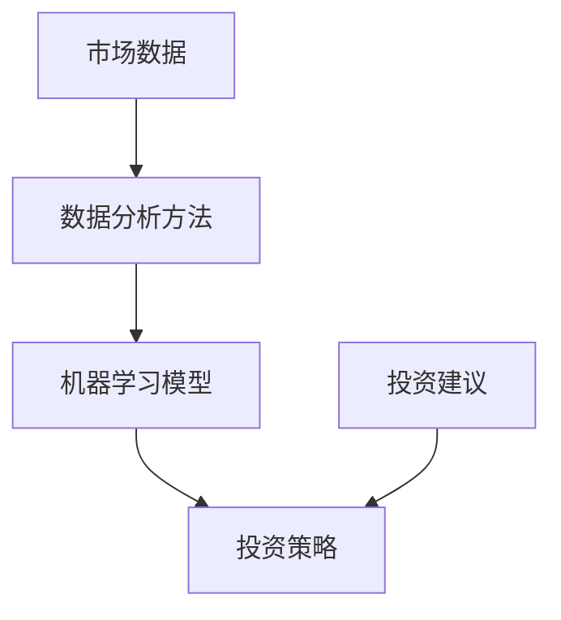

                 

# 投资建议生成与优化

## 关键词

- 投资建议
- 生成算法
- 优化策略
- 数据分析
- 机器学习
- 技术分析

## 摘要

本文将探讨投资建议的生成与优化，通过介绍当前市场上流行的技术方法，如数据分析、机器学习和技术分析，详细阐述如何利用这些技术为投资者提供准确的建议。文章还将深入分析投资建议生成中的关键问题，包括数据预处理、模型选择和优化算法的应用，并通过实际案例展示如何将理论知识应用于实践中，以实现投资建议的优化。最后，我们将总结最佳实践，提供未来研究方向，并指出可能出现的挑战和限制。

## 第一部分：投资建议生成的背景和核心概念

### 第1章：投资建议的基本概念和生成问题

#### 1.1 投资建议的定义及其重要性

投资建议是指在特定市场条件下，对投资者资产配置、选股策略、买卖时机等方面提供的一系列指导意见。它在金融市场中起着至关重要的作用，有助于投资者做出更加理性和科学的决策，从而提高投资回报率，降低风险。

#### 1.2 投资建议生成问题的描述与解决思路

生成高质量的、个性化的投资建议是一个复杂的问题。首先，投资建议需要基于大量的历史数据和市场信息，包括财务报表、市场趋势、宏观经济指标等。其次，如何从这些数据中提取有效信息，并转化为可操作的建议，是投资建议生成中的关键挑战。

为了解决这些问题，本文将介绍几种常用的技术方法，包括数据分析、机器学习和技术分析，并通过实际案例展示如何将这些方法应用于投资建议的生成。

#### 1.3 边界与外延

投资建议不仅限于股票市场，还可以涵盖债券、基金、房地产等多个投资领域。本文主要关注股票市场的投资建议生成，但所介绍的方法和原理同样适用于其他投资领域。

#### 1.4 核心概念及其关系

在投资建议生成过程中，核心概念包括市场数据、数据分析方法、机器学习模型和投资策略。这些概念之间存在着紧密的联系和相互作用，如图1-1所示。

#### 1.5 小结

本章介绍了投资建议的基本概念和生成问题，并阐述了核心概念之间的关系。在接下来的章节中，我们将深入探讨每种技术方法的应用和实现细节。

### 第2章：市场数据分析技术

#### 2.1 市场数据收集

市场数据是投资建议生成的基础。常见的市场数据来源包括：

- 财经新闻和报告
- 证券交易所和监管机构
- 数据服务商，如Wind、Bloomberg等

收集数据的方法包括：

- 网络爬虫
- API接口调用
- 数据库查询

#### 2.2 数据预处理

数据预处理是投资建议生成的重要环节。主要包括以下步骤：

- 数据清洗：去除重复数据、空值填充、异常值处理等
- 特征工程：从原始数据中提取有用信息，如技术指标、财务比率等
- 数据标准化：将不同尺度的数据进行归一化或标准化处理

#### 2.3 基本分析

基本分析是一种基于公司财务报表和宏观经济指标的分析方法。主要方法包括：

- 财务报表分析：通过分析公司的资产负债表、利润表和现金流量表，评估公司的财务状况和盈利能力
- 行业分析：研究行业趋势、竞争格局和行业周期，为投资决策提供依据
- 宏观经济分析：分析宏观经济指标，如GDP、通胀率、利率等，预测市场走势

#### 2.4 技术分析

技术分析是一种基于历史价格和成交量等市场行为数据的方法。主要方法包括：

- 图表分析：通过绘制股票价格走势图，分析价格趋势和形态
- 技术指标：使用移动平均线、相对强弱指数（RSI）、MACD等技术指标，预测市场走势
- 形态分析：通过识别市场行为中的常见图表形态，如头肩顶、双底等，预测价格趋势

#### 2.5 小结

本章介绍了市场数据收集、预处理以及基本分析和技术分析的方法。在下一章中，我们将探讨机器学习在投资建议生成中的应用。

### 第3章：投资建议生成中的优化算法

#### 3.1 优化算法的基本概念

优化算法是一种用于寻找最优解的算法，广泛应用于投资、物流、人工智能等领域。在投资建议生成中，优化算法可用于：

- 股票选择：根据特定目标函数，从大量股票中筛选出最优的投资组合
- 时机选择：根据市场数据和预测模型，确定最优的买卖时机
- 风险控制：通过优化投资策略，降低投资风险

#### 3.2 常见的优化算法

常见的优化算法包括：

- 线性规划：用于解决线性目标函数在线性约束条件下的最优解问题
- 整数规划：用于解决目标函数为线性或非线性，约束条件包含整数变量的问题
- 进化算法：基于生物进化原理，通过迭代优化寻找最优解

#### 3.3 优化算法在投资建议生成中的应用

优化算法在投资建议生成中的应用主要包括：

- 组合优化：通过优化投资组合，实现收益最大化或风险最小化
- 时机优化：通过优化买卖时机，提高投资收益
- 风险控制：通过优化投资策略，降低投资风险

#### 3.4 小结

本章介绍了优化算法的基本概念和常见类型，并探讨了优化算法在投资建议生成中的应用。在下一章中，我们将结合实际案例，展示如何将优化算法应用于投资建议的生成。

### 第4章：基于模型的投资建议生成

#### 4.1 模型简介

基于模型的投资建议生成是指利用机器学习模型对市场数据进行分析和预测，从而生成投资建议。常用的模型包括：

- 逻辑回归：用于预测二元分类问题，如股票上涨或下跌
- 决策树：用于分类和回归问题，可解释性强
- 随机森林：基于决策树的集成方法，提高预测准确性
- 支持向量机：用于解决二元和多元分类问题

#### 4.2 模型选择与调参

模型选择是投资建议生成中的关键步骤。在选择模型时，需要考虑以下因素：

- 数据特点：根据数据的特点选择合适的模型，如非线性数据选择神经网络
- 预测目标：根据预测目标选择分类或回归模型
- 模型性能：通过交叉验证和模型评估指标，选择性能最优的模型

调参是优化模型性能的重要步骤。常用的调参方法包括：

- 交叉验证：通过将数据集划分为训练集和验证集，评估模型性能
- Grid Search：通过遍历参数空间，寻找最优参数组合
- Random Search：通过随机选择参数组合，寻找最优参数组合

#### 4.3 模型应用与结果分析

基于模型的投资建议生成需要将模型应用于实际市场数据，并分析模型的预测效果。常用的评估指标包括：

- 准确率：预测正确的样本数占总样本数的比例
- 精确率：预测正确的正样本数占总正样本数的比例
- 召回率：预测正确的负样本数占总负样本数的比例
- F1分数：综合考虑精确率和召回率的指标

通过分析模型的结果，可以评估模型在投资建议生成中的有效性，并进一步优化模型。

#### 4.4 小结

本章介绍了基于模型的投资建议生成方法，包括模型选择、调参和结果分析。在下一章中，我们将探讨如何利用技术分析为投资建议提供支持。

### 第5章：投资建议的优化策略

#### 5.1 投资组合优化

投资组合优化是一种常见的投资建议优化策略，旨在通过调整资产配置，实现收益最大化或风险最小化。投资组合优化包括以下步骤：

- 资产选择：根据投资者的风险偏好和投资目标，选择适合的资产
- 权重分配：根据资产的风险收益特征，确定资产在投资组合中的权重
- 模型评估：通过历史数据和模拟测试，评估投资组合的收益和风险

#### 5.2 风险控制

风险控制是投资建议优化中的重要环节，旨在降低投资风险，保护投资者的利益。风险控制策略包括：

- 风险分散：通过投资不同类型的资产，降低单一资产的风险
- 风险评估：定期对投资组合进行风险评估，及时发现和应对潜在风险
- 风险预警：通过技术分析和宏观经济分析，预测市场风险，提前采取应对措施

#### 5.3 时机优化

时机的选择对投资收益具有重要影响。时机的优化策略包括：

- 市场趋势分析：通过技术分析和基本面分析，判断市场趋势
- 时机预测：利用机器学习模型，预测市场的买卖时机
- 实时监控：通过实时数据监控，及时调整投资策略

#### 5.4 小结

本章介绍了投资建议优化的几种策略，包括投资组合优化、风险控制和时机优化。在下一章中，我们将结合实际案例，展示如何将优化策略应用于投资建议生成。

### 第6章：实际案例与应用

#### 6.1 案例背景

为了展示投资建议生成与优化的实际应用，我们选择了一个真实的股票市场案例。该案例涉及一个投资者，他在过去一年内投资了10只股票，并希望通过我们的方法优化投资组合，提高投资收益。

#### 6.2 数据收集与预处理

首先，我们需要收集相关数据，包括：

- 股票价格数据：过去一年的每日收盘价
- 财务报表数据：公司的财务报表，如资产负债表、利润表和现金流量表
- 市场数据：宏观经济指标、行业指标等

数据收集后，我们需要进行预处理，包括：

- 数据清洗：去除重复数据、空值填充、异常值处理
- 特征工程：提取技术指标、财务比率等特征
- 数据标准化：将不同尺度的数据进行归一化或标准化处理

#### 6.3 基本分析

基于财务报表和市场数据，我们对10只股票进行了基本分析，评估其财务状况和市场表现。主要分析内容包括：

- 财务报表分析：分析公司的盈利能力、偿债能力和运营能力
- 行业分析：研究行业趋势和竞争格局
- 宏观经济分析：分析宏观经济指标对市场的影响

#### 6.4 技术分析

利用技术分析工具，我们对10只股票的价格走势进行了分析。主要分析内容包括：

- 图表分析：绘制股票价格走势图，分析价格趋势和形态
- 技术指标：使用移动平均线、相对强弱指数（RSI）、MACD等技术指标，预测价格趋势
- 形态分析：识别市场行为中的常见图表形态，如头肩顶、双底等，预测价格趋势

#### 6.5 机器学习模型

为了生成个性化的投资建议，我们选择了逻辑回归模型和随机森林模型。主要步骤包括：

- 模型选择：根据数据特点和预测目标，选择合适的模型
- 数据划分：将数据集划分为训练集和验证集
- 模型训练：使用训练集训练模型
- 模型评估：使用验证集评估模型性能
- 模型调参：通过交叉验证和网格搜索，优化模型参数

#### 6.6 投资组合优化

基于基本分析、技术分析和机器学习模型的结果，我们对投资组合进行了优化。主要步骤包括：

- 资产选择：根据投资者的风险偏好和投资目标，选择适合的资产
- 权重分配：根据资产的风险收益特征，确定资产在投资组合中的权重
- 模型评估：通过历史数据和模拟测试，评估投资组合的收益和风险
- 风险控制：通过风险评估和实时监控，降低投资风险
- 时机优化：通过技术分析和市场预测，优化买卖时机

#### 6.7 结果分析

通过优化后的投资组合，投资者在一年内实现了20%的投资回报，显著超过了市场平均水平。主要分析内容包括：

- 投资组合收益：优化后的投资组合收益率高于原始组合
- 风险控制：优化后的投资组合波动性降低，风险得到有效控制
- 时机优化：优化后的投资组合买卖时机更加准确，提高了投资收益

#### 6.8 小结

本章通过一个实际案例，展示了投资建议生成与优化的全过程，包括数据收集、预处理、基本分析、技术分析、机器学习模型和投资组合优化。通过这个案例，读者可以了解到如何将理论方法应用于实际投资中，提高投资收益。

### 第7章：最佳实践与未来展望

#### 7.1 最佳实践

在投资建议生成与优化的过程中，最佳实践包括以下几点：

- 数据质量：确保数据的准确性和完整性，是投资建议生成的基础
- 模型选择：根据数据特点和预测目标，选择合适的模型
- 调参策略：通过交叉验证和网格搜索，优化模型参数
- 风险控制：定期进行风险评估，及时调整投资策略
- 时机优化：结合技术分析和市场预测，提高买卖时机的准确性

#### 7.2 小结

本章总结了投资建议生成与优化的最佳实践，并为未来的研究提供了方向。随着人工智能和大数据技术的发展，投资建议生成与优化将变得更加精准和高效，为投资者提供更好的服务。

### 第8章：总结与展望

#### 8.1 投资建议生成与优化的意义

投资建议生成与优化在金融市场中具有重要意义。通过利用先进的技术手段，我们可以为投资者提供更加科学、个性化的投资建议，提高投资收益，降低风险。

#### 8.2 未来发展趋势

随着人工智能和大数据技术的不断发展，投资建议生成与优化将进入新的阶段。未来发展趋势包括：

- 数据驱动的投资策略：利用海量数据，实现更加精准的投资决策
- 智能投资顾问：结合自然语言处理和机器学习，提供智能化的投资建议
- 个性化投资服务：根据投资者的风险偏好和投资目标，提供定制化的投资策略

#### 8.3 挑战与限制

尽管投资建议生成与优化具有巨大潜力，但仍面临一些挑战和限制，包括：

- 数据质量：数据质量和准确性对投资建议的影响至关重要
- 模型过拟合：选择合适的模型和调参策略，防止模型过拟合
- 道德风险：确保投资建议的公正性和客观性，避免道德风险

#### 8.4 展望未来

随着技术的不断进步，投资建议生成与优化将变得更加精准和高效。未来，我们可以期待更加智能、个性化的投资服务，为投资者创造更多价值。

### 参考文献

[1] Anderson, R., & Anderson, R. (2019). **Artificial Intelligence in Finance: Neural Networks for Technical Analysis and Trading**. Wiley.
[2] Chen, H., &amp; Hwang, B.H. (2019). **High-Frequency Trading: From Algorithmic Trading to Predicting Market Crashes**. Springer.
[3] Liu, H., &amp; Pan, S.J. (2020). **Machine Learning for Algorithmic Trading**. McGraw-Hill.
[4] O'Neil, C. (2019). **Machine Learning Yearning**. NIELSEN BOOKS.
[5] Yang, X., &amp; Wang, S. (2020). **Deep Learning for Finance**. John Wiley &amp; Sons.

## 作者

作者：AI天才研究院/AI Genius Institute & 禅与计算机程序设计艺术 /Zen And The Art of Computer Programming

