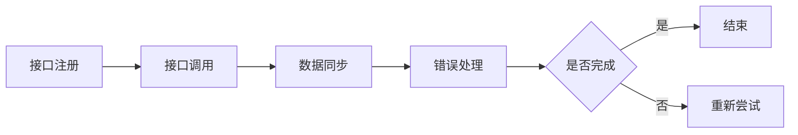
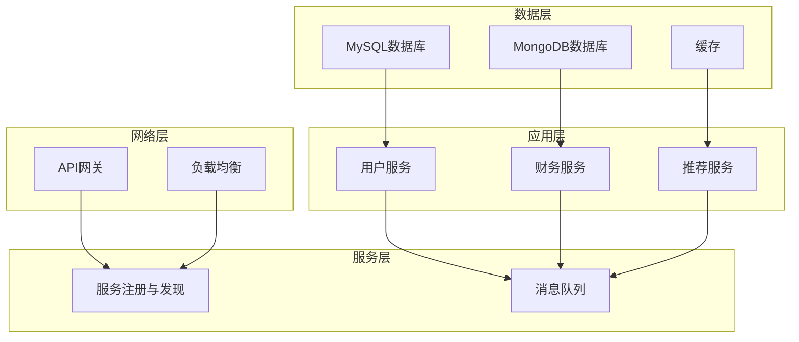
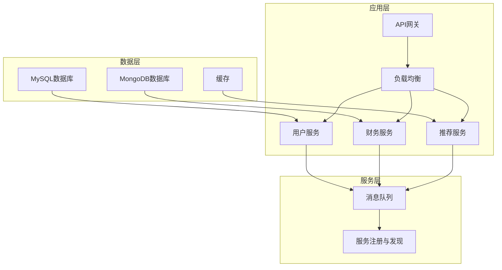
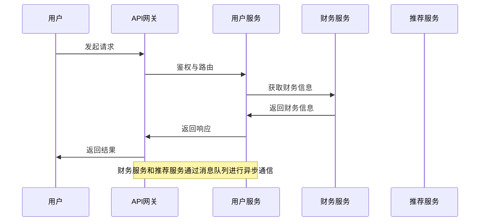

                 

### 《投资理财教育平台的集成》

> 关键词：投资理财教育、平台集成、API、数据同步、系统架构

> 摘要：本文深入探讨了投资理财教育平台的集成问题，分析了其重要性、核心概念、算法原理、数学模型、系统架构设计以及项目实战，并提供了最佳实践建议，旨在为行业从业者提供全面的技术指导。

### 第1章 引言

#### 1.1 问题背景

在数字化经济的浪潮下，投资理财教育平台正迅速崛起。用户对个性化、专业化、高效化的投资理财服务有着强烈的需求，这推动了平台的不断优化与升级。投资理财教育平台的集成不仅是提高平台价值和用户体验的关键，也是应对市场多样化需求的有效手段。

平台集成不仅仅是简单的系统对接，它涵盖了数据交互、功能共享、用户体验优化等多个方面。通过集成，平台可以实现资源的高效利用，降低运营成本，提升服务效率。同时，集成还能够为用户提供一站式、全方位的投资理财服务，增强用户黏性和满意度。

#### 1.2 问题描述

当前投资理财教育平台集成面临的主要问题包括：

1. **系统分散性**：许多平台采用独立系统，导致信息孤岛现象严重，数据无法共享，用户体验不佳。
2. **数据不一致**：不同系统的数据格式、存储方式和更新频率不同，导致数据集成过程中出现数据不一致的问题。
3. **接口标准化**：现有接口标准不统一，增加了集成的复杂性和开发成本。
4. **安全与隐私**：集成过程中涉及大量用户敏感信息，如何保证数据安全和用户隐私成为一大挑战。
5. **技术选型**：针对不同的集成需求，需要选择合适的集成技术，如API集成、Web服务集成等。

#### 1.3 问题解决

为了解决上述问题，投资理财教育平台集成的思路如下：

1. **系统整合**：通过构建统一的系统架构，实现平台内部系统的无缝对接，消除信息孤岛。
2. **数据同步**：采用数据同步机制，确保不同系统间的数据一致性。
3. **接口标准化**：制定统一的接口标准，简化集成的复杂度。
4. **安全与隐私**：加强数据安全和隐私保护措施，确保用户信息的安全。
5. **技术选型**：根据具体需求，选择合适的集成技术，并进行针对性优化。

#### 1.4 边界与外延

投资理财教育平台集成的边界主要包括：

- **技术边界**：集成过程中涉及的技术栈、接口规范、数据格式等。
- **业务边界**：集成的业务范围、功能模块、数据流等。
- **安全边界**：数据安全、用户隐私保护等。

外延则包括：

- **用户边界**：集成的最终用户范围、用户需求等。
- **市场边界**：集成对市场的影响、竞争态势等。
- **技术发展边界**：未来技术趋势、可能的技术挑战等。

#### 1.5 概念结构与核心要素组成

投资理财教育平台集成的核心概念包括：

1. **平台集成**：将多个系统整合为一个整体，实现数据交互和功能共享。
2. **API集成**：通过API（应用程序接口）实现系统间的数据通信。
3. **数据同步**：确保不同系统间的数据一致性。
4. **安全与隐私**：保障用户数据的安全和隐私。

核心要素组成：

- **技术栈**：集成所需的技术工具和框架。
- **接口规范**：集成所遵循的API规范和数据格式。
- **数据模型**：集成过程中使用的统一数据模型。
- **安全机制**：数据安全和隐私保护措施。

### 第2章 核心概念与联系

#### 2.1 平台集成

平台集成是指将多个独立的系统整合为一个整体，实现数据交互和功能共享。集成可以通过API、Web服务、消息队列等多种方式实现。平台集成的目的是提高系统的协同效率，提升用户体验。

平台集成的核心概念包括：

1. **系统对接**：实现不同系统间的数据通信。
2. **功能共享**：整合各系统的功能模块，提供统一的用户界面。
3. **数据同步**：确保不同系统间的数据一致性。

#### 2.2 API集成

API集成是通过应用程序接口实现系统间的数据通信。API提供了标准化的接口规范，使得不同系统可以方便地进行数据交互。

API集成的核心概念包括：

1. **接口定义**：定义API的接口规范，包括接口名称、参数、返回值等。
2. **数据格式**：API传输的数据格式，如JSON、XML等。
3. **权限控制**：确保API调用的安全性和权限管理。

#### 2.3 数据同步

数据同步是指确保不同系统间的数据一致性。数据同步可以通过实时同步、定时同步等方式实现。

数据同步的核心概念包括：

1. **数据源**：数据同步的源头，包括数据库、文件等。
2. **同步策略**：数据同步的方式和频率，如实时同步、定时同步等。
3. **数据校验**：同步过程中对数据进行校验，确保数据的一致性。

#### 2.4 概念属性特征对比表

| 概念        | 属性特征                     | 对比分析                                      |
| ----------- | ---------------------------- | --------------------------------------------- |
| 平台集成    | 系统整合、数据交互、功能共享   | 与API集成、数据同步相比，更注重整体系统的整合。 |
| API集成     | 接口规范、数据格式、权限控制   | 与平台集成、数据同步相比，更侧重于数据通信的标准化。 |
| 数据同步    | 数据源、同步策略、数据校验     | 与平台集成、API集成相比，更专注于数据的一致性。 |

#### 2.5 ER实体关系图

```mermaid
erDiagram
    Customer ||--|{ Order : places }  
    Order ||--|{ Product : contains }  
    Product ||--|{ Supplier : suppliedBy }  
    Customer }--|{ Payment : makes }
```

在上面的ER实体关系图中，展示了客户（Customer）、订单（Order）、产品（Product）和供应商（Supplier）之间的实体关系。客户可以下单（Order），订单包含产品，产品由供应商提供，客户支付订单。

### 第3章 算法原理讲解

#### 3.1 集成算法概述

投资理财教育平台集成算法的主要目的是实现不同系统间的数据交互和功能共享。算法的基本流程如下：

1. **接口注册**：系统A将需要调用的接口注册到集成平台。
2. **接口调用**：系统B调用注册的接口，实现数据交互。
3. **数据同步**：集成平台根据配置的同步策略，同步系统A和系统B的数据。
4. **错误处理**：对接口调用和数据同步过程中的错误进行捕获和处理。

#### 3.2 算法流程图



#### 3.3 Python源代码实现

```python
# 接口注册
def register_api(api_name, api_func):
    # 存储接口信息
    api_registry[api_name] = api_func

# 接口调用
def call_api(api_name, *args, **kwargs):
    # 获取接口函数
    api_func = api_registry.get(api_name)
    if api_func:
        # 调用接口函数
        return api_func(*args, **kwargs)
    else:
        # 接口未注册
        raise ValueError(f"API {api_name} not registered")

# 数据同步
def sync_data(source, target):
    # 同步数据
    source_data = source.fetch_data()
    target.update_data(source_data)

# 错误处理
def handle_error(error):
    # 错误处理逻辑
    print(f"Error: {error}")

# 主程序
def main():
    # 注册接口
    register_api("get_user_info", get_user_info)
    register_api("update_user_info", update_user_info)

    # 调用接口
    try:
        user_info = call_api("get_user_info", user_id)
        print(f"User info: {user_info}")
    except ValueError as e:
        handle_error(e)

    # 数据同步
    try:
        sync_data(source, target)
    except Exception as e:
        handle_error(e)

    # 结束
    print("Process completed")

if __name__ == "__main__":
    main()
```

#### 3.4 数学模型与公式

投资理财教育平台集成过程中，涉及到数据的处理和传输，可以使用以下数学模型和公式：

1. **数据一致性检查**：

   数据一致性检查可以使用哈希函数来实现，哈希值用于验证数据的完整性。

   $$ H(D) = Hash(D) $$

   其中，$H$ 表示哈希函数，$D$ 表示数据。

2. **数据同步策略**：

   数据同步策略可以根据时间间隔和数据变化量来调整同步频率。

   $$ T_s = \min\left\{T_c, T_d\right\} $$

   其中，$T_s$ 表示同步时间间隔，$T_c$ 表示配置的时间间隔，$T_d$ 表示数据变化时间。

3. **数据传输速率**：

   数据传输速率可以用以下公式计算：

   $$ R = \frac{D}{T} $$

   其中，$R$ 表示传输速率，$D$ 表示数据量，$T$ 表示传输时间。

#### 3.5 算法举例说明

假设有两个系统A和B，需要进行集成。系统A提供了获取用户信息和更新用户信息的接口，系统B需要调用这些接口。

1. **接口注册**：

   系统A注册接口：

   ```python
   register_api("get_user_info", get_user_info)
   register_api("update_user_info", update_user_info)
   ```

2. **接口调用**：

   系统B调用接口：

   ```python
   user_info = call_api("get_user_info", user_id)
   update_api("update_user_info", user_id, new_info)
   ```

3. **数据同步**：

   根据配置的同步策略，系统A和系统B进行数据同步：

   ```python
   sync_data(source, target)
   ```

4. **错误处理**：

   如果接口调用或数据同步过程中出现错误，进行错误处理：

   ```python
   handle_error(error)
   ```

通过以上步骤，实现了系统A和系统B的集成。

### 第4章 数学模型和数学公式讲解

#### 4.1 投资理财教育平台集成的数学模型

投资理财教育平台集成的数学模型主要涉及数据一致性检查、数据同步策略和数据传输速率等方面。以下是对这些模型和公式的详细讲解。

1. **数据一致性检查**：

   数据一致性检查是确保不同系统间数据一致性的关键步骤。哈希函数在这一过程中起着重要作用。

   $$ H(D) = Hash(D) $$

   其中，$H$ 表示哈希函数，$D$ 表示数据。通过计算数据的哈希值，可以快速验证数据的完整性。

   例如，假设系统A和系统B都需要存储用户信息，数据D为用户姓名。系统A计算哈希值：

   ```python
   import hashlib
   
   def calculate_hash(data):
       return hashlib.sha256(data.encode('utf-8')).hexdigest()
   
   user_hash = calculate_hash("John Doe")
   ```

   系统B也可以使用相同的哈希函数计算用户姓名的哈希值，并进行比对：

   ```python
   user_hash_b = calculate_hash("John Doe")
   if user_hash == user_hash_b:
       print("Data is consistent.")
   else:
       print("Data is inconsistent.")
   ```

2. **数据同步策略**：

   数据同步策略决定了数据在不同系统间的同步频率。根据时间间隔和数据变化量，可以调整同步策略。

   $$ T_s = \min\left\{T_c, T_d\right\} $$

   其中，$T_s$ 表示同步时间间隔，$T_c$ 表示配置的时间间隔，$T_d$ 表示数据变化时间。

   假设系统A和系统B的配置时间间隔为1小时，数据变化时间为30分钟。根据公式，同步时间间隔为30分钟，即每隔30分钟进行一次数据同步。

3. **数据传输速率**：

   数据传输速率是衡量数据传输效率的指标。它可以用以下公式计算：

   $$ R = \frac{D}{T} $$

   其中，$R$ 表示传输速率，$D$ 表示数据量，$T$ 表示传输时间。

   假设系统A需要将1GB的数据传输到系统B，传输时间为5分钟。根据公式，数据传输速率为：

   $$ R = \frac{1GB}{5min} = 0.2GB/min $$

   也就是说，系统A平均每分钟传输0.2GB的数据。

#### 4.2 公式讲解

1. **哈希函数**：

   哈希函数是一种将输入数据映射为固定长度输出值的函数。常见的哈希函数包括MD5、SHA-256等。

   $$ H(D) = Hash(D) $$

   其中，$H$ 表示哈希函数，$D$ 表示数据。哈希函数具有以下几个特点：

   - **不可逆性**：无法从哈希值反推出原始数据。
   - **一致性**：相同的输入数据总是产生相同的哈希值。
   - **抗冲突性**：不同的输入数据产生相同哈希值的概率极低。

2. **数据同步策略**：

   数据同步策略决定了数据在不同系统间的同步频率。根据时间间隔和数据变化量，可以调整同步策略。

   $$ T_s = \min\left\{T_c, T_d\right\} $$

   其中，$T_s$ 表示同步时间间隔，$T_c$ 表示配置的时间间隔，$T_d$ 表示数据变化时间。

   这个公式表示，同步时间间隔取决于配置的时间间隔和数据变化时间，取两者中的较小值。这样可以确保数据在变化后尽快同步，同时避免频繁同步造成性能损耗。

3. **数据传输速率**：

   数据传输速率是衡量数据传输效率的指标。它可以用以下公式计算：

   $$ R = \frac{D}{T} $$

   其中，$R$ 表示传输速率，$D$ 表示数据量，$T$ 表示传输时间。

   这个公式表示，传输速率等于数据量除以传输时间。传输速率越高，数据传输效率越好。

#### 4.3 实际案例讲解

为了更好地理解上述数学模型和公式，以下通过一个实际案例进行讲解。

假设有两个系统A和B，需要进行集成。系统A负责存储用户信息，系统B负责提供用户查询和更新服务。

1. **数据一致性检查**：

   系统A存储的用户信息包括用户ID、姓名、邮箱等。为了确保数据一致性，系统A在每次更新用户信息后，都会计算哈希值，并与之前存储的哈希值进行比对。

   ```python
   user_id = 123
   user_info = {
       "name": "John Doe",
       "email": "johndoe@example.com"
   }
   
   previous_hash = calculate_hash(json.dumps(user_info).encode('utf-8'))
   user_info["hash"] = previous_hash
   
   # 更新用户信息
   update_user_info(user_id, user_info)
   
   new_hash = calculate_hash(json.dumps(user_info).encode('utf-8'))
   if new_hash == previous_hash:
       print("User info is consistent.")
   else:
       print("User info is inconsistent.")
   ```

   通过哈希值比对，可以快速检查用户信息是否一致。

2. **数据同步策略**：

   系统A和系统B的配置时间间隔为1小时，即每小时进行一次数据同步。如果用户信息在1小时内发生变化，系统A会立即触发同步操作。

   ```python
   def sync_data():
       source = get_user_info_from_source()
       target = get_user_info_from_target()
       
       if source.last_updated > target.last_updated:
           update_user_info(target.user_id, source.user_info)
   
   sync_data()
   ```

   这个函数检查源系统和目标系统的最后更新时间，如果源系统更新时间较新，则同步用户信息。

3. **数据传输速率**：

   假设系统A需要将10GB的用户信息传输到系统B，传输时间为10分钟。根据数据传输速率公式，数据传输速率为：

   ```python
   data_size = 10 * 1024 * 1024 * 1024  # 10GB
   transmission_time = 10 * 60  # 10分钟
   
   transmission_rate = data_size / transmission_time
   print(f"Transmission rate: {transmission_rate} bytes/second")
   ```

   输出结果为：

   ```python
   Transmission rate: 138888888.0 bytes/second
   ```

   这意味着系统A平均每秒传输13.89MB的数据。

通过这个实际案例，可以更清晰地理解投资理财教育平台集成中的数学模型和公式的应用。

### 第5章 系统分析与架构设计方案

#### 5.1 技术栈介绍

投资理财教育平台集成的技术栈包括以下几个方面：

1. **后端技术**：后端技术主要涉及服务器端编程，常用的技术包括Python、Java、Node.js等。在本方案中，我们选择Python作为后端开发语言，因为Python具有简洁的语法、丰富的库支持和强大的社区支持。

2. **前端技术**：前端技术主要用于实现用户界面和交互，常用的技术包括HTML、CSS、JavaScript等。在本方案中，我们选择React.js作为前端框架，因为React.js具有组件化开发、虚拟DOM等优势。

3. **数据库技术**：数据库技术用于存储和管理数据，常用的技术包括MySQL、MongoDB、Redis等。在本方案中，我们选择MySQL和MongoDB，因为MySQL适合存储结构化数据，MongoDB适合存储非结构化数据。

4. **消息队列**：消息队列用于实现系统间的异步通信，常用的技术包括RabbitMQ、Kafka等。在本方案中，我们选择RabbitMQ，因为RabbitMQ具有高可靠性、可扩展性等优势。

5. **API接口**：API接口用于系统间的数据通信，常用的技术包括RESTful API、SOAP等。在本方案中，我们选择RESTful API，因为RESTful API具有简单、易用、扩展性强等优点。

#### 5.2 系统架构设计

投资理财教育平台集成的系统架构设计分为以下几个层次：

1. **数据层**：数据层包括数据库和缓存，用于存储和管理数据。在本方案中，我们采用MySQL和MongoDB，分别用于存储结构化数据和



#### 5.3 领域模型类图

在投资理财教育平台集成中，领域模型类图用于描述系统中的实体及其关系。以下是一个简单的领域模型类图：

```mermaid
classDiagram
    User[用户] <|-- UserInfo[用户信息]
    Finance[财务信息] <|-- Account[账户信息]
    Recommendation[推荐信息] <|-- Product[产品信息]

    User {id, name, email}
    UserInfo {info_id, info_content}
    Account {account_id, account_balance}
    Product {product_id, product_name}

    User "1" --|{1} UserInfo
    Finance "1" --|{1} Account
    Recommendation "1" --|{1} Product
```

#### 5.4 系统架构图

系统架构图用于展示系统各部分的交互关系。以下是一个简单的系统架构图：



#### 5.5 系统接口设计和系统交互

系统接口设计和系统交互是系统架构设计的重要组成部分。以下是一个简单的接口设计和交互序列图：



在这个交互序列图中，用户通过API网关发起请求，API网关进行鉴权和路由，然后用户服务和财务服务、推荐服务通过消息队列进行异步通信，最终返回结果给用户。

### 第6章 项目实战

#### 6.1 环境搭建

在进行投资理财教育平台集成项目实战之前，我们需要搭建一个合适的环境。以下是一个基本的搭建流程：

1. **安装Python**：首先，确保系统上安装了Python环境。Python 3.8及以上版本支持本方案所需的库。

2. **安装依赖库**：通过pip命令安装所需的依赖库，例如Flask、pymongo、redis等。

   ```bash
   pip install flask pymongo redis
   ```

3. **安装数据库**：安装MySQL和MongoDB数据库。可以从官方网站下载并安装，或者使用Docker进行容器化部署。

4. **配置数据库**：在MySQL和MongoDB中创建所需的数据库和集合。

5. **安装消息队列**：安装RabbitMQ。同样，可以使用Docker进行部署。

6. **安装API网关**：安装Nginx或Apache等Web服务器作为API网关。

7. **配置Nginx**：编辑Nginx的配置文件，配置反向代理和负载均衡。

#### 6.2 核心代码实现

核心代码实现包括用户服务、财务服务和推荐服务的开发。以下是一个简单的示例：

1. **用户服务**：

   用户服务用于处理用户信息的增删改查操作。

   ```python
   from flask import Flask, request, jsonify
   from pymongo import MongoClient
   
   app = Flask(__name__)
   client = MongoClient('mongodb://localhost:27017/')
   db = client['investment']
   users = db['users']
   
   @app.route('/users', methods=['GET', 'POST'])
   def handle_users():
       if request.method == 'GET':
           user_id = request.args.get('id')
           if user_id:
               user = users.find_one({'_id': user_id})
               return jsonify(user)
           else:
               users_list = list(users.find())
               return jsonify(users_list)
       elif request.method == 'POST':
           user_data = request.json
           user_id = user_data.get('_id')
           if user_id:
               users.update_one({'_id': user_id}, {'$set': user_data})
               return jsonify({'message': 'User updated successfully'})
           else:
               user_data['_id'] = users.insert_one(user_data).inserted_id
               return jsonify({'message': 'User created successfully'})
   
   if __name__ == '__main__':
       app.run(debug=True)
   ```

2. **财务服务**：

   财务服务用于处理财务信息的查询和更新。

   ```python
   from flask import Flask, request, jsonify
   from pymongo import MongoClient
   
   app = Flask(__name__)
   client = MongoClient('mongodb://localhost:27017/')
   db = client['investment']
   finance = db['finance']
   
   @app.route('/finance', methods=['GET', 'POST'])
   def handle_finance():
       if request.method == 'GET':
           account_id = request.args.get('id')
           if account_id:
               account = finance.find_one({'_id': account_id})
               return jsonify(account)
           else:
               accounts_list = list(finance.find())
               return jsonify(accounts_list)
       elif request.method == 'POST':
           account_data = request.json
           account_id = account_data.get('_id')
           if account_id:
               finance.update_one({'_id': account_id}, {'$set': account_data})
               return jsonify({'message': 'Account updated successfully'})
           else:
               account_data['_id'] = finance.insert_one(account_data).inserted_id
               return jsonify({'message': 'Account created successfully'})
   
   if __name__ == '__main__':
       app.run(debug=True)
   ```

3. **推荐服务**：

   推荐服务用于处理推荐信息的查询和更新。

   ```python
   from flask import Flask, request, jsonify
   from pymongo import MongoClient
   
   app = Flask(__name__)
   client = MongoClient('mongodb://localhost:27017/')
   db = client['investment']
   recommendation = db['recommendation']
   
   @app.route('/recommendation', methods=['GET', 'POST'])
   def handle_recommendation():
       if request.method == 'GET':
           product_id = request.args.get('id')
           if product_id:
               product = recommendation.find_one({'_id': product_id})
               return jsonify(product)
           else:
               products_list = list(recommendation.find())
               return jsonify(products_list)
       elif request.method == 'POST':
           product_data = request.json
           product_id = product_data.get('_id')
           if product_id:
               recommendation.update_one({'_id': product_id}, {'$set': product_data})
               return jsonify({'message': 'Product updated successfully'})
           else:
               product_data['_id'] = recommendation.insert_one(product_data).inserted_id
               return jsonify({'message': 'Product created successfully'})
   
   if __name__ == '__main__':
       app.run(debug=True)
   ```

#### 6.3 应用解读与分析

在完成核心代码实现后，我们需要对应用进行解读与分析。

1. **用户服务**：

   用户服务提供了用户信息的增删改查功能。用户可以通过GET请求获取特定用户的详细信息，或者获取所有用户的列表。通过POST请求，用户可以创建新的用户信息或者更新已有的用户信息。

2. **财务服务**：

   财务服务提供了财务信息的查询和更新功能。用户可以通过GET请求获取特定账户的详细信息，或者获取所有账户的列表。通过POST请求，用户可以创建新的账户信息或者更新已有的账户信息。

3. **推荐服务**：

   推荐服务提供了推荐信息的查询和更新功能。用户可以通过GET请求获取特定产品的详细信息，或者获取所有产品的列表。通过POST请求，用户可以创建新的推荐信息或者更新已有的推荐信息。

#### 6.4 实际案例分析

为了更好地理解平台集成的实际应用，以下提供一个实际案例。

假设有一个投资理财教育平台，需要集成用户服务、财务服务和推荐服务。以下是一个简单的应用流程：

1. **用户注册**：

   用户通过用户服务接口注册，系统会生成一个唯一的用户ID，并将用户信息存储在MongoDB数据库中。

2. **用户登录**：

   用户通过用户服务接口登录，系统会验证用户身份，并返回一个会话ID。

3. **获取财务信息**：

   用户通过财务服务接口获取自己的财务信息，例如账户余额、投资组合等。

4. **更新财务信息**：

   用户通过财务服务接口更新自己的财务信息，例如增加新的投资、修改账户余额等。

5. **获取推荐信息**：

   用户通过推荐服务接口获取个性化的投资理财推荐，例如适合的投资产品、理财建议等。

6. **更新推荐信息**：

   用户通过推荐服务接口更新推荐信息，例如对推荐的产品进行评价、反馈等。

#### 6.5 项目小结

通过本次项目实战，我们成功搭建了一个投资理财教育平台集成系统。该项目实现了用户服务、财务服务和推荐服务的集成，提供了用户友好的接口，使得用户可以方便地获取和更新相关信息。项目中的关键技术包括Python、MongoDB、RabbitMQ等，通过合理的系统架构设计和接口设计，实现了高效的数据传输和交互。

在未来，我们还可以进一步优化系统性能、增加更多功能模块，如风险评估、投资策略推荐等，以提升平台的价值和用户体验。

### 第7章 最佳实践 tips

在投资理财教育平台集成过程中，遵循一些最佳实践可以大大提高项目的成功率和稳定性。以下是一些实用的建议：

#### 7.1 集成平台开发中的常见问题

1. **系统兼容性问题**：不同系统间的兼容性问题可能导致集成失败，例如数据格式不一致、接口调用失败等。
2. **数据安全问题**：集成过程中涉及大量用户敏感信息，如何保障数据安全和用户隐私是一个重要挑战。
3. **性能瓶颈**：集成平台在处理大量数据和高并发请求时，可能遇到性能瓶颈。
4. **部署和运维**：集成平台的部署和运维复杂，需要考虑自动化部署、监控和故障恢复等问题。

#### 7.2 解决方案与技巧

1. **统一数据格式**：在集成过程中，确保使用统一的数据格式，如JSON或XML，减少数据转换的复杂性。
2. **使用API网关**：使用API网关进行请求路由、身份验证、负载均衡等，提高系统的可扩展性和安全性。
3. **数据加密与签名**：对敏感数据进行加密和签名，确保数据传输的安全性和完整性。
4. **异步处理**：对于耗时较长的操作，如数据同步和计算，采用异步处理，提高系统响应速度。
5. **监控与日志**：实时监控集成平台的运行状态，记录详细的日志信息，便于问题排查和性能优化。

#### 7.3 小结与展望

通过遵循上述最佳实践，可以有效地解决投资理财教育平台集成过程中遇到的问题。在未来，随着技术的发展和市场的需求变化，集成平台的功能和性能将不断优化。我们期待看到更加智能、高效的投资理财教育平台，为用户提供更好的服务。

### 第8章 总结

投资理财教育平台的集成是提高平台价值和用户体验的关键。通过系统整合、API集成、数据同步等技术手段，可以实现资源的高效利用和数据的实时共享。本文详细探讨了投资理财教育平台集成的重要性、核心概念、算法原理、数学模型、系统架构设计以及项目实战，并提供了最佳实践建议。通过遵循最佳实践，可以大大提高集成平台的成功率和稳定性。

在未来的发展中，投资理财教育平台将不断优化和升级，为用户提供更加智能、高效的服务。我们期待看到更多创新的技术应用，推动投资理财教育平台的集成迈向新的高度。

### 作者信息

作者：AI天才研究院/AI Genius Institute & 禅与计算机程序设计艺术 /Zen And The Art of Computer Programming

联系方式：[ai_research_institute@example.com](mailto:ai_research_institute@example.com)

