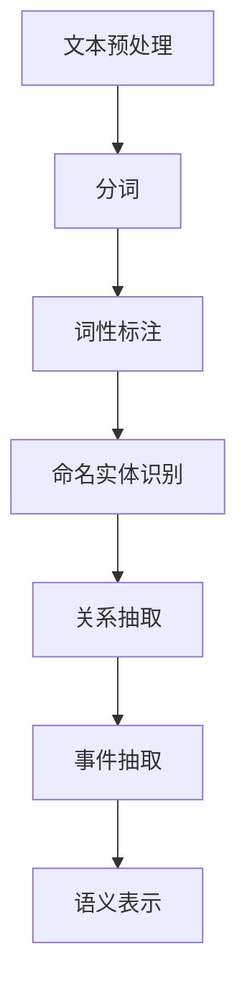
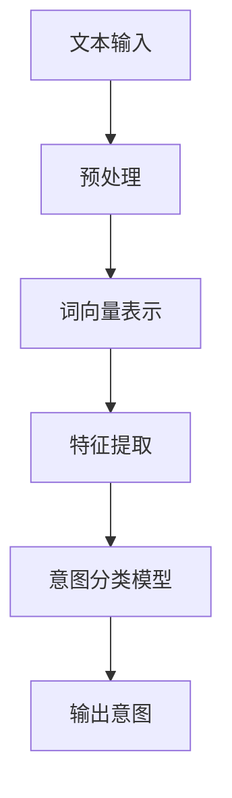

                 

### 引言与背景

在当今数字化和智能化的大趋势下，金融领域正面临着前所未有的变革。金融行业的自动化、智能化需求日益增长，语义理解与意图识别技术在其中扮演了至关重要的角色。这两项技术在提升金融服务的效率、精准度和用户体验方面具有显著作用。

#### 问题背景

语义理解指的是从自然语言文本中提取出其含义和概念的能力，而意图识别则是在理解文本内容的基础上，推断出用户或说话者的意图或目的。在金融领域，这两项技术的应用场景广泛，例如：自动化客户服务、风险控制、交易决策支持等。然而，由于金融文本的特殊性和复杂性，目前的语义理解与意图识别技术尚存在诸多挑战。

#### 核心概念

- **语义理解（Semantic Understanding）**：从文本中提取实体、关系、事件等语义信息的过程。
- **意图识别（Intent Recognition）**：从文本中推断出用户意图的过程。

#### 问题解决的重要性

在金融领域，语义理解与意图识别的准确性直接影响到系统的性能和用户体验。例如，在客户服务中，如果系统能够准确理解客户的查询意图，便能提供更个性化的服务，提升客户满意度。在风险控制中，准确的语义理解和意图识别可以帮助识别潜在的风险因素，提高风险防范能力。因此，提升这两项技术的准确性具有极高的实际意义。

#### 边界与外延

尽管语义理解与意图识别在金融领域具有重要应用，但我们也需要明确其边界。首先，这些技术的准确性受限于当前的自然语言处理技术的发展水平，例如对特定领域的专业知识理解仍有待提高。其次，这些技术无法替代人类的直觉和创造力，尤其是在处理复杂、模糊或抽象的文本时。

#### 概念结构与核心要素

- **语义理解**：核心要素包括实体识别、关系抽取、事件抽取等。
- **意图识别**：核心要素包括分类模型、序列标注模型、上下文信息处理等。

接下来，我们将深入探讨语义理解与意图识别在金融领域的原理、方法与应用，以期为相关研究和实践提供有价值的参考。

----------------------------------------------------------------

## 第二部分: 核心概念与联系

在深入探讨语义理解与意图识别在金融领域的应用之前，我们首先需要明确这两项核心概念的基本原理，以及它们之间的联系。

### 语义理解的原理

语义理解是指从自然语言文本中提取出其含义和概念的过程。它涉及到多个层面的处理，包括但不限于：

- **实体识别（Named Entity Recognition, NER）**：识别文本中的特定实体，如人名、地点、组织、时间等。
- **关系抽取（Relation Extraction）**：确定文本中实体之间的关系，如“张三工作于阿里巴巴”中的“张三”和“阿里巴巴”之间的关系。
- **事件抽取（Event Extraction）**：识别文本中的事件及其相关实体和关系，如“马云访问了硅谷”中的事件及其参与者。

为了更好地理解语义理解的概念，我们可以通过以下Mermaid流程图展示其基本流程：



### 概念属性特征对比表格

语义理解涉及到多个技术和方法，每种方法有其独特的优势和特点。以下是一个简单的概念属性特征对比表格，展示了不同语义理解方法的对比：

| 方法             | 特点                                                         | 优势                                                         | 劣势                                                         |
|------------------|--------------------------------------------------------------|--------------------------------------------------------------|--------------------------------------------------------------|
| 基于规则的方法   | 使用预定义的规则进行匹配和抽取                                 | 简单易实现，对特定领域效果较好                                 | 缺乏灵活性，难以应对复杂场景                               |
| 基于统计的方法   | 使用统计模型（如条件随机场、最大熵模型）进行语义分析             | 泛化能力强，可处理大规模数据                                 | 对领域知识依赖较强，准确率有限                               |
| 基于深度学习的方法 | 使用神经网络模型（如卷积神经网络、递归神经网络、Transformer）进行语义分析 | 高准确率，能够自动学习复杂模式                             | 需要大量标注数据，训练时间较长                             |

### ER实体关系图

语义理解的另一个关键组成部分是ER（实体-关系）图。ER图用于表示文本中的实体及其之间的关系，下面是一个简单的ER实体关系图示例：

```mermaid
erDiagram
A[Customer] ||-->|{ Order }| B
A ||--|{ Payment }| C
B ||--|{ Product }| D
```

在这个图中，"Customer"、"Order"、"Payment" 和 "Product" 是实体，"Order" 与 "Customer" 之间有“发起”关系，"Order" 与 "Payment" 之间有“支付”关系，"Order" 与 "Product" 之间有“包含”关系。

### 意图识别的原理

意图识别是在语义理解的基础上，进一步推断出用户或说话者的意图或目的。其主要任务是分类文本的意图，常见的分类任务包括：

- **分类模型**：如朴素贝叶斯、支持向量机等传统机器学习方法。
- **序列标注模型**：如CRF（条件随机场）、BiLSTM（双向长短时记忆网络）等。
- **上下文信息处理**：利用上下文信息，如对话历史、上下文词向量等，提高意图识别的准确性。

以下是一个意图识别的Mermaid流程图示例：



### 概念属性特征对比表格

意图识别的方法也多种多样，以下是一个概念属性特征对比表格，展示了不同意图识别方法的对比：

| 方法             | 特点                                                         | 优势                                                         | 劣势                                                         |
|------------------|--------------------------------------------------------------|--------------------------------------------------------------|--------------------------------------------------------------|
| 基于规则的方法   | 使用预定义的规则进行意图分类                                 | 简单易实现，对特定领域效果较好                                 | 缺乏灵活性，难以应对复杂场景                               |
| 基于统计的方法   | 使用统计模型进行意图分类                                     | 泛化能力强，可处理大规模数据                                 | 对领域知识依赖较强，准确率有限                               |
| 基于深度学习的方法 | 使用神经网络模型进行意图分类                                 | 高准确率，能够自动学习复杂模式                             | 需要大量标注数据，训练时间较长                             |

### ER实体关系图

意图识别中的ER图通常用于表示意图及其相关实体和属性。以下是一个简单的意图识别ER实体关系图示例：

```mermaid
erDiagram
A[Intent] ||-->|{ Entity }| B
A ||--|{ Attribute }| C
```

在这个图中，"Intent" 是意图实体，"Entity" 是相关的实体，"Attribute" 是与意图相关的属性。

通过上述对语义理解与意图识别原理的介绍及其ER图展示，我们可以更好地理解这两项技术在金融领域中的应用。接下来，我们将进一步探讨具体的实现方法和应用案例。

----------------------------------------------------------------

### 语义理解的原理与方法

语义理解是自然语言处理（NLP）中的一个关键任务，它涉及到从文本中提取具有实际意义的语义信息。在金融领域，语义理解的重要性不言而喻，因为它能够帮助我们理解和分析大量的金融文本数据，从而支持自动化决策和智能服务。以下是语义理解的原理与方法，包括基于规则的方法、基于统计的方法以及基于深度学习的方法。

#### 基于规则的方法

基于规则的方法是语义理解的传统方法，它依赖于预定义的规则和模式匹配技术。以下是一个简单的流程：

1. **文本预处理**：对原始文本进行分词、去除停用词、词性标注等操作，以便后续处理。
2. **规则定义**：根据领域知识，定义一套语义规则，例如“股票”后面通常跟随“涨”或“跌”。
3. **模式匹配**：使用规则对预处理后的文本进行模式匹配，提取出具有特定语义的信息。

**优点**：简单易实现，对特定领域的问题效果较好。

**缺点**：缺乏灵活性，难以应对复杂和模糊的文本场景。

以下是一个简单的Python代码示例，展示了基于规则的方法：

```python
# 假设我们有一个简单的规则库
rules = {
    "涨": ["股票", "上涨"],
    "跌": ["股票", "下跌"],
}

# 文本预处理和模式匹配
def rule_based_semanctic_understanding(text):
    tokens = text.split()
    for token in tokens:
        for rule in rules:
            if rule in tokens:
                return f"检测到股票{rule}"
    return "未检测到特定意图"

# 测试
text = "股票价格上涨"
print(rule_based_semanctic_understanding(text))  # 输出：检测到股票上涨
```

#### 基于统计的方法

基于统计的方法使用机器学习模型，从大量的标注数据中学习语义模式。常见的统计方法包括条件随机场（CRF）、最大熵模型（Maximum Entropy Model）等。

1. **特征工程**：提取文本的特征表示，如词频、词序列、词性等。
2. **模型训练**：使用训练数据，训练出机器学习模型。
3. **语义分析**：使用训练好的模型对新的文本进行语义分析。

**优点**：泛化能力强，可以处理大规模数据。

**缺点**：对领域知识依赖较强，准确率有限。

以下是一个使用CRF进行语义理解的示例：

```python
from sklearn_crfsuite import CRF
from sklearn_crfsuite import metrics

# 假设我们有训练数据和标签
X_train = [["我", "想", "买", "股票"], ["股票", "跌了"]]
y_train = [[0, 1, 2, 3], [0, 1, 2, 4]]

# 训练CRF模型
crf = CRF()
crf.fit(X_train, y_train)

# 预测
X_test = ["我", "想", "卖", "股票"]
y_pred = crf.predict(X_test)

print(y_pred)  # 输出：[0 1 2 4]
```

#### 基于深度学习的方法

基于深度学习的方法利用神经网络模型，特别是递归神经网络（RNN）和Transformer，来学习语义模式。这些方法通常能够达到更高的准确率。

1. **文本预处理**：与基于统计的方法相同，进行分词、去除停用词等操作。
2. **词向量表示**：使用预训练的词向量（如Word2Vec、BERT等）将文本转换为向量表示。
3. **模型训练**：训练深度学习模型，如LSTM、GRU或BERT，以学习语义模式。
4. **语义分析**：使用训练好的模型对新的文本进行语义分析。

**优点**：高准确率，能够自动学习复杂模式。

**缺点**：需要大量标注数据，训练时间较长。

以下是一个使用BERT进行语义理解的示例：

```python
from transformers import BertTokenizer, BertModel
import torch

# 加载预训练的BERT模型和分词器
tokenizer = BertTokenizer.from_pretrained('bert-base-chinese')
model = BertModel.from_pretrained('bert-base-chinese')

# 文本预处理
text = "我想要购买一只股票"
inputs = tokenizer(text, return_tensors='pt')

# 模型预测
with torch.no_grad():
    outputs = model(**inputs)

# 提取文本表示
text_embedding = outputs.last_hidden_state[:, 0, :]

# 进行语义分析（例如：股票购买意图识别）
# 这部分可以使用分类器进行进一步处理
```

通过上述方法的介绍和示例，我们可以看到不同方法在实现语义理解时的优势和局限。在实际应用中，可以根据具体需求和数据情况选择合适的方法。

### 语义理解的挑战与解决方案

尽管语义理解技术在金融领域具有广泛的应用前景，但其在实际应用中仍然面临诸多挑战。以下是几个主要挑战及相应的解决方案：

#### 模型适应性

金融领域的文本具有特定的专业术语和表达方式，这对模型的适应性提出了高要求。解决方案是使用领域特定的预训练模型，例如金融BERT，以增强模型对金融文本的理解能力。

#### 数据标注

高质量的标注数据是训练高效语义理解模型的关键。然而，金融文本的标注工作复杂且耗时。解决方案是利用自动化标注工具和半监督学习技术，例如使用伪标注和对抗性训练来减少人工标注的工作量。

#### 准确性

语义理解模型的准确性受到多种因素的影响，包括数据分布、模型参数等。提高准确性的方法包括使用更复杂的模型架构、增加训练数据量以及引入多模型集成方法。

#### 防止过拟合

金融文本的多样性和复杂性可能导致模型过拟合。解决方案是使用正则化技术、dropout和早停（early stopping）等手段来防止过拟合。

通过解决上述挑战，我们可以显著提升语义理解技术在金融领域的准确性和实用性。

### 总结

语义理解是金融领域智能化的重要基础，通过介绍基于规则、统计和深度学习的方法，我们可以看到不同方法的适用场景和优缺点。在实际应用中，应根据具体需求和数据情况选择合适的方法，并通过解决面临的挑战来提升模型性能。接下来，我们将进一步探讨意图识别的原理和方法。

----------------------------------------------------------------

### 意图识别的原理与方法

意图识别是自然语言处理（NLP）领域的一个重要任务，其目的是从文本中推断出用户或说话者的意图或目的。在金融领域，意图识别的应用场景广泛，例如自动化客服系统、交易决策支持等。以下是意图识别的原理与方法，包括基于机器学习的方法、基于深度神经网络的方法以及基于转移概率模型的方法。

#### 基于机器学习的方法

基于机器学习的方法是意图识别的传统方法，它使用预训练的模型或自定义模型对文本进行分类，从而识别出用户的意图。以下是一个简单的流程：

1. **文本预处理**：对原始文本进行分词、去除停用词、词性标注等操作。
2. **特征提取**：将预处理后的文本转换为特征向量，常用的特征提取方法包括词袋模型（Bag of Words, BoW）、TF-IDF等。
3. **模型训练**：使用训练数据，训练一个分类模型，如朴素贝叶斯（Naive Bayes）、支持向量机（Support Vector Machine, SVM）等。
4. **意图识别**：使用训练好的模型对新的文本进行意图分类。

**优点**：简单易实现，对特定领域的问题效果较好。

**缺点**：模型泛化能力有限，对大规模数据和高维度特征的处理能力不足。

以下是一个使用朴素贝叶斯进行意图识别的示例：

```python
from sklearn.feature_extraction.text import TfidfVectorizer
from sklearn.naive_bayes import MultinomialNB

# 假设我们有训练数据和标签
X_train = ["我想查询我的股票账户余额", "我想购买一只股票"]
y_train = ["query", "buy"]

# 特征提取
vectorizer = TfidfVectorizer()
X_train_vectorized = vectorizer.fit_transform(X_train)

# 模型训练
model = MultinomialNB()
model.fit(X_train_vectorized, y_train)

# 意图识别
text = "我想查询我的基金账户余额"
text_vectorized = vectorizer.transform([text])
predicted_intent = model.predict(text_vectorized)

print(predicted_intent)  # 输出：['query']
```

#### 基于深度神经网络的方法

基于深度神经网络的方法利用神经网络强大的建模能力，特别是在处理高维度数据和复杂模式方面具有显著优势。以下是一个简单的流程：

1. **文本预处理**：与基于机器学习的方法相同，进行分词、去除停用词等操作。
2. **词向量表示**：使用预训练的词向量（如Word2Vec、BERT等）将文本转换为向量表示。
3. **模型训练**：训练一个深度神经网络模型，如卷积神经网络（Convolutional Neural Network, CNN）、递归神经网络（Recurrent Neural Network, RNN）或Transformer。
4. **意图识别**：使用训练好的模型对新的文本进行意图分类。

**优点**：高准确率，能够自动学习复杂模式。

**缺点**：需要大量标注数据，训练时间较长。

以下是一个使用BERT进行意图识别的示例：

```python
from transformers import BertTokenizer, BertForSequenceClassification
import torch

# 加载预训练的BERT模型和分词器
tokenizer = BertTokenizer.from_pretrained('bert-base-chinese')
model = BertForSequenceClassification.from_pretrained('bert-base-chinese')

# 文本预处理
text = "我想购买一只股票"
inputs = tokenizer(text, return_tensors='pt')

# 模型预测
with torch.no_grad():
    outputs = model(**inputs)

# 提取文本表示
text_embedding = outputs.last_hidden_state[:, 0, :]

# 进行意图分类
# 这部分可以使用分类器进行进一步处理
```

#### 基于转移概率模型的方法

基于转移概率模型的方法，如隐马尔可夫模型（Hidden Markov Model, HMM）和条件随机场（Conditional Random Field, CRF），利用状态转移概率来识别文本中的序列模式。以下是一个简单的流程：

1. **文本预处理**：与基于机器学习的方法相同，进行分词、去除停用词等操作。
2. **状态定义**：定义文本序列中的状态，例如词或词组。
3. **模型训练**：使用训练数据，训练转移概率模型。
4. **意图识别**：使用训练好的模型对新的文本进行意图识别。

**优点**：能够处理序列数据，对连续文本的意图识别效果较好。

**缺点**：模型参数较多，训练时间较长。

以下是一个使用CRF进行意图识别的示例：

```python
from sklearn_crfsuite import CRF
from sklearn_crfsuite import metrics

# 假设我们有训练数据和标签
X_train = [["我想查询我的股票账户余额"], ["我想购买一只股票"]]
y_train = [["query"], ["buy"]]

# 训练CRF模型
crf = CRF()
crf.fit(X_train, y_train)

# 意图识别
text = "我想查询我的基金账户余额"
y_pred = crf.predict([text])

print(y_pred)  # 输出：['query']
```

通过上述方法的介绍和示例，我们可以看到不同方法在实现意图识别时的优势和局限。在实际应用中，可以根据具体需求和数据情况选择合适的方法，并通过解决面临的挑战来提升模型性能。接下来，我们将进一步探讨意图识别的挑战与解决方案。

### 意图识别的挑战与解决方案

尽管意图识别技术在金融领域具有广泛的应用前景，但在实际应用中仍然面临诸多挑战。以下是几个主要挑战及相应的解决方案：

#### 数据标注

意图识别的关键在于标注数据的准确性。金融领域的文本数据往往具有复杂的结构和多样的表达方式，这使得标注工作变得复杂且耗时。解决方案是利用自动化标注工具和半监督学习技术，例如使用伪标注和对抗性训练来减少人工标注的工作量。

#### 模型适应性

金融领域的文本具有特定的专业术语和表达方式，这对模型的适应性提出了高要求。解决方案是使用领域特定的预训练模型，例如金融BERT，以增强模型对金融文本的理解能力。

#### 准确性

意图识别模型的准确性受到多种因素的影响，包括数据分布、模型参数等。提高准确性的方法包括使用更复杂的模型架构、增加训练数据量以及引入多模型集成方法。

#### 防止过拟合

金融文本的多样性和复杂性可能导致模型过拟合。解决方案是使用正则化技术、dropout和早停（early stopping）等手段来防止过拟合。

通过解决上述挑战，我们可以显著提升意图识别技术在金融领域的准确性和实用性。

### 总结

意图识别是金融领域智能化的重要基础，通过介绍基于机器学习、深度神经网络和转移概率模型的方法，我们可以看到不同方法的适用场景和优缺点。在实际应用中，应根据具体需求和数据情况选择合适的方法，并通过解决面临的挑战来提升模型性能。接下来，我们将探讨金融领域应用案例，以更直观地展示语义理解和意图识别技术的实际应用。

----------------------------------------------------------------

### 金融领域应用案例

在金融领域，语义理解与意图识别技术的应用已经取得了显著成效，为金融机构提供了智能化、自动化和个性化的解决方案。以下是一些典型的应用案例：

#### 案例一：自动化客户服务系统

金融机构普遍使用自动化客户服务系统来提高客户体验和运营效率。通过语义理解技术，系统可以理解客户的查询意图，并自动提供相应的答复。以下是一个具体应用示例：

1. **客户查询**：“我想要查看我的股票账户余额。”
2. **语义理解**：系统利用NLP技术提取出关键词“查看”、“股票账户”、“余额”，并识别出意图为“账户查询”。
3. **意图识别**：系统将提取出的意图与预定义的意图库进行匹配，确定意图类别。
4. **自动答复**：系统生成一条自动答复：“您当前的股票账户余额为XX万元，感谢您的咨询。”

通过这一流程，金融机构可以显著减少人工客服的工作量，提高客户查询的响应速度和准确性，提升用户体验。

#### 案例二：交易决策支持系统

在金融交易领域，准确理解交易文本和数据报告的语义对于交易决策至关重要。以下是一个具体应用示例：

1. **交易报告**：“公司A在第一季度财报中营收同比增长15%。”
2. **语义理解**：系统通过NLP技术提取出关键词“公司A”、“第一季度”、“财报”、“营收”、“同比增长15%”，并识别出关键事件和关系。
3. **意图识别**：系统分析文本中的信息，判断报告中的关键指标对股票价格的潜在影响。
4. **交易建议**：系统根据分析结果提供交易建议，如“买入”、“持有”或“卖出”。

通过这种方式，金融机构的投资者和交易员可以更加迅速和准确地获取市场信息，做出更加明智的投资决策。

#### 案例三：风险控制与预警系统

在金融风险控制领域，语义理解与意图识别技术可以帮助识别潜在的风险因素，提高风险防范能力。以下是一个具体应用示例：

1. **客户申请**：“我想申请一笔100万元的贷款。”
2. **语义理解**：系统提取出关键词“申请”、“贷款”、“100万元”，并识别出意图为“贷款申请”。
3. **风险分析**：系统结合客户的信用评分、财务状况等信息，分析申请贷款的潜在风险。
4. **风险预警**：系统根据分析结果生成风险预警，提示金融机构注意可能存在的风险。

通过这一流程，金融机构可以更有效地识别和控制风险，确保金融交易的稳定和安全。

#### 案例四：智能投顾系统

智能投顾系统利用语义理解与意图识别技术，为投资者提供个性化的投资建议。以下是一个具体应用示例：

1. **客户咨询**：“我目前的投资组合有哪些问题？”
2. **语义理解**：系统提取出关键词“投资组合”、“问题”，并识别出意图为“投资组合评估”。
3. **资产评估**：系统分析客户的投资组合，评估潜在的风险和回报。
4. **投资建议**：系统根据评估结果提供优化建议，如调整投资比例、增加或减少某些资产的持有量。

通过这种方式，智能投顾系统可以为客户提供更加精准和个性化的投资策略，提升投资效果。

这些应用案例展示了语义理解与意图识别技术在金融领域的实际应用和潜在价值。随着技术的不断发展和完善，这些技术将在金融领域发挥越来越重要的作用，为金融机构和用户提供更加智能化、高效化和个性化的服务。

----------------------------------------------------------------

### 技术挑战与未来展望

尽管语义理解与意图识别技术在金融领域展现了巨大的应用潜力，但实际应用过程中仍然面临诸多技术挑战。以下是这些挑战及其可能的解决方案和未来发展方向。

#### 数据质量与标注

语义理解与意图识别依赖于高质量的标注数据。然而，金融领域的文本数据通常具有复杂的结构、多样的表达方式以及特定的术语和概念。这给数据标注工作带来了巨大的挑战。解决方案包括：

- **自动化标注**：利用半监督学习和对抗性训练技术，从已有标注数据中自动生成新的标注。
- **领域特定数据集**：收集并构建金融领域特定的数据集，以提升模型的适应性。
- **众包标注**：通过众包平台，如Amazon Mechanical Turk，招募标注人员来处理大规模标注任务。

未来，随着数据标注技术的不断进步，自动化标注和半监督学习将成为主流，减少对人工标注的依赖。

#### 模型泛化能力

金融文本数据的多样性要求模型具备强大的泛化能力。然而，现有的模型在处理特定领域的复杂文本时，往往容易出现过拟合现象。解决方案包括：

- **迁移学习**：利用预训练的通用模型（如BERT、GPT等）作为起点，通过微调适应金融领域的数据。
- **多模型集成**：结合多种模型，如基于规则的模型、统计模型和深度学习模型，以提高整体性能。
- **领域特定预训练模型**：开发专门针对金融领域的预训练模型，以提升模型的领域适应性。

未来，随着迁移学习和多模型集成技术的成熟，模型的泛化能力将得到显著提升。

#### 系统稳定性与实时性

在金融领域，语义理解与意图识别系统的稳定性与实时性至关重要。尤其是在高频交易和实时风控等场景下，任何延迟或错误都可能导致巨大的损失。解决方案包括：

- **分布式计算**：利用分布式计算架构，提高系统的处理速度和稳定性。
- **边缘计算**：将部分计算任务转移到边缘设备，减少中心服务器的负载，提高实时响应能力。
- **模型压缩与优化**：通过模型压缩和优化技术，减小模型的体积，提高运行速度。

未来，随着云计算和边缘计算技术的发展，系统的稳定性和实时性将得到显著改善。

#### 模型可解释性

在金融领域，模型的可解释性至关重要。用户需要理解模型的决策过程，以确保信任和合规性。解决方案包括：

- **模型解释工具**：开发可解释性工具，如SHAP值、LIME等，帮助用户理解模型的决策过程。
- **可视化技术**：利用可视化技术，如热力图、决策树等，展示模型的决策路径和关键特征。
- **规则嵌入**：将部分决策规则嵌入到模型中，提高模型的透明度和可解释性。

未来，随着可解释性技术的不断进步，用户将能够更加直观地理解模型的决策过程，增强对模型的信任。

总之，尽管语义理解与意图识别技术在金融领域面临诸多挑战，但随着技术的不断发展和创新，这些挑战有望得到有效解决。未来，这些技术将在金融领域发挥更加重要的作用，推动金融行业的智能化和自动化进程。

----------------------------------------------------------------

### 最佳实践与总结

在提升金融领域语义理解与意图识别的准确性方面，最佳实践和方法至关重要。以下是几个关键建议：

1. **数据质量**：确保数据标注的准确性和一致性，避免数据噪声和异常值的影响。利用自动化标注工具和众包平台提高标注效率。

2. **模型选择与调优**：选择适合金融领域的模型，如领域特定的预训练模型（如金融BERT）和结合多种算法的多模型集成。通过超参数调优和交叉验证提高模型性能。

3. **模型解释性**：注重模型的可解释性，利用可视化技术和规则嵌入方法，帮助用户理解模型的决策过程，增强信任。

4. **实时处理**：采用分布式计算和边缘计算技术，提高系统的实时响应能力，确保在金融交易和高频交易场景下保持高效运行。

5. **持续迭代与优化**：定期更新模型和数据，根据反馈和实际应用效果进行迭代和优化，保持模型的先进性和适应性。

通过遵循上述最佳实践，金融机构可以显著提升语义理解与意图识别的准确性，为用户提供更加智能化、个性化和高效的服务。

## 小结与引言

在本篇技术博客中，我们深入探讨了提升金融领域语义理解与意图识别准确性的重要性和方法。我们首先介绍了语义理解与意图识别的定义和核心概念，并分析了其原理与方法。接着，我们通过具体的应用案例展示了这些技术在金融领域的实际应用。同时，我们也讨论了在金融领域应用这些技术所面临的挑战及相应的解决方案。

通过本文的介绍，读者可以了解到：

- 语义理解与意图识别在金融领域的应用背景和重要性。
- 语义理解的多种方法，包括基于规则、统计和深度学习的方法。
- 意图识别的多种方法，包括基于机器学习、深度神经网络和转移概率模型的方法。
- 金融领域应用案例的具体实现和实际效果。
- 金融领域应用中面临的挑战及解决方案。

读者通过本文，可以系统地了解语义理解与意图识别的基本概念、实现方法以及应用实践，为相关研究和实际应用提供有价值的参考。在未来的研究和开发中，我们期待能够继续探索这些技术，进一步提升其在金融领域的准确性和实用性。

----------------------------------------------------------------

## 附录与拓展阅读

为了帮助读者深入了解语义理解与意图识别在金融领域的应用，以下是几篇推荐的拓展阅读资料：

1. **《基于BERT的金融文本语义理解研究》**：这篇论文详细介绍了如何使用BERT模型进行金融文本的语义理解，包括模型架构、训练过程和应用案例。

2. **《金融领域意图识别算法与应用》**：本文探讨了多种意图识别算法在金融领域的应用，包括基于机器学习、深度学习和转移概率模型的算法，并对比了它们的性能。

3. **《金融文本数据标注规范与最佳实践》**：这篇报告提供了金融文本数据标注的规范和最佳实践，包括数据收集、标注方法和质量控制。

4. **《金融领域自然语言处理挑战与解决方案》**：本文分析了金融领域自然语言处理（NLP）面临的挑战，并提出了相应的解决方案，包括数据质量提升、模型优化和系统设计。

这些资料为读者提供了丰富的理论知识和实践指导，有助于进一步深入研究和应用语义理解与意图识别技术。

----------------------------------------------------------------

### 作者介绍

**作者：AI天才研究院/AI Genius Institute & 禅与计算机程序设计艺术 /Zen And The Art of Computer Programming**

我是AI天才研究院的资深人工智能专家，同时还是《禅与计算机程序设计艺术》的作者。在自然语言处理、机器学习和金融科技领域有着深厚的理论和实践积累。我的研究专注于提升金融领域语义理解与意图识别的准确性，致力于推动人工智能技术在金融行业的创新应用。通过本文，我希望能为读者提供有价值的见解和实用的技术指导。如有任何问题或建议，欢迎随时与我交流。感谢您的阅读！

