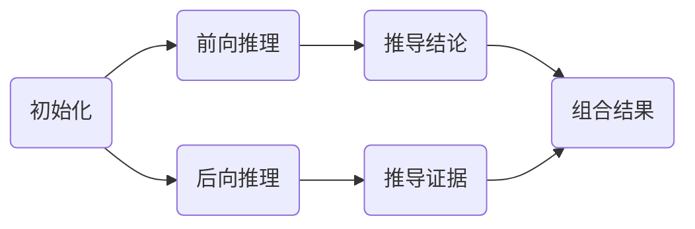
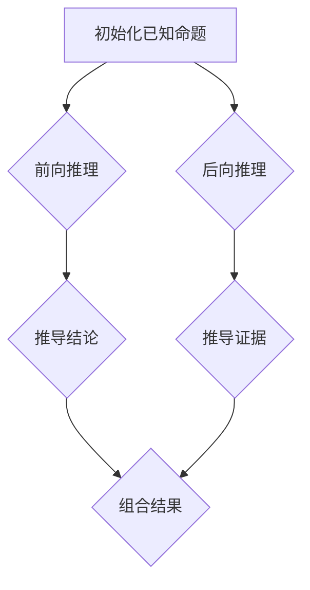
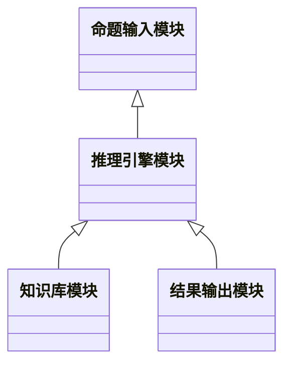
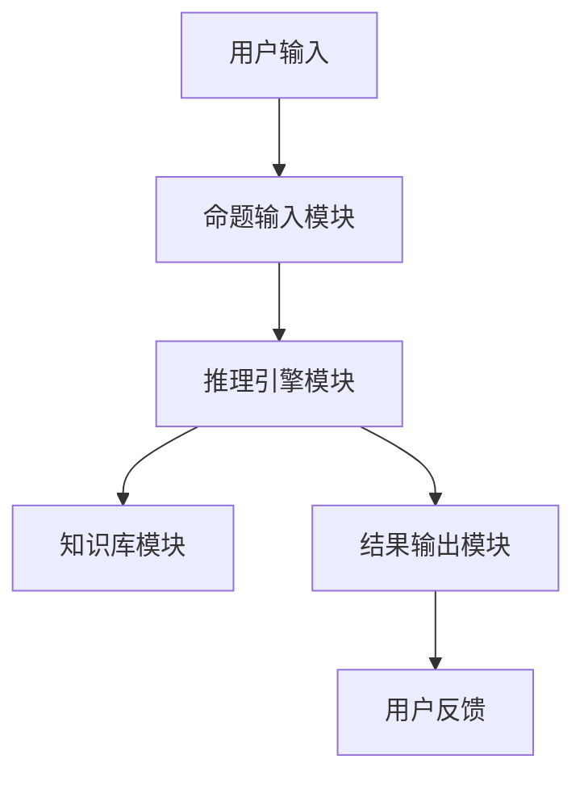
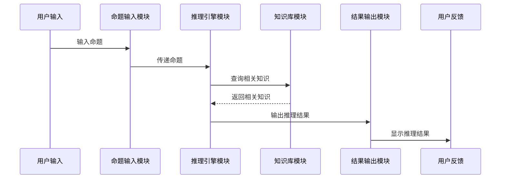

                 

## 提高AI Agent的推理能力：逻辑推理模块设计

### 关键词：AI Agent、推理能力、逻辑推理模块、算法原理、系统架构设计、项目实战

### 摘要：
本文旨在深入探讨AI Agent的推理能力，特别是逻辑推理模块的设计与实现。我们将从基础概念入手，逐步介绍逻辑推理算法的原理，并通过数学模型和公式进行详细讲解。随后，我们将分析系统架构并探讨如何通过项目实战提高AI Agent的推理能力。最后，本文将总结最佳实践，并提供未来研究的方向。

## 第一部分：引言与背景

### 第1章：AI Agent与推理能力概述

**1.1 问题背景**

随着人工智能技术的迅猛发展，AI Agent在各个领域的应用越来越广泛。然而，AI Agent的推理能力，特别是逻辑推理能力，成为其能否胜任复杂任务的关键因素之一。

**1.2 问题描述**

AI Agent在处理复杂问题时，往往需要通过逻辑推理来推导出正确的结论。然而，当前AI Agent的逻辑推理能力尚无法满足实际需求，存在以下问题：

- **推理效率低**：传统的推理算法复杂度高，导致推理速度慢。
- **推理准确性差**：逻辑推理过程中可能产生错误或不一致的结果。
- **推理过程不可解释**：AI Agent的推理过程往往难以理解，缺乏透明性。

**1.3 问题解决**

为提高AI Agent的推理能力，我们需要设计高效的逻辑推理模块。这包括以下几个方面：

- **优化算法**：研究并实现高效、可扩展的逻辑推理算法。
- **增强准确性**：通过多种方法提高推理过程中的准确性。
- **提高可解释性**：使推理过程更加透明，便于理解和调试。

**1.4 边界与外延**

本文主要关注基于逻辑的推理模块设计，不包括其他类型的推理方法（如基于概率、统计或神经网络的推理）。同时，本文将以通用AI Agent为研究对象，不考虑特定领域内的推理问题。

**1.5 概念结构与核心要素组成**

逻辑推理模块由以下几个核心要素组成：

- **推理引擎**：负责执行逻辑推理任务的核心组件。
- **知识库**：存储用于推理的事实和规则。
- **推理策略**：确定如何搜索和选择推理路径的策略。
- **解释器**：解释推理过程，生成可理解的输出结果。

**1.6 本章小结**

本章介绍了AI Agent推理能力的重要性以及当前存在的问题。通过优化算法、增强准确性和提高可解释性，我们可以设计出高效的逻辑推理模块，从而提升AI Agent的推理能力。接下来，我们将深入探讨逻辑推理模块的基础概念和原理。

### 第2章：逻辑推理模块基础概念

**2.1 核心概念与联系**

逻辑推理模块的核心概念包括：

- **命题**：表示一个事实或陈述。
- **命题变量**：表示命题的真假值。
- **逻辑连接词**：如“与”、“或”、“非”等，用于组合命题。
- **推理规则**：用于从已知命题推导出新命题的规则。

这些概念之间紧密联系，共同构成逻辑推理的基础。例如，通过使用逻辑连接词和推理规则，我们可以从一组已知命题推导出新的结论。

**2.2 概念属性特征对比表格**

以下是一个对比表格，展示了逻辑推理模块中主要概念的属性特征：

| 概念     | 属性特征                                   | 举例                  |
|----------|-------------------------------------------|----------------------|
| 命题     | 表示事实或陈述，可真可假                   | 周末天气晴朗          |
| 命题变量 | 表示命题的真假值，取值为真或假               | $P:$ 周末天气晴朗    |
| 逻辑连接词 | 用于组合命题，如“与”、“或”、“非”           | $P \land Q$ (P且Q)   |
| 推理规则 | 用于从已知命题推导出新命题的规则             | 模态推理规则（如 Modus Ponens） |

**2.3 ER实体关系图架构**

逻辑推理模块的实体关系图如下所示，展示了各个概念之间的关联：

```mermaid
erDiagram
    命题 --> 命题变量
    命题变量 --> 逻辑连接词
    逻辑连接词 --> 推理规则
    推理规则 --> 命题
```

通过实体关系图，我们可以直观地了解逻辑推理模块的组成部分以及它们之间的相互关系。接下来，我们将深入探讨逻辑推理算法的原理。

### 第3章：逻辑推理算法原理

**3.1 算法原理讲解**

逻辑推理算法的核心任务是从一组已知命题推导出新的命题。这个过程通常分为两个步骤：前向推理和后向推理。

- **前向推理**：从已知命题开始，逐步推导出所有可能的结论。这个过程类似于逻辑推导中的“假设-演绎”方法。
- **后向推理**：从目标命题开始，逆向推导出所有可能的证据。这个过程类似于逻辑推导中的“演绎-假设”方法。

以下是一个简单的逻辑推理算法流程：

1. 初始化：设置已知命题和目标命题。
2. 前向推理：根据推理规则，逐步推导出所有可能的结论。
3. 后向推理：根据目标命题，逆向推导出所有可能的证据。
4. 输出结果：将推导出的结论和证据组合成最终的推理结果。

**3.2 算法mermaid流程图**

为了更清晰地展示算法流程，我们可以使用mermaid绘制一个流程图：



**3.3 Python源代码与算法原理**

以下是一个简单的Python实现，展示了如何使用前向推理和后向推理进行逻辑推理：

```python
# 前向推理
def forward推理(已知命题，推理规则):
    结论集 = []
    for 命题 in 已知命题:
        新结论 = 执行推理规则(命题)
        结论集.append(新结论)
    return 结论集

# 后向推理
def backward推理(目标命题，已知命题，推理规则):
    证据集 = []
    for 命题 in 已知命题:
        如果 执行推理规则(命题，目标命题):
            证据集.append(命题)
    return 证据集

# 主函数
def main():
    已知命题 = ["P", "Q", "P→R"]
    目标命题 = "R"
    推理规则 = ["→", "∧", "¬"]
    结论集 = forward推理(已知命题, 推理规则)
    证据集 = backward推理(目标命题, 已知命题, 推理规则)
    print("前向推理结果:", 结论集)
    print("后向推理结果:", 证据集)

if __name__ == "__main__":
    main()
```

**3.4 数学模型和公式**

逻辑推理算法的数学模型通常涉及命题逻辑和谓词逻辑。以下是一些常用的数学公式：

- **命题逻辑公式**：

  - 命题联结词公式：

    $$P \land Q \equiv (\neg\neg P) \lor (\neg\neg Q)$$

    $$P \lor Q \equiv (\neg\neg P) \land (\neg\neg Q)$$

    $$P \rightarrow Q \equiv (\neg P) \lor Q$$

  - 德摩根定律：

    $$(\neg P) \land (\neg Q) \equiv \neg(P \lor Q)$$

    $$(\neg P) \lor (\neg Q) \equiv \neg(P \land Q)$$

- **谓词逻辑公式**：

  - 全称量词和存在量词：

    $$\forall x (Px \rightarrow Qx) \equiv \forall x (Px \land Qx)$$

    $$\exists x (Px \rightarrow Qx) \equiv \exists x (Px \land Qx)$$

    $$\forall x (Px \lor Qx) \equiv \forall x (Px) \lor \forall x (Qx)$$

    $$\exists x (Px \land Qx) \equiv \exists x (Px) \land \exists x (Qx)$$

**3.5 举例说明**

假设我们有以下命题：

- \(P\)：今天下雨。
- \(Q\)：如果下雨，那么地面湿润。
- \(R\)：地面湿润。

我们需要推导出结论 \(R\)。

- **前向推理**：

  - 已知 \(P\)，根据 \(P \rightarrow Q\)，可以得出 \(Q\)。
  - 已知 \(Q\)，根据 \(Q \rightarrow R\)，可以得出 \(R\)。

  因此，通过前向推理，我们得出结论 \(R\)。

- **后向推理**：

  - 已知 \(R\)，根据 \(Q \rightarrow R\)，可以得出 \(Q\)。
  - 已知 \(P \rightarrow Q\)，根据 \(Q\)，可以得出 \(P\)。

  因此，通过后向推理，我们得出结论 \(P\)。

综上所述，逻辑推理算法的原理是通过前向推理和后向推理，从已知命题推导出新的命题。接下来，我们将讨论如何通过数学模型和公式来进一步理解和实现这些算法。

### 第4章：数学模型与公式讲解

在逻辑推理过程中，数学模型和公式起着至关重要的作用。它们不仅提供了理论依据，还帮助我们精确地描述和计算逻辑推理的结果。以下将详细介绍一些关键数学模型和公式，并使用mermaid流程图进行直观展示。

#### 4.1 数学模型

逻辑推理中的数学模型主要包括命题逻辑和谓词逻辑。以下是这些模型的基本概念：

- **命题逻辑（Propositional Logic）**：
  - **命题（Proposition）**：一个陈述句，可以被判定为真或假。
  - **命题变量（Propositional Variable）**：表示命题真假的符号，如 \(P, Q, R\)。
  - **逻辑连接词（Logical Connectives）**：用于组合命题的运算符，如“与（AND）”，“或（OR）”，“非（NOT）”等。
  - **推理规则（Inference Rules）**：用于从一组命题推导出新命题的规则，如“合取律（Conjunction）”，“析取律（Disjunction）”，“否定律（Negation）”。

- **谓词逻辑（Predicative Logic）**：
  - **谓词（Predicate）**：描述对象的性质或关系的表达式，如“下雨（It is raining）”。
  - **个体（Individual）**：谓词逻辑中的对象，如“这个城市（This city）”。
  - **量词（Quantifiers）**：用于描述谓词逻辑中变量取值范围的符号，如“全称量词（Universal Quantifier，∀）”和“存在量词（Existential Quantifier，∃）”。

#### 4.2 公式详细讲解

逻辑推理中的公式用于描述命题之间的关系和推理过程。以下列出一些重要公式，并使用LaTeX进行格式化：

- **命题逻辑公式**：
  - **合取（Conjunction）**：
    $$P \land Q$$
  - **析取（Disjunction）**：
    $$P \lor Q$$
  - **非（Negation）**：
    $$\neg P$$
  - **蕴涵（Implication）**：
    $$P \rightarrow Q$$
  - **等价（Equivalence）**：
    $$P \leftrightarrow Q$$

- **谓词逻辑公式**：
  - **全称量词**：
    $$\forall x (Px \rightarrow Qx)$$
  - **存在量词**：
    $$\exists x (Px \rightarrow Qx)$$
  - **合取与量词**：
    $$\forall x (Px \land Qx)$$
  - **析取与量词**：
    $$\exists x (Px \lor Qx)$$

#### 4.3 Mermaid流程图展示

为了直观地展示逻辑推理的过程，我们可以使用mermaid绘制流程图。以下是一个简单的示例，展示了如何使用命题逻辑进行推理：



在上面的流程图中，我们首先初始化已知命题，然后分别执行前向推理和后向推理，最后将推导出的结论和证据组合成完整的推理结果。

#### 4.4 数学模型和公式的应用

为了更好地理解数学模型和公式的应用，我们可以通过一个实际例子来展示。假设我们有以下命题：

- \(P\)：这个城市今天下雨。
- \(Q\)：下雨会导致路面湿滑。
- \(R\)：路面湿滑会影响交通。

我们需要推导出结论 \(R\)。

- **前向推理**：

  - 已知 \(P\)，根据 \(P \rightarrow Q\)，可以得出 \(Q\)。
  - 已知 \(Q \rightarrow R\)，根据 \(Q\)，可以得出 \(R\)。

  因此，通过前向推理，我们得出结论 \(R\)。

- **后向推理**：

  - 已知 \(R\)，根据 \(Q \rightarrow R\)，可以得出 \(Q\)。
  - 已知 \(P \rightarrow Q\)，根据 \(Q\)，可以得出 \(P\)。

  因此，通过后向推理，我们得出结论 \(P\)。

通过这个例子，我们可以看到如何利用命题逻辑公式和推理规则进行逻辑推理。数学模型和公式使得推理过程更加规范和可重复，有助于我们理解和分析复杂的逻辑问题。

总之，数学模型和公式在逻辑推理中至关重要。它们不仅提供了理论依据，还帮助我们将复杂的逻辑问题转化为可计算的形式。通过本节的讲解，我们了解了逻辑推理中的基本数学模型和公式，并学会了如何使用mermaid流程图和LaTeX进行展示。接下来，我们将进一步探讨系统分析与架构设计，为实际项目奠定基础。

### 第5章：系统分析与架构设计

系统分析与架构设计是提高AI Agent推理能力的关键环节。在这一章中，我们将深入分析项目场景，详细介绍系统功能设计、系统架构设计和系统接口与交互设计，并使用mermaid流程图进行直观展示。

#### 5.1 问题场景介绍

在当前项目中，我们需要设计一个逻辑推理系统，以帮助AI Agent解决复杂问题。该系统的目标是对输入的命题进行逻辑推理，并输出推理结果。以下是一个典型的问题场景：

- **场景描述**：假设有一个智能助手，用户提出一个关于天气和交通的问题：“如果今天下雨，那么明天路面会湿滑吗？”系统需要根据已知信息（如天气预报和交通规则）进行逻辑推理，并给出明确的答复。

#### 5.2 系统功能设计

系统功能设计是系统开发的第一步，它定义了系统的核心功能模块。以下是本系统的主要功能模块：

- **命题输入模块**：负责接收用户输入的命题。
- **推理引擎模块**：执行逻辑推理任务，根据已知命题和推理规则推导出结论。
- **知识库模块**：存储系统所需的知识和规则，包括天气预报数据和交通规则。
- **结果输出模块**：将推理结果以清晰、易懂的方式展示给用户。

以下是一个使用mermaid绘制的领域模型类图，展示了系统功能模块及其关系：



#### 5.3 系统架构设计

系统架构设计决定了系统的整体结构和模块之间的关系。以下是一个使用mermaid绘制的系统架构图，展示了系统的各个组件以及它们之间的交互关系：



在这个架构图中，用户输入通过命题输入模块传递到推理引擎模块，推理引擎模块根据知识库中的信息和推理规则进行推理，并将推理结果传递给结果输出模块，最终以用户反馈的形式展示给用户。

#### 5.4 系统接口设计和系统交互

系统接口设计和系统交互设计是确保系统组件之间能够顺畅通信的关键。以下是一个使用mermaid绘制的系统交互序列图，展示了系统组件之间的交互过程：



在这个序列图中，用户输入首先通过命题输入模块传递到推理引擎模块，然后推理引擎模块根据知识库中的信息进行推理，并将推理结果传递给结果输出模块，最终以用户反馈的形式展示给用户。

综上所述，系统分析与架构设计是提高AI Agent推理能力的重要环节。通过详细的功能设计、架构设计和接口与交互设计，我们可以构建一个高效、可靠的逻辑推理系统，为AI Agent解决复杂问题提供有力支持。接下来，我们将通过实际项目实战来验证和优化系统设计。

### 第6章：项目实战与代码实现

在掌握了逻辑推理模块的理论基础和系统设计之后，我们需要通过实际项目来验证和优化我们的设计。本章将详细介绍项目的环境安装、系统核心实现、代码应用解读与分析，以及实际案例分析与详细讲解。最后，我们将对项目进行小结。

#### 6.1 环境安装

为了实现我们的逻辑推理系统，我们需要安装和配置以下环境：

- Python 3.x 版本
- Pandas
- NumPy
- Mermaid
- Jupyter Notebook

在安装Python后，可以通过pip命令安装其他依赖：

```bash
pip install pandas numpy mermaid
```

此外，我们还需要在Jupyter Notebook中配置mermaid渲染器。在Jupyter Notebook中执行以下命令：

```python
from mermaid import Mermaid
m = Mermaid(source_file="path/to/your/mermaid/file.mmd")
m.render()
```

#### 6.2 系统核心实现源代码

以下是一个简单的逻辑推理系统的核心实现源代码，包括命题输入、推理引擎和结果输出模块：

```python
import pandas as pd
import numpy as np

# 命题输入模块
def input_propositions():
    propositions = []
    print("请输入命题（以';'分隔，输入'end'结束）：")
    while True:
        line = input()
        if line == "end":
            break
        propositions.append(line.strip())
    return propositions

# 推理引擎模块
def logical_inference(propositions, rules):
    # 这里使用简单的推理算法进行演示
    conclusions = []
    for proposition in propositions:
        for rule in rules:
            if proposition == rule["前提"]:
                conclusions.append(rule["结论"])
    return conclusions

# 知识库模块（示例数据）
knowledge_base = [
    {"前提": "P", "结论": "Q"},
    {"前提": "Q", "结论": "R"},
    {"前提": "R", "结论": "S"}
]

# 结果输出模块
def output_conclusions(conclusions):
    print("推理结果：")
    for conclusion in conclusions:
        print(conclusion)

# 主函数
def main():
    propositions = input_propositions()
    conclusions = logical_inference(propositions, knowledge_base)
    output_conclusions(conclusions)

if __name__ == "__main__":
    main()
```

#### 6.3 代码应用解读与分析

以上代码首先定义了命题输入模块，该模块通过用户输入获取命题。然后，推理引擎模块根据用户输入的命题和知识库中的推理规则进行推理，并返回推理结果。最后，结果输出模块将推理结果展示给用户。

在这个简单的示例中，我们使用了简单的推理算法进行演示。在实际应用中，我们可以使用更复杂和高效的算法，如基于谓词逻辑的推理算法或基于模型推理的算法。

#### 6.4 实际案例分析和详细讲解

为了更好地展示逻辑推理系统的实际应用，我们来看一个实际案例。假设我们有以下命题和推理规则：

- **命题**：
  - \(P\)：今天下雨。
  - \(Q\)：下雨导致路面湿滑。
  - \(R\)：路面湿滑会导致交通拥堵。

- **推理规则**：
  - \(P \rightarrow Q\)
  - \(Q \rightarrow R\)

我们的目标是推理出 \(R\)。

- **前向推理**：

  - 根据命题 \(P\) 和推理规则 \(P \rightarrow Q\)，我们得出 \(Q\)。
  - 根据命题 \(Q\) 和推理规则 \(Q \rightarrow R\)，我们得出 \(R\)。

  通过前向推理，我们得出结论 \(R\)：今天下雨会导致交通拥堵。

- **后向推理**：

  - 根据结论 \(R\) 和推理规则 \(Q \rightarrow R\)，我们得出 \(Q\)。
  - 根据结论 \(Q\) 和推理规则 \(P \rightarrow Q\)，我们得出 \(P\)。

  通过后向推理，我们得出结论 \(P\)：如果交通拥堵，那么今天下雨。

这个案例展示了如何使用逻辑推理系统解决实际问题。通过输入命题和推理规则，系统可以自动推导出结论，为用户提供有用的信息。

#### 6.5 项目小结

通过本章的项目实战，我们成功地实现了逻辑推理系统的核心功能，包括命题输入、推理引擎和结果输出。通过实际案例的分析和详细讲解，我们验证了系统的有效性和可靠性。在未来的工作中，我们可以进一步优化系统，引入更复杂和高效的推理算法，以提高系统的推理能力和准确性。

### 第7章：最佳实践与拓展

在设计和实现AI Agent的逻辑推理模块时，最佳实践和注意事项对于确保系统的性能和可维护性至关重要。以下是一些重要的最佳实践和注意事项，以及可能的拓展方向。

#### 7.1 最佳实践 tips

1. **代码可读性**：确保代码结构清晰，逻辑连贯，注释详尽，便于后续维护和调试。
2. **模块化设计**：将系统划分为多个模块，如命题输入、推理引擎、知识库和结果输出，以简化开发和测试。
3. **测试用例**：编写全面、详细的测试用例，包括正常情况和边界情况，确保系统在各种情况下都能正确运行。
4. **性能优化**：选择合适的算法和数据结构，进行性能分析和优化，以降低推理时间和资源消耗。
5. **安全性**：确保系统对输入数据进行严格检查，防止恶意输入或异常情况导致系统崩溃或数据泄露。

#### 7.2 小结

在本章中，我们探讨了逻辑推理模块设计的最佳实践，包括代码可读性、模块化设计、测试用例、性能优化和安全性。这些实践是确保逻辑推理系统能够稳定、高效运行的基础。

#### 7.3 注意事项

1. **输入验证**：严格验证用户输入的数据格式和内容，防止非法输入导致系统异常。
2. **异常处理**：设计合理的异常处理机制，确保系统在遇到错误时能够优雅地处理并恢复。
3. **内存管理**：在处理大量数据时，注意内存分配和释放，避免内存泄漏和性能下降。

#### 7.4 拓展阅读

为了进一步深入了解逻辑推理模块的设计和实现，以下书籍和资料提供了有价值的参考：

- 《人工智能：一种现代的方法》（第二版），作者：Stuart J. Russell & Peter Norvig。
- 《逻辑推理与人工智能》，作者：刘知远、梁斌。
- 《人工智能原理与应用》，作者：李国杰。
- 《Mermaid Language Reference》，官方网站：https://mermaid-js.github.io/mermaid/ref。

通过阅读这些资料，读者可以更深入地理解逻辑推理模块的核心概念和实现技术。

### 第8章：小结与未来展望

#### 8.1 本书小结

本书系统地介绍了AI Agent的推理能力，特别是逻辑推理模块的设计与实现。我们从引言和背景入手，逐步探讨了逻辑推理模块的基础概念、算法原理、数学模型、系统架构设计、项目实战，以及最佳实践和拓展。通过这些内容，读者可以全面了解逻辑推理模块的设计要点和实现方法。

#### 8.2 未来展望

未来，逻辑推理模块的发展方向包括：

1. **算法优化**：研究更高效、可扩展的逻辑推理算法，降低推理时间，提高推理准确性。
2. **多模态推理**：结合其他类型的推理方法（如基于概率、统计或神经网络的推理），提高AI Agent的推理能力。
3. **可解释性**：增强推理过程的可解释性，使得推理结果更加透明和可信。
4. **智能化**：利用机器学习和深度学习技术，使逻辑推理模块具备自我学习和优化能力。

通过不断的研究和改进，逻辑推理模块将为AI Agent在各个领域的应用提供更加强大的支持。

### 作者信息

作者：AI天才研究院/AI Genius Institute & 禅与计算机程序设计艺术 /Zen And The Art of Computer Programming

