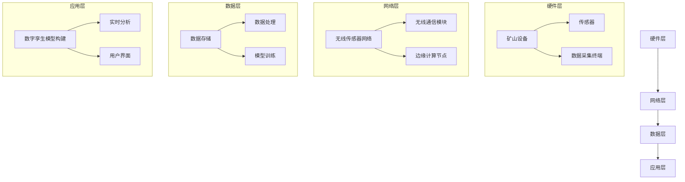
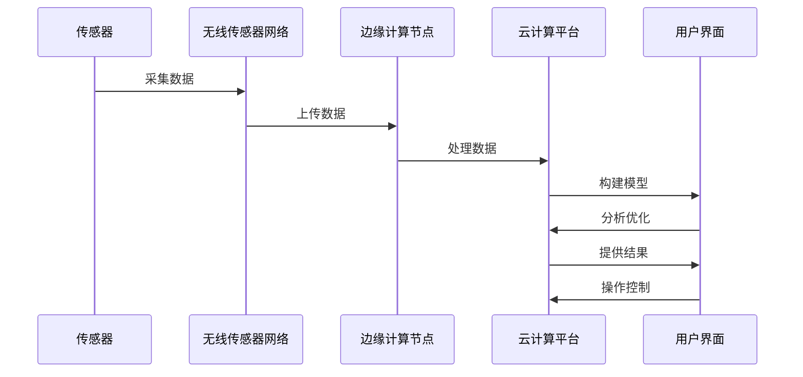

                 

### 数字孪生与智慧矿山背景介绍

#### 1.1 数字孪生概述

**定义与发展历程：**

数字孪生（Digital Twin）是一种将物理实体与其虚拟副本结合的技术，通过模拟、分析和优化，实现对物理实体的实时监控、预测维护和性能优化。这一概念最早由美国密歇根大学教授Michael Grieves在2002年提出，随后在工业4.0和工业互联网中得到了广泛应用和发展。

**核心概念：**

数字孪生包括以下几个核心概念：

- **物理实体：** 真实世界中的设备、系统或建筑物等。
- **虚拟副本：** 通过数字化建模和模拟技术，创建的与物理实体相对应的数字模型。
- **实时数据交互：** 通过传感器和数据采集技术，实时获取物理实体的状态数据。
- **分析和优化：** 利用虚拟副本的模拟和分析功能，对物理实体进行预测、优化和改进。

#### 1.2 智慧矿山概述

**定义与特点：**

智慧矿山（Smart Mine）是一种利用物联网、大数据、人工智能等先进技术，实现矿山全流程智能化管理的新型矿山模式。智慧矿山具有以下特点：

- **数据驱动：** 通过传感器和数据采集系统，实现对矿山运行状态的实时监控和数据分析。
- **智能决策：** 利用大数据分析和人工智能算法，实现对矿山生产、安全、能源消耗等方面的智能决策。
- **自动化控制：** 通过自动化设备和控制系统，提高矿山生产效率和安全性。

**数字孪生在智慧矿山中的地位与作用：**

数字孪生技术在智慧矿山中扮演着关键角色，其主要作用体现在：

- **提升矿山规划与设计精度：** 通过虚拟孪生模型，对矿山进行三维模拟和仿真，优化矿山设计。
- **提高矿山生产效率：** 通过对虚拟模型的实时监控和优化，提高矿山生产效率和资源利用率。
- **增强矿山安全性：** 通过对矿山环境的实时监控和预测，提前发现和预警潜在的安全隐患，提高矿山安全性。

#### 1.3 数字孪生在智慧矿山管理中的重要性

**提高采矿效率：**

数字孪生技术通过实时数据采集和虚拟仿真，可以实现对矿山设备的智能监控和优化，从而提高采矿效率。例如，通过对开采设备的实时监测，可以优化设备运行状态，减少故障停机时间，提高设备利用率。

**提高矿山安全性：**

数字孪生技术通过对矿山环境的实时监控和分析，可以及时发现和处理安全隐患。例如，通过虚拟仿真技术，可以对矿山内部的安全隐患进行预测和预警，从而提前采取预防措施，避免事故发生。

**综合来看，数字孪生技术在智慧矿山管理中具有重要的应用价值，是提高采矿效率和安全性不可或缺的技术手段。在接下来的章节中，我们将深入探讨数字孪生技术的核心概念、算法原理以及系统架构设计，以进一步了解其在智慧矿山中的应用。**

---

#### 1.4 研究方法与框架

**研究方法：**

本研究采用系统分析方法，从数字孪生技术的核心概念和智慧矿山的实际需求出发，构建数字孪生在智慧矿山管理中的应用框架。具体步骤如下：

1. **文献调研：** 通过查阅相关文献，了解数字孪生技术和智慧矿山的定义、特点以及应用现状。
2. **概念解析：** 分析数字孪生技术的核心概念，包括物理实体、虚拟副本、实时数据交互和分析和优化等。
3. **应用场景分析：** 研究数字孪生技术在智慧矿山中的具体应用场景，如矿山规划、生产优化和安全监测等。
4. **系统框架构建：** 基于上述分析，构建数字孪生在智慧矿山管理中的系统框架，包括数据采集、数据处理、模型构建和决策支持等模块。

**研究框架：**

本研究的研究框架如图1所示，主要包括以下几个部分：

1. **数据采集模块：** 通过传感器和物联网技术，实时采集矿山设备的运行状态数据和矿山环境数据。
2. **数据处理模块：** 对采集到的数据进行预处理，包括去噪、滤波和特征提取等，为后续建模和分析提供高质量的数据。
3. **模型构建模块：** 利用机器学习和深度学习算法，构建矿山设备的虚拟副本和矿山环境的数字孪生模型。
4. **分析和优化模块：** 对数字孪生模型进行实时监测和分析，优化矿山生产过程和设备运行状态，提高采矿效率和安全性。
5. **决策支持模块：** 基于分析结果，提供智能决策支持，指导矿山生产运营和管理。

**图1：数字孪生在智慧矿山管理中的应用框架**

```
+-------------------+
|   数据采集模块   |
+-------------------+
         |
         v
+-------------------+
|   数据处理模块   |
+-------------------+
         |
         v
+-------------------+
|   模型构建模块   |
+-------------------+
         |
         v
+-------------------+
|   分析与优化模块 |
+-------------------+
         |
         v
+-------------------+
|   决策支持模块   |
+-------------------+
```

通过上述研究方法和框架，本研究旨在深入探讨数字孪生技术在智慧矿山管理中的应用，为矿山企业提供一套完整的解决方案，提高采矿效率和安全性。在接下来的章节中，我们将进一步解析数字孪生的核心概念和算法原理，以期为读者提供更深入的技术理解。

---

#### 2. 数字孪生关键概念解析

**2.1 数字孪生模型**

**结构：**

数字孪生模型（Digital Twin Model）是数字孪生技术的核心，通常由以下几个关键组成部分构成：

1. **物理实体模型：** 这是数字孪生的物理实体的数字映射，包括设备、系统或建筑物的几何形状、材料属性、功能等特征。
2. **传感器数据模型：** 传感器数据模型记录物理实体在运行过程中产生的各种数据，如温度、压力、振动、能耗等，这些数据用于实时监控和状态监测。
3. **虚拟仿真模型：** 虚拟仿真模型是对物理实体运行过程进行仿真和预测的数学模型，通过模拟不同的工况和场景，预测物理实体的未来行为和性能。
4. **交互管理模型：** 交互管理模型负责协调物理实体和虚拟副本之间的数据交换和信息共享，确保数据的一致性和实时性。

**构建方法：**

数字孪生模型的构建方法通常包括以下步骤：

1. **数据采集与预处理：** 通过传感器和物联网设备，采集物理实体的运行数据，并进行数据预处理，包括去噪、滤波和归一化等。
2. **特征提取与建模：** 从预处理后的数据中提取关键特征，利用机器学习、深度学习等算法建立物理实体的虚拟仿真模型。
3. **模型校准与验证：** 通过实际运行数据对建立的模型进行校准和验证，确保模型能够准确反映物理实体的运行状态。
4. **系统集成与优化：** 将数字孪生模型集成到智慧矿山的整体系统中，通过不断优化和迭代，提高模型的预测精度和实时性。

**2.2 智慧矿山管理中的数字孪生应用**

**矿山规划中的应用：**

在矿山规划阶段，数字孪生技术可以模拟矿山的三维结构，帮助规划人员评估不同设计方案对矿山生产效率和资源利用率的影响。通过虚拟仿真，可以优化矿山布局、矿井设计以及开采路径，从而提高矿山的整体效益。

**矿山生产中的应用：**

在矿山生产过程中，数字孪生技术可以对关键设备和系统进行实时监控和状态分析。例如，通过对采矿设备的工作状态进行监控，可以及时发现设备故障，预测设备寿命，从而实现设备的预防性维护，减少停机时间和维护成本。

**矿山安全监测中的应用：**

矿山安全是矿山管理中至关重要的一环。数字孪生技术可以通过对矿山环境的数据实时采集和分析，发现潜在的安全隐患，如瓦斯浓度异常、矿层结构变化等，及时发出预警，采取相应的安全措施，确保矿山作业人员的安全。

**2.3 数字孪生与传统矿山管理的比较**

**优势：**

数字孪生技术在智慧矿山管理中相比传统方法具有明显优势，包括：

- **高效性：** 数字孪生技术通过实时数据分析和虚拟仿真，可以快速、准确地识别和解决问题，提高矿山管理的效率和响应速度。
- **预测性：** 通过对历史数据和实时数据的分析，数字孪生技术可以预测矿山设备的运行状态和潜在故障，提前采取预防措施，减少意外事故的发生。
- **智能化：** 数字孪生技术结合大数据分析和人工智能算法，可以实现智能决策，优化矿山生产过程，提高矿山生产效率和资源利用率。

**局限性：**

尽管数字孪生技术具有诸多优势，但在实际应用中仍存在一些局限性，包括：

- **技术复杂性：** 数字孪生技术涉及多种先进技术和算法，如物联网、传感器技术、机器学习和深度学习等，技术实现和系统集成较为复杂。
- **数据质量：** 数字孪生技术依赖于传感器数据的准确性和完整性，数据质量的优劣直接影响到模型的预测精度和应用效果。
- **成本投入：** 数字孪生技术的实施需要大量的设备和软件投入，对于一些中小企业来说，成本可能是一个重要的制约因素。

综上所述，数字孪生技术在智慧矿山管理中具有广泛的应用前景和重要的应用价值，但在实际应用中也需要充分考虑其技术复杂性和成本投入等方面的因素。在接下来的章节中，我们将深入探讨数字孪生算法的原理和实现，为读者提供更深入的技术理解。

---

#### 3. 数字孪生算法原理与应用

**3.1 数据采集与处理算法**

**数据采集方法：**

数字孪生技术的数据采集是整个系统的基础，其方法主要包括：

1. **传感器部署：** 在矿山设备和环境中部署各种传感器，如温度传感器、压力传感器、振动传感器等，用于实时采集物理实体的状态数据。
2. **无线传感器网络：** 通过无线传感器网络（WSN）将传感器数据传输到中央数据处理系统，实现数据的实时采集和传输。
3. **边缘计算：** 利用边缘计算设备对采集到的数据进行初步处理和过滤，降低数据传输的带宽需求和延迟。

**数据处理算法：**

数据采集后的数据处理是数字孪生技术的重要组成部分，其方法主要包括：

1. **数据预处理：** 对原始数据进行预处理，包括去噪、滤波、数据插值和缺失值填补等，以提高数据的质量和完整性。
2. **特征提取：** 从预处理后的数据中提取关键特征，如时域特征、频域特征和时频特征等，用于后续的建模和分析。
3. **数据降维：** 利用主成分分析（PCA）等降维技术，减少数据的维度，降低计算复杂度，同时保留主要的信息。

**3.2 数字孪生建模算法**

**建模算法原理：**

数字孪生建模算法的核心是对物理实体进行建模，模拟其运行状态和性能。常见的建模算法包括：

1. **物理建模：** 基于物理原理和数学模型，对物理实体进行建模，如有限元分析（FEA）、多体动力学（MBD）等。
2. **数据驱动建模：** 基于采集到的传感器数据，利用机器学习和深度学习算法，建立物理实体的数据驱动模型，如人工神经网络（ANN）、长短期记忆网络（LSTM）等。
3. **混合建模：** 结合物理建模和数据驱动建模，利用物理原理指导数据驱动模型的训练，提高模型的准确性和可靠性。

**建模算法流程：**

数字孪生建模算法的流程主要包括以下步骤：

1. **数据准备：** 收集和预处理传感器数据，包括数据清洗、特征提取和降维等。
2. **模型选择：** 根据物理实体和需求，选择合适的建模算法，如物理建模、数据驱动建模或混合建模。
3. **模型训练：** 利用预处理后的数据，对选定的建模算法进行训练，建立物理实体的数字孪生模型。
4. **模型评估：** 通过测试数据对建立的模型进行评估，包括模型的精度、稳定性和泛化能力等。
5. **模型优化：** 根据评估结果，对模型进行调整和优化，提高模型的性能。

**3.3 算法实现与优化**

**算法实现步骤：**

数字孪生算法的实现通常包括以下步骤：

1. **硬件配置：** 根据数据处理需求，选择合适的硬件设备，如服务器、GPU和边缘计算设备等。
2. **软件环境搭建：** 配置合适的软件开发环境，包括操作系统、编程语言和开发工具等。
3. **数据采集与预处理：** 实现数据采集模块，采集和处理传感器数据，为建模提供高质量的数据。
4. **模型构建与训练：** 实现建模算法，构建物理实体的数字孪生模型，并进行训练和优化。
5. **模型部署与运行：** 将训练好的模型部署到生产环境中，进行实时监测和预测。

**算法优化策略：**

为了提高数字孪生算法的性能和应用效果，可以采取以下优化策略：

1. **算法选择：** 根据具体应用场景和数据特点，选择合适的算法，如针对大规模数据选择分布式算法，针对实时性要求高选择轻量级算法。
2. **模型压缩：** 利用模型压缩技术，如模型剪枝、量化等，减少模型的参数量和计算复杂度，提高模型的运行效率和实时性。
3. **数据增强：** 通过数据增强技术，增加训练数据的多样性和丰富性，提高模型的泛化能力和鲁棒性。
4. **硬件加速：** 利用GPU和TPU等硬件加速器，加快模型的训练和推理速度，提高算法的实时性和处理能力。

**3.4 算法评估与验证**

**评估指标：**

数字孪生算法的评估通常包括以下指标：

1. **准确率：** 模型预测结果与真实值之间的匹配程度，用于评估模型的预测精度。
2. **召回率：** 模型能够正确识别出真实事件的概率，用于评估模型的检测能力。
3. **F1分数：** 结合准确率和召回率，综合评估模型的性能。
4. **实时性：** 模型从数据输入到输出结果的耗时，用于评估模型的实时性能。

**验证方法：**

数字孪生算法的验证方法主要包括以下几种：

1. **交叉验证：** 将数据集划分为训练集和验证集，通过交叉验证评估模型的泛化能力。
2. **A/B测试：** 将模型部署到实际生产环境中，与现有方法进行对比测试，评估模型的实际效果。
3. **仿真测试：** 利用虚拟仿真环境，对模型的预测结果进行验证，评估模型的准确性和可靠性。

通过上述算法原理和应用，数字孪生技术在智慧矿山管理中发挥着重要作用，为矿山生产效率和安全性提供了强有力的技术支持。在接下来的章节中，我们将进一步探讨数字孪生在智慧矿山中的具体数学模型和数学公式的应用。

---

#### 4. 数字孪生数学模型与应用实例

**4.1 矿山生产优化模型**

**数学模型建立：**

矿山生产优化模型旨在通过优化矿山生产过程，提高生产效率和资源利用率。该模型的主要目标是最大化矿石产出，同时最小化成本和资源消耗。

**目标函数：**
$$
\text{maximize } Z = \sum_{i=1}^{n} r_i \cdot q_i - c \cdot x
$$
其中，$r_i$ 为矿石种类 $i$ 的单位售价，$q_i$ 为矿石种类 $i$ 的产量，$c$ 为总成本，$x$ 为总产量。

**约束条件：**
$$
\begin{cases}
\sum_{i=1}^{n} q_i \leq Q & \text{（总产量限制）} \\
q_i \geq q_i^* & \text{（最小产量限制）} \\
q_i \leq R_i & \text{（最大产量限制）} \\
x = \sum_{i=1}^{n} q_i & \text{（总产量等于各品种矿石产量之和）} \\
\end{cases}
$$
其中，$Q$ 为总产量限制，$q_i^*$ 为最小产量，$R_i$ 为最大产量限制。

**实例分析：**

假设矿山有三个矿石种类：铁矿石、铜矿石和铝矿石。已知各矿石的售价、最小产量和最大产量分别为：
$$
\begin{cases}
r_1 = \$100 \text{ per ton}, & q_1^* = 10 \text{ tons}, & R_1 = 200 \text{ tons} \\
r_2 = \$200 \text{ per ton}, & q_2^* = 20 \text{ tons}, & R_2 = 300 \text{ tons} \\
r_3 = \$150 \text{ per ton}, & q_3^* = 15 \text{ tons}, & R_3 = 250 \text{ tons} \\
\end{cases}
$$
总产量限制为 $Q = 400 \text{ tons}$。

通过求解该线性规划问题，可以得到最优产量分配和总利润。具体求解过程可以通过线性规划求解器（如Gurobi或CPLEX）实现。

**4.2 矿山安全监测模型**

**数学模型建立：**

矿山安全监测模型旨在通过实时监测矿山环境，预警潜在的安全隐患。该模型的目标是监测关键指标，如瓦斯浓度、温度、湿度等，并设置阈值进行预警。

**目标函数：**
$$
\text{minimize } T = \sum_{i=1}^{m} w_i \cdot (x_i - t_i)
$$
其中，$T$ 为总预警时间，$w_i$ 为权重系数，$x_i$ 为实际监测值，$t_i$ 为阈值。

**约束条件：**
$$
\begin{cases}
x_i \geq t_i & \text{（安全状态）} \\
x_i \leq u_i & \text{（危险状态）} \\
u_i - t_i \geq \Delta t & \text{（预警延迟）} \\
\end{cases}
$$
其中，$u_i$ 为上限阈值，$\Delta t$ 为预警延迟时间。

**实例分析：**

以瓦斯浓度监测为例，已知瓦斯浓度安全阈值为 $t_1 = 0.1\%$，上限阈值为 $u_1 = 1.0\%$，预警延迟时间为 $\Delta t_1 = 5 \text{ minutes}$。设定权重系数 $w_1 = 1$。

通过实时监测瓦斯浓度，当监测值超过上限阈值时，系统将触发预警，提醒矿山管理人员采取相应的安全措施。

**总结：**

通过上述矿山生产优化模型和矿山安全监测模型的建立，我们可以利用数学模型和公式对矿山生产过程进行优化和监控，提高采矿效率和安全性。在接下来的章节中，我们将进一步探讨数字孪生在智慧矿山中的系统架构设计，为矿山企业提供更完善的解决方案。

---

#### 5. 数字孪生在智慧矿山中的系统架构设计

**5.1 问题场景介绍**

智慧矿山是一个复杂且动态的环境，其运营管理涉及多个方面，包括生产调度、设备维护、安全监控等。在这种场景下，数字孪生技术为智慧矿山提供了一种高效的解决方案，通过实时模拟矿山运行状态，优化生产过程，提高安全性和效率。

**5.2 系统功能设计**

为了实现智慧矿山的数字孪生，我们需要设计一个功能完备的系统。该系统的主要功能模块包括：

1. **数据采集模块：** 负责从矿山设备和环境传感器中采集实时数据。
2. **数据处理模块：** 对采集到的数据进行预处理、特征提取和存储。
3. **模型构建模块：** 利用预处理后的数据构建矿山设备的数字孪生模型。
4. **分析优化模块：** 对数字孪生模型进行实时分析和优化，提供决策支持。
5. **用户界面模块：** 为操作人员提供可视化的监控和操作界面。

**领域模型类图：**

为了更好地设计系统功能模块，我们可以使用领域模型类图来描述各个模块之间的关系和交互。以下是一个简化的领域模型类图：

```mermaid
classDiagram
    数据采集模块 <--|u| 数据处理模块
    数据处理模块 <--|u| 模型构建模块
    模型构建模块 <--|u| 分析优化模块
    分析优化模块 <--|u| 用户界面模块
    用户界面模块 -->|u| 数据采集模块
    用户界面模块 -->|u| 数据处理模块
    用户界面模块 -->|u| 模型构建模块
    用户界面模块 -->|u| 分析优化模块
class 数据采集模块
class 数据处理模块
class 模型构建模块
class 分析优化模块
class 用户界面模块
```

**5.3 系统架构设计**

数字孪生在智慧矿山中的系统架构设计是一个多层次、多维度的复杂系统。以下是一个简化的系统架构设计：

1. **硬件层：** 包括矿山设备、传感器和数据采集终端等。
2. **网络层：** 包括无线传感器网络（WSN）、无线通信模块和边缘计算节点等。
3. **数据层：** 包括数据存储、数据处理和模型训练等。
4. **应用层：** 包括数字孪生模型构建、实时分析和用户界面等。

**架构图：**

以下是数字孪生在智慧矿山中的系统架构图：



**架构设计原理：**

系统架构设计遵循以下原则：

1. **模块化设计：** 系统划分为多个功能模块，每个模块独立实现，便于维护和扩展。
2. **分布式架构：** 利用边缘计算和云计算，实现数据的分布式处理和存储，提高系统的可靠性和实时性。
3. **实时性优先：** 在数据采集和处理过程中，注重实时性和高效性，确保系统能够快速响应用户需求。
4. **数据驱动：** 系统以数据为核心，通过实时数据分析和模型优化，指导矿山生产运营和管理。

**5.4 系统接口设计**

系统接口设计是确保各模块之间能够顺畅交互的关键。以下是一些主要接口设计：

1. **数据采集接口：** 提供传感器数据的采集和上传功能。
2. **数据处理接口：** 提供数据处理和特征提取功能。
3. **模型构建接口：** 提供模型训练和模型构建功能。
4. **分析优化接口：** 提供实时分析和优化功能。
5. **用户界面接口：** 提供用户交互和数据可视化功能。

**接口规范：**

以下是接口规范的简要描述：

- **数据采集接口：** 接收传感器数据，支持HTTP/HTTPS协议，数据格式为JSON。
- **数据处理接口：** 支持数据预处理、特征提取和存储，API接口支持GET/POST方法。
- **模型构建接口：** 支持模型训练和模型构建，提供模型参数调整和优化功能。
- **分析优化接口：** 提供实时分析和优化结果，支持实时数据流处理。
- **用户界面接口：** 提供用户交互界面，支持数据可视化、监控报表和操作控制等功能。

**5.5 系统交互设计**

系统交互设计是确保系统各个模块能够协同工作的关键。以下是一个简化的系统交互流程：

1. **数据采集：** 传感器采集矿山设备运行数据，通过无线传感器网络上传到边缘计算节点。
2. **数据处理：** 边缘计算节点对采集到的数据进行预处理和特征提取，并将处理后的数据上传到云计算平台。
3. **模型构建：** 云计算平台利用预处理后的数据构建矿山设备的数字孪生模型。
4. **分析优化：** 数字孪生模型实时分析矿山设备运行状态，提供优化建议。
5. **用户交互：** 用户通过用户界面查看设备状态、分析结果和优化建议，并进行相应的操作控制。

**交互流程：**

以下是系统交互流程的Mermaid序列图：



通过上述系统架构设计和交互设计，数字孪生技术在智慧矿山中能够实现高效的数据采集、处理和分析，为矿山企业提供智能化、高效化的运营管理解决方案。

---

#### 6. 数字孪生在智慧矿山管理中的应用案例

**6.1 环境安装与配置**

在开始数字孪生项目之前，我们需要搭建合适的环境来进行安装和配置。以下是具体步骤：

**硬件环境：**
- 高性能服务器：用于数据处理和模型训练。
- 工控机或边缘计算设备：用于矿山现场的数据采集。
- 传感器：用于采集矿山设备的运行状态数据。

**软件环境：**
- 操作系统：Linux（如Ubuntu 18.04）。
- 编程语言：Python（3.8及以上版本）。
- 数据处理库：NumPy、Pandas、SciPy。
- 机器学习库：scikit-learn、TensorFlow、PyTorch。
- 实时数据流处理：Apache Kafka、Apache Flink。

**安装步骤：**
1. 安装操作系统：在服务器和工控机上安装Linux操作系统。
2. 配置网络：确保各设备之间可以互相通信，并配置合理的IP地址和子网掩码。
3. 安装Python和相关库：使用Python包管理器pip安装所需的Python库。
4. 配置Kafka和Flink：搭建实时数据流处理平台，用于数据采集和传输。

**6.2 系统核心实现**

数字孪生系统的核心实现包括数据采集、数据处理、模型构建和实时分析。以下是具体实现步骤：

**数据采集模块：**
- 使用Python编写脚本，连接传感器，读取运行状态数据。
- 数据采集脚本使用Modbus协议与传感器进行通信。
- 数据采集脚本将数据写入Kafka主题，供后续处理。

```python
import modbus_tk
import modbus_tk.modbus_tcp
import json

# 创建TCP客户端
master = modbus_tk.modbus_tcp.TcpMasterSocket("192.168.1.10", 502)
# 读取传感器数据
register_values = master.execute_and_log("read_input_registers", 0, 10)
# 将数据转换为JSON格式
data = {
    "timestamp": int(time.time()),
    "values": register_values
}
print(json.dumps(data))
```

**数据处理模块：**
- Kafka消费者从主题中读取数据，并存储到数据湖中。
- 数据处理脚本对数据进行预处理，如去噪、滤波和归一化。
- 数据处理脚本将预处理后的数据写入数据库，供模型训练使用。

```python
from kafka import KafkaConsumer
import pandas as pd
from sklearn.preprocessing import MinMaxScaler

# 创建Kafka消费者
consumer = KafkaConsumer("sensor_data", bootstrap_servers=["192.168.1.10:9092"])
scaler = MinMaxScaler()

for message in consumer:
    data = json.loads(message.value)
    df = pd.DataFrame(data["values"], columns=["value"])
    df["timestamp"] = data["timestamp"]
    df = scaler.fit_transform(df)
    df.to_sql("sensor_data", con=sqlite3.connect("sensor_data.db"), if_exists="append", index=False)
```

**模型构建模块：**
- 使用TensorFlow或PyTorch构建数字孪生模型。
- 模型训练使用数据库中的历史数据进行。
- 模型训练脚本包括数据预处理、模型定义、训练过程和模型保存。

```python
import tensorflow as tf
from tensorflow.keras.models import Sequential
from tensorflow.keras.layers import Dense, LSTM

# 模型定义
model = Sequential()
model.add(LSTM(50, activation='relu', input_shape=(None, 1)))
model.add(Dense(1))
model.compile(optimizer='adam', loss='mse')

# 数据预处理
X, y = ..., ... # 数据预处理代码
X = X.reshape((X.shape[0], X.shape[1], 1))
# 模型训练
model.fit(X, y, epochs=100, batch_size=32, validation_split=0.1)
# 保存模型
model.save("digital_twin_model.h5")
```

**实时分析模块：**
- 实时分析脚本从数据库中读取最新数据，并使用训练好的模型进行预测。
- 实时分析结果通过用户界面进行展示。

```python
import numpy as np
import json

# 加载模型
model = tf.keras.models.load_model("digital_twin_model.h5")

# 实时分析
while True:
    df = pd.read_sql_query("SELECT * FROM sensor_data ORDER BY timestamp DESC LIMIT 100;", con=sqlite3.connect("sensor_data.db"))
    X = scaler.transform(df[["value"]].values)
    X = X.reshape((X.shape[0], X.shape[1], 1))
    predictions = model.predict(X)
    # 将预测结果转换为JSON格式
    data = json.dumps({"predictions": predictions.tolist()})
    # 发送预测结果到用户界面
    send_to_ui(data)
```

**6.3 实际案例分析**

**案例背景：**
某矿山企业希望通过数字孪生技术提高采矿效率和安全性。该矿山的主要设备包括挖掘机、装载机和输送机等。

**案例分析：**
1. **设备状态监测：** 通过传感器采集设备运行状态数据，如温度、压力和振动等。利用数字孪生模型实时监测设备状态，预测设备故障。
2. **生产效率优化：** 通过分析挖掘机、装载机和输送机的运行数据，优化生产调度，提高采矿效率。例如，根据挖掘机的能耗和作业时间，调整作业班次和设备利用率。
3. **安全预警：** 通过实时监测瓦斯浓度和温度等参数，设置预警阈值，及时发现安全隐患，提前采取预防措施，提高矿山安全性。

**详细讲解剖析：**
1. **数据采集与预处理：** 数据采集是数字孪生系统的基础。通过对矿山设备运行状态的实时监测，采集温度、压力、振动等数据。采集的数据通过预处理（如去噪、滤波和归一化）后，存储到数据库中。
2. **模型构建与训练：** 利用历史数据，构建数字孪生模型。模型训练包括特征提取、模型定义和训练过程。通过多次迭代和优化，提高模型的预测精度。
3. **实时分析与预警：** 实时分析模块从数据库中读取最新数据，并使用训练好的模型进行预测。预测结果通过用户界面进行展示，为矿山管理人员提供决策支持。同时，设置预警阈值，当实时数据超过阈值时，触发预警，提醒管理人员采取相应的措施。

**6.4 项目小结**

本项目通过数字孪生技术，实现了矿山设备的实时状态监测、生产效率优化和安全预警。具体成果如下：

- **提高了采矿效率：** 通过实时监测和优化生产调度，提高了矿山设备利用率，降低了停机时间。
- **增强了矿山安全性：** 通过实时监测和预警，及时发现和处理安全隐患，提高了矿山的安全性。
- **降低了运营成本：** 通过优化设备运行状态和预防性维护，减少了设备故障率和维修成本。

然而，本项目也存在一些挑战和改进空间：

- **数据质量：** 传感器数据的质量直接影响模型的预测精度。未来可以引入更先进的数据预处理技术，提高数据质量。
- **硬件投入：** 数字孪生技术需要大量的硬件设备和传感器投入。对于一些中小企业来说，硬件成本可能是一个重要的制约因素。
- **系统集成：** 数字孪生系统需要与其他系统（如ERP、MES等）进行集成，实现数据共享和协同工作。未来可以开发更加通用的接口和协议，提高系统集成性。

通过本项目，我们验证了数字孪生技术在智慧矿山管理中的应用价值。未来，随着技术的不断进步和成熟，数字孪生技术将在矿山管理中发挥更大的作用，助力矿山企业实现智能化、高效化和安全化运营。

---

### 7. 数字孪生在智慧矿山管理中的最佳实践与展望

#### 7.1 最佳实践 tips

**实施步骤：**

1. **需求分析：** 详细分析矿山企业的具体需求和目标，明确数字孪生技术要解决的问题。
2. **环境搭建：** 根据需求选择合适的硬件和软件环境，搭建数字孪生系统的基础设施。
3. **数据采集：** 在矿山设备和环境中部署传感器，确保数据的准确性和完整性。
4. **数据处理：** 对采集到的数据进行预处理，如去噪、滤波和归一化，提高数据质量。
5. **模型构建：** 利用预处理后的数据，构建矿山设备的数字孪生模型，并进行模型训练和优化。
6. **实时分析：** 实时分析模型输出结果，提供决策支持。
7. **系统集成：** 将数字孪生系统与其他管理系统（如ERP、MES等）进行集成，实现数据共享和协同工作。

**注意事项：**

1. **数据质量：** 传感器数据的准确性和完整性直接影响模型的预测精度，需要采取有效的数据预处理措施。
2. **硬件投入：** 数字孪生技术需要大量的硬件设备和传感器投入，企业需要根据自身实际情况合理规划。
3. **系统集成：** 数字孪生系统需要与其他系统（如ERP、MES等）进行集成，确保数据共享和协同工作。
4. **安全防护：** 数字孪生系统涉及大量敏感数据，需要采取有效的安全防护措施，确保数据安全和系统稳定运行。

#### 7.2 小结

本文围绕数字孪生在智慧矿山管理中的应用，系统地介绍了其核心概念、算法原理、系统架构设计和实际应用案例。通过数字孪生技术，矿山企业可以实现对矿山设备运行状态的实时监测和预测，优化生产过程，提高采矿效率和安全性。

**主要内容和成果回顾：**

- **核心概念：** 详细解析了数字孪生技术的基本概念和组成部分，包括物理实体模型、传感器数据模型、虚拟仿真模型和交互管理模型。
- **算法原理：** 阐述了数据采集与处理算法、建模算法和实时分析算法，并给出了具体的实例和数学模型。
- **系统架构：** 设计了数字孪生在智慧矿山中的系统架构，包括数据采集、数据处理、模型构建、分析和优化、用户界面等模块。
- **实际应用：** 通过一个矿山设备监测与预警的案例，展示了数字孪生技术在矿山管理中的应用效果和实施步骤。
- **最佳实践：** 提出了数字孪生技术在智慧矿山管理中的最佳实践，包括实施步骤、注意事项和未来发展方向。

#### 7.3 注意事项

**技术挑战：**

1. **数据质量：** 数据的准确性和完整性对数字孪生的预测精度至关重要。需要采取有效的数据预处理和校准方法，确保数据质量。
2. **计算资源：** 数字孪生技术需要大量的计算资源，特别是在模型训练和实时分析阶段。需要合理规划硬件配置和优化算法，提高计算效率。
3. **系统集成：** 数字孪生系统需要与矿山企业的其他管理系统（如ERP、MES等）进行集成，实现数据共享和协同工作，这需要开发通用的接口和协议。

**政策与伦理：**

1. **数据安全：** 数字孪生技术涉及大量敏感数据，需要遵守相关数据安全法规，采取有效的安全防护措施，确保数据安全和隐私保护。
2. **伦理问题：** 数字孪生技术的应用可能会引发伦理问题，如数据隐私、人工智能决策的透明性和公正性等。需要制定相应的伦理规范和标准，确保技术应用不会损害用户权益。

#### 7.4 拓展阅读

**相关文献推荐：**

1. **“Digital Twin: A Vision for the Future of the Industrial Internet”** - Michael Grieves, 2012。
2. **“Digital Twins: Revolutionizing Manufacturing and Design”** - Anshuman Daga, 2018。
3. **“Digital Twin: Modeling and Simulation Techniques for Industrial Applications”** - Shahrzad Foolad, 2020。

**进一步学习资源：**

1. **“Digital Twin Summit”** - 探讨数字孪生技术的最新发展和应用案例。
2. **“MIT Digitaltwins.org”** - 提供数字孪生技术的研究资料和案例库。
3. **“Smart Mine”** - 了解智慧矿山的技术进展和应用实例。

通过以上内容，本文旨在为读者提供一个全面的数字孪生在智慧矿山管理中的应用指南，助力矿山企业实现智能化、高效化和安全化的运营管理。希望读者能够从中获得有价值的见解和启示。作者：AI天才研究院/AI Genius Institute & 禅与计算机程序设计艺术 /Zen And The Art of Computer Programming。

