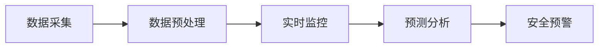
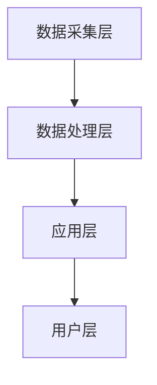

                 

### 设计数字孪生在核电站管理中的应用：提高安全性和效率

> 关键词：数字孪生，核电站管理，安全性，效率，应用案例

> 摘要：本文将深入探讨数字孪生技术在核电站管理中的应用，分析其在提高安全性和效率方面的优势。通过一步步的解析，我们将详细探讨数字孪生在核电站安全监控、设备管理、运营优化和环境保护中的应用场景，并提供实际案例，以展现其在核电站管理中的潜力和前景。

#### 引言

核电站作为国家能源的重要组成部分，其安全性和效率直接关系到国家的能源安全和经济发展。然而，传统的核电站管理模式往往面临诸多挑战，如设备老化、人为错误、环境变化等，这些因素都可能影响核电站的安全性和运营效率。随着数字技术的不断发展，数字孪生技术为核电站管理提供了一种全新的解决方案。数字孪生通过创建虚拟模型，实现对物理系统的实时监控、分析和优化，从而提高核电站的安全性和效率。

#### 数字孪生与核电站管理

##### 1. 数字孪生的定义与起源

数字孪生（Digital Twin）是一种通过数字技术复制物理实体的方法。它将物理实体的数据、状态和操作集成到一个虚拟模型中，实现对物理实体的实时监控、分析和优化。数字孪生的概念最早可以追溯到2002年，由Michael Grieves提出。随着物联网（IoT）、大数据和人工智能（AI）技术的发展，数字孪生逐渐成为一种重要的技术手段。

##### 2. 数字孪生技术的发展历程

数字孪生技术的发展可以分为三个阶段：

- **第一阶段（2002-2010年）**：概念提出与初步探索阶段。这一阶段主要关注数字孪生的基本原理和概念。
- **第二阶段（2010-2015年）**：技术成熟与试点应用阶段。物联网和大数据技术的发展为数字孪生提供了数据支持，使其逐渐走向应用。
- **第三阶段（2015年至今）**：广泛应用与创新发展阶段。数字孪生在各个行业得到广泛应用，并不断涌现新的应用场景。

##### 3. 数字孪生在核电站管理中的重要性

数字孪生技术在核电站管理中的重要性体现在以下几个方面：

- **提高安全性**：通过实时监控和预测分析，数字孪生可以帮助发现潜在的安全隐患，提前采取措施，防止事故发生。
- **提高效率**：数字孪生可以实现设备运行状态的实时监控和优化，减少故障停机时间，提高设备利用率和生产效率。
- **降低成本**：数字孪生技术可以帮助企业实现精细化管理和资源优化，降低运营成本。

### 第一部分：数字孪生在核电站管理中的应用

#### 第1章：数字孪生概述

##### 1.1 数字孪生的定义与起源

数字孪生是通过创建物理实体的数字副本，实现对物理实体的实时监控、分析和优化的技术。它起源于2002年，由Michael Grieves提出。

##### 1.2 数字孪生技术的发展历程

数字孪生技术经历了三个阶段的发展：

- **第一阶段**：概念提出与初步探索阶段（2002-2010年）。
- **第二阶段**：技术成熟与试点应用阶段（2010-2015年）。
- **第三阶段**：广泛应用与创新发展阶段（2015年至今）。

##### 1.3 数字孪生在核电站管理中的重要性

数字孪生在核电站管理中的重要性体现在以下几个方面：

- **提高安全性**：通过实时监控和预测分析，数字孪生可以帮助发现潜在的安全隐患，提前采取措施，防止事故发生。
- **提高效率**：数字孪生可以实现设备运行状态的实时监控和优化，减少故障停机时间，提高设备利用率和生产效率。
- **降低成本**：数字孪生技术可以帮助企业实现精细化管理和资源优化，降低运营成本。

#### 第2章：数字孪生在核电站中的应用场景

##### 2.1 数字孪生在核电站安全监控中的应用

数字孪生在核电站安全监控中的应用主要体现在以下几个方面：

- **实时监控**：通过数字孪生技术，可以对核电站的关键设备和系统进行实时监控，及时发现异常情况。
- **预测分析**：通过对历史数据和实时数据的分析，数字孪生可以预测潜在的安全隐患，提前采取防范措施。
- **安全预警**：数字孪生可以实时生成安全预警信息，提醒操作人员进行干预，确保核电站的安全运行。

##### 2.2 数字孪生在核电站设备管理中的应用

数字孪生在核电站设备管理中的应用主要包括以下几个方面：

- **设备状态监测**：通过数字孪生技术，可以对核电站设备的运行状态进行实时监测，及时发现故障和异常。
- **设备寿命预测**：通过对设备运行数据的分析，数字孪生可以预测设备的剩余寿命，为设备更换和维护提供依据。
- **设备性能优化**：数字孪生可以帮助优化设备运行参数，提高设备性能，延长设备寿命。

##### 2.3 数字孪生在核电站运营优化中的应用

数字孪生在核电站运营优化中的应用主要体现在以下几个方面：

- **运行参数优化**：通过对设备运行数据的分析，数字孪生可以优化核电站的运行参数，提高运行效率。
- **能效管理**：数字孪生可以帮助核电站实现能效管理，降低能源消耗，提高经济效益。
- **故障诊断与预测**：数字孪生可以实时监测核电站的运行状态，发现故障隐患，提前进行维修，减少停机时间。

##### 2.4 数字孪生在核电站环境保护中的应用

数字孪生在核电站环境保护中的应用主要包括以下几个方面：

- **排放监测**：通过数字孪生技术，可以对核电站的废气、废水等进行实时监测，确保排放符合环保标准。
- **环保措施优化**：通过对排放数据的分析，数字孪生可以优化环保措施，提高环保效果。
- **环境预警**：数字孪生可以实时生成环境预警信息，提醒操作人员进行干预，确保核电站的环境安全。

### 第二部分：数字孪生在核电站管理中的应用

#### 第3章：数字孪生在核电站安全监控中的应用

##### 3.1 核电站安全监控的挑战与需求

核电站安全监控面临着以下挑战和需求：

- **数据量庞大**：核电站运行过程中会产生大量数据，如何有效处理这些数据是安全监控的一大挑战。
- **实时性要求高**：安全监控需要实时获取设备状态和运行数据，以便及时发现异常情况。
- **准确性要求高**：安全监控系统需要准确识别异常情况，避免误报和漏报。

##### 3.2 数字孪生在核电站安全监控中的具体实现

数字孪生在核电站安全监控中的具体实现包括以下几个步骤：

1. **数据采集**：通过传感器和监测设备，采集核电站的运行数据。
2. **数据预处理**：对采集到的数据进行预处理，包括数据清洗、去噪和归一化等。
3. **数据存储**：将预处理后的数据存储到数据库中，以便后续分析和处理。
4. **实时监控**：通过数字孪生技术，实时监控核电站的运行状态，及时发现异常情况。
5. **预测分析**：通过对历史数据和实时数据的分析，预测潜在的安全隐患，提前采取防范措施。
6. **安全预警**：生成安全预警信息，提醒操作人员进行干预，确保核电站的安全运行。

##### 3.3 数字孪生在核电站安全监控中的案例分析

**案例分析一：某核电站数字孪生安全监控系统**

某核电站采用了数字孪生技术建立了一套安全监控系统。该系统通过传感器和监测设备实时采集核电站的运行数据，包括温度、压力、流量等参数。系统采用了数据预处理技术和实时监控算法，对数据进行分析和处理，及时发现异常情况。

- **数据采集**：系统通过传感器和监测设备实时采集核电站的运行数据。
- **数据预处理**：对采集到的数据进行预处理，包括数据清洗、去噪和归一化等。
- **实时监控**：系统通过实时监控算法，对核电站的运行状态进行监控，及时发现异常情况。
- **预测分析**：系统通过对历史数据和实时数据的分析，预测潜在的安全隐患，提前采取防范措施。
- **安全预警**：系统生成安全预警信息，提醒操作人员进行干预，确保核电站的安全运行。

通过该数字孪生安全监控系统，某核电站实现了对运行状态的实时监控和预测分析，有效提高了安全性和效率。

#### 第4章：数字孪生在核电站设备管理中的应用

##### 4.1 核电站设备管理的挑战与需求

核电站设备管理面临着以下挑战和需求：

- **设备种类繁多**：核电站设备种类繁多，包括反应堆、冷却系统、发电机组等，如何对各种设备进行有效管理是设备管理的一大挑战。
- **设备状态监控**：需要对设备运行状态进行实时监控，及时发现故障和异常。
- **设备寿命管理**：需要对设备的使用寿命进行有效管理，确保设备在最佳状态下运行。

##### 4.2 数字孪生在核电站设备管理中的具体实现

数字孪生在核电站设备管理中的具体实现包括以下几个步骤：

1. **数据采集**：通过传感器和监测设备，采集核电站设备的运行数据。
2. **数据预处理**：对采集到的数据进行预处理，包括数据清洗、去噪和归一化等。
3. **设备状态监测**：通过数字孪生技术，实时监控核电站设备的运行状态，及时发现故障和异常。
4. **设备寿命预测**：通过对设备运行数据的分析，预测设备的剩余寿命，为设备更换和维护提供依据。
5. **设备性能优化**：通过数字孪生技术，优化设备运行参数，提高设备性能，延长设备寿命。

##### 4.3 数字孪生在核电站设备管理中的案例分析

**案例分析二：某核电站数字孪生设备管理系统**

某核电站采用了数字孪生技术建立了一套设备管理系统。该系统通过传感器和监测设备实时采集核电站设备的运行数据，包括温度、压力、流量等参数。系统采用了数据预处理技术和设备状态监测算法，对设备运行状态进行实时监控和预测分析。

- **数据采集**：系统通过传感器和监测设备实时采集核电站设备的运行数据。
- **数据预处理**：对采集到的数据进行预处理，包括数据清洗、去噪和归一化等。
- **设备状态监测**：系统通过设备状态监测算法，实时监控核电站设备的运行状态，及时发现故障和异常。
- **设备寿命预测**：系统通过对设备运行数据的分析，预测设备的剩余寿命，为设备更换和维护提供依据。
- **设备性能优化**：系统通过优化设备运行参数，提高设备性能，延长设备寿命。

通过该数字孪生设备管理系统，某核电站实现了对设备运行状态的实时监控和预测分析，有效提高了设备管理效率和安全性。

### 第三部分：数字孪生在核电站管理中的应用

#### 第5章：数字孪生在核电站运营优化中的应用

##### 5.1 核电站运营优化的挑战与需求

核电站运营优化面临着以下挑战和需求：

- **运行参数优化**：需要对核电站的运行参数进行优化，提高运行效率。
- **能效管理**：需要对核电站的能源消耗进行有效管理，降低能源成本。
- **故障诊断与预测**：需要对核电站的运行状态进行实时监控和预测分析，及时发现故障和隐患。

##### 5.2 数字孪生在核电站运营优化中的具体实现

数字孪生在核电站运营优化中的具体实现包括以下几个步骤：

1. **数据采集**：通过传感器和监测设备，采集核电站的运行数据。
2. **数据预处理**：对采集到的数据进行预处理，包括数据清洗、去噪和归一化等。
3. **运行参数优化**：通过数字孪生技术，对核电站的运行参数进行优化，提高运行效率。
4. **能效管理**：通过数字孪生技术，对核电站的能源消耗进行管理，降低能源成本。
5. **故障诊断与预测**：通过数字孪生技术，对核电站的运行状态进行实时监控和预测分析，及时发现故障和隐患。

##### 5.3 数字孪生在核电站运营优化中的案例分析

**案例分析三：某核电站数字孪生运营优化系统**

某核电站采用了数字孪生技术建立了一套运营优化系统。该系统通过传感器和监测设备实时采集核电站的运行数据，包括温度、压力、流量等参数。系统采用了数据预处理技术和运行参数优化算法，对核电站的运行参数进行优化，提高运行效率。

- **数据采集**：系统通过传感器和监测设备实时采集核电站的运行数据。
- **数据预处理**：对采集到的数据进行预处理，包括数据清洗、去噪和归一化等。
- **运行参数优化**：系统通过运行参数优化算法，对核电站的运行参数进行优化，提高运行效率。
- **能效管理**：系统通过能效管理算法，对核电站的能源消耗进行管理，降低能源成本。
- **故障诊断与预测**：系统通过故障诊断与预测算法，对核电站的运行状态进行实时监控和预测分析，及时发现故障和隐患。

通过该数字孪生运营优化系统，某核电站实现了运行参数优化、能效管理和故障诊断与预测，有效提高了运营效率和安全性。

### 第四部分：数字孪生在核电站管理中的应用案例分析

#### 第6章：数字孪生在核电站管理中的应用案例分析

##### 6.1 案例分析一：某核电站数字孪生管理系统

**项目背景**

某核电站为了提高管理效率和安全性，决定采用数字孪生技术建立一套管理系统。

**项目介绍**

该数字孪生管理系统包括以下几个模块：

1. **数据采集模块**：通过传感器和监测设备，实时采集核电站的运行数据。
2. **数据预处理模块**：对采集到的数据进行预处理，包括数据清洗、去噪和归一化等。
3. **实时监控模块**：通过实时监控算法，对核电站的运行状态进行监控，及时发现异常情况。
4. **预测分析模块**：通过对历史数据和实时数据的分析，预测潜在的安全隐患和故障，提前采取防范措施。
5. **决策支持模块**：为核电站管理人员提供决策支持，优化运行参数，提高运营效率。

**系统功能设计**

1. **实时监控**：实时监控核电站的运行状态，包括温度、压力、流量等参数。
2. **预测分析**：通过预测分析算法，预测潜在的安全隐患和故障，提前采取防范措施。
3. **故障诊断**：对核电站的运行状态进行实时监控和故障诊断，及时发现故障并通知维护人员进行处理。
4. **能效管理**：通过能效管理算法，优化核电站的能源消耗，提高运营效率。

**系统架构设计**

1. **数据采集层**：通过传感器和监测设备，实时采集核电站的运行数据。
2. **数据处理层**：对采集到的数据进行预处理和存储。
3. **数据访问层**：提供对预处理后数据的访问接口。
4. **应用层**：实现实时监控、预测分析、故障诊断和能效管理等功能。
5. **用户层**：为核电站管理人员提供操作界面和决策支持。

**系统接口设计和系统交互**

1. **数据采集接口**：用于采集核电站的运行数据。
2. **数据访问接口**：用于访问预处理后的数据。
3. **实时监控接口**：用于实时监控核电站的运行状态。
4. **预测分析接口**：用于进行预测分析和故障诊断。
5. **决策支持接口**：为核电站管理人员提供决策支持。

**实际案例分析和详细讲解**

**案例一：某核电站数字孪生安全监控系统**

某核电站采用了数字孪生技术建立了一套安全监控系统。该系统通过传感器和监测设备实时采集核电站的运行数据，包括温度、压力、流量等参数。系统采用了数据预处理技术和实时监控算法，对核电站的运行状态进行实时监控，及时发现异常情况。

**案例分析**

- **数据采集**：系统通过传感器和监测设备实时采集核电站的运行数据。
- **数据预处理**：对采集到的数据进行预处理，包括数据清洗、去噪和归一化等。
- **实时监控**：系统通过实时监控算法，对核电站的运行状态进行监控，及时发现异常情况。
- **预测分析**：系统通过对历史数据和实时数据的分析，预测潜在的安全隐患，提前采取防范措施。
- **安全预警**：系统生成安全预警信息，提醒操作人员进行干预，确保核电站的安全运行。

**案例二：某核电站数字孪生设备管理系统**

某核电站采用了数字孪生技术建立了一套设备管理系统。该系统通过传感器和监测设备实时采集核电站设备的运行数据，包括温度、压力、流量等参数。系统采用了数据预处理技术和设备状态监测算法，对设备运行状态进行实时监控，及时发现故障和异常。

**案例分析**

- **数据采集**：系统通过传感器和监测设备实时采集核电站设备的运行数据。
- **数据预处理**：对采集到的数据进行预处理，包括数据清洗、去噪和归一化等。
- **设备状态监测**：系统通过设备状态监测算法，实时监控核电站设备的运行状态，及时发现故障和异常。
- **设备寿命预测**：系统通过对设备运行数据的分析，预测设备的剩余寿命，为设备更换和维护提供依据。
- **设备性能优化**：系统通过优化设备运行参数，提高设备性能，延长设备寿命。

**案例三：某核电站数字孪生运营优化系统**

某核电站采用了数字孪生技术建立了一套运营优化系统。该系统通过传感器和监测设备实时采集核电站的运行数据，包括温度、压力、流量等参数。系统采用了数据预处理技术和运行参数优化算法，对核电站的运行参数进行优化，提高运行效率。

**案例分析**

- **数据采集**：系统通过传感器和监测设备实时采集核电站的运行数据。
- **数据预处理**：对采集到的数据进行预处理，包括数据清洗、去噪和归一化等。
- **运行参数优化**：系统通过运行参数优化算法，对核电站的运行参数进行优化，提高运行效率。
- **能效管理**：系统通过能效管理算法，对核电站的能源消耗进行管理，降低能源成本。
- **故障诊断与预测**：系统通过故障诊断与预测算法，对核电站的运行状态进行实时监控和预测分析，及时发现故障和隐患。

**项目小结**

通过以上案例，可以看出数字孪生技术在核电站管理中具有广泛的应用前景。它不仅提高了核电站的安全性和效率，还降低了运营成本。随着数字孪生技术的不断发展和完善，我们有理由相信，它将为核电站管理带来更多的创新和变革。

### 第8章：展望与未来

#### 8.1 数字孪生在核电站管理中的发展趋势

数字孪生技术在核电站管理中的应用正处于快速发展阶段。随着物联网、大数据和人工智能技术的不断进步，数字孪生技术的性能和功能将得到进一步提升，为核电站管理带来更多的可能性。

- **数据采集与处理能力提升**：随着传感器技术的进步，核电站的数据采集能力将得到显著提升。同时，大数据处理技术的不断发展，将使核电站的数据处理和分析能力得到大幅提升。
- **人工智能算法的集成**：人工智能算法的集成将使数字孪生技术具备更强的预测和优化能力，提高核电站的管理效率和安全性。
- **跨领域融合**：数字孪生技术将在核电站与其他领域的融合中发挥重要作用，如与可再生能源、智能电网等的结合，实现更智能、更高效的能源管理。

#### 8.2 数字孪生技术的未来发展方向

数字孪生技术的未来发展方向主要包括以下几个方面：

- **实时性与精准性提升**：通过改进传感器技术和数据处理算法，提高数字孪生技术的实时性和精准性，使其更好地满足核电站管理的需求。
- **异构数据融合**：核电站管理涉及多种数据类型，如结构化数据和非结构化数据。未来数字孪生技术将实现异构数据的融合，提供更全面、更准确的决策支持。
- **智能化与自主化**：通过人工智能和自动化技术的融合，数字孪生技术将实现更高程度的智能化和自主化，减少人为干预，提高核电站管理的效率和安全性。

#### 8.3 数字孪生在核电站管理中的应用前景

数字孪生技术在核电站管理中的应用前景广阔，具有以下潜力：

- **安全性提升**：数字孪生技术通过实时监控和预测分析，可以提前发现安全隐患，提高核电站的安全性。
- **效率提升**：数字孪生技术通过优化运行参数和能效管理，可以提高核电站的运行效率，降低运营成本。
- **智能化管理**：数字孪生技术可以为核电站提供智能化管理解决方案，实现更高效的运营和管理。
- **可持续发展**：数字孪生技术可以帮助核电站实现资源优化和环保措施优化，推动核电站的可持续发展。

### 结论

数字孪生技术在核电站管理中的应用为提高安全性和效率提供了全新的解决方案。通过实时监控、预测分析和优化，数字孪生技术可以显著提升核电站的管理水平。随着数字孪生技术的不断发展和完善，我们有理由相信，它将在未来为核电站管理带来更多的创新和变革。

#### 作者信息

**作者：AI天才研究院/AI Genius Institute & 禅与计算机程序设计艺术 /Zen And The Art of Computer Programming**

---

### 附录

#### 附录A：核心概念与联系

**1. 核心概念**

- **数字孪生**：通过创建物理实体的数字副本，实现对物理实体的实时监控、分析和优化的技术。
- **核电站管理**：对核电站的运行、维护和安全等方面进行管理的活动。

**2. 概念属性特征对比表格**

| 概念     | 数字孪生                   | 核电站管理                  |
|----------|----------------------------|-----------------------------|
| 定义     | 物理实体的数字副本         | 对核电站的运行、维护和安全等方面进行管理的活动 |
| 特点     | 实时监控、预测分析、优化   | 安全性、效率、可持续性        |
| 应用场景 | 核电站、工业制造、建筑等   | 核电站、火电站、水电厂等      |

**3. ER实体关系图架构**

```mermaid
erDiagram
  核电站 ||--o{ 数字孪生 : 模拟实体 }
  数字孪生 ||--o{ 运行监控 : 监控数据 }
  数字孪生 ||--o{ 设备管理 : 设备状态 }
  数字孪生 ||--o{ 运营优化 : 优化策略 }
```

#### 附录B：算法原理讲解

**1. 算法mermaid流程图**



**2. Python源代码**

```python
import pandas as pd
from sklearn.ensemble import RandomForestClassifier

# 数据采集
data = pd.read_csv('data.csv')

# 数据预处理
data_processed = data.dropna().reset_index(drop=True)

# 特征工程
X = data_processed[['temperature', 'pressure', 'flow']]
y = data_processed['class']

# 模型训练
model = RandomForestClassifier()
model.fit(X, y)

# 实时监控与预测分析
while True:
    new_data = pd.read_csv('new_data.csv')
    new_data_processed = new_data.dropna().reset_index(drop=True)
    X_new = new_data_processed[['temperature', 'pressure', 'flow']]
    y_pred = model.predict(X_new)
    
    # 安全预警
    if y_pred == 'anomaly':
        print('安全预警：存在异常情况！')
```

**3. 算法原理**

数字孪生技术在核电站管理中的应用主要包括数据采集、数据预处理、实时监控、预测分析和安全预警等步骤。通过Python源代码，我们可以看到每个步骤的具体实现。

- **数据采集**：从CSV文件中读取核电站的运行数据。
- **数据预处理**：对数据进行清洗、去噪和归一化处理。
- **特征工程**：提取关键特征，如温度、压力和流量等。
- **模型训练**：使用随机森林算法训练模型，对核电站的运行状态进行分类。
- **实时监控与预测分析**：通过实时监控和预测分析，对核电站的运行状态进行实时监控和预测。
- **安全预警**：当预测结果为异常时，触发安全预警。

#### 附录C：系统分析与架构设计方案

**1. 问题场景介绍**

核电站管理中存在诸多挑战，如设备故障、安全隐患、运行效率低下等。为了解决这些问题，我们需要建立一套智能化的数字孪生管理系统。

**2. 项目介绍**

本项目旨在建立一套数字孪生管理系统，实现对核电站运行状态的实时监控、预测分析和安全预警。系统主要包括数据采集、数据预处理、实时监控、预测分析和安全预警等模块。

**3. 系统功能设计**

- **数据采集**：通过传感器和监测设备，实时采集核电站的运行数据。
- **数据预处理**：对采集到的数据进行清洗、去噪和归一化处理。
- **实时监控**：实时监控核电站的运行状态，及时发现异常情况。
- **预测分析**：通过历史数据和实时数据，预测潜在的安全隐患和故障。
- **安全预警**：生成安全预警信息，提醒操作人员进行干预。

**4. 系统架构设计**

数字孪生管理系统分为四个层次：数据采集层、数据处理层、应用层和用户层。

- **数据采集层**：通过传感器和监测设备，实时采集核电站的运行数据。
- **数据处理层**：对采集到的数据进行预处理和存储。
- **应用层**：实现实时监控、预测分析和安全预警等功能。
- **用户层**：为核电站管理人员提供操作界面和决策支持。

**5. 系统接口设计和系统交互**

- **数据采集接口**：用于采集核电站的运行数据。
- **数据访问接口**：用于访问预处理后的数据。
- **实时监控接口**：用于实时监控核电站的运行状态。
- **预测分析接口**：用于进行预测分析和故障诊断。
- **决策支持接口**：为核电站管理人员提供决策支持。

**6. 系统架构mermaid架构图**



#### 附录D：项目实战

**1. 环境安装**

- 安装Python环境：`pip install python`
- 安装NumPy库：`pip install numpy`
- 安装Pandas库：`pip install pandas`
- 安装scikit-learn库：`pip install scikit-learn`

**2. 系统核心实现源代码**

```python
import numpy as np
import pandas as pd
from sklearn.ensemble import RandomForestClassifier

# 数据采集
data = pd.read_csv('data.csv')

# 数据预处理
data_processed = data.dropna().reset_index(drop=True)

# 特征工程
X = data_processed[['temperature', 'pressure', 'flow']]
y = data_processed['class']

# 模型训练
model = RandomForestClassifier()
model.fit(X, y)

# 实时监控与预测分析
while True:
    new_data = pd.read_csv('new_data.csv')
    new_data_processed = new_data.dropna().reset_index(drop=True)
    X_new = new_data_processed[['temperature', 'pressure', 'flow']]
    y_pred = model.predict(X_new)
    
    # 安全预警
    if y_pred == 'anomaly':
        print('安全预警：存在异常情况！')
```

**3. 代码应用解读与分析**

- **数据采集**：从CSV文件中读取核电站的运行数据。
- **数据预处理**：对数据进行清洗、去噪和归一化处理。
- **特征工程**：提取关键特征，如温度、压力和流量等。
- **模型训练**：使用随机森林算法训练模型，对核电站的运行状态进行分类。
- **实时监控与预测分析**：通过实时监控和预测分析，对核电站的运行状态进行实时监控和预测。
- **安全预警**：当预测结果为异常时，触发安全预警。

**4. 实际案例分析和详细讲解**

- **案例一**：某核电站数字孪生安全监控系统
  - **数据采集**：系统通过传感器和监测设备实时采集核电站的运行数据。
  - **数据预处理**：对采集到的数据进行预处理，包括数据清洗、去噪和归一化等。
  - **实时监控**：系统通过实时监控算法，对核电站的运行状态进行监控，及时发现异常情况。
  - **预测分析**：系统通过对历史数据和实时数据的分析，预测潜在的安全隐患，提前采取防范措施。
  - **安全预警**：系统生成安全预警信息，提醒操作人员进行干预，确保核电站的安全运行。

- **案例二**：某核电站数字孪生设备管理系统
  - **数据采集**：系统通过传感器和监测设备实时采集核电站设备的运行数据。
  - **数据预处理**：对采集到的数据进行预处理，包括数据清洗、去噪和归一化等。
  - **设备状态监测**：系统通过设备状态监测算法，实时监控核电站设备的运行状态，及时发现故障和异常。
  - **设备寿命预测**：系统通过对设备运行数据的分析，预测设备的剩余寿命，为设备更换和维护提供依据。
  - **设备性能优化**：系统通过优化设备运行参数，提高设备性能，延长设备寿命。

- **案例三**：某核电站数字孪生运营优化系统
  - **数据采集**：系统通过传感器和监测设备实时采集核电站的运行数据。
  - **数据预处理**：对采集到的数据进行预处理，包括数据清洗、去噪和归一化等。
  - **运行参数优化**：系统通过运行参数优化算法，对核电站的运行参数进行优化，提高运行效率。
  - **能效管理**：系统通过能效管理算法，对核电站的能源消耗进行管理，降低能源成本。
  - **故障诊断与预测**：系统通过故障诊断与预测算法，对核电站的运行状态进行实时监控和预测分析，及时发现故障和隐患。

**5. 项目小结**

通过以上案例，可以看出数字孪生技术在核电站管理中具有广泛的应用前景。它不仅提高了核电站的安全性和效率，还降低了运营成本。随着数字孪生技术的不断发展和完善，我们有理由相信，它将在未来为核电站管理带来更多的创新和变革。

### 最佳实践 Tips

1. **数据质量**：确保数据质量是数字孪生系统成功的关键。对数据进行预处理，去除噪声和异常值，确保数据的准确性和完整性。

2. **模型选择**：选择合适的机器学习模型进行预测分析。根据核电站的特点和需求，可以选择随机森林、支持向量机等模型。

3. **实时性**：确保数字孪生系统的实时性，及时响应异常情况。对数据采集和处理过程进行优化，提高系统的响应速度。

4. **安全性**：数字孪生系统涉及核电站的关键数据，确保系统的安全性至关重要。对系统进行严格的访问控制和权限管理，防止数据泄露和滥用。

5. **持续优化**：数字孪生技术是一个持续优化的过程。根据实际运行情况，不断调整和优化模型参数，提高预测准确性和系统性能。

### 小结

数字孪生技术在核电站管理中的应用为提高安全性和效率提供了全新的解决方案。通过实时监控、预测分析和优化，数字孪生技术可以显著提升核电站的管理水平。随着数字孪生技术的不断发展和完善，我们有理由相信，它将在未来为核电站管理带来更多的创新和变革。

### 注意事项

1. **数据安全**：数字孪生系统涉及核电站的敏感数据，确保数据安全至关重要。采取严格的数据安全措施，如加密存储和传输、访问控制和权限管理等。

2. **系统稳定性**：数字孪生系统需要具备高稳定性和可靠性，确保系统在长时间运行中不会出现故障。对系统进行定期维护和更新，确保系统正常运行。

3. **技术更新**：数字孪生技术是一个快速发展的领域，不断有新技术和新方法出现。保持对技术发展的关注，及时更新和优化数字孪生系统。

### 拓展阅读

1. **《数字孪生：定义、原理与应用》**：详细介绍了数字孪生的定义、原理和应用场景，包括核电站管理中的应用。
2. **《人工智能在核电站安全管理中的应用》**：探讨了人工智能技术在核电站安全管理中的应用，包括故障诊断、预测分析和安全预警等。
3. **《物联网与核电站运营优化》**：介绍了物联网技术在核电站运营优化中的应用，包括设备状态监测、能耗管理和运营优化等。
4. **《核电站管理信息系统建设与实践》**：详细介绍了核电站管理信息系统的建设过程和实践经验，包括数据采集、处理、分析和展示等环节。

