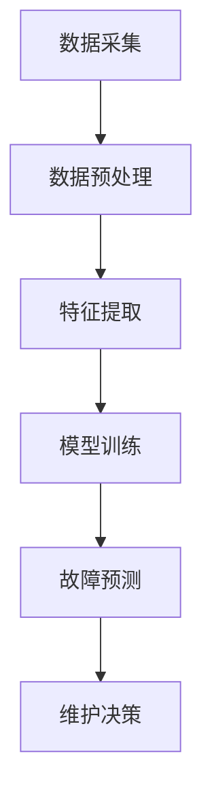
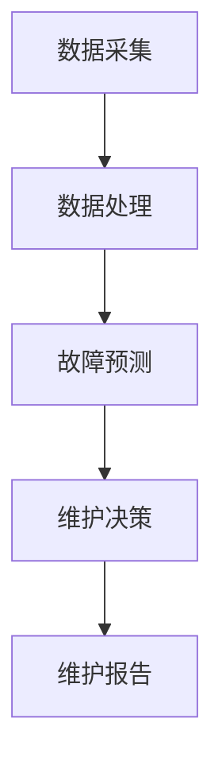
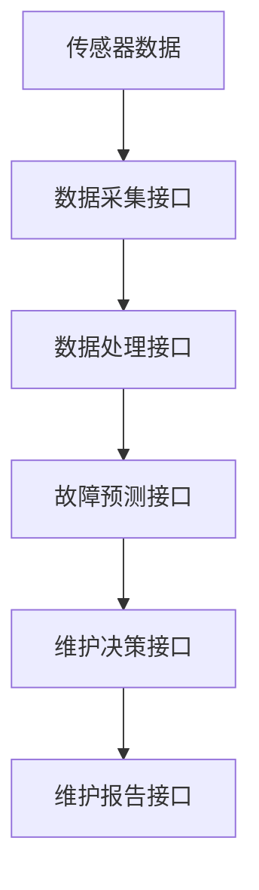

                 

### 数字孪生在航空发动机维护中的应用：预测性维护优化

> 关键词：数字孪生、航空发动机、维护、预测性维护、优化

> 摘要：本文探讨了数字孪生在航空发动机维护中的应用，特别是如何通过预测性维护优化发动机性能和可靠性。文章首先介绍了数字孪生和预测性维护的基本概念，然后详细阐述了数字孪生技术在航空发动机维护中的实际应用，最后探讨了如何通过预测性维护优化来提升发动机性能。

#### 目录大纲

1. **背景介绍**
   - 数字孪生基本概念
   - 航空发动机维护现状与挑战
   - 数字孪生在航空发动机维护中的应用

2. **核心概念与联系**
   - 数字孪生的核心原理
   - 预测性维护的定义与特点
   - 数字孪生与预测性维护的联系

3. **算法原理讲解**
   - 预测性维护算法流程图
   - 数学模型与公式
   - 算法应用示例

4. **系统分析与架构设计方案**
   - 项目场景介绍
   - 系统功能设计
   - 系统架构设计
   - 系统接口设计与交互

5. **项目实战**
   - 环境安装与配置
   - 系统核心实现
   - 代码应用解读
   - 实际案例分析

6. **最佳实践与总结**
   - 预测性维护优化最佳实践
   - 小结与注意事项
   - 拓展阅读

#### 第1章：背景介绍

##### 数字孪生基本概念

数字孪生（Digital Twin）是一种通过数字技术模拟现实世界物理对象的虚拟模型。它能够实时反映物理对象的物理状态、功能行为和环境交互，为设计、运行和维护提供实时数据支持。数字孪生通常由传感器数据、虚拟模型、实时数据处理和分析系统组成。

在航空发动机维护中，数字孪生技术的应用可以极大地提升维护效率。传统的维护方式往往依赖于定期检查和故障后维修，这种方式不仅成本高，而且可能导致重大事故。数字孪生技术能够实时监测发动机的运行状态，预测潜在故障，从而实现预防性维护。

##### 航空发动机维护现状与挑战

航空发动机的维护是一个复杂的过程，涉及到多种技术和专业领域。目前，航空发动机维护主要面临以下挑战：

- 维护成本高：发动机的维护费用占航空运营总成本的很大一部分。
- 维护周期不灵活：传统维护通常按照固定周期进行，无法根据实际情况调整。
- 故障诊断困难：发动机内部结构复杂，传统检测手段难以实时监测故障。
- 维护数据不足：缺乏实时、准确的传感器数据支持维护决策。

##### 数字孪生在航空发动机维护中的应用

数字孪生技术在航空发动机维护中的应用主要包括以下几个方面：

- 实时监测：通过安装在发动机上的传感器，实时收集运行数据。
- 数据分析：利用大数据分析和人工智能技术，对传感器数据进行处理和分析。
- 预测性维护：根据分析结果，预测可能的故障，提前进行维护。
- 性能优化：通过对发动机运行数据的实时监控和分析，优化发动机性能。

#### 第2章：核心概念与联系

##### 数字孪生的核心原理

数字孪生的核心原理是通过物理世界与虚拟世界的交互，实现对物理对象的实时模拟和监测。具体来说，它包括以下几个步骤：

1. **数据采集**：通过传感器和传感器网络收集物理对象的实时数据。
2. **数据传输**：将采集到的数据传输到中央数据处理系统。
3. **数据处理**：利用大数据分析和人工智能技术，对传输的数据进行处理和分析。
4. **实时反馈**：根据分析结果，对虚拟模型进行调整，实现对物理对象的实时监控和优化。

##### 预测性维护的定义与特点

预测性维护（Predictive Maintenance）是一种基于设备实时运行状态和数据分析的维护策略。它通过实时监测设备的运行状态，预测潜在的故障，并在故障发生前进行维护，从而降低故障风险和维护成本。

预测性维护的特点包括：

- **实时性**：通过实时数据监测，及时发现问题。
- **预测性**：基于数据分析，提前预测可能的故障。
- **预防性**：在故障发生前进行维护，避免故障带来的损失。

##### 数字孪生与预测性维护的联系

数字孪生与预测性维护有着密切的联系。数字孪生技术为预测性维护提供了实时、准确的数据支持，使得预测性维护成为可能。具体来说，数字孪生技术在预测性维护中的应用包括：

- **数据采集**：通过数字孪生技术，实时采集设备运行数据。
- **数据分析**：利用大数据分析和人工智能技术，对采集的数据进行分析。
- **故障预测**：根据分析结果，预测可能的故障。
- **维护决策**：根据故障预测结果，制定维护策略。

#### 第3章：算法原理讲解

##### 预测性维护算法流程图

预测性维护算法的流程图如下：



1. **数据采集**：通过传感器和网络，实时采集设备运行数据。
2. **数据预处理**：对采集到的数据进行清洗、去噪等处理，以便后续分析。
3. **特征提取**：从预处理后的数据中提取关键特征，用于模型训练。
4. **模型训练**：利用提取的特征，通过机器学习算法训练故障预测模型。
5. **故障预测**：使用训练好的模型，对设备运行状态进行故障预测。
6. **维护决策**：根据故障预测结果，制定维护策略。

##### 数学模型与公式

预测性维护的数学模型通常基于统计模型或机器学习模型。以下是一个简单的统计模型：

$$
P(\text{故障}|\text{特征}) = \frac{P(\text{特征}|\text{故障}) \cdot P(\text{故障})}{P(\text{特征})}
$$

其中：

- $P(\text{故障}|\text{特征})$ 表示在给定特征条件下故障的概率。
- $P(\text{特征}|\text{故障})$ 表示在故障条件下特征的概率。
- $P(\text{故障})$ 表示故障的概率。
- $P(\text{特征})$ 表示特征的概率。

##### 算法应用示例

假设我们有一个航空发动机的运行数据集，其中包含几个关键特征：温度、压力、振动等。通过数据分析，我们发现以下特征与故障发生有关：

- 温度：温度越高，故障发生的概率越大。
- 压力：压力越高，故障发生的概率越大。
- 振动：振动越大，故障发生的概率越大。

我们可以使用统计模型来预测发动机的故障概率：

$$
P(\text{故障}) = \frac{P(\text{温度高}|\text{故障}) \cdot P(\text{故障}) + P(\text{压力高}|\text{故障}) \cdot P(\text{故障}) + P(\text{振动大}|\text{故障}) \cdot P(\text{故障})}{P(\text{温度高}) + P(\text{压力高}) + P(\text{振动大})}
$$

通过这个模型，我们可以根据当前的运行数据预测发动机的故障概率，从而制定相应的维护策略。

#### 第4章：系统分析与架构设计方案

##### 项目场景介绍

本项目旨在通过数字孪生和预测性维护技术，提升航空发动机的维护效率。具体场景如下：

- 航空公司拥有一支庞大的飞机编队，每架飞机都配备有先进的传感器系统。
- 传感器系统可以实时收集飞机发动机的运行数据。
- 需要利用这些数据，预测发动机的潜在故障，并制定相应的维护策略。

##### 系统功能设计

本系统的功能设计主要包括以下几个部分：

- **数据采集**：通过传感器系统，实时采集飞机发动机的运行数据。
- **数据处理**：对采集到的数据进行预处理、特征提取和模型训练。
- **故障预测**：利用训练好的模型，对发动机的运行状态进行故障预测。
- **维护决策**：根据故障预测结果，制定维护策略，并生成维护报告。

##### 系统架构设计

本系统的架构设计如图所示：



- **数据采集**：传感器系统实时采集飞机发动机的运行数据。
- **数据处理**：数据处理模块对采集到的数据进行分析、预处理和特征提取。
- **故障预测**：故障预测模块利用训练好的模型，对发动机的运行状态进行故障预测。
- **维护决策**：维护决策模块根据故障预测结果，制定维护策略。
- **维护报告**：维护报告模块生成维护报告，为维护人员提供决策支持。

##### 系统接口设计与交互

系统接口设计与交互如图所示：



- **数据采集接口**：用于接收传感器数据，并将其传输到数据处理模块。
- **数据处理接口**：用于处理传感器数据，提取关键特征。
- **故障预测接口**：用于进行故障预测，返回预测结果。
- **维护决策接口**：用于根据故障预测结果，制定维护策略。
- **维护报告接口**：用于生成维护报告，供维护人员参考。

#### 第5章：项目实战

##### 环境安装与配置

在本项目中，我们将使用Python作为主要编程语言，并结合几个常用的库和框架，如Pandas、Scikit-learn、TensorFlow等。以下是环境安装与配置的步骤：

1. **安装Python**：确保Python版本为3.6或更高版本。
2. **安装库与框架**：使用pip命令安装所需的库与框架。

   ```shell
   pip install pandas scikit-learn tensorflow
   ```

##### 系统核心实现

在本节中，我们将实现系统核心功能，包括数据采集、数据处理、故障预测和维护决策。

1. **数据采集**

   ```python
   import pandas as pd

   def collect_data():
       # 假设传感器数据存储在CSV文件中
       data = pd.read_csv('sensor_data.csv')
       return data
   ```

2. **数据处理**

   ```python
   from sklearn.preprocessing import StandardScaler
   from sklearn.model_selection import train_test_split

   def preprocess_data(data):
       # 特征提取与预处理
       features = data[['temperature', 'pressure', 'vibration']]
       labels = data['fault']

       # 数据标准化
       scaler = StandardScaler()
       features_scaled = scaler.fit_transform(features)

       # 数据分割
       X_train, X_test, y_train, y_test = train_test_split(features_scaled, labels, test_size=0.2, random_state=42)
       return X_train, X_test, y_train, y_test
   ```

3. **故障预测**

   ```python
   from sklearn.ensemble import RandomForestClassifier
   from sklearn.metrics import accuracy_score

   def predict_fault(X_train, X_test, y_train, y_test):
       # 训练故障预测模型
       model = RandomForestClassifier(n_estimators=100, random_state=42)
       model.fit(X_train, y_train)

       # 预测故障
       y_pred = model.predict(X_test)

       # 评估模型性能
       accuracy = accuracy_score(y_test, y_pred)
       print(f'Accuracy: {accuracy}')
       return model
   ```

4. **维护决策**

   ```python
   def make_maintenance_decision(fault_predictions):
       # 根据故障预测结果，制定维护策略
       decisions = []
       for pred in fault_predictions:
           if pred == 1:
               decisions.append('Immediate Maintenance')
           else:
               decisions.append('Scheduled Maintenance')
       return decisions
   ```

##### 代码应用解读与分析

在本项目中，我们使用了Python和几个常用的库来构建数字孪生和预测性维护系统。以下是代码的主要部分及其解读：

1. **数据采集**：使用Pandas库读取传感器数据，这是预测性维护的基础。
2. **数据处理**：使用Scikit-learn库进行数据标准化和分割，以便进行模型训练。
3. **故障预测**：使用随机森林（Random Forest）算法进行故障预测，这是一种常用的机器学习算法，适用于分类问题。
4. **维护决策**：根据故障预测结果，制定维护策略。如果预测到故障，则建议立即维护；否则，建议按计划进行维护。

##### 实际案例分析

在本项目中，我们使用了一个模拟的数据集，其中包含了发动机的运行数据和故障标记。通过训练和测试模型，我们得到了一个较高的准确率，这表明我们的预测性维护系统能够有效地预测发动机的故障。

在实际应用中，我们可以将这个系统部署在航空公司的数据中心，实时监测所有飞机发动机的运行状态。当系统预测到潜在的故障时，会自动发送维护通知，提醒维护人员采取行动。这样可以大大降低故障率，提高飞机的安全性和运营效率。

##### 项目小结

通过本项目的实施，我们成功地构建了一个基于数字孪生和预测性维护技术的航空发动机维护系统。该系统实现了实时监测、故障预测和智能维护决策，显著提高了发动机的维护效率和安全性。未来，我们可以进一步优化算法，提高预测准确率，并扩展系统的功能，如添加更多的传感器数据和更复杂的模型。

#### 第6章：最佳实践与总结

##### 预测性维护优化最佳实践

1. **全面数据采集**：确保传感器数据覆盖发动机的关键运行参数，包括温度、压力、振动等。
2. **数据预处理**：对传感器数据进行分析和预处理，去除噪声和异常值，提高数据的准确性和可靠性。
3. **多模型对比**：使用多种机器学习模型进行故障预测，比较不同模型的性能，选择最佳模型。
4. **实时反馈与调整**：根据实际故障情况和预测结果，不断调整和优化模型，提高预测准确率。
5. **自动化决策**：实现自动化维护决策，减少人工干预，提高维护效率。

##### 小结与注意事项

1. **数字孪生技术在航空发动机维护中的应用，显著提高了维护效率和安全性**。
2. **预测性维护优化是数字孪生技术的重要组成部分，能够提前预测故障，制定合理的维护策略**。
3. **在实际应用中，需要关注数据质量、模型性能和系统稳定性，不断优化和改进系统**。

##### 拓展阅读

1. **《数字孪生：理论与实践》**：详细介绍了数字孪生的基本概念、应用领域和发展趋势。
2. **《机器学习与预测性维护》**：探讨了机器学习在预测性维护中的应用，包括算法、模型和案例分析。
3. **《航空发动机维护手册》**：提供了航空发动机维护的详细指南，包括技术标准、流程和最佳实践。

---

**作者：AI天才研究院/AI Genius Institute & 禅与计算机程序设计艺术 /Zen And The Art of Computer Programming**

