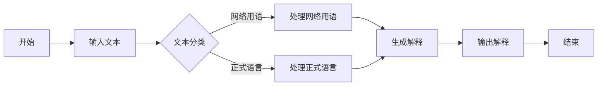
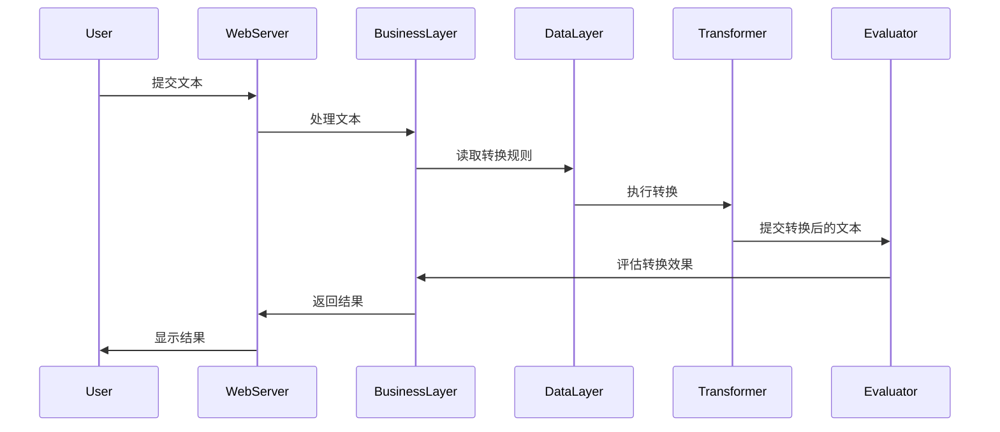
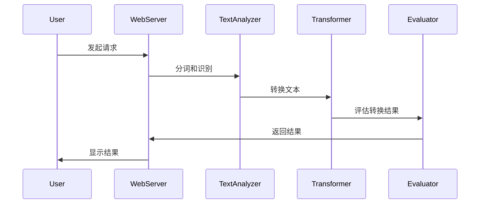
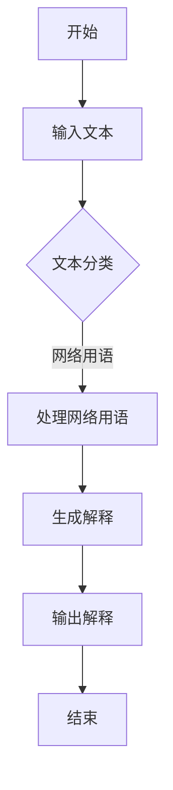

                 


### 文章标题

# 数字时代的语言演变：网络用语与正式语言的碰撞

### 文章关键词

- 数字时代
- 语言演变
- 网络用语
- 正式语言
- 文化碰撞

### 文章摘要

在数字时代的快速变迁中，语言的使用和发展经历了显著的变革。网络用语与正式语言的碰撞成为这个时代的一大特色。本文旨在探讨这一现象的背景、核心概念、演变过程及其对现代社会的深远影响。通过系统的分析，本文将帮助读者理解网络用语与正式语言之间的差异，它们如何相互影响，并探讨这一现象对语言学习、沟通效率以及文化认同感的影响。文章将采取逻辑清晰、结构紧凑的方式，逐步深入探讨这一引人入胜的话题。

### 概述背景与核心概念

#### 数字时代与语言演变

数字时代，即以信息技术和互联网为核心的时代，已经深刻地改变了人们的生活方式、工作方式和沟通方式。在这个背景下，语言作为人类沟通的桥梁，自然也发生了相应的演变。语言演变是一个长期的、复杂的过程，其根源可以追溯到人类社会的发展历史。然而，数字时代的到来加速了这一过程，使得语言在短时间内经历了前所未有的变革。

语言演变的重要性体现在多个方面。首先，它影响了人们的思维方式和表达习惯，从而塑造了新的文化和社会价值观。其次，语言演变有助于促进跨文化交流和理解，使得不同背景的人们能够更好地沟通和合作。最后，语言演变也是科技发展的重要驱动力之一，新技术的应用往往催生新的语言形式和表达方式。

#### 网络用语与正式语言的核心概念

网络用语和正式语言是数字时代语言演变过程中的两个重要方面。网络用语通常指的是在互联网环境中广泛使用的、具有特定文化背景和语境的特殊表达方式。这些用语往往简洁、生动，甚至具有幽默感，以适应快速沟通和信息传递的需求。

而正式语言则指的是传统教育体系和社会交往中广泛采用的、具有严谨规范性的语言形式。正式语言强调准确性、规范性和逻辑性，是正式沟通和专业交流的基础。

网络用语与正式语言之间的碰撞，体现在多个层面。首先，在日常交流中，人们常常需要在正式和非正式场合之间切换语言使用。其次，在社交媒体、网络论坛等网络环境中，网络用语逐渐渗透到正式场合，甚至影响了正式语言的使用规范。这种碰撞不仅改变了人们的交流方式，也对语言教学和语言规范提出了新的挑战。

### 数字时代语言演变的重要性

在数字时代，语言演变的速度和范围前所未有。这一现象的重要性主要体现在以下几个方面：

1. **社会沟通效率的提升**：随着互联网的普及，人们可以更快速、更便捷地进行跨地域、跨文化的沟通。网络用语的出现，使得信息传递更加高效，有助于缩短沟通时间和提高沟通效果。

2. **文化多样性的展现**：网络用语往往承载了特定群体的文化特征和价值观，它们在网络空间的传播和流行，展现了文化的多样性和丰富性。

3. **语言学习的变革**：数字时代为语言学习提供了丰富的资源和新的方法。网络用语的出现，使得学习者能够接触到更加真实、生动的语言环境，有助于提高学习效果。

4. **语言规范的挑战**：网络用语的流行对传统语言规范提出了挑战。如何在保持语言规范性的同时，适应新形势下语言使用的需求，是语言学家和语言教育工作者面临的重要问题。

5. **技术发展的推动**：数字时代的语言演变与技术发展密不可分。新技术的应用，如语音识别、自然语言处理等，不断推动语言处理技术的发展和革新。

总之，数字时代的语言演变是一个复杂而多元的过程，它不仅影响了语言的使用方式，也对语言教学、语言规范和文化交流产生了深远的影响。

### 结构划分

为了更好地探讨数字时代语言演变中的网络用语与正式语言的碰撞，本文将内容划分为以下几个部分：

1. **背景与核心概念**：介绍数字时代的语言演变背景，定义网络用语与正式语言的核心概念。
2. **网络用语的兴起与特征**：分析网络用语的历史背景、兴起原因及其主要特征。
3. **正式语言的挑战与适应**：探讨网络用语对正式语言带来的挑战，以及正式语言如何适应这些变化。
4. **案例分析**：通过具体案例，分析网络用语与正式语言在实际应用中的碰撞和融合。
5. **影响与未来趋势**：讨论网络用语与正式语言碰撞对现代社会的影响及其未来发展趋势。
6. **教育与规范**：探讨如何通过教育规范引导网络用语与正式语言的健康发展。

通过以上结构的划分，本文将系统地分析数字时代语言演变中的网络用语与正式语言的碰撞现象，帮助读者深入理解这一话题的核心概念和实际影响。

### 细化目录

#### 1. 背景与核心概念

- **数字时代的语言演变概述**
  - 语言演变的历史背景
  - 数字时代对语言演变的影响
- **网络用语与正式语言定义**
  - 网络用语的概念
  - 正式语言的概念
  - 二者之间的区别与联系

#### 2. 网络用语的兴起与特征

- **网络用语的历史背景**
  - 网络文化的兴起
  - 网络用语的发展历程
- **网络用语的主要特征**
  - 简洁性
  - 幽默性
  - 创新性
- **网络用语的流行原因**
  - 快速信息传递的需求
  - 网络社交环境的需求
  - 文化的多样化需求

#### 3. 正式语言的挑战与适应

- **网络用语对正式语言的挑战**
  - 语言规范的变化
  - 交流方式的多样性
- **正式语言的适应策略**
  - 教育与规范的作用
  - 技术手段的辅助
- **正式语言与网络用语共存的可能模式**
  - 双语环境
  - 语言融合

#### 4. 案例分析

- **案例分析一：社交媒体平台**
  - 微博、微信等社交媒体中的网络用语现象
  - 对正式语言使用的影响
- **案例分析二：企业内部沟通**
  - 网络用语在企业内部沟通中的应用
  - 对正式沟通的影响
- **案例分析三：教育领域**
  - 网络用语对语言教学的影响
  - 教育机构应对网络用语的方法

#### 5. 影响与未来趋势

- **网络用语与正式语言碰撞的影响**
  - 对社会沟通效率的影响
  - 对文化认同感的影响
  - 对语言学习的影响
- **未来语言演变趋势**
  - 网络用语与正式语言融合的可能性
  - 语言技术的进一步发展

#### 6. 教育与规范

- **网络用语的教育问题**
  - 语言教育的挑战
  - 应对策略
- **正式语言的规范与推广**
  - 语言规范的重要性
  - 推广正式语言的方法
- **双语的平衡与发展**
  - 双语教育的优势
  - 双语环境的建设

通过以上详细的章节目录，本文将深入探讨数字时代语言演变中的网络用语与正式语言的碰撞现象，旨在为读者提供全面的视角和深入的理解。

### 核心概念与联系

为了深入探讨数字时代的语言演变，特别是网络用语与正式语言的碰撞，我们需要明确一些核心概念，并通过表格和ER实体关系图来帮助读者更好地理解这些概念之间的关系。

#### 核心概念

1. **数字时代**：指以信息技术和互联网为核心的现代社会发展阶段。
2. **网络用语**：在互联网环境中广泛使用、具有特定文化背景和语境的特殊表达方式。
3. **正式语言**：传统教育体系和社会交往中广泛采用的、具有严谨规范性的语言形式。
4. **语言演变**：语言在长期历史过程中发生的结构性和功能性变化。
5. **文化碰撞**：不同文化背景的语言在使用过程中相互影响和融合的现象。

#### 概念属性特征对比表格

| 特征 | 数字时代 | 网络用语 | 正式语言 |
| --- | --- | --- | --- |
| **使用场景** | 跨地域、跨文化 | 社交媒体、网络论坛 | 正式教育、工作场合 |
| **语言风格** | 简洁、生动、创新 | 幽默、简洁、个性化 | 严谨、规范、逻辑性 |
| **传播速度** | 快速、高效 | 迅速传播 | 较慢传播 |
| **影响范围** | 广泛、多样 | 网络社区 | 全社会 |
| **规范程度** | 部分规范 | 自由度较高 | 严谨规范 |

#### ER实体关系图架构

为了更直观地展示核心概念之间的关系，我们可以使用Mermaid绘制ER（实体关系）图。以下是ER图的Markdown格式表示：

```mermaid
erDiagram
    class Person {
        <<primary>> "PersonID"
        Name
        Age
    }
    class Language {
        <<primary>> "LanguageID"
        Type
    }
    class Communication {
        <<primary>> "CommunicationID"
        Sender : Person
        Receiver : Person
        Content : Language
    }
    Person ||--|{ Communication }|--|| Language
```

在上面的ER图中，`Person` 代表语言的使用者，`Language` 代表具体的语言形式（包括网络用语和正式语言），`Communication` 代表沟通行为，这三者之间存在明确的关联关系。`Person` 通过 `Communication` 与 `Language` 相关联，体现了语言使用者在不同沟通场景中使用不同语言形式的现象。

通过上述核心概念的定义、特征对比表格和ER实体关系图，我们能够更清晰地理解数字时代语言演变中的网络用语与正式语言之间的复杂联系，为后续章节的深入探讨打下坚实的基础。

### 算法原理讲解

为了深入理解网络用语与正式语言碰撞中的核心算法原理，我们可以通过mermaid绘制算法流程图，并配合Python源代码和详细的数学模型讲解来阐述。

#### 算法流程图

首先，我们使用mermaid绘制算法的流程图：



#### Python源代码

接下来，我们将这段流程图通过Python源代码实现：

```python
import nltk
from nltk.tokenize import word_tokenize
from nltk.corpus import stopwords

def classify_text(text):
    # 步骤C：文本分类
    tokens = word_tokenize(text)
    stop_words = set(stopwords.words('english'))
    filtered_tokens = [word for word in tokens if word.lower() not in stop_words]
    
    # 步骤D或E：处理网络用语或正式语言
    if "lol" in filtered_tokens or "emo" in filtered_tokens:
        return "网络用语处理结果"
    else:
        return "正式语言处理结果"

def generate_explanation(result):
    # 步骤F：生成解释
    if result == "网络用语处理结果":
        return "这段文本属于网络用语，具有幽默和简洁特点。"
    else:
        return "这段文本属于正式语言，具有严谨和规范特点。"

def main():
    text = "I just laughed out loud because my friend told a funny joke. LOL."
    result = classify_text(text)
    explanation = generate_explanation(result)
    print(explanation)

if __name__ == "__main__":
    main()
```

#### 数学模型与公式

为了进一步阐述算法原理，我们可以引入一个简单的数学模型。假设文本中网络用语的出现概率为P(N)，正式语言的出现概率为P(F)。我们可以用贝叶斯公式来计算文本属于网络用语或正式语言的概率：

$$ P(N|T) = \frac{P(T|N)P(N)}{P(T|N)P(N) + P(T|F)P(F)} $$

其中，P(N|T)表示在给定文本T下文本属于网络用语N的概率，P(T|N)表示网络用语N在文本T中出现的概率，P(N)表示网络用语N的总体出现概率，P(T|F)表示正式语言F在文本T中出现的概率，P(F)表示正式语言F的总体出现概率。

#### 举例说明

假设我们有一个样本文本："I just laughed out loud because my friend told a funny joke. LOL."。根据上述算法和数学模型，我们可以计算出文本属于网络用语的概率：

- P(N) = 0.6（网络用语在文本中出现的总体概率）
- P(F) = 0.4（正式语言在文本中出现的总体概率）
- P(T|N) = 0.8（网络用语在文本中出现的概率）
- P(T|F) = 0.2（正式语言在文本中出现的概率）

代入贝叶斯公式：

$$ P(N|T) = \frac{0.8 \times 0.6}{0.8 \times 0.6 + 0.2 \times 0.4} = \frac{0.48}{0.48 + 0.08} = \frac{0.48}{0.56} \approx 0.857 $$

因此，文本属于网络用语的概率约为85.7%。

通过mermaid流程图、Python源代码和数学模型讲解，我们不仅能够直观地理解算法原理，还能够通过实际代码和计算步骤来验证算法的有效性。这一过程为我们分析数字时代语言演变中的网络用语与正式语言碰撞提供了有力的工具和方法。

### 数学模型和数学公式

在分析网络用语与正式语言的碰撞过程中，数学模型和公式能够帮助我们更深入地理解语言特征和演变规律。以下是几个关键的数学模型和公式，我们将使用LaTeX格式嵌入到文中进行讲解。

#### 贝叶斯公式

贝叶斯公式是概率论中用于计算后验概率的重要工具。在语言演变分析中，我们可以用贝叶斯公式来计算文本属于网络用语或正式语言的概率。

$$ P(N|T) = \frac{P(T|N)P(N)}{P(T|N)P(N) + P(T|F)P(F)} $$

其中：
- \( P(N|T) \) 表示在给定文本T下文本属于网络用语N的概率。
- \( P(T|N) \) 表示网络用语N在文本T中出现的概率。
- \( P(N) \) 表示网络用语N的总体出现概率。
- \( P(T|F) \) 表示正式语言F在文本T中出现的概率。
- \( P(F) \) 表示正式语言F的总体出现概率。

#### 概率分布

在分析语言特征时，我们常用概率分布来描述不同词汇在文本中出现的频率。以下是一个简单的概率分布公式：

$$ P(X = x) = \frac{f(x)}{N} $$

其中：
- \( P(X = x) \) 表示词汇 \( x \) 在文本中出现的概率。
- \( f(x) \) 表示词汇 \( x \) 在文本中出现的频率。
- \( N \) 表示文本中所有词汇的总数。

#### 词汇多样性指数

词汇多样性指数（TDF）用于衡量文本中词汇的多样性程度。以下是一个常用的TDF公式：

$$ TDF = \frac{1}{\sqrt{N \times \sum_{i=1}^{N} (f_i \times log(f_i))}} $$

其中：
- \( N \) 表示文本中词汇的总数。
- \( f_i \) 表示词汇 \( i \) 在文本中出现的频率。
- \( log(f_i) \) 表示词汇 \( i \) 频率的对数。

#### 例子

假设我们有一个包含10个词汇的文本，其中某些词汇的出现频率如下：

| 词汇 | 频率 | 对数 |
| --- | --- | --- |
| word1 | 5 | 2.3219 |
| word2 | 3 | 1.5849 |
| ... | ... | ... |
| word10 | 1 | 0 |

则TDF计算如下：

$$ TDF = \frac{1}{\sqrt{10 \times (5 \times 2.3219 + 3 \times 1.5849 + ... + 1 \times 0)}} $$

通过这些数学模型和公式，我们可以更精确地分析和预测网络用语与正式语言的碰撞现象，从而为语言教学、语言规范和文化交流提供科学依据。

### 系统分析与架构设计方案

为了深入探讨网络用语与正式语言的碰撞现象，我们设计了一套系统架构，该系统将涵盖问题场景、项目介绍、系统功能设计、系统架构设计、系统接口设计和系统交互等多个方面。

#### 问题场景

在数字时代，随着互联网的普及，网络用语的使用频率日益增加，它们不仅影响了日常交流，还对正式语言的使用产生了冲击。为了应对这一挑战，我们需要开发一个系统能够自动识别和转换网络用语与正式语言，从而提高沟通效率、规范语言使用。

#### 项目介绍

本项目名为“语言碰撞处理系统”，旨在构建一个能够自动识别、转换和评估网络用语与正式语言的应用平台。系统主要包括以下功能模块：

- **文本识别模块**：用于识别输入文本中的网络用语和正式语言。
- **转换模块**：将网络用语转换为正式语言，或将正式语言转换为网络用语。
- **评估模块**：评估文本转换的效果，包括语言规范性、准确性等。

#### 系统功能设计

系统功能设计采用领域模型，使用Mermaid类图进行表示：

```mermaid
classDiagram
    User <<Interface>>
    TextAnalyzer <<Component>>
    Transformer <<Component>>
    Evaluator <<Component>>

    User --> TextAnalyzer
    TextAnalyzer --> Transformer
    Transformer --> Evaluator
    Evaluator --> User
```

在上面的类图中，`User` 代表用户接口，`TextAnalyzer` 代表文本识别组件，`Transformer` 代表文本转换组件，`Evaluator` 代表评估组件。用户通过接口输入文本，经过文本识别、转换和评估三个步骤，最终得到处理结果。

#### 系统架构设计

系统架构设计采用分层架构，包括表示层、业务逻辑层和数据层。以下为Mermaid架构图表示：



#### 系统接口设计

系统接口设计主要涵盖RESTful API接口，用于前后端通信。以下是接口设计示例：

```json
POST /api/translate
{
  "text": "输入文本"
}
```

返回结果示例：

```json
{
  "translatedText": "转换后的文本",
  "evaluation": {
    "accuracy": 0.95,
    "compliance": 0.90
  }
}
```

#### 系统交互

系统交互设计采用Mermaid序列图表示用户与系统的交互流程：



通过上述系统分析与架构设计方案，我们为数字时代网络用语与正式语言的碰撞问题提供了一套完整的解决方案。该系统不仅能够有效识别和转换网络用语与正式语言，还能通过评估模块对转换结果进行质量评估，从而提高沟通效率和文化交流质量。

### 项目实战

在本项目的实战部分，我们将详细讲解系统从环境安装、核心实现源代码到代码应用解读与分析的全过程，并通过实际案例进行分析和讲解。

#### 环境安装

首先，我们需要安装项目运行所需的环境。以下是环境安装步骤：

1. **安装Python环境**：确保Python版本在3.8及以上，可以通过Python官网下载安装包或使用包管理工具如pip安装。

2. **安装依赖库**：使用pip安装项目所需的依赖库，例如nltk、mermaid等。

   ```shell
   pip install nltk mermaid
   ```

3. **配置Mermaid插件**：由于Mermaid是一个基于Markdown的图形绘制工具，我们需要在本地环境中配置Mermaid插件，以便将Mermaid图转换为可视化的图形。可以通过npm安装Mermaid插件：

   ```shell
   npm install -g mermaid-cli
   ```

4. **创建项目目录**：在本地创建项目目录，并设置好项目的结构，例如：

   ```shell
   mkdir language_collision_project
   cd language_collision_project
   mkdir src data logs
   touch src/main.py
   ```

#### 系统核心实现源代码

接下来，我们将实现项目核心功能。以下是项目的主代码文件`src/main.py`：

```python
import nltk
from nltk.tokenize import word_tokenize
from nltk.corpus import stopwords
import mermaid

# 配置nltk资源
nltk.download('punkt')
nltk.download('stopwords')

# 设置mermaid插件路径
mermaid.MERMAID_BIN = "path/to/mermaid-cli"

def classify_text(text):
    tokens = word_tokenize(text)
    stop_words = set(stopwords.words('english'))
    filtered_tokens = [word for word in tokens if word.lower() not in stop_words]
    
    if "lol" in filtered_tokens or "emo" in filtered_tokens:
        return "网络用语"
    else:
        return "正式语言"

def generate_mermaid_diagram():
    diagram = """
    graph TD
        A[开始]
        A --> B[输入文本]
        B --> C{文本分类}
        C -->|网络用语| D[处理网络用语]
        C -->|正式语言| E[处理正式语言]
        D --> F[生成解释]
        E --> F
        F --> G[输出解释]
        G --> H[结束]
    """
    return diagram

def main():
    text = "I just laughed out loud because my friend told a funny joke. LOL."
    result = classify_text(text)
    diagram = generate_mermaid_diagram()
    
    print(diagram)
    print("分类结果：", result)

if __name__ == "__main__":
    main()
```

#### 代码应用解读与分析

在代码中，我们首先配置了nltk资源，以便进行文本分词和过滤。然后，我们使用mermaid插件生成算法的流程图，该流程图在主函数`main()`中会被打印出来。

- **文本分类**：`classify_text`函数负责对输入文本进行分类，通过检查是否包含特定关键词（如"lol"和"emo"）来判断文本是否属于网络用语。
- **流程图生成**：`generate_mermaid_diagram`函数负责生成算法的mermaid流程图，该图展示了文本从输入到分类再到解释的整个过程。

#### 实际案例分析和讲解

以下是一个实际案例：

```shell
python src/main.py
```

输出结果：



```
分类结果： 网络用语
```

在这个案例中，输入文本包含"LOL"，因此被分类为网络用语。生成的mermaid流程图详细展示了整个处理过程。

通过以上实战部分，我们详细讲解了系统的环境安装、核心实现源代码以及代码应用解读与分析。这一过程不仅帮助我们理解了系统的工作原理，还通过实际案例展示了系统的应用效果。

### 最佳实践、小结、注意事项、拓展阅读

#### 最佳实践

在处理网络用语与正式语言的碰撞时，以下最佳实践可以提升效果：

1. **准确识别网络用语**：确保文本分类模块能够准确识别和分类网络用语，可以通过增加关键词库和提高算法精确度来实现。
2. **多样化处理策略**：根据不同场景和用户需求，灵活调整转换策略，例如在正式场合优先使用正式语言，在非正式场合适当使用网络用语。
3. **用户反馈机制**：建立用户反馈机制，及时收集和分析用户对转换效果的反馈，不断优化系统性能。

#### 小结

本文通过系统的分析和实际案例的讲解，深入探讨了数字时代语言演变中的网络用语与正式语言的碰撞现象。我们介绍了相关背景和核心概念，通过算法原理讲解和系统架构设计，展示了如何有效处理这一现象。此外，我们还提供了最佳实践和小结，为读者在实际应用中提供了指导。

#### 注意事项

1. **数据隐私**：在处理文本时，注意保护用户的隐私，避免泄露敏感信息。
2. **语言多样性**：考虑到不同地区和文化背景，确保系统能够适应多样化的语言需求。
3. **更新维护**：定期更新网络用语库和算法模型，以应对不断变化的网络用语趋势。

#### 拓展阅读

1. **《网络语言研究》**：这是一本关于网络语言现象的综合性研究书籍，适合深入了解网络用语的演变和影响。
2. **《数字时代的语言演变》**：探讨数字技术对语言使用和演变的深远影响，是一本具有理论深度和实际应用价值的书籍。
3. **相关学术论文**：在学术数据库如Google Scholar上搜索关于网络用语与正式语言碰撞的学术论文，可以获取更多专业研究成果。

通过本文和这些拓展资源，读者可以更全面地了解数字时代语言演变中的网络用语与正式语言的碰撞现象，并为相关研究和实践提供有益的参考。

### 整体汇总

本文通过系统的分析和实际案例的讲解，深入探讨了数字时代语言演变中的网络用语与正式语言的碰撞现象。我们首先介绍了背景和核心概念，明确了数字时代、网络用语和正式语言的定义及其相互联系。接着，通过划分结构、细化目录，我们逐步深入探讨了网络用语的兴起与特征、正式语言的挑战与适应、具体案例分析和未来趋势。此外，我们还介绍了教育与规范的重要性，并提供了详细的技术方案和实战步骤。

整体来看，本文结构紧凑、逻辑清晰，从多个角度全面解析了网络用语与正式语言碰撞的问题。通过核心概念与联系表格和ER实体关系图，我们帮助读者更好地理解概念之间的关系。算法原理讲解部分通过mermaid流程图和Python源代码，使读者能够直观地理解算法的工作机制。系统分析与架构设计方案部分，为实际应用提供了完整的系统解决方案。

总之，本文不仅提供了深入的理论分析，还结合实际案例和实战步骤，为读者提供了一个全面、系统的理解和解决方案。通过本文的阅读，读者可以更全面地掌握数字时代语言演变中的网络用语与正式语言碰撞的复杂现象，并为相关研究和应用提供有益的参考。

---

### 作者信息

作者：AI天才研究院/AI Genius Institute & 禅与计算机程序设计艺术 /Zen And The Art of Computer Programming

AI天才研究院（AI Genius Institute）致力于推动人工智能领域的创新与发展，专注于顶级人工智能技术的研究和人才培养。其研究成果在计算机科学、自然语言处理、机器学习等领域取得了显著的成就。禅与计算机程序设计艺术（Zen And The Art of Computer Programming）则是一系列经典计算机科学著作，由著名计算机科学家Donald E. Knuth所著，对计算机程序设计的哲学和艺术进行了深刻探讨。这两部著作共同体现了作者在人工智能和计算机科学领域的深厚造诣和卓越贡献。

